# Windows Server Full Lab 4 — Complete Enterprise Domain Environment

## Overview

This lab builds a **complete enterprise-grade Windows Server environment** from scratch. Starting with a fresh domain, it covers every layer of an Active Directory deployment: user management, Group Policy, DHCP, DNS, WDS, Hyper-V, failover, file sharing, printing, backup, and an Additional Domain Controller.

---

## Lab Environment

| Component | Value |
|-----------|-------|
| Domain | `ABC.LOCAL` |
| Primary DC | `PDC` (Windows Server 2022) |
| Additional DC | `ADC` (Windows Server 2022) |
| Core Server | Windows Server Core |
| Client | Windows 10 (deployed via WDS) |
| Network | `192.168.1.0/24` |
| Gateway | `192.168.1.1` |
| PDC IP | `192.168.1.2` |
| ADC IP | `192.168.1.3` |

---

## Task 1 — Create the Domain (ABC.LOCAL)

Create a new Active Directory forest with domain name `ABC.LOCAL` on a server named `PDC`.

**Steps:**
1. Open **Server Manager → Add Roles and Features**
2. Install **Active Directory Domain Services** role
3. Click the notification flag → **Promote this server to a domain controller**
4. Select **Add a new forest**
5. Root domain name: `ABC.LOCAL`
6. Set Forest and Domain functional level: **Windows Server 2016**
7. Set the **DSRM password** (keep this safe)
8. Complete the wizard — server restarts automatically
9. Log in as `ABC\Administrator`

**Screenshot:**

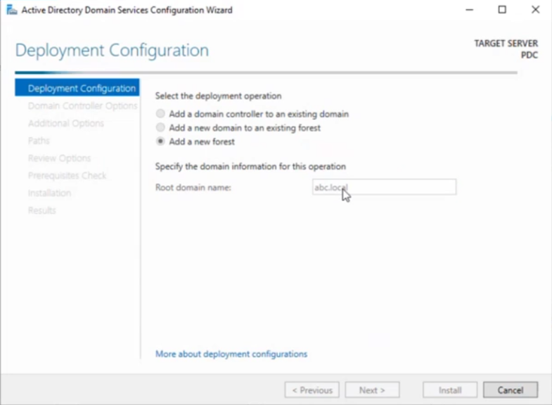

**Post-installation verification:**
```powershell
# Verify domain
Get-ADDomain

# Verify FSMO roles
netdom query fsmo
```

> ℹ️ After promotion, `PDC` holds all 5 FSMO roles: Schema Master, Domain Naming Master, PDC Emulator, RID Master, and Infrastructure Master.

---

## Task 2 — Create Organizational Units (OUs) for Each Department

Organize the domain by creating a dedicated OU for each department.

**Steps:**
1. Open **Active Directory Users and Computers** (`dsa.msc`)
2. Right-click `ABC.LOCAL` → **New → Organizational Unit**
3. Create the following OUs:

| OU Name | Purpose |
|---------|---------|
| HR | Human Resources users and computers |
| Sales | Sales team users and computers |
| Finance | Finance department users and computers |
| Dev | Development team users and computers |
| IT | IT department users and computers |

**Screenshot:**

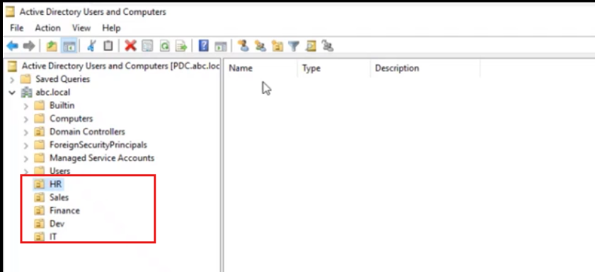

**PowerShell alternative:**
```powershell
$domain = "DC=ABC,DC=LOCAL"
foreach ($dept in @("HR","Sales","Finance","Dev","IT")) {
    New-ADOrganizationalUnit -Name $dept -Path $domain
}
```

---

## Task 3 — Create Users, Groups, and Add Users to Department Groups

For each department, create user accounts, a department group, and add users to their group.

**Steps — GUI:**
1. In ADUC, expand the target OU (e.g., HR)
2. Right-click → **New → User** — fill in first name, last name, logon name
3. Right-click → **New → Group** — name it `HR-Group` (Global, Security)
4. Open the group → **Members tab → Add** the HR users

**Repeat for all 5 departments.**

**Example user and group structure:**

| Department | Sample Users | Group Name |
|------------|-------------|------------|
| HR | hr.user1, hr.user2 | HR-Group |
| Sales | sales.user1, sales.user2 | Sales-Group |
| Finance | finance.user1, finance.user2 | Finance-Group |
| Dev | dev.user1, dev.user2 | Dev-Group |
| IT | it.user1, it.user2 | IT-Group |

**PowerShell bulk creation:**
```powershell
$departments = @{
    "HR"      = "OU=HR,DC=ABC,DC=LOCAL"
    "Sales"   = "OU=Sales,DC=ABC,DC=LOCAL"
    "Finance" = "OU=Finance,DC=ABC,DC=LOCAL"
    "Dev"     = "OU=Dev,DC=ABC,DC=LOCAL"
    "IT"      = "OU=IT,DC=ABC,DC=LOCAL"
}

foreach ($dept in $departments.Keys) {
    # Create group
    New-ADGroup -Name "$dept-Group" -GroupScope Global -GroupCategory Security -Path $departments[$dept]
    # Create two sample users and add to group
    for ($i = 1; $i -le 2; $i++) {
        $username = "$($dept.ToLower()).user$i"
        New-ADUser -Name "$dept User$i" -SamAccountName $username `
            -UserPrincipalName "$username@ABC.LOCAL" `
            -Path $departments[$dept] -AccountPassword (ConvertTo-SecureString "P@ssw0rd!" -AsPlainText -Force) `
            -Enabled $true
        Add-ADGroupMember -Identity "$dept-Group" -Members $username
    }
}
```

---

## Task 4 — Configure Password Policy

Set domain-wide password requirements using the Default Domain Policy.

**Steps:**
1. Open **Group Policy Management** (`gpmc.msc`)
2. Expand **Forest: ABC.LOCAL → Domains → ABC.LOCAL**
3. Right-click **Default Domain Policy** → **Edit**
4. Navigate to: `Computer Configuration → Policies → Windows Settings → Security Settings → Account Policies → Password Policy`
5. Configure:

| Policy Setting | Value |
|---------------|-------|
| Maximum password age | **60 days** |
| Minimum password length | **6 characters** |
| Password must meet complexity requirements | **Enabled** |
| Enforce password history | **3 passwords remembered** |
| Minimum password age | 1 day (prevents immediate recycling) |

**Screenshot:**

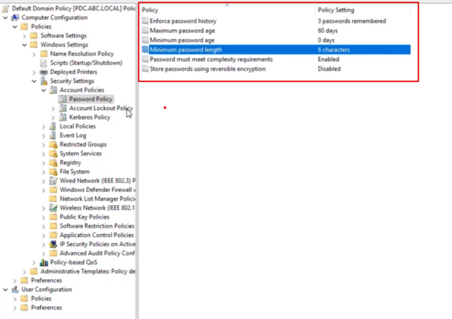

> ℹ️ **Complexity requirements** enforce that passwords contain characters from at least 3 of these 4 categories: uppercase letters, lowercase letters, digits, special characters.

> ℹ️ Setting **Enforce password history to 3** prevents users from reusing their last 3 passwords. Combined with minimum password age of 1 day, users cannot rapidly cycle through passwords to reuse their favorite.

---

## Task 5 — Configure Account Lockout Policy

Lock accounts for 1 hour after 4 failed login attempts.

**Steps:**
1. In the **Default Domain Policy** editor, navigate to:
   `Computer Configuration → Policies → Windows Settings → Security Settings → Account Policies → Account Lockout Policy`
2. Configure:

| Policy Setting | Value |
|---------------|-------|
| Account lockout threshold | **4 invalid logon attempts** |
| Account lockout duration | **60 minutes** |
| Reset account lockout counter after | **60 minutes** |

**Screenshot:**

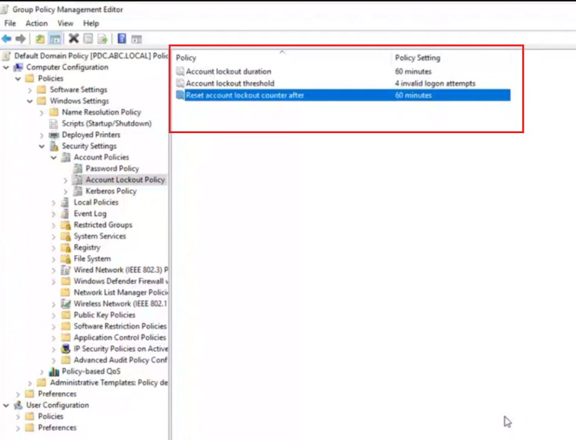

> ⚠️ After saving the lockout threshold, Windows will auto-suggest values for duration and reset counter. Accept or adjust them to 60 minutes.

> 💡 To manually unlock a locked account immediately:
> ```powershell
> Unlock-ADAccount -Identity username
> ```

---

## Task 6 — Enable Remote Desktop for All Domain Machines via GPO

Create a GPO that enables Remote Desktop Protocol (RDP) for all computers joined to `ABC.LOCAL`.

**Steps:**
1. In **Group Policy Management**, right-click `ABC.LOCAL` → **Create a GPO in this domain and Link it here**
2. Name: `Enable Remote Desktop`
3. Right-click the new GPO → **Edit**

**Setting 1 — Enable RDP:**
Navigate to: `Computer Configuration → Policies → Administrative Templates → Windows Components → Remote Desktop Services → Remote Desktop Session Host → Connections`
- Set **"Allow users to connect remotely using Remote Desktop Services"** → **Enabled**

**Setting 2 — Allow Through Firewall:**
Navigate to: `Computer Configuration → Policies → Windows Settings → Security Settings → Windows Firewall with Advanced Security → Inbound Rules`
- Enable: **Remote Desktop (TCP-In)**

**Setting 3 — Add Users to Remote Desktop Users Group:**
Navigate to: `Computer Configuration → Policies → Windows Settings → Security Settings → Restricted Groups`
- Add `Domain Users` to **Remote Desktop Users**

**Screenshots:**

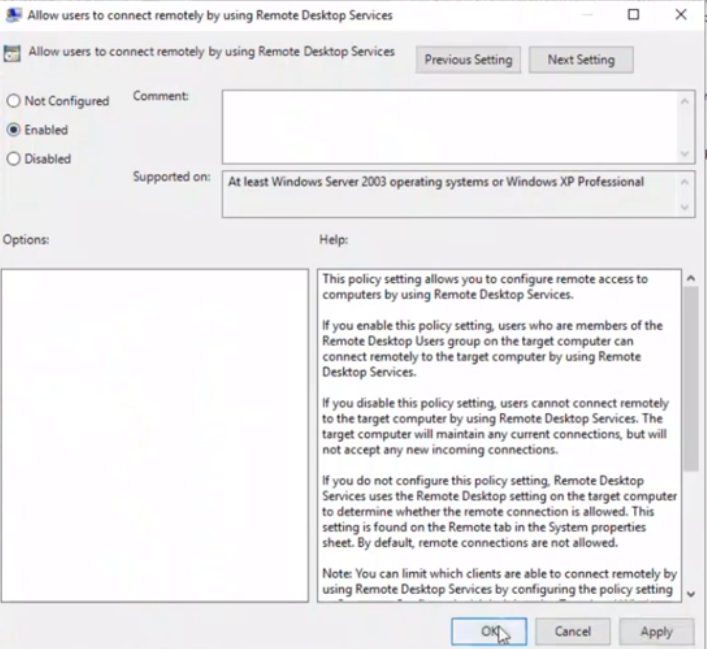

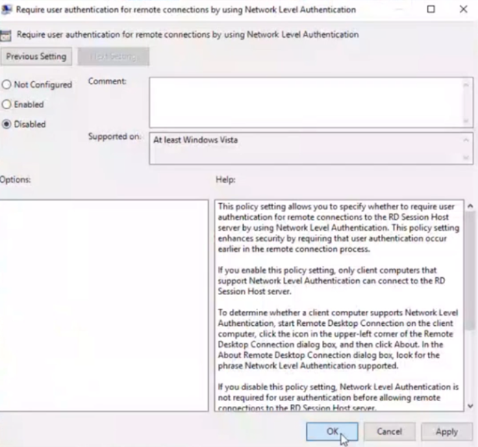

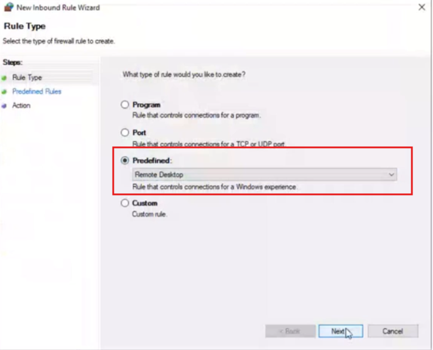

```powershell
# Force GPO refresh on all clients
Invoke-GPUpdate -Computer "ClientPC" -Force
```

---

## Task 7 — Prohibit Access to External Storage, Task Manager, Context Menu Items, and Control Panel

Create a security restriction GPO applied to all domain users.

**Steps:**
1. Create a new GPO: `Security Restrictions` → link to `ABC.LOCAL`
2. Edit the GPO → navigate to each setting below:

### 7a — Prevent External Storage (USB/Removable Drives)

Path: `Computer Configuration → Policies → Administrative Templates → System → Removable Storage Access`

| Setting | Value |
|---------|-------|
| All Removable Storage classes: Deny all access | **Enabled** |

**Screenshot:**

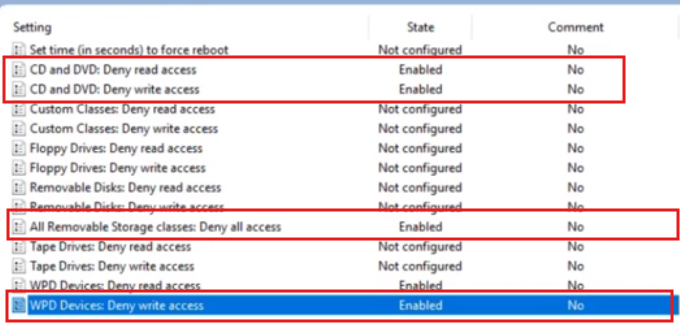

### 7b — Remove Task Manager

Path: `User Configuration → Policies → Administrative Templates → System → Ctrl+Alt+Del Options`

| Setting | Value |
|---------|-------|
| Remove Task Manager | **Enabled** |

**Screenshot:**

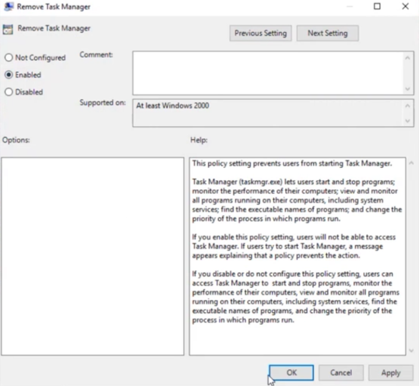

### 7c — Remove Properties from Computer Context Menu

Path: `User Configuration → Policies → Administrative Templates → Desktop`

| Setting | Value |
|---------|-------|
| Remove Properties from the Computer icon context menu | **Enabled** |

**Screenshot:**

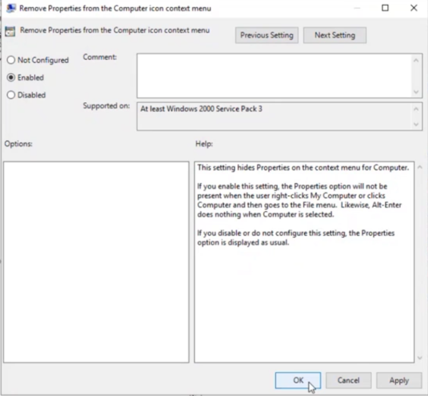

### 7d — Prohibit Access to Control Panel

Path: `User Configuration → Policies → Administrative Templates → Control Panel`

| Setting | Value |
|---------|-------|
| Prohibit access to Control Panel and PC Settings | **Enabled** |

**Screenshot:**

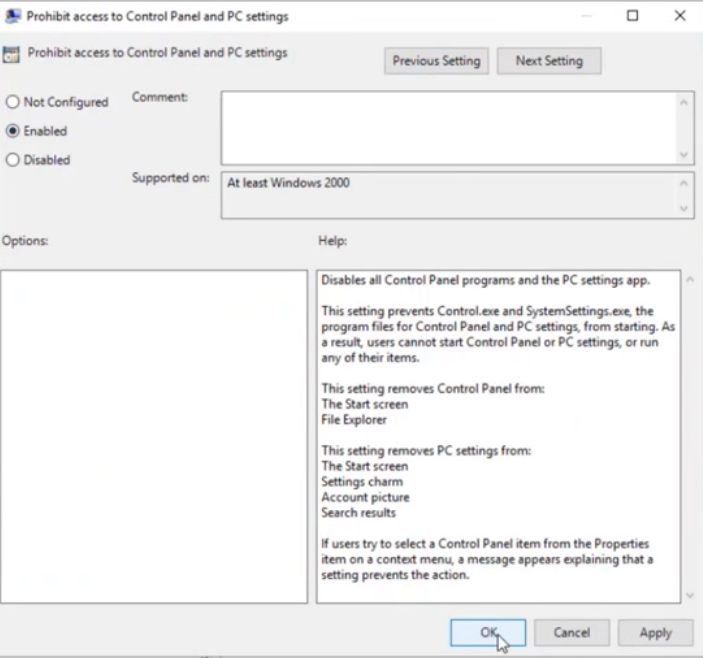

---

## Task 8 — Configure DHCP with Scope and Exclusions

Install DHCP Server role on PDC and configure the scope for the domain network.

**Steps:**
1. **Server Manager → Add Roles and Features → DHCP Server**
2. After installation, open **DHCP Manager** (`dhcpmgmt.msc`)
3. Authorize PDC in DHCP: right-click the server → **Authorize**
4. Expand PDC → right-click **IPv4 → New Scope…**
5. Configure:

| Setting | Value |
|---------|-------|
| Scope name | ABC-Scope |
| Start IP | `192.168.1.40` |
| End IP | `192.168.1.230` |
| Subnet mask | `255.255.255.0` (/24) |
| Default gateway | `192.168.1.1` |
| DNS server | `192.168.1.2` (PDC) |
| Lease duration | 8 days |

6. **Add Exclusion Range:**
   - Start: `192.168.1.80` | End: `192.168.1.85`
   - These IPs are reserved for static assignments (servers, printers, etc.)

7. Activate the scope

**Screenshot:**

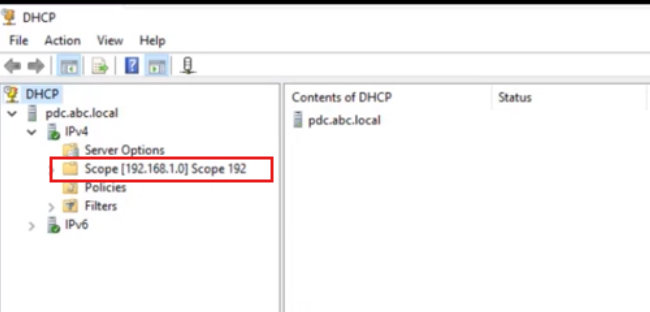

```powershell
# PowerShell DHCP configuration
Add-DhcpServerV4Scope -Name "ABC-Scope" -StartRange 192.168.1.40 -EndRange 192.168.1.230 -SubnetMask 255.255.255.0
Add-DhcpServerV4ExclusionRange -ScopeId 192.168.1.0 -StartRange 192.168.1.80 -EndRange 192.168.1.85
Set-DhcpServerV4OptionValue -ScopeId 192.168.1.0 -Router 192.168.1.1 -DnsServer 192.168.1.2
```

---

## Task 9 — DNS Load Balancing for www.abc.local

Configure DNS Round Robin to distribute web traffic for `www.abc.local` across two servers.

**Steps:**
1. Open **DNS Manager** (`dnsmgmt.msc`) on PDC
2. Expand **Forward Lookup Zones → abc.local**
3. Right-click → **New Host (A or AAAA)…**
4. Create **two A records** with the same name:

| Name | IP Address |
|------|-----------|
| www | `192.168.1.8` |
| www | `192.168.1.9` |

5. Verify DNS Round Robin is enabled (default on Windows DNS):
   - Open DNS Manager → right-click the server → **Properties → Advanced tab**
   - Ensure **"Enable round robin"** is checked

**How DNS Round Robin works:**
```
Client 1 queries www.abc.local → DNS returns 192.168.1.8 first
Client 2 queries www.abc.local → DNS returns 192.168.1.9 first
Client 3 queries www.abc.local → DNS returns 192.168.1.8 first
... (rotates with each query)
```

```powershell
# Add both A records via PowerShell
Add-DnsServerResourceRecordA -ZoneName "abc.local" -Name "www" -IPv4Address "192.168.1.8"
Add-DnsServerResourceRecordA -ZoneName "abc.local" -Name "www" -IPv4Address "192.168.1.9"

# Verify
Resolve-DnsName -Name www.abc.local -Type A
```

---

## Task 10 — Configure DHCP Failover on Windows Server Core

Set up DHCP failover between PDC and the Windows Server Core machine for high availability.

### Step 10a — Add Core Server to PDC Management

**Steps on Core server:**
```cmd
# Set static IP on Core
netsh interface ip set address "Ethernet" static 192.168.1.4 255.255.255.0 192.168.1.1
netsh interface ip set dns "Ethernet" static 192.168.1.2

# Join Core to domain
netdom join %computername% /domain:ABC.LOCAL /userd:ABC\Administrator /passwordd:*

# Restart
shutdown /r /t 0
```

**Screenshot:**

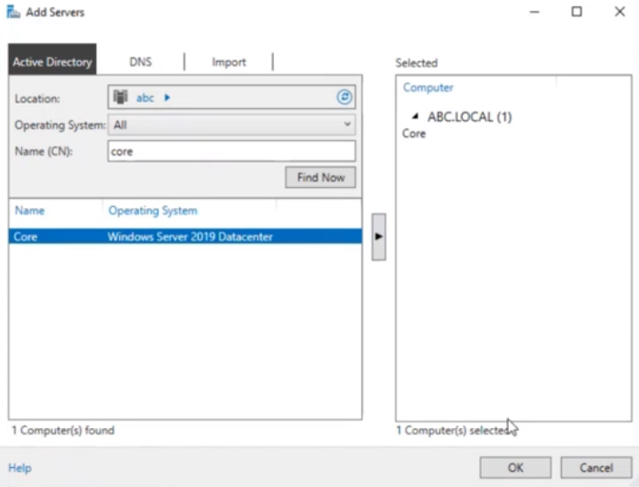

### Step 10b — Install DHCP on Core

```powershell
# On Core server (remote PowerShell from PDC)
Install-WindowsFeature -ComputerName CORE -Name DHCP -IncludeManagementTools

# Authorize CORE in DHCP
Add-DhcpServerInDC -DnsName "CORE.ABC.LOCAL" -IPAddress 192.168.1.4
```

### Step 10c — Configure Failover

**Steps on PDC:**
1. Open **DHCP Manager**
2. Right-click the scope (`192.168.1.0`) → **Configure Failover…**
3. Wizard settings:

| Setting | Value |
|---------|-------|
| Partner server | `CORE.ABC.LOCAL` |
| Mode | Hot Standby |
| Role of Partner Server | Standby |
| Maximum client lead time | 1 hour |
| State Switchover Interval | 60 minutes |
| Shared secret | (strong password) |

**Screenshot:**

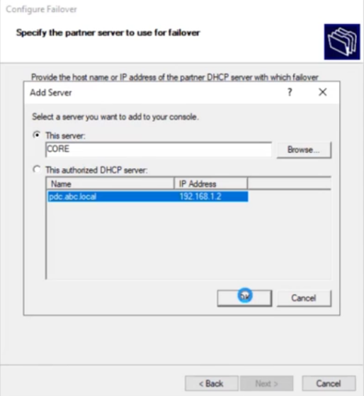

```powershell
# PowerShell failover configuration
Add-DhcpServerv4Failover -Name "ABC-Failover" -ScopeId 192.168.1.0 `
    -PartnerServer "CORE.ABC.LOCAL" -Mode HotStandby `
    -MaxClientLeadTime 01:00:00 -AutoStateTransition $true `
    -SharedSecret "F@il0verSecret!"
```

---

## Task 11 — Install Hyper-V on Core and Configure VM Replication

### Step 11a — Install Hyper-V on Core

```powershell
# Install Hyper-V role on Core server
Install-WindowsFeature -ComputerName CORE -Name Hyper-V -IncludeManagementTools -Restart

# On Core, create an internal virtual switch
New-VMSwitch -Name "Internal" -SwitchType Internal
```

### Step 11b — Create a Core VM on Hyper-V

```powershell
# Create the VM
New-VM -Name "CoreVM" -MemoryStartupBytes 2GB -Generation 2 `
       -NewVHDPath "C:\Hyper-V\CoreVM.vhdx" -NewVHDSizeBytes 40GB `
       -SwitchName "Internal"

# Attach ISO and start
Set-VMDvdDrive -VMName "CoreVM" -Path "C:\ISOs\WindowsServerCore.iso"
Start-VM -Name "CoreVM"
```

### Step 11c — Configure Hyper-V Replica (Core → PDC)

**On Core (Replica server — Hyper-V host):**
```powershell
# Enable replication on Core
Set-VMReplicationServer -ReplicationEnabled $true `
    -AllowedAuthenticationType Kerberos `
    -ReplicationAllowedFromAnyServer $true
```

**On PDC (replica recipient):**
1. Open **Hyper-V Manager** → connect to CORE
2. Right-click the VM → **Enable Replication…**
3. Replica server: `PDC.ABC.LOCAL`
4. Authentication: Kerberos
5. Replication frequency: 5 minutes
6. Recovery points: Keep the last 4

**Screenshot:**

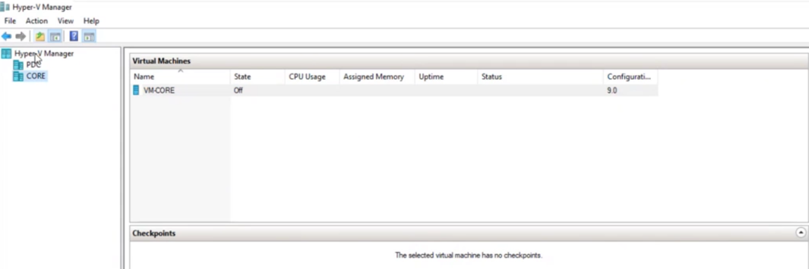

```powershell
# Enable VM replication
Enable-VMReplication -VMName "CoreVM" -ReplicaServerName "PDC.ABC.LOCAL" `
    -ReplicaServerPort 80 -AuthenticationType Kerberos `
    -ReplicationFrequencySec 300 -RecoveryHistory 4
Start-VMInitialReplication -VMName "CoreVM"
```

---

## Task 12 — Install Windows 10 via WDS (Windows Deployment Services)

### Step 12a — Install and Configure WDS

**Steps:**
1. **Server Manager → Add Roles and Features → Windows Deployment Services**
2. Install both **Deployment Server** and **Transport Server**
3. Open **WDS Management Console** → right-click the server → **Configure Server**
4. Settings:
   - Integrated with Active Directory
   - Remote installation folder: `C:\RemoteInstall`
   - PXE response: **Respond to all client computers**

### Step 12b — Add Boot and Install Images

**Add Boot Image:**
1. Right-click **Boot Images** → **Add Boot Image…**
2. Browse to Windows 10 ISO (mount it first): `\sources\boot.wim`
3. Name: `Windows 10 Boot`

**Screenshot:**

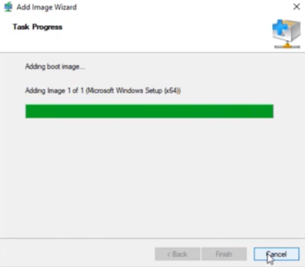

**Add Install Image:**
1. Right-click **Install Images** → **Add Install Image…**
2. Create image group: `Windows10`
3. Browse to: `\sources\install.wim`
4. Select the desired Windows 10 edition

**Screenshot:**


### Step 12c — Boot Client via PXE

1. Configure client VM/machine to boot from Network (PXE)
2. Client gets IP from DHCP, downloads the boot image
3. WDS boot menu appears → select Windows 10 image
4. Complete installation wizard

**Screenshot:**

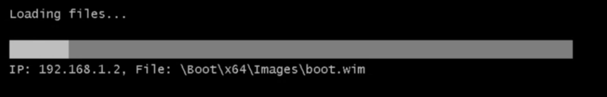

---

## Task 13 — Join Client to Domain and Add Dev Group as Local Administrator

### Step 13a — Join the Windows 10 Client to ABC.LOCAL

**Steps on the Client:**
1. Right-click **Start → System → Rename this PC (advanced)**
2. Click **Change…** → Member of **Domain**: `ABC.LOCAL`
3. Enter `ABC\Administrator` credentials
4. Restart the machine

### Step 13b — Join Core Server to Domain

**Screenshot:**

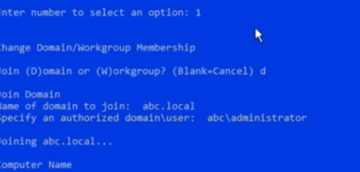

### Step 13c — Add Dev-Group as Local Administrators via GPO

**Steps:**
1. Create a new GPO: `Dev Local Admin` → link to the `Dev` OU
2. Edit GPO → navigate to:
   `Computer Configuration → Policies → Windows Settings → Security Settings → Restricted Groups`
3. Add: `ABC\Dev-Group` → member of **Administrators**

**Alternatively via GPO Preferences:**
`Computer Configuration → Preferences → Control Panel Settings → Local Users and Groups`
- Action: **Update**
- Group name: **Administrators (built-in)**
- Add member: `ABC\Dev-Group`

**Screenshot:**

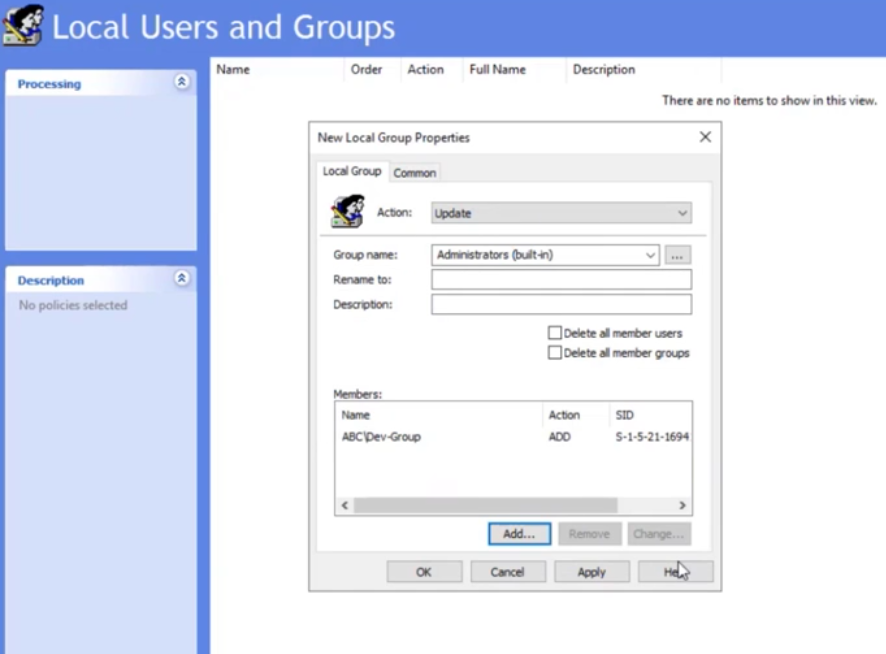

---

## Task 14 — Create Shared Folders for Dev and HR (Create/Edit but No Delete)

**Steps:**

### Create Folders
```powershell
New-Item -ItemType Directory -Path "C:\Shares\DevShare"
New-Item -ItemType Directory -Path "C:\Shares\HRShare"
```

### Share the Folders
```powershell
New-SmbShare -Name "DevShare" -Path "C:\Shares\DevShare" -FullAccess "ABC\Dev-Group"
New-SmbShare -Name "HRShare" -Path "C:\Shares\HRShare" -FullAccess "ABC\HR-Group"
```

### Configure NTFS Permissions (Create/Edit but No Delete)

1. Right-click the folder → **Properties → Security → Advanced → Add**
2. Select `Dev-Group` (or `HR-Group`)
3. Set the following permissions:

| Permission | Allow | Deny |
|------------|-------|------|
| List folder / read data | ✅ | |
| Create files / write data | ✅ | |
| Create folders / append data | ✅ | |
| Read attributes | ✅ | |
| Write attributes | ✅ | |
| Delete subfolders and files | | ✅ |
| Delete | | ✅ |
| Read permissions | ✅ | |

**Screenshot:**

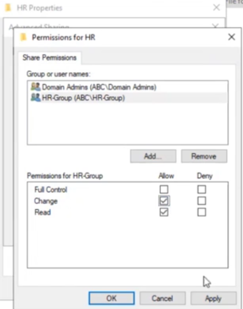

```powershell
# Set NTFS permissions — deny delete for Dev-Group on DevShare
$acl = Get-Acl "C:\Shares\DevShare"
$denyRule = New-Object System.Security.AccessControl.FileSystemAccessRule(
    "ABC\Dev-Group", "Delete,DeleteSubdirectoriesAndFiles", "ContainerInherit,ObjectInherit", "None", "Deny"
)
$acl.AddAccessRule($denyRule)
Set-Acl -Path "C:\Shares\DevShare" -AclObject $acl
```

---

## Task 15 — Create Mapped Network Drive via GPO for Dev and HR

Map network drives automatically when users log in.

**Steps:**
1. Create GPO: `Map Network Drives` → link to `Dev` OU and `HR` OU
2. Edit GPO → navigate to:
   `User Configuration → Preferences → Windows Settings → Drive Maps`
3. Right-click → **New → Mapped Drive**

**For Dev-Group:**

| Setting | Value |
|---------|-------|
| Action | Create |
| Location | `\\PDC\DevShare` |
| Drive letter | `D:` |
| Label | Dev Share |
| Item-level targeting | Security Group = `ABC\Dev-Group` |

**For HR-Group:**

| Setting | Value |
|---------|-------|
| Action | Create |
| Location | `\\PDC\HRShare` |
| Drive letter | `H:` |
| Label | HR Share |
| Item-level targeting | Security Group = `ABC\HR-Group` |

**Screenshot:**

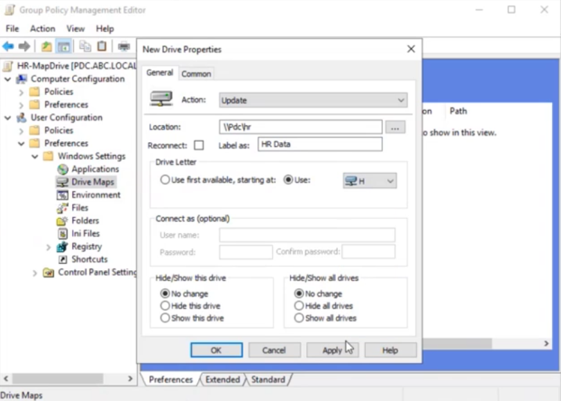

> ℹ️ **Item-level targeting** ensures the drive map only applies to members of the specific group — not all users in the OU.

---

## Task 16 — Add Network Printer via GPO (Black & White, Time-Restricted)

### Step 16a — Install and Share the Printer on PDC

1. **Server Manager → Add Roles and Features → Print and Document Services → Print Server**
2. Open **Print Management** → **Add Printer**
3. Add the printer → share it as `OfficePrinter`

### Step 16b — Configure Black & White Only

1. In **Print Management**, right-click the printer → **Properties → Advanced**
2. Click **Printing Defaults** → set **Color** to **Monochrome (Black & White)**
3. Apply and save

### Step 16c — Set Time Restriction (9:00 AM – 4:00 PM)

1. Printer Properties → **Advanced tab**
2. Set **Available from: 9:00 AM** to **4:00 PM**

**Screenshot:**

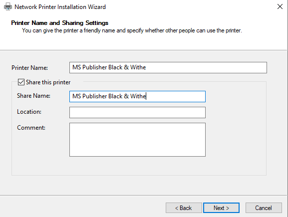

### Step 16d — Deploy Printer to All Domain Users via GPO

1. In **Print Management**, right-click the shared printer → **Deploy with Group Policy…**
2. Click **Browse…** → select the **Default Domain Policy**
3. Select: **"The users that this GPO applies to (per user)"**
4. Click **Add** → **Apply**

**Screenshot:**


---

## Task 17 — Desktop Shortcut Policy via GPO

Create a GPO to deploy a standardized desktop shortcut for all domain users.

**Steps:**
1. Create GPO: `Desktop Shortcuts` → link to `ABC.LOCAL`
2. Edit GPO → navigate to:
   `User Configuration → Preferences → Windows Settings → Shortcuts`
3. Right-click → **New → Shortcut**

| Setting | Value |
|---------|-------|
| Action | Create |
| Name | Company Portal |
| Target type | URL |
| Location | Desktop |
| Target URL | `http://www.abc.local` |
| Icon | Default browser icon |

**Screenshot:**

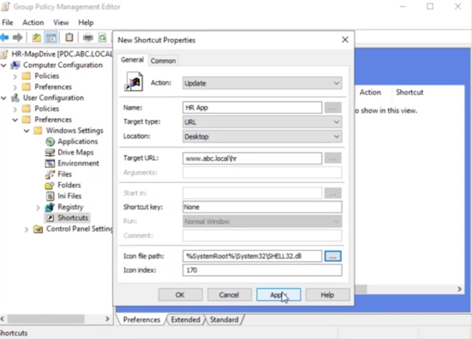

---

## Task 18 — Install Additional Domain Controller (ADC) with Alternate DNS

### Step 18a — Install AD DS on ADC Server

**Steps on ADC:**
1. Set static IP: `192.168.1.3`
2. Set DNS to PDC's IP: `192.168.1.2`
3. Join `ABC.LOCAL` as a member server
4. Install **Active Directory Domain Services** role
5. Click **Promote this server to a domain controller**
6. Select: **Add a domain controller to an existing domain**
7. Domain: `ABC.LOCAL`
8. Credentials: `ABC\Administrator`
9. On DC Options:
   - ✅ DNS server
   - ✅ Global Catalog
   - Site: Default-First-Site-Name
   - DSRM password: set it
10. Complete wizard — server restarts

**Screenshot:**

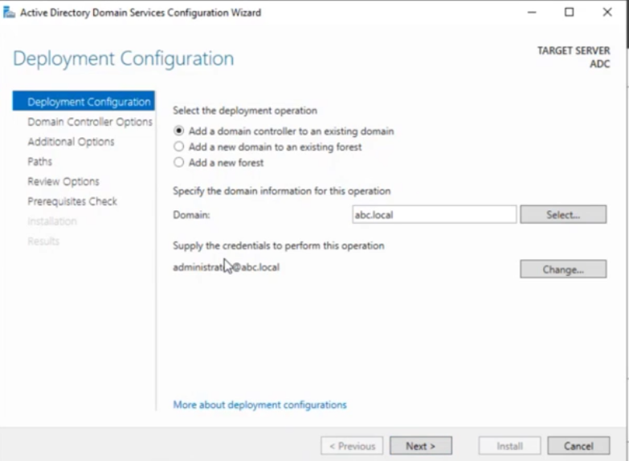

### Step 18b — Configure Alternate DNS on Clients

After ADC is promoted, update DHCP scope options so clients use ADC as alternate DNS:

```powershell
# Update DHCP to provide both DCs as DNS servers
Set-DhcpServerV4OptionValue -ScopeId 192.168.1.0 `
    -DnsServer 192.168.1.2, 192.168.1.3
```

> ✅ Now clients use `192.168.1.2` (PDC) as primary DNS and `192.168.1.3` (ADC) as alternate DNS — providing DNS fault tolerance.

---

## Task 19 — Configure Full Server Backup (Daily at 11:00 PM to ADC)

### Step 19a — Install Windows Server Backup on PDC

```powershell
Install-WindowsFeature Windows-Server-Backup
```

### Step 19b — Configure Scheduled Backup

**Steps:**
1. Open **Windows Server Backup** (`wbadmin.msc`)
2. Click **Backup Schedule…**
3. Select: **Full server backup**
4. Schedule: **Daily at 11:00 PM**
5. Destination type: **Remote shared folder**
6. Network location: `\\ADC\Backup` (create this share on ADC first)
7. Enter credentials for the backup share

**Screenshot:**

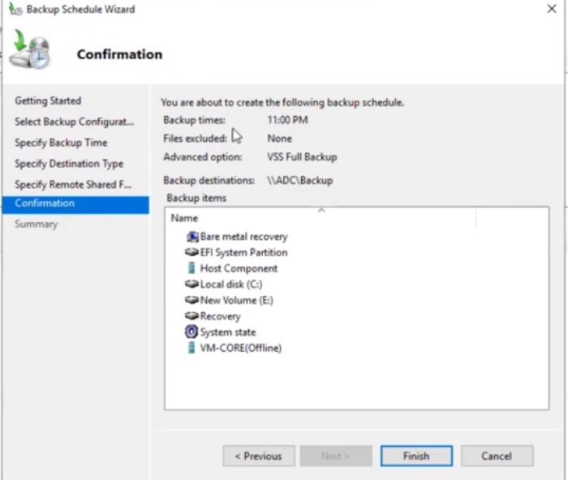

### Step 19c — Create the Backup Share on ADC

```powershell
# On ADC — create and share backup folder
New-Item -ItemType Directory -Path "D:\Backup"
New-SmbShare -Name "Backup" -Path "D:\Backup" `
    -FullAccess "ABC\Administrator","ABC\PDC$"
```

### Step 19d — Verify and Test Backup

```powershell
# Run a manual backup immediately to test
wbadmin start backup -backupTarget:\\ADC\Backup -include:C: -allCritical -quiet

# Check backup status
wbadmin get status
```

> ℹ️ **Full server backup** includes the system state, all volumes, and all installed applications — enough to perform a full bare-metal recovery on the PDC if needed.

> ⚠️ Ensure ADC has sufficient disk space. A typical Windows Server installation requires 30–80 GB for the first backup; subsequent backups may be smaller if incremental.

---

## Complete Lab Summary

| # | Task | Tool | Status |
|---|------|------|--------|
| 1 | Create ABC.LOCAL domain | ADUC, Server Manager | ✅ |
| 2 | Create Department OUs (HR, Sales, Finance, Dev, IT) | ADUC | ✅ |
| 3 | Create users, groups, add users to groups | ADUC / PowerShell | ✅ |
| 4 | Password policy (60 days, 6 chars, complexity, history 3) | GPO — Default Domain Policy | ✅ |
| 5 | Account lockout (4 attempts, 60 min lock) | GPO — Default Domain Policy | ✅ |
| 6 | Enable Remote Desktop for all machines | GPO | ✅ |
| 7 | Block external storage, Task Manager, Properties, Control Panel | GPO | ✅ |
| 8 | DHCP scope 192.168.1.40–230, exclude 80–85 | DHCP Manager | ✅ |
| 9 | DNS load balancing for www.abc.local (2 IPs) | DNS Manager | ✅ |
| 10 | DHCP failover on Windows Server Core | DHCP Manager / PowerShell | ✅ |
| 11 | Hyper-V on Core, create VM, configure replica | Hyper-V Manager / PowerShell | ✅ |
| 12 | Install Windows 10 via WDS (PXE boot) | WDS | ✅ |
| 13 | Join client to domain, Dev-Group as local admin | GPO / System Properties | ✅ |
| 14 | Shared folders for Dev and HR (no delete) | NTFS + SMB | ✅ |
| 15 | Mapped network drives via GPO | GPO Preferences | ✅ |
| 16 | Network printer (B&W, 9 AM–4 PM) via GPO | Print Management + GPO | ✅ |
| 17 | Desktop shortcut via GPO | GPO Preferences | ✅ |
| 18 | Additional Domain Controller with alternate DNS | Server Manager | ✅ |
| 19 | Full server backup daily 11 PM to ADC | Windows Server Backup | ✅ |

---

## Quick Reference — Key Commands

```powershell
# Force GPO update on all clients
Invoke-GPUpdate -Computer "ClientName" -Force -RandomDelayInMinutes 0

# Check applied GPOs on a computer
gpresult /R
gpresult /H C:\gpreport.html

# Verify DHCP scope
Get-DhcpServerV4Scope

# Check replication health
repadmin /replsummary

# Verify all FSMO roles
netdom query fsmo

# Check backup status
wbadmin get versions

# Test DNS round robin
Resolve-DnsName www.abc.local

# Verify trust (if cross-domain)
nltest /sc_verify:ABC.LOCAL
```

---

## Troubleshooting Reference

| Issue | Cause | Solution |
|-------|-------|----------|
| GPO not applying | Replication delay or wrong link | Run `gpupdate /force`; check `gpresult /R` |
| DHCP clients not getting IP | Scope not activated or excluded range wrong | Verify scope is active; check exclusions |
| WDS PXE boot fails | DHCP options 66/67 not set or WDS not authorized | Set PXE boot server option in DHCP; authorize WDS |
| Hyper-V replica fails | Firewall blocking port 80 (HTTP auth) | Open port 80/443 between Core and PDC |
| Shared folder delete not blocked | Permissions inheritance overriding Deny | Set Deny at root; ensure "This folder, subfolders and files" |
| Mapped drive not appearing | Item-level targeting wrong group | Verify user is in correct group; run gpupdate |
| Printer not deploying | GPO linked to wrong location | Link to domain root for all users; verify Print Server role |
| ADC not replicating | DNS or network issue | Check `repadmin /showrepl`; verify DNS resolves PDC |
| Backup failing to network share | Permissions or path wrong | Ensure PDC$ computer account has write access to backup share |

---

## References

- [Active Directory DS Installation](https://learn.microsoft.com/en-us/windows-server/identity/ad-ds/deploy/install-active-directory-domain-services)
- [Group Policy Reference](https://learn.microsoft.com/en-us/windows-server/administration/windows-commands/gpupdate)
- [DHCP Failover Configuration](https://learn.microsoft.com/en-us/windows-server/networking/technologies/dhcp/dhcp-deploy-wps)
- [Windows Deployment Services](https://learn.microsoft.com/en-us/windows/deployment/wds-boot-support)
- [Hyper-V Replica](https://learn.microsoft.com/en-us/windows-server/virtualization/hyper-v/manage/set-up-hyper-v-replica)
- [Windows Server Backup](https://learn.microsoft.com/en-us/windows-server/administration/windows-server-backup/windows-server-backup)
- [Print Management GPO Deployment](https://learn.microsoft.com/en-us/windows-server/administration/windows-commands/printui)
