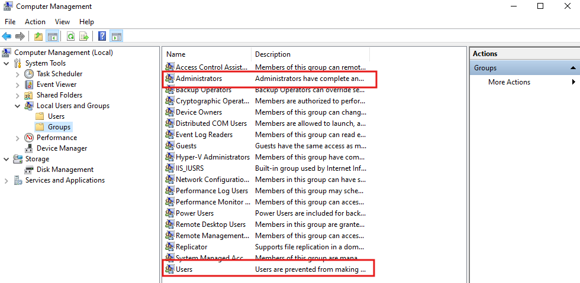
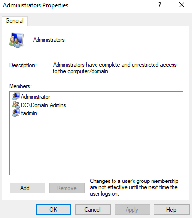
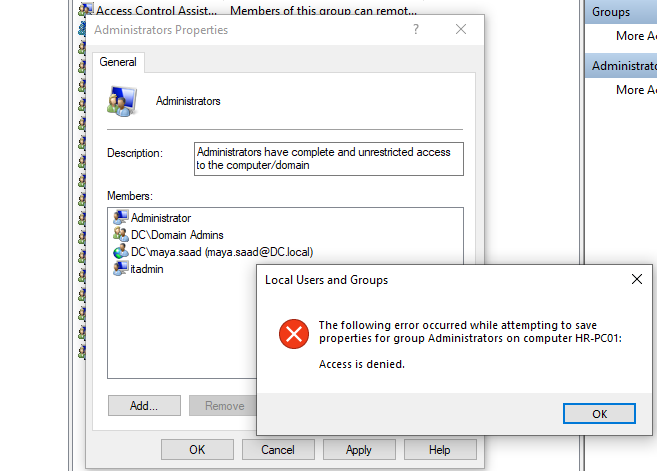

# 🔐 User Permissions and Local Groups on Domain-Joined Machines

> A hands-on lab guide covering user login capabilities, local group management, privilege delegation, and security risks on Windows 10 machines joined to a domain.


---

## 📖 Overview

This is **Session 12** of the Windows Server 2019 course by **Mohamed Zahdi**. Building on the domain join session, this lab demonstrates what domain users can and cannot do on a joined machine, how local groups control permissions, how to delegate admin rights correctly, and why Group Policy is needed to lock things down further.

> 📌 **Pre-requisite:** A Windows 10 machine already joined to the domain. Review Session 08 (Joining a Machine to a Domain) if needed.

---

## 🎯 What This Session Covers

| Topic | Description |
|---|---|
| Default login rights | Any AD user can log into any domain-joined machine |
| Standard user restrictions | What normal users can and cannot do |
| Local groups overview | Administrators and Users groups on the machine |
| Domain groups → local groups | Automatic membership after domain join |
| Adding users to local admins | Granting per-machine admin rights |
| Domain Admins vs Local Admins | Scope and risk comparison |
| IT Group delegation | Local admin without domain-wide rights |
| Security risks of local admin | What a local admin can do |
| Group Policy preview | How GPOs restrict local admin abuse |

---

## 👤 Default Login Behavior After Domain Join

When a machine joins the domain, **any Active Directory user can log in** to that machine as a standard user — no extra configuration needed.

```
User created in AD (any OU)
        ↓
Machine joined to domain
        ↓
User can log in to that machine immediately
        ↓
Logged in as a standard (restricted) user
        ↓
Must change password on first login (if policy is set)
```

> This default behavior is by design — the Domain Users group is automatically added to the machine's local Users group during the domain join process.

---

## 🚫 Standard User Restrictions

About **90% of company users** are standard users. They can use the machine but cannot change it:

| ✅ Can do | ❌ Cannot do |
|---|---|
| Log in to any domain-joined machine | Install or uninstall software |
| Run installed applications | Change IP address or network settings |
| Save and access personal files | Rename the machine |
| Use printers and peripherals | Remove machine from domain |
| | Create or manage local users |
| | Modify system settings or Control Panel |

---

## 🖥️ Local Groups — The Permission Control Layer

Local groups on a machine define what users can and cannot do. The two critical groups are **Administrators** and **Users**.

### Viewing Local Groups

```
Right-click This PC → Manage
→ Local Users and Groups → Groups
```

The screenshot below shows the full list of local groups on a domain-joined Windows 10 machine, with **Administrators** and **Users** highlighted as the two key groups:



---

## 👑 Administrators Group — Full Local Control

The **Administrators** group gives complete, unrestricted access to the local machine.

The screenshot below shows the membership of the Administrators group after domain join — it contains the built-in `Administrator` account, `DC\Domain Admins`, and the local `itadmin` account:



### Default Members of Local Administrators

| Member | Type | Added when |
|---|---|---|
| `Administrator` | Built-in local account | Created during OS installation (disabled by default) |
| `DC\Domain Admins` | Domain group | Added automatically when machine joins the domain |
| `itadmin` | Local account | Created by IT team for emergency local access |

> Any member of the **Domain Admins** group automatically has full administrative rights on every domain-joined machine — no extra configuration needed.

---

## 👥 Users Group — Standard Access

The **Users** group contains standard users with restricted permissions.

### Default Members of Local Users

| Member | Type | Added when |
|---|---|---|
| `Domain Users` | Domain group | Added automatically when machine joins the domain |

> Every account created in Active Directory is automatically a member of **Domain Users** — so every domain user can log into any domain-joined machine as a standard user by default.

---

## 🔗 Domain Group → Local Group Mapping

```
Domain Join event triggers:

Domain Users  ──────────→  Local Users group
                           (all AD users can log in as standard users)

Domain Admins ──────────→  Local Administrators group
                           (domain admins have full control on all machines)
```

---

## ⚙️ Adding a User to the Local Administrators Group

For users who need admin rights on a **specific machine only** (designers, developers, DBAs), add them directly to the local Administrators group on that machine.

### Steps

```
Right-click This PC → Manage
→ Local Users and Groups → Groups → Administrators
→ Double-click → Add...
→ Type: DC\maya.saad  (or the username)
→ Check Names → OK → Apply
```

### ⚠️ Access Denied Error — What It Means

The screenshot below shows what happens when a **standard domain user** tries to modify the Administrators group — access is denied. Only a Domain Admin or existing local admin can make this change:



```
Error: "The following error occurred while attempting to save
properties for group Administrators on computer HR-PC01:
Access is denied."

Cause: The logged-in user does not have sufficient privileges
       to modify local group membership.

Fix:   Log in as Domain Admin or existing local admin,
       then make the change.
```

> This is expected behavior and confirms that the permissions model is working correctly.

---

## 🛠️ IT Group Delegation — Best Practice

Instead of giving support technicians **Domain Admin** rights, create a dedicated AD group and add it to local Admins on specific machines.

### The Right Approach

```
1. Create AD group: "IT-Group" in ADUC
        ↓
2. Add IT support technicians as members of IT-Group
        ↓
3. On each machine that needs IT support access:
   Computer Management → Local Users and Groups
   → Administrators → Add → DC\IT-Group
        ↓
Result:
  ✅ IT-Group members have admin rights on assigned machines
  ❌ IT-Group members have NO domain-wide admin rights
```

### Privilege Level Comparison

| Role | Domain Admin rights | Local Admin on all machines | Scope |
|---|---|---|---|
| **Domain Admins** | ✅ Full | ✅ Automatic | Entire domain |
| **IT-Group** | ❌ None | ✅ Assigned machines only | Per-machine |
| **Individual local admin** | ❌ None | ✅ One specific machine | Single machine |
| **Domain Users** | ❌ None | ❌ None | Standard login only |

---

## ⚠️ Security Risks of Local Admin Rights

A user with local admin rights can do significant damage if access is misused:

| Action | Risk |
|---|---|
| Install unauthorized software | Malware, performance degradation |
| Change system time | Breaks Kerberos authentication |
| Change IP address | Network disruption |
| Remove machine from domain | Machine becomes unmanaged |
| Use USB drives freely | Data exfiltration |
| Uninstall security software | Exposes machine to attacks |

> This is why local admin rights must be granted carefully — and why **Group Policy** is used to restrict what local admins can actually do.

---

## 🛡️ Group Policy — The Next Layer of Control

Even after adding users to the local Administrators group, **Group Policy Objects (GPOs)** can restrict specific actions to prevent abuse:

| GPO Restriction | What it blocks |
|---|---|
| Disable USB ports | Prevents unauthorized data transfer |
| Block IP address changes | Maintains network stability |
| Prevent domain exit | Machine cannot be removed from domain |
| Restrict Control Panel | Limits configuration access |
| Enforce screen lock timeout | Protects unattended machines |

> Full Group Policy configuration is covered in the next session.

---

## 📋 Local Groups Quick Reference

| Group | Who is in it by default | Rights on local machine |
|---|---|---|
| **Administrators** | Built-in Administrator, Domain Admins, itadmin | Full control — install software, change settings, manage users |
| **Users** | Domain Users (all AD accounts) | Restricted — login and app usage only |

---

## ✅ Lab Completion Checklist

- [ ] Logged in with a standard domain user — verified restricted access
- [ ] Opened Computer Management → Local Users and Groups → Groups
- [ ] Verified Domain Admins is in local Administrators group
- [ ] Verified Domain Users is in local Users group
- [ ] Added a domain user (e.g., `DC\maya.saad`) to local Administrators group
- [ ] Confirmed Access Denied error when attempting change without sufficient rights
- [ ] Created `IT-Group` in ADUC and added it to local Administrators on a test machine
- [ ] Verified IT-Group member has local admin rights but not domain-wide rights
- [ ] VM snapshot taken after configuration

---

## 📚 Terminology Reference

| Term | Definition |
|---|---|
| **Local Users and Groups** | User accounts and groups scoped to a single machine, independent of domain accounts |
| **Domain Users** | Default AD group — every domain account is a member automatically |
| **Domain Admins** | AD group with full administrative rights across all domain-joined machines and the domain itself |
| **Local Administrators** | Local group granting full control on a single machine only |
| **IT-Group** | Custom AD group for IT support — local admin on assigned machines, no domain-wide rights |
| **lusrmgr.msc** | Local Users and Groups management console |
| **GPO** | Group Policy Object — enforces settings and restrictions across domain-joined machines |
| **Access Denied** | Error returned when a user without sufficient privileges attempts a restricted action |

---

## 🔭 Next Session Preview

- **Group Policy Objects (GPOs)** — creating, linking, and enforcing policies
- Common GPO settings: USB restrictions, screen lock, software installation control
- Using `gpupdate /force` and `gpresult /r` to verify applied policies

---

## 📄 License

This repository is for educational purposes. Feel free to fork and adapt for your own learning.
