# 🛡️ Group Policy — Practical Lab (HideClock, NoProperties, DisableUSB, ALT+CTRL+DEL)

> A hands-on lab guide demonstrating four real Group Policy Objects applied to the HR OU — hiding the system clock, removing computer properties, blocking removable storage, and restricting the Ctrl+Alt+Del menu.


---

## 📖 Overview

This is **Session 15** of the Windows Server 2019 course. This is a fully practical GPO lab — four Group Policy Objects are created, configured, and linked to the **HR OU** on `DC.local`. Each GPO demonstrates a different type of restriction applied to HR users via **User Configuration**.

> 📌 **Pre-requisite:** Group Policy Management Console installed on the DC, HR OU created with at least one user account, and a Windows 10 client joined to the domain.

---

## 🎯 GPOs Created in This Lab

| # | GPO Name | What it does | Config type |
|---|---|---|---|
| 1 | **HideClock** | Removes the clock from the system tray | User Configuration |
| 2 | **NoProperties** | Hides Properties from the This PC right-click menu | User Configuration |
| 3 | **DisableUSB** | Blocks read/write access to removable storage (USB, CD, WPD) | User Configuration |
| 4 | **ALT+CTRL+DEL** | Removes Task Manager from the Ctrl+Alt+Del screen | User Configuration |

All four GPOs are linked to the **HR OU** on `DC.local`.

---

## 🖥️ Lab Environment

```
Forest: DC.local
└── Domains
    └── DC.local
        ├── Default Domain Policy
        ├── Domain Controllers
        ├── Finance
        ├── HR                    ← all 4 GPOs linked here
        │   ├── HideClock
        │   ├── NoProperties
        │   ├── DisableUSB
        │   └── ALT+CTRL+DEL
        ├── IT
        │   ├── IT-Computers
        │   └── IT-Users
        └── Sales
```

---

## 📋 Final GPO Overview — HR OU

The screenshot below shows all four GPOs linked and active on the HR OU in Group Policy Management:

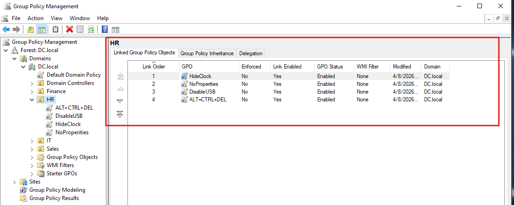

| Link Order | GPO Name | Enforced | Link Enabled | GPO Status |
|---|---|---|---|---|
| 1 | HideClock | No | Yes | Enabled |
| 2 | NoProperties | No | Yes | Enabled |
| 3 | DisableUSB | No | Yes | Enabled |
| 4 | ALT+CTRL+DEL | No | Yes | Enabled |

---

## 🕐 GPO 1 — HideClock

**Goal:** Remove the system clock from the taskbar notification area for all HR users.

### GPMC — GPO Linked to HR OU

The screenshot below shows the `HideClock` GPO linked to the HR OU with Link Enabled = Yes and GPO Status = Enabled:

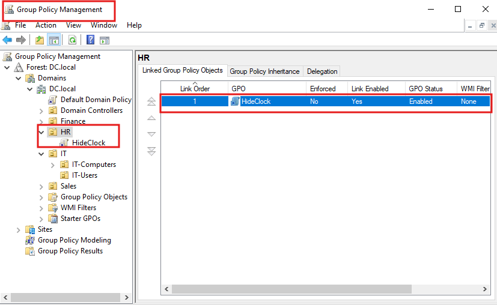

### Policy Setting Configuration

Navigate to the setting inside the GPO editor:

```
GPO: HideClock
Configuration: User Configuration
Path: User Configuration
      → Administrative Templates
      → Start Menu and Taskbar
      → Remove Clock from the system notification area
      → Set to: Enabled
```

The screenshot below shows the policy set to **Enabled**, with a comment added by the IT Admin:

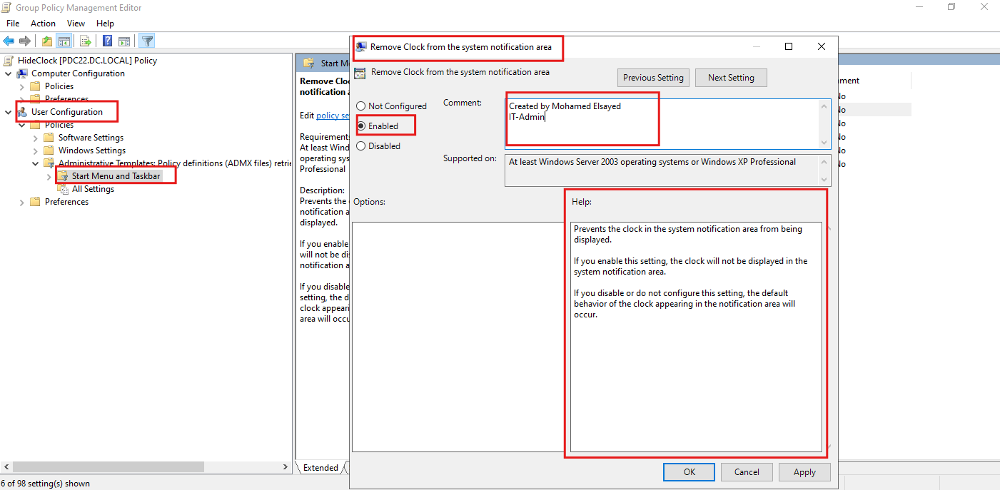

| Field | Value |
|---|---|
| Policy name | Remove Clock from the system notification area |
| State | **Enabled** |
| Configuration | User Configuration → Administrative Templates → Start Menu and Taskbar |
| Comment | Created by Mohamed Elsayed — IT-Admin |
| Supported on | At least Windows Server 2003 or Windows XP Professional |

### Applying the Policy

Run `gpupdate /force` on the client machine to pull the policy immediately:

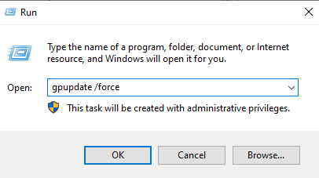

### Result — Clock Removed from Taskbar

After the policy is applied and the user logs off and back on, the clock disappears from the system tray:


> The clock is no longer visible in the notification area. The policy follows the **user** — it applies on any machine the HR user logs into.

---

## 🖱️ GPO 2 — NoProperties

**Goal:** Remove the "Properties" option from the right-click context menu of "This PC" for HR users.

### Policy Setting Configuration

```
GPO: NoProperties
Configuration: User Configuration
Path: User Configuration
      → Administrative Templates
      → Desktop
      → Remove Properties from the Computer icon context menu
      → Set to: Enabled
```

The screenshot below shows the `Desktop` section in the GPO editor with the `Remove Properties from the Computer icon context menu` setting highlighted:

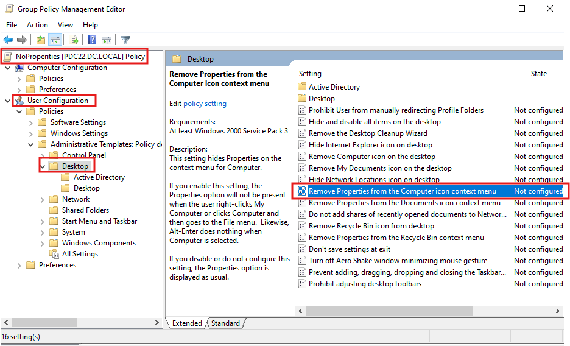

The policy is set to **Enabled** with a comment from IT-Admin:

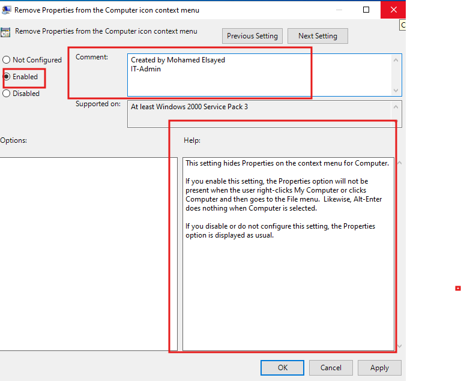

| Field | Value |
|---|---|
| Policy name | Remove Properties from the Computer icon context menu |
| State | **Enabled** |
| Configuration | User Configuration → Administrative Templates → Desktop |
| Comment | Created by Mohamed Elsayed — IT-Admin |
| Supported on | At least Windows 2000 Service Pack 3 |

### Result — Properties Option Hidden

After applying the policy, right-clicking "This PC" no longer shows the "Properties" option:

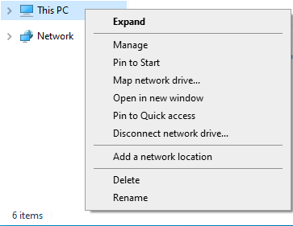

> "Properties" is absent from the context menu. Users cannot access system information, network adapter settings, or domain membership details via this menu.

---

## 🔌 GPO 3 — DisableUSB

**Goal:** Block all removable storage access for HR users — USB drives, CD/DVD drives, and WPD devices (phones, media players).

### Policy Setting Configuration

```
GPO: DisableUSB
Configuration: User Configuration
Path: User Configuration
      → Administrative Templates
      → System
      → Removable Storage Access
```

Enable the following settings:

| Setting | State |
|---|---|
| CD and DVD: Deny read access | **Enabled** |
| CD and DVD: Deny write access | **Enabled** |
| Removable Disks: Deny read access | **Enabled** |
| Removable Disks: Deny write access | **Enabled** |
| WPD Devices: Deny read access | **Enabled** |
| WPD Devices: Deny write access | **Enabled** |

The screenshot below shows the `DisableUSB` GPO editor with all six removable storage settings enabled:

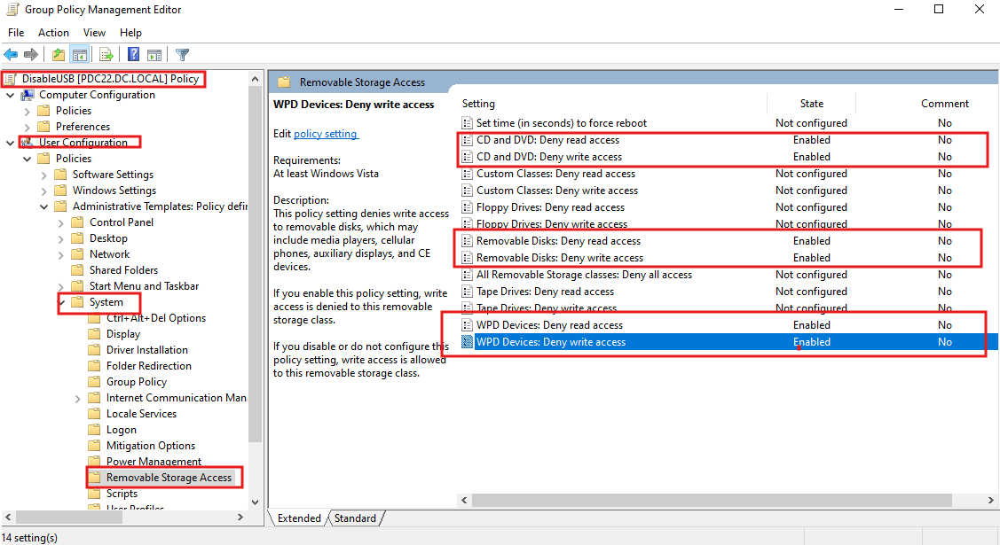

### Result — CD/DVD Drive Access Denied

After the policy is applied, attempting to access the CD/DVD drive produces an access denied error:

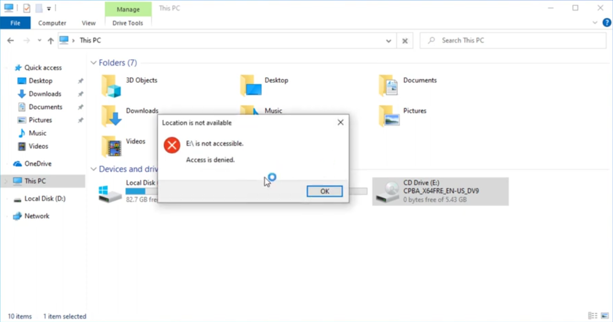

```
Error: "Location is not available"
       "E:\ is not accessible. Access is denied."
```

> This confirms the policy is working. USB drives, phones, and external media players will produce the same error. Data exfiltration via removable media is effectively blocked.

---

## ⌨️ GPO 4 — ALT+CTRL+DEL (Remove Task Manager)

**Goal:** Prevent HR users from opening Task Manager via Ctrl+Alt+Del or any other method.

### Policy Setting Configuration

```
GPO: ALT+CTRL+DEL
Configuration: User Configuration
Path: User Configuration
      → Administrative Templates
      → System
      → Ctrl+Alt+Del Options
      → Remove Task Manager
      → Set to: Enabled
```

The screenshot below shows the `Remove Task Manager` policy set to **Enabled**:

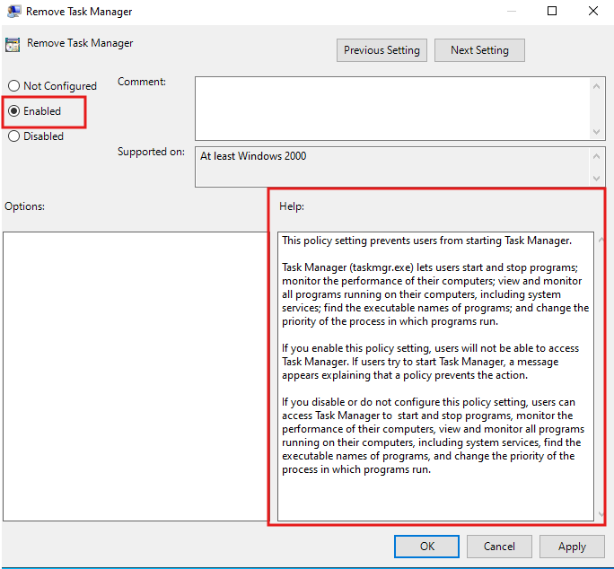

| Field | Value |
|---|---|
| Policy name | Remove Task Manager |
| State | **Enabled** |
| Configuration | User Configuration → System → Ctrl+Alt+Del Options |
| Supported on | At least Windows 2000 |

### Result — Task Manager Missing from Ctrl+Alt+Del Screen

After the policy is applied, pressing Ctrl+Alt+Del shows a restricted menu — Task Manager is absent:

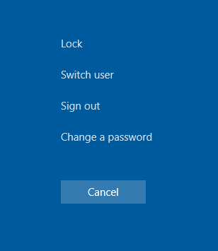

```
Available options after policy:
  ├── Lock
  ├── Switch user
  ├── Sign out
  └── Change a password

Missing:
  ✗ Task Manager   ← removed by GPO
```

> Users cannot end processes, monitor performance, or view running applications. This prevents users from killing security agents or manipulating system processes.

---

## 🔄 Applying Policies — gpupdate /force

After linking any GPO to an OU, run the following command on the client machine to force an immediate policy refresh without waiting for the 90-minute auto-refresh:

```
Win + R → gpupdate /force → OK
```

Or from Command Prompt / PowerShell:

```powershell
gpupdate /force
```

> **User Configuration** policies require the user to **log off and log back on** to take effect.  
> **Computer Configuration** policies require a **machine restart**.

---

## ✅ Verifying Applied Policies

Check which GPOs are applied to the current user/machine:

```powershell
# Summary view
gpresult /r

# Full HTML report
gpresult /h C:\gpo-report.html
```

---

## 📋 Complete Policy Path Reference

| GPO | Setting name | Full path in GPO editor |
|---|---|---|
| HideClock | Remove Clock from the system notification area | User Config → Admin Templates → Start Menu and Taskbar |
| NoProperties | Remove Properties from the Computer icon context menu | User Config → Admin Templates → Desktop |
| DisableUSB | Removable Disks: Deny read/write access | User Config → Admin Templates → System → Removable Storage Access |
| DisableUSB | CD and DVD: Deny read/write access | User Config → Admin Templates → System → Removable Storage Access |
| DisableUSB | WPD Devices: Deny read/write access | User Config → Admin Templates → System → Removable Storage Access |
| ALT+CTRL+DEL | Remove Task Manager | User Config → Admin Templates → System → Ctrl+Alt+Del Options |

---

## ✅ Lab Completion Checklist

- [ ] GPMC opened on Domain Controller
- [ ] GPO `HideClock` created and linked to HR OU
- [ ] Clock removed from HR user taskbar — confirmed with screenshot
- [ ] GPO `NoProperties` created and linked to HR OU
- [ ] Properties option removed from This PC right-click — confirmed
- [ ] GPO `DisableUSB` created and linked to HR OU
- [ ] All 6 removable storage settings enabled
- [ ] CD/DVD access denied error confirmed on client
- [ ] GPO `ALT+CTRL+DEL` created and linked to HR OU
- [ ] Task Manager absent from Ctrl+Alt+Del screen — confirmed
- [ ] `gpupdate /force` run on client machine
- [ ] `gpresult /r` run and all 4 GPOs listed as applied
- [ ] VM snapshot taken after all GPOs configured

---

## 📚 Terminology Reference

| Term | Definition |
|---|---|
| **GPO** | Group Policy Object — a named set of policy configurations applied to users or computers |
| **GPMC** | Group Policy Management Console — the DC tool for managing GPOs |
| **User Configuration** | GPO section whose settings follow the user account across all machines |
| **Computer Configuration** | GPO section that applies to a specific machine for all users |
| **Link Order** | The order in which multiple GPOs linked to the same OU are applied (lower number = applied last = highest priority) |
| **Link Enabled** | Whether the GPO link is active for the target OU |
| **GPO Status** | Whether the GPO itself is enabled, disabled, or partially disabled |
| **gpupdate /force** | Forces immediate policy refresh from the DC |
| **gpresult /r** | Displays which GPOs are currently applied to the user/machine |
| **Removable Storage Access** | GPO category for controlling access to USB, CD/DVD, and WPD devices |
| **WPD Devices** | Windows Portable Devices — phones, media players, cameras connected via MTP/PTP |

---

## 🔭 Next Session Preview

- **GPO inheritance and blocking** — preventing child OUs from inheriting parent policies
- **GPO enforcement** — forcing a policy to apply even when inheritance is blocked
- **Fine-Grained Password Policies** — different password rules for different user groups
- **Loopback processing** — applying user policies based on computer location

---

## 📄 License

This repository is for educational purposes. Feel free to fork and adapt for your own learning.
