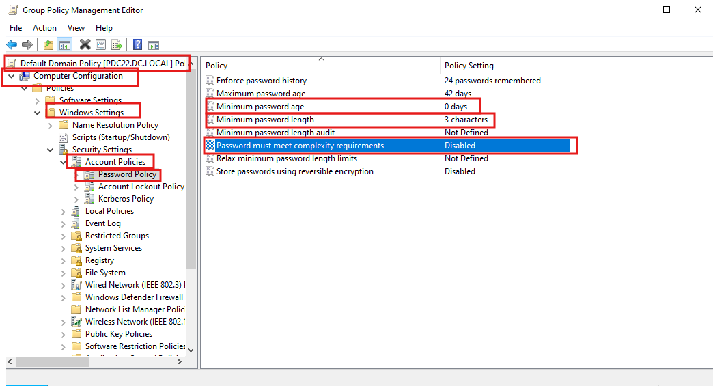
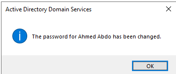
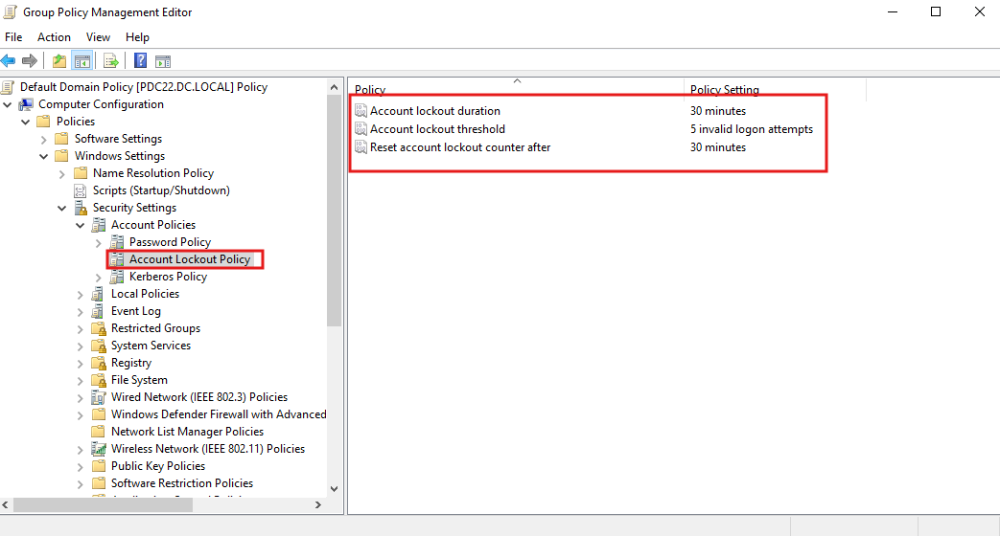
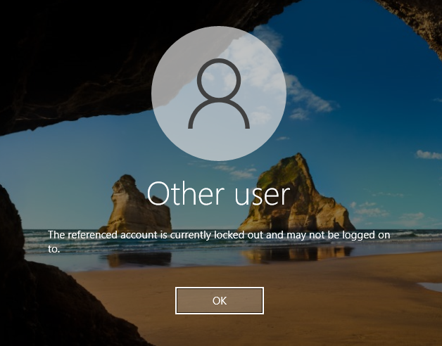
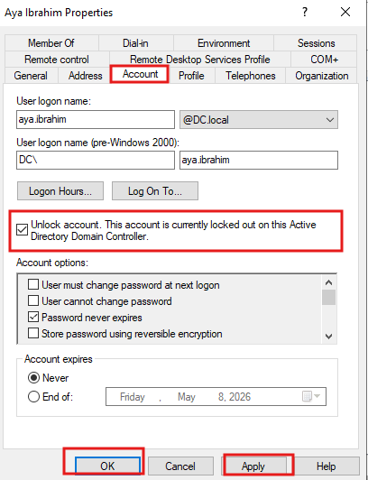
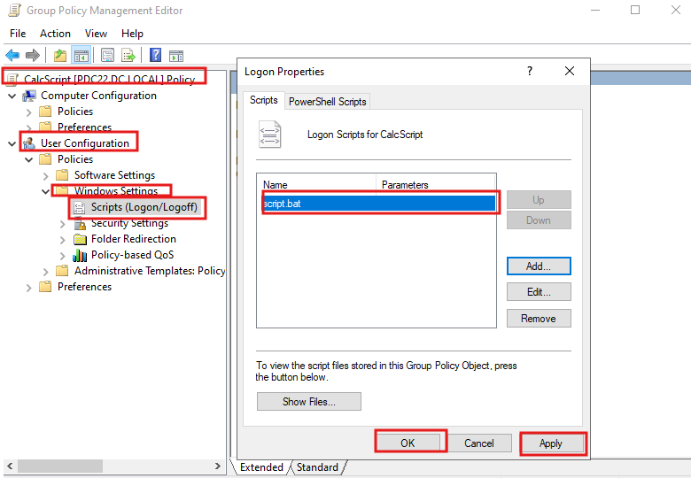
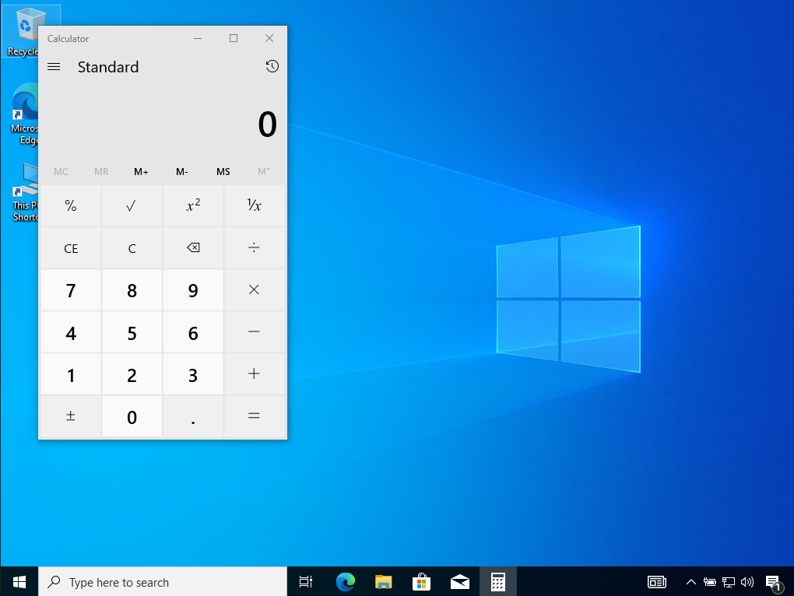
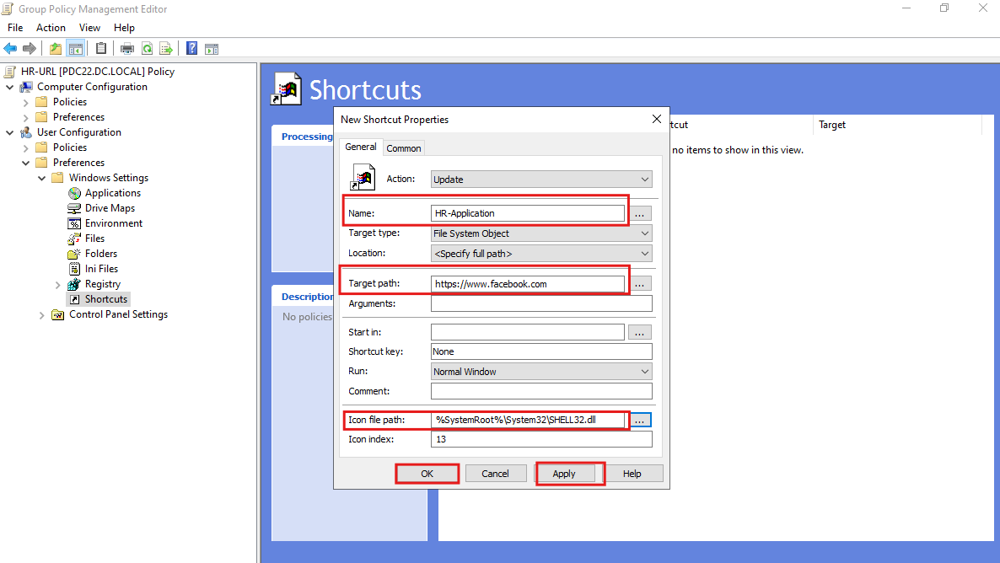
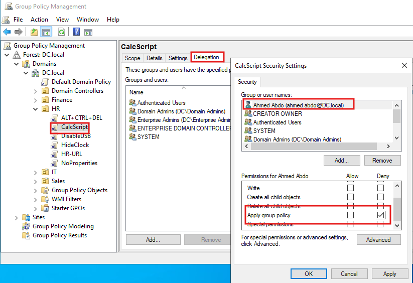

# 🔐 Advanced Group Policy Lab — Password Policy, Account Lockout, Logon Scripts, Shortcuts & Delegation

> A hands-on lab guide covering the Default Domain Password Policy, Account Lockout Policy, logon scripts via GPO, deploying desktop shortcuts through Preferences, and restricting GPO application using Delegation.


---

## 📖 Overview

This is **Session 16** of the Windows Server 2019 course. This session covers five advanced GPO topics — modifying the Default Domain Password Policy, configuring Account Lockout, deploying logon scripts, creating desktop shortcuts via GPO Preferences, and using GPO Delegation to exclude specific users from a policy.

> 📌 **Pre-requisite:** GPMC installed on DC, HR OU with user accounts, at least one Windows 10 client joined to the domain. Review Session 15 (Practical GPO Lab) if needed.

---

## 🎯 Topics Covered in This Lab

| # | Topic | GPO / Tool | Effect |
|---|---|---|---|
| 1 | **Password Policy** | Default Domain Policy | Relax complexity, set minimum length |
| 2 | **Reset user password** | ADUC | Change password for a specific user |
| 3 | **Account Lockout Policy** | Default Domain Policy | Lock after 5 failed attempts |
| 4 | **Locked account** | Login screen | Login blocked after too many attempts |
| 5 | **Unlock account** | ADUC → Account tab | Re-enable locked user |
| 6 | **Logon Script via GPO** | CalcScript GPO | Run script.bat at user logon |
| 7 | **Script result** | Client desktop | Calculator opens on login |
| 8 | **Desktop shortcut via Preferences** | HR-URL GPO | Deploy shortcut to HR users' desktops |
| 9 | **GPO Delegation / Exception** | CalcScript → Delegation | Deny GPO to a specific user |

---

## 🔑 Part 1 — Password Policy (Default Domain Policy)

The **Default Domain Policy** controls password rules for **all users** in the domain. It is configured under:

```
Default Domain Policy → Computer Configuration
→ Windows Settings → Security Settings
→ Account Policies → Password Policy
```

The screenshot below shows the current Password Policy settings, with **complexity disabled** and **minimum length set to 3 characters** — useful for lab environments:



### Password Policy Settings Reference

| Setting | Lab Value | Production Recommendation |
|---|---|---|
| Enforce password history | 24 passwords remembered | 24 |
| Maximum password age | 42 days | 60–90 days |
| Minimum password age | **0 days** | 1 day |
| Minimum password length | **3 characters** | 12+ characters |
| Password must meet complexity requirements | **Disabled** | Enabled |
| Store passwords using reversible encryption | Disabled | Disabled |

> ⚠️ In a **lab environment**, complexity is disabled and minimum length is lowered to simplify testing. In production, always enforce complexity and use a minimum of 12 characters.

### Resetting a User Password in ADUC

After modifying the password policy, you can reset a user's password from ADUC:

```
ADUC → Right-click user → Reset Password
→ Enter new password → OK
```

The screenshot below confirms the password was successfully changed for **Ahmed Abdo**:



---

## 🔒 Part 2 — Account Lockout Policy

The **Account Lockout Policy** automatically locks a user account after a set number of failed login attempts — protecting against brute-force attacks.

```
Default Domain Policy → Computer Configuration
→ Windows Settings → Security Settings
→ Account Policies → Account Lockout Policy
```

The screenshot below shows the Account Lockout Policy configured with 5 attempts, 30-minute lockout, and 30-minute counter reset:



### Account Lockout Settings

| Setting | Lab Value | Description |
|---|---|---|
| **Account lockout threshold** | **5 invalid logon attempts** | Account locks after 5 wrong passwords |
| **Account lockout duration** | **30 minutes** | Account automatically unlocks after 30 min |
| **Reset account lockout counter after** | **30 minutes** | Failed attempt counter resets after 30 min of no attempts |

### Locked Account — Login Screen

After exceeding 5 failed login attempts, the account is locked. The Windows login screen displays this error:



```
Error: "The referenced account is currently locked out
        and may not be logged on to."
```

### Unlocking an Account Manually in ADUC

An admin can unlock a locked account before the 30-minute timer expires:

```
ADUC → find the user → Right-click → Properties → Account tab
→ Check: "Unlock account. This account is currently locked out
          on this Active Directory Domain Controller."
→ Apply → OK
```

The screenshot below shows the **Aya Ibrahim** account with the unlock checkbox visible and selected:



> After unlocking, the user can log in immediately without waiting for the 30-minute auto-unlock timer.

---

## 📜 Part 3 — Logon Script via GPO (CalcScript)

A **logon script** runs automatically every time a user logs in. This is useful for mapping drives, launching applications, or running startup tasks.

### GPO: CalcScript

```
GPO name: CalcScript
Linked to: HR OU
Configuration: User Configuration
Path: User Configuration → Windows Settings → Scripts (Logon/Logoff)
→ Double-click Logon → Add → script.bat
```

The screenshot below shows `script.bat` added as the logon script in the **CalcScript** GPO:



### What script.bat Contains

```batch
@echo off
start calc.exe
```

This script launches **Calculator** automatically when the user logs in.

### Result — Calculator Opens on Login

After the policy is applied and the user logs in, Calculator opens automatically on the desktop:



> This demonstrates that logon scripts can launch **any application or command** — map network drives, connect VPN, sync files, or run PowerShell scripts.

### Common Logon Script Use Cases

| Script action | Command |
|---|---|
| Map a network drive | `net use Z: \\server\share` |
| Launch an application | `start notepad.exe` |
| Run a PowerShell script | `powershell.exe -File C:\scripts\startup.ps1` |
| Display a message | `msg * "Welcome to the company network!"` |
| Sync time with DC | `w32tm /resync` |

---

## 🔗 Part 4 — Desktop Shortcut via GPO Preferences (HR-URL)

GPO **Preferences** allow deploying desktop shortcuts to users — useful for pushing company application links or web URLs to all HR desktops automatically.

### GPO: HR-URL

```
GPO name: HR-URL
Linked to: HR OU
Configuration: User Configuration → Preferences → Windows Settings → Shortcuts
→ Right-click → New → Shortcut
```

The screenshot below shows the **New Shortcut Properties** dialog configured to deploy a shortcut named `HR-Application` pointing to `https://www.facebook.com`:



### Shortcut Configuration

| Field | Value |
|---|---|
| Action | Update |
| Name | `HR-Application` |
| Target type | File System Object |
| Target path | `https://www.facebook.com` |
| Icon file path | `%SystemRoot%\System32\SHELL32.dll` |
| Icon index | 13 |

> In a real environment, replace `https://www.facebook.com` with your internal application URL (e.g., `http://intranet.company.local` or `\\fileserver\HR`).

---

## 🛡️ Part 5 — GPO Delegation (Exclude a Specific User)

**GPO Delegation** controls which users or groups a GPO applies to. Using the **Deny** permission on `Apply group policy`, a specific user can be excluded from a GPO — even if they are in the OU it is linked to.

### Use Case

The `CalcScript` GPO opens Calculator for all HR users on login. You want to **exclude Ahmed Abdo** from this GPO.

### Steps

```
GPMC → HR OU → CalcScript GPO → Delegation tab
→ Advanced → Add user: Ahmed Abdo (ahmed.abdo@DC.local)
→ Permissions for Ahmed Abdo:
   └── Apply group policy → Deny ✅
→ Apply → OK
```

The screenshot below shows the `CalcScript` GPO Delegation tab with **Ahmed Abdo** selected and `Apply group policy` set to **Deny**:



### Delegation Result

| User | In HR OU? | Apply group policy | CalcScript runs? |
|---|---|---|---|
| All other HR users | ✅ Yes | Allow (default) | ✅ Yes — Calculator opens |
| Ahmed Abdo | ✅ Yes | **Deny** | ❌ No — excluded from GPO |

> This is the preferred method for GPO exceptions — cleaner and more auditable than moving the user to a different OU.

### GPO Security Filtering vs Delegation Deny — Which to Use?

| Method | How it works | Best for |
|---|---|---|
| **Security Filtering** | Remove Authenticated Users; add only target group | Applying GPO to a subset of the OU |
| **Delegation Deny** | Add specific user/group with Deny on Apply GPO | Excluding one or a few users from a GPO |

---

## 🔄 Apply Policies — gpupdate /force

After any GPO change, force an immediate refresh on the client:

```powershell
gpupdate /force
```

Then verify:

```powershell
# Check which GPOs are applied
gpresult /r

# Full HTML report
gpresult /h C:\gpo-report.html
```

---

## ✅ Lab Completion Checklist

- [ ] Default Domain Policy opened in GPO editor
- [ ] Password complexity disabled and minimum length set to 3 (lab only)
- [ ] User password reset in ADUC — confirmation dialog received
- [ ] Account Lockout Policy configured: 5 attempts / 30 min / 30 min reset
- [ ] Account lockout tested — login blocked after 5 failed attempts
- [ ] Locked account found and unlocked in ADUC → Account tab
- [ ] GPO `CalcScript` created and linked to HR OU
- [ ] `script.bat` added as logon script under User Configuration
- [ ] Calculator confirmed opening on HR user login
- [ ] GPO `HR-URL` created and linked to HR OU
- [ ] Desktop shortcut `HR-Application` deployed via Preferences → Shortcuts
- [ ] Ahmed Abdo excluded from `CalcScript` via Delegation → Deny
- [ ] `gpupdate /force` run and `gpresult /r` verified
- [ ] VM snapshot taken after all configurations

---

## 📚 Terminology Reference

| Term | Definition |
|---|---|
| **Default Domain Policy** | The built-in GPO applied to all users and computers in the domain — controls password and lockout policies |
| **Password Policy** | Rules governing password length, complexity, age, and history for domain accounts |
| **Account Lockout Policy** | Automatically locks a user account after a defined number of failed login attempts |
| **Lockout threshold** | The number of failed attempts before an account is locked |
| **Lockout duration** | How long an account stays locked before automatically unlocking |
| **Logon Script** | A script (batch, PowerShell, VBScript) that runs automatically when a user logs in |
| **GPO Preferences** | GPO section for deploying settings that users can modify (unlike enforced Policies) |
| **Shortcuts (Preferences)** | Deploy desktop or Start Menu shortcuts to user machines via GPO |
| **GPO Delegation** | Controls which users/groups a GPO applies to via Allow/Deny permissions |
| **Apply group policy (Deny)** | Permission setting that excludes a user or group from receiving a specific GPO |
| **Security Filtering** | Limits which objects within an OU receive the GPO by adjusting group membership on the scope |

---

## 🔭 Next Session Preview

- **GPO inheritance and blocking** — `Block Inheritance` on OUs and `Enforced` on GPOs
- **Loopback processing** — applying user settings based on which machine the user is on
- **Fine-Grained Password Policies** — different password rules for different user groups (PSOs)
- **Drive mapping via GPO Preferences**

---

## 📄 License

This repository is for educational purposes. Feel free to fork and adapt for your own learning.
