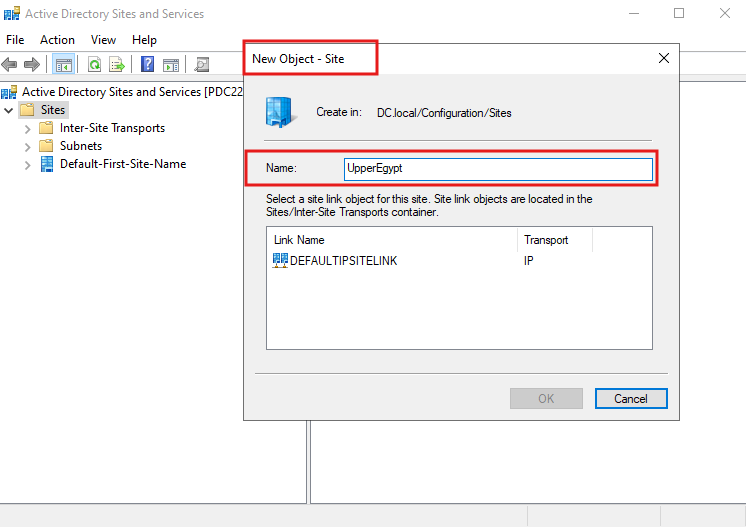
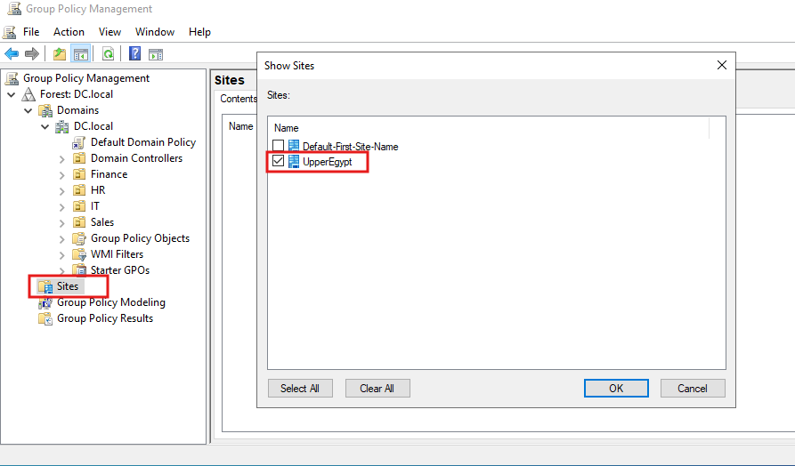
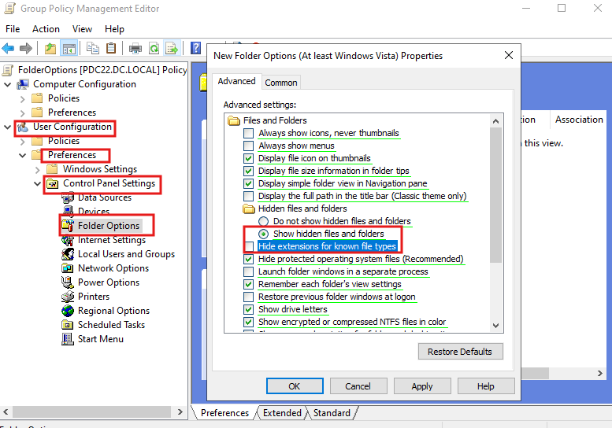
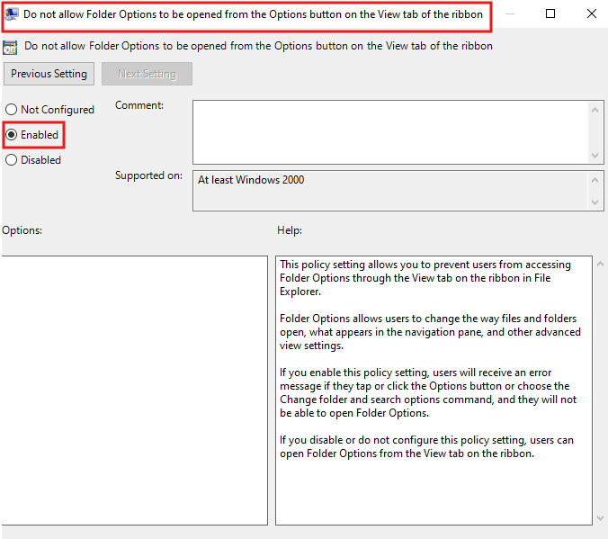
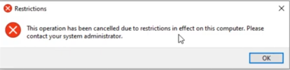

# 🌐 AD Sites & Services, Site-Level GPO, Folder Options via Preferences & Policy

> A hands-on lab guide covering Active Directory Sites and Services, linking GPOs to Sites, deploying Folder Options settings via GPO Preferences, and locking down Folder Options access via Policy.


---

## 📖 Overview

This is **Session 17** of the Windows Server 2019 course. This session covers three advanced topics: creating AD Sites in **Active Directory Sites and Services**, linking GPOs at the **Site level** in GPMC, configuring **Folder Options** settings through GPO Preferences, and blocking users from accessing Folder Options via a Policy setting.

> 📌 **Pre-requisite:** Domain Controller with AD DS installed, GPMC available, at least one Windows 10 client joined to the domain.

---

## 🎯 Topics Covered in This Lab

| # | Topic | Tool | Effect |
|---|---|---|---|
| 1 | **Create an AD Site** | AD Sites and Services | Define a physical network location (UpperEgypt) |
| 2 | **Link GPO to a Site** | GPMC → Sites | Apply a GPO to all machines in that physical site |
| 3 | **Folder Options via Preferences** | GPO Preferences → Control Panel Settings | Deploy file/folder visibility settings to users |
| 4 | **Block Folder Options access** | GPO Policy → Administrative Templates | Prevent users from changing Folder Options |
| 5 | **Restriction result** | Client machine | Error when user tries to open Folder Options |

---

## 🗺️ Part 1 — Active Directory Sites and Services

### What Is a Site?

In Active Directory, a **Site** represents a **physical geographic location** — a building, a branch office, or a region — that contains one or more subnets. Sites help AD optimize:

- **Replication traffic** between Domain Controllers in different locations
- **Client authentication** — clients are directed to the nearest DC for faster login
- **GPO targeting** — policies can be applied to all machines in a physical site

```
AD logical structure:         AD physical structure:
Forest: DC.local              Sites:
└── Domain: DC.local          ├── Default-First-Site-Name (HQ)
    ├── HR OU                 └── UpperEgypt (branch)
    ├── IT OU                     └── Subnets: 192.168.2.0/24
    └── Sales OU
```

### Creating a New Site — UpperEgypt

```
Server Manager → Tools → Active Directory Sites and Services
→ Right-click Sites → New Site
→ Name: UpperEgypt
→ Select site link: DEFAULTIPSITELINK
→ OK
```

The screenshot below shows the **New Object - Site** dialog with the name `UpperEgypt` and `DEFAULTIPSITELINK` selected as the transport:



### AD Sites and Services Tree

After creation, the console shows:

```
Active Directory Sites and Services [PDC22]
└── Sites
    ├── Inter-Site Transports
    ├── Subnets
    ├── Default-First-Site-Name    ← HQ / main office
    └── UpperEgypt                 ← new branch site
```

### Site Link — DEFAULTIPSITELINK

| Property | Value |
|---|---|
| Name | DEFAULTIPSITELINK |
| Transport | IP |
| Purpose | Connects sites and controls replication schedule and cost |

> After creating a site, assign **subnets** to it so AD knows which IP ranges belong to that physical location:
> ```
> AD Sites and Services → Subnets → New Subnet
> → IP prefix: 192.168.2.0/24
> → Select site: UpperEgypt
> ```

---

## 🔗 Part 2 — Linking a GPO to a Site in GPMC

Sites appear in GPMC under the forest and can have GPOs linked to them — just like Domains and OUs.

### Showing Sites in GPMC

```
GPMC → right-click Sites → Show Sites...
→ Check: UpperEgypt → OK
```

The screenshot below shows the **Show Sites** dialog in GPMC with `UpperEgypt` selected to be displayed:



### Linking a GPO to a Site

Once the site is visible in GPMC:

```
GPMC → Sites → UpperEgypt
→ Right-click → Link an Existing GPO...
→ Select the GPO to link → OK
```

### GPO Application Hierarchy — Reminder

```
1. LOCAL          ← single machine (lowest priority)
        ↓
2. SITE           ← physical location (UpperEgypt)  ← linked here
        ↓
3. DOMAIN         ← all users and computers in DC.local
        ↓
4. OU             ← targeted department (HR, IT, Finance)
```

> Site-level GPOs apply to **all machines physically located in that site** — regardless of which OU the computer account belongs to. This is useful for location-specific settings like proxy servers or regional time zones.

---

## 📁 Part 3 — Folder Options via GPO Preferences

**GPO Preferences** allow deploying specific Folder Options settings to users — such as showing hidden files and showing file extensions — without fully locking the setting (users can still change it).

### GPO: FolderOptions

```
GPO name: FolderOptions
Linked to: target OU (e.g., HR)
Configuration: User Configuration → Preferences
Path: User Configuration → Preferences
      → Control Panel Settings → Folder Options
      → New → Folder Options (At least Windows Vista)
```

The screenshot below shows the **New Folder Options Properties** dialog inside the GPO editor with two settings configured:



### Settings Configured via Preferences

| Setting | Value set | Effect |
|---|---|---|
| **Show hidden files and folders** | ✅ Enabled | Hidden files and folders become visible in File Explorer |
| **Hide extensions for known file types** | ✅ Checked | File extensions (`.exe`, `.docx`, etc.) are hidden from filenames |

> **Preferences vs Policy:** Settings in Preferences are **suggestions** — they push the setting at login but users can change them back. Settings in Policy are **enforced** and cannot be overridden by users.

### Path in GPO Editor

```
User Configuration
└── Preferences
    └── Control Panel Settings
        └── Folder Options     ← right-click → New → Folder Options (At least Windows Vista)
```

---

## 🔒 Part 4 — Block Access to Folder Options (Policy)

To **prevent users from changing** Folder Options at all, use a Policy setting that hides the Options button in File Explorer.

### Policy Setting

```
GPO: FolderOptions (or a separate GPO)
Configuration: User Configuration
Path: User Configuration → Administrative Templates
      → Windows Components → File Explorer
      → "Do not allow Folder Options to be opened from the
         Options button on the View tab of the ribbon"
      → Set to: Enabled
```

The screenshot below shows the policy set to **Enabled**, which blocks access to Folder Options via the File Explorer ribbon:



| Field | Value |
|---|---|
| Policy name | Do not allow Folder Options to be opened from the Options button on the View tab of the ribbon |
| State | **Enabled** |
| Configuration | User Configuration → Administrative Templates → Windows Components → File Explorer |
| Supported on | At least Windows 2000 |

---

## 🚫 Part 5 — Result: Folder Options Blocked

After the policy is applied and the user logs off and back on, attempting to open Folder Options produces a restrictions error:



```
Error: "This operation has been cancelled due to restrictions
        in effect on this computer. Please contact your
        system administrator."
```

> This confirms the policy is working. The user cannot access Folder Options from File Explorer — protecting settings like hidden file visibility from being toggled by end users.

---

## 🔄 Applying Policies

After creating or modifying any GPO, force an immediate update on the client:

```powershell
gpupdate /force
```

Then verify which GPOs are applied:

```powershell
# Summary
gpresult /r

# Full HTML report
gpresult /h C:\gpo-report.html
```

> **User Configuration** policies require the user to **log off and log back on**.
> **Computer Configuration** policies require a **machine restart**.

---

## 📋 Preferences vs Policy — Key Difference

| Feature | GPO Preferences | GPO Policy |
|---|---|---|
| **User can override?** | ✅ Yes — setting is applied but not enforced | ❌ No — setting is locked |
| **Use case** | Deploy a default configuration users can change | Enforce a setting that must always be applied |
| **Folder Options example** | Push "show hidden files" as default | Block access to Folder Options entirely |
| **Registry behavior** | Writes to user registry; user can rewrite | Writes to enforced policy registry keys; user cannot change |

---

## ✅ Lab Completion Checklist

- [ ] `Active Directory Sites and Services` opened on DC
- [ ] New site `UpperEgypt` created with `DEFAULTIPSITELINK`
- [ ] Subnet assigned to `UpperEgypt` (e.g., `192.168.2.0/24`)
- [ ] `UpperEgypt` site shown in GPMC via Show Sites
- [ ] GPO linked to `UpperEgypt` site in GPMC
- [ ] GPO `FolderOptions` created and linked to target OU
- [ ] Folder Options Preferences configured: show hidden files, hide extensions
- [ ] Policy setting enabled: Do not allow Folder Options to be opened
- [ ] `gpupdate /force` run on client machine
- [ ] Restriction error confirmed when user tries to open Folder Options
- [ ] VM snapshot taken after configuration

---

## 📚 Terminology Reference

| Term | Definition |
|---|---|
| **AD Sites and Services** | MMC console for managing physical AD topology — sites, subnets, and site links |
| **Site** | A physical location in AD, defined by one or more IP subnets |
| **Site Link** | Defines the connection between two sites and controls replication cost and schedule |
| **DEFAULTIPSITELINK** | The default site link created during AD DS installation; uses IP transport |
| **Subnet** | An IP address range assigned to a site to map machines to their physical location |
| **Site-level GPO** | A GPO linked to a Site in GPMC — applies to all machines in that physical location |
| **GPO Preferences** | GPO section for deploying configurable settings that users can modify |
| **GPO Policy** | GPO section for enforced settings that users cannot override |
| **Folder Options** | Windows File Explorer settings controlling file/folder visibility and display |
| **Restrictions error** | Error shown when a user attempts an action blocked by a GPO policy |

---

## 🔭 Next Session Preview

- **GPO inheritance blocking** — `Block Inheritance` on OUs
- **Enforced GPOs** — overriding blocked inheritance
- **Fine-Grained Password Policies (PSOs)** — different password rules per group
- **Drive mapping via GPO Preferences**

---

## 📄 License

This repository is for educational purposes. Feel free to fork and adapt for your own learning.
