# 🛡️ GPO Lab — Control Panel Restrictions, Startup Scripts, Firewall Rules & Shortcuts

> A comprehensive hands-on lab guide covering Control Panel access policies, selective item visibility, startup batch scripts for local admin deployment, Windows Firewall rules via GPO, desktop shortcuts via Preferences, and Control Panel view enforcement.


---

## 📖 Overview

This is **Session 18** of the Windows Server 2019 course. This session covers eight practical GPO topics — blocking the entire Control Panel, hiding specific items, showing only specified items, deploying local admin accounts via startup scripts, adding IT groups to local admins, enabling File and Printer Sharing via Windows Firewall rules, deploying desktop shortcuts, and enforcing the Control Panel icon view.

---

## 🎯 Topics Covered in This Lab

| # | Topic | GPO / Tool | Effect |
|---|---|---|---|
| 1 | **Prohibit Control Panel** | Policy | Block all Control Panel access |
| 2 | **Restriction error** | Client | Error when user tries to open Control Panel |
| 3 | **Hide specific CP items** | Policy | Hide User Accounts, Network, Programs |
| 4 | **Show only specified items** | Policy | Show only Fonts in Control Panel |
| 5 | **Fonts-only result** | Client | Control Panel shows only Fonts |
| 6 | **Password Policy review** | Default Domain Policy | Current domain password settings |
| 7 | **Account Lockout review** | Default Domain Policy | Current lockout configuration |
| 8 | **AddLocalAdmin.bat** | Startup Script | Create local admin account on all machines |
| 9 | **Startup script in GPO** | Computer Config | AddLocalAdmin.bat added to startup scripts |
| 10 | **Result — new_admin added** | Client | new_admin appears in local Administrators |
| 11 | **AddITGroupToLocalAdmins.bat** | Startup Script | Add IT-Group to local Admins domain-wide |
| 12 | **Both scripts in GPO** | Computer Config | Both .bat files in startup scripts |
| 13 | **Result — DC\IT-Group added** | Client | DC\IT-Group in local Administrators |
| 14 | **Firewall rules via GPO** | Computer Config | Enable File and Printer Sharing inbound rules |
| 15 | **Remote access via C$** | Client | Ping success + browse \\192.168.1.32\c$ |
| 16 | **Desktop shortcut via Preferences** | User Config Preferences | Deploy HR Application shortcut |
| 17 | **Always open CP in icon view** | Policy | Force Control Panel to open in icon view |
| 18 | **Control Panel icon view result** | Client | All items displayed as large icons |

---

## 🚫 Part 1 — Prohibit Access to Control Panel and PC Settings

**Goal:** Block all Control Panel access for targeted users.

```
GPO path: User Configuration
→ Administrative Templates → Control Panel
→ Prohibit access to Control Panel and PC settings
→ Set to: Enabled
```

The screenshot below shows the policy set to **Enabled** — it disables both `Control.exe` and `SystemSettings.exe`, removing Control Panel from the Start screen and File Explorer:

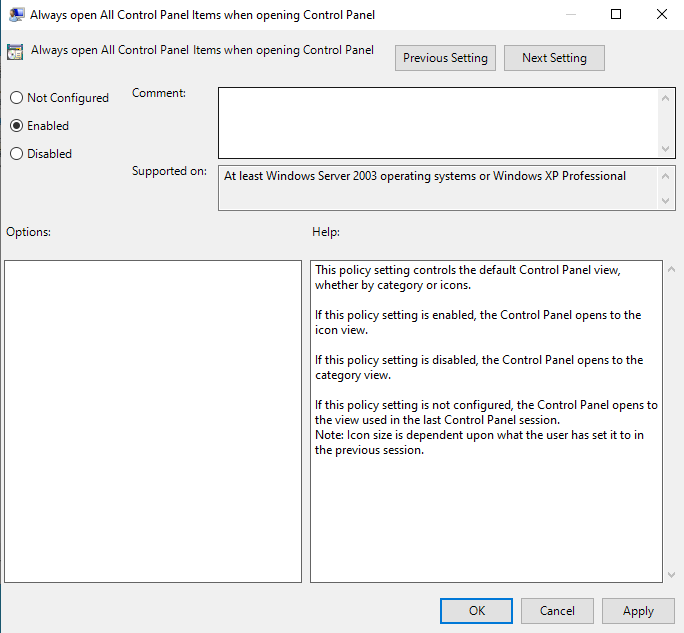

### What This Policy Removes

- Control Panel from the Start screen
- Control Panel from File Explorer
- PC Settings from Settings charm, account picture, and search results

---

## ❌ Part 2 — Restriction Error Result

After the policy applies, attempting to open Control Panel displays this error on the client:

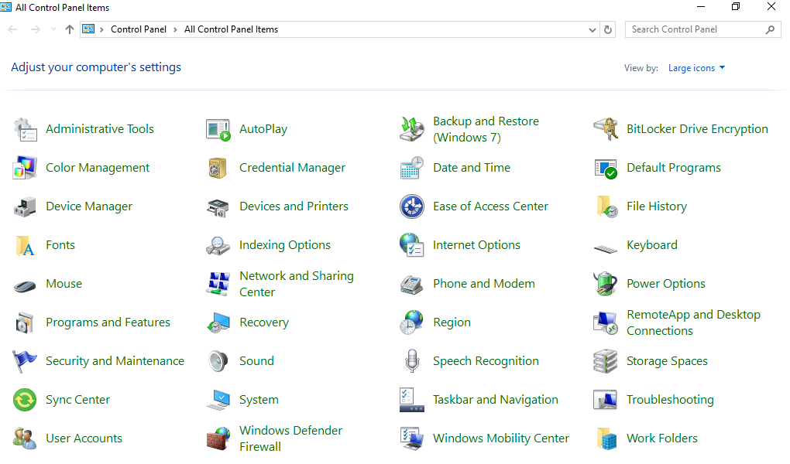

```
Error: "This operation has been cancelled due to restrictions
        in effect on this computer. Please contact your
        system administrator."
```

---

## 🙈 Part 3 — Hide Specified Control Panel Items

Instead of blocking everything, this policy hides **specific** Control Panel items while leaving the rest accessible.

```
GPO path: User Configuration
→ Administrative Templates → Control Panel
→ Hide specified Control Panel items
→ Set to: Enabled → Show Contents
→ Add items to hide:
   - User Accounts
   - Network and Internet
   - Programs and Features
```

The screenshot below shows the policy **Enabled** with three items added to the disallowed list:

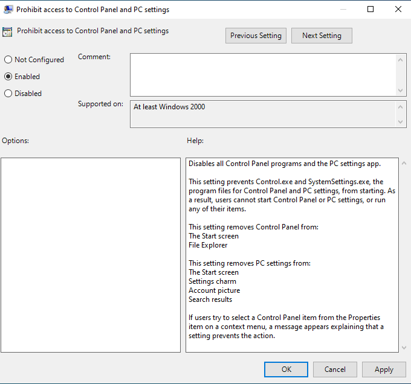

---

## 👁️ Part 4 — Show Only Specified Control Panel Items

The opposite approach — whitelist specific items, hiding everything else.

```
GPO path: User Configuration
→ Administrative Templates → Control Panel
→ Show only specified Control Panel items
→ Set to: Enabled → Show Contents
→ Add allowed items:
   - Fonts
```

The screenshot below shows only `Fonts` in the allowed list:

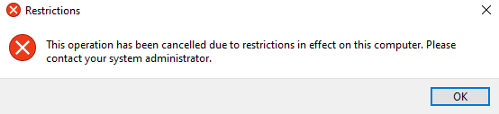

---

## 🔤 Part 5 — Result: Fonts Only in Control Panel

After applying the whitelist policy, the Control Panel shows only the **Fonts** item:

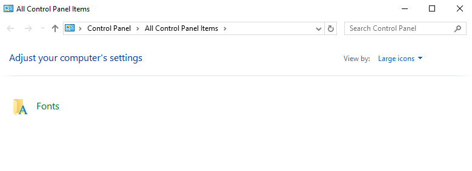

> This is the most restrictive filtering approach. Users can access only the items explicitly listed — everything else is hidden.

### Control Panel Restriction Comparison

| Policy | Effect | Use case |
|---|---|---|
| **Prohibit access to Control Panel** | Blocks all access | Maximum restriction |
| **Hide specified items** | Hides listed items, rest visible | Block specific dangerous settings |
| **Show only specified items** | Shows only listed items, rest hidden | Allow only approved settings |

---

## 🔑 Part 6 — Password Policy Review

Current Default Domain Password Policy settings confirmed in the GPO editor:

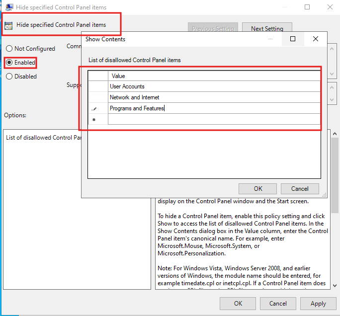

| Setting | Current Value |
|---|---|
| Enforce password history | 24 passwords remembered |
| Maximum password age | 42 days |
| Minimum password age | 0 days |
| Minimum password length | 3 characters |
| Password must meet complexity requirements | **Disabled** |
| Store passwords using reversible encryption | Disabled |

---

## 🔒 Part 7 — Account Lockout Policy Review

Current Account Lockout Policy confirmed:

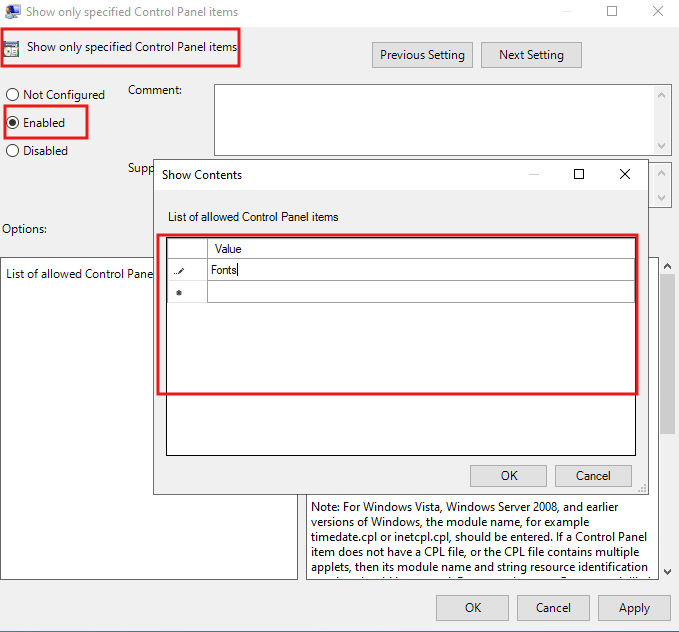

| Setting | Current Value |
|---|---|
| Account lockout duration | 30 minutes |
| Account lockout threshold | 5 invalid logon attempts |
| Reset account lockout counter after | 30 minutes |

---

## 🖥️ Part 8 — AddLocalAdmin.bat — Startup Script

A **Computer Configuration startup script** runs at machine boot — before any user logs in. This is used to create a standardized local admin account on all domain-joined machines automatically.

### Script: AddLocalAdmin.bat

The script creates a new local user `new_admin` and adds it to the local Administrators group:

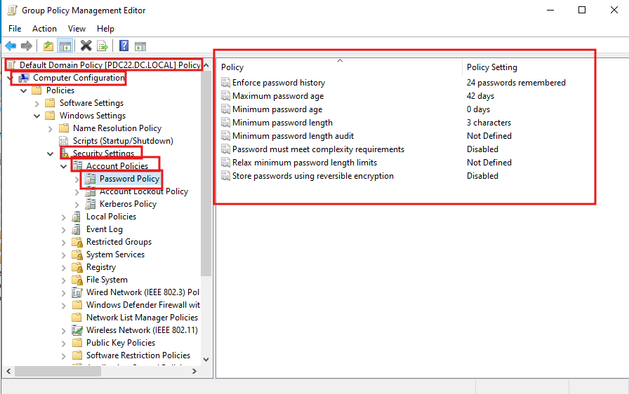

```batch
net user new_admin P@$$w0rd /add
net localgroup Administrators new_admin /add
```

| Command | What it does |
|---|---|
| `net user new_admin P@$$w0rd /add` | Creates a local user named `new_admin` with the specified password |
| `net localgroup Administrators new_admin /add` | Adds `new_admin` to the local Administrators group |

---

## ⚙️ Part 9 — Adding the Script to GPO Startup

```
GPO: AddLocalAdminScript
Configuration: Computer Configuration
Path: Computer Configuration → Windows Settings
      → Scripts (Startup/Shutdown) → Startup
      → Add → AddLocalAdmin.bat
```

The screenshot below shows `AddLocalAdmin.bat` added as a startup script in the GPO editor:

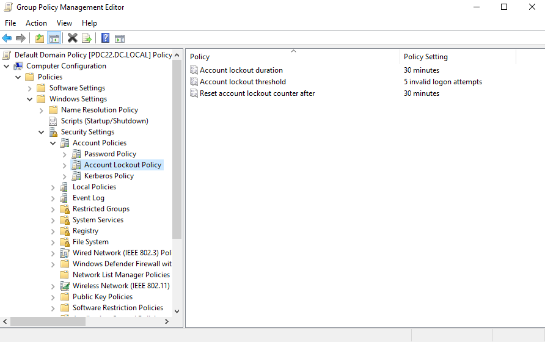

---

## ✅ Part 10 — Result: new_admin in Local Administrators

After the GPO applies and the machine restarts, `new_admin` appears in the local Administrators group:

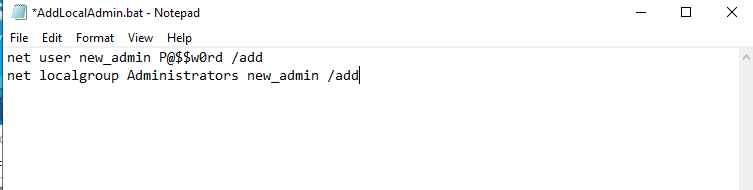

```
Local Administrators members:
├── Administrator
├── DC\Domain Admins
├── DC\maya.saad
├── itadmin
└── new_admin     ← added by startup script
```

---

## 👥 Part 11 — AddITGroupToLocalAdmins.bat

A second startup script adds the domain **IT-Group** to the local Administrators group on all machines — giving IT support staff admin rights without Domain Admin privileges.

### Script: AddITGroupToLocalAdmins.bat

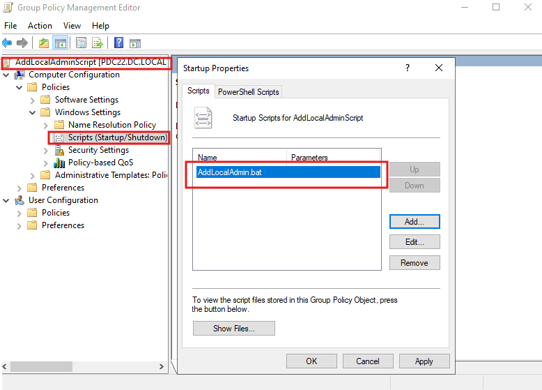

```batch
net localgroup Administrators "DC\IT-Group" /add
```

| Command | What it does |
|---|---|
| `net localgroup Administrators "DC\IT-Group" /add` | Adds the domain group `DC\IT-Group` to the local Administrators group |

---

## ⚙️ Part 12 — Both Scripts in GPO Startup

Both batch files are added to the same startup scripts GPO:

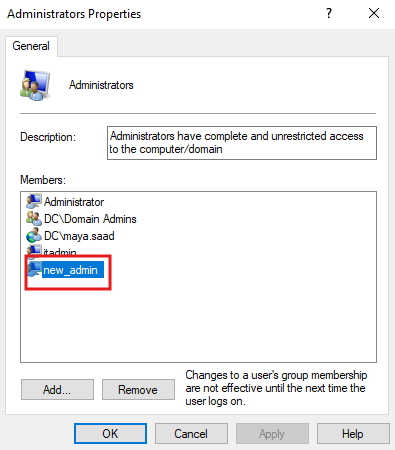

```
GPO: AddLocalAdminScript → Startup Scripts:
├── AddLocalAdmin.bat
└── AddITGroupToLocalAdmins.bat
```

> Both scripts run at machine startup — before any user logs in. Order matters if scripts depend on each other; use the Up/Down buttons to set execution order.

---

## ✅ Part 13 — Result: DC\IT-Group in Local Administrators

After restart, the local Administrators group contains both entries from the scripts:

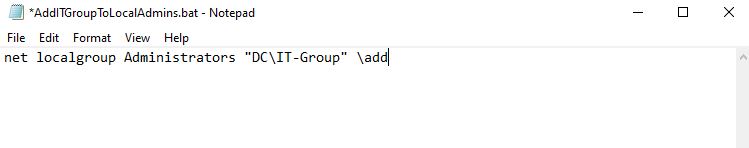

```
Local Administrators members:
├── Administrator
├── DC\Domain Admins
├── DC\IT-Group      ← added by AddITGroupToLocalAdmins.bat
├── DC\maya.saad
├── itadmin
└── new_admin
```

---

## 🔥 Part 14 — Windows Firewall Rules via GPO

To allow File and Printer Sharing (accessing `\\machine\c$` shares) from the DC or other machines, enable the relevant Windows Firewall inbound rules via GPO.

```
GPO: AllowFileAndPrinterSharing
Configuration: Computer Configuration
Path: Computer Configuration → Windows Settings
      → Security Settings
      → Windows Defender Firewall with Advanced Security
      → Windows Defender Firewall with Advanced Security
      → Inbound Rules
      → New Rule → Predefined → File and Printer Sharing → Enable all
```

The screenshot below shows all **File and Printer Sharing** inbound rules enabled (green checkmarks, Profile: All, Enabled: Yes):

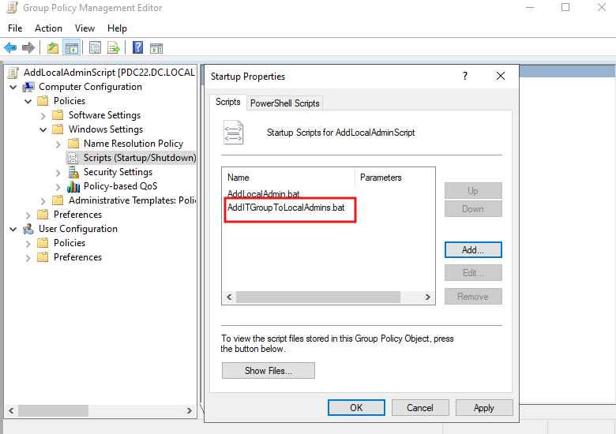

### Rules Enabled

| Rule | Purpose |
|---|---|
| File and Printer Sharing (LLMNR-UDP-In) | Name resolution on local network |
| File and Printer Sharing (NB-Datagram-In) | NetBIOS datagram service |
| File and Printer Sharing (Echo Request - ICMPv4) | Allows ping from other machines |
| File and Printer Sharing (SMB-In) | Core file sharing via SMB protocol |
| File and Printer Sharing (NB-Session-In) | NetBIOS session service |
| File and Printer Sharing (Spooler Service - RPC) | Printer sharing via RPC |
| File and Printer Sharing (NB-Name-In) | NetBIOS name service |

---

## 🌐 Part 15 — Remote Access via C$ Share

After the firewall rules are applied, the DC can ping the client and browse its C$ administrative share:

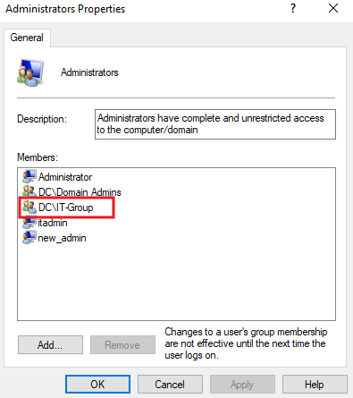

```powershell
# Ping now succeeds
ping 192.168.1.32
# Reply from 192.168.1.32: bytes=32 time<1ms TTL=128

# Browse C$ share in File Explorer
\\192.168.1.32\c$
# Shows: PerfLogs, Program Files, Users, Windows
```

> The `C$` share is a **hidden administrative share** that exists on every Windows machine. Only administrators can access it. It provides full access to the C: drive over the network — useful for remote management and file transfer.

---

## 🔗 Part 16 — Desktop Shortcut via GPO Preferences (ApplicationShortcut)

Deploy a desktop shortcut to all HR users pointing to an internal application or URL.

```
GPO: ApplicationShortcut
Configuration: User Configuration → Preferences
Path: User Configuration → Preferences → Windows Settings → Shortcuts
→ New → Shortcut
```

The screenshot below shows the **HR Application** shortcut configured to point to `hr.test.local`:

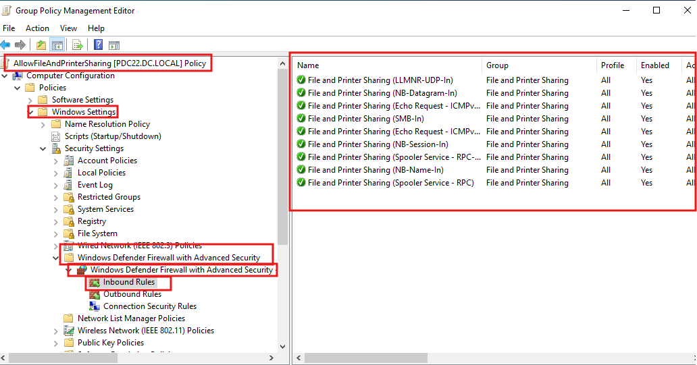

### Shortcut Configuration

| Field | Value |
|---|---|
| Action | Update |
| Name | `HR Application` |
| Target type | File System Object |
| Target path | `hr.test.local` |
| Icon file path | `%SystemRoot%\System32\SHELL32.dll` |
| Icon index | 43 |

---

## 🗂️ Part 17 — Force Control Panel to Open in Icon View

By default, Control Panel opens in Category view. This policy forces it to always open in **icon view** for easier navigation.

```
GPO path: User Configuration
→ Administrative Templates → Control Panel
→ Always open All Control Panel Items when opening Control Panel
→ Set to: Enabled
```

The screenshot below shows the policy set to **Enabled**:

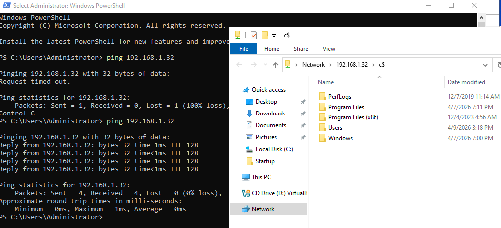

| State | Behavior |
|---|---|
| **Enabled** | Control Panel always opens in icon view |
| Disabled | Control Panel opens in category view |
| Not Configured | Remembers the view from the last session |

---

## 🖼️ Part 18 — Result: Control Panel in Icon View

After the policy applies, Control Panel opens directly in **Large Icons** view showing all items:

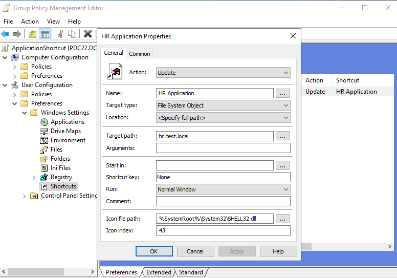

> All Control Panel items are visible as large icons — no category grouping. This is the most navigable view for IT-managed machines.

---

## 🔄 Applying Policies

After any GPO change:

```powershell
# Force immediate policy refresh on client
gpupdate /force

# Verify applied GPOs
gpresult /r

# Full report
gpresult /h C:\gpo-report.html
```

> **Startup scripts** (Computer Configuration) require a **machine restart** — `gpupdate /force` alone is not enough.

---

## ✅ Lab Completion Checklist

- [ ] "Prohibit access to Control Panel" policy enabled — restriction error confirmed
- [ ] "Hide specified Control Panel items" configured: User Accounts, Network, Programs
- [ ] "Show only specified Control Panel items" configured: Fonts only — result confirmed
- [ ] Password Policy reviewed in Default Domain Policy
- [ ] Account Lockout Policy reviewed: 5 attempts / 30 min
- [ ] `AddLocalAdmin.bat` created and added to GPO startup scripts
- [ ] Machine restarted — `new_admin` confirmed in local Administrators
- [ ] `AddITGroupToLocalAdmins.bat` created and added to same GPO
- [ ] Machine restarted — `DC\IT-Group` confirmed in local Administrators
- [ ] `AllowFileAndPrinterSharing` GPO created with all inbound rules enabled
- [ ] Ping and `\\IP\c$` access confirmed after firewall GPO
- [ ] `ApplicationShortcut` GPO created — HR Application shortcut deployed to desktop
- [ ] "Always open Control Panel in icon view" policy enabled — result confirmed
- [ ] `gpupdate /force` run and `gpresult /r` verified
- [ ] VM snapshot taken after all configurations

---

## 📚 Terminology Reference

| Term | Definition |
|---|---|
| **Startup Script** | A script that runs at computer startup under Computer Configuration — before any user logs in |
| **net user** | Command to create, delete, or modify local user accounts |
| **net localgroup** | Command to add or remove users/groups from local groups |
| **C$ share** | A hidden administrative share providing full network access to the C: drive |
| **File and Printer Sharing** | Windows feature enabling shared access to files and printers over a network |
| **SMB** | Server Message Block — protocol used for Windows file sharing |
| **GPO Preferences → Shortcuts** | Deploys desktop or Start Menu shortcuts to users via GPO |
| **Icon view** | Control Panel display mode showing all items as individual icons |
| **Prohibit Control Panel** | Policy that blocks all Control Panel and PC Settings access |
| **Hide specified items** | Blacklist approach — hides named Control Panel items |
| **Show only specified items** | Whitelist approach — shows only named Control Panel items |

---

## 🔭 Next Session Preview

- **GPO Inheritance Blocking** — `Block Inheritance` on child OUs
- **Enforced GPOs** — overriding blocked inheritance with Enforced flag
- **Fine-Grained Password Policies** — different password rules for different groups
- **Drive mapping via GPO Preferences**

---

## 📄 License

This repository is for educational purposes. Feel free to fork and adapt for your own learning.
