# 📋 GPO Practical Lab Exam — exam.local Domain

> A complete end-to-end lab exam solution covering domain setup, OU/user/group creation, domain join, and 8 GPO requirements for the HR department on the `exam.local` domain.


---

## 📄 Lab Requirements

The screenshot below shows the full exam task list:

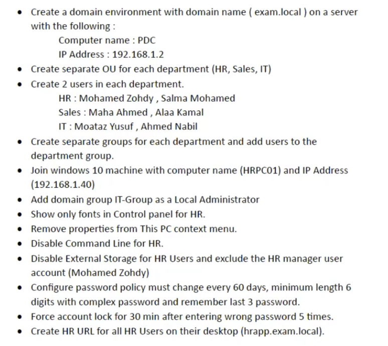

### Requirements Summary

| # | Requirement |
|---|---|
| 1 | Create domain `exam.local` on server: **PDC**, IP: `192.168.1.2` |
| 2 | Create OUs: **HR**, **Sales**, **IT** |
| 3 | Create 2 users per OU (HR: Mohamed Zohdy, Salma Mohamed / Sales: Maha Ahmed, Alaa Kamal / IT: Moataz Yusuf, Ahmed Nabil) |
| 4 | Create a group per department and add users to their group |
| 5 | Join Windows 10 machine **HRPC01** (IP: `192.168.1.40`) to the domain |
| 6 | Add domain group **IT-Group** as a Local Administrator on machines |
| 7 | Show only **Fonts** in Control Panel for HR users |
| 8 | Remove **Properties** from the This PC context menu for HR users |
| 9 | Disable **Command Prompt** for HR users |
| 10 | Disable external storage for HR users — **exclude Mohamed Zohdy** |
| 11 | Password policy: change every **60 days**, min **6 characters**, complexity **enabled**, remember last **3 passwords** |
| 12 | Account lockout: **30 min** after **5 wrong attempts** |
| 13 | Create **HR URL** shortcut on all HR user desktops pointing to `hrapp.exam.local` |

---

## 🏗️ Step 1 — Domain & AD Structure

### Domain Setup

```
Computer name:  PDC
Domain name:    exam.local
IP Address:     192.168.1.2
DNS:            127.0.0.1 (self)
```

### OU and User Structure

```
exam.local
├── HR
│   ├── Mohamed Zohdy    (mohamed.zohdy)
│   └── Salma Mohamed    (salma.mohamed)
├── Sales
│   ├── Maha Ahmed       (maha.ahmed)
│   └── Alaa Kamal       (alaa.kamal)
├── IT
│   ├── Moataz Yusuf     (moataz.yusuf)
│   └── Ahmed Nabil      (ahmed.nabil)
└── Groups
    ├── HR-Group
    ├── Sales-Group
    └── IT-Group
```

---

## 💻 Step 2 — Join HRPC01 to the Domain

The screenshot below shows **HRPC01** joining `EXAM.LOCAL` using the credentials of `mohamed.zohdy`:

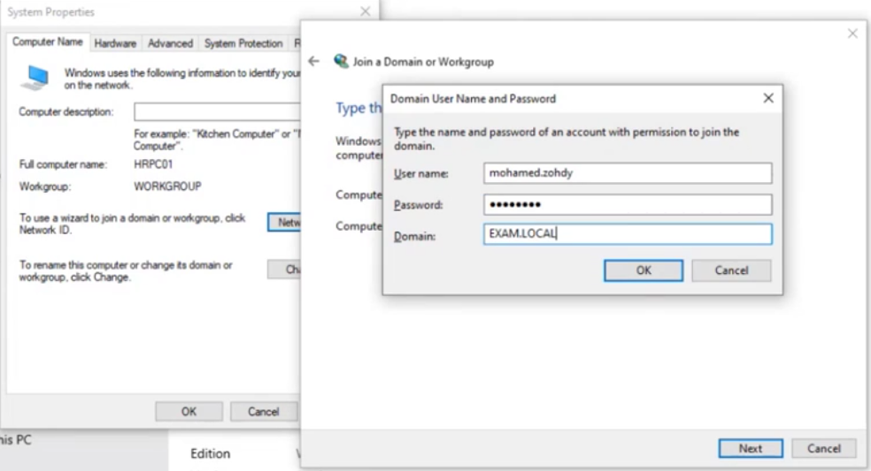

```
Right-click This PC → Properties → Change settings → Change
→ Member of: ● Domain: EXAM.LOCAL
→ Credentials:
    User name: mohamed.zohdy
    Password:  ••••••••
    Domain:    EXAM.LOCAL
→ OK → Restart
```

---

## 📂 Step 3 — Move HRPC01 to the HR OU

After the machine joins, its computer account appears in the default `Computers` container. Move it to the **HR** OU.

The screenshot below shows the HR OU in ADUC containing **HRPC01**, **Mohamed Z.**, and **Salma Moha.**:

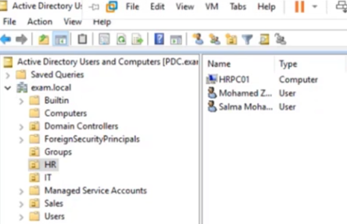

```
ADUC → Computers container → Right-click HRPC01 → Move → HR OU → OK
```

---

## 👥 Step 4 — Add IT-Group as Local Administrator (GPO: LocalAdmin)

**Goal:** Add the domain `IT-Group` to the local Administrators group on all domain-joined machines via a logon script.

### Script: LocalAdmin.bat

The screenshot below shows the script content — a single command adding IT-Group to local Administrators:

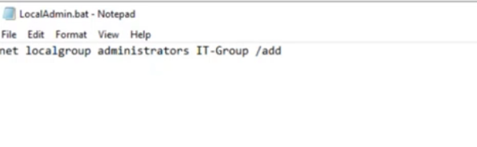

```batch
net localgroup administrators IT-Group /add
```

### Script Added to GPO Logon Scripts

The screenshot below shows `LocalAdmin.bat` configured as a **User Configuration logon script** in the `LocalAdmin` GPO:

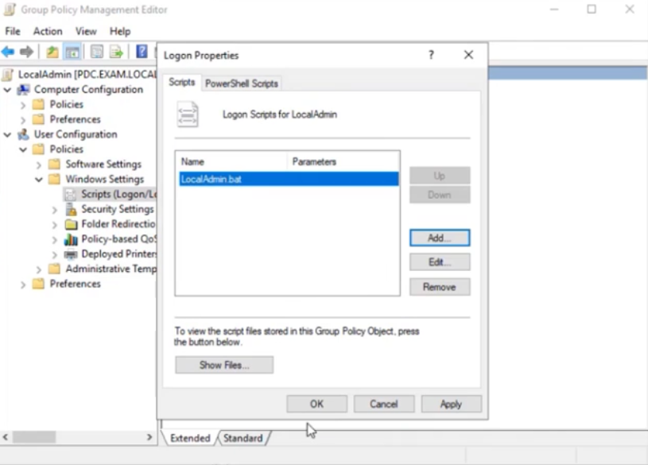

```
GPO: LocalAdmin
Configuration: User Configuration
Path: User Configuration → Windows Settings
      → Scripts (Logon/Logoff) → Logon
      → Add → LocalAdmin.bat
```

---

## 🔤 Step 5 — Show Only Fonts in Control Panel (GPO: Fonts)

**Goal:** HR users can only see **Fonts** in the Control Panel.

The screenshot below shows the **Show only specified Control Panel items** policy with `Fonts` as the only allowed item:

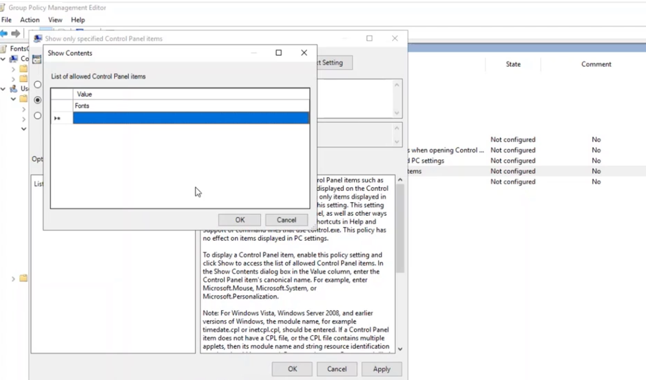

```
GPO: Fonts
Linked to: HR OU
Configuration: User Configuration
Path: User Configuration → Administrative Templates → Control Panel
→ Show only specified Control Panel items → Enabled
→ Show Contents → Add: Fonts
```

---

## 🖱️ Step 6 — Remove Properties from This PC Context Menu (GPO: NoProperties)

**Goal:** HR users cannot right-click This PC and access Properties (hides system info, network settings, domain membership).

The screenshot below shows the policy set to **Enabled**:

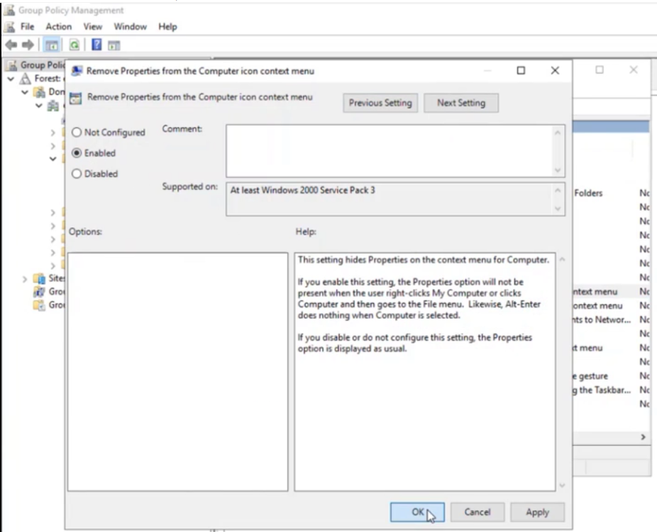

```
GPO: NoProperties
Linked to: HR OU
Configuration: User Configuration
Path: User Configuration → Administrative Templates → Desktop
→ Remove Properties from the Computer icon context menu → Enabled
```

---

## ⌨️ Step 7 — Disable Command Prompt for HR Users (GPO: DisableCMD)

**Goal:** Prevent HR users from running CMD or batch files.

The screenshot below shows the **Prevent access to the command prompt** policy being configured with **Enabled** selected:

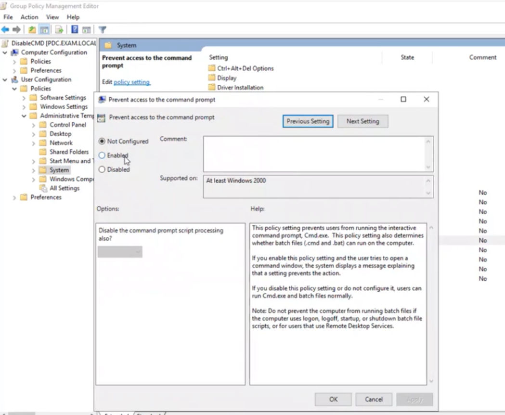

```
GPO: DisableCMD
Linked to: HR OU
Configuration: User Configuration
Path: User Configuration → Administrative Templates → System
→ Prevent access to the command prompt → Enabled
→ Also disable script processing? → Yes (optional — blocks .bat and .cmd files too)
```

> ⚠️ **Important:** Do NOT enable this on machines that use logon/logoff or startup/shutdown batch scripts, as it will break those scripts. The exam requires disabling CMD for HR *users* — keep this as a User Configuration policy.

---

## 🔌 Step 8 — Disable External Storage for HR (GPO: DisableUSB) + Exclude Mohamed Zohdy

**Goal:** Block all removable storage for HR users — but **exclude Mohamed Zohdy** (HR Manager) from this restriction.

The screenshot below shows the `DisableUSB` GPO with all removable storage settings enabled:

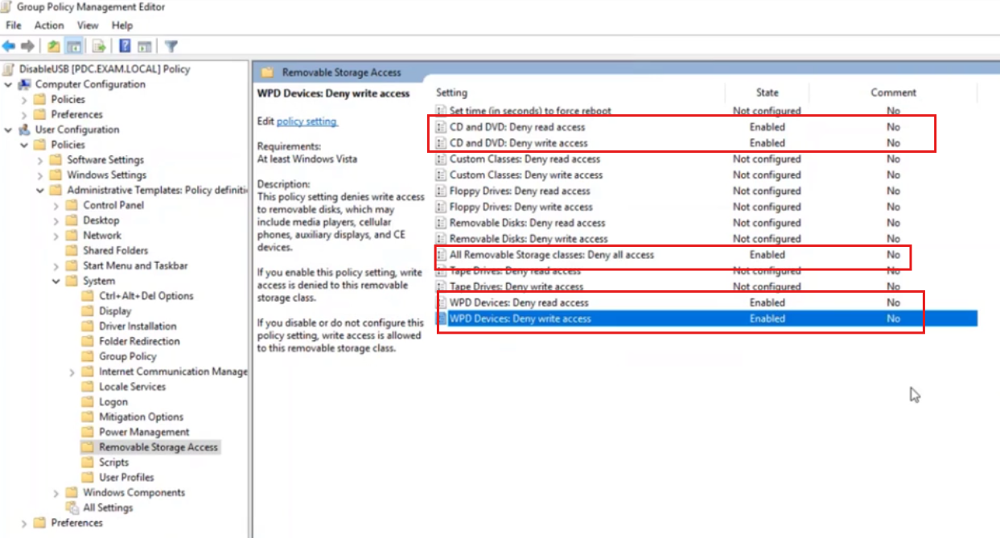

### Policy Settings Enabled

```
GPO: DisableUSB
Linked to: HR OU
Configuration: User Configuration
Path: User Configuration → Administrative Templates → System → Removable Storage Access
```

| Setting | State |
|---|---|
| CD and DVD: Deny read access | **Enabled** |
| CD and DVD: Deny write access | **Enabled** |
| All Removable Storage classes: Deny all access | **Enabled** |
| WPD Devices: Deny read access | **Enabled** |
| WPD Devices: Deny write access | **Enabled** |

### Excluding Mohamed Zohdy via GPO Delegation

```
GPMC → HR OU → DisableUSB GPO → Delegation tab → Advanced
→ Add: mohamed.zohdy (Mohamed Zohdy)
→ Permissions for Mohamed Zohdy:
   └── Apply group policy → Deny ✅
→ Apply → OK
```

Result:

| User | USB blocked? |
|---|---|
| Salma Mohamed | ✅ Yes — DisableUSB applies |
| **Mohamed Zohdy** | ❌ No — Denied from GPO via Delegation |

---

## 🔑 Step 9 — Password Policy (Default Domain Policy)

**Goal:** Passwords expire every 60 days, minimum 6 characters, complexity enabled, remember last 3.

The screenshot below shows the configured Password Policy in the Default Domain Policy:

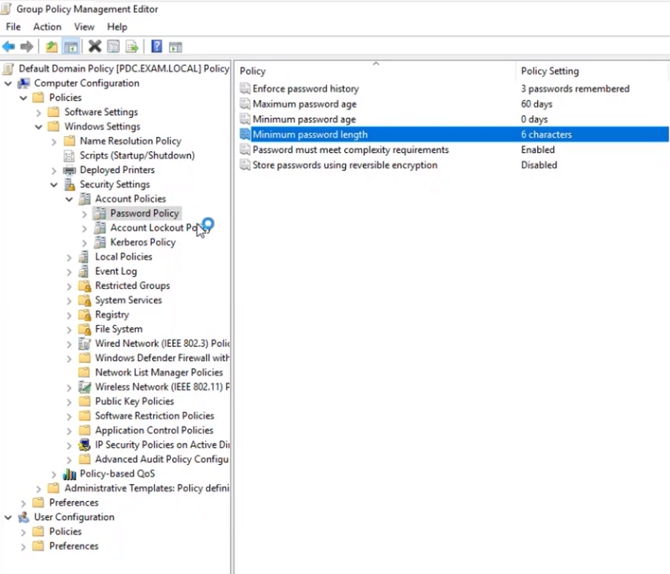

```
GPO: Default Domain Policy
Path: Computer Configuration → Windows Settings
      → Security Settings → Account Policies → Password Policy
```

| Setting | Required Value | Configured Value |
|---|---|---|
| Enforce password history | Last 3 passwords | **3 passwords remembered** |
| Maximum password age | 60 days | **60 days** |
| Minimum password age | 0 days | 0 days |
| Minimum password length | 6 characters | **6 characters** |
| Password must meet complexity | Enabled | **Enabled** |
| Store passwords using reversible encryption | Disabled | Disabled |

---

## 🔒 Step 10 — Account Lockout Policy (Default Domain Policy)

**Goal:** Lock account for 30 minutes after 5 wrong password attempts.

The screenshot below shows the Account Lockout Policy with threshold highlighted:

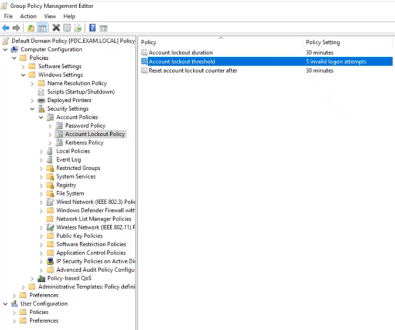

```
GPO: Default Domain Policy
Path: Computer Configuration → Windows Settings
      → Security Settings → Account Policies → Account Lockout Policy
```

| Setting | Required Value | Configured Value |
|---|---|---|
| Account lockout threshold | 5 invalid attempts | **5 invalid logon attempts** |
| Account lockout duration | 30 minutes | **30 minutes** |
| Reset account lockout counter after | 30 minutes | **30 minutes** |

---

## 🔗 Step 11 — HR URL Desktop Shortcut (GPO: HRAppUrl)

**Goal:** Deploy a desktop shortcut named **HR URL** pointing to `hrapp.exam.local` for all HR users.

The screenshot below shows the shortcut configured in GPO Preferences with target type **URL** and location **Desktop**:

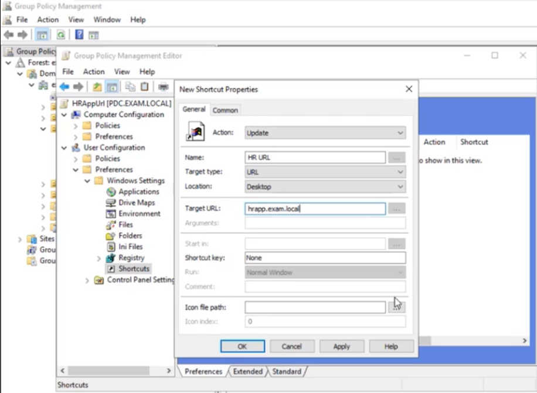

```
GPO: HRAppUrl
Linked to: HR OU
Configuration: User Configuration → Preferences → Windows Settings → Shortcuts
→ New → Shortcut

Settings:
  Action:       Update
  Name:         HR URL
  Target type:  URL
  Location:     Desktop
  Target URL:   hrapp.exam.local
```

---

## 📋 All GPOs Linked to HR OU — Summary

| GPO Name | Linked to | Config Type | Effect |
|---|---|---|---|
| **LocalAdmin** | HR OU | User Config — Logon Script | Adds IT-Group to local Admins |
| **Fonts** | HR OU | User Config — Policy | Shows only Fonts in Control Panel |
| **NoProperties** | HR OU | User Config — Policy | Removes Properties from This PC menu |
| **DisableCMD** | HR OU | User Config — Policy | Blocks CMD access |
| **DisableUSB** | HR OU | User Config — Policy + Delegation | Blocks removable storage; Mohamed Zohdy excluded |
| **HRAppUrl** | HR OU | User Config — Preferences | Deploys HR URL shortcut to desktop |
| **Default Domain Policy** | Domain | Computer Config | Password policy + Account lockout |

---

## 🔄 Apply & Verify Policies

```powershell
# Force immediate policy refresh on client machine
gpupdate /force

# Check applied GPOs
gpresult /r

# Full HTML report
gpresult /h C:\gpo-report.html
```

---

## ✅ Exam Completion Checklist

- [ ] Domain `exam.local` created — PDC at `192.168.1.2`
- [ ] OUs created: HR, Sales, IT + Groups
- [ ] 2 users created in each OU with correct naming
- [ ] Department groups created and users added
- [ ] HRPC01 (IP: `192.168.1.40`) joined to `exam.local`
- [ ] HRPC01 computer account moved to HR OU in ADUC
- [ ] `LocalAdmin.bat` created and added to logon script GPO
- [ ] IT-Group confirmed in local Administrators on HRPC01
- [ ] `Fonts` GPO linked to HR — only Fonts visible in Control Panel
- [ ] `NoProperties` GPO linked to HR — Properties absent from This PC menu
- [ ] `DisableCMD` GPO linked to HR — CMD blocked for HR users
- [ ] `DisableUSB` GPO linked to HR — USB and CD access denied
- [ ] Mohamed Zohdy excluded from DisableUSB via Delegation → Deny
- [ ] Password policy: 60 days / 6 chars / complexity / 3 history
- [ ] Account lockout: 5 attempts / 30 min
- [ ] `HRAppUrl` GPO linked to HR — HR URL shortcut on all HR desktops
- [ ] `gpupdate /force` run on HRPC01 — all policies verified
- [ ] VM snapshot taken after full exam completion

---

## 📚 Quick Reference — Policy Paths

| Policy | Full path in GPO editor |
|---|---|
| Show only specified Control Panel items | User Config → Admin Templates → Control Panel |
| Remove Properties from Computer icon | User Config → Admin Templates → Desktop |
| Prevent access to command prompt | User Config → Admin Templates → System |
| Removable Storage Access | User Config → Admin Templates → System → Removable Storage Access |
| Password Policy | Computer Config → Windows Settings → Security Settings → Account Policies → Password Policy |
| Account Lockout Policy | Computer Config → Windows Settings → Security Settings → Account Policies → Account Lockout Policy |
| Shortcuts (Preferences) | User Config → Preferences → Windows Settings → Shortcuts |
| Logon Script | User Config → Windows Settings → Scripts (Logon/Logoff) → Logon |

---

## 📄 License

This repository is for educational purposes. Feel free to fork and adapt for your own learning.
