# 💽 Disk Management Lab — Partitioning, DiskPart, Dynamic Volumes & RAID

> A hands-on lab guide covering Windows Disk Management GUI and DiskPart CLI — shrinking volumes, creating partitions, converting FAT32 to NTFS, adding virtual disks, creating logical partitions, and building Spanned, Striped, Mirrored, and RAID-5 dynamic volumes.


---

## 📖 Overview

This is **Session 20** of the Windows Server 2019 course. This session is a fully practical lab covering disk management from both the GUI (Disk Management) and CLI (DiskPart). Topics include shrinking volumes, creating simple and logical volumes, converting file systems, adding virtual disks, and creating dynamic volume types including Spanned, Striped, Mirrored, and RAID-5.

> 📌 **Pre-requisite:** Windows Server 2019 VM with at least one initialized disk. Additional virtual disks can be added via VirtualBox or VMware.

---

## 🎯 What This Lab Covers

| # | Task | Tool |
|---|---|---|
| 1 | View current disk layout | Disk Management |
| 2 | Shrink a volume to create unallocated space | Disk Management |
| 3 | Create a new simple volume (FAT32) | Disk Management |
| 4 | Verify new volume on the file system | File Explorer |
| 5 | Convert FAT32 → NTFS without data loss | CMD: `convert` |
| 6 | Add a new virtual SATA disk in VirtualBox | VirtualBox |
| 7 | Verify new disk appears in VM settings | VirtualBox |
| 8 | Create logical partitions on a basic disk | Disk Management |
| 9 | Use DiskPart to list disks, partitions, volumes | DiskPart |
| 10 | Create primary partition and clean a disk | DiskPart |
| 11 | Create primary partition — result in Disk Management | DiskPart + Disk Management |
| 12 | Create extended + logical partition | DiskPart |
| 13 | Create a Spanned volume across dynamic disks | Disk Management |
| 14 | Create a Striped volume (RAID 0) | Disk Management |
| 15 | Create a Mirrored volume (RAID 1) | Disk Management |
| 16 | Create a RAID-5 volume | Disk Management |

---

## 🖥️ Part 1 — Initial Disk Layout

The screenshot below shows the starting disk configuration in Disk Management:

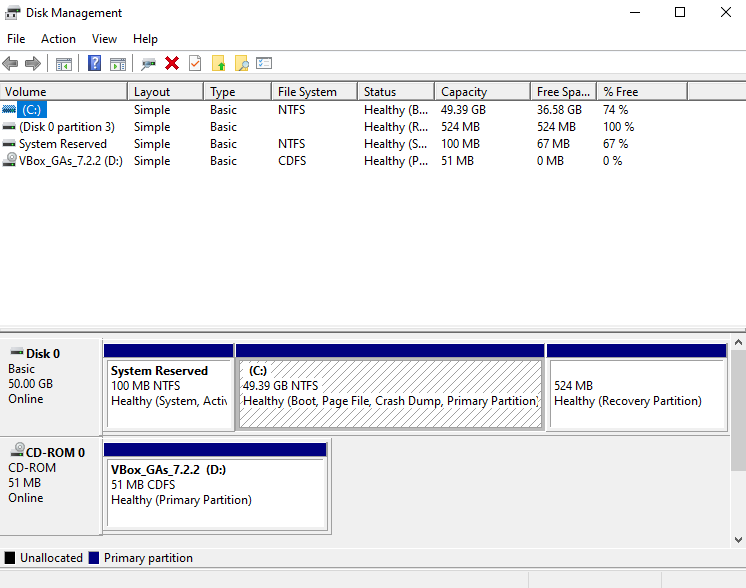

```
Disk 0 — Basic, 50.00 GB, Online
├── System Reserved   100 MB NTFS   (System, Active)
├── (C:)              49.39 GB NTFS  (Boot, Page File, Crash Dump, Primary)
└── Recovery          524 MB         (Recovery Partition)
```

---

## ✂️ Part 2 — Shrink Volume

To create free space for a new partition, shrink the C: volume:

```
Disk Management → Right-click C: → Shrink Volume
→ Enter amount to shrink (MB) → Shrink
```

The screenshot below shows Disk 0 after shrinking — **26.53 GB unallocated** space is now available:

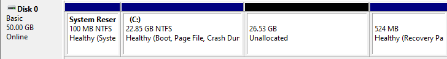

---

## ➕ Part 3 — Create a New Simple Volume (FAT32)

```
Disk Management → Right-click unallocated space → New Simple Volume
→ Set size → Assign drive letter (E:)
→ File system: FAT32
→ Format → Finish
```

The screenshot below shows the new **NEW VOLUME (E:) — 26.53 GB FAT32** created as a Logical Drive:

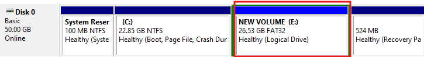

---

## 📂 Part 4 — Verify Volume in File Explorer

After creating the volume, it appears immediately in File Explorer. A test `Data` folder was created to confirm the volume is accessible:

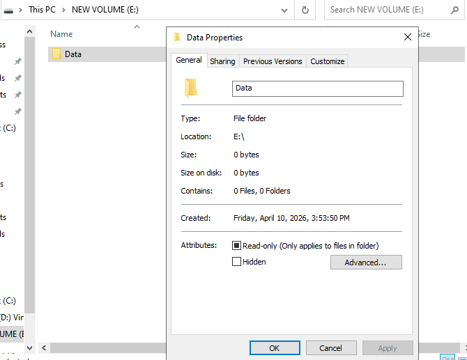

---

## 🔄 Part 5 — Convert FAT32 to NTFS (Without Formatting)

To convert the E: volume from FAT32 to NTFS while keeping existing data:

```cmd
convert E: /fs:ntfs
```

The screenshot below shows the conversion completing successfully:

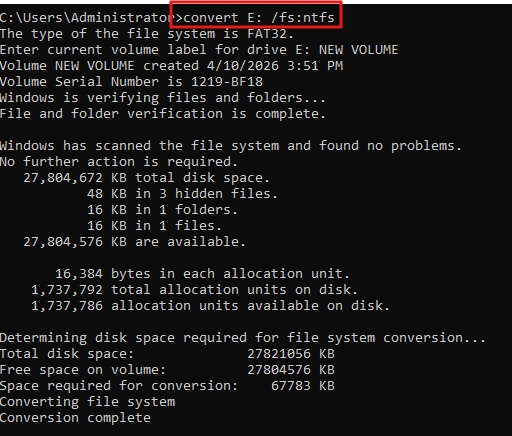

```
The type of the file system is FAT32.
Windows is verifying files and folders...
Determining disk space required for file system conversion...
Converting file system
Conversion complete
```

> ⚠️ The `convert` command is **one-way** — you cannot convert NTFS back to FAT32 without reformatting (which deletes all data).

---

## ➕ Part 6 — Add a New Virtual SATA Disk (VirtualBox)

To add a new physical disk to the VM for lab exercises:

```
VirtualBox → VM Settings → Storage → Controller: SATA
→ Add Hard Disk → Create new disk
→ Size: 10 GB → VDI format → Dynamically allocated
→ Finish
```

The screenshot below shows the **Create Virtual Hard Disk** dialog in VirtualBox with a 10 GB VDI disk being created for `WinServer22`:

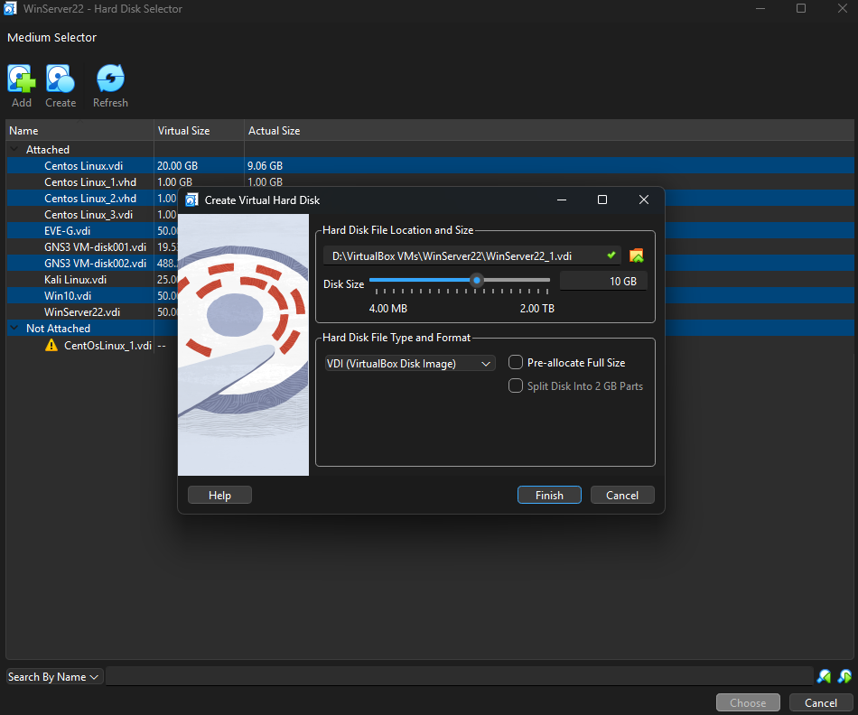

---

## ✅ Part 7 — Verify Disk Added to VM

After creating and attaching the disk, it appears in VM Storage settings:

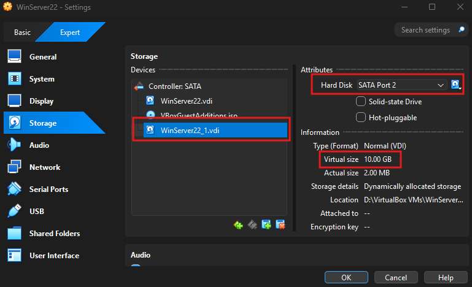

```
Controller: SATA
├── WinServer22.vdi       (primary OS disk)
└── WinServer22_1.vdi     ← new disk, SATA Port 2, 10.00 GB virtual size
```

---

## 🗂️ Part 8 — Logical Partitions on a Basic Disk

A basic disk on MBR supports a maximum of **4 primary partitions**, or **3 primary + 1 extended** (which can contain many logical drives).

The screenshot below shows Disk 1 with 3 primary partitions + 2 logical drives inside an extended partition:

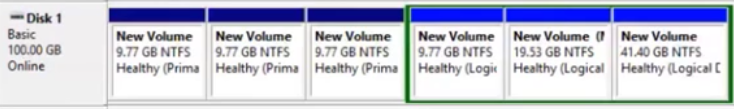

```
Disk 1 — Basic, 100.00 GB
├── New Volume   9.77 GB NTFS  (Primary)
├── New Volume   9.77 GB NTFS  (Primary)
├── New Volume   9.77 GB NTFS  (Primary)
├── [Extended partition]
│   ├── New Volume  9.77 GB  (Logical)
│   ├── New Volume  19.53 GB (Logical)
│   └── New Volume  41.40 GB (Logical)
```

---

## ⌨️ Part 9 — DiskPart CLI Overview

**DiskPart** is the command-line disk management tool — more powerful than the GUI for automation and scripting.

```cmd
diskpart
```

The screenshot below shows DiskPart commands alongside Disk Management, listing 3 disks and their partitions/volumes:

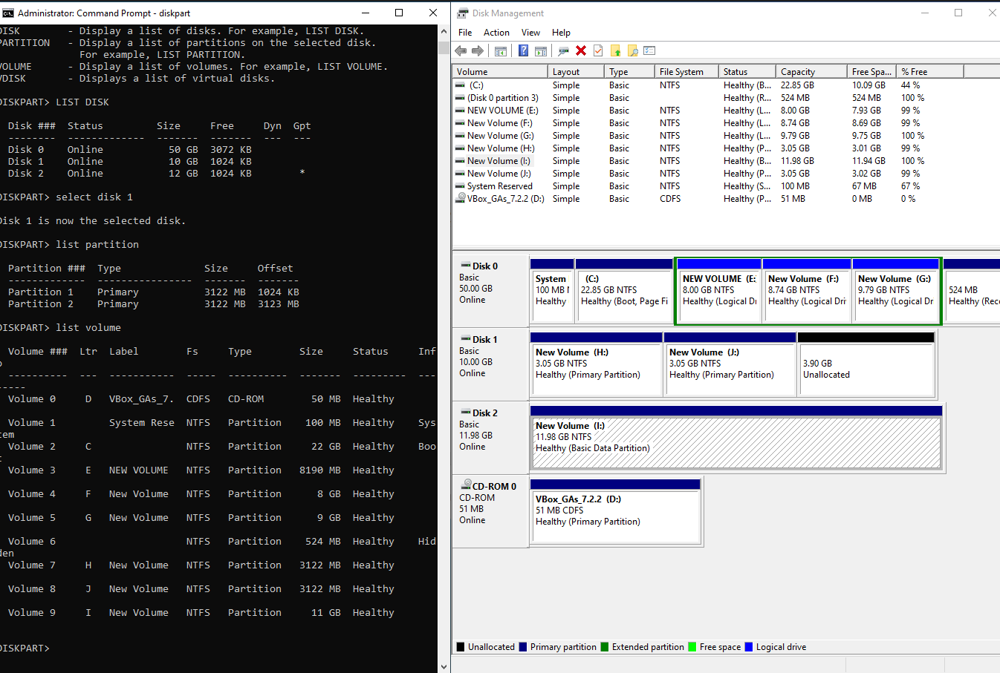

### Key DiskPart Commands

| Command | Purpose |
|---|---|
| `list disk` | Show all physical disks |
| `select disk N` | Select a disk for operations |
| `list partition` | Show partitions on selected disk |
| `list volume` | Show all volumes on all disks |
| `create partition primary size=N` | Create a primary partition (size in MB) |
| `create partition extended size=N` | Create an extended partition |
| `create partition logical` | Create a logical drive inside extended partition |
| `format` | Format the selected partition |
| `assign letter=X` | Assign a drive letter |
| `clean` | Wipe all partition data from selected disk |
| `convert dynamic` | Convert disk to dynamic |
| `convert basic` | Convert disk to basic (destroys data) |

---

## 🔨 Part 10 — Create Partition and Clean a Disk via DiskPart

The screenshot below shows creating a primary partition on Disk 1, formatting it, then selecting Disk 2 and running `clean` to wipe it:

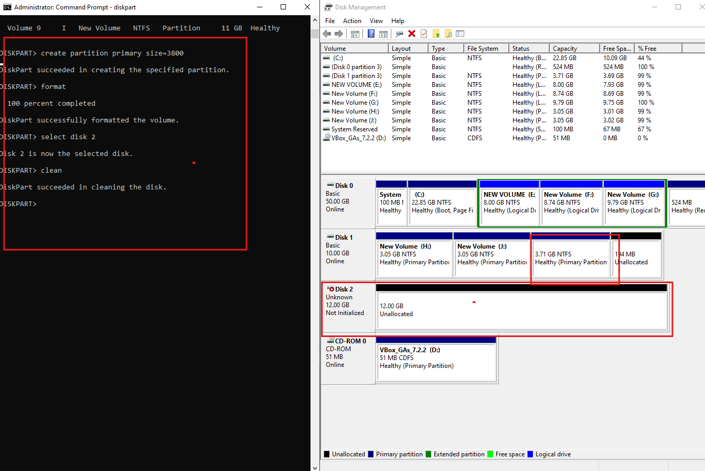

```diskpart
DISKPART> create partition primary size=3800
DiskPart succeeded in creating the specified partition.

DISKPART> format
100 percent completed
DiskPart successfully formatted the volume.

DISKPART> select disk 2
Disk 2 is now the selected disk.

DISKPART> clean
DiskPart succeeded in cleaning the disk.
```

> ⚠️ `clean` **permanently destroys all data** on the selected disk — use with extreme caution.

---

## 🔨 Part 11 — Create Primary Partition — Result in Disk Management

After running `create partition primary size=3800` on Disk 1, the new partition appears in Disk Management as a **RAW** partition (unformatted):

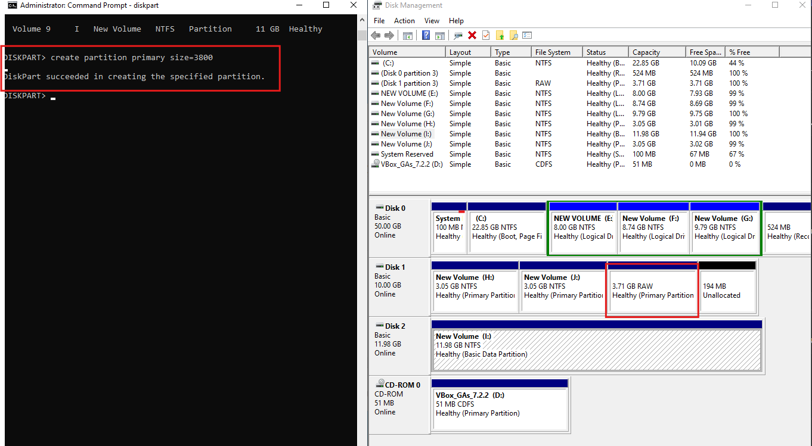

```diskpart
DISKPART> create partition primary size=3800
DiskPart succeeded in creating the specified partition.
```

```
Disk 1 — Basic, 10.00 GB
├── New Volume (H:)  3.05 GB NTFS   (Primary)
├── New Volume (J:)  3.05 GB NTFS   (Primary)
└── 3.71 GB RAW                     ← new unformatted partition
```

> Right-click the RAW partition in Disk Management → Format to assign a file system and drive letter.

---

## 📐 Part 12 — Create Extended + Logical Partition via DiskPart

On an MBR disk, use DiskPart to create an extended partition containing a logical drive:

The screenshot below shows the full sequence on Disk 2:

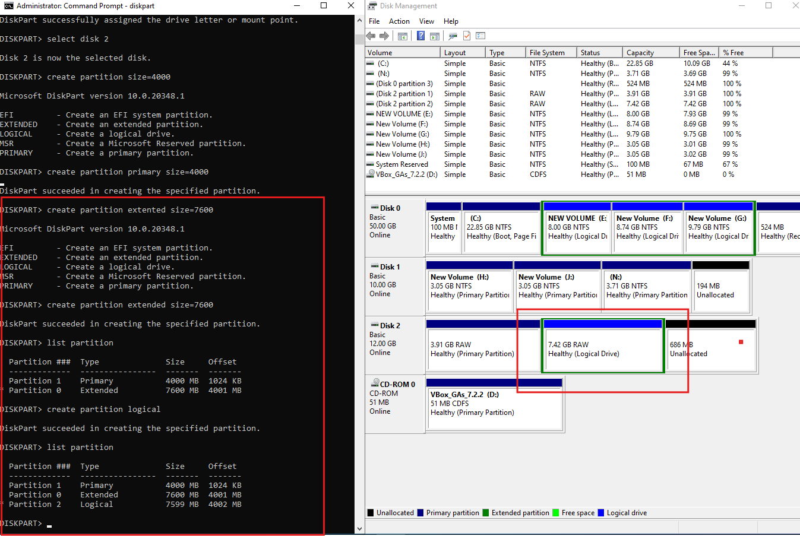

```diskpart
DISKPART> select disk 2

DISKPART> create partition primary size=4000
DiskPart succeeded in creating the specified partition.

DISKPART> create partition extended size=7600
DiskPart succeeded in creating the specified partition.

DISKPART> create partition logical
DiskPart succeeded in creating the specified partition.

DISKPART> list partition
  Partition ###  Type      Size     Offset
  Partition 1    Primary   4000 MB  1024 KB
  Partition 0    Extended  7600 MB  4001 MB
  Partition 2    Logical   7599 MB  4002 MB
```

```
Disk 2 — Basic, 12.00 GB
├── 3.91 GB RAW    (Primary)
├── [Extended]
│   └── 7.42 GB RAW (Logical Drive)
└── 686 MB Unallocated
```

---

## 🔵 Dynamic Volumes — Overview

Dynamic disks support advanced volume types that span multiple physical disks. All disks involved must be converted to **Dynamic** first.

```
Disk Management → Right-click disk → Convert to Dynamic Disk
```

| Volume Type | Behavior | RAID equivalent | Min disks |
|---|---|---|---|
| **Simple** | Single disk partition | None | 1 |
| **Spanned** | Combines space from multiple disks | None | 2 |
| **Striped** | Data split across disks (performance) | RAID 0 | 2 |
| **Mirrored** | Data duplicated on two disks | RAID 1 | 2 |
| **RAID-5** | Striping with parity | RAID 5 | 3 |

---

## 🟣 Part 13 — Spanned Volume

A **Spanned** volume combines unallocated space from multiple disks into a single logical volume. Data fills one disk before moving to the next — **no redundancy**.

The screenshot below shows a Spanned volume (H:) spread across Disk 1, Disk 2, and Disk 3:

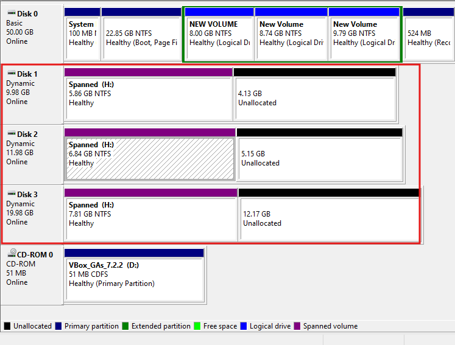

```
Spanned (H:) — total ~20.51 GB NTFS
├── Disk 1  5.86 GB
├── Disk 2  6.84 GB
└── Disk 3  7.81 GB
```

> ⚠️ If any one disk in a spanned volume fails, **all data is lost** — there is no fault tolerance.

---

## 🩵 Part 14 — Striped Volume (RAID 0)

A **Striped** volume splits data evenly across all disks simultaneously — maximizing read/write performance. Like RAID 0, there is **no redundancy**.

The screenshot below shows a Striped volume (H:) across Disk 1, Disk 2, and Disk 3 — each using exactly 4.88 GB:

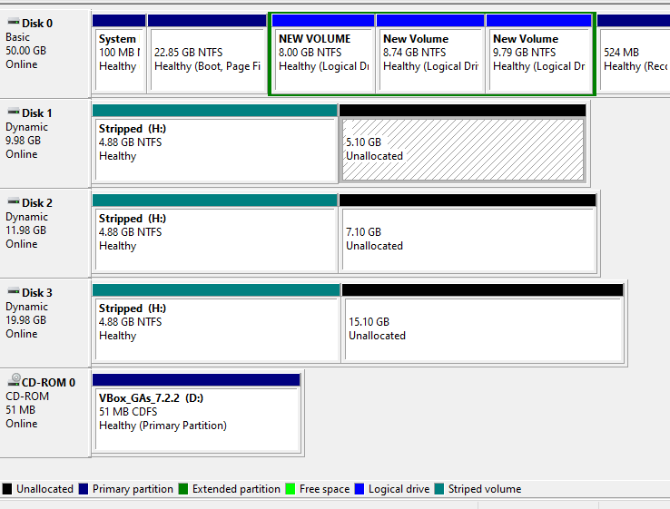

```
Stripped (H:) — total ~14.64 GB NTFS
├── Disk 1  4.88 GB
├── Disk 2  4.88 GB
└── Disk 3  4.88 GB
```

> ✅ Best read/write performance. ❌ One disk failure destroys all data.

---

## 🔴 Part 15 — Mirrored Volume (RAID 1)

A **Mirrored** volume keeps an exact copy of data on a second disk — providing full redundancy. If one disk fails, the other takes over with no data loss.

The screenshot below shows a Mirrored volume (H:) on Disk 1 and Disk 2 — each holding exactly 4.88 GB:

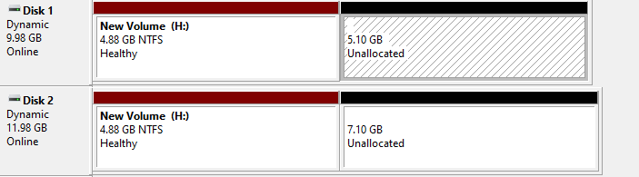

```
New Volume (H:) — Mirrored, 4.88 GB NTFS
├── Disk 1  4.88 GB  (primary copy)
└── Disk 2  4.88 GB  (mirror copy)
```

> ✅ Survives one disk failure. ❌ Usable capacity = 50% of total disk space used.

---

## 🩵 Part 16 — RAID-5 Volume

A **RAID-5** volume stripes data with **parity** across 3 or more disks — providing both performance and fault tolerance. One disk can fail without data loss.

The screenshot below shows a RAID-5 volume (H:) across Disk 1, Disk 2, and Disk 3:

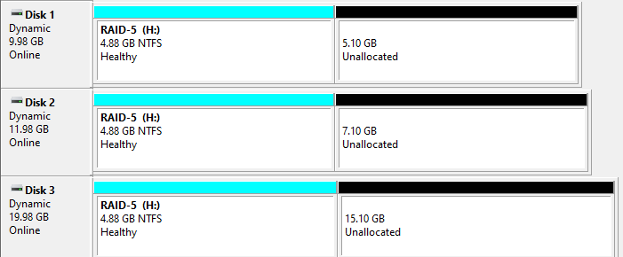

```
RAID-5 (H:) — total usable = (n-1) × disk size
├── Disk 1  4.88 GB
├── Disk 2  4.88 GB
└── Disk 3  4.88 GB
Usable: 9.76 GB  |  Parity: 4.88 GB
```

> ✅ Survives 1 disk failure. ❌ Minimum 3 disks required. ❌ Write performance slower than RAID 0.

---

## 📊 Dynamic Volume Comparison

| Type | Disks | Performance | Fault Tolerance | Usable Capacity |
|---|---|---|---|---|
| **Spanned** | 2+ | Normal | ❌ None | 100% of all disks |
| **Striped** | 2+ | ⭐⭐⭐⭐ High | ❌ None | 100% of all disks |
| **Mirrored** | 2 | ⭐⭐⭐ Read boost | ✅ 1 disk | 50% of total |
| **RAID-5** | 3+ | ⭐⭐⭐⭐ Good | ✅ 1 disk | (n-1)/n of total |

---

## ✅ Lab Completion Checklist

- [ ] Initial disk layout viewed in Disk Management
- [ ] C: volume shrunk — unallocated space created
- [ ] New FAT32 volume (E:) created from unallocated space
- [ ] Data folder created on E: to confirm access
- [ ] `convert E: /fs:ntfs` run — conversion completed successfully
- [ ] New 10 GB VDI disk added to VM in VirtualBox
- [ ] New disk visible in VM Storage settings (SATA Port 2)
- [ ] Logical partition structure created on basic disk (3 primary + extended)
- [ ] DiskPart used: `list disk`, `list partition`, `list volume`
- [ ] Primary partition created and disk cleaned via DiskPart
- [ ] Extended + logical partition created via DiskPart
- [ ] Disks converted to Dynamic for advanced volumes
- [ ] Spanned volume created across 3 disks
- [ ] Striped volume (RAID 0) created across 3 disks
- [ ] Mirrored volume (RAID 1) created across 2 disks
- [ ] RAID-5 volume created across 3 disks
- [ ] VM snapshot taken after lab completion

---

## 📚 DiskPart Quick Reference

```diskpart
# Launch DiskPart
diskpart

# Disk operations
list disk
select disk 1
clean
convert dynamic
convert basic

# Partition operations
list partition
create partition primary size=5000
create partition extended size=10000
create partition logical
delete partition

# Volume operations
list volume
format fs=ntfs quick
assign letter=E
active
```

---

## 📚 Terminology Reference

| Term | Definition |
|---|---|
| **Shrink Volume** | Reduces a partition to create unallocated free space |
| **Simple Volume** | A basic partition on a single disk |
| **Extended Partition** | A container partition that holds logical drives (MBR only) |
| **Logical Drive** | A partition inside an extended partition |
| **Dynamic Disk** | Disk type supporting software RAID and spanning across multiple disks |
| **Spanned Volume** | Combines space from multiple disks — no redundancy |
| **Striped Volume** | RAID 0 — data split across disks for performance |
| **Mirrored Volume** | RAID 1 — exact copy on two disks for redundancy |
| **RAID-5 Volume** | Striping with parity — performance + 1-disk fault tolerance |
| **DiskPart** | Windows command-line disk management utility |
| **clean** | DiskPart command that wipes all partition info from a disk |
| **convert** | CMD command to convert FAT32 → NTFS without data loss |
| **RAW** | Unformatted partition — has no file system assigned yet |
| **VDI** | VirtualBox Disk Image — the virtual disk format used by VirtualBox |

---

## 🔭 Next Session Preview

- **iSCSI Target and Initiator** — connecting SAN storage over IP
- **Storage Spaces** — software-defined storage pools in Windows Server
- **Windows Server Backup** — configuring system state and full server backups

---

## 📄 License

This repository is for educational purposes. Feel free to fork and adapt for your own learning.
