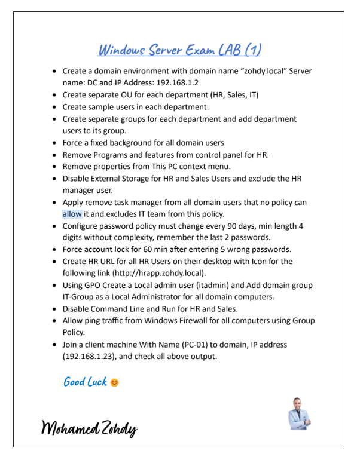

# 🏆 Windows Server Exam LAB (1) — zohdy.local

> Complete solution guide for Windows Server Exam LAB 1 by Mohamed Zohdy — covering domain setup, AD structure, GPO policies, password policy, firewall rules, local admin deployment, and client domain join.


---

## 📄 Exam Sheet



---

## 📋 Requirements Checklist

| # | Requirement | Status |
|---|---|---|
| 1 | Domain `zohdy.local` — Server: **DC**, IP: `192.168.1.2` | |
| 2 | OUs: **HR**, **Sales**, **IT** | |
| 3 | Sample users in each department | |
| 4 | Groups per department — add users to their group | |
| 5 | Force fixed background for all domain users | |
| 6 | Remove Programs and Features from Control Panel for HR | |
| 7 | Remove Properties from This PC context menu for HR | |
| 8 | Disable External Storage for HR and Sales — exclude HR manager | |
| 9 | Remove Task Manager from all domain users — exclude IT team | |
| 10 | Password policy: 90 days / min 4 chars / no complexity / remember 2 | |
| 11 | Account lockout: 60 min after 5 wrong passwords | |
| 12 | HR URL shortcut on HR desktops → `http://hrapp.zohdy.local` with icon | |
| 13 | GPO startup script: create local admin `itadmin` + add `IT-Group` as local admin | |
| 14 | Disable Command Line and Run for HR and Sales | |
| 15 | Allow ping via Windows Firewall GPO for all computers | |
| 16 | Join **PC-01** (IP: `192.168.1.23`) to domain — verify all policies | |

---

## 🏗️ Step 1 — Domain & Server Setup

```
Computer name:   DC
Domain name:     zohdy.local
IP Address:      192.168.1.2
Subnet mask:     255.255.255.0
Default gateway: 192.168.1.1
DNS:             127.0.0.1  (self — after AD DS promotion)
```

### Promotion Steps

```
Server Manager → Add Roles and Features → AD DS
→ Promote to Domain Controller
→ Add a new forest → Root domain: zohdy.local
→ Forest / Domain Functional Level: Windows Server 2016
→ DNS Server: ✅ | Global Catalog: ✅
→ DSRM password → Install → Restart
```

---

## 👥 Step 2 — AD Structure (OUs, Users, Groups)

### OU and User Structure

```
zohdy.local
├── HR
│   ├── [HR Manager user]     ← will be excluded from USB policy
│   └── [HR standard users]
├── Sales
│   └── [Sales users]
├── IT
│   └── [IT users]            ← will be excluded from Task Manager policy
└── Groups
    ├── HR-Group
    ├── Sales-Group
    └── IT-Group
```

### Creating OUs

```
ADUC → Right-click zohdy.local → New → Organizational Unit
→ Create: HR, Sales, IT
```

### Creating Users

```
Right-click OU → New → User
→ Use format: firstname.lastname
→ Set initial password → User must change at next logon
```

### Creating Groups and Adding Members

```
Right-click OU → New → Group
→ Group scope: Global | Group type: Security
→ Right-click group → Properties → Members → Add users
```

---

## 🖼️ Step 3 — Force Fixed Background (GPO: ForceWallpaper)

**Goal:** All domain users see the same desktop wallpaper — they cannot change it.

```
GPO: ForceWallpaper
Linked to: zohdy.local (domain level — applies to all users)
Configuration: User Configuration
Path: User Configuration → Administrative Templates
      → Desktop → Desktop
      → Desktop Wallpaper → Enabled
      → Wallpaper Name: \\DC\SYSVOL\zohdy.local\wallpaper\company.jpg
      → Wallpaper Style: Fill (or Stretch)
```

> Place the wallpaper image in the SYSVOL share so all domain machines can access it:
> ```
> C:\Windows\SYSVOL\sysvol\zohdy.local\scripts\company.jpg
> ```

---

## 🚫 Step 4 — Remove Programs and Features from Control Panel (HR only)

```
GPO: HR-HideControlPanel
Linked to: HR OU
Configuration: User Configuration
Path: User Configuration → Administrative Templates → Control Panel
→ Hide specified Control Panel items → Enabled
→ Show Contents → Add: Programs and Features
```

---

## 🖱️ Step 5 — Remove Properties from This PC Context Menu (HR)

```
GPO: HR-HideControlPanel  (same GPO or new one)
Linked to: HR OU
Configuration: User Configuration
Path: User Configuration → Administrative Templates → Desktop
→ Remove Properties from the Computer icon context menu → Enabled
```

---

## 🔌 Step 6 — Disable External Storage (HR + Sales) — Exclude HR Manager

**Goal:** Block USB and removable storage for HR and Sales users. Exclude the HR manager account.

### For HR OU

```
GPO: DisableUSB-HR
Linked to: HR OU
Configuration: User Configuration → Administrative Templates
               → System → Removable Storage Access
Enable:
  ✅ All Removable Storage classes: Deny all access
  ✅ CD and DVD: Deny read access
  ✅ CD and DVD: Deny write access
  ✅ WPD Devices: Deny read access
  ✅ WPD Devices: Deny write access
```

### For Sales OU

```
GPO: DisableUSB-Sales
Linked to: Sales OU
(same settings as above)
```

### Exclude HR Manager via GPO Delegation

```
GPMC → DisableUSB-HR → Delegation tab → Advanced
→ Add: [HR Manager account]
→ Apply group policy → Deny ✅
→ Apply → OK
```

---

## ⌨️ Step 7 — Remove Task Manager from All Domain Users (Exclude IT Team)

**Goal:** Domain-wide policy removing Task Manager. IT team is exempt.

### Create the GPO at Domain Level

```
GPO: RemoveTaskManager
Linked to: zohdy.local (domain level)
Configuration: User Configuration
Path: User Configuration → Administrative Templates
      → System → Ctrl+Alt+Del Options
→ Remove Task Manager → Enabled
```

### Exclude IT-Group via Delegation

```
GPMC → RemoveTaskManager → Delegation → Advanced
→ Add: IT-Group (zohdy\IT-Group)
→ Apply group policy → Deny ✅
→ Apply → OK
```

> Now Domain Admins, Sales, and HR users lose Task Manager. IT team members are unaffected.

---

## 🔑 Step 8 — Password Policy

```
GPO: Default Domain Policy
Path: Computer Configuration → Windows Settings
      → Security Settings → Account Policies → Password Policy
```

| Setting | Required Value |
|---|---|
| Maximum password age | **90 days** |
| Minimum password age | 0 days |
| Minimum password length | **4 characters** |
| Password must meet complexity | **Disabled** |
| Enforce password history | **2 passwords remembered** |
| Store passwords using reversible encryption | Disabled |

---

## 🔒 Step 9 — Account Lockout Policy

```
GPO: Default Domain Policy
Path: Computer Configuration → Windows Settings
      → Security Settings → Account Policies → Account Lockout Policy
```

| Setting | Required Value |
|---|---|
| Account lockout threshold | **5 invalid logon attempts** |
| Account lockout duration | **60 minutes** |
| Reset account lockout counter after | **60 minutes** |

---

## 🔗 Step 10 — HR URL Desktop Shortcut

```
GPO: HR-URL
Linked to: HR OU
Configuration: User Configuration → Preferences → Windows Settings → Shortcuts
→ New → Shortcut

Settings:
  Action:       Update
  Name:         HR App
  Target type:  URL
  Location:     Desktop
  Target URL:   http://hrapp.zohdy.local
  Icon:         Choose a custom icon or leave default
```

---

## 🖥️ Step 11 — Local Admin via GPO Startup Script

**Goal:** Create local user `itadmin` and add `IT-Group` as local admins on all domain computers.

### Script: AddLocalAdmin.bat

```batch
net user itadmin P@$$w0rd /add
net localgroup Administrators itadmin /add
net localgroup Administrators "zohdy\IT-Group" /add
```

### Add to GPO Startup Script

```
GPO: AddLocalAdminScript
Linked to: zohdy.local (domain level) or Domain Computers OU
Configuration: Computer Configuration
Path: Computer Configuration → Windows Settings
      → Scripts (Startup/Shutdown) → Startup
      → Add → AddLocalAdmin.bat
```

> **Computer Configuration startup scripts** run at machine boot — before any user logs in. This ensures `itadmin` and `IT-Group` are added to local Admins on every computer in the domain.

---

## ⌨️ Step 12 — Disable Command Line and Run (HR + Sales)

### Disable CMD

```
GPO: DisableCMD-HR-Sales
Linked to: HR OU AND Sales OU (link the same GPO to both)
Configuration: User Configuration
Path: User Configuration → Administrative Templates → System
→ Prevent access to the command prompt → Enabled
→ Disable the command prompt script processing also? → Yes
```

### Disable Run Command

```
Same GPO: DisableCMD-HR-Sales
Path: User Configuration → Administrative Templates
      → Start Menu and Taskbar
→ Remove Run menu from Start Menu → Enabled
```

---

## 🔥 Step 13 — Allow Ping via Windows Firewall GPO

**Goal:** Enable ICMP echo (ping) inbound rule for all domain computers via GPO.

```
GPO: AllowPing
Linked to: zohdy.local (domain level)
Configuration: Computer Configuration
Path: Computer Configuration → Windows Settings
      → Security Settings
      → Windows Defender Firewall with Advanced Security
      → Inbound Rules → New Rule
      → Predefined: File and Printer Sharing
      → Check: File and Printer Sharing (Echo Request - ICMPv4-In)
      → Action: Allow the connection → Finish
```

Or enable via the specific ICMP rule:

```
New Rule → Custom
→ Protocol: ICMPv4
→ Specific ICMP types: Echo Request
→ Action: Allow
→ Name: Allow Ping (ICMP)
```

---

## 💻 Step 14 — Join PC-01 to the Domain

### Pre-join Checklist for PC-01

- [ ] Date, time, timezone set correctly
- [ ] IP: `192.168.1.23` / Subnet: `255.255.255.0` / Gateway: `192.168.1.1`
- [ ] **DNS set to `192.168.1.2`** (DC's IP — critical)
- [ ] Computer name set to `PC-01`
- [ ] Can ping `192.168.1.2` successfully

### Join Steps

```
Right-click This PC → Properties → Change settings → Change
→ Member of: ● Domain: zohdy.local
→ Credentials: [Domain Admin username and password]
→ OK → "Welcome to zohdy.local domain" → Restart
```

### Post-Join Verification

After restart, verify each policy is applied on PC-01:

```powershell
gpupdate /force
gpresult /r
```

| Policy | Expected result on PC-01 |
|---|---|
| ForceWallpaper | Fixed company wallpaper applied |
| HR-HideControlPanel | Programs and Features hidden (HR users only) |
| Remove Properties | This PC right-click has no Properties (HR users) |
| DisableUSB-HR / Sales | USB access denied for HR and Sales users |
| RemoveTaskManager | Ctrl+Alt+Del has no Task Manager (non-IT users) |
| Password Policy | 90 days / 4 chars / no complexity / 2 history |
| Account Lockout | Locked after 5 wrong attempts for 60 min |
| HR-URL shortcut | HR App icon on HR user desktops |
| itadmin + IT-Group | Visible in local Administrators group |
| DisableCMD | CMD and Run blocked for HR and Sales users |
| AllowPing | `ping 192.168.1.2` succeeds from PC-01 |

---

## 📋 All GPOs Summary

| GPO Name | Linked to | Config | Effect |
|---|---|---|---|
| **Default Domain Policy** | Domain | Computer | Password + Lockout policy |
| **ForceWallpaper** | Domain | User | Fixed desktop background |
| **RemoveTaskManager** | Domain | User | No Task Manager (IT-Group excluded) |
| **AddLocalAdminScript** | Domain | Computer (Startup) | Creates itadmin + adds IT-Group to local Admins |
| **AllowPing** | Domain | Computer | ICMP echo inbound rule enabled |
| **HR-HideControlPanel** | HR OU | User | Hides Programs and Features + This PC Properties |
| **DisableUSB-HR** | HR OU | User | Blocks removable storage (HR Manager excluded) |
| **HR-URL** | HR OU | User Preferences | HR App shortcut on desktop |
| **DisableCMD-HR-Sales** | HR OU + Sales OU | User | Blocks CMD and Run |
| **DisableUSB-Sales** | Sales OU | User | Blocks removable storage |

---

## ✅ Final Exam Checklist

- [ ] Domain `zohdy.local` created on DC at `192.168.1.2`
- [ ] OUs: HR, Sales, IT created with sample users and department groups
- [ ] ForceWallpaper GPO — fixed background on all domain users
- [ ] Programs and Features hidden from HR Control Panel
- [ ] Properties removed from This PC for HR users
- [ ] USB disabled for HR and Sales — HR Manager excluded
- [ ] Task Manager removed domain-wide — IT-Group excluded
- [ ] Password: 90 days / 4 chars / no complexity / 2 history
- [ ] Lockout: 5 attempts → 60 min
- [ ] HR URL shortcut on HR desktops → `http://hrapp.zohdy.local`
- [ ] `itadmin` local account + `IT-Group` as local admin via startup script
- [ ] CMD and Run disabled for HR and Sales
- [ ] Ping allowed via Windows Firewall GPO
- [ ] PC-01 (IP: `192.168.1.23`) joined to `zohdy.local`
- [ ] All policies verified on PC-01 with `gpresult /r`

---

## 📚 Quick Reference — Policy Paths

| Policy | GPO editor path |
|---|---|
| Desktop Wallpaper | User Config → Admin Templates → Desktop → Desktop |
| Hide Control Panel items | User Config → Admin Templates → Control Panel |
| Remove This PC Properties | User Config → Admin Templates → Desktop |
| Removable Storage Access | User Config → Admin Templates → System → Removable Storage Access |
| Remove Task Manager | User Config → Admin Templates → System → Ctrl+Alt+Del Options |
| Password Policy | Computer Config → Windows Settings → Security Settings → Account Policies → Password Policy |
| Account Lockout | Computer Config → Windows Settings → Security Settings → Account Policies → Account Lockout Policy |
| Desktop Shortcut | User Config → Preferences → Windows Settings → Shortcuts |
| Startup Script | Computer Config → Windows Settings → Scripts (Startup/Shutdown) |
| Prevent CMD | User Config → Admin Templates → System |
| Remove Run | User Config → Admin Templates → Start Menu and Taskbar |
| Firewall Inbound Rule | Computer Config → Windows Settings → Security Settings → Windows Defender Firewall → Inbound Rules |

---

## 📄 License

This repository is for educational purposes. Feel free to fork and adapt for your own learning.
