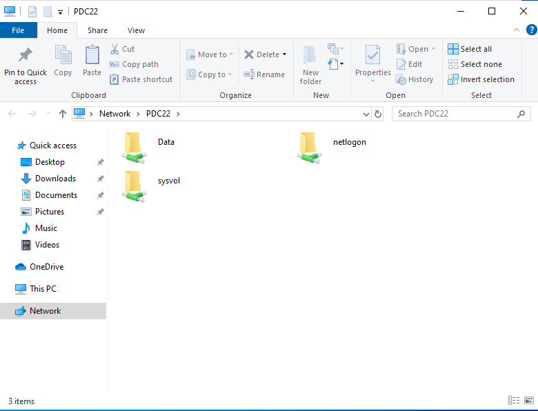
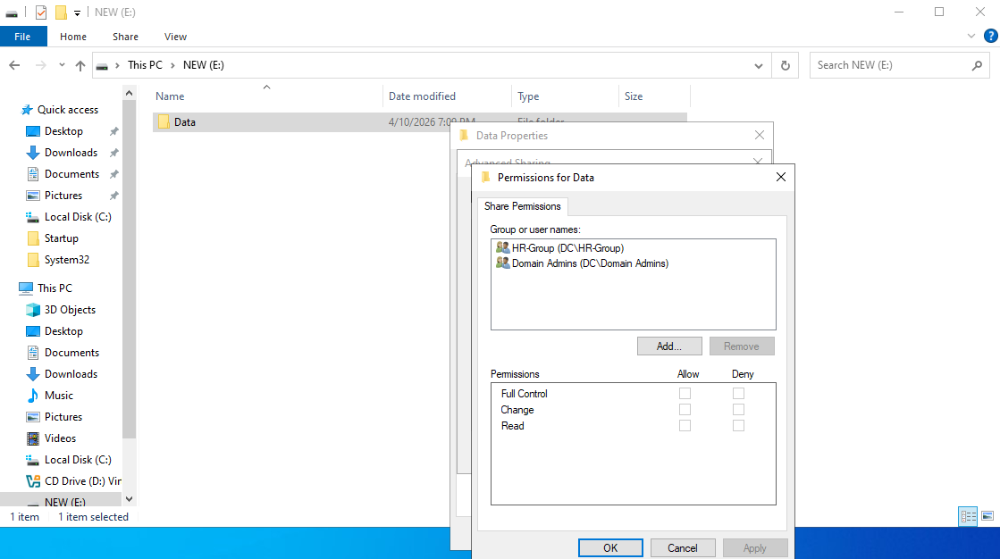
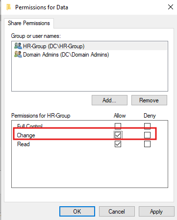
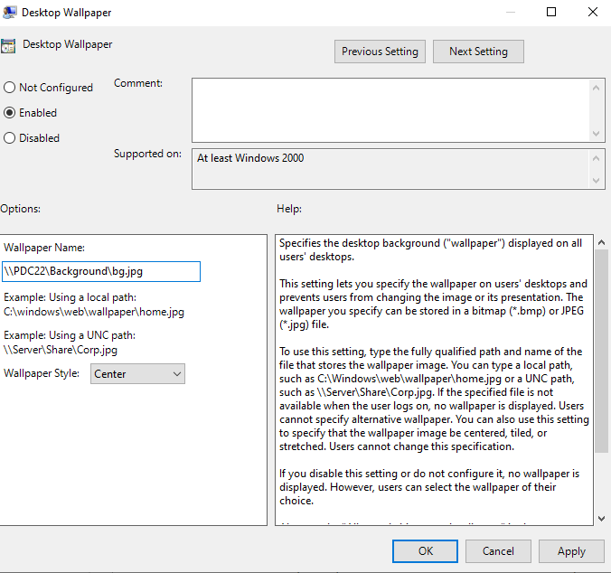
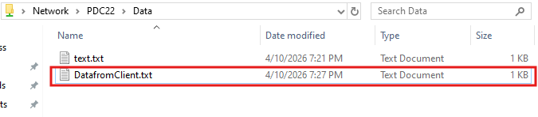
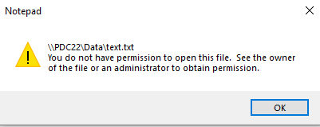

# 📁 Practical Lab — Folder Sharing, Permissions & Desktop Wallpaper GPO

> A hands-on lab guide demonstrating creating and sharing a server folder, configuring share permissions for HR-Group, testing read/write access from a client machine, and deploying a forced desktop wallpaper via GPO using a UNC path to the shared folder.


---

## 📖 Overview

This is **Session 22** of the Windows Server 2019 course. This practical lab walks through creating and sharing a `Data` folder on the server (`PDC22`), configuring share permissions for the `HR-Group`, testing access from a client machine, and using the shared folder as the source for a GPO-forced desktop wallpaper.

> 📌 **Pre-requisite:** Domain Controller (`PDC22`) with AD DS, HR-Group created in ADUC, and at least one Windows 10 client joined to the domain.

---

## 🎯 What This Lab Covers

| # | Task | Tool |
|---|---|---|
| 1 | View network shares on PDC22 | File Explorer → Network |
| 2 | Configure share permissions for Data folder | Advanced Sharing → Permissions |
| 3 | Set HR-Group to Change permission | Share Permissions dialog |
| 4 | Deploy forced desktop wallpaper via GPO | Group Policy Management Editor |
| 5 | Test write access from HR client | File Explorer → \\PDC22\Data |
| 6 | Test read denial from non-permitted user | Notepad access blocked |

---

## 🖧 Part 1 — View Network Shares on PDC22

Browsing the network from a client machine shows the shared folders available on `PDC22`:



```
\\PDC22\
├── Data       ← the shared folder created for this lab
├── netlogon   ← built-in AD share for logon scripts
└── sysvol     ← built-in AD share for GPO templates and scripts
```

> `netlogon` and `sysvol` are **automatically created by Active Directory** when the server is promoted to a Domain Controller. They should never be deleted or modified carelessly.

---

## 🔐 Part 2 — Share Permissions Overview (Before Configuration)

Before assigning specific permissions, the `Permissions for Data` dialog shows `HR-Group` and `Domain Admins` listed as groups with no permissions yet assigned:



```
Share Permissions for: \\PDC22\Data

Group or user names:
├── HR-Group (DC\HR-Group)
└── Domain Admins (DC\Domain Admins)

Permissions for HR-Group:
  Full Control  [ ] Allow  [ ] Deny
  Change        [ ] Allow  [ ] Deny
  Read          [ ] Allow  [ ] Deny
```

> At this stage, the "Everyone" default group has already been removed. Now the correct groups are listed and permissions need to be assigned.

---

## ✏️ Part 3 — Assign Change Permission to HR-Group

Assign **Change** permission to `HR-Group` so HR users can read, create, edit, and delete files in the Data share:



```
Share Permissions for: \\PDC22\Data

HR-Group (DC\HR-Group):
  Full Control  [ ] Allow  [ ] Deny
  Change        [✅] Allow  [ ] Deny    ← checked
  Read          [✅] Allow  [ ] Deny    ← auto-included with Change

Domain Admins (DC\Domain Admins):
  Full Control  [✅] Allow              ← full administrative access
```

### Why Change and Not Full Control for HR-Group?

| Permission | HR-Group needs it? | Reason |
|---|---|---|
| Read | ✅ Yes | View and open files |
| Change | ✅ Yes | Create, edit, and manage HR files |
| Full Control | ❌ No | HR users should NOT be able to modify share permissions |

> Granting Full Control to regular users allows them to **change the access control list** — they could add themselves or others to permissions, creating a security hole.

---

## 🖼️ Part 4 — Forced Desktop Wallpaper via GPO (UNC Path)

The shared `Data` folder is also used to host the company wallpaper image, making it accessible from all domain machines via a UNC path.

The screenshot below shows the **Desktop Wallpaper** policy set to **Enabled** with the wallpaper path pointing to `\\PDC22\Background\bg.jpg`:



### GPO Configuration

```
GPO: ForceWallpaper
Linked to: Domain (applies to all users)
Configuration: User Configuration
Path: User Configuration → Administrative Templates
      → Desktop → Desktop → Desktop Wallpaper
      → Set to: Enabled

Wallpaper Name: \\PDC22\Background\bg.jpg
Wallpaper Style: Center  (or Fill / Stretch)
```

### Why Use a UNC Path?

```
Local path (C:\Windows\web\wallpaper\company.jpg):
→ File must exist on EVERY client machine
→ Hard to update — must copy to every PC

UNC path (\\PDC22\Background\bg.jpg):
→ File stored ONCE on the server shared folder
→ All domain machines fetch it from one location
→ Update the file once → all machines pick up the change automatically
```

> ⚠️ The `Background` share must be accessible with at least **Read** permission for `Domain Users` — otherwise the wallpaper will not display on client machines.

---

## ✅ Part 5 — Test Write Access from HR Client

After permissions are set and policies are applied, an HR user logs into the client and accesses the shared folder. The screenshot below shows both `text.txt` (existing server file) and `DatafromClient.txt` (new file created by the HR client) inside `\\PDC22\Data`:



```
\\PDC22\Data\
├── text.txt            ← file placed on server by admin
└── DatafromClient.txt  ← new file created by HR user from client machine ✅
```

> This confirms that **Change permission is working correctly** — the HR user can create new files inside the shared folder from their workstation.

---

## ❌ Part 6 — Read Access Denied for Non-Permitted User

When a user without permission to the file tries to open `text.txt` directly from the share, Windows blocks access:



```
Error: "\\PDC22\Data\text.txt
        You do not have permission to open this file.
        See the owner of the file or an administrator
        to obtain permission."
```

> This demonstrates **Security permissions** working at the file level — even if a user can browse the shared folder (share-level access), the NTFS security permissions on the individual file can still block access.

### Share Permissions vs Security Permissions — Both Apply

```
User tries to open \\PDC22\Data\text.txt
        ↓
Check 1: Share Permissions
  → Does the user's group have Read or Change on \\PDC22\Data?
  → YES → proceed to Check 2

Check 2: NTFS Security Permissions (file level)
  → Does the user have Read permission on text.txt specifically?
  → NO → ACCESS DENIED ← this is what the screenshot shows
```

> The more restrictive of the two permission layers always wins. Share permissions allowed folder access, but NTFS security on the file blocked it.

---

## 📋 Lab Summary — What Was Configured

| Task | Configuration | Result |
|---|---|---|
| Shared `Data` folder on PDC22 | Advanced Sharing → share name: Data | Visible as `\\PDC22\Data` on the network |
| Removed "Everyone" from permissions | Share Permissions → Remove Everyone | No default open access |
| Added HR-Group → Change | Share Permissions → HR-Group → Change ✅ | HR users can create and edit files |
| Added Domain Admins → Full Control | Share Permissions → Domain Admins → Full Control ✅ | Admins can manage permissions |
| Forced wallpaper via GPO | Desktop Wallpaper → `\\PDC22\Background\bg.jpg` | All domain users see company wallpaper |
| HR user created file from client | `DatafromClient.txt` visible in `\\PDC22\Data` | Change permission confirmed working |
| Non-permitted user blocked at file level | NTFS security denied access to `text.txt` | Security permissions layer confirmed working |

---

## ✅ Lab Completion Checklist

- [ ] `Data` folder created on server and shared via Advanced Sharing
- [ ] "Everyone" group removed from share permissions
- [ ] `HR-Group` added with Change permission
- [ ] `Domain Admins` added with Full Control
- [ ] `Background` folder created and shared with Read for Domain Users
- [ ] Wallpaper image (`bg.jpg`) placed in `\\PDC22\Background\`
- [ ] `ForceWallpaper` GPO created with UNC wallpaper path
- [ ] `gpupdate /force` run on client — wallpaper applied
- [ ] HR user logged in — created file in `\\PDC22\Data` successfully
- [ ] Access denied confirmed for non-permitted file access
- [ ] VM snapshot taken after lab completion

---

## 📚 Terminology Reference

| Term | Definition |
|---|---|
| **Share** | Making a folder accessible over the network |
| **UNC path** | `\\SERVER\ShareName` — the network address of a shared resource |
| **netlogon** | Built-in AD share used for logon scripts |
| **sysvol** | Built-in AD share used for GPO templates and scripts |
| **Share Permissions** | Read/Change/Full Control — controls network-level access |
| **NTFS Security Permissions** | Granular file/folder ACL — controls both local and network access |
| **Change permission** | Allows read, create, edit, delete — cannot modify share permissions |
| **Full Control** | All Change rights + ability to modify the share's ACL |
| **Effective access** | The final access a user has after both share and NTFS permissions are evaluated |

---

## 🔭 Next Session Preview

- **NTFS Security Permissions in depth** — inheritance, special permissions, effective access
- **Mapping network drives via GPO** — deploying `Z: → \\PDC22\Data` automatically at login
- **Auditing file access** — configuring Windows to log who accessed or modified shared files

---

## 📄 License

This repository is for educational purposes. Feel free to fork and adapt for your own learning.
