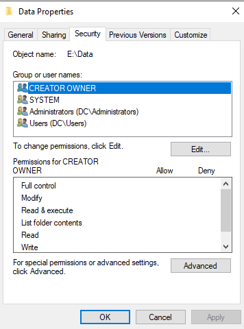
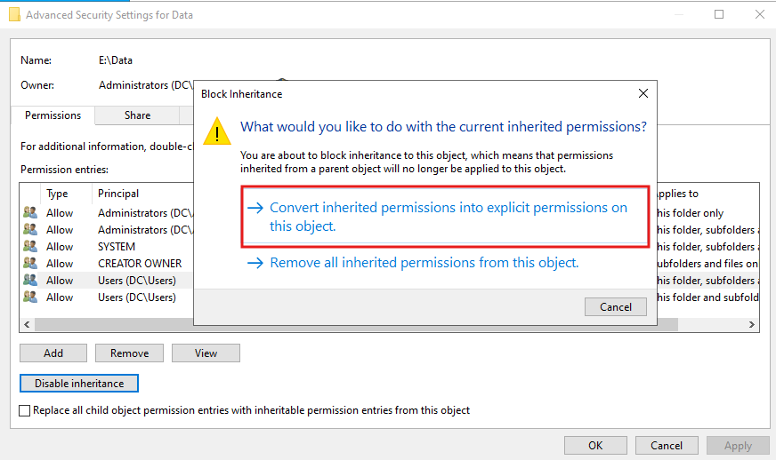
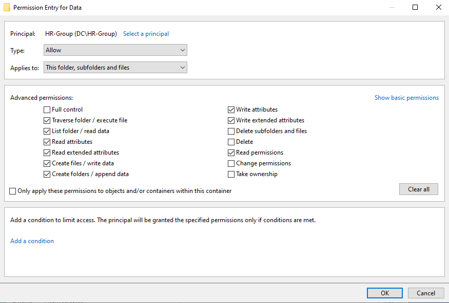
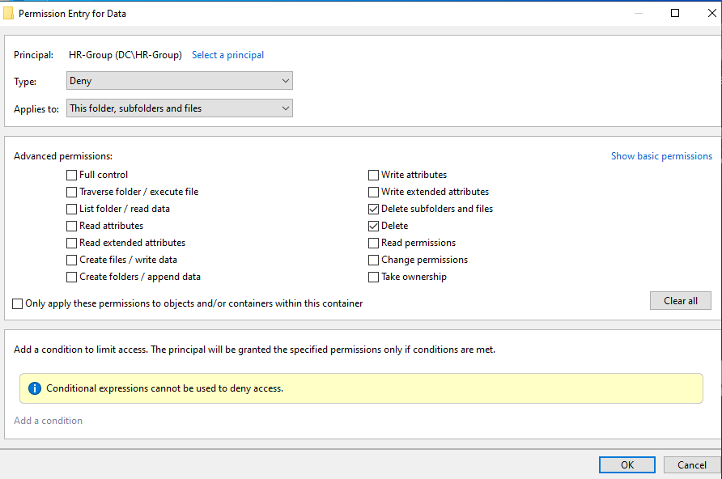
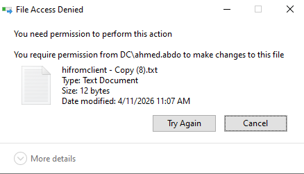

# 🔐 NTFS Security Permissions — Practical Lab

> A hands-on lab guide covering NTFS Security permissions — viewing the Security tab, advanced permissions, disabling inheritance, applying a Deny Delete rule, and confirming the restriction on a client machine.


---

## 📖 Overview

This is **Session 24** of the Windows Server 2019 course. This practical lab configures NTFS Security permissions on the `E:\Data` folder — reviewing default inherited permissions, disabling inheritance, applying granular **Allow** permissions for `HR-Group`, adding a **Deny Delete** rule, and verifying the restriction from a client machine.

> 📌 **Pre-requisite:** `E:\Data` folder exists on the server, `HR-Group` is created in ADUC and has been granted **Change** at the share level (Session 22). This session adds NTFS security-level control on top of share permissions.

---

## 🎯 What This Lab Covers

| # | Task | Tool |
|---|---|---|
| 1 | View default Security permissions on Data folder | Folder Properties → Security tab |
| 2 | Disable inheritance — convert to explicit permissions | Advanced Security Settings |
| 3 | Configure Allow advanced permissions for HR-Group | Permission Entry dialog |
| 4 | Add Deny: Delete for HR-Group | Permission Entry → Type: Deny |
| 5 | Verify delete is blocked on client machine | File Explorer error dialog |

---

## 🛡️ Part 1 — Default Security Permissions (Security Tab)

Before making any changes, the Security tab shows the **default inherited NTFS permissions** on `E:\Data`:



```
Object name: E:\Data

Default Group/User Entries (inherited from E:\ drive):
├── CREATOR OWNER      — Full control on objects they create
├── SYSTEM             — Full control (OS access)
├── Administrators (DC\Administrators) — Full control
└── Users (DC\Users)   — Read & Execute, List folder contents, Read
```

### Understanding the Default Entries

| Principal | Purpose | Should it stay? |
|---|---|---|
| **CREATOR OWNER** | Gives file creators full control over their own files | ✅ Usually keep |
| **SYSTEM** | Allows Windows itself to access the folder | ✅ Never remove |
| **Administrators** | Full admin access | ✅ Keep |
| **Users (DC\Users)** | All domain users get Read access by default | ⚠️ Review — may need to restrict |

> The default `Users (DC\Users)` entry gives every domain user at least **Read** access to this folder. This should be reviewed and adjusted based on who should actually access the folder.

---

## 🔗 Part 2 — Disable Inheritance

When you need to apply custom permissions to a specific folder without inheriting the parent drive's settings, you must **disable inheritance** first.

```
Folder Properties → Security → Advanced
→ Click "Disable inheritance"
```

The screenshot below shows the **Block Inheritance** dialog with two options:



### Two Options When Disabling Inheritance

| Option | What it does | When to use |
|---|---|---|
| **Convert inherited permissions into explicit permissions** | Copies all current inherited permissions as standalone entries — you keep the existing access but can now modify each entry | ✅ Recommended — preserves current access while allowing customization |
| **Remove all inherited permissions from this object** | Wipes all inherited entries — folder starts with no permissions | Use only when you want a completely fresh permission set (careful — could lock everyone out) |

```
Advanced Security Settings for E:\Data
Current inherited entries:
├── Allow  Administrators (DC\...)  → This folder only
├── Allow  Administrators (DC\...)  → This folder, subfolders
├── Allow  SYSTEM                   → This folder, subfolders and files
├── Allow  CREATOR OWNER            → Subfolders and files only
├── Allow  Users (DC\Users)         → This folder, subfolders
└── Allow  Users (DC\Users)         → This folder and subfolders
```

> After choosing **Convert**, all these entries become explicit (editable) permissions that no longer inherit from the parent. You can now remove or modify any of them.

---

## ⚙️ Part 3 — Advanced Permissions for HR-Group (Allow)

After disabling inheritance, configure fine-grained **Allow** permissions for `HR-Group` using the Advanced Permission Entry dialog:



### Configuration

```
Principal:   HR-Group (DC\HR-Group)
Type:        Allow
Applies to:  This folder, subfolders and files
```

### Permissions Checked (Allow)

| Permission | Checked | Purpose |
|---|---|---|
| Full control | ❌ | Not needed for regular users |
| Traverse folder / execute file | ✅ | Navigate into subfolders |
| List folder / read data | ✅ | See folder contents and read files |
| Read attributes | ✅ | View basic file info (size, dates) |
| Read extended attributes | ✅ | View additional metadata |
| Create files / write data | ✅ | Create new files and edit existing ones |
| Create folders / append data | ✅ | Create subfolders and append to files |
| Write attributes | ✅ | Modify basic file attributes |
| Write extended attributes | ✅ | Modify extended metadata |
| Delete subfolders and files | ❌ | **Intentionally left unchecked** |
| **Delete** | ❌ | **Intentionally left unchecked** |
| Read permissions | ✅ | View the permission list |
| Change permissions | ❌ | Users cannot modify permissions |
| Take ownership | ❌ | Users cannot take ownership |

> **Delete** and **Delete subfolders and files** are intentionally **not checked** in the Allow entry. This means HR users can read and write files but cannot delete them — as long as no other permission entry grants Delete.

---

## 🚫 Part 4 — Deny Delete for HR-Group

To explicitly **prevent deletion**, a second **Deny** permission entry is added specifically for the delete actions:



### Configuration

```
Principal:   HR-Group (DC\HR-Group)
Type:        Deny                    ← Deny overrides Allow in all cases
Applies to:  This folder, subfolders and files
```

### Permissions Checked (Deny)

| Permission | Checked | Effect |
|---|---|---|
| Delete subfolders and files | ✅ | **DENY** — cannot delete subfolders or their contents |
| Delete | ✅ | **DENY** — cannot delete individual files |

> Note the yellow info bar at the bottom: **"Conditional expressions cannot be used to deny access."** This is expected — Deny rules cannot have conditions applied to them. They apply absolutely.

### Why Add an Explicit Deny?

Even though Delete wasn't checked in the Allow entry, other inherited or group permissions could still grant Delete access. Adding an explicit **Deny: Delete** closes this gap — no matter what other groups the user belongs to, the Deny wins.

```
HR user permission evaluation:
├── Allow entry  → Delete: ❌ not checked
├── Deny entry   → Delete: ✅ explicitly denied
└── Result: DELETE BLOCKED ✅ (Deny overrides everything)
```

---

## ❌ Part 5 — Delete Blocked on Client Machine

After applying the policies, an HR user on the client machine (`DC\ahmed.abdo`) attempts to delete a file from `\\PDC22\Data`. Access is denied:



```
File Access Denied

You need permission to perform this action.
You require permission from DC\ahmed.abdo to make changes to this file.

File: hifromclient - Copy (8).txt
Type: Text Document
Size: 12 bytes
Date modified: 4/11/2026 11:07 AM
```

> The error states the user needs permission from the **file owner** (`DC\ahmed.abdo`). This is the expected behavior — the NTFS Deny Delete permission is working correctly and preventing the HR user from deleting files in the shared folder.

---

## 📊 Final Permission Structure for E:\Data

```
E:\Data — NTFS Security Permissions (after lab)

SYSTEM               → Allow: Full Control
Administrators       → Allow: Full Control
CREATOR OWNER        → Allow: Full Control (on objects they create)
HR-Group             → Allow: Traverse, List, Read, Write, Create (NO Delete)
HR-Group             → Deny:  Delete, Delete subfolders and files
```

### Share Permissions vs NTFS Security — Combined Effect

```
User (HR member) accesses \\PDC22\Data

Layer 1 — Share Permissions:
  HR-Group → Change (allows read, write, create, delete at share level)
        ↓
Layer 2 — NTFS Security Permissions:
  HR-Group → Allow: read, write, create
  HR-Group → Deny: delete ← THIS WINS

Final effective access:
  ✅ Can read files
  ✅ Can create new files
  ✅ Can edit existing files
  ❌ Cannot delete files or folders
```

> The most restrictive layer always wins. Even though Share Permissions (Change) would allow deletion, the NTFS **Deny Delete** overrides it completely.

---

## ✅ Lab Completion Checklist

- [ ] Security tab opened on `E:\Data` — default inherited permissions reviewed
- [ ] Inheritance disabled — "Convert inherited permissions" option selected
- [ ] `HR-Group` Allow entry configured with all permissions except Delete
- [ ] `HR-Group` Deny entry added for Delete and Delete subfolders and files
- [ ] `gpupdate /force` run on client (if needed)
- [ ] HR user logged in on client — attempted to delete file
- [ ] "File Access Denied" error confirmed — Delete blocked
- [ ] HR user still able to create and edit files — confirmed working
- [ ] VM snapshot taken after configuration

---

## 📚 Terminology Reference

| Term | Definition |
|---|---|
| **NTFS Security Permissions** | Granular ACL-based access control applied at the file/folder level |
| **Security tab** | Folder Properties tab showing the NTFS ACL |
| **Advanced Security Settings** | Extended dialog showing all permission entries, inheritance, and ownership |
| **Permission Entry** | A single row in the ACL defining what a principal can or cannot do |
| **Principal** | The user or group a permission entry applies to |
| **Allow** | Permission type granting access to a specific action |
| **Deny** | Permission type blocking access — overrides Allow in all cases |
| **Inheritance** | Parent folder permissions automatically applying to child folders and files |
| **Block Inheritance** | Stops parent permissions from propagating to a specific folder |
| **Convert to explicit** | Copies inherited permissions as standalone entries for independent editing |
| **CREATOR OWNER** | Special principal — gives users Full Control over objects they personally created |
| **Effective access** | The final access a user has after all Allow and Deny entries across all groups are evaluated |

---

## 🔭 Next Session Preview

- **NTFS Effective Access** — checking what a specific user can actually do on a folder
- **File Server Resource Manager (FSRM)** — folder quotas and file screening in practice
- **Shadow Copy** — enabling and restoring previous file versions

---

## 📄 License

This repository is for educational purposes. Feel free to fork and adapt for your own learning.
