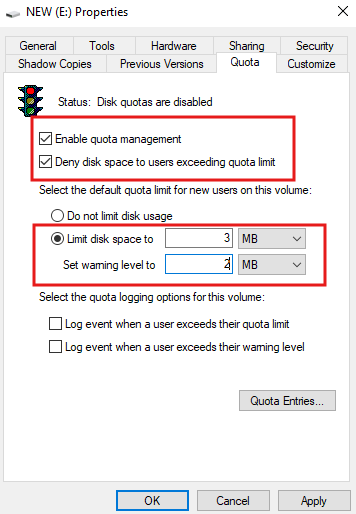
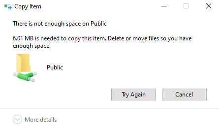
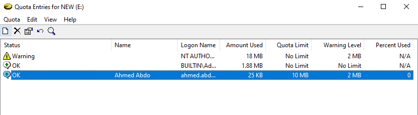

# 📏 NTFS Disk Quotas — Practical Lab

> A hands-on lab guide covering enabling and configuring NTFS disk quotas on a partition — setting per-user storage limits, warning levels, verifying enforcement when the limit is exceeded, and monitoring quota usage via Quota Entries.


---

## 📖 Overview

This is **Session 25** of the Windows Server 2019 course. This practical lab enables **NTFS disk quotas** on the `E:` (NEW) volume, sets a 3 MB hard limit and 2 MB warning level for users, verifies that the limit is enforced when exceeded, and monitors per-user usage via the Quota Entries console.

> 📌 **Pre-requisite:** An NTFS-formatted volume (here `NEW (E:)`) and at least one domain user account (`Ahmed Abdo / ahmed.abdo`) to test with.

---

## 🎯 What This Lab Covers

| # | Task | Tool |
|---|---|---|
| 1 | Enable quota management on the E: volume | Drive Properties → Quota tab |
| 2 | Set hard limit (3 MB) and warning level (2 MB) | Quota tab settings |
| 3 | Test — attempt to copy a file exceeding the limit | File Explorer |
| 4 | Monitor per-user quota usage | Quota Entries console |

---

## ⚙️ Part 1 — Enable Disk Quotas on E: Drive

Disk quotas are configured per volume from the drive's Properties dialog:

```
File Explorer → Right-click NEW (E:) → Properties → Quota tab
```

The screenshot below shows the Quota tab with quota management enabled and a **3 MB hard limit** and **2 MB warning level** configured:



### Settings Configured

| Setting | Value | Description |
|---|---|---|
| **Enable quota management** | ✅ Checked | Activates quota tracking on this volume |
| **Deny disk space to users exceeding quota limit** | ✅ Checked | Hard limit — writes are blocked when limit is hit |
| **Limit disk space to** | **3 MB** | Maximum storage each user can consume |
| **Set warning level to** | **2 MB** | User (or admin) gets warned when this threshold is reached |
| Log event when user exceeds quota | ☐ | Optional — logs to Event Viewer |
| Log event when user exceeds warning | ☐ | Optional — logs to Event Viewer |

### Hard Limit vs Soft Limit

| Type | Setting | Behavior |
|---|---|---|
| **Hard limit** | "Deny disk space to users exceeding quota limit" ✅ | Writes are **blocked** when the limit is hit |
| **Soft limit** | "Deny disk space..." ☐ (unchecked) | User can still write; admin is **warned** only |

> In this lab, **hard limit** is used — users will receive an error when they try to write beyond 3 MB.

### Applying the Quota

```
Click Apply → Windows scans the disk and applies quota to existing users
→ Traffic light icon changes to green when active
→ Click "Quota Entries..." to view per-user status
```

---

## ❌ Part 2 — Quota Exceeded — Copy Blocked

After the quota is set, a user attempts to copy a file larger than their remaining quota to the `Public` share. Windows blocks the operation:



```
Copy Item
There is not enough space on Public.
6.01 MB is needed to copy this item.
Delete or move files so you have enough space.
```

> The user has hit their **3 MB hard limit**. Windows treats the quota as the disk being "full" for that specific user — even if the physical drive has plenty of free space remaining. Other users are unaffected and can still write to the same volume up to their own quota.

### Key Behavior

```
Volume E: has 50 GB free physically
User Ahmed Abdo has used 3 MB (quota limit reached)

Ahmed tries to copy a 6 MB file:
→ Windows reports "not enough space"
→ Copy is blocked ✅

Other user (Sara) has used 1 MB (2 MB remaining):
→ Sara can still copy files up to 2 MB more
→ Unaffected by Ahmed's quota
```

---

## 📊 Part 3 — Quota Entries Console

The **Quota Entries** window shows per-user storage usage, limits, and warning levels across all accounts that have written to the volume:



### Quota Entries Table

| Status | Name | Logon Name | Amount Used | Quota Limit | Warning Level | % Used |
|---|---|---|---|---|---|---|
| ⚠️ Warning | — | NT AUTHO... | 18 MB | No Limit | 2 MB | N/A |
| ✅ OK | — | BUILTIN\Ad... | 1.88 MB | No Limit | No Limit | N/A |
| ✅ OK | **Ahmed Abdo** | ahmed.abd... | **25 KB** | **10 MB** | **2 MB** | 0 |

### Status Icons

| Icon | Meaning |
|---|---|
| ✅ OK | User is within quota limit |
| ⚠️ Warning | User has exceeded the warning level (but not the hard limit) |
| 🔴 Exceeded | User has hit the hard limit — writes are blocked |

### Notable Observations

- **NT AUTHORITY** shows 18 MB used with a Warning status — it has exceeded the 2 MB warning threshold but has no hard limit set (No Limit).
- **BUILTIN\Administrators** has No Limit — administrators are typically exempt from quota restrictions.
- **Ahmed Abdo** has a **10 MB quota limit** (set as an individual override) with only 25 KB used — well within the limit.

> You can set **individual quota overrides** for specific users that differ from the default. Right-click any entry in Quota Entries → Properties to customize the limit for that user.

---

## 🔧 Setting Individual User Quota Overrides

```
Quota tab → Quota Entries button
→ Quota menu → New Quota Entry
→ Enter username: ahmed.abdo
→ Set individual limit: 10 MB (overrides the 3 MB default)
→ Set warning: 2 MB
→ OK
```

This allows the admin to give specific users more (or less) storage than the default volume quota.

---

## 📋 Quota Configuration Reference

```
Drive Properties → Quota tab settings:

✅ Enable quota management
✅ Deny disk space to users exceeding quota limit   ← Hard limit

Limit disk space to:     3  MB   ← default for all new users
Set warning level to:    2  MB   ← warning threshold

[Optional logging]
☐ Log event when user exceeds quota limit
☐ Log event when user exceeds warning level

→ Apply → OK
→ Quota Entries... to monitor per-user usage
```

---

## ⚠️ Important Limitations of NTFS Disk Quotas

| Limitation | Workaround |
|---|---|
| Quotas apply **per volume only** — not per folder | Use **FSRM** (File Server Resource Manager) for folder-level quotas |
| Quota is per **user** — shared folders count space to the user who wrote the files | Educate users; use FSRM for shared space limits |
| Cannot easily track quota across **multiple volumes** | Monitor each volume's Quota Entries separately |
| Quota Entries only shows users who have **written to the volume** | Run `gpupdate /force` or wait for users to log in and create files |

---

## ✅ Lab Completion Checklist

- [ ] `NEW (E:)` volume opened → Quota tab located
- [ ] Quota management enabled
- [ ] "Deny disk space to users exceeding quota limit" checked (hard limit)
- [ ] Default limit set: **3 MB**
- [ ] Warning level set: **2 MB**
- [ ] Applied → quota activated
- [ ] Test user (Ahmed Abdo) attempted to copy file exceeding limit
- [ ] "Not enough space" error confirmed — copy blocked
- [ ] Quota Entries opened — per-user usage reviewed
- [ ] Individual quota override set for Ahmed Abdo (10 MB)
- [ ] VM snapshot taken after configuration

---

## 📚 Terminology Reference

| Term | Definition |
|---|---|
| **Disk Quota** | A per-user limit on how much storage they can consume on a volume |
| **Hard limit** | Blocks further writes when the quota is exceeded |
| **Soft limit** | Allows writes past the quota but generates a warning |
| **Warning level** | A threshold below the hard limit that triggers a warning event |
| **Quota Entries** | The per-user quota usage console showing amount used, limit, and status |
| **No Limit** | The user has no quota restriction — typically set for administrators |
| **Individual override** | A custom quota set for a specific user that differs from the volume default |
| **FSRM** | File Server Resource Manager — needed for folder-level quotas (partition quotas cannot target specific folders) |

---

## 🔭 Next Session Preview

- **File Server Resource Manager (FSRM)** — folder-level quotas and file screening in practice
- **Shadow Copy** — enabling snapshots and restoring previous file versions
- **Shared folder auditing** — tracking who accessed or modified files

---

## 📄 License

This repository is for educational purposes. Feel free to fork and adapt for your own learning.
