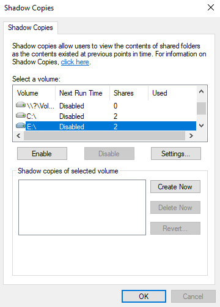
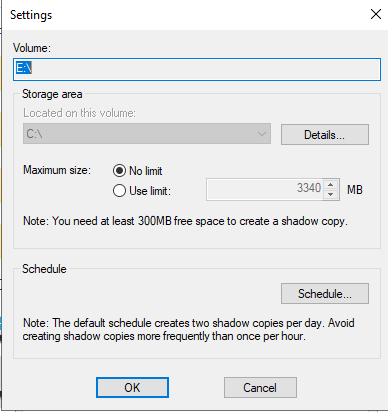
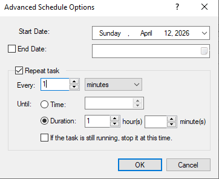
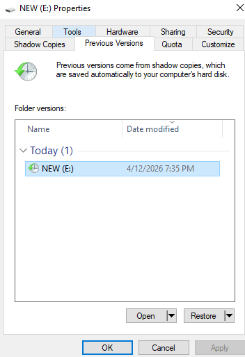

## 🧪 Lab: Shadow Copies & Previous Versions

**Topic:** Volume Shadow Copy Service (VSS) — Configuration, Scheduling & Restore  
**Platform:** Windows Server 2016 / 2019  
**Difficulty:** Beginner–Intermediate

### 🎯 Objectives

- Enable and configure Shadow Copies on a selected volume
- Adjust storage area settings and size limits
- Schedule automated shadow copy creation
- Restore previous versions of files/folders using VSS snapshots

---

### 📋 Tasks

#### Task 1 — Configure Shadow Copies

Open **Computer Management → Shared Folders → Shadow Copies**. Select the target volume (`E:\`) and click **Enable** to activate shadow copy tracking.

> The Shadow Copies panel lists all volumes, their next scheduled run time, share count, and storage used. Here `E:\` is selected with status `Disabled` and 2 shares detected.

---

#### Task 2 — Shadow Copy Storage Settings

Click **Settings** to configure the storage area and maximum size for shadow copies on the selected volume.

> **Storage area** is located on `C:\`. Maximum size is set to **No limit** (3340 MB available). Note: at least **300 MB free space** is required to create a shadow copy. The default schedule creates **two shadow copies per day** — avoid creating them more frequently than once per hour.

---

#### Task 3 — Advanced Schedule Options

Click **Schedule** inside Settings to define when shadow copies are created automatically.

> The **Advanced Schedule Options** dialog allows setting a start date, enabling task repetition (e.g., every N minutes), and capping execution duration. Here the task repeats every **1 minute** with a **1-hour duration** cap, starting **Sunday, April 12, 2026**.

---

#### Task 4 — Restore a Previous Version

Right-click any folder → **Properties → Previous Versions** tab to browse and restore snapshots created by VSS.

> The **Previous Versions** tab shows a snapshot of `NEW (E:)` taken **today at 7:35 PM**. Use **Open** to browse the snapshot or **Restore** to roll back the entire volume/folder to that point in time.

---

### 🔑 Key Concepts

| Concept | Description |
|---|---|
| **VSS (Volume Shadow Copy Service)** | Windows service that creates consistent point-in-time snapshots of volumes |
| **Shadow Copy** | Read-only snapshot of a volume at a specific moment |
| **Previous Versions** | End-user interface to access and restore shadow copy data |
| **Storage Area** | Disk location where VSS stores changed block data |
| **Schedule** | Automated trigger for periodic snapshot creation |

---

### ⚠️ Important Notes

- Shadow copies **do not replace backups** — they are point-in-time snapshots for quick recovery only.
- Creating copies **more than once per hour** is not recommended and may degrade performance.
- If the storage area fills up, the **oldest shadow copies are deleted** automatically.
- The **Restore** operation overwrites current data — use **Open** first to verify the snapshot contents.

---

### 🛠️ Requirements

- Windows Server 2016 or later (or Windows 10/11 Pro/Enterprise for client-side)
- A secondary volume (e.g., `E:\`) with at least **300 MB** free space
- Administrator privileges

---

## 📚 Related Lectures

- Introduction to Windows Server Storage Management
- Volume Shadow Copy Service (VSS) Architecture
- Disaster Recovery Planning on Windows Server

---

## 👨‍💻 Author

> Lab materials prepared for Windows Server administration coursework.  
> Screenshots captured on **Windows Server — April 12, 2026**.

---

