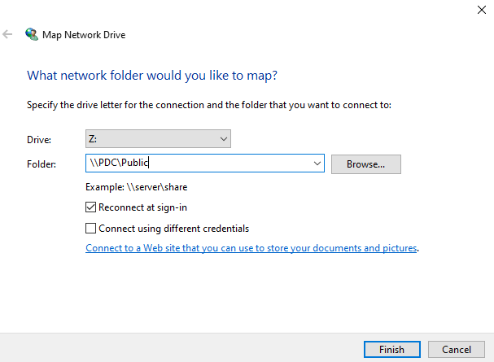
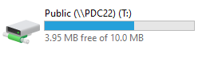
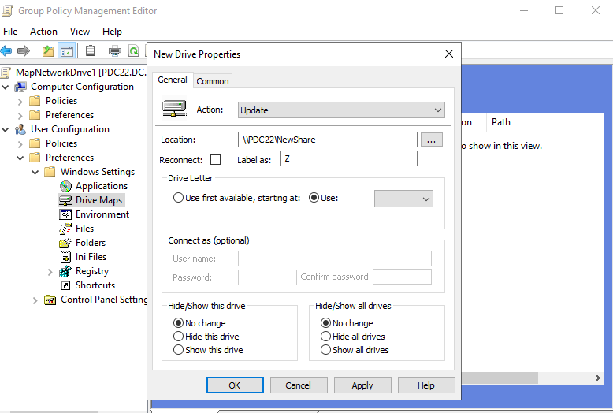
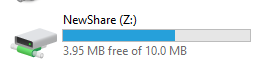
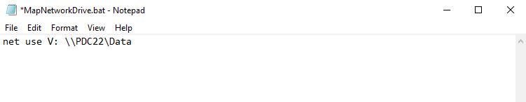
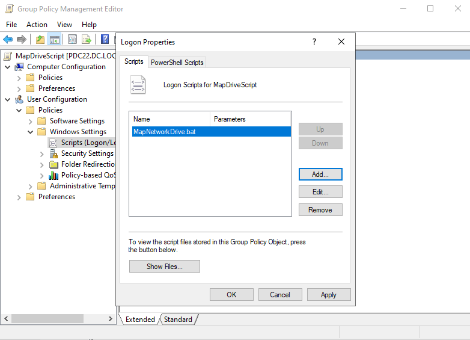
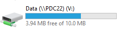

# 🗂️ Lab: Mapping Network Drives

**Topic:** Mapping Network Drives — Manual, Group Policy & Logon Script  
**Platform:** Windows Server 2016 / 2019 with Active Directory  
**Difficulty:** Beginner–Intermediate

---

## 🎯 Objectives

- Map a network drive manually using File Explorer
- Map a network drive automatically via Group Policy Preferences (Drive Maps)
- Map a network drive using a logon batch script assigned through Group Policy

---

## 📋 Tasks

### Method 1 — Manual Mapping via File Explorer

#### Task 1 — Map Network Drive Wizard

Open **File Explorer → This PC → Map Network Drive**. Set the drive letter to `Z:` and the folder path to `\\PDC\Public`. Enable **Reconnect at sign-in** so the mapping persists across reboots.



> Drive `Z:` is mapped to `\\PDC\Public` with **Reconnect at sign-in** checked. Credentials are not required as the share uses integrated Windows authentication.

---

#### Task 2 — Drive Mapped Successfully

After clicking **Finish**, the mapped drive appears in File Explorer under **This PC**.



> `Public (\\PDC22)` appears as drive `T:` with **3.95 MB free of 10.0 MB** — confirming the share is accessible and the quota is applied.

---

### Method 2 — Group Policy Preferences (Drive Maps)

#### Task 3 — Configure Drive Map in Group Policy

Open **Group Policy Management Editor** and navigate to **User Configuration → Preferences → Windows Settings → Drive Maps**. Create a new drive with action **Update**, location `\\PDC22\NewShare`, label `Z`, and drive letter set to **Use**.



> The **New Drive Properties** dialog targets `\\PDC22\NewShare`. Action is set to **Update** so the policy re-applies if the drive is removed. Hide/Show options are left at **No change**.

---

#### Task 4 — Drive Mapped via Policy

After a Group Policy refresh (`gpupdate /force`) or user logon, the policy-mapped drive appears in File Explorer.



> `NewShare (Z:)` is now visible with **3.95 MB free of 10.0 MB**, confirming the Group Policy preference was applied successfully.

---

### Method 3 — Logon Script via Group Policy

#### Task 5 — Create the Batch Script

Create a `.bat` file named `MapNetworkDrive.bat` containing the `net use` command to map the drive at logon.



```bat
net use V: \\PDC22\Data
```

> The script maps drive `V:` to `\\PDC22\Data`. Save the file to the GPO's script folder (accessible via **Show Files** in the Logon Properties dialog).

---

#### Task 6 — Assign Script in Group Policy

In **Group Policy Management Editor**, navigate to **User Configuration → Policies → Windows Settings → Scripts (Logon/Logoff)**. Open **Logon Properties** and add `MapNetworkDrive.bat` as a logon script.



> `MapNetworkDrive.bat` is listed under **Logon Scripts for MapDriveScript** GPO. The script runs at every user logon, ensuring the drive is always mapped.

---

#### Task 7 — Drive Mapped via Script

After logon, the script-mapped drive appears in File Explorer.



> `Data (\\PDC22)` appears as drive `V:` with **3.94 MB free of 10.0 MB**, confirming the logon script executed successfully.

---

## 🔑 Key Concepts

| Concept | Description |
|---|---|
| **Map Network Drive** | Links a drive letter to a UNC network path (`\\server\share`) |
| **UNC Path** | Universal Naming Convention path format for network resources |
| **Reconnect at sign-in** | Automatically restores the mapped drive on every logon |
| **Group Policy Preferences** | GPO feature to deploy drive mappings to users/computers |
| **`net use`** | Command-line tool to connect/disconnect network drives |
| **Logon Script** | Script that runs automatically when a user logs on |
| **`gpupdate /force`** | Forces immediate re-application of Group Policy |

---

## ⚠️ Important Notes

- **Manual mapping** is per-user and per-machine — it does not scale in enterprise environments.
- **Group Policy Drive Maps** (Method 2) is the recommended approach for domain environments — supports filtering by user, group, or OU.
- **Logon scripts** (Method 3) offer more flexibility but are harder to manage at scale compared to GP Preferences.
- Ensure the shared folder has correct **NTFS and Share permissions** for target users before mapping.
- Use `gpupdate /force` on the client to test policy changes without waiting for the next refresh cycle.

---

## 🛠️ Requirements

- Windows Server 2016 or later with **Active Directory Domain Services**
- A shared folder (e.g., `\\PDC22\Public`, `\\PDC22\NewShare`, `\\PDC22\Data`)
- Group Policy Management Console (GPMC)
- Client machine joined to the domain
- Administrator or Group Policy Editor privileges

---

## 👨‍💻 Author

> Lab materials prepared for Windows Server administration coursework.  
> Screenshots captured on **Windows Server — April 12, 2026**.
