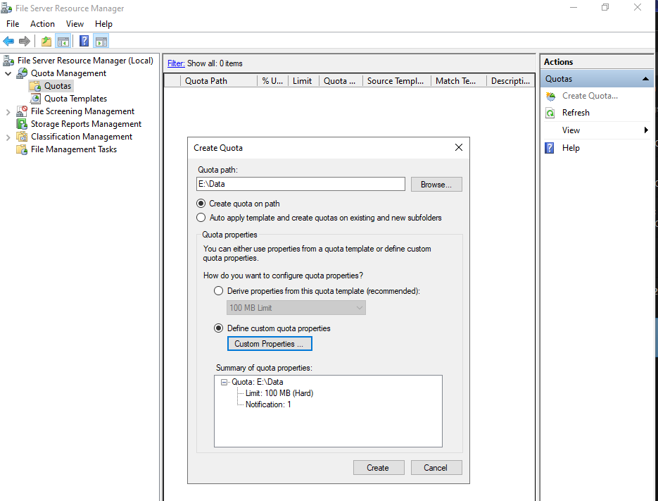
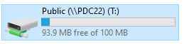
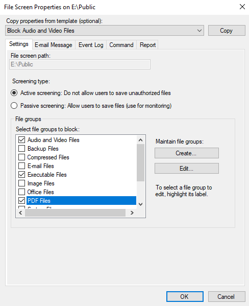
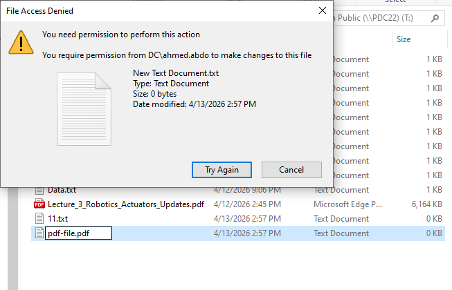
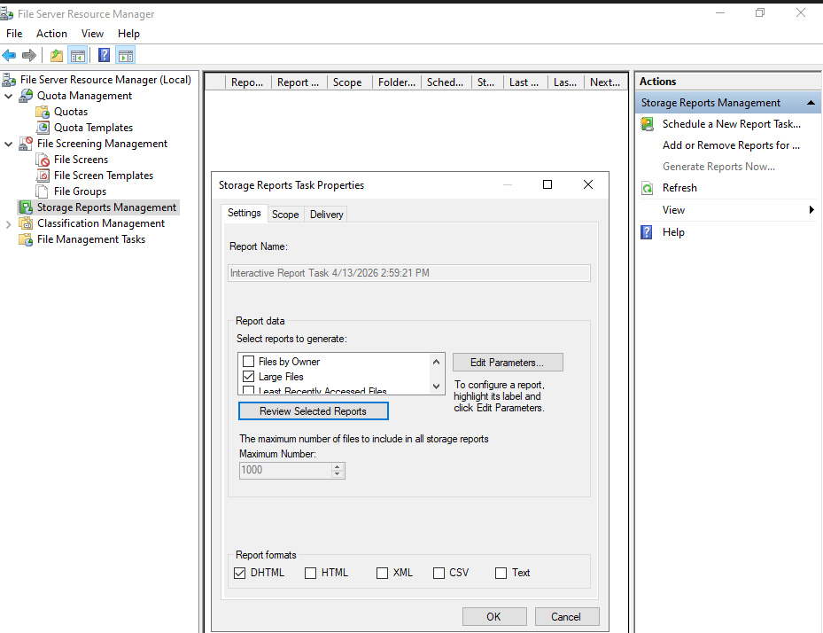
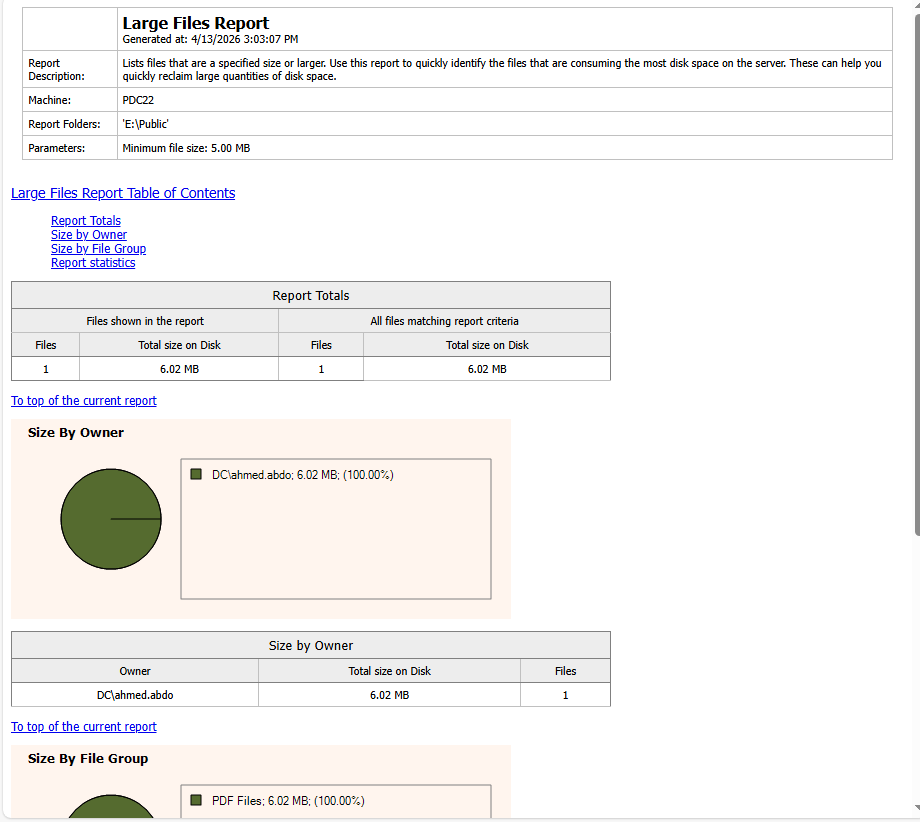

# 📊 Lab: File Server Resource Manager (FSRM)

**Topic:** FSRM — Disk Quotas, File Screening & Storage Reports  
**Platform:** Windows Server 2016 / 2019  
**Difficulty:** Beginner–Intermediate

---

## 🎯 Objectives

- Create and apply a disk quota on a volume path using FSRM
- Configure a file screen to block unauthorized file types
- Verify that blocked file types are actively denied
- Generate and review a storage report for large files

---

## 📋 Tasks

### Part 1 — Disk Quota Management

#### Task 1 — Create a Quota on E:\Data

Open **File Server Resource Manager → Quota Management → Quotas** and click **Create Quota**. Set the quota path to `E:\Data`, choose **Define custom quota properties**, and configure a **Hard limit of 100 MB** with 1 notification threshold.

> Quota path is `E:\Data`. Custom properties summary shows: **Limit: 100 MB (Hard)** with **Notification: 1**. A hard limit prevents users from writing data beyond the cap.

---

#### Task 2 — Quota Applied Successfully

After clicking **Create**, the quota becomes active on the volume. The drive now reflects the enforced 100 MB cap.

> `Public (\\PDC22)` drive `T:` now shows **93.9 MB free of 100 MB**, confirming the quota is enforced and in effect.

---

### Part 2 — File Screening Management

#### Task 3 — Configure a File Screen on E:\Public

Navigate to **File Screening Management → File Screens** and open properties for `E:\Public`. Apply the **Block Audio and Video Files** template and add **PDF Files** and **Executable Files** to the blocked file groups. Set screening type to **Active screening**.

> **Active screening** is selected — users cannot save unauthorized files. Blocked groups include **Audio and Video Files**, **Executable Files**, and **PDF Files**. Active screening enforces the block in real time, unlike passive screening which only monitors.

---

#### Task 4 — PDF File Upload Denied

Attempt to save a `.pdf` file to `E:\Public` to verify the file screen is working. Windows immediately blocks the action.

> The **File Access Denied** dialog confirms the block: saving `pdf-file.pdf` to `Public (\\PDC22) T:` was denied. The existing `Lecture_3_Robotics_Actuators_Updates.pdf` was already present before the screen was applied and is unaffected.

---

### Part 3 — Storage Reports

#### Task 5 — Generate a Large Files Report

In **Storage Reports Management**, create an interactive report task. Select **Large Files** as the report type, set the folder scope to `E:\Public`, and set the maximum file count to **1000**. Export in **DHTML** format.

> The **Storage Reports Task Properties** dialog shows **Large Files** selected under report data. Report format is set to **DHTML**. Click **Review Selected Reports** to generate and open the report immediately.

---

#### Task 6 — Large Files Report Output

The generated report lists all files in `E:\Public` that meet the minimum size threshold (5.00 MB).

> The report was generated on **4/13/2026 at 3:03:07 PM** for machine **PDC22**, folder `E:\Public`, with a minimum file size of **5.00 MB**. Results: **1 file totalling 6.02 MB**, owned entirely by `DC\ahmed.abdo`. The **Size by File Group** chart attributes 100% to **PDF Files** — consistent with the file screen configuration.

---

## 🔑 Key Concepts

| Concept | Description |
|---|---|
| **FSRM** | File Server Resource Manager — Windows Server role for storage management |
| **Quota (Hard)** | Enforces a strict storage cap; writes beyond the limit are denied |
| **Quota (Soft)** | Monitors usage and sends alerts but does not block writes |
| **File Screen** | Blocks or monitors specific file types from being saved to a path |
| **Active Screening** | Denies saving of unauthorized file types in real time |
| **Passive Screening** | Allows saving but logs violations for monitoring purposes |
| **Storage Report** | On-demand or scheduled report analyzing disk usage, large files, file owners, etc. |
| **File Group** | Named collection of file extensions used in file screens (e.g., PDF Files = `*.pdf`) |

---

## ⚠️ Important Notes

- **Hard quotas** block writes immediately when the limit is reached — warn users proactively via notification thresholds (e.g., at 85%).
- **File screens apply to new files only** — files already present before the screen was created are not removed.
- **Active screening** should be tested carefully in production; use **Passive** first to audit without disrupting users.
- FSRM reports can be scheduled or generated on demand; DHTML format is best for interactive browsing.
- The **Storage Reports** folder default location is `%SystemDrive%\StorageReports`.

---

## 🛠️ Requirements

- Windows Server 2016 or later
- **File Server Resource Manager** role service installed
- A volume with shared folders (e.g., `E:\Data`, `E:\Public`)
- Administrator privileges

---

## 👨‍💻 Author

> Lab materials prepared for Windows Server administration coursework.  
> Screenshots captured on **Windows Server — April 13, 2026**.
