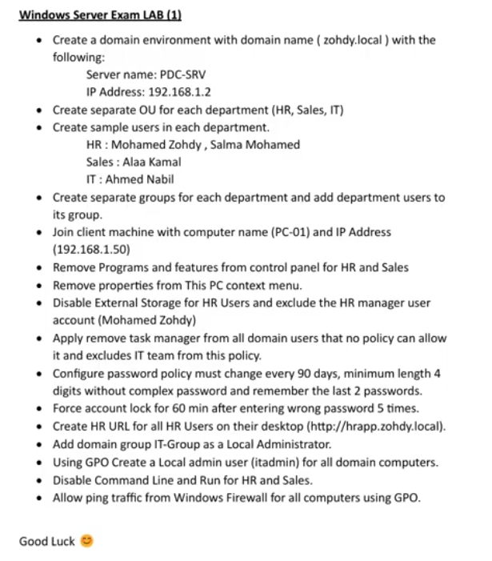

# 🖥️ Windows Server Exam LAB (2) — Full Solution Guide

**Domain:** `zohdy.local`  
**Server Name:** `PDC-SRV` | **Server IP:** `192.168.1.2`  
**Client Name:** `PC-01` | **Client IP:** `192.168.1.50`

---

## 📋 Table of Contents

1. [Create the Domain Environment](#1-create-the-domain-environment)
2. [Create OUs, Users & Groups](#2-create-ous-users--groups)
3. [Join Client Machine to Domain](#3-join-client-machine-to-domain)
4. [Remove Programs and Features (HR & Sales)](#4-remove-programs-and-features-hr--sales)
5. [Remove Properties from This PC Context Menu](#5-remove-properties-from-this-pc-context-menu)
6. [Disable External Storage for HR (Exclude Manager)](#6-disable-external-storage-for-hr-exclude-manager)
7. [Remove Task Manager from All Users (Exclude IT)](#7-remove-task-manager-from-all-users-exclude-it)
8. [Configure Password Policy](#8-configure-password-policy)
9. [Configure Account Lockout Policy](#9-configure-account-lockout-policy)
10. [Create HR URL Shortcut on Desktop](#10-create-hr-url-shortcut-on-desktop)
11. [Create Local Admin User via GPO](#11-create-local-admin-user-via-gpo)
12. [Add IT-Group as Local Administrator via GPO](#12-add-it-group-as-local-administrator-via-gpo)
13. [Disable Command Line and Run for HR & Sales](#13-disable-command-line-and-run-for-hr--sales)
14. [Allow Ping via Windows Firewall GPO](#14-allow-ping-via-windows-firewall-gpo)

---

## 1. Create the Domain Environment

1. Open **Server Manager → Add Roles and Features**
2. Install **Active Directory Domain Services (AD DS)**
3. After installation click **Promote this server to a domain controller**
4. Select **Add a new forest** → Root domain name: `zohdy.local`
5. Set DSRM password → complete the wizard → server reboots
6. After reboot, rename the server:
   - Right-click **This PC → Properties → Change settings → Change**
   - Computer name: `PDC-SRV`
7. Set static IP:
   - Network Adapter → IPv4 → IP: `192.168.1.2`, Subnet: `255.255.255.0`
   - Preferred DNS: `192.168.1.2` (point to itself)

---

## 2. Create OUs, Users & Groups

### Create Organizational Units

Open **Active Directory Users and Computers (ADUC)** → right-click `zohdy.local` → **New → Organizational Unit**

Create three OUs: `HR`, `Sales`, `IT`

### Create Users

Right-click each OU → **New → User**

| OU | Full Name | Username |
|---|---|---|
| HR | Mohamed Zohdy | m.zohdy |
| HR | Salma Mohamed | s.mohamed |
| Sales | Alaa Kamal | a.kamal |
| IT | Ahmed Nabil | a.nabil |

### Create Groups and Add Members

Right-click each OU → **New → Group** → Group scope: **Global**, type: **Security**

| Group Name | OU | Members |
|---|---|---|
| HR-Group | HR | Mohamed Zohdy, Salma Mohamed |
| Sales-Group | Sales | Alaa Kamal |
| IT-Group | IT | Ahmed Nabil |

To add members: double-click group → **Members tab → Add**

---

## 3. Join Client Machine to Domain

On **PC-01** (IP: `192.168.1.50`, DNS: `192.168.1.2`):

1. Set static IP and point DNS to `192.168.1.2`
2. Right-click **This PC → Properties → Change settings → Change**
3. Select **Domain** → enter `zohdy.local`
4. Enter domain admin credentials → restart

---

## 4. Remove Programs and Features (HR & Sales)

**GPO path:** `User Configuration → Policies → Administrative Templates → Control Panel → Programs`

1. Open **Group Policy Management** → right-click `HR` OU → **Create a GPO** → name: `Remove-Programs-HR`
2. Edit → navigate to the path above
3. Enable **Hide "Programs and Features" page**
4. Repeat for `Sales` OU with GPO named `Remove-Programs-Sales`
5. Run `gpupdate /force` on client or wait for refresh

---

## 5. Remove Properties from This PC Context Menu

**GPO path:** `User Configuration → Policies → Administrative Templates → Desktop`

1. Create GPO linked to the domain root (applies to all users) or link to specific OUs as needed
2. Enable **Remove Properties from the Computer icon context menu**
3. Link the GPO to the desired OU or domain root

---

## 6. Disable External Storage for HR (Exclude Manager)

**GPO path:** `Computer Configuration → Policies → Administrative Templates → System → Removable Storage Access`

1. Create GPO → name: `Disable-ExternalStorage-HR` → link to `HR` OU
2. Enable **All Removable Storage classes: Deny all access**
3. To **exclude Mohamed Zohdy** (HR manager):
   - In **Group Policy Management** → select the GPO → **Delegation tab → Advanced**
   - Add `m.zohdy` → check **Deny: Apply Group Policy**
   - This prevents the policy from applying to him while it applies to all other HR users

---

## 7. Remove Task Manager from All Users (Exclude IT)

**GPO path:** `User Configuration → Policies → Administrative Templates → System → Ctrl+Alt+Del Options`

1. Create GPO → name: `Remove-TaskManager-All` → link to **domain root** (applies to all users)
2. Enable **Remove Task Manager**
3. To **exclude IT team**:
   - Select the GPO → **Delegation → Advanced**
   - Add `IT-Group` → check **Deny: Apply Group Policy**
   - IT members will not have this policy applied

---

## 8. Configure Password Policy

**GPO path:** `Computer Configuration → Policies → Windows Settings → Security Settings → Account Policies → Password Policy`

> Password policy must be configured in the **Default Domain Policy** to take effect domain-wide.

1. Edit **Default Domain Policy**
2. Set the following:

| Setting | Value |
|---|---|
| Maximum password age | 90 days |
| Minimum password length | 4 characters |
| Password must meet complexity requirements | Disabled |
| Enforce password history | 2 passwords remembered |
| Minimum password age | 1 day (recommended) |

---

## 9. Configure Account Lockout Policy

**GPO path:** `Computer Configuration → Policies → Windows Settings → Security Settings → Account Policies → Account Lockout Policy`

1. Edit **Default Domain Policy** → navigate to Account Lockout Policy
2. Set the following:

| Setting | Value |
|---|---|
| Account lockout threshold | 5 invalid logon attempts |
| Account lockout duration | 60 minutes |
| Reset account lockout counter after | 60 minutes |

---

## 10. Create HR URL Shortcut on Desktop

**GPO path:** `User Configuration → Preferences → Windows Settings → Shortcuts`

1. Create GPO → name: `HR-Desktop-Shortcut` → link to `HR` OU
2. Edit → navigate to the path above → right-click → **New → Shortcut**
3. Configure:
   - Action: **Create**
   - Name: `HR App`
   - Target type: **URL**
   - Location: **Desktop**
   - Target URL: `http://hrapp.zohdy.local`

---

## 11. Create Local Admin User via GPO

**GPO path:** `Computer Configuration → Preferences → Control Panel Settings → Local Users and Groups`

1. Create GPO → name: `Create-LocalAdmin-itadmin` → link to **domain root** (all computers)
2. Edit → navigate to the path above → right-click → **New → Local User**
3. Configure:
   - Action: **Create**
   - User name: `itadmin`
   - Password: (set a strong password)
   - Check: **User cannot change password** + **Password never expires**
4. To make `itadmin` a local administrator, also add a **Local Group** entry:
   - New → Local Group → Action: **Update**
   - Group name: **Administrators (built-in)**
   - Add member: `itadmin`

---

## 12. Add IT-Group as Local Administrator via GPO

**GPO path:** `Computer Configuration → Preferences → Control Panel Settings → Local Users and Groups`

1. Create GPO → name: `IT-LocalAdmin` → link to **domain root**
2. Edit → right-click → **New → Local Group**
3. Configure:
   - Action: **Update**
   - Group name: **Administrators (built-in)**
   - Members → Add: `zohdy\IT-Group`
4. This adds the entire IT-Group as local administrators on all domain computers

---

## 13. Disable Command Line and Run for HR & Sales

### Disable Command Prompt

**GPO path:** `User Configuration → Policies → Administrative Templates → System`

Enable **Prevent access to the command prompt**  
→ Also set **Disable the command prompt script processing also** to **Yes**

### Disable Run Dialog

**GPO path:** `User Configuration → Policies → Administrative Templates → Start Menu and Taskbar`

Enable **Remove Run menu from Start Menu**

1. Create GPO → name: `Disable-CMD-Run-HR` → link to `HR` OU → configure both settings
2. Repeat with GPO `Disable-CMD-Run-Sales` → link to `Sales` OU

---

## 14. Allow Ping via Windows Firewall GPO

**GPO path:** `Computer Configuration → Policies → Windows Settings → Security Settings → Windows Defender Firewall with Advanced Security → Inbound Rules`

1. Create GPO → name: `Allow-Ping-All` → link to **domain root**
2. Edit → right-click **Inbound Rules → New Rule**
3. Rule type: **Custom**
4. Protocol: **ICMPv4**
5. Specific ICMP type: **Echo Request**
6. Action: **Allow the connection**
7. Profile: check **Domain**, **Private**, **Public**
8. Name: `Allow ICMPv4 Echo Request`

---

## 🔑 Quick Reference — GPO Summary

| GPO Name | Linked To | Policy Type |
|---|---|---|
| Remove-Programs-HR | HR OU | User Config |
| Remove-Programs-Sales | Sales OU | User Config |
| Remove-ThisPC-Properties | Domain / OU | User Config |
| Disable-ExternalStorage-HR | HR OU | Computer Config |
| Remove-TaskManager-All | Domain root | User Config |
| HR-Desktop-Shortcut | HR OU | User Preferences |
| Create-LocalAdmin-itadmin | Domain root | Computer Preferences |
| IT-LocalAdmin | Domain root | Computer Preferences |
| Disable-CMD-Run-HR | HR OU | User Config |
| Disable-CMD-Run-Sales | Sales OU | User Config |
| Allow-Ping-All | Domain root | Computer Config |
| Default Domain Policy | Domain root | Password + Lockout |

---

## 🛠️ Requirements

- Windows Server 2016 / 2019 (PDC-SRV)
- Windows 10 client machine (PC-01)
- Both machines on the same network subnet (`192.168.1.0/24`)
- Administrator credentials for domain setup

---

## 👨‍💻 Author

> Exam lab solution prepared for Windows Server administration coursework.  
> Domain: `zohdy.local` — Server: `PDC-SRV` — April 2026.
