# 🌐 Lab: DHCP Server — Installation, Scope & Configuration

**Topic:** DHCP Server Role — Install, Authorize, Scope, Exclusions, Reservations & Filters  
**Platform:** Windows Server 2016 / 2019 (`pdc22.dc.local`)  
**Difficulty:** Beginner–Intermediate

---

## 🎯 Objectives

- Install the DHCP Server role on Windows Server
- Authorize the DHCP server in Active Directory
- Create a DHCP scope with an IP range, exclusions, lease duration, and scope options
- Verify client IP assignment via `ipconfig /renew`
- Create a MAC-based IP reservation
- Configure a MAC Allow filter

---

## 📋 Tasks

### Task 1 — Install the DHCP Server Role

Open **Server Manager → Add Roles and Features Wizard**. Proceed through the wizard until the **Confirmation** page, then click **Install**.

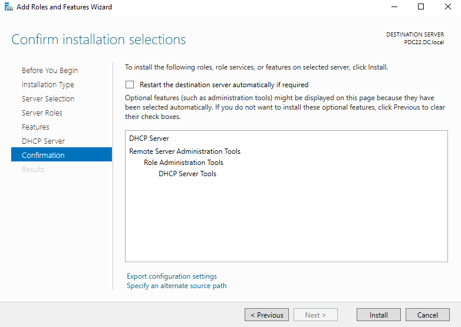

> The wizard confirms installation of **DHCP Server**, **Remote Server Administration Tools**, **Role Administration Tools**, and **DHCP Server Tools** on destination server `PDC22.DC.local`. No restart is required.

---

### Task 2 — Authorize DHCP in Active Directory

After installation, open the **DHCP Post-Install Configuration Wizard**. On the **Authorization** step, select **Use the following user's credentials** and confirm the domain admin account, then click **Commit**.

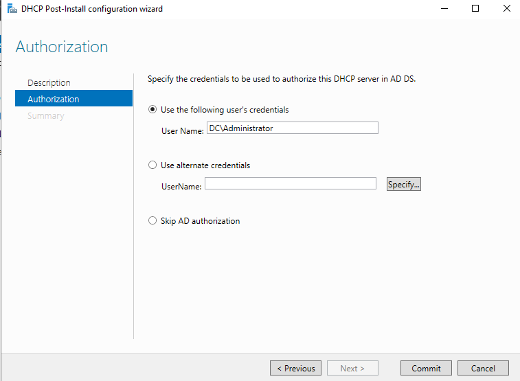

> Authorization uses `DC\Administrator` credentials to register the DHCP server in **AD DS**. This prevents rogue DHCP servers from distributing unauthorized IPs on the domain. Alternatively, alternate credentials or skipping AD authorization can be selected for workgroup environments.

---

### Task 3 — Create a New Scope (IP Address Range)

In **DHCP Manager**, right-click **IPv4 → New Scope**. On the **IP Address Range** step, define the pool:

- **Start IP:** `192.168.1.30`
- **End IP:** `192.168.1.245`
- **Subnet mask:** `255.255.255.0` (/24)

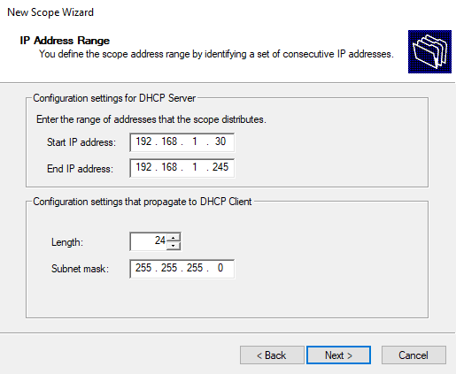

> The scope distributes addresses from `192.168.1.30` to `192.168.1.245` on the `/24` subnet. Addresses below `.30` are reserved for static devices (domain controllers, servers, gateways).

---

### Task 4 — Add Exclusion Range

On the **Add Exclusions and Delay** step, exclude IPs that are statically assigned to devices within the scope range.

- **Excluded range:** `192.168.1.50` to `192.168.1.55`

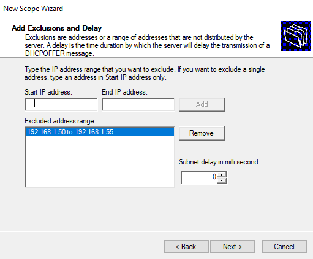

> IPs `192.168.1.50–.55` are excluded from dynamic distribution — reserved for printers or other static devices. The DHCP server will skip these addresses when assigning leases to clients.

---

### Task 5 — Set Lease Duration

On the **Lease Duration** step, set how long a client may hold an assigned IP before renewal is required.

- **Duration:** 8 days, 0 hours, 0 minutes

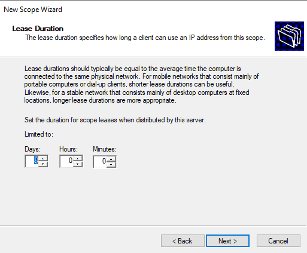

> **8 days** is appropriate for a stable wired network with desktop computers at fixed locations. Use shorter durations (hours) for wireless or high-turnover networks (cafes, guest networks) to reclaim IPs faster.

---

### Task 6 — Configure Default Gateway (Router)

On the **Router (Default Gateway)** step, enter the gateway IP that clients will use to reach external networks.

- **Gateway:** `192.168.1.1`

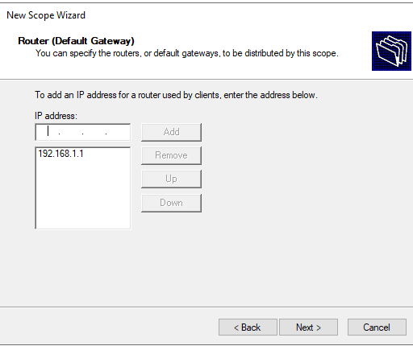

> The gateway `192.168.1.1` is added to the scope and will be distributed to all DHCP clients as their default route. Click **Add** before proceeding to confirm the entry.

---

### Task 7 — Configure DNS Servers and Domain Name

On the **Domain Name and DNS Servers** step, set the domain suffix and DNS server IPs distributed to clients.

- **Parent domain:** `DC.local`
- **DNS Servers:** `192.168.1.2`, `192.168.1.3`

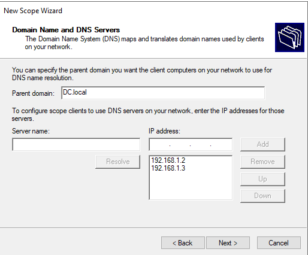

> Clients will use `DC.local` as their DNS suffix for name resolution, and query `192.168.1.2` (primary DC) and `192.168.1.3` (secondary DC) for DNS lookups. This allows domain-joined machines to resolve hostnames within the domain.

---

### Task 8 — Scope Created Successfully

Complete the wizard and activate the scope. The **DHCP Manager** now shows the active scope with all its components.

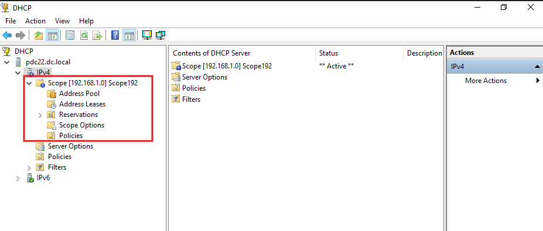

> The scope **[192.168.1.0] Scope192** is listed as `** Active **` under `pdc22.dc.local → IPv4`. The scope tree includes: **Address Pool**, **Address Leases**, **Reservations**, **Scope Options**, and **Policies** — all ready for management.

---

### Task 9 — Verify Client IP Assignment

On the client machine, open a command prompt and run `ipconfig /renew` to request an IP from the DHCP server.

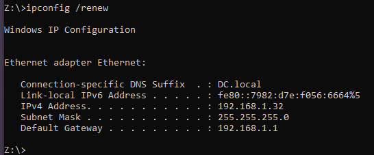

> After renewal, the client receives:
> - **IPv4 Address:** `192.168.1.32`
> - **Subnet Mask:** `255.255.255.0`
> - **Default Gateway:** `192.168.1.1`
> - **DNS Suffix:** `DC.local`
>
> This confirms the DORA process completed successfully and all scope options are being distributed correctly.

---

### Task 10 — Create an IP Reservation

In **DHCP Manager → Scope → Reservations**, right-click → **New Reservation** to bind a fixed IP to a specific device's MAC address.

- **Reservation name:** `Manager IP`
- **IP address:** `192.168.1.100`
- **MAC address:** `08-00-27-43-e7-96`
- **Supported types:** Both (DHCP and BOOTP)

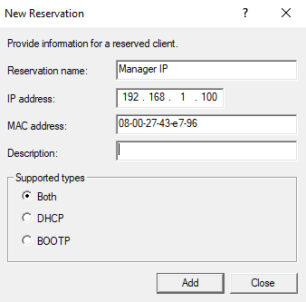

> The reservation ensures the device with MAC `08-00-27-43-E7-96` always receives `192.168.1.100` from DHCP — without configuring a static IP on the device itself. This is ideal for printers, managers' workstations, or any device needing a predictable address.

---

### Task 11 — Verify Reserved IP Assignment

Run `ipconfig /renew` again on the reserved device to confirm it now receives the reserved address.

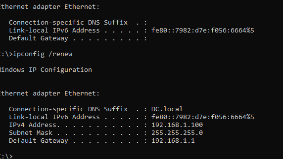

> After renewal, the client now receives **`192.168.1.100`** — the reserved IP — along with subnet mask `255.255.255.0` and gateway `192.168.1.1`. The DNS suffix `DC.local` confirms full scope option delivery.

---

### Task 12 — Configure MAC Allow Filter

In **DHCP Manager → IPv4 → Filters → Allow**, add the MAC address to the Allow list so only whitelisted devices receive IP addresses from this server.

- **Allowed MAC:** `08-00-27-43-E7-96`

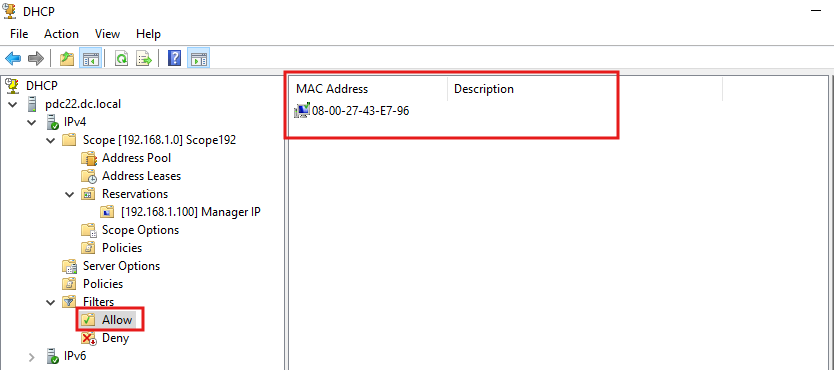

> The MAC address `08-00-27-43-E7-96` appears under the **Allow** filter list. When the Allow filter is enabled, only MAC addresses on this list will receive DHCP leases — all other devices are silently ignored. This is useful for securing controlled network environments.

---

## 🔑 Key Concepts

| Concept | Details |
|---|---|
| **DHCP Role** | Server role installed via Server Manager |
| **AD Authorization** | Required to prevent rogue DHCP servers; uses Domain Admin credentials |
| **Scope** | IP address pool the server distributes (start IP → end IP) |
| **Exclusion Range** | IPs within the scope withheld from dynamic distribution |
| **Lease Duration** | How long a client holds an IP before renewal; 8 days for stable wired networks |
| **Scope Options** | Gateway (003), DNS servers (006), Domain name (015) distributed with every lease |
| **Reservation** | Fixed IP bound to a MAC address — device always gets the same IP |
| **Allow Filter** | Whitelist — only listed MACs receive IP leases |
| **Deny Filter** | Blacklist — listed MACs are blocked from receiving leases |
| **`ipconfig /renew`** | Forces the client to request a new lease from the DHCP server |

---

## 📊 Lab Summary — Scope Configuration

| Setting | Value |
|---|---|
| Scope Name | Scope192 |
| IP Range | 192.168.1.30 – 192.168.1.245 |
| Subnet Mask | 255.255.255.0 (/24) |
| Exclusion Range | 192.168.1.50 – 192.168.1.55 |
| Lease Duration | 8 days |
| Default Gateway | 192.168.1.1 |
| DNS Servers | 192.168.1.2, 192.168.1.3 |
| Domain Name | DC.local |
| Reservation | 192.168.1.100 → 08-00-27-43-E7-96 (Manager IP) |

---

## 🛠️ Requirements

- Windows Server 2016 or later
- Active Directory Domain Services (for authorization)
- A client machine configured to **Obtain IP address automatically**
- Both server and client on the same subnet (`192.168.1.0/24`)
- Administrator privileges

---

## 👨‍💻 Author

> Lab materials prepared for Windows Server administration coursework.  
> DHCP server: `pdc22.dc.local` — April 2026.
