# Windows Server DNS Lab

This repository documents a hands-on lab covering core **DNS Server** administration tasks on **Windows Server** (with an Active Directory–integrated DNS zone), plus client-side DNS configuration and troubleshooting on **Windows 10**.

## Environment

- **Domain Controller / DNS Server:** `PDC22` (domain: `DC.local`)
- **Client:** Windows 10 (`HR-PC01`)
- **AD-integrated primary zone created:** `company.local`
- **Reverse lookup zone:** `1.168.192.in-addr.arpa`

---

## Table of Contents

1. [Task 1 – DNS Management Console / Root Hints](#task-1--dns-management-console--root-hints)
2. [Task 2 – Cache.dns File Inspection](#task-2--cachedns-file-inspection)
3. [Task 3 – Cached Lookups in DNS Manager](#task-3--cached-lookups-in-dns-manager)
4. [Task 4 – Display DNS Client Resolver Cache](#task-4--display-dns-client-resolver-cache)
5. [Task 5 – Configuring a Forwarder](#task-5--configuring-a-forwarder)
6. [Task 6 – Non-Authoritative Answer Test](#task-6--non-authoritative-answer-test)
7. [Task 7 – Creating a New Primary Zone](#task-7--creating-a-new-primary-zone)
8. [Task 8 – Creating A and CNAME Records](#task-8--creating-a-and-cname-records)
9. [Task 9 – Reverse Lookup Zone and PTR Record](#task-9--reverse-lookup-zone-and-ptr-record)
10. [Task 10 – Testing Name Resolution](#task-10--testing-name-resolution)
11. [Task 11 – Client DNS Suffix Configuration](#task-11--client-dns-suffix-configuration)

---

## Task 1 – DNS Management Console / Root Hints

Opened **DNS Manager** on `PDC22` and reviewed the **Root Hints** tab in the server Properties. Root hints list the well-known root name servers (`a.root-servers.net` through the rest of the set) that the DNS server queries when it has no forwarders configured or when forwarders fail to respond.

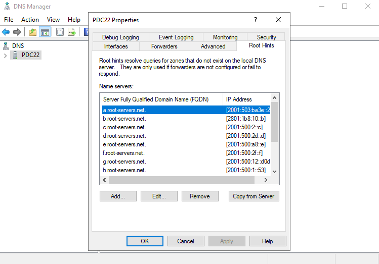

---

## Task 2 – Cache.dns File Inspection

Inspected the local `cache.dns` file (used to seed root hints) in Notepad. The file contains `NS`, `A`, and `AAAA` records for the root DNS servers, mapping each root server name to its IPv4/IPv6 addresses.

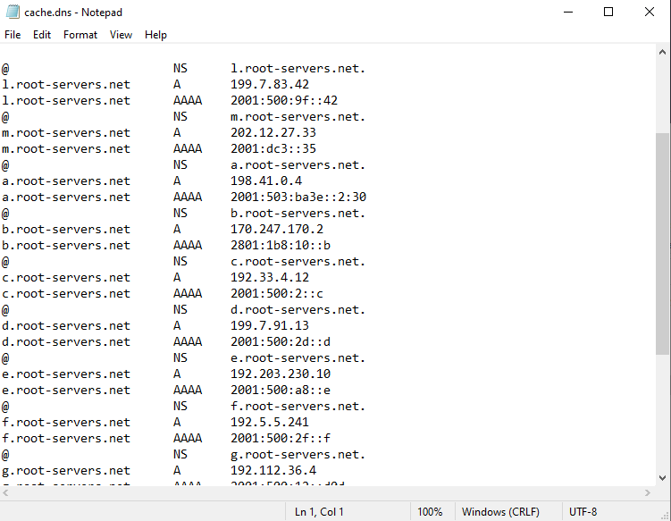

---

## Task 3 – Cached Lookups in DNS Manager

Reviewed the **Cached Lookups** node in DNS Manager, which shows the resolver cache built from recursive queries the server has performed (e.g., root zone delegation records, `NS` records for TLD registries, DNSSEC `DS` records). Demonstrated removing a stale cached **Delegation Signer** record.

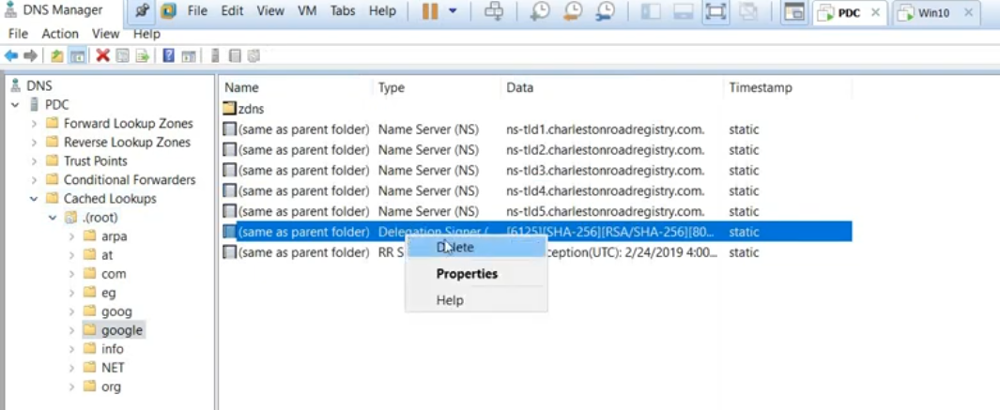

---

## Task 4 – Display DNS Client Resolver Cache

Ran `ipconfig /displaydns` on the client to view the local DNS resolver cache, showing cached `A` records (e.g., `s-0005.dual-s-msedge.net`) and SRV records used for Active Directory site/domain controller discovery (e.g., `_ldap._tcp.default-first-site-name._sites.dc._msdcs.dc.local`).

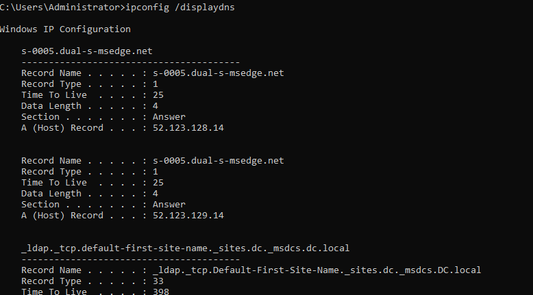

---

## Task 5 – Configuring a Forwarder

Configured DNS **Forwarders** on `PDC22` under Server Properties → Forwarders. Added `192.168.1.1` (resolves to host `MOHAMED`) as a working forwarder, and `8.8.8.8` which shows as unable to resolve in this network context. Forwarders are used before falling back to root hints for queries the server cannot answer authoritatively.

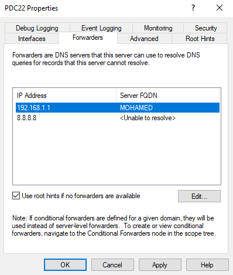

---

## Task 6 – Non-Authoritative Reply Test

Used `nslookup yahoo.com 8.8.8.8` to query the public Google DNS resolver directly. The result returns a **Non-authoritative answer**, confirming that `8.8.8.8` (`dns.google`) is not authoritative for the `yahoo.com` zone but is returning a cached/recursive answer, including both IPv6 and IPv4 addresses.

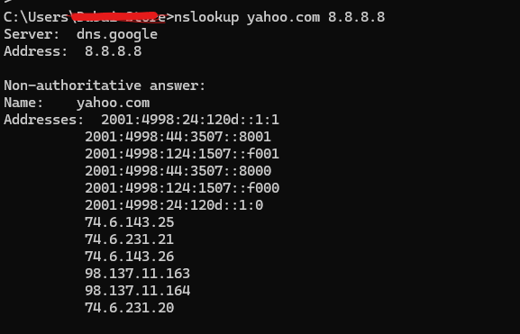

---

## Task 7 – Creating a New Primary Zone

Created a new **Active Directory–integrated primary zone** named `company.local` using the New Zone Wizard in DNS Manager. Steps performed:

1. **Zone Type** – Selected *Primary zone* and enabled *Store the zone in Active Directory*.

   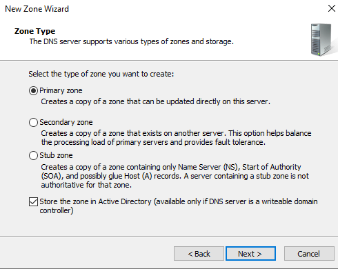

2. **Active Directory Zone Replication Scope** – Selected replication *To all DNS servers running on domain controllers in this domain: DC.local*.

   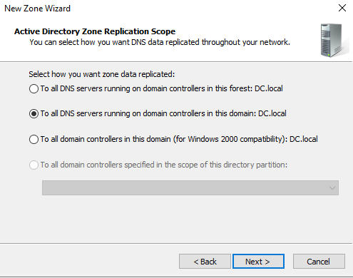

3. **Zone Name** – Entered `company.local` as the new zone name.

   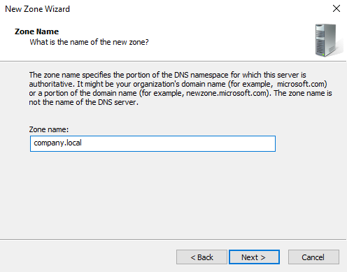

4. **Dynamic Update** – Selected *Allow only secure dynamic updates* (recommended for Active Directory-integrated zones).

   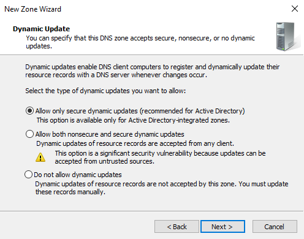

---

## Task 8 – Creating A and CNAME Records

**A (Host) record:** Created a new host record `pc1` in `company.local` pointing to `192.168.1.100`, resulting in the FQDN `pc1.company.local`.

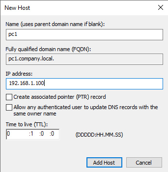

**CNAME (Alias) record:** Created an alias `pc01.company.local` pointing to the target host `HR-PC01.company.local`.

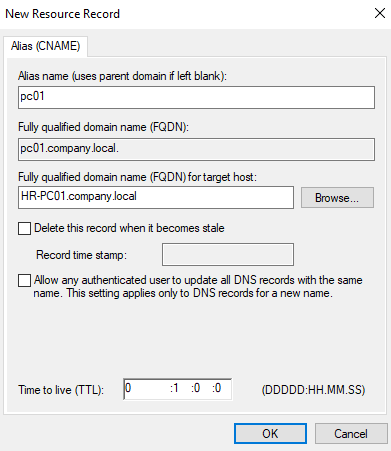

---

## Task 9 – Reverse Lookup Zone and PTR Record

Created the reverse lookup zone `1.168.192.in-addr.arpa` and added a **PTR (Pointer)** record mapping IP address `192.168.1.100` back to the host name `pc1.company.local`, enabling reverse DNS resolution.

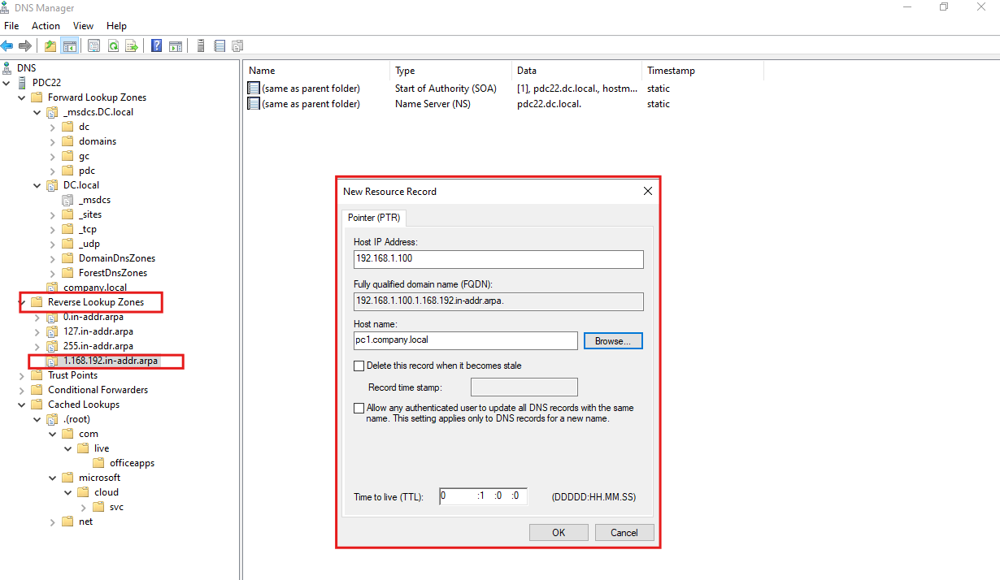

---

## Task 10 – Testing Name Resolution

Verified forward and reverse resolution from the client using `ping`:

- `ping pc1.company.local` → resolved to `192.168.1.100` successfully.
- `ping HR-PC01` → resolved via link-local IPv6 address.
- `ping pdc22` → resolved to `PDC22.DC.local` at `192.168.1.224`.

All tests completed with 0% packet loss, confirming DNS records created in earlier tasks resolve correctly.

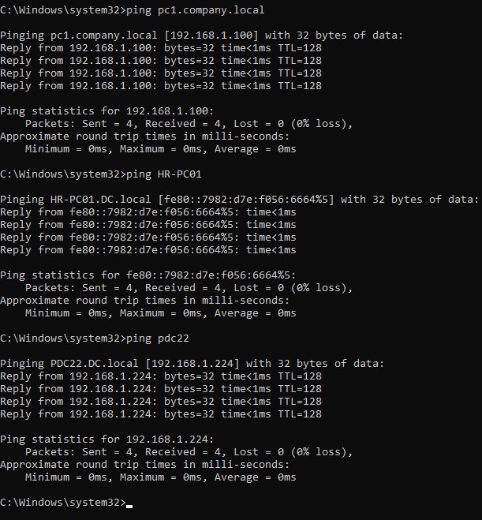

---

## Task 11 – Client DNS Suffix Configuration

Configured the client's **Advanced TCP/IP Settings → DNS** tab to use DNS server `192.168.1.224` and set custom **DNS suffixes** (`dc.local` and `company.local`) to be appended in order when resolving unqualified host names, allowing short names to resolve across both domain zones.

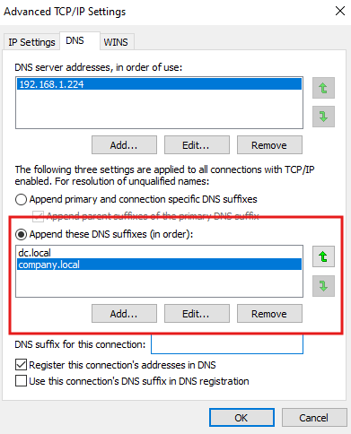

---

## Summary

This lab covered the full lifecycle of Windows DNS administration:

- Understanding root hints and the `cache.dns` seed file
- Inspecting and clearing server-side and client-side DNS caches
- Configuring forwarders and observing authoritative vs. non-authoritative responses
- Creating an AD-integrated primary forward lookup zone with secure dynamic updates
- Adding A, CNAME, and PTR resource records
- Creating a reverse lookup zone for PTR resolution
- Validating end-to-end name resolution with `ping` and `nslookup`
- Configuring client-side DNS suffix search order for multi-domain name resolution
