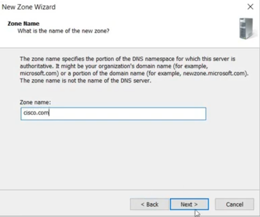
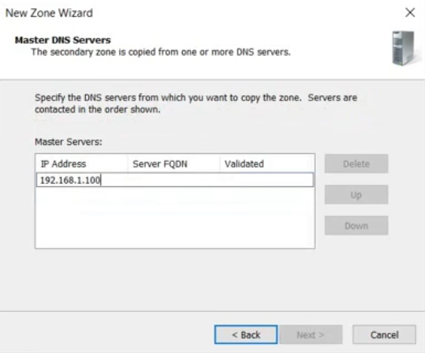
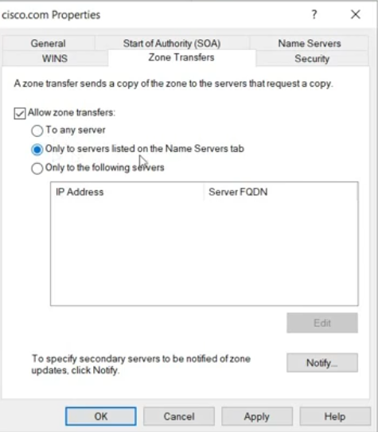
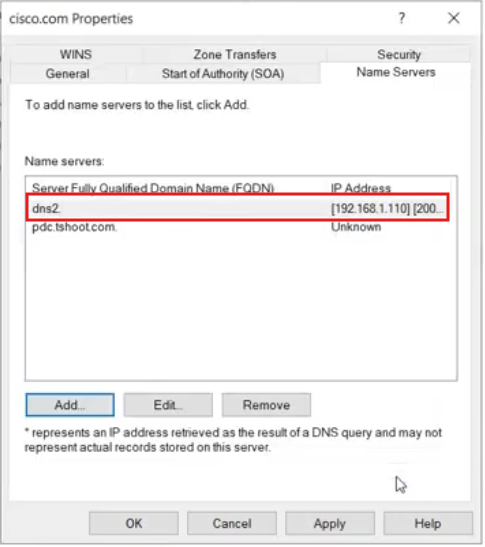
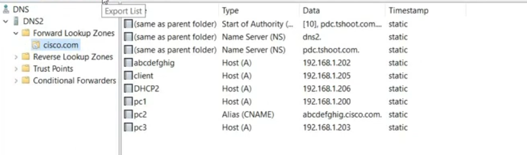
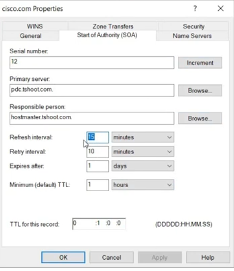
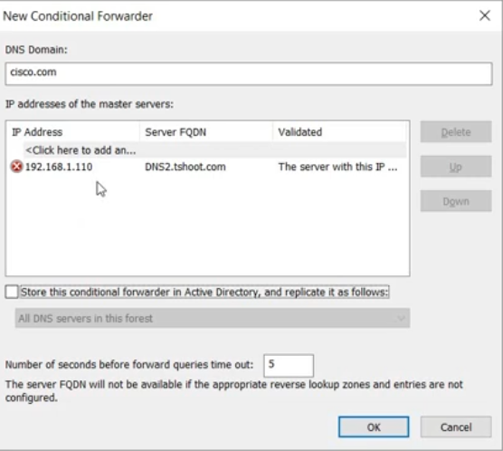

# 🌐 DNS Lab 2 — Secondary DNS, Zone Transfers & Conditional Forwarding

> **Comprehensive step-by-step lab guide covering secondary DNS zones, zone transfers, SOA records, and conditional forwarders on Windows Server.**

---

## 📋 Table of Contents

| # | Task | Category |
|---|------|----------|
| [12](#-task-12--create-a-secondary-dns-zone) | Create a Secondary DNS Zone | Zone Creation |
| [13](#-task-13--configure-zone-transfers--name-servers) | Configure Zone Transfers & Name Servers | Zone Transfer |
| [14](#-task-14--verify-zone-transfer--transferred-records) | Verify Zone Transfer & Transferred Records | Verification |
| [15](#-task-15--inspect-the-soa-record) | Inspect the SOA Record | Zone Properties |
| [16](#-task-16--configure-a-conditional-forwarder) | Configure a Conditional Forwarder | Forwarding |

---

## 🖥️ Lab Environment

| Component | Value |
|-----------|-------|
| **Primary DNS Server** | PDC / `pdc.tshoot.com` |
| **Secondary DNS Server** | DNS2 / `dns2.tshoot.com` |
| **Primary DNS Server IP** | `192.168.1.100` |
| **Secondary DNS Server IP** | `192.168.1.110` |
| **Zone being transferred** | `cisco.com` |
| **SOA Primary Server** | `pdc.tshoot.com` |
| **SOA Responsible Person** | `hostmaster.tshoot.com` |
| **Conditional Forwarder Domain** | `cisco.com` → `192.168.1.110` (DNS2.tshoot.com) |

---

## ✅ Task 12 — Create a Secondary DNS Zone

### 📖 Explanation

A **Secondary DNS zone** is a **read-only copy** of a primary zone that lives on a separate DNS server. It is populated by a **zone transfer** from the primary (master) server. Secondary zones provide:

- 🔄 **Fault tolerance** — if the primary DNS server goes down, the secondary can still answer queries
- ⚡ **Load balancing** — DNS queries can be distributed across multiple servers
- 🌍 **Geographic distribution** — place secondary servers closer to clients in remote offices

Unlike a primary zone, a secondary zone **cannot be edited directly** — all changes must be made on the primary and then replicated via zone transfer.

The wizard has **3 screens** for creating a secondary zone:

| Screen | Setting | Value |
|--------|---------|-------|
| Zone Type | Type of zone | **Secondary zone** |
| Zone Name | Name of the zone | `cisco.com` |
| Master DNS Servers | IP of primary server | `192.168.1.100` |

> **Key concept:** The secondary zone gets its data from the **Master DNS Server** — the primary that holds the authoritative copy. The secondary server must be authorised to receive zone transfers.

### 🔧 Steps

1. On the **secondary DNS server (DNS2)**, open **DNS Manager** (`dnsmgmt.msc`).
2. Right-click **Forward Lookup Zones** → **New Zone**.
3. Click **Next** on the welcome screen.

**Screen 1 — Zone Type:**

4. Select **Secondary zone**.
5. Note that "Store the zone in Active Directory" is **greyed out** — secondary zones cannot be AD-integrated.
6. Click **Next**.

**Screen 2 — Zone Name:**

7. Enter `cisco.com` as the zone name.
8. Click **Next**.

**Screen 3 — Master DNS Servers:**

9. In the **IP Address** field, type `192.168.1.100` (the primary DNS server).
10. Press **Enter** — the server FQDN and validation status will populate.
11. Click **Next** → **Finish**.

> **Note:** The zone transfer will fail at this point until zone transfers are **authorized on the primary server** (done in Task 13).

### 📸 Screenshots

**Step 1 — Select Secondary Zone Type:**



**Step 2 — Enter Zone Name (`cisco.com`):**



---

## ✅ Task 13 — Configure Zone Transfers & Name Servers

### 📖 Explanation

By default, Windows DNS **does not allow zone transfers** to arbitrary servers — this is a security measure to prevent DNS zone data from being exposed. Before the secondary server can receive a copy of the zone, you must:

1. **Add the secondary server to the Name Servers list** — this registers DNS2 as an official name server for the zone
2. **Authorise zone transfers** — configure which servers are allowed to receive copies of the zone

**Zone Transfer Tab options:**

| Option | Description |
|--------|-------------|
| To any server | ⚠️ Insecure — any server can request a copy |
| Only to servers listed on the Name Servers tab | ✅ Recommended — transfers only to registered NS servers |
| Only to the following servers | Manual list of allowed IPs |

**Name Servers Tab:**
The Name Servers tab lists which servers are authoritative for the zone. `dns2` with IP `[192.168.1.110]` is the secondary server being added. `pdc.tshoot.com` is the primary (Unknown IP shown because reverse DNS is not configured).

> **Key concept:** The Name Servers tab controls NS records published in the zone. The Zone Transfers tab controls which servers can **pull** a copy. They work together — using "Only to servers listed on Name Servers tab" ties both together automatically.

### 🔧 Steps

**On the Primary DNS Server (PDC / `pdc.tshoot.com`):**

**Part A — Add Secondary Server to Name Servers:**

1. In DNS Manager, expand **Forward Lookup Zones** → right-click `cisco.com` → **Properties**.
2. Click the **Name Servers** tab.
3. Click **Add**.
4. Enter the FQDN of the secondary server: `dns2.tshoot.com`
5. Enter its IP address: `192.168.1.110`
6. Click **OK** to add it to the Name Servers list.

**Part B — Allow Zone Transfers:**

7. Click the **Zone Transfers** tab.
8. Check **Allow zone transfers**.
9. Select **Only to servers listed on the Name Servers tab**.
10. Click **Apply** → **OK**.

**Part C — Notify Secondary (Optional but Recommended):**

11. Click **Notify...** to configure push notifications when the primary zone changes.
12. Add `192.168.1.110` to notify the secondary server immediately after updates.

### 📸 Screenshots

**Zone Transfers Tab — Authorising Transfers:**



---

## ✅ Task 14 — Verify Zone Transfer & Transferred Records

### 📖 Explanation

After authorising zone transfers on the primary, the secondary DNS server should **automatically pull a copy** of the `cisco.com` zone. You can verify the transfer was successful by checking the records on the secondary server.

The screenshot shows DNS Manager on **DNS2** with the `cisco.com` zone successfully populated with all records transferred from the primary:

| Record Name | Type | Data |
|-------------|------|------|
| (same as parent folder) | Start of Authority (SOA) | `[10], pdc.tshoot.com....` |
| (same as parent folder) | Name Server (NS) | `dns2.` |
| (same as parent folder) | Name Server (NS) | `pdc.tshoot.com.` |
| `abcdefghig` | Host (A) | `192.168.1.202` |
| `client` | Host (A) | `192.168.1.205` |
| `DHCP2` | Host (A) | `192.168.1.206` |
| `pc1` | Host (A) | `192.168.1.200` |
| `pc2` | Alias (CNAME) | `abcdefghig.cisco.com.` |
| `pc3` | Host (A) | `192.168.1.203` |

All records show **static** timestamp — confirming they were transferred (not dynamically registered). The presence of SOA and NS records proves the transfer was complete and authoritative data was received.

> **Key concept:** A successful zone transfer means the secondary is now **authoritative** for the zone and can answer DNS queries for `cisco.com` independently — even if the primary goes offline.

### 🔧 Steps

**Force a Zone Transfer (if not automatic):**

1. On the **secondary DNS server (DNS2)**, open DNS Manager.
2. Right-click the `cisco.com` zone → **Transfer from Master**.
3. Wait a few seconds, then press **F5** to refresh.

**Verify the Transfer:**

4. Click on the `cisco.com` zone in DNS2's DNS Manager.
5. Confirm all records from the primary are present (A, CNAME, NS, SOA).
6. All timestamps should show **static** (transferred records are not dynamic).
7. To force a refresh: right-click the zone → **Reload from Master**.

**Troubleshoot if Transfer Fails:**

- Verify the primary has zone transfers enabled (Task 13)
- Check Windows Firewall allows **TCP port 53** (zone transfers use TCP, not UDP)
- Confirm the secondary's IP is in the Name Servers list on the primary
- Check DNS event log: **Event Viewer** → Applications and Services Logs → DNS Server

### 📸 Screenshot



---

## ✅ Task 15 — Inspect the SOA Record

### 📖 Explanation

The **SOA (Start of Authority) record** is the most important record in any DNS zone. It defines:

- Which server is the **authoritative primary** for the zone
- **Timing parameters** that control how secondary servers synchronise with the primary
- A **serial number** used to detect zone changes

The screenshot shows the SOA record for `cisco.com` on DNS2:

| Field | Value | Meaning |
|-------|-------|---------|
| **Serial number** | `12` | Zone version — secondary compares this to detect changes |
| **Primary server** | `pdc.tshoot.com.` | The authoritative primary DNS server |
| **Responsible person** | `hostmaster.tshoot.com.` | Email of the DNS admin (`.` replaces `@`) |
| **Refresh interval** | `15 minutes` | How often secondary checks for zone updates |
| **Retry interval** | `10 minutes` | How long to wait before retrying a failed refresh |
| **Expires after** | `1 day` | How long secondary serves data if primary is unreachable |
| **Minimum (default) TTL** | `1 hour` | Default TTL for records in this zone |

> **Key concept:** When the secondary polls the primary, it compares **serial numbers**. If the primary's serial is higher, the secondary initiates a zone transfer. Always increment the serial number when you modify a zone — otherwise secondary servers won't know to update.

### 🔧 Steps

**View the SOA Record:**

1. In DNS Manager on either server, right-click the `cisco.com` zone → **Properties**.
2. Click the **Start of Authority (SOA)** tab.
3. Review all fields — note the serial number, primary server, and timing values.

**Modify SOA Parameters (on Primary only):**

4. On the **primary server**, adjust the **Refresh interval** — `15 minutes` means the secondary checks every 15 minutes for changes.
5. Adjust the **Retry interval** — `10 minutes` is how long to wait if the primary doesn't respond.
6. Adjust **Expires after** — `1 day` means secondary stops answering after 1 day with no contact.
7. Click **Increment** to manually increase the serial number if you've made manual zone changes.
8. Click **Apply** → **OK**.

**Via Command Line:**
```
dnscmd /zoneinfo cisco.com
nslookup -type=SOA cisco.com
```

### 📸 Screenshot




---

## ✅ Task 16 — Configure a Conditional Forwarder

### 📖 Explanation

A **Conditional Forwarder** is a DNS server setting that forwards queries for a **specific DNS domain** to a designated DNS server, instead of using general forwarders or root hints.

**Conditional vs. Regular Forwarder:**

| Type | Applies To | Use Case |
|------|-----------|----------|
| **Regular Forwarder** | All unresolved queries | General internet resolution |
| **Conditional Forwarder** | A specific domain only | Partner networks, split-brain DNS, internal zones |

The screenshot shows a conditional forwarder configured for `cisco.com`:
- **DNS Domain**: `cisco.com`
- **Master Server IP**: `192.168.1.110`
- **Server FQDN**: `DNS2.tshoot.com`
- The red ❌ icon indicates the server FQDN could not be verified (reverse DNS not configured) — this is cosmetic and does not prevent the forwarder from working

**How it works:**
When any DNS server with this conditional forwarder receives a query for `*.cisco.com`, it forwards it **directly to `192.168.1.110`** rather than going through the normal resolution chain. This is ideal for:
- Resolving an internal `cisco.com` zone hosted on a specific internal server
- Routing partner-domain queries to their DNS server without exposing them to the internet

> **Key concept:** Conditional forwarders take **highest priority** in the DNS resolution order: Conditional Forwarders → Server-Level Forwarders → Root Hints.

### 🔧 Steps

1. In DNS Manager, right-click **Conditional Forwarders** (in the left pane) → **New Conditional Forwarder**.
2. **DNS Domain**: type `cisco.com`
3. In the **IP addresses of the master servers** table, click `<Click here to add an...>`.
4. Type `192.168.1.110` → press **Enter**.
5. Wait for the Server FQDN column to populate (`DNS2.tshoot.com`).
6. Optionally check **"Store this conditional forwarder in Active Directory"** to replicate it to all DCs in the forest/domain.
7. Set **"Number of seconds before forward queries time out"** — default `5` seconds is appropriate.
8. Click **OK**.

**Verify it works:**

9. From any client using this DNS server, run:
   ```
   nslookup pc1.cisco.com
   ```
   It should be forwarded to `192.168.1.110` and return `192.168.1.200`.

### 📸 Screenshot



---

## 📚 Zone Types — Comparison

| Zone Type | Editable | Stored In | Replication | Use Case |
|-----------|----------|-----------|-------------|----------|
| **Primary** | ✅ Yes | File or AD | AD replication (if AD-integrated) | Main authoritative zone |
| **Secondary** | ❌ Read-only | File only | Zone transfer from primary | Redundancy & load balancing |
| **Stub** | ❌ Read-only | File or AD | Zone transfer (NS + SOA + glue only) | Delegation pointer, not full copy |

---

## 🔄 Zone Transfer — How It Works

```
Secondary DNS Server                    Primary DNS Server
      │                                        │
      │──── SOA Query (What's your serial?) ──►│
      │◄─── Serial Number (e.g., 12) ──────────│
      │                                        │
      │  (Serial on secondary = 11, primary = 12, so transfer needed)
      │                                        │
      │──── AXFR Request (Full zone transfer)─►│  ← TCP port 53
      │◄─── All zone records ──────────────────│
      │                                        │
      │  Zone updated on secondary             │
```

**Transfer types:**
- **AXFR** — Full zone transfer (all records)
- **IXFR** — Incremental zone transfer (only changes since last serial)

Windows DNS automatically uses IXFR when possible to reduce bandwidth.

---

## 📌 DNS Resolution Priority Order

When a Windows DNS server receives a query, it checks sources in this order:

```
1. Local zone (Primary or Secondary — authoritative)
      ↓ (not found)
2. Conditional Forwarders (domain-specific forwarding rules)
      ↓ (no match)
3. Server-level Forwarders (general upstream servers)
      ↓ (unavailable or disabled)
4. Root Hints (iterative resolution from root servers)
```

---

## 🛠️ Useful Commands — DNS Lab 2

```powershell
# ── Zone Transfer Commands ────────────────────────────────────
# Force zone transfer on secondary
dnscmd DNS2 /zonerefresh cisco.com

# Check zone transfer status
dnscmd /zoneinfo cisco.com

# PowerShell: trigger zone transfer
Start-DnsServerZoneTransfer -Name "cisco.com" -FullTransfer

# ── SOA / Serial Number ───────────────────────────────────────
# Query SOA record
nslookup -type=SOA cisco.com 192.168.1.100

# PowerShell: get SOA
Get-DnsServerResourceRecord -ZoneName "cisco.com" -RRType Soa

# Increment serial (PowerShell)
$soa = Get-DnsServerResourceRecord -ZoneName "cisco.com" -RRType Soa
$newSoa = $soa.Clone()
$newSoa.RecordData.SerialNumber++
Set-DnsServerResourceRecord -ZoneName "cisco.com" -OldInputObject $soa -NewInputObject $newSoa

# ── Secondary Zone Management ─────────────────────────────────
# List all zones on DNS2
dnscmd DNS2 /enumzones

# Add secondary zone via PowerShell
Add-DnsServerSecondaryZone -Name "cisco.com" -ZoneFile "cisco.com.dns" -MasterServers 192.168.1.100

# ── Conditional Forwarders ────────────────────────────────────
# Add conditional forwarder via PowerShell
Add-DnsServerConditionalForwarderZone -Name "cisco.com" -MasterServers 192.168.1.110

# List all conditional forwarders
Get-DnsServerZone | Where-Object ZoneType -eq "Forwarder"

# ── Troubleshooting ───────────────────────────────────────────
# Test name resolution via specific server
nslookup pc1.cisco.com 192.168.1.110

# Check DNS debug log
dnscmd /info /logfile
```

---

## 🔍 Troubleshooting Guide

| Symptom | Likely Cause | Fix |
|---------|--------------|-----|
| Zone transfer fails | Zone transfers not allowed on primary | Enable zone transfers → Zone Transfers tab |
| Zone transfer fails | Secondary IP not in Name Servers list | Add secondary server to Name Servers tab on primary |
| Zone transfer fails | Firewall blocking TCP 53 | Allow TCP port 53 between primary and secondary |
| Secondary has old records | Serial number not incremented | Click **Increment** on SOA tab of primary after changes |
| Conditional forwarder shows ❌ | Reverse DNS not configured | Normal — forwarder still works; configure PTR records to fix |
| Secondary stops answering | Primary unreachable beyond Expires TTL | Restore primary or extend Expires interval |
| `nslookup` goes to wrong server | Conditional forwarder not applied | Verify forwarder domain name matches exactly (case-insensitive) |
| Records missing after transfer | Zone file permission issue | Check NTFS permissions on `%SystemRoot%\System32\dns\` |

---

## 📌 Key Concepts Summary

> **Secondary Zone** — A read-only copy of a primary zone on a separate server. Provides redundancy and load balancing. Populated via zone transfer. Cannot be edited directly.

> **Zone Transfer** — The mechanism by which a secondary DNS server receives a copy of the zone data from the primary (master) server. Uses TCP port 53. Can be full (AXFR) or incremental (IXFR).

> **SOA Record** — Defines the authoritative primary server for a zone, plus timing parameters (refresh, retry, expire, TTL) that govern zone transfer scheduling. Serial number increments signal that zone data has changed.

> **Name Servers Tab** — Registers which DNS servers are authoritative for a zone (published as NS records). Also used to control which servers are permitted to receive zone transfers when "Only to servers listed on the Name Servers tab" is selected.

> **Zone Transfers Tab** — Controls the zone transfer policy on the primary: allow to any server, only to Name Server list members, or to a specific IP list.

> **Conditional Forwarder** — Routes queries for a specific domain to a designated DNS server. Highest priority in the DNS resolution chain. Ideal for split-brain DNS, partner domains, and internal zones not resolvable via the internet.

---

*Lab environment: Windows Server 2019 | DNS2 = Secondary DNS Server | PDC = Primary DNS Server*
