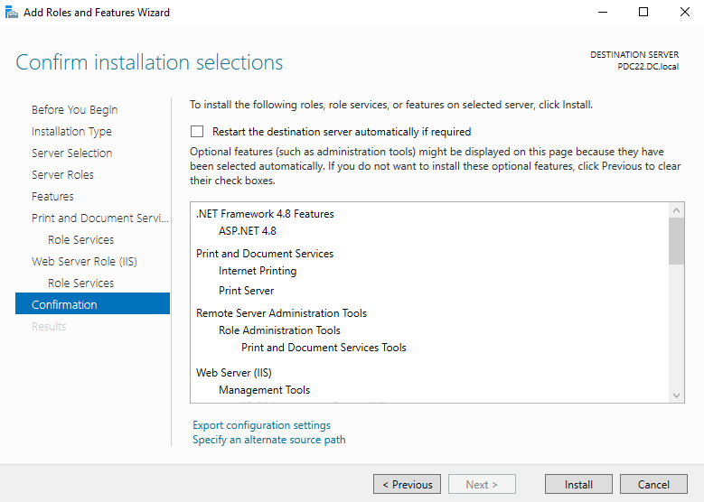
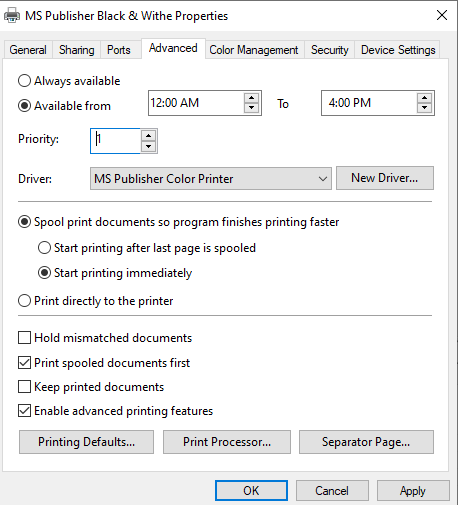
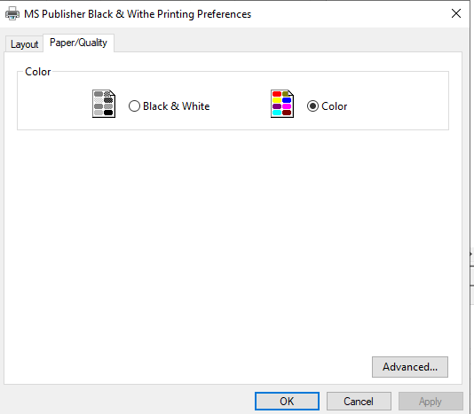
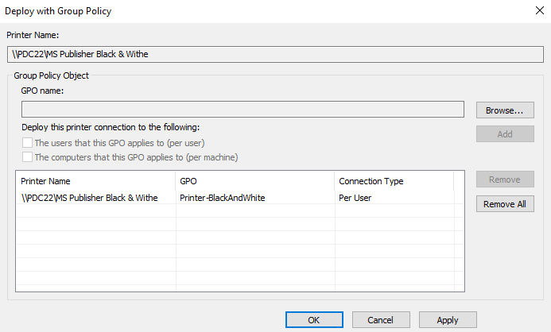
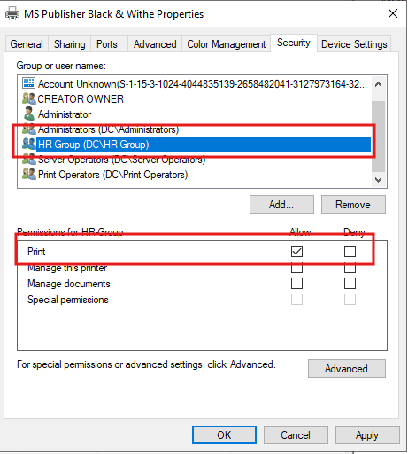
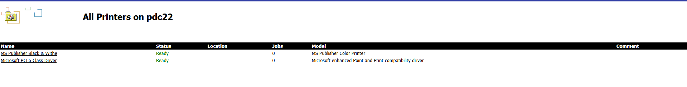

# Lab: Print and Document Services — Deploying and Managing a Network Printer

## Overview

This lab documents how to deploy the **Print and Document Services** role on Windows Server, share a network printer, control its scheduling and driver properties, restrict access by security group, deploy it automatically to users via **Group Policy**, and confirm it appears both on client machines and through the built-in **web-based printer management interface (IIS)**.

**Lab environment:**
- Print server: `PDC22.DC.local`
- Printer: `MS Publisher Black & Withe` (shared network printer, color-capable)
- Restricted access group: `HR-Group`
- GPO used for deployment: `Printer-BlackAndWhite`

**Goal:** Have a centrally managed network printer that's automatically deployed to the correct users via GPO, restricted to an authorized group, and manageable both from the print server console and remotely via a web browser.

---

## Table of Contents

1. [Task 1 – Install the Print and Document Services Role](#task-1--install-the-print-and-document-services-role)
2. [Task 2 – Add and Share a Network Printer](#task-2--add-and-share-a-network-printer)
3. [Task 3 – Configure Advanced Printer Properties](#task-3--configure-advanced-printer-properties)
4. [Task 4 – Configure Default Printing Preferences (Color)](#task-4--configure-default-printing-preferences-color)
5. [Task 5 – Deploy the Printer via Group Policy](#task-5--deploy-the-printer-via-group-policy)
6. [Task 6 – Restrict Printer Access by Security Group](#task-6--restrict-printer-access-by-security-group)
7. [Task 7 – Verify the Printer Appears on the Client](#task-7--verify-the-printer-appears-on-the-client)
8. [Task 8 – Access and Manage Printers via the Web Interface](#task-8--access-and-manage-printers-via-the-web-interface)
9. [Summary / Key Takeaways](#summary--key-takeaways)

---

## Task 1 – Install the Print and Document Services Role

Using **Add Roles and Features**, confirm the following selections before installing on `PDC22.DC.local`:

- **Print and Document Services**
  - Role Services: **Internet Printing**, **Print Server**
- **Web Server Role (IIS)** *(installed automatically as a dependency of Internet Printing)*
- **Remote Server Administration Tools → Role Administration Tools → Print and Document Services Tools**

**Why:** The **Print Server** role service provides the core management console and shared print queue functionality, while **Internet Printing** (which pulls in **IIS** as a dependency) is specifically what enables the web-based printer management page used later in Task 8 — without it, there would be no browser-accessible printer interface.

---

## Task 2 – Add and Share a Network Printer

Using the **Network Printer Installation Wizard**, configure:

- **Printer Name:** `MS Publisher Black & Withe`
- ☑ **Share this printer**
- **Share Name:** `MS Publisher Black & Withe`

**Why:** Sharing the printer at creation time is what makes it visible and connectable to other machines on the network (via `\\PDC22\MS Publisher Black & Withe`), rather than the printer only being usable locally from the print server itself.

---

## Task 3 – Configure Advanced Printer Properties

On the printer's **Properties → Advanced** tab:

- ● **Available from** `12:00 AM` **to** `4:00 PM`
- **Priority:** `1`
- **Driver:** `MS Publisher Color Printer`
- ● **Spool print documents so program finishes printing faster** → **Start printing immediately**
- ☑ **Print spooled documents first**
- ☑ **Enable advanced printing features**

**Why:** Restricting **availability hours** (here, midnight to 4 PM) is a common way to control when a shared printer accepts jobs — useful for scheduling maintenance windows or limiting after-hours use. **Spooling with "Start printing immediately"** lets the print server begin sending data to the printer as soon as the first pages are spooled, rather than waiting for the entire document to finish spooling first — reducing the user's perceived wait time for large jobs.

---

## Task 4 – Configure Default Printing Preferences (Color)

Under **Printing Preferences → Paper/Quality**:

- **Color:** ● **Color** *(rather than Black & White)*

**Why:** Despite the printer's friendly name ("Black & Withe"), its actual configured driver default is set to **Color** — this setting controls what mode jobs print in **by default** when a user doesn't explicitly override it in their print dialog, so it's worth double-checking this matches the intended default behavior for the deployed printer (a naming/configuration mismatch worth flagging to whoever manages this printer in the live environment).

---

## Task 5 – Deploy the Printer via Group Policy

Using **Print Management → Deploy with Group Policy**:

- **Printer Name:** `\\PDC22\MS Publisher Black & Withe`
- **GPO name:** `Printer-BlackAndWhite`
- **Deploy this printer connection to:** ☑ **The users that this GPO applies to (per user)**

Resulting deployment entry:
| Printer Name | GPO | Connection Type |
|---|---|---|
| `\\PDC22\MS Publisher Black & Withe` | Printer-BlackAndWhite | Per User |

**Why:** Deploying **per user** (rather than per computer) means the printer connection follows the **user account** regardless of which domain-joined PC they log into — appropriate when specific people/roles need this printer, rather than every computer in a particular location needing it automatically.

---

## Task 6 – Restrict Printer Access by Security Group

On the printer's **Properties → Security** tab, review permissions for `HR-Group (DC\HR-Group)`:

| Group or user name | Print | Manage this printer | Manage documents |
|---|---|---|---|
| Administrators | — | — | — |
| **HR-Group (DC\HR-Group)** | ✅ Allow | ☐ | ☐ |
| Server Operators | — | — | — |
| Print Operators | — | — | — |

**Why:** By default, the built-in **Everyone**/**Authenticated Users** group typically has Print permission on a newly shared printer. Explicitly granting **Print** permission to `HR-Group` (and, implicitly, restricting broader access) ensures only the intended department/team can send jobs to this printer — combined with the per-user GPO deployment in Task 5, this creates a clean, group-based rollout: only HR-Group members receive the printer connection *and* are authorized to actually print to it.

---

## Task 7 – Verify the Printer Appears on the Client

On a domain-joined client machine (after GPO refresh / user logon), the deployed printer appears under **Devices and Printers**:

- `Microsoft PCL6 Class Driver on pdc22`
- `MS Publisher Black & Withe on pdc22`

**Why:** This confirms the GPO deployment from Task 5 successfully pushed the printer connection down to the client for an affected user — no manual `\\PDC22\...` browsing or manual driver installation was needed on the client's end.

---

## Task 8 – Access and Manage Printers via the Web Interface

Since **Internet Printing** (Task 1) installed the IIS-based printer web interface, browsing to the print server exposes a live status page — **All Printers on pdc22**:

| Name | Status | Jobs | Model |
|---|---|---|---|
| MS Publisher Black & Withe | Ready | 0 | MS Publisher Color Printer |
| Microsoft PCL6 Class Driver | Ready | 0 | Microsoft enhanced Point and Print compatibility driver |

**Why:** This browser-based interface (enabled by the **Internet Printing** role service) lets administrators (or even authorized end users) check printer status, queued job counts, and basic printer details **remotely, without needing to RDP into the print server or use the Print Management console** — useful for quick status checks or lightweight remote troubleshooting.

---

## Summary / Key Takeaways

| Step | Purpose |
|---|---|
| Install Print and Document Services (+ Internet Printing) | Provides print server functionality and the web-based printer management interface |
| Add & share the network printer | Makes the printer connectable by other machines over the network |
| Advanced properties (availability, priority, spooling) | Controls when the printer accepts jobs and how spooling affects perceived print speed |
| Printing preferences (color default) | Sets the default output mode for jobs that don't explicitly choose |
| Deploy via GPO (per user) | Automatically pushes the printer connection to the right people without manual client setup |
| Security tab — restrict to HR-Group | Ensures only the intended group can actually print, complementing the GPO-based rollout |
| Verify on client | Confirms GPO deployment worked end-to-end |
| Web interface (Internet Printing) | Enables remote, browser-based status checks without full print console/RDP access |

**Key takeaway:** A production-ready shared printer deployment isn't just "share the printer" — it combines **driver/queue configuration** (advanced properties, default preferences), **access control** (Security tab permissions matched to a specific group), and **automated rollout** (GPO per-user deployment) so the right people get the right printer with the right settings, with no manual setup required on any client machine.
