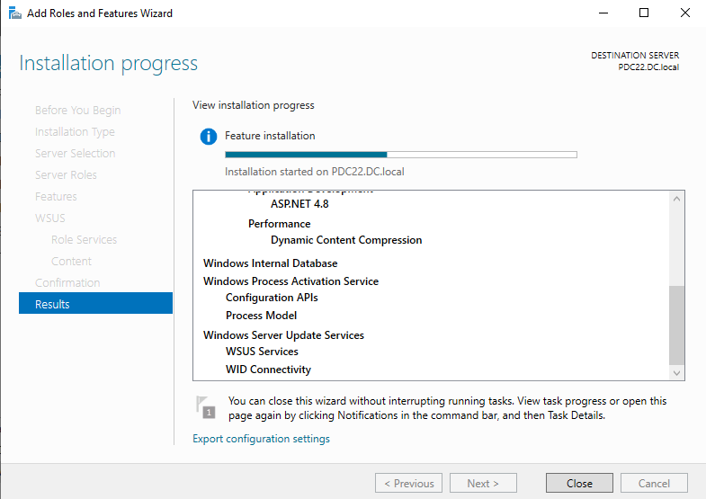
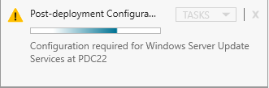
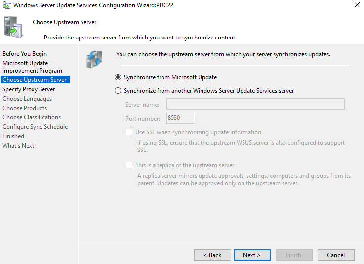
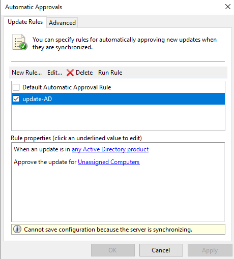
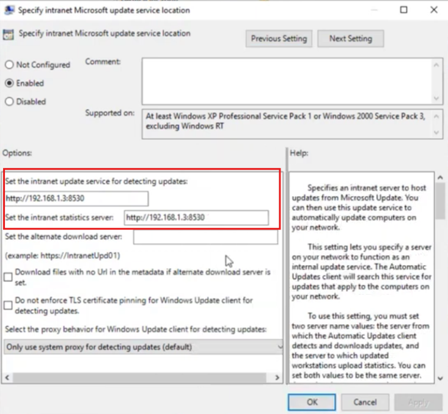
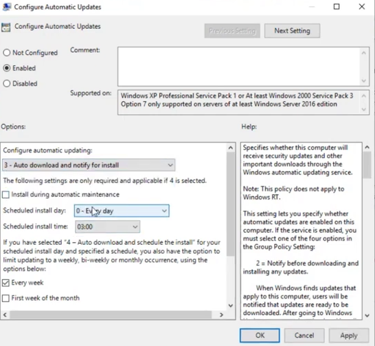
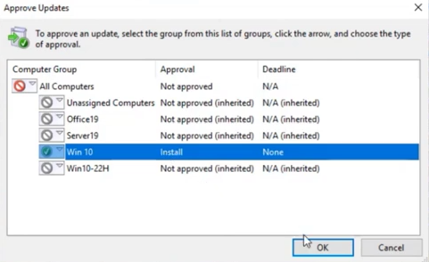

# 🔄 Lab: Windows Server Update Services (WSUS)

**Topic:** WSUS — Installation, Configuration, GPO Deployment & Update Approval  
**Platform:** Windows Server 2016 / 2019 (`PDC22.DC.local`)  
**Difficulty:** Intermediate

---

## 🎯 Objectives

- Install the Windows Server Update Services (WSUS) role
- Run the post-deployment configuration wizard
- Configure upstream server and automatic synchronization schedule
- Create an automatic approval rule for Active Directory updates
- Point domain clients to the internal WSUS server via GPO
- Configure automatic update behavior via GPO
- Manually approve updates for a specific computer group

---

## 📋 Tasks

### Task 1 — Install the WSUS Role

Open **Server Manager → Add Roles and Features Wizard**. Select **Windows Server Update Services** and proceed through the wizard. Monitor the **Installation Progress** page until complete.

> The installation deploys the following components on `PDC22.DC.local`:
> - **Windows Server Update Services** → WSUS Services + WID Connectivity
> - **Windows Internal Database (WID)** — local database storing update metadata and approvals
> - **Windows Process Activation Service** → Configuration APIs + Process Model
> - **ASP.NET 4.8** and **Dynamic Content Compression** (required for the WSUS web interface)
>
> The wizard can be closed without interrupting the installation — progress continues in the background and can be monitored via the Notifications bell in Server Manager.

---

### Task 2 — Launch Post-Deployment Configuration

After installation completes, a yellow notification banner appears in Server Manager prompting post-deployment configuration.

> Click **Tasks → Launch Post-Installation tasks** (or click the notification link).  
> This runs the WSUS content store initialization and starts the **WSUS Configuration Wizard** (`PDC22`).  
> Do not skip this step — without it, WSUS will not synchronize updates or accept client connections.

---

### Task 3 — Configure Upstream Server & Sync Schedule

The WSUS Configuration Wizard walks through several steps. Two key steps are shown:

#### Step 3a — Choose Upstream Server

> Select **Synchronize from Microsoft Update** to pull updates directly from Microsoft's public update servers.  
> Alternatively, select **Synchronize from another WSUS server** (port `8530`) to build a WSUS hierarchy — useful in large enterprise environments where a parent WSUS server downloads updates and child servers distribute them locally.

#### Step 3b — Configure Sync Schedule

> - **Synchronize automatically** is selected
> - **First synchronization:** `10:53:08 PM`
> - **Synchronizations per day:** `1`
>
> Automatic daily synchronization ensures the WSUS server always has the latest updates from Microsoft. The actual sync time has a random offset of up to 30 minutes to distribute load across Microsoft's servers.  
> **Synchronize manually** is useful for controlled environments where admins review updates before downloading.

---

### Task 4 — Create an Automatic Approval Rule

In **WSUS Console → Options → Automatic Approvals**, create a rule to auto-approve specific update categories for target computer groups.

> A custom rule named **update-AD** is created and enabled (checkbox ✅):
> - **Condition:** When an update is in **any Active Directory product**
> - **Action:** Approve the update for **Unassigned Computers**
>
> Steps to create:
> 1. Open **WSUS Console → Options → Automatic Approvals**
> 2. Click **New Rule**
> 3. Check **When an update is in a specific product** → select **Active Directory**
> 4. Check **Approve the update for a group of computers** → select **Unassigned Computers**
> 5. Name the rule: `update-AD` → click **OK**
> 6. Check the rule checkbox to enable it → click **Apply**
>
> Note: The banner `Cannot save configuration because the server is synchronizing` is normal during an active sync — apply the rule once sync completes.

---

### Task 5 — Point Clients to WSUS Server via GPO

**GPO path:** `Computer Configuration → Policies → Administrative Templates → Windows Components → Windows Update`

Setting: **Specify intranet Microsoft update service location**

> 1. Open **Group Policy Management** → create or edit a GPO (e.g., `WSUS-Policy`) → link to domain root or target OU
> 2. Navigate to the GPO path above → double-click **Specify intranet Microsoft update service location**
> 3. Set to **Enabled** and configure both fields:
>    - **Set the intranet update service for detecting updates:** `http://192.168.1.3:8530`
>    - **Set the intranet statistics server:** `http://192.168.1.3:8530`
> 4. Click **OK**
>
> Both fields should point to the same WSUS server address. Port `8530` is the default HTTP port for WSUS. Use port `8531` for HTTPS.  
> After `gpupdate /force` on clients, Windows Update will contact the WSUS server instead of Microsoft Update directly.

---

### Task 6 — Configure Automatic Update Behavior via GPO

**GPO path:** `Computer Configuration → Policies → Administrative Templates → Windows Components → Windows Update`

Setting: **Configure Automatic Updates**

> Set to **Enabled** with the following options:
>
> | Setting | Value |
> |---|---|
> | Configure automatic updating | `3 – Auto download and notify for install` |
> | Scheduled install day | `0 – Every day` |
> | Scheduled install time | `03:00` |
> | Every week | ✅ checked |
>
> **Option 3** downloads updates automatically but notifies the user before installing — giving users or admins final control over installation timing.  
> Other available options:
> - `2` — Notify before downloading and installing
> - `4` — Auto download and schedule the install (fully automatic, no user prompt)
> - `5` — Allow local admin to choose settings

---

### Task 7 — Manually Approve Updates for a Computer Group

In **WSUS Console → Updates**, right-click an update → **Approve** to manually control which computer groups receive a specific update.

> The **Approve Updates** dialog lists all configured computer groups:
>
> | Computer Group | Approval | Deadline |
> |---|---|---|
> | All Computers | Not approved | N/A |
> | Unassigned Computers | Not approved (inherited) | N/A |
> | Office19 | Not approved (inherited) | N/A |
> | Server19 | Not approved (inherited) | N/A |
> | **Win 10** | **Install** | **None** |
> | Win10-22H | Not approved (inherited) | N/A |
>
> The update is approved for **Win 10** group only with action **Install**. Clients in this group will receive and install the update at their next WSUS check-in.  
>
> To approve:
> 1. Right-click the target computer group → **Approved for Install**
> 2. Optionally set a **Deadline** to force installation by a specific date/time
> 3. Click **OK**

---

## 🔑 Key Concepts

| Concept | Description |
|---|---|
| **WSUS** | Windows Server Update Services — centralized update management for domain machines |
| **WID** | Windows Internal Database — lightweight SQL database used by WSUS to store metadata |
| **Upstream Server** | The source WSUS pulls updates from — Microsoft Update or another WSUS server |
| **Synchronization** | Process of downloading update metadata (and optionally content) from upstream |
| **Computer Groups** | Logical groupings in WSUS for targeting update approvals (e.g., Win 10, Server19) |
| **Automatic Approval** | Rules that approve updates automatically when they match defined conditions |
| **Manual Approval** | Admin explicitly approves an update for one or more computer groups |
| **GPO — WSUS location** | Redirects Windows Update client to the internal WSUS server (port 8530/8531) |
| **GPO — Auto Updates** | Controls how/when clients download and install approved updates |
| **Port 8530** | Default HTTP port for WSUS client-server communication |
| **Port 8531** | Default HTTPS port for WSUS (SSL) |

---

## ⚠️ Important Notes

- Always complete **post-deployment configuration** after WSUS installation — skipping it leaves the service non-functional.
- The WSUS server must be able to reach `windowsupdate.microsoft.com` outbound on port **443** to sync from Microsoft Update.
- **Computer groups** must be created in WSUS before approving updates — clients self-register under **Unassigned Computers** until moved.
- Set client DNS to point to the domain controller so GPO policies are received correctly.
- After applying the WSUS GPO, run `gpupdate /force` then `wuauclt /detectnow` on clients to force immediate WSUS registration.
- For WSUS in a hierarchy (parent → child), set the child server to **Synchronize from another WSUS server** and point it to the parent's IP and port `8530`.

---

## 📊 Lab Configuration Summary

| Setting | Value |
|---|---|
| WSUS Server | PDC22.DC.local |
| WSUS Port | 8530 (HTTP) |
| WSUS URL (clients) | `http://192.168.1.3:8530` |
| Upstream source | Microsoft Update |
| Sync schedule | Daily — 10:53 PM (auto) |
| Auto-approval rule | Active Directory products → Unassigned Computers |
| GPO — Update location | `http://192.168.1.3:8530` |
| GPO — Auto update mode | Option 3 — Auto download, notify for install |
| Scheduled install time | 03:00 AM every day |
| Manual approval | Win 10 group → Install |

---

## 🛠️ Requirements

- Windows Server 2016 or later
- **Windows Server Update Services** role with WID Connectivity
- Internet access from the server (port 443 outbound to Microsoft)
- Active Directory Domain Services (for GPO deployment to clients)
- Domain-joined client machines
- Administrator privileges

---

## 👨‍💻 Author

> Lab materials prepared for Windows Server administration coursework.  
> WSUS server: `PDC22.DC.local` — April 2026.
