# 🚀 Lab: Windows Deployment Services (WDS)

**Topic:** WDS — Network OS Deployment via PXE Boot  
**Platform:** Windows Server 2016 / 2019 (`PDC22.DC.local`)  
**Difficulty:** Intermediate–Advanced

---

## 🎯 Objectives

- Install the Windows Deployment Services (WDS) role
- Mount a Windows Server ISO to make installation media available
- Configure WDS with Active Directory integration and Proxy DHCP settings
- Set PXE response policy for client machines
- Start the WDS service and add boot and install images
- Configure DHCP scope options for PXE booting
- Set WDS boot policies per client type
- Verify successful PXE boot on a client machine

---

## 📋 Tasks

### Task 1 — Install the WDS Role

Open **Server Manager → Add Roles and Features Wizard**. Select **Windows Deployment Services** and complete the wizard. Monitor the **Installation Progress** page.

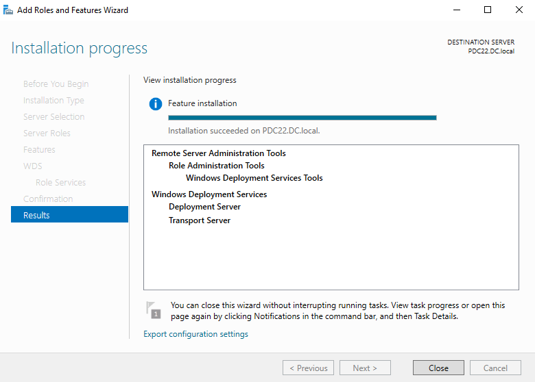

> Installation succeeded on `PDC22.DC.local`. The following components are deployed:
> - **Windows Deployment Services** → Deployment Server + Transport Server
> - **Remote Server Administration Tools** → Role Administration Tools → Windows Deployment Services Tools
>
> The **Deployment Server** handles image serving and client responses. The **Transport Server** manages the multicast and unicast data transfer protocols (TFTP) used during PXE boot.

---

### Task 2 — Mount the Windows ISO to the Server

Before adding images to WDS, make the Windows installation media available by attaching the ISO to the server (physical DVD or virtual optical drive).

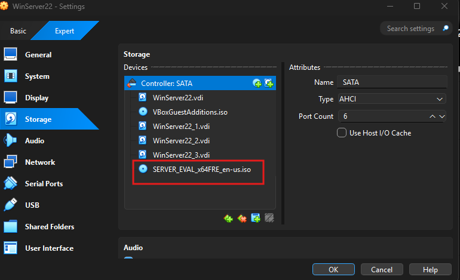

> In VirtualBox → VM Settings → **Storage**, the ISO `SERVER_EVAL_x64FRE_en-us.iso` is attached to the SATA controller alongside the existing virtual disks. This mounts the ISO as drive `F:` inside the VM, making `F:\sources\boot.wim` and `F:\sources\install.wim` accessible for WDS image import.

---

### Task 3a — Configure WDS: Proxy DHCP Settings

Launch the **WDS Configuration Wizard** (right-click server → Configure Server). On the **Proxy DHCP Server** step, configure how WDS coexists with the existing DHCP server.

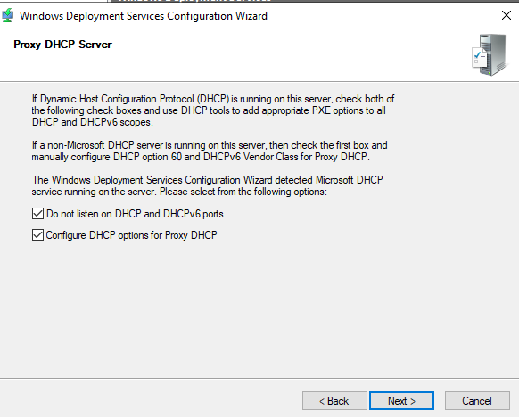

> Since Microsoft DHCP is already running on this server, both options are checked:
> - ✅ **Do not listen on DHCP and DHCPv6 ports** — prevents WDS from conflicting with the DHCP service on ports 67/68
> - ✅ **Configure DHCP options for Proxy DHCP** — automatically sets DHCP option 60 (PXEClient) so clients know this server provides PXE boot services
>
> This is the correct configuration when WDS and DHCP share the same server.

---

### Task 3b — Configure WDS: Active Directory Integration

On the **Install Options** step, choose how WDS integrates into the network environment.

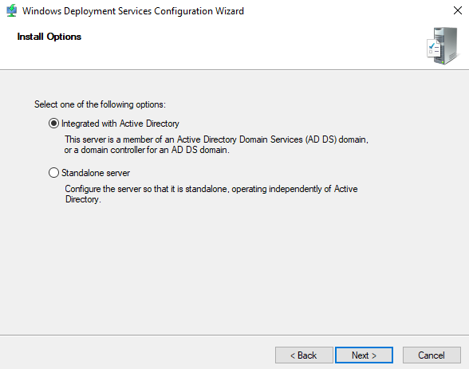

> **Integrated with Active Directory** is selected. This registers the WDS server as an authorized deployment server in AD DS, enabling domain-joined deployments and computer account pre-staging. The alternative **Standalone server** mode operates independently of AD — suitable for workgroup environments.

---

### Task 4 — Configure PXE Response Settings

On the **PXE Server Initial Settings** step, define which client computers the WDS server will respond to during PXE boot.

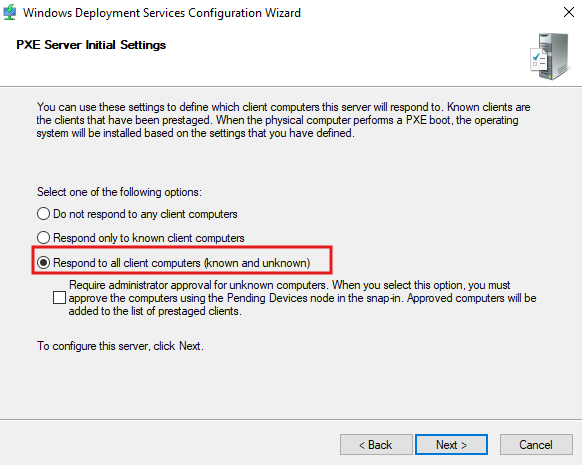

> **Respond to all client computers (known and unknown)** is selected. This allows any machine that PXE boots on the network to receive a response from WDS — regardless of whether it has been pre-staged in Active Directory.
>
> Options available:
> - **Do not respond** — WDS is configured but inactive for PXE
> - **Known clients only** — only pre-staged (prestaged AD computer accounts) receive a response
> - **All clients** ✅ — any PXE-booting machine gets a response; optionally require admin approval for unknown computers

---

### Task 5 — Start Windows Deployment Services

After configuration completes, start the WDS service from the WDS Management Console.

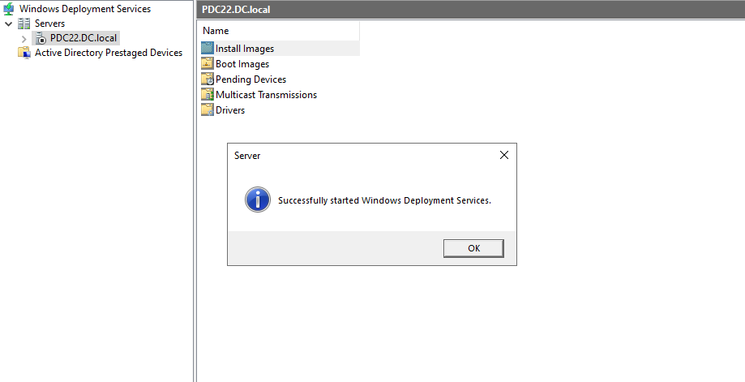

> The WDS console shows `PDC22.DC.local` with its node expanded, confirming the service is running. A confirmation dialog reads **"Successfully started Windows Deployment Services."**
>
> The console tree shows all available WDS containers:
> - **Install Images** — OS installation WIM files
> - **Boot Images** — PXE boot environment WIMs
> - **Pending Devices** — machines awaiting admin approval
> - **Multicast Transmissions** — for broadcasting images to multiple clients
> - **Drivers** — injected into deployed images

---

### Task 6 — Add a Boot Image

Right-click **Boot Images → Add Boot Image**. In the **Add Image Wizard**, point to the `boot.wim` file from the mounted ISO.

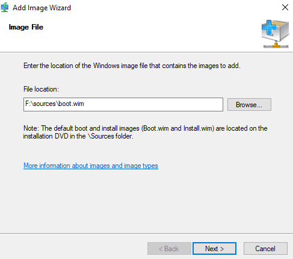

> **File location:** `F:\sources\boot.wim`
>
> The `boot.wim` file contains the **Windows PE (WinPE)** environment — a minimal OS that boots over the network, connects to the WDS server, and launches the Windows Setup wizard. This is the image clients receive when they PXE boot.

---

### Task 7 — Add an Install Image

After adding the boot image, right-click **Install Images → Add Install Image** and point to `F:\sources\install.wim`. This contains the actual Windows OS editions to deploy.

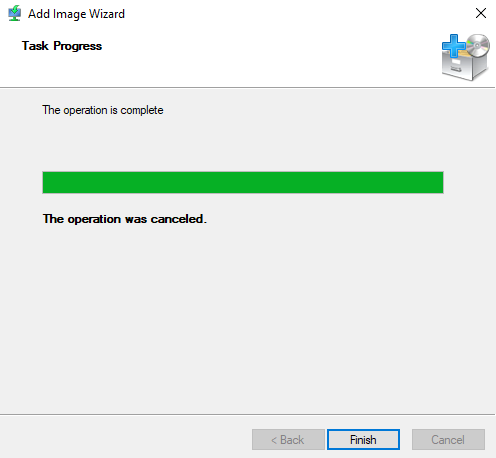

> The **Add Image Wizard** completes successfully (progress bar full). The `install.wim` contains one or more Windows Server or Windows 10/11 editions. After selecting an image group, clients that boot via PXE will be presented with these OS options to install.
>
> Note: `The operation was canceled` in the screenshot indicates the wizard was closed after the image was already added — the image itself was successfully imported.

---

### Task 8 — Set Network as First Boot Device on Client

On the **client machine** (VirtualBox or physical), change the BIOS/firmware boot order to prioritize **Network** boot before the hard disk.

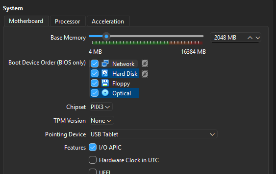

> In VirtualBox → VM Settings → **System → Motherboard**:
> - Boot order: **Network** → Hard Disk → Floppy → Optical
> - RAM: 2048 MB
> - Chipset: PIIX3
>
> Setting Network first ensures the client contacts the DHCP/WDS server at startup and receives the PXE boot offer before attempting to boot from local disk.

---

### Task 9 — Configure DHCP Scope Options for PXE

In **DHCP Manager**, add the required scope options so DHCP clients know where the WDS/PXE server is located.

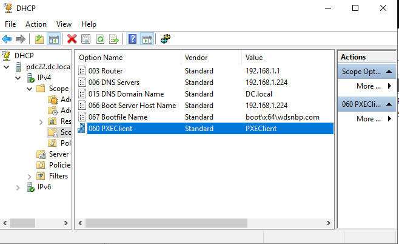

> The following scope options are configured:

| Option | Name | Value |
|---|---|---|
| 003 | Router | 192.168.1.1 |
| 006 | DNS Servers | 192.168.1.224 |
| 015 | DNS Domain Name | DC.local |
| 066 | Boot Server Host Name | 192.168.1.224 |
| 067 | Bootfile Name | `boot\x64\wdsnbp.com` |
| 060 | PXEClient | PXEClient |

> - **Option 066** points clients to the WDS server IP (`192.168.1.224`) as the TFTP boot server
> - **Option 067** specifies the bootfile path — `wdsnbp.com` is the WDS Network Boot Program that initiates the PXE handshake
> - **Option 060** identifies the server as a PXE-capable server to DHCP clients

---

### Task 10 — Configure WDS Boot Policy

Right-click the WDS server → **Properties → Boot tab** to define PXE boot behavior for known and unknown clients.

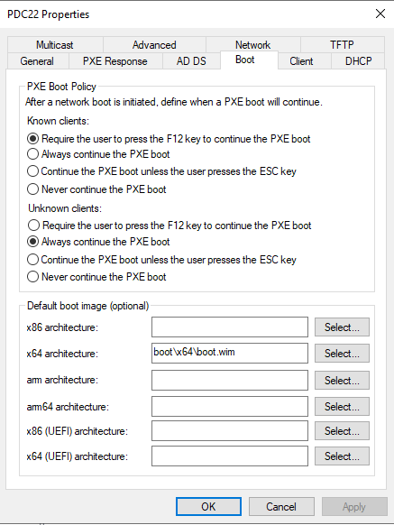

> **PXE Boot Policy** configured as:
>
> | Client Type | Policy |
> |---|---|
> | **Known clients** | Require the user to press **F12** to continue the PXE boot |
> | **Unknown clients** | **Always continue** the PXE boot (no keypress required) |
>
> **Default boot image:** `boot\x64\boot.wim` set for x64 architecture.
>
> The F12 requirement for known clients prevents accidental re-imaging of machines that are already deployed. Unknown clients boot automatically — useful for first-time deployments of new hardware.

---

### Task 11 — Verify PXE Boot on Client

Power on the client machine. It broadcasts a DHCP Discover, receives the PXE options, downloads `wdsnbp.com` via TFTP, and loads the WDS boot environment.

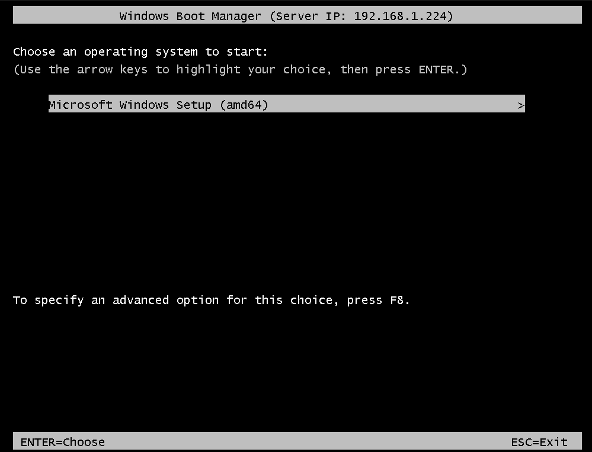

> The **Windows Boot Manager** screen appears on the client, confirming:
> - Server IP: `192.168.1.224` (WDS server)
> - Boot option: **Microsoft Windows Setup (amd64)**
>
> The client successfully received the boot image from the WDS server over the network. Pressing **Enter** launches the Windows Setup wizard where the user selects the install image (added in Task 7) and proceeds with OS installation — no USB drive or DVD required.

---

## 🔑 Key Concepts

| Concept | Description |
|---|---|
| **WDS** | Windows Deployment Services — network-based OS deployment server |
| **PXE** | Pre-boot Execution Environment — allows machines to boot from the network |
| **TFTP** | Trivial File Transfer Protocol — used to transfer the boot program and WIM file to the client |
| **boot.wim** | Windows PE boot image — minimal OS loaded by the client at PXE boot time |
| **install.wim** | Full OS installation image containing one or more Windows editions |
| **wdsnbp.com** | WDS Network Boot Program — the first file downloaded by a PXE client |
| **DHCP Option 066** | Tells the DHCP client the IP of the TFTP/boot server |
| **DHCP Option 067** | Tells the DHCP client the path to the bootfile on the TFTP server |
| **DHCP Option 060** | Identifies the server as PXEClient-capable |
| **Proxy DHCP** | WDS acting alongside an existing DHCP server without taking over DHCP ports |
| **Known client** | A machine pre-staged in Active Directory with a matching computer account |
| **Unknown client** | Any machine not pre-staged — can still be deployed with appropriate PXE policy |
| **Transport Server** | WDS component managing TFTP unicast/multicast transfers |
| **Deployment Server** | WDS component managing image catalog, approvals, and client sessions |

---

## ⚠️ Important Notes

- WDS and DHCP on the **same server** requires checking both Proxy DHCP options (Task 3a) — otherwise clients receive conflicting responses and cannot PXE boot.
- The **boot.wim** must be added before the **install.wim** — clients need WinPE to connect to WDS and select an install image.
- DHCP **options 066 and 067** are essential — without them, clients get an IP from DHCP but don't know where to download the boot file.
- **Option 060 (PXEClient)** must be set as a vendor class string value — not a standard text string.
- After changing boot order to Network first, set it back to Hard Disk first after OS installation to prevent re-imaging on every boot.
- For production environments, pre-stage computer accounts in AD and use **Known clients only** PXE policy to prevent unauthorized deployments.

---

## 📊 Lab Configuration Summary

| Setting | Value |
|---|---|
| WDS Server | PDC22.DC.local — 192.168.1.224 |
| AD Integration | Integrated with AD DS |
| PXE Response | All clients (known and unknown) |
| Boot image | `F:\sources\boot.wim` → `boot\x64\boot.wim` |
| Install image | `F:\sources\install.wim` |
| DHCP Option 066 | 192.168.1.224 |
| DHCP Option 067 | `boot\x64\wdsnbp.com` |
| DHCP Option 060 | PXEClient |
| Known client F12 | Required |
| Unknown client boot | Always continue |

---

## 🛠️ Requirements

- Windows Server 2016 or later
- **Windows Deployment Services** role (Deployment Server + Transport Server)
- DHCP Server configured and running on the same or separate server
- Windows installation ISO (`boot.wim` and `install.wim`)
- Client machine with PXE-capable NIC and Network set as first boot device
- Active Directory Domain Services (for AD-integrated mode)
- Administrator privileges

---

## 👨‍💻 Author

> Lab materials prepared for Windows Server administration coursework.  
> WDS server: `PDC22.DC.local` (192.168.1.224) — April 2026.
