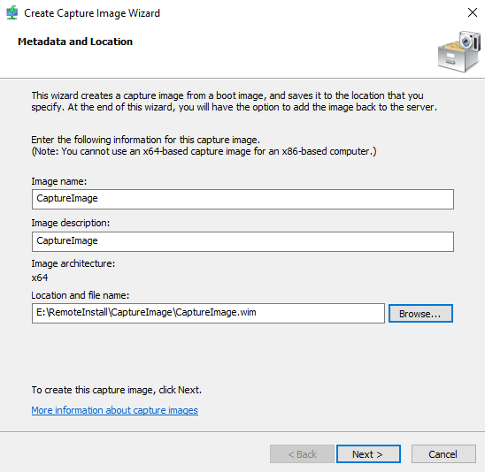
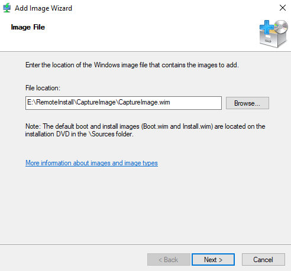
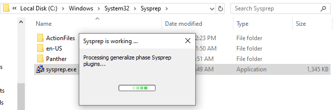
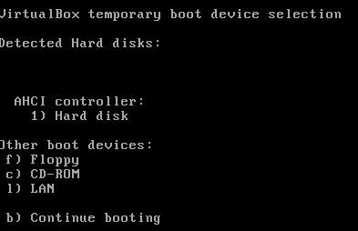
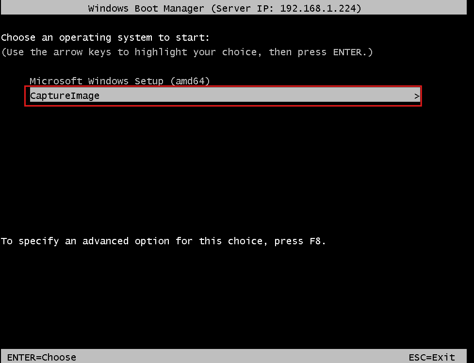
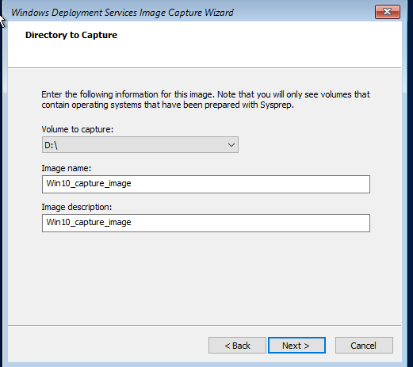
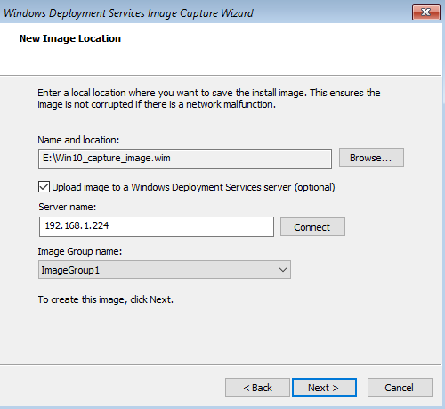

# 📸 Lab: WDS — Image Capture & Deployment (Tasks 12–18)

**Topic:** WDS Capture Image — Sysprep, Capture Boot, and Upload to WDS Server  
**Platform:** Windows Server 2016 / 2019 (`PDC22.DC.local`) + Windows 10 Reference Machine  
**Difficulty:** Intermediate–Advanced

> **Prerequisites:** Complete the WDS base lab (Tasks 1–11) before starting this section. The WDS server must be running with boot and install images already added.

---

## 🎯 Objectives

- Create a WDS Capture Image from an existing boot image
- Add the capture image back to the WDS server as a bootable option
- Run Sysprep on the reference (master) machine to generalize the OS
- PXE boot the reference machine into the capture environment
- Select the volume to capture and define the image name
- Upload the captured WIM image directly to the WDS server

---

## 📋 Tasks

### Task 12 — Create a Capture Image

In **WDS Management Console**, right-click an existing boot image → **Create Capture Image**. The wizard generates a special WinPE image used to capture a reference machine's OS.



> Configure the capture image metadata:
> - **Image name:** `CaptureImage`
> - **Image description:** `CaptureImage`
> - **Image architecture:** `x64`
> - **Location and file name:** `E:\RemoteInstall\CaptureImage\CaptureImage.wim`
>
> Click **Next** — WDS generates the capture WIM by injecting capture tools into the base `boot.wim`. This image, when booted, launches the **WDS Image Capture Wizard** instead of Windows Setup.

---

### Task 13 — Add the Capture Image to WDS Boot Images

After the capture WIM is created, add it to WDS so clients can select it at PXE boot time.



> In **WDS → Boot Images → Add Boot Image**, point to the newly created capture WIM:
> - **File location:** `E:\RemoteInstall\CaptureImage\CaptureImage.wim`
>
> Once added, `CaptureImage` will appear as a selectable option in the **Windows Boot Manager** alongside the standard Windows Setup entry — allowing the reference machine to boot into capture mode over the network.

---

### Task 14 — Run Sysprep on the Reference Machine

On the **Windows 10 reference machine** (the machine whose image you want to capture), run `sysprep.exe` to generalize the OS before capture.



> Navigate to `C:\Windows\System32\Sysprep\` and run `sysprep.exe`.  
> In the Sysprep dialog, select:
> - **System Cleanup Action:** Enter System Out-of-Box Experience (OOBE)
> - **Generalize:** ✅ checked
> - **Shutdown Options:** Shutdown
>
> The screenshot shows Sysprep actively **processing the generalize phase** — stripping machine-specific data (SID, hardware drivers, activation state, computer name) from the installation. The machine shuts down when complete.
>
> ⚠️ **Sysprep is mandatory before capture.** An image taken from a non-generalized machine will have duplicate SIDs and hardware-specific settings — causing conflicts when deployed to multiple machines.

---

### Task 15 — PXE Boot the Reference Machine from Network

Power on the reference machine and boot from the network (LAN) to reach the WDS server.



> The **VirtualBox temporary boot device selection** screen appears. Select **l) LAN** to initiate a PXE network boot.  
> The machine broadcasts a DHCP Discover, receives the PXE options (066/067), downloads `wdsnbp.com` via TFTP, and connects to the WDS server at `192.168.1.224`.

---

### Task 16 — Select the Capture Image at Boot Manager

The **Windows Boot Manager** loads from the WDS server and presents the available boot options.



> Two options are available in the Boot Manager (Server IP: `192.168.1.224`):
> - **Microsoft Windows Setup (amd64)** — standard OS installation
> - **CaptureImage** ← select this one
>
> Select **CaptureImage** and press **Enter**. The WDS capture WinPE environment loads, launching the **Windows Deployment Services Image Capture Wizard** automatically.

---

### Task 17 — Select the Volume and Name the Image

Inside the WDS Image Capture Wizard, select the volume to capture and provide a name for the resulting WIM file.



> Configure the capture parameters:
> - **Volume to capture:** `D:\` — the drive containing the Sysprep-generalized Windows 10 installation
> - **Image name:** `Win10_capture_image`
> - **Image description:** `Win10_capture_image`
>
> Only volumes prepared with Sysprep are listed in the dropdown. Click **Next** to begin the capture process — WDS reads the volume and packages it into a WIM file.

---

### Task 18 — Upload Captured Image to the WDS Server

On the **New Image Location** step, define where to save the WIM locally and optionally upload it directly to the WDS server.



> Configure the upload settings:
> - **Name and location:** `E:\Win10_capture_image.wim` — local save path (protects against network failure mid-capture)
> - **Upload image to a WDS server:** ✅ checked
> - **Server name:** `192.168.1.224` → click **Connect**
> - **Image Group name:** `ImageGroup1`
>
> Click **Next** — the wizard captures the volume, saves it as a WIM locally, then uploads it to the WDS server's install image library. Once uploaded, `Win10_capture_image` appears under **Install Images → ImageGroup1** in the WDS console and can be deployed to new machines via PXE boot.

---

## 🔄 Complete Capture Workflow Summary

```
Reference Machine (Win10 + customizations)
          │
          ▼
    Run Sysprep (Generalize + Shutdown)         ← Task 14
          │
          ▼
    PXE Boot via LAN                            ← Task 15
          │
          ▼
    Select CaptureImage in Boot Manager         ← Task 16
          │
          ▼
    WDS Image Capture Wizard loads
          │
          ▼
    Select volume D:\ → Name: Win10_capture_image  ← Task 17
          │
          ▼
    Save locally + Upload to WDS 192.168.1.224  ← Task 18
          │
          ▼
    Image appears in WDS Install Images
          │
          ▼
    Deploy to new machines via PXE
```

---

## 🔑 Key Concepts

| Concept | Description |
|---|---|
| **Capture Image** | Special WinPE boot image that runs the WDS Image Capture Wizard instead of Windows Setup |
| **Sysprep** | System Preparation Tool — generalizes Windows by removing machine-specific settings and SID |
| **Generalize** | Sysprep mode that strips hardware-specific drivers, SID, and activation state |
| **OOBE** | Out-of-Box Experience — the setup wizard that runs on first boot after deployment |
| **WIM** | Windows Imaging Format — the container format for both boot and install images |
| **Reference Machine** | A configured Windows installation used as the master template for deployment |
| **ImageGroup** | A named container in WDS that organizes install images |
| **Local save path** | The WIM is saved locally first to prevent data loss if the network drops during upload |
| **Upload to WDS** | Optional step in the Capture Wizard that sends the finished WIM directly to the server |

---

## ⚠️ Important Notes

- **Sysprep must be run before capture** — deploying a non-generalized image creates duplicate SIDs across machines, causing authentication and domain-join failures.
- Sysprep can only be run a **maximum of 3 times** on the same Windows installation.
- The **volume dropdown** in the Capture Wizard (Task 17) only shows volumes that have been prepared with Sysprep — if `D:\` does not appear, Sysprep did not complete successfully.
- Always configure a **local save path** (Task 18) before uploading — if the network drops mid-capture, the locally saved WIM can be manually added to WDS later.
- The captured image is an **install image** (not a boot image) and will appear under `Install Images` in the WDS console after upload.
- After capture, the reference machine has been generalized — it will go through OOBE on next boot. Restore from a snapshot or reinstall if you need to reuse it.

---

## 📊 Capture Configuration Summary

| Setting | Value |
|---|---|
| Capture image name | CaptureImage |
| Capture WIM path | `E:\RemoteInstall\CaptureImage\CaptureImage.wim` |
| Architecture | x64 |
| Reference machine OS | Windows 10 |
| Sysprep mode | Generalize + OOBE + Shutdown |
| Volume captured | `D:\` |
| Output image name | `Win10_capture_image` |
| Local save path | `E:\Win10_capture_image.wim` |
| WDS server | 192.168.1.224 |
| Image group | ImageGroup1 |

---

## 🛠️ Requirements

- WDS server configured and running (Tasks 1–11 complete)
- A reference Windows 10 machine with desired software and configuration
- The reference machine must be able to PXE boot from the network
- `CaptureImage.wim` created and added to WDS Boot Images
- Administrator privileges on both the reference machine and WDS server

---

## 👨‍💻 Author

> Lab materials prepared for Windows Server administration coursework.  
> WDS server: `PDC22.DC.local` (192.168.1.224) — April 2026.
