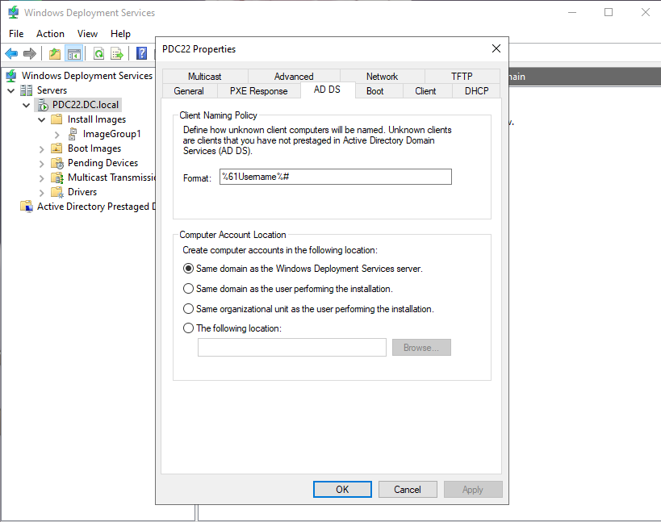
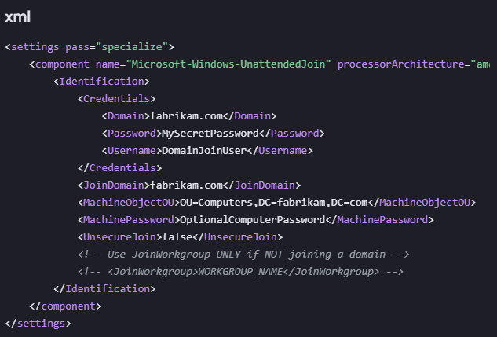

# 🔗 Lab: WDS — Auto Domain Join After Deployment (Tasks 19–20)

**Topic:** WDS Post-Deployment — Automatic Domain Join via AD DS Settings & Unattend XML  
**Platform:** Windows Server 2016 / 2019 (`PDC22.DC.local`)  
**Difficulty:** Intermediate–Advanced

> **Prerequisites:** Complete WDS base lab (Tasks 1–11) and Image Capture lab (Tasks 12–18) before starting this section.

---

## 🎯 Objectives

- Configure the WDS server's AD DS tab to automatically name and domain-join deployed computers
- Understand and create an unattended XML answer file to silently join the domain during OS deployment

---

## 📋 Tasks

### Task 19 — Configure Automatic Domain Join via WDS AD DS Settings

Right-click the WDS server in the console → **Properties → AD DS tab** to define how newly deployed machines are named and where their computer accounts are created in Active Directory.



> **Client Naming Policy**
>
> The **Format** field defines the auto-generated computer name for unknown clients (machines not pre-staged in AD):
> ```
> %61Username%#
> ```
> - `%61Username%` — uses the first 6 characters of the installing user's username
> - `#` — appends an auto-incrementing number to ensure uniqueness
>
> Example: If user `ahmed.abdo` performs the installation → computer name becomes `ahmed.#` → `ahmed.1`, `ahmed.2`, etc.
>
> **Computer Account Location**
>
> Defines where the new computer object is created in Active Directory:
>
> | Option | Description |
> |---|---|
> | **Same domain as the WDS server** ✅ | Computer account created in the same domain as `PDC22.DC.local` |
> | Same domain as the installing user | Account placed in the user's domain (useful in multi-domain forests) |
> | Same OU as the installing user | Account placed in the OU where the user account lives |
> | The following location | Manually specify a custom OU path |
>
> The selected option **Same domain as the Windows Deployment Services server** is the standard choice for single-domain environments — all deployed computers land in the default **Computers** container of `DC.local` unless overridden by an answer file.

---

### Task 20 — Unattended Domain Join via XML Answer File

For fully automated deployments (zero user interaction), create an **unattend XML answer file** that handles domain join silently during the Windows Setup `specialize` pass.



> The answer file targets the `specialize` configuration pass and uses the `Microsoft-Windows-UnattendedJoin` component:

```xml
<settings pass="specialize">
  <component name="Microsoft-Windows-UnattendedJoin" processorArchitecture="amd64"
             publicKeyToken="31bf3856ad364e35" language="neutral"
             versionScope="nonSxS">
    <Identification>
      <Credentials>
        <Domain>fabrikam.com</Domain>
        <Password>MySecretPassword</Password>
        <Username>DomainJoinUser</Username>
      </Credentials>
      <JoinDomain>fabrikam.com</JoinDomain>
      <MachineObjectOU>OU=Computers,DC=fabrikam,DC=com</MachineObjectOU>
      <MachinePassword>OptionalComputerPassword</MachinePassword>
      <UnsecureJoin>false</UnsecureJoin>
      <!-- Use JoinWorkgroup ONLY if NOT joining a domain -->
      <!-- <JoinWorkgroup>WORKGROUP_NAME</JoinWorkgroup> -->
    </Identification>
  </component>
</settings>
```

#### XML Field Reference

| Field | Value | Description |
|---|---|---|
| `pass` | `specialize` | The Windows Setup phase where domain join runs — after hardware detection, before OOBE |
| `processorArchitecture` | `amd64` | Target architecture — use `x86` for 32-bit |
| `<Domain>` | `fabrikam.com` | Domain used to authenticate the join credentials |
| `<Password>` | `MySecretPassword` | Password of the domain join account *(encrypt with `sysprep /generalize` or WSIM)* |
| `<Username>` | `DomainJoinUser` | Account with permission to join computers to the domain |
| `<JoinDomain>` | `fabrikam.com` | The domain the machine will join |
| `<MachineObjectOU>` | `OU=Computers,DC=fabrikam,DC=com` | Target OU for the new computer account in AD |
| `<MachinePassword>` | `OptionalComputerPassword` | Optional pre-set machine account password |
| `<UnsecureJoin>` | `false` | Forces secure channel join *(recommended — keep false)* |
| `<JoinWorkgroup>` | *(commented out)* | Use instead of `<JoinDomain>` for workgroup-only deployments |

#### How to use the answer file with WDS

1. Create the XML using **Windows System Image Manager (WSIM)** — included in the Windows ADK
2. Save the file as `unattend.xml`
3. In **WDS Console → Install Images**, right-click the target image → **Properties → General tab**
4. Click **Select File** next to **Unattend file** → browse to `unattend.xml`
5. WDS injects the answer file into the deployment — the machine joins the domain automatically without any user prompt

---

## 🔄 Domain Join Methods Comparison

| Method | Configuration | User Interaction | Best For |
|---|---|---|---|
| **Manual join** | Done post-deployment via System Properties | Required | Small deployments, ad-hoc |
| **WDS AD DS tab** (Task 19) | Auto-names + places computer in AD at deploy time | Minimal — user still prompted for credentials | Standard domain deployments |
| **Unattend XML** (Task 20) | Fully automated — credentials embedded in answer file | None | Large-scale automated rollouts |

---

## 🔑 Key Concepts

| Concept | Description |
|---|---|
| **AD DS tab (WDS)** | Controls client naming format and computer account OU placement in Active Directory |
| **Client Naming Policy** | Auto-generates computer names for unknown clients using variables like `%Username%` |
| **`%61Username%`** | WDS variable — takes first 6 characters of the installer's username |
| **Specialize pass** | Windows Setup phase that applies hardware-specific settings including domain join |
| **UnattendedJoin** | Windows Setup component handling automatic domain join via answer file |
| **WSIM** | Windows System Image Manager — GUI tool for creating and validating unattend XML files |
| **Windows ADK** | Assessment and Deployment Kit — contains WSIM, WinPE tools, and imaging utilities |
| **MachineObjectOU** | LDAP path of the OU where the new computer account will be created |
| **UnsecureJoin** | If `true`, joins without authenticating — not recommended in production |
| **Answer file** | XML file (unattend.xml) that provides automated responses to Windows Setup prompts |

---

## ⚠️ Important Notes

- **Passwords in unattend files are a security risk** — always encrypt them using WSIM's password obfuscation or use a dedicated low-privilege domain join account (`DomainJoinUser`) with only the **"Add workstations to domain"** right.
- The `specialize` pass runs **before OOBE** — the machine is joined to the domain before the user ever sees the desktop.
- The `<MachineObjectOU>` path must be a valid LDAP distinguished name — verify it exists in AD before deploying.
- If both `<JoinDomain>` and `<JoinWorkgroup>` are specified, Windows Setup will fail — use only one.
- Answer files can also automate: regional settings, product key entry, local admin account creation, Windows activation, and application installation.
- Use **WSIM** (from Windows ADK) to create and validate the answer file against a specific install.wim — it catches XML errors before deployment.

---

## 📊 Configuration Summary

| Setting | Value |
|---|---|
| WDS Server | PDC22.DC.local |
| Client Naming Format | `%61Username%#` |
| Computer Account Location | Same domain as WDS server |
| Answer file pass | `specialize` |
| Join domain | `fabrikam.com` |
| Target OU | `OU=Computers,DC=fabrikam,DC=com` |
| Join account | `DomainJoinUser` |
| Unsecure join | `false` |

---

## 🛠️ Requirements

- WDS server configured and running (Tasks 1–11 complete)
- Active Directory Domain Services
- Windows Assessment and Deployment Kit (ADK) for WSIM — to create/edit answer files
- A dedicated domain join service account with minimum required permissions
- Administrator privileges on the WDS server

---

## 👨‍💻 Author

> Lab materials prepared for Windows Server administration coursework.  
> WDS server: `PDC22.DC.local` — April 2026.
