# 💾 Lab: Windows Server Backup & Recovery

**Topic:** Windows Server Backup — Full Backup, VHD Inspection & File Recovery  
**Platform:** Windows Server 2016 / 2019 (`PDC22`)  
**Difficulty:** Beginner–Intermediate

---

## 🎯 Objectives

- Open and explore the Windows Server Backup console
- Run a one-time full server backup using the Backup Once Wizard
- Select backup items, destination type, and destination volume
- Verify the completed backup and inspect the generated VHD file
- Mount the backup VHD via Disk Management to browse its contents
- Recover specific files using the Recovery Wizard
- Configure recovery options (destination, conflict handling, ACL restore)
- Verify successful file recovery

---

## 📋 Tasks

### Part 1 — Creating a Backup

#### Task 1 — Open Windows Server Backup Console

Open **Server Manager → Tools → Windows Server Backup**, or run `wbadmin` from the Start menu.

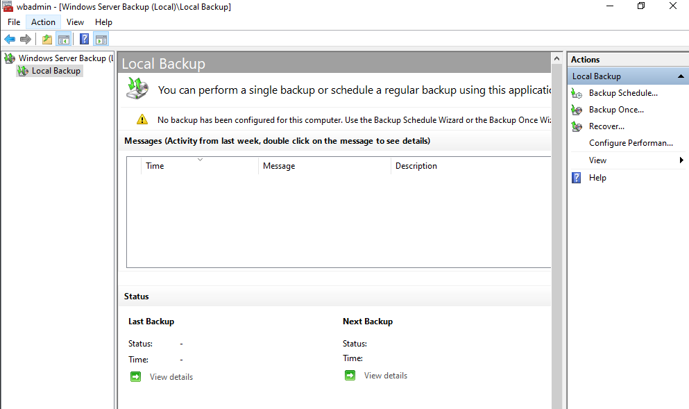

> The **Local Backup** dashboard shows no backups have been configured yet. The **Actions** panel on the right provides:
> - **Backup Schedule** — create recurring automated backups
> - **Backup Once** — run an immediate one-time backup
> - **Recover** — launch the Recovery Wizard
> - **Configure Performance** — tune backup read/write speed
>
> The **Status** section shows `Last Backup` and `Next Backup` — both empty until the first backup runs.

---

#### Task 2 — Select Backup Configuration

Click **Backup Once** in the Actions panel. On the **Select Backup Configuration** step, choose what to back up.

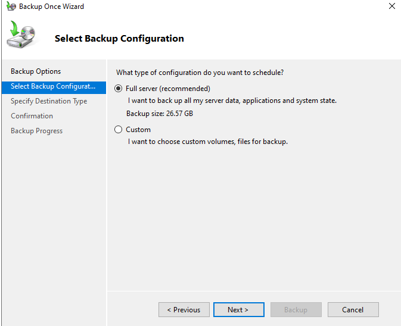

> Two options are available:
> - **Full server (recommended)** ✅ — backs up all server data, applications, and system state. Backup size: **26.57 GB**
> - **Custom** — select specific volumes or files
>
> **Full server** is selected — this ensures bare metal recovery is possible and includes system state, all volumes, and installed applications.

---

#### Task 3 — Select Items for Backup

If **Custom** is chosen (or to review what Full server includes), click **Add Items** to see the selectable components.

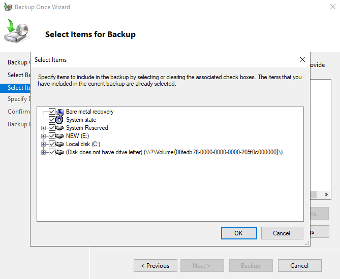

> The **Select Items** dialog shows all available components:
> - ✅ **Bare metal recovery** — enables full server restoration to dissimilar hardware
> - ✅ **System state** — AD DS, registry, boot files, COM+ database
> - ✅ **System Reserved** — boot partition
> - ✅ **NEW (E:)** — data volume
> - ✅ **Local disk (C:)** — OS volume
> - ✅ **Disk (no drive letter)** — unassigned volume `\\?\Volume{06fedb78...}`
>
> All items are selected by default for a Full server backup.

---

#### Task 4 — Specify Destination Type

On the **Specify Destination Type** step, choose where the backup will be stored.

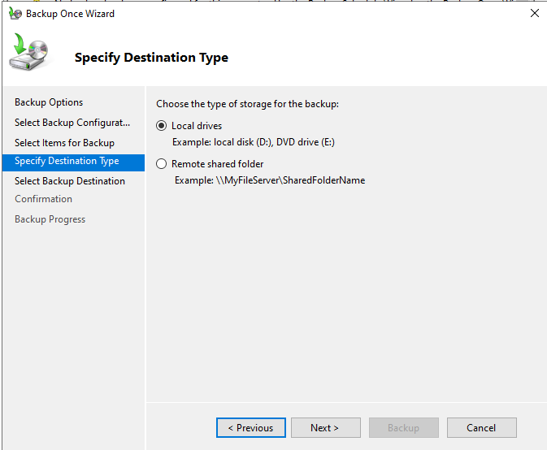

> Two destination types are available:
> - **Local drives** ✅ — store backup on a local disk or DVD (e.g., `D:`, `E:`)
> - **Remote shared folder** — store backup at a UNC path (e.g., `\\MyFileServer\SharedFolderName`)
>
> **Local drives** is selected for this lab. Remote shared folder is preferable in production for off-server backup storage.

---

#### Task 5 — Select Backup Destination Volume

On the **Select Backup Destination** step, choose the specific local volume to store the backup.

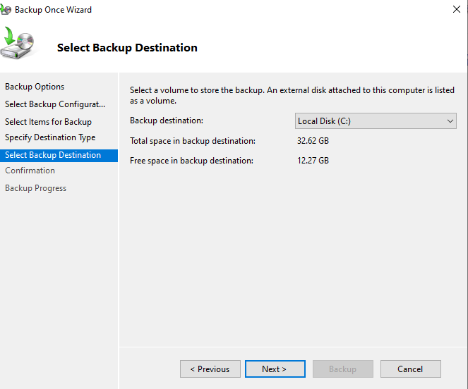

> - **Backup destination:** `Local Disk (C:)`
> - **Total space:** 32.62 GB
> - **Free space:** 12.27 GB
>
> ⚠️ Storing a backup on the same disk being backed up (`C:`) is not recommended in production — if the disk fails, both the data and backup are lost. Use a separate physical disk, external drive, or network share in real environments.

---

#### Task 6 — Backup Completes Successfully

After confirming, the wizard runs the backup. Monitor progress on the **Backup Progress** page.

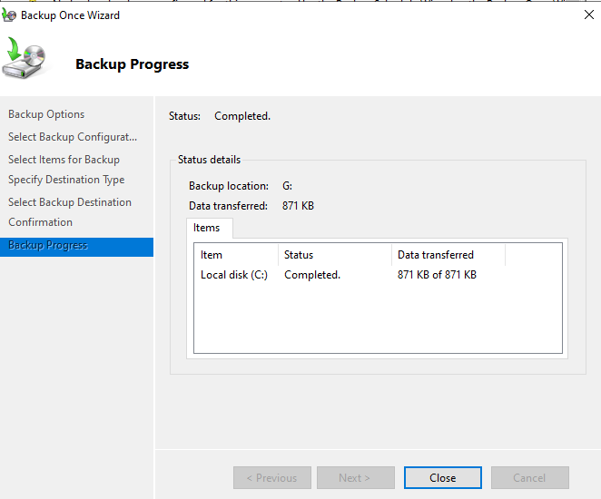

> **Status: Completed.**
> - **Backup location:** `G:`
> - **Data transferred:** 871 KB
> - **Items backed up:** `Local disk (C:)` — 871 KB of 871 KB
>
> The backup completes and stores a `WindowsImageBackup` folder structure on the destination volume.

---

### Part 2 — Inspecting the Backup VHD

#### Task 7 — Browse the Backup VHD File

Navigate to the backup destination folder to find the generated VHD file.

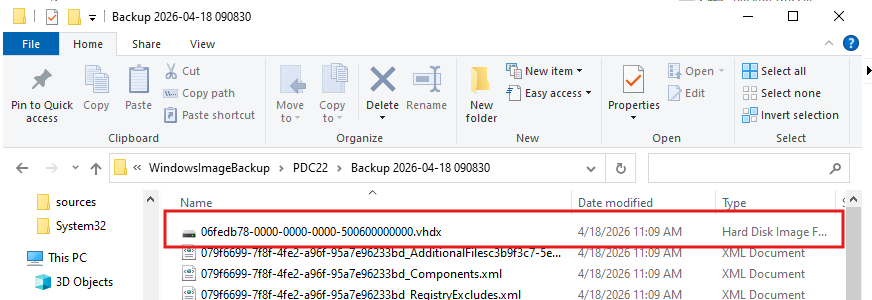

> Path: `G:\WindowsImageBackup\PDC22\Backup 2026-04-18 090830\`
>
> The backup folder contains:
> - **`06fedb78-0000-0000-0000-500600000000.vhdx`** — the primary VHD containing the backed-up volume data
> - Multiple XML metadata files: `AdditionalFilesc3b9f3c7...`, `_Components.xml`, `_RegistryExcludes.xml`
>
> The `.vhdx` file is a **Virtual Hard Disk** — it can be mounted in Disk Management to browse its contents without running a full recovery.

---

#### Task 8 — Attach the VHD in Disk Management

Open **Disk Management → Action → Attach VHD** and browse to the `.vhdx` file to mount it as a drive letter.

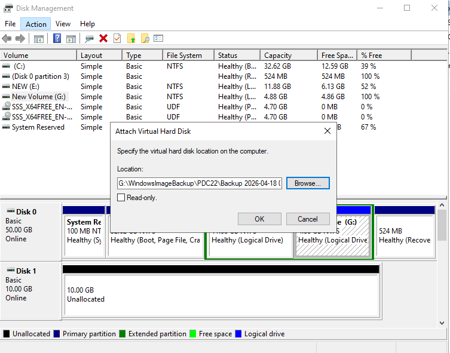

> In the **Attach Virtual Hard Disk** dialog:
> - **Location:** `G:\WindowsImageBackup\PDC22\Backup 2026-04-18 0...`
> - **Read-only:** unchecked (leave checked in production to prevent accidental modification)
>
> Click **OK** — the VHD mounts and appears as a new disk in Disk Management and as a new drive letter in File Explorer.

---

#### Task 9 — Browse Restored Contents from VHD

After mounting, the VHD appears as drive `H:` in File Explorer, allowing direct file browsing.

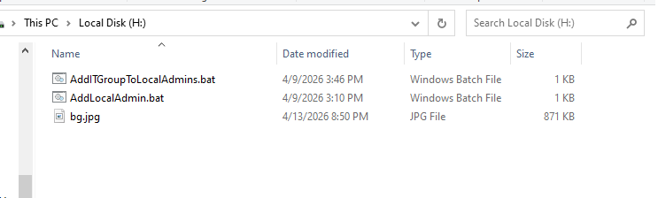

> Drive `H:` (the mounted backup VHD) contains:
>
> | File | Date Modified | Type | Size |
> |---|---|---|---|
> | `AddITGroupToLocalAdmins.bat` | 4/9/2026 3:46 PM | Windows Batch File | 1 KB |
> | `AddLocalAdmin.bat` | 4/9/2026 3:10 PM | Windows Batch File | 1 KB |
> | `bg.jpg` | 4/13/2026 8:50 PM | JPG File | 871 KB |
>
> Files can be copied directly from the mounted VHD without using the Recovery Wizard — useful for quickly retrieving individual files.

---

### Part 3 — Recovering Files via Recovery Wizard

#### Task 10 — Select Backup Date

Click **Recover** in the Actions panel. On the **Select Backup Date** step, choose which backup snapshot to recover from.

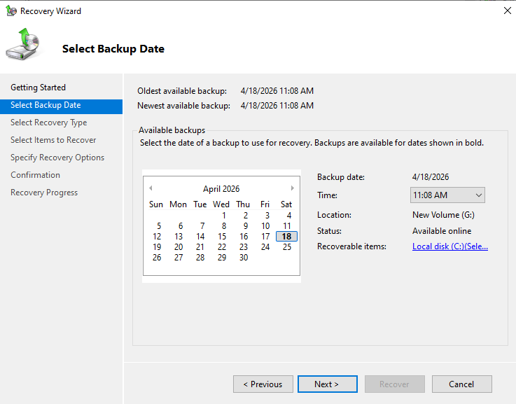

> - **Oldest available backup:** 4/18/2026 11:08 AM
> - **Newest available backup:** 4/18/2026 11:08 AM
> - **Selected date:** **April 18, 2026** (shown in bold on calendar)
> - **Time:** 11:08 AM
> - **Location:** New Volume (G:)
> - **Status:** Available online
> - **Recoverable items:** Local disk (C:)
>
> Dates with available backups appear in **bold** on the calendar. Select the appropriate date and time, then click **Next**.

---

#### Task 11a — Select Items to Recover

Browse the backup tree to select the specific files or folders to recover.

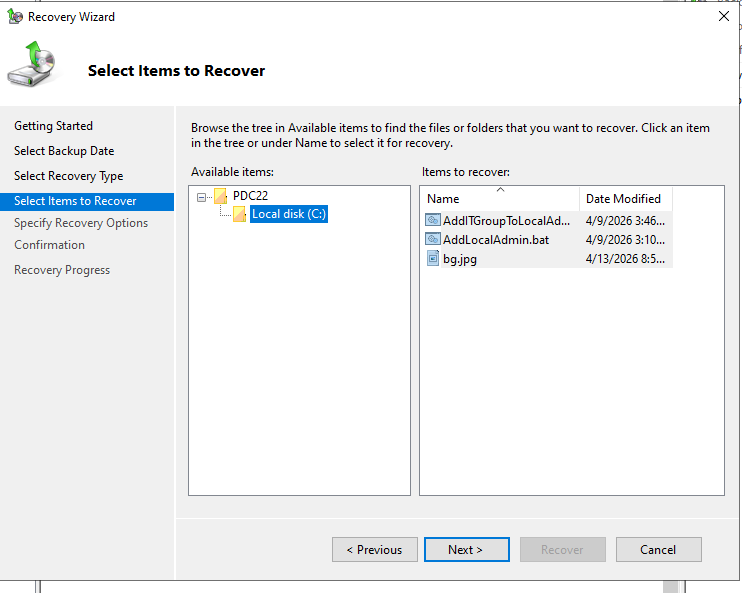

> Navigate the **Available items** tree:
> - **PDC22 → Local disk (C:)**
>
> The **Items to recover** panel shows the files selected from that volume:
>
> | File | Date Modified |
> |---|---|
> | `AddITGroupToLocalAd...` | 4/9/2026 3:46 |
> | `AddLocalAdmin.bat` | 4/9/2026 3:10 |
> | `bg.jpg` | 4/13/2026 8:5... |
>
> Select individual files or entire folders, then click **Next**.

---

#### Task 11b — Specify Recovery Options

Configure where recovered files will be placed and how conflicts are handled.

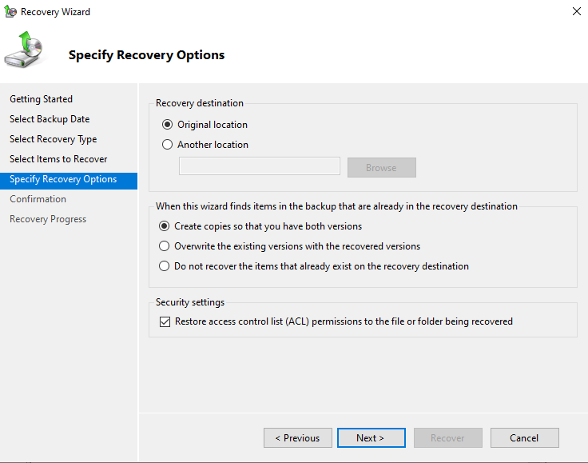

> **Recovery destination:**
> - **Original location** ✅ — restores files back to their original paths on `C:\`
> - **Another location** — specify a different path (safer if you don't want to overwrite existing files)
>
> **When items already exist in the destination:**
> - **Create copies so that you have both versions** ✅ — safest option, preserves current and recovered versions
> - **Overwrite the existing versions** — replaces current files with backup versions
> - **Do not recover items that already exist** — skips conflicting files
>
> **Security settings:**
> - ✅ **Restore access control list (ACL) permissions** — restores original NTFS permissions alongside the files

---

#### Task 12 — Recovery Completes Successfully

The Recovery Wizard restores the selected files and shows the final **Recovery Progress** summary.

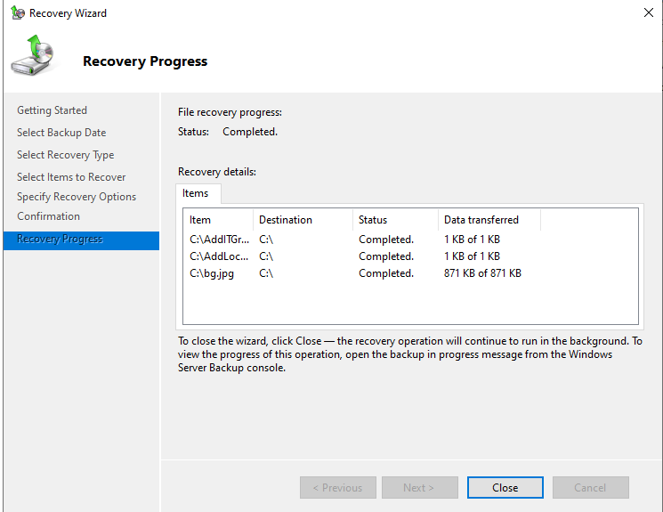

> **File recovery progress — Status: Completed.**
>
> | Item | Destination | Status | Data Transferred |
> |---|---|---|---|
> | `C:\AddITGr...` | `C:\` | Completed | 1 KB of 1 KB |
> | `C:\AddLoc...` | `C:\` | Completed | 1 KB of 1 KB |
> | `C:\bg.jpg` | `C:\` | Completed | 871 KB of 871 KB |
>
> All 3 files were recovered successfully to their original location on `C:\`. Click **Close** — recovery continues in the background if needed and can be monitored from the Windows Server Backup console.

---

## 🔄 Backup & Recovery Workflow Summary

```
Windows Server Backup Console
        │
        ├── BACKUP PATH
        │     │
        │     ├── Task 2: Select configuration (Full / Custom)
        │     ├── Task 3: Select items (volumes, system state, BMR)
        │     ├── Task 4: Choose destination type (local / network)
        │     ├── Task 5: Select destination volume
        │     └── Task 6: Backup completes → .vhdx created
        │
        ├── VHD BROWSE PATH (quick file access)
        │     │
        │     ├── Task 7: Locate .vhdx in backup folder
        │     ├── Task 8: Attach VHD in Disk Management
        │     └── Task 9: Browse files directly from mounted drive
        │
        └── RECOVERY PATH (full wizard)
              │
              ├── Task 10: Select backup date/time
              ├── Task 11a: Browse and select items to recover
              ├── Task 11b: Set destination + conflict + ACL options
              └── Task 12: Recovery completes → files restored
```

---

## 🔑 Key Concepts

| Concept | Description |
|---|---|
| **Windows Server Backup (wbadmin)** | Built-in Windows Server backup tool using VSS snapshots |
| **Full server backup** | Backs up all volumes, system state, and applications — enables bare metal recovery |
| **Bare metal recovery** | Ability to restore the entire server to dissimilar hardware from a backup |
| **System state** | Critical server components: AD DS, registry, COM+ DB, boot files |
| **VHDX** | Virtual Hard Disk format used by Windows Server Backup to store volume snapshots |
| **Attach VHD** | Mounting a `.vhd/.vhdx` in Disk Management to access its contents as a drive letter |
| **Recovery Wizard** | GUI tool for restoring files, folders, volumes, or applications from a WSB backup |
| **ACL restore** | Recovering NTFS permissions alongside file data during recovery |
| **VSS** | Volume Shadow Copy Service — enables consistent backups of open/in-use files |
| **WindowsImageBackup** | Root folder created by WSB on the backup destination containing all backup data |

---

## ⚠️ Important Notes

- **Never store backups on the same physical disk** as the data being backed up — disk failure destroys both.
- **Bare metal recovery** requires the backup to include the System Reserved partition and system state.
- Mounting the VHD as **Read-only** in Disk Management prevents accidental modification of backup data.
- The **Create copies** conflict option is the safest during recovery — it never destroys existing data.
- **ACL restoration** is critical when recovering files with specific NTFS permissions — without it, recovered files may be inaccessible to their original owners.
- Windows Server Backup stores backups in `WindowsImageBackup\<ServerName>\Backup <date-time>\` — do not rename or move this folder structure manually.
- For scheduled backups, use **Backup Schedule** instead of Backup Once — automated daily backups are essential in production.

---

## 📊 Lab Configuration Summary

| Setting | Value |
|---|---|
| Backup type | Full server |
| Backup size | 871 KB (lab) / 26.57 GB (full) |
| Destination type | Local drives |
| Backup destination | Local Disk (C:) → written to G: |
| Backup folder | `G:\WindowsImageBackup\PDC22\Backup 2026-04-18 090830\` |
| VHD file | `06fedb78-0000-0000-0000-500600000000.vhdx` |
| VHD mounted as | Drive H: |
| Recovery date | 4/18/2026 11:08 AM |
| Recovery destination | Original location (C:\) |
| Conflict handling | Create copies |
| ACL restore | Enabled |
| Files recovered | `AddITGroupToLocalAdmins.bat`, `AddLocalAdmin.bat`, `bg.jpg` |

---

## 🛠️ Requirements

- Windows Server 2016 or later
- **Windows Server Backup** feature installed:
  - Server Manager → Add Roles and Features → Features → Windows Server Backup
- A secondary volume or external disk for backup destination (separate from source)
- Administrator privileges

---

## 👨‍💻 Author

> Lab materials prepared for Windows Server administration coursework.  
> Server: `PDC22` — April 18, 2026.
