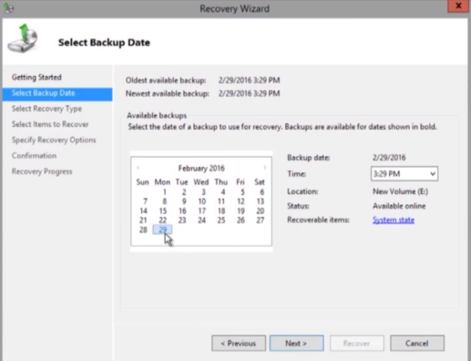
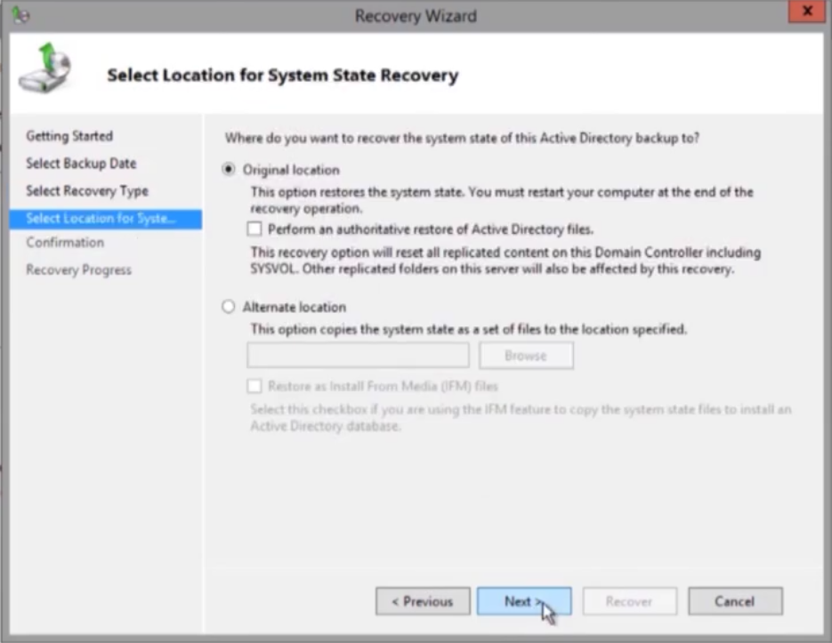

# 🔐 Lab: Active Directory System State Recovery (DSRM)

**Topic:** Restoring Active Directory via Directory Services Repair Mode (DSRM)  
**Platform:** Windows Server 2012 R2 / 2016 / 2019  
**Difficulty:** Advanced

---

## 🎯 Objectives

- Boot a domain controller into Directory Services Repair Mode (DSRM)
- Log in using the DSRM local administrator password
- Launch the Recovery Wizard and select a system state backup
- Restore Active Directory system state to its original location
- Understand authoritative vs non-authoritative restore options

---

## 🧠 When Is This Needed?

System state recovery in DSRM is required when:

- Active Directory database (`ntds.dit`) is corrupted
- Critical AD objects (OUs, users, GPOs) are accidentally deleted and replication has propagated the deletion
- The domain controller fails to start due to AD-related errors
- You need to roll back AD to a known-good state from a backup

---

## 📋 Tasks

### Task 1 — Boot into Directory Services Repair Mode (DSRM)

Restart the domain controller and press **F8** during boot to open the **Advanced Boot Options** menu. Select **Directory Services Repair Mode**.


> The **Advanced Boot Options** screen for **Windows Server 2012 R2** presents all available boot modes. **Directory Services Repair Mode** is highlighted.
>
> DSRM starts Windows with the AD DS service **stopped** — the domain controller boots as a standalone machine, allowing safe access to the AD database for repair and recovery without AD being loaded.
>
> Other relevant options visible on this screen:
>
> | Option | Use Case |
> |---|---|
> | **Safe Mode** | Loads minimal drivers — for general OS troubleshooting |
> | **Safe Mode with Networking** | Safe mode + network stack — for remote access during repair |
> | **Last Known Good Configuration** | Rolls back registry to last successful boot — for driver/config issues |
> | **Directory Services Repair Mode** | Stops AD DS — for AD database repair and system state recovery |
> | **Disable Driver Signature Enforcement** | Load unsigned drivers — for compatibility testing |
>
> ⚠️ On **Windows Server 2016+**, DSRM is accessed differently:
> ```cmd
> bcdedit /set safeboot dsrepair
> ```
> Then restart normally. After recovery, remove the flag:
> ```cmd
> bcdedit /deletevalue safeboot
> ```

---

### Task 2 — Log In with the DSRM Password

At the login screen, authenticate using the **local DSRM administrator account** — not a domain account.


> The login screen shows **`PDCSRV12\Administrator`** — the local machine administrator account used in DSRM. This is distinct from the domain `Administrator` account.
>
> The DSRM password is set during **AD DS promotion** (dcpromo / Server Manager). If the password is unknown or forgotten, it can be reset while the DC is running normally:
> ```cmd
> ntdsutil
> set dsrm password
> reset password on server null
> <enter new password>
> quit
> quit
> ```
>
> After login, Windows loads without Active Directory services — the server operates as a standalone machine for the duration of the recovery.

---

### Task 3 — Launch Recovery Wizard and Select Backup Date

Open **Windows Server Backup → Recover**. On the **Select Backup Date** step, choose the backup snapshot to restore from.



> - **Oldest available backup:** 2/29/2016 3:29 PM
> - **Newest available backup:** 2/29/2016 3:29 PM
> - **Selected date:** February 29, 2016 (shown in bold)
> - **Time:** 3:29 PM
> - **Location:** New Volume (E:)
> - **Status:** Available online
> - **Recoverable items:** **System state** ← confirms this backup contains AD DS data
>
> The **Recoverable items** field showing `System state` confirms this backup includes the AD database (`ntds.dit`), SYSVOL, registry, and boot files — everything needed for a full AD recovery.
>
> Select the date and click **Next** → on the next step select **Recovery Type: System state**.

---

### Task 4 — Select Recovery Location and Authoritative Restore Option

On the **Select Location for System State Recovery** step, choose where to restore the system state and whether to perform an authoritative restore.



> Two recovery destinations are available:
>
> **Original location** ✅ (selected)
> - Restores system state directly back to the DC — server restarts at the end
> - Option: **Perform an authoritative restore of Active Directory files**
>   - ☐ Unchecked = **Non-authoritative restore** (default)
>   - ☑ Checked = **Authoritative restore**
>
> **Alternate location**
> - Copies system state files to a specified path — useful for IFM (Install From Media) to create a new DC from backup
> - Does not restore the live AD database

---

## 🔄 Authoritative vs Non-Authoritative Restore

This is the most critical decision in AD recovery:

| | Non-Authoritative | Authoritative |
|---|---|---|
| **What it does** | Restores AD from backup, then replication overrides with current data from other DCs | Restores AD from backup and marks the restored data with higher USN so it **overrides** other DCs during replication |
| **When to use** | DC database corruption, DC hardware failure — other DCs have current, correct data | Accidental deletion of objects (users, OUs, GPOs) that have already replicated to all DCs |
| **Checkbox** | ☐ Leave unchecked | ☑ Check "Perform an authoritative restore" |
| **SYSVOL** | Replicates from other DCs | Resets SYSVOL to backup state — all DCs will receive this version |
| **Risk** | Safe — other DCs correct any divergence | High — overwrites ALL DCs with backup state — only use when intentional |

### Performing an Authoritative Restore via `ntdsutil`

After a non-authoritative restore (when the server reboots into normal mode), use `ntdsutil` to mark specific objects as authoritative before replication begins:

```cmd
ntdsutil
activate instance ntds
authoritative restore
restore subtree "OU=HR,DC=dc,DC=local"
quit
quit
```

This marks the restored OU and all its objects with a high USN, ensuring they replicate outward to other DCs rather than being overwritten.

---

## 🔄 Complete AD Recovery Workflow

```
DC fails or AD corruption detected
          │
          ▼
  Restart → F8 → Directory Services Repair Mode     ← Task 1
          │
          ▼
  Login as PDCSRV12\Administrator (DSRM password)   ← Task 2
          │
          ▼
  Open Windows Server Backup → Recover
          │
          ▼
  Select backup date (System state backup)           ← Task 3
          │
          ▼
  Select Recovery Type: System state
          │
          ▼
  Select Location: Original location                 ← Task 4
          │
          ├── Non-authoritative? → Leave checkbox empty
          │   └── Other DCs will replicate current data back
          │
          └── Authoritative? → Check the box (or use ntdsutil post-restore)
              └── Restored data overrides all other DCs
          │
          ▼
  Confirm → Recovery runs → Server restarts
          │
          ▼
  AD DS starts → Verify objects in ADUC
```

---

## 🔑 Key Concepts

| Concept | Description |
|---|---|
| **DSRM** | Directory Services Repair Mode — special boot mode that stops AD DS for repair |
| **DSRM Password** | Local admin password set during DC promotion — used to log into DSRM |
| **System State** | AD DS components: `ntds.dit`, SYSVOL, registry, boot files, COM+ database |
| **`ntds.dit`** | The Active Directory database file containing all AD objects |
| **SYSVOL** | Shared folder replicating GPOs and scripts between domain controllers |
| **Non-authoritative restore** | Restores DC from backup; replication corrects any differences from other DCs |
| **Authoritative restore** | Marks restored data with high USN — forces all other DCs to accept this version |
| **USN** | Update Sequence Number — counter used by AD replication to track changes |
| **`ntdsutil`** | Command-line tool for AD database management and authoritative restore marking |
| **IFM** | Install From Media — uses system state backup to provision a new DC without full replication |
| **`bcdedit /set safeboot dsrepair`** | Modern method to enter DSRM on Server 2016+ (replaces F8) |

---

## ⚠️ Important Notes

- **DSRM password must be documented** and stored securely (e.g., password vault) at DC promotion time — it cannot be recovered if lost without running `ntdsutil` while the DC is online.
- **Never use Authoritative Restore unless you intentionally want to roll back all DCs** — it will overwrite current AD data on every domain controller in the domain.
- For **single object recovery** (e.g., accidentally deleted user), use the **Active Directory Recycle Bin** (if enabled) before resorting to DSRM recovery — it's far faster and less disruptive.
- On **Windows Server 2016+**, the F8 boot menu is not shown by default — use `bcdedit /set safeboot dsrepair` before rebooting.
- After recovery, always run `repadmin /replsummary` and `dcdiag` to verify AD replication health.
- Keep **at least one system state backup per day** on a domain controller — the backup must be newer than the AD tombstone lifetime (default 180 days) to be usable.

---

## 📊 Lab Configuration Summary

| Setting | Value |
|---|---|
| Server | PDCSRV12 (Windows Server 2012 R2) |
| Boot mode | Directory Services Repair Mode (F8) |
| Login account | `PDCSRV12\Administrator` (DSRM local account) |
| Backup date | 2/29/2016 3:29 PM |
| Backup location | New Volume (E:) |
| Recovery type | System state |
| Restore destination | Original location |
| Authoritative restore | Not performed (non-authoritative) |

---

## 🛠️ Requirements

- Windows Server 2008 R2 or later (domain controller)
- A **system state backup** created by Windows Server Backup containing AD DS data
- The **DSRM password** set during DC promotion
- Administrator access to the server console (physical or virtual console)

---

## 👨‍💻 Author

> Lab materials prepared for Windows Server administration coursework.  
> Topic: Active Directory System State Recovery via DSRM.
