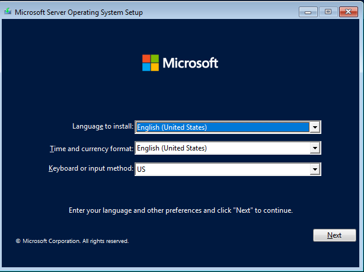
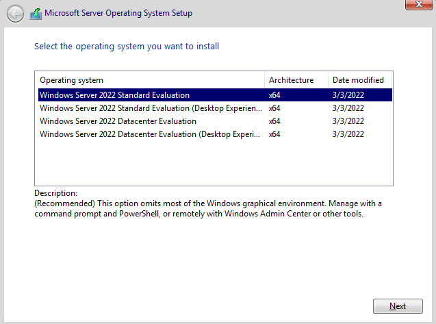
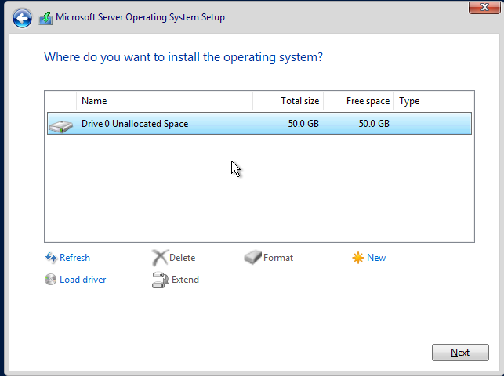
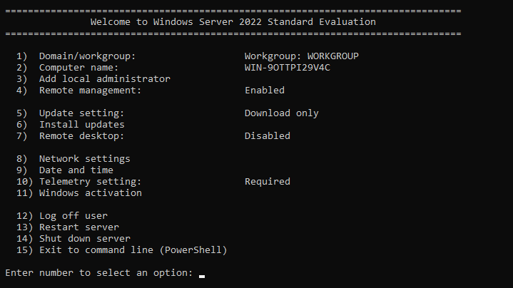
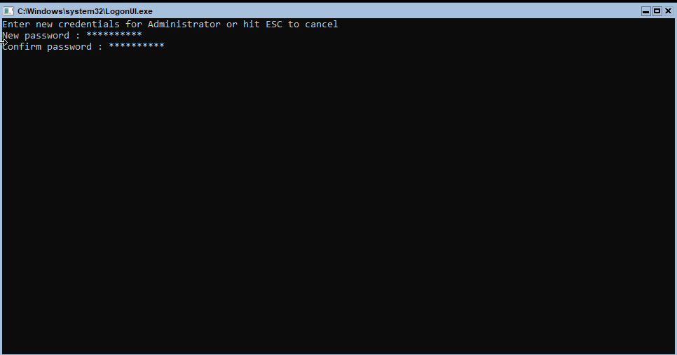
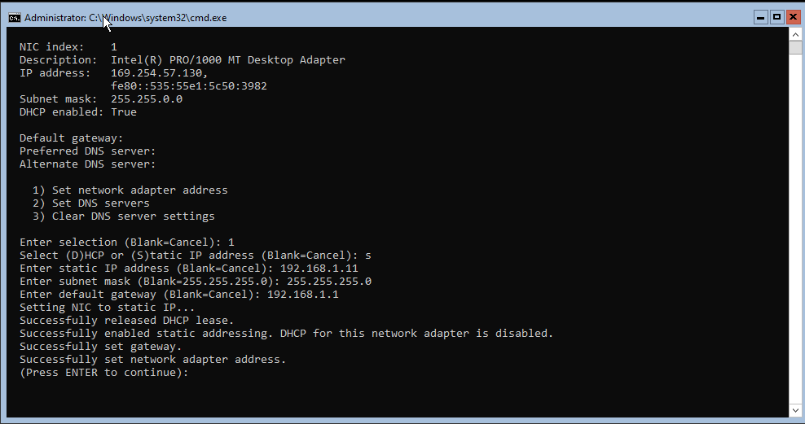
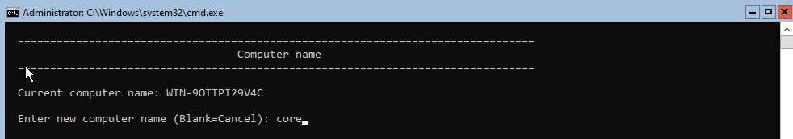
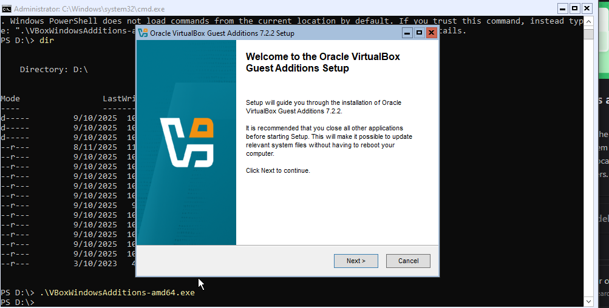

# 🖥️ Windows Server 2022 Core — Installation & Initial Configuration Lab

> **Comprehensive step-by-step lab guide covering the installation of Windows Server 2022 in Server Core mode and all post-installation configuration tasks using SConfig and the command line.**

---

## 📋 Table of Contents

| # | Task | Category |
|---|------|----------|
| [1](#-task-1--language--locale-selection) | Language & Locale Selection | Installation |
| [2](#-task-2--select-server-core-edition) | Select Server Core Edition | Installation |
| [3](#-task-3--select-installation-drive) | Select Installation Drive | Installation |
| [4](#-task-4--first-boot--sconfig-overview--set-administrator-password) | First Boot — SConfig & Set Administrator Password | Post-Install |
| [5](#-task-5--configure-network-settings) | Configure Network Settings | Networking |
| [6](#-task-6--set-date-and-time) | Set Date and Time | System Config |
| [7](#-task-7--change-computer-name) | Change Computer Name | System Config |
| [8](#-task-8--install-virtualbox-guest-additions) | Install VirtualBox Guest Additions | Tools |

---

## 📖 What is Windows Server Core?

**Windows Server Core** is a minimal installation option for Windows Server that omits the graphical shell (Explorer, taskbar, Control Panel, MMC snap-ins). The server is managed primarily through:

- **SConfig** — a menu-driven text interface for common tasks
- **PowerShell** — full scripting and remote management
- **Command Prompt (cmd.exe)** — traditional command-line tools
- **Windows Admin Center** — browser-based remote GUI management
- **Remote Server Administration Tools (RSAT)** — manage Core from a Desktop Experience machine

### ✅ Advantages of Server Core

| Advantage | Detail |
|-----------|--------|
| **Smaller attack surface** | Fewer components = fewer vulnerabilities |
| **Lower disk footprint** | ~4 GB less disk space than Desktop Experience |
| **Less RAM usage** | No GUI processes running in background |
| **Fewer updates/reboots** | GUI components require frequent patching |
| **Microsoft's recommendation** | Microsoft recommends Core for most server roles |

### ❌ Limitations

- No graphical tools locally (no Server Manager, no MMC)
- Initial configuration is CLI-only
- Requires familiarity with PowerShell and SConfig

---

## 🖥️ Lab Environment

| Component | Value |
|-----------|-------|
| **Hypervisor** | Oracle VirtualBox |
| **OS Being Installed** | Windows Server 2022 Standard Evaluation (Core) |
| **Architecture** | x64 |
| **Disk Size** | 50 GB (unallocated) |
| **Initial Hostname** | `WIN-9OTTPI29V4C` (auto-generated) |
| **New Hostname** | `core` |
| **Static IP** | `192.168.1.11` |
| **Subnet Mask** | `255.255.255.0` |
| **Default Gateway** | `192.168.1.1` |
| **NIC** | Intel(R) PRO/1000 MT Desktop Adapter |
| **VirtualBox Guest Additions** | 7.2.2 |

---

## ✅ Task 1 — Language & Locale Selection

### 📖 Explanation

The first screen of the Windows Server setup wizard prompts for regional settings before any installation begins. These settings affect:

- **Language to install** — the Windows UI language
- **Time and currency format** — locale for date/time display, number formats, currency symbols
- **Keyboard or input method** — the keyboard layout used during and after setup

In this lab, all three are set to **English (United States) / US keyboard**.

> **Key concept:** These settings can be changed post-installation via `intl.cpl` (Region settings) or PowerShell, but it is best to set them correctly at install time, especially keyboard layout — an incorrect layout can make password entry unpredictable.

### 🔧 Steps

1. Boot the VM from the Windows Server 2022 ISO.
2. The setup wizard loads — the first screen shows **Language, Time/Currency, and Keyboard** dropdowns.
3. Verify all three are set to **English (United States)** / **US**.
4. Click **Next**.
5. On the next screen, click **Install now**.

### 📸 Screenshot



---

## ✅ Task 2 — Select Server Core Edition

### 📖 Explanation

The setup wizard offers four Windows Server 2022 installation options:

| Option | GUI | Recommended For |
|--------|-----|-----------------|
| **Windows Server 2022 Standard Evaluation** | ❌ Core (no GUI) | Most server roles — minimal footprint |
| Windows Server 2022 Standard Evaluation (Desktop Experience) | ✅ Full GUI | Learning, legacy apps requiring GUI tools |
| Windows Server 2022 Datacenter Evaluation | ❌ Core (no GUI) | Virtualisation hosts, unlimited VMs |
| Windows Server 2022 Datacenter Evaluation (Desktop Experience) | ✅ Full GUI | Datacenter with GUI management |

**Selected in this lab:** `Windows Server 2022 Standard Evaluation` (first option — Core, no GUI).

The description shown at the bottom confirms:
> *"(Recommended) This option omits most of the Windows graphical environment. Manage with a command prompt and PowerShell, or remotely with Windows Admin Center or other tools."*

> **Key concept:** The choice between **Standard** and **Datacenter** is a licensing distinction — Datacenter allows unlimited Windows Server VMs on the host, Standard allows only 2. For lab use, either Evaluation edition is free for 180 days.

### 🔧 Steps

1. On the **"Select the operating system you want to install"** screen, select **Windows Server 2022 Standard Evaluation** (the first row — Core, no Desktop Experience suffix).
2. Confirm the description at the bottom mentions "omits most of the Windows graphical environment".
3. Click **Next**.
4. Accept the license terms → click **Next**.
5. Choose **Custom: Install Windows only (advanced)** for a clean installation.

### 📸 Screenshot



---

## ✅ Task 3 — Select Installation Drive

### 📖 Explanation

The drive selection screen shows all available disks and partitions. In this VirtualBox VM, there is a single virtual disk:

- **Drive 0 Unallocated Space** — 50.0 GB total, 50.0 GB free

Since the disk is entirely unallocated (no existing partitions), setup will automatically create the necessary system partitions (EFI System Partition, Microsoft Reserved Partition, and the primary OS partition) when you click Next.

If you were upgrading or installing alongside an existing OS, you would see existing partitions here and need to choose where to install.

> **Key concept:** For a fresh VM installation, simply select the unallocated space and click **Next** — Windows Setup handles partitioning automatically. Manual partitioning (New, Format, Delete) is only needed when customising partition sizes or preparing specific disk layouts.

### 🔧 Steps

1. On the **"Where do you want to install the operating system?"** screen, select **Drive 0 Unallocated Space**.
2. Leave the disk unpartitioned — let Setup create partitions automatically.
3. Click **Next**.
4. Installation begins — Windows copies files and expands them to the disk. The VM will reboot automatically (typically 1–3 times).
5. Wait for installation to complete (~5–15 minutes depending on hardware/VM speed).

### 📸 Screenshot



---

## ✅ Task 4 — First Boot: SConfig Overview & Set Administrator Password

### 📖 Explanation

After installation completes and the server reboots, you are prompted to **set the Administrator password** (since Core has no GUI password dialog). Once set, the server boots directly into **SConfig** — the Server Configuration menu.

### SConfig Menu Overview

SConfig is a numbered menu system that provides access to the most common post-installation configuration tasks without requiring PowerShell knowledge:

| Option | Function | Current Value |
|--------|----------|---------------|
| **1** | Domain/workgroup | `WORKGROUP` |
| **2** | Computer name | `WIN-9OTTPI29V4C` |
| **3** | Add local administrator | — |
| **4** | Remote management | `Enabled` |
| **5** | Update setting | `Download only` |
| **6** | Install updates | — |
| **7** | Remote desktop | `Disabled` |
| **8** | Network settings | — |
| **9** | Date and time | — |
| **10** | Telemetry setting | `Required` |
| **11** | Windows activation | — |
| **12** | Log off user | — |
| **13** | Restart server | — |
| **14** | Shut down server | — |
| **15** | Exit to command line (PowerShell) | — |

> **Key concept:** SConfig runs `C:\Windows\System32\sconfig.cmd` at login. You can exit to PowerShell at any time by choosing option **15**, and return to SConfig by typing `sconfig` at the PowerShell prompt.

### Setting the Administrator Password

On first boot, before SConfig loads, `LogonUI.exe` prompts for new Administrator credentials. The password must meet Windows complexity requirements:
- Minimum 8 characters (domain default) or as set by local policy
- Must contain characters from 3 of: uppercase, lowercase, numbers, special characters

### 🔧 Steps

**Set Administrator Password (first boot prompt):**

1. On the very first boot after installation, a black screen with `LogonUI.exe` appears.
2. You are prompted: `Enter new credentials for Administrator or hit ESC to cancel`
3. Type a strong password → press Enter.
4. Confirm the password → press Enter.
5. The password is set and SConfig loads automatically.

**Navigate SConfig:**

6. SConfig displays the numbered menu. Type a number and press Enter to select an option.
7. To return to SConfig from PowerShell at any time: type `sconfig` → Enter.
8. To exit SConfig to PowerShell: type `15` → Enter.

### 📸 Screenshots

**SConfig Main Menu:**



---

## ✅ Task 5 — Configure Network Settings

### 📖 Explanation

By default, the network adapter is set to **DHCP** — it received an APIPA address (`169.254.57.130`) because no DHCP server was available. For a server, a **static IP address** is essential for:

- Predictable access from clients and administrators
- DNS registration stability
- Domain joining and AD replication

The screenshot shows the full interaction of configuring a static IP via SConfig option **8 → Network Settings → option 1 (Set network adapter address)**:

| Setting | Value |
|---------|-------|
| **NIC** | Intel(R) PRO/1000 MT Desktop Adapter (index 1) |
| **Previous IP** | `169.254.57.130` (APIPA — no DHCP available) |
| **New IP** | `192.168.1.11` (static) |
| **Subnet mask** | `255.255.255.0` |
| **Default gateway** | `192.168.1.1` |
| **DHCP after** | Disabled |

> **Key concept:** APIPA addresses (`169.254.x.x`) are self-assigned when DHCP fails. They indicate the server cannot reach a DHCP server. Always assign a static IP to servers.

### 🔧 Steps

1. In SConfig, type `8` → Enter to open **Network settings**.
2. The current NIC is shown (NIC index 1 — Intel PRO/1000).
3. Type `1` → Enter to **Set network adapter address**.
4. When prompted `Select (D)HCP or (S)tatic IP address`, type `s` → Enter.
5. Enter static IP address: `192.168.1.11` → Enter.
6. Enter subnet mask (blank = 255.255.255.0): `255.255.255.0` → Enter.
7. Enter default gateway: `192.168.1.1` → Enter.
8. Confirm success messages:
   - `Successfully released DHCP lease.`
   - `Successfully enabled static addressing. DHCP for this network adapter is disabled.`
   - `Successfully set gateway.`
   - `Successfully set network adapter address.`
9. Press Enter to return to the Network Settings menu.
10. Type `2` → Enter to **Set DNS servers**.
11. Enter preferred DNS server IP → Enter.
12. Press Enter to return, then `Escape` or blank to go back to SConfig main menu.

**Verify via PowerShell (option 15):**
```powershell
Get-NetIPAddress -InterfaceAlias "Ethernet"
Get-NetRoute -InterfaceAlias "Ethernet"
```

### 📸 Screenshot



---

## ✅ Task 6 — Set Date and Time

### 📖 Explanation

Accurate time is critical for Windows Server, especially for:

- **Kerberos authentication** — Active Directory rejects tickets if the time difference between client and DC exceeds **5 minutes** (the default Kerberos clock skew tolerance)
- **SSL/TLS certificates** — certificate validity is time-based
- **Event log accuracy** — timestamps in logs must be reliable for auditing and troubleshooting
- **Scheduled tasks** — rely on system time

SConfig option **9** opens the familiar **Date and Time** GUI dialog (one of the few GUI windows that appears in Core mode — it runs as a separate process).

The screenshot shows:
- **Date:** Sunday, April 19, 2026
- **Time:** 7:22:35 PM
- **Time zone:** (UTC-08:00) Pacific Time (US & Canada)
- **DST notice:** Daylight Saving Time ends Sunday, November 1, 2026

> **Key concept:** After joining a domain, Windows clients synchronise time with a Domain Controller automatically via **W32tm** (Windows Time Service). Before joining, set the correct time and timezone manually to avoid Kerberos failures during the domain join.

### 🔧 Steps

1. In SConfig, type `9` → Enter to open **Date and time**.
2. The Date and Time dialog opens.
3. Click **Change date and time...** to modify the date/time.
4. Set the correct date and time → click **OK**.
5. Click **Change time zone...** to set the correct timezone.
6. Select your timezone from the list → click **OK**.
7. Click **OK** to close the dialog and return to SConfig.

**Via PowerShell (alternative):**
```powershell
# Set timezone
Set-TimeZone -Id "Egypt Standard Time"

# Set date and time manually
Set-Date -Date "2026-04-19 19:22:35"

# Sync with NTP server
w32tm /resync /force

# Check time sync status
w32tm /query /status
```

### 📸 Screenshot



---

## ✅ Task 7 — Change Computer Name

### 📖 Explanation

Windows Server auto-generates a random computer name during installation (e.g., `WIN-9OTTPI29V4C`). Changing it to a meaningful name is important for:

- **Network identification** — admins can identify servers by name
- **DNS registration** — the hostname becomes a DNS record
- **Active Directory** — the computer name is the machine account name in the domain
- **Remote management** — connecting by name is easier than by IP

SConfig option **2** presents a simple prompt to change the computer name. A **restart is required** for the name change to take effect.

The screenshot shows:
- **Current name:** `WIN-9OTTPI29V4C`
- **New name entered:** `core`

> **Key concept:** Computer names must be 15 characters or fewer (NetBIOS limit), contain only letters, numbers, and hyphens, and must not start or end with a hyphen. Once a machine joins a domain, renaming it also updates the AD computer account.

### 🔧 Steps

1. In SConfig, type `2` → Enter to open **Computer name**.
2. The current computer name is displayed: `WIN-9OTTPI29V4C`.
3. Type the new name: `core` → Enter.
4. SConfig will prompt to restart — type `yes` → Enter to restart immediately, or `no` to restart later.
5. After the restart, log in again — the hostname is now `core`.

**Verify via PowerShell:**
```powershell
# Check hostname
hostname
$env:COMPUTERNAME

# Change name via PowerShell (alternative to SConfig)
Rename-Computer -NewName "core" -Restart
```

### 📸 Screenshot



---

## ✅ Task 8 — Install VirtualBox Guest Additions

### 📖 Explanation

**VirtualBox Guest Additions** are a set of drivers and utilities installed **inside the guest VM** that improve performance and integration between the host and guest:

| Feature | Benefit |
|---------|---------|
| **Seamless mouse integration** | Mouse moves freely between host and VM without capture |
| **Shared clipboard** | Copy/paste text between host and guest |
| **Shared folders** | Access host filesystem from inside the VM |
| **Better display drivers** | Proper screen resolutions and dynamic resizing |
| **Time synchronisation** | Guest clock syncs with host |
| **Faster I/O** | Optimised storage and network drivers |

Since Server Core has no GUI desktop, the installation is done via **PowerShell** after mounting the Guest Additions ISO:

The screenshot shows:
1. The `D:\` drive listing showing the VirtualBox Guest Additions files
2. Running `.\VBoxWindowsAdditions-amd64.exe` which launches the setup wizard
3. The Guest Additions 7.2.2 setup wizard appearing as a GUI overlay on the Core shell

> **Key concept:** Even in Server Core mode, GUI installers (`.exe` with setup wizards) can still run — Core only omits the Windows shell (Explorer, taskbar), not the Win32 GUI subsystem itself. Wizards will display normally.

### 🔧 Steps

**Mount the Guest Additions ISO:**

1. In VirtualBox menu: **Devices** → **Insert Guest Additions CD image...**
2. This mounts the `VBoxGuestAdditions.iso` as drive `D:\` in the VM.

**Install via PowerShell:**

3. In SConfig, type `15` → Enter to exit to PowerShell.
4. Navigate to the D: drive:
   ```powershell
   D:
   dir
   ```
5. Confirm you see `VBoxWindowsAdditions-amd64.exe` in the listing.
6. Run the installer:
   ```powershell
   .\VBoxWindowsAdditions-amd64.exe
   ```
7. The setup wizard appears. Click **Next** → accept defaults → **Install**.
8. Allow the driver installation prompts.
9. Click **Finish** → reboot when prompted.

**Verify installation:**
```powershell
# Check VirtualBox services are running
Get-Service VBoxService
Get-Service VBoxMouse

# Check installed programs
Get-WmiObject Win32_Product | Where-Object Name -like "*VirtualBox*"
```

### 📸 Screenshot



---

## 📚 SConfig — Complete Option Reference

```
==========================================
  Welcome to Windows Server 2022 Standard
==========================================

 1) Domain/workgroup         — Join/leave domain or workgroup
 2) Computer name            — Rename this server
 3) Add local administrator  — Create additional admin accounts
 4) Remote management        — Enable/disable WinRM (for remote PowerShell)

 5) Update setting           — Configure Windows Update policy
 6) Install updates          — Check and install updates now
 7) Remote desktop           — Enable/disable RDP access

 8) Network settings         — Set IP, subnet, gateway, DNS
 9) Date and time            — Set clock and timezone
10) Telemetry setting        — Configure diagnostic data level
11) Windows activation       — Activate Windows license

12) Log off user             — Log off current session
13) Restart server           — Reboot the server
14) Shut down server         — Power off the server
15) Exit to command line     — Drop to PowerShell prompt
```

---

## 🛠️ Essential Server Core Commands

```powershell
# ── Navigation & System Info ──────────────────────────────────
hostname                              # Display current computer name
$env:COMPUTERNAME                     # Same via env variable
systeminfo                            # Full system information
winver                                # Windows version (opens GUI dialog)
Get-ComputerInfo                      # Detailed system info (PowerShell)

# ── SConfig ───────────────────────────────────────────────────
sconfig                               # Launch SConfig menu
# Press 15 in SConfig to exit to PowerShell

# ── Network Configuration ─────────────────────────────────────
Get-NetAdapter                        # List all NICs
Get-NetIPAddress                      # List IP addresses
Get-NetIPConfiguration                # Full NIC config

# Set static IP
New-NetIPAddress -InterfaceAlias "Ethernet" -IPAddress 192.168.1.11 `
  -PrefixLength 24 -DefaultGateway 192.168.1.1

# Set DNS servers
Set-DnsClientServerAddress -InterfaceAlias "Ethernet" `
  -ServerAddresses 192.168.1.1,8.8.8.8

# Remove old IP (if changing from DHCP)
Remove-NetIPAddress -InterfaceAlias "Ethernet" -Confirm:$false

# ── Computer Name ─────────────────────────────────────────────
Rename-Computer -NewName "core" -Restart
Rename-Computer -NewName "core" -DomainCredential (Get-Credential) -Restart

# ── Date & Time ───────────────────────────────────────────────
Set-TimeZone -Id "Arab Standard Time"
Get-TimeZone
w32tm /resync /force
w32tm /query /status

# ── Domain Join ───────────────────────────────────────────────
Add-Computer -DomainName "DC.local" -Credential (Get-Credential) -Restart

# ── Remote Desktop ────────────────────────────────────────────
Set-ItemProperty -Path "HKLM:\System\CurrentControlSet\Control\Terminal Server" `
  -Name fDenyTSConnections -Value 0
Enable-NetFirewallRule -DisplayGroup "Remote Desktop"

# ── Windows Update (via PSWindowsUpdate module) ───────────────
Install-Module PSWindowsUpdate -Force
Get-WindowsUpdate
Install-WindowsUpdate -AcceptAll -AutoReboot

# ── Role Installation ─────────────────────────────────────────
# Install DNS Server role
Install-WindowsFeature DNS -IncludeManagementTools

# Install AD DS role
Install-WindowsFeature AD-Domain-Services -IncludeManagementTools

# List all available features
Get-WindowsFeature | Where-Object InstallState -eq "Available"
```

---

## 🔍 Troubleshooting Guide

| Symptom | Likely Cause | Fix |
|---------|--------------|-----|
| IP stuck on `169.254.x.x` | DHCP server unreachable | Set static IP via SConfig option 8 |
| Can't ping gateway | Wrong IP/subnet/gateway | Recheck settings in SConfig option 8 |
| SConfig doesn't load at startup | Exited to PowerShell in previous session | Type `sconfig` at the prompt |
| Password rejected at first boot | Doesn't meet complexity requirements | Use uppercase + lowercase + number + symbol |
| Domain join fails | Time difference > 5 minutes | Sync time with `w32tm /resync /force` |
| Domain join fails | DNS not pointing to DC | Set DNS to DC's IP via SConfig option 8 → 2 |
| VBoxWindowsAdditions fails | Missing Visual C++ runtime | Run installer anyway — it includes the runtime |
| Remote Desktop can't connect | RDP disabled (option 7) | Enable via SConfig option 7 or PowerShell |
| Cannot find drive D: after inserting ISO | ISO not mounted in VirtualBox | Devices → Insert Guest Additions CD image |

---

## 📌 Key Concepts Summary

> **Server Core** — A minimal Windows Server installation without the graphical shell. Managed via SConfig, PowerShell, and remote tools. Microsoft's recommended installation type for most server roles.

> **SConfig** — A numbered menu-driven text interface for common post-installation configuration tasks. Accessible by typing `sconfig` at any PowerShell or cmd prompt.

> **Static IP** — Servers must have fixed IP addresses for reliable DNS registration, domain services, and remote management. APIPA addresses (`169.254.x.x`) indicate a failed DHCP lease.

> **Kerberos Time Requirement** — Active Directory authentication fails if the clock difference between the client and Domain Controller exceeds 5 minutes. Always set accurate time before joining a domain.

> **Computer Name** — The NetBIOS/DNS hostname of the server. Max 15 characters. Must be changed from the auto-generated name before production use. Requires a restart to apply.

> **VirtualBox Guest Additions** — Drivers and utilities that improve VM performance and host/guest integration. Installed from a mounted ISO even in Core mode, because the Win32 GUI subsystem is still present.

---

*Lab environment: Oracle VirtualBox 7.x | Windows Server 2022 Standard Evaluation (Core) | x64*
