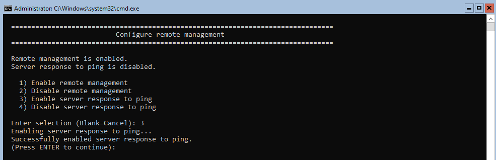
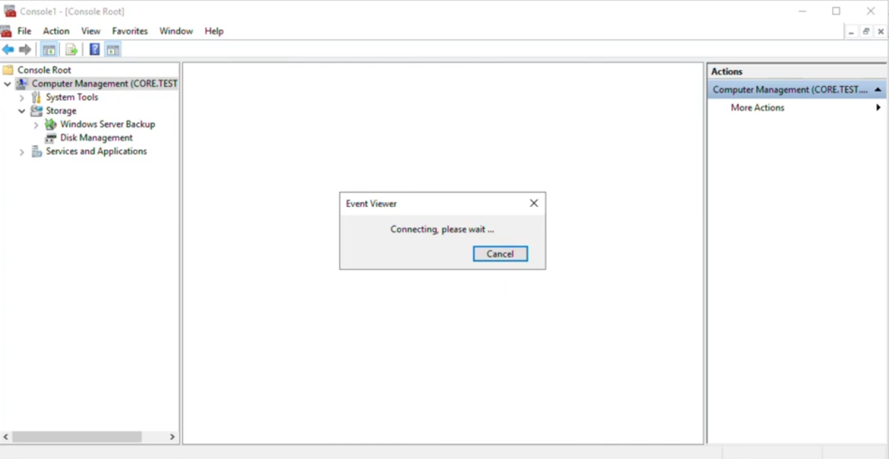
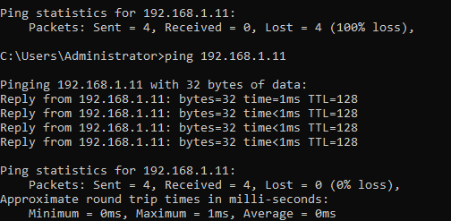
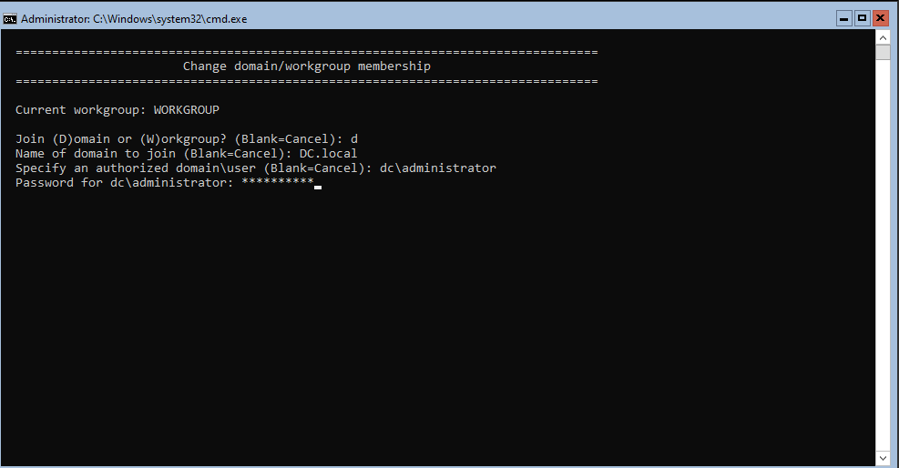
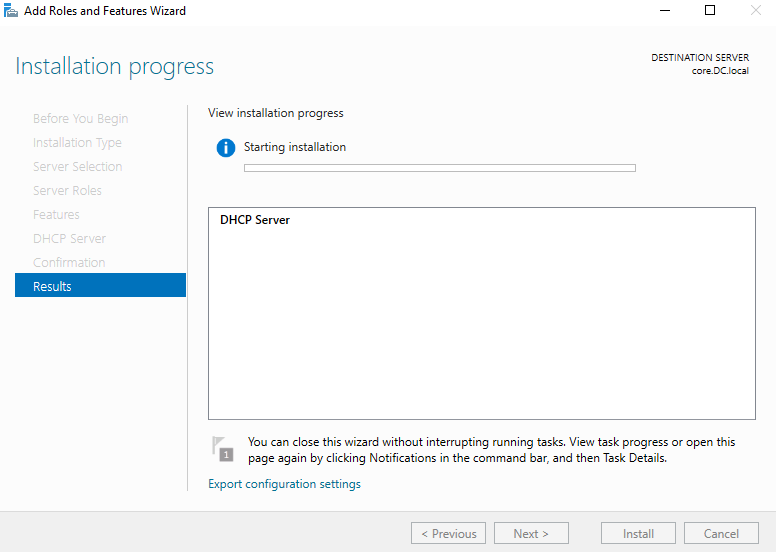
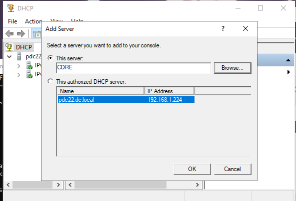
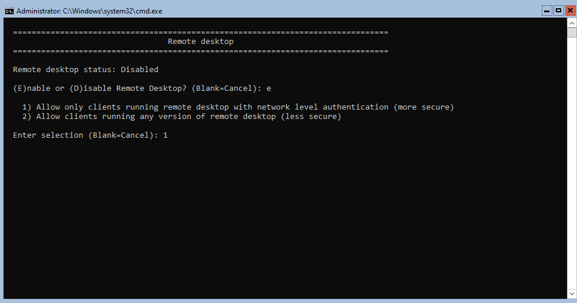
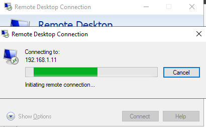

# Windows Server 2022 Core — Remote Management & Role Deployment Lab

> **Comprehensive step-by-step guide: enabling ping, domain join, Server Manager integration, DHCP role deployment, Remote Desktop, and MMC remote management on a Server Core machine.**

---

## Table of Contents

| # | Task | Category |
|---|------|----------|
| [1](#task-1--enable-server-response-to-ping) | Enable Server Response to Ping | Firewall / Remote Mgmt |
| [2](#task-2--verify-ping-connectivity) | Verify Ping Connectivity | Testing |
| [3](#task-3--join-the-core-server-to-the-domain) | Join Core to the Domain | Active Directory |
| [4](#task-4--add-core-to-server-manager) | Add Core to Server Manager | Remote Management |
| [5](#task-5--install-dhcp-role-on-core-remotely) | Install DHCP Role on Core Remotely | Role Deployment |
| [6](#task-6--add-core-to-dhcp-console) | Add Core to DHCP Console | DHCP Management |
| [7](#task-7--enable-remote-desktop--connect-remotely) | Enable Remote Desktop & Connect Remotely | RDP |
| [8](#task-8--manage-core-via-mmc-remotely) | Manage Core via MMC Remotely | MMC / Remote Tools |

---

## Lab Environment

| Component | Value |
|-----------|-------|
| **Core Server Hostname** | `core` / `core.DC.local` |
| **Core Server IP** | `192.168.1.11` |
| **Domain Controller** | `pdc22.dc.local` |
| **DC IP** | `192.168.1.224` |
| **Domain** | `DC.local` |
| **Management Machine** | Windows Server 2022 Desktop Experience (PDC22) |
| **Remote Admin Account** | `dc\administrator` |

---

## Task 1 — Enable Server Response to Ping

### Explanation

By default, Windows Server Core **blocks ICMP Echo Request (ping) responses** via Windows Firewall. This is a hardening measure — a server that does not respond to ping is harder to discover via network scanning.

In a managed lab or enterprise environment, enabling ping responses is useful for:
- **Connectivity verification** — quickly confirm the server is reachable
- **Network troubleshooting** — diagnose routing and firewall issues
- **Monitoring systems** — most agents use ICMP to check host availability

This task uses **SConfig option 4 (Remote Management)** to enable ping. The menu shows:

```
Remote management is enabled.
Server response to ping is disabled.

  1) Enable remote management
  2) Disable remote management
  3) Enable server response to ping      <- selected
  4) Disable server response to ping
```

After selecting option **3**, SConfig confirms:
```
Enabling server response to ping...
Successfully enabled server response to ping.
```

> **Key concept:** SConfig option 4 modifies the Windows Firewall rule `File and Printer Sharing (Echo Request - ICMPv4-In)`. This is equivalent to running `Enable-NetFirewallRule` in PowerShell.

### Steps

**Via SConfig (on the Core server):**

1. In SConfig, type `4` then Enter — opens **Remote management**.
2. Status shows: `Remote management is enabled` and `Server response to ping is disabled`.
3. Type `3` then Enter — **Enable server response to ping**.
4. Confirm: `Successfully enabled server response to ping.`
5. Press Enter to return to SConfig.

**Via PowerShell (alternative):**
```powershell
# Enable ICMPv4 inbound rule
Enable-NetFirewallRule -DisplayName "File and Printer Sharing (Echo Request - ICMPv4-In)"

# Enable ICMPv6 as well
Enable-NetFirewallRule -DisplayName "File and Printer Sharing (Echo Request - ICMPv6-In)"

# Verify
Get-NetFirewallRule -DisplayName "*Echo Request*" | Select-Object DisplayName, Enabled
```

**Via netsh (legacy):**
```cmd
netsh advfirewall firewall set rule name="File and Printer Sharing (Echo Request - ICMPv4-In)" new enable=yes
```

### Screenshot




---

## Task 2 — Verify Ping Connectivity

### Explanation

After enabling ping on the Core server, verify from the management machine (PDC22) that ICMP is now replied to successfully.

The screenshot shows two consecutive ping attempts to `192.168.1.11`:

**Before enabling ping (top section):**
```
Packets: Sent = 4, Received = 0, Lost = 4 (100% loss)
```
All packets lost — firewall was blocking ICMP.

**After enabling ping (bottom section):**
```
Reply from 192.168.1.11: bytes=32 time=1ms TTL=128
Packets: Sent = 4, Received = 4, Lost = 0 (0% loss)
```

**TTL=128** confirms this is a Windows machine (Linux defaults to TTL=64, Cisco routers to TTL=255).

> **Key concept:** `TTL=128` is the Windows default hop limit. Each router decrements TTL by 1. A value of 128 on the reply means zero hops between the two machines (same subnet or direct link).

### Steps

1. On the **management machine** (PDC22), open **Command Prompt**.
2. Run: `ping 192.168.1.11`
3. Confirm **0% packet loss** and sub-1ms round-trip times.
4. For continuous monitoring: `ping 192.168.1.11 -t` (Ctrl+C to stop).
5. Ping by hostname (requires DNS): `ping core.DC.local`

### Screenshot




---

## Task 3 — Join the Core Server to the Domain

### Explanation

Joining the Core server to **DC.local** is a prerequisite for:
- Remote management via Server Manager, RSAT, and MMC
- Centralised authentication with domain accounts
- Group Policy application
- Kerberos-based secure communication between servers

The screenshot shows the SConfig **"Change domain/workgroup membership"** workflow:
```
Current workgroup: WORKGROUP

Join (D)omain or (W)orkgroup? -> d
Name of domain to join:       -> DC.local
Authorized domain\user:       -> dc\administrator
Password for dc\administrator: **********
```

> **Key concept:** Before joining a domain, the server's **DNS must point to the Domain Controller**. AD domain join uses DNS to locate LDAP and Kerberos services. If DNS is incorrect, the join fails with "domain not found."

### Steps

**Prerequisites — verify first:**
```powershell
# Confirm DNS points to the DC
Get-DnsClientServerAddress
# Should show 192.168.1.224

# Confirm DC is reachable
ping 192.168.1.224
nslookup DC.local
```

**Via SConfig:**

1. In SConfig, type `1` then Enter — **Domain/workgroup**.
2. Status: `Current workgroup: WORKGROUP`.
3. Type `d` then Enter — join a **Domain**.
4. Enter domain name: `DC.local` then Enter.
5. Enter authorized account: `dc\administrator` then Enter.
6. Enter the administrator password then Enter.
7. SConfig confirms success and prompts for a restart.
8. Type `yes` then Enter to restart.
9. After restart, the server is a member of `DC.local`.

**Via PowerShell (alternative):**
```powershell
Add-Computer -DomainName "DC.local" `
             -Credential (Get-Credential "dc\administrator") `
             -Restart -Force
```

**Verify domain membership after restart:**
```powershell
(Get-WmiObject Win32_ComputerSystem).Domain
# Returns: DC.local

systeminfo | findstr "Domain"
```

### Screenshot




---

## Task 4 — Add Core to Server Manager

### Explanation

**Server Manager** on the Desktop Experience machine (PDC22) can manage remote servers — including Server Core — through **WinRM (Windows Remote Management)**. This gives a GUI view of roles, features, events, services, and performance on the Core server without requiring a local login.

The screenshot shows the **Add Servers** dialog:
- **Tab:** Active Directory (domain search)
- **Location:** DC
- **Name (CN):** `core` — searched and found
- **Result:** `core — Windows Server 2022 Standard Evaluation` (1 Computer found)
- **Selected panel:** `core` added under `DC.LOCAL (1)`

> **Key concept:** Server Manager uses **WinRM (TCP 5985/5986)** and **WMI** to communicate with remote servers. WinRM is enabled by default on Windows Server 2012 and later. Both machines must be domain-joined (or in a trusted workgroup) for Kerberos authentication to work.

### Steps

**On the management machine (PDC22 — Desktop Experience):**

1. Open **Server Manager** (Start -> Server Manager or run `servermanager.exe`).
2. Click **Manage** (top-right) -> **Add Servers**.
3. The **Add Servers** dialog opens with three tabs: Active Directory, DNS, Import.
4. Ensure the **Active Directory** tab is selected.
5. In **Name (CN)**, type `core` -> click **Find Now**.
6. Result: `core — Windows Server 2022 Standard Evaluation`.
7. Select `core` in the left pane -> click the **arrow (->)** button to move it to **Selected**.
8. Confirm `core` appears under `DC.LOCAL (1)` on the right.
9. Click **OK**.
10. In Server Manager -> **All Servers** — `core` now appears in the server list.

**Verify WinRM on Core:**
```powershell
# Check WinRM service is running
Get-Service WinRM

# Test WinRM from management machine
Test-WSMan -ComputerName core.DC.local -Authentication Kerberos
```

### Screenshot




---

## Task 5 — Install DHCP Role on Core Remotely

### Explanation

One of the most powerful features of Server Manager's remote management is the ability to **install roles and features on remote servers** — including Server Core — entirely through the GUI on the management machine. The installation runs on the destination server (`core.DC.local`); no direct console access is needed.

The screenshot shows the **Add Roles and Features Wizard** at the **Installation Progress** stage:
- **Destination Server:** `core.DC.local` (top-right corner)
- **Role being installed:** `DHCP Server`
- **Status:** Starting installation

The wizard left-panel breadcrumb confirms the full workflow:
Before You Begin -> Installation Type -> Server Selection -> Server Roles -> Features -> DHCP Server -> Confirmation -> **Results**

> **Key concept:** When "Remote server" is chosen in the Server Selection step, the binaries are installed on the remote machine using RPC (TCP 135 + high dynamic ports). No RDP or physical access to Core is needed.

### Steps

**On the management machine (PDC22):**

1. Open **Server Manager** -> **Manage** -> **Add Roles and Features**.
2. Click **Next** past the "Before You Begin" screen.
3. **Installation Type:** select **Role-based or feature-based installation** -> Next.
4. **Server Selection:** select **core.DC.local** from the server pool -> Next.
   - If `core` is not listed, complete Task 4 first.
5. **Server Roles:** check **DHCP Server** -> click **Add Features** when prompted -> Next.
6. Click **Next** through Features and DHCP Server information screens.
7. **Confirmation:** review and click **Install**.
8. Monitor **Installation Progress** and wait for completion.
9. Click **Close** when done.

**Via PowerShell remoting (alternative):**
```powershell
# Install remotely
Invoke-Command -ComputerName core.DC.local -ScriptBlock {
    Install-WindowsFeature DHCP -IncludeManagementTools
}

# Authorize in Active Directory
Add-DhcpServerInDC -DnsName "core.DC.local" -IPAddress 192.168.1.11

# Verify
Get-WindowsFeature -ComputerName core.DC.local -Name DHCP
```

### Screenshot




---

## Task 6 — Add Core to DHCP Console

### Explanation

After installing the DHCP Server role, the **DHCP Management Console** (`dhcpmgmt.msc`) must be updated to include the new DHCP server (`CORE`) so its scopes, leases, and options can be managed from the management GUI.

The screenshot shows the **Add Server** dialog in the DHCP console:
- **This server:** `CORE` typed manually
- **This authorized DHCP server:** `pdc22.dc.local — 192.168.1.224` (already in console)

The left pane shows `pdc22` with existing IPv4/IPv6 pools visible. `CORE` is being added as a second managed DHCP server.

> **Key concept:** A DHCP server must be **authorized in Active Directory** before it can issue leases on an AD domain network. Unauthorized DHCP servers are silently blocked by Windows DHCP clients when an authorized server is present. Authorization is done via `Add-DhcpServerInDC` or the DHCP console.

### Steps

1. Open **DHCP console**: Start -> Windows Administrative Tools -> DHCP, or run `dhcpmgmt.msc`.
2. Right-click **DHCP** (root node) -> **Add Server**.
3. Select **This server** and type `CORE` -> click **OK**.
   - Or click **Browse** to locate it in Active Directory.
4. `CORE` now appears in the DHCP console tree.
5. Expand **CORE** -> **IPv4** to configure scopes.

**Authorize and verify via PowerShell:**
```powershell
# Authorize CORE in AD
Add-DhcpServerInDC -DnsName "core.DC.local" -IPAddress 192.168.1.11

# List all authorized DHCP servers
Get-DhcpServerInDC

# Restart DHCP service on Core to pick up authorization
Invoke-Command -ComputerName core.DC.local -ScriptBlock {
    Restart-Service DHCPServer
}

# Create a test scope remotely
Add-DhcpServerv4Scope -ComputerName core.DC.local `
    -Name "Lab Scope" `
    -StartRange 192.168.1.50 `
    -EndRange 192.168.1.100 `
    -SubnetMask 255.255.255.0
```

### Screenshot




---

## Task 7 — Enable Remote Desktop & Connect Remotely

### Explanation

**Remote Desktop Protocol (RDP)** provides a full interactive session on the Core server. Even without a graphical shell, RDP connects and presents SConfig and PowerShell in a windowed session — making remote administration more comfortable than working through the VM console.

**SConfig option 7 — Remote Desktop** offers two security levels:

| Option | Authentication | Security | Use Case |
|--------|---------------|----------|----------|
| **1 — NLA only** | Network Level Authentication required before session | More secure | Production / domain environments |
| **2 — Any version** | No NLA requirement | Less secure | Legacy clients, compatibility testing |

**NLA (Network Level Authentication)** pre-authenticates the user before establishing the full RDP session — preventing unauthorized users from consuming server resources or triggering login-screen vulnerabilities.

The second screenshot shows **Remote Desktop Connection** (`mstsc.exe`) on the management machine connecting to `192.168.1.11` (Core).

> **Key concept:** RDP listens on **TCP port 3389**. On Server Core, enabling RDP via SConfig also opens the necessary Windows Firewall rules automatically.

### Steps

**Enable RDP on Core via SConfig:**

1. In SConfig, type `7` then Enter — **Remote desktop**.
2. Current status: `Remote desktop status: Disabled`.
3. Type `e` then Enter — **Enable**.
4. Two options appear — type `1` then Enter (NLA — recommended for domain environments).
5. RDP is now enabled. Press Enter to return to SConfig.

**Connect from the management machine:**

6. Open **Remote Desktop Connection** (`mstsc.exe`).
7. In the **Computer** field, enter `192.168.1.11` or `core.DC.local`.
8. Click **Connect**.
9. Enter credentials: `dc\administrator` (domain) or `core\administrator` (local).
10. Accept any certificate prompts — the RDP session opens to a SConfig/PowerShell prompt.

**Enable via PowerShell (alternative on Core):**
```powershell
# Enable RDP
Set-ItemProperty -Path "HKLM:\System\CurrentControlSet\Control\Terminal Server" `
    -Name fDenyTSConnections -Value 0

# Require NLA
Set-ItemProperty `
    -Path "HKLM:\System\CurrentControlSet\Control\Terminal Server\WinStations\RDP-Tcp" `
    -Name UserAuthentication -Value 1

# Open firewall for RDP
Enable-NetFirewallRule -DisplayGroup "Remote Desktop"

# Verify RDP is listening on port 3389
netstat -an | findstr 3389
```

### Screenshots

**Enabling RDP with NLA via SConfig:**




**Connecting via Remote Desktop Connection (`mstsc.exe`):**




---

## Task 8 — Manage Core via MMC Remotely

### Explanation

**MMC (Microsoft Management Console)** is the framework for Windows administrative snap-ins. Even though Core has no local GUI, snap-ins on a Desktop Experience machine can connect **remotely** to the Core server, providing graphical access to:

- **Computer Management** — Device Manager, Disk Management, Services, Event Viewer, Shared Folders, Local Users and Groups
- **Event Viewer** — Windows event logs (Application, System, Security)
- **Disk Management** — volumes, partitions, drive letters
- **Services** — start, stop, configure services

The screenshot shows:
- **MMC Console** with **Computer Management (CORE.TEST...)** loaded remotely
- Left tree: System Tools, Storage (Windows Server Backup, Disk Management), Services and Applications
- **Event Viewer** dialog: `Connecting, please wait...` — loading Core's event logs remotely

> **Key concept:** MMC remote management uses **DCOM/RPC** over TCP 135 and dynamically assigned high ports. The target server must be domain-joined and have the Remote Administration firewall rule group enabled.

### Steps

**Method 1 — Via Computer Management:**

1. On PDC22, right-click **This PC** -> **Manage** (opens Computer Management).
2. Right-click **Computer Management (Local)** -> **Connect to another computer**.
3. Select **Another computer** -> type `core` or `192.168.1.11` -> **OK**.
4. Title changes to **Computer Management (CORE.DC.LOCAL)**.
5. Expand: System Tools -> Event Viewer; Storage -> Disk Management.

**Method 2 — Blank MMC with custom snap-ins:**

1. Press `Win + R` -> type `mmc` -> Enter.
2. **File** -> **Add/Remove Snap-in**.
3. Select **Computer Management** -> **Add** -> **Another computer** -> type `core.DC.local` -> **Finish** -> **OK**.
4. Add further snap-ins (Event Viewer, Disk Management, Services) targeting `core.DC.local`.
5. Save the console: **File -> Save As** -> `CoreManagement.msc` for reuse.

**Enable required firewall rules on Core:**
```powershell
# Allow all remote administration tools
Enable-NetFirewallRule -DisplayGroup "Remote Administration"
Enable-NetFirewallRule -DisplayGroup "Remote Event Log Management"
Enable-NetFirewallRule -DisplayGroup "Remote Volume Management"
Enable-NetFirewallRule -DisplayGroup "Remote Service Management"
Enable-NetFirewallRule -DisplayGroup "Windows Management Instrumentation (WMI)"

# Verify WinRM
winrm quickconfig -quiet
```

### Screenshot


---

## Remote Management Methods — Comparison

| Method | Tool | Protocol | Port(s) | Use Case |
|--------|------|----------|---------|----------|
| **SConfig** | Console / RDP | Local or RDP | TCP 3389 | Quick config tasks directly on Core |
| **Server Manager** | servermanager.exe | WinRM | TCP 5985/5986 | Role/feature management, health overview |
| **Remote Desktop** | mstsc.exe | RDP | TCP 3389 | Interactive shell session on Core |
| **MMC Snap-ins** | mmc.exe | DCOM/RPC | TCP 135 + high | Computer Mgmt, Disk Mgmt, Event Viewer |
| **PowerShell Remoting** | Enter-PSSession | WinRM | TCP 5985/5986 | Scripting, automation, remote commands |
| **Windows Admin Center** | Browser (HTTPS) | WinRM + REST | TCP 443 | Modern browser-based GUI for Core |
| **RSAT Tools** | Various .exe | DCOM/RPC/LDAP | Various | DNS, DHCP, AD management from workstation |

---

## Firewall Rules Required for Remote Management

```powershell
# Run on the CORE server to enable all remote management tools:

# Server Manager / WinRM
Enable-NetFirewallRule -DisplayGroup "Windows Remote Management"

# MMC / Computer Management
Enable-NetFirewallRule -DisplayGroup "Remote Administration"

# Remote Desktop (RDP)
Enable-NetFirewallRule -DisplayGroup "Remote Desktop"

# Ping (ICMP)
Enable-NetFirewallRule -DisplayName "File and Printer Sharing (Echo Request - ICMPv4-In)"

# Event Log remote access
Enable-NetFirewallRule -DisplayGroup "Remote Event Log Management"

# Disk Management remote access
Enable-NetFirewallRule -DisplayGroup "Remote Volume Management"

# WMI (used by Server Manager, MMC, and many tools)
Enable-NetFirewallRule -DisplayGroup "Windows Management Instrumentation (WMI)"
```

---

## Essential Remote Management Commands

```powershell
# Open interactive remote PowerShell session
Enter-PSSession -ComputerName core.DC.local -Credential dc\administrator

# Run a single command on Core remotely
Invoke-Command -ComputerName core.DC.local -ScriptBlock { Get-Service }

# Run a local script file on a remote machine
Invoke-Command -ComputerName core.DC.local -FilePath C:\scripts\configure.ps1

# Test WinRM connectivity
Test-WSMan core.DC.local

# Check domain membership on Core
Invoke-Command -ComputerName core.DC.local -ScriptBlock {
    (Get-WmiObject Win32_ComputerSystem).Domain
}

# Authorize DHCP in AD
Add-DhcpServerInDC -DnsName core.DC.local -IPAddress 192.168.1.11

# List all authorized DHCP servers
Get-DhcpServerInDC

# Connect via RDP from command line
mstsc /v:192.168.1.11

# Check if RDP port is open on Core
Test-NetConnection -ComputerName 192.168.1.11 -Port 3389
```

---

## Troubleshooting Guide

| Symptom | Likely Cause | Fix |
|---------|--------------|-----|
| Ping still fails after enabling | IPv6 rule not enabled | Enable ICMPv6 firewall rule separately |
| Domain join: "domain not found" | DNS not pointing to DC | Set DNS to DC IP via SConfig 8 -> 2 |
| Domain join: "credentials rejected" | Wrong account format | Use `dc\administrator` format exactly |
| Server Manager shows "Online" but no data | WinRM not running on Core | Run `Start-Service WinRM` on Core |
| Core not in Add Servers pool | Not yet added to Server Manager | Complete Task 4 first |
| DHCP role installed but not issuing leases | Not authorized in AD | Run `Add-DhcpServerInDC` |
| RDP: "Authentication error — NLA required" | Connecting client lacks NLA | Use SConfig option 2 (any version) or update client |
| MMC: "Access denied" connecting to Core | Firewall blocking DCOM | `Enable-NetFirewallRule -DisplayGroup "Remote Administration"` |
| Event Viewer hangs on "Connecting" | Remote Event Log rule blocked | `Enable-NetFirewallRule -DisplayGroup "Remote Event Log Management"` |
| Server Manager role install fails | RPC ports blocked | Allow TCP 135 and high dynamic ports between machines |

---

## Key Concepts Summary

> **Ping / ICMP** — Disabled by default on Windows Server. Enable via SConfig option 4 -> option 3, or `Enable-NetFirewallRule`. Essential for basic connectivity verification before all other tasks.

> **Domain Join** — Connects the server to Active Directory, enabling Kerberos, Group Policy, and trust needed for all remote management tools. DNS must point to the DC before joining.

> **WinRM** — The protocol underlying Server Manager, PowerShell Remoting, and Windows Admin Center. Listens on TCP 5985 (HTTP) and 5986 (HTTPS). Enabled by default on Server 2012+. Controlled by SConfig option 4.

> **Server Manager Remote** — Install roles and features on a Core server from a GUI management machine. The installation runs on the remote Core server; Server Manager only provides the interface.

> **DHCP Authorization** — AD-joined DHCP servers must be authorized via `Add-DhcpServerInDC`. Unauthorized DHCP servers are silently ignored by Windows DHCP clients when an authorized server is present.

> **RDP on Core** — Even without a graphical shell, RDP presents SConfig or a PowerShell prompt in a windowed session. NLA (option 1) pre-authenticates before the session begins, reducing the attack surface. Enabled via SConfig option 7.

> **MMC Remote** — Snap-ins such as Computer Management, Disk Management, Event Viewer, and Services can target a remote Core server by choosing "Another computer." Requires DCOM/RPC connectivity and the Remote Administration firewall rule group on the Core target.

---

*Lab environment: Windows Server 2022 Core (`core.DC.local` / `192.168.1.11`) managed from Windows Server 2022 Desktop Experience (`pdc22.DC.local` / `192.168.1.224`) | Domain: DC.local*
