# Hyper-V Lab — Installing & Configuring Hyper-V on Windows Server 2022

> **Comprehensive step-by-step guide: resolving the Hyper-V virtualization capability error, enabling nested virtualization, installing Hyper-V on Desktop Experience and Server Core, configuring virtual switches, and creating a virtual machine remotely via Hyper-V Manager.**

---

## Table of Contents

| # | Task | Category |
|---|------|----------|
| [1](#task-1--hyper-v-validation-error--processor-lacks-virtualization-capabilities) | Hyper-V Validation Error — Processor Lacks Virtualization | Troubleshooting |
| [2](#task-2--enable-nested-virtualization-in-vmware) | Enable Nested Virtualization in VMware | Prerequisites |
| [3](#task-3--install-hyper-v-on-desktop-experience-server) | Install Hyper-V on Desktop Experience Server | Role Installation |
| [4](#task-4--virtual-nic-created-by-hyper-v) | Virtual NIC Created by Hyper-V | Networking |
| [5](#task-5--install-hyper-v-on-server-core) | Install Hyper-V on Server Core | Role Installation |
| [6](#task-6--configure-virtual-switch-manager) | Configure Virtual Switch Manager | Virtual Networking |
| [7](#task-7--disable-windows-firewall-on-core) | Disable Windows Firewall on Core | Firewall |
| [8](#task-8--connect-core-server-to-hyper-v-manager) | Connect Core Server to Hyper-V Manager | Remote Management |
| [9](#task-9--new-vm-wizard--specify-name-and-location) | New VM Wizard — Specify Name and Location | VM Creation |
| [10](#task-10--new-vm-wizard--specify-generation) | New VM Wizard — Specify Generation | VM Creation |
| [11](#task-11--new-vm-wizard--assign-memory) | New VM Wizard — Assign Memory | VM Creation |
| [12](#task-12--new-vm-wizard--configure-networking) | New VM Wizard — Configure Networking | VM Creation |
| [13](#task-13--vm-created--boot-from-iso) | VM Created — Boot from ISO | VM Creation |

---

## Lab Environment

| Component | Value |
|-----------|-------|
| **Hyper-V Host (Desktop Exp.)** | `WIN-BUVE5IBKD29` / `PDC16` |
| **Hyper-V Host (Core)** | `CORE` |
| **Hypervisor Platform** | VMware (hosting the Windows Server VMs) |
| **Virtual Switch Name** | Intel(R) 82574L Gigabit Network Connection - Virtual Switch |
| **Virtual Switch Type** | External |
| **New VM Name** | `SRV-CORE-VM` |
| **VM Generation** | Generation 2 |
| **VM RAM** | 1024 MB |
| **VM Default Storage** | `C:\ProgramData\Microsoft\Windows\Hyper-V\` |

---

## Task 1 — Hyper-V Validation Error: Processor Lacks Virtualization Capabilities

### Explanation

When attempting to install the **Hyper-V** role on a Windows Server running inside a **VMware virtual machine**, the Add Roles and Features Wizard may return this validation error:

```
Validation Results
The validation process found problems on the server to which you want
to install features. The selected features are not compatible with the
current configuration of your selected server.

WIN-BUVE5IBKD29
Hyper-V cannot be installed: The processor does not have required
virtualization capabilities.
```

**Why this happens:**

Hyper-V requires hardware-assisted virtualization — specifically **Intel VT-x/EPT** or **AMD-V/RVI** — to be exposed to the operating system. By default, VMware does not expose these CPU virtualization extensions to guest VMs. The Windows Server guest therefore cannot detect virtualization support and refuses to install Hyper-V.

This is called a **nested virtualization** scenario: running a hypervisor (Hyper-V) inside a virtual machine already managed by another hypervisor (VMware). Nested virtualization must be **explicitly enabled** in the outer hypervisor's VM settings.

| Layer | Component |
|-------|-----------|
| Physical host | Intel/AMD CPU with VT-x or AMD-V |
| Outer hypervisor | VMware Workstation / ESXi |
| Guest VM | Windows Server 2022 |
| Inner hypervisor (goal) | Microsoft Hyper-V |

> **Key concept:** Without the CPU virtualization extensions visible to the guest, Hyper-V has no hardware foundation to build its hypervisor layer. The fix is to expose VT-x/AMD-V to the guest VM in VMware's settings — this is called **"Virtualize Intel VT-x/EPT or AMD-V/RVI"**.

### Steps

1. Observe the error: `Hyper-V cannot be installed: The processor does not have required virtualization capabilities.`
2. Click **OK** to dismiss the dialog.
3. **Power off** the Windows Server VM in VMware completely (not just suspend).
4. Proceed to Task 2 to enable nested virtualization in VMware VM settings.

### Screenshot

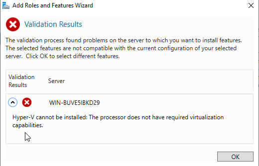


---

## Task 2 — Enable Nested Virtualization in VMware

### Explanation

The fix for the Task 1 error is to enable **nested virtualization** in the VMware virtual machine settings. This exposes the host CPU's hardware virtualization extensions (VT-x/EPT or AMD-V/RVI) to the guest operating system.

The screenshot shows **Virtual Machine Settings** in VMware with the **Processors** hardware item selected. Under the **Virtualization engine** section, three checkboxes are available:

| Checkbox | Function | Status |
|----------|----------|--------|
| **Virtualize Intel VT-x/EPT or AMD-V/RVI** | Exposes CPU virtualization extensions to guest | **Checked (enabled)** |
| Virtualize CPU performance counters | Passes hardware performance counters to guest | Unchecked |
| Virtualize IOMMU (IO memory management unit) | Enables nested I/O virtualization | Unchecked |

Enabling **"Virtualize Intel VT-x/EPT or AMD-V/RVI"** is the minimum required change for Hyper-V to install successfully. The VM is configured with:
- **2 processors** (Number of processors: 2)
- **1 core per processor** (Total processor cores: 2)

> **Key concept:** The VM must be **powered off** before this setting can be changed — VMware does not allow modifying processor virtualization settings on a running or suspended VM. On VMware ESXi, this is the `cpu.nestedHVEnabled = TRUE` parameter in the .vmx configuration file.

### Steps

1. In VMware, ensure the Windows Server VM is **fully powered off** (not suspended).
2. Right-click the VM -> **Settings** (or press Ctrl+D).
3. In **Virtual Machine Settings**, click **Processors** in the Hardware tab.
4. Under **Virtualization engine**, check **"Virtualize Intel VT-x/EPT or AMD-V/RVI"**.
5. Click **OK** to save.
6. Power on the VM.
7. Log in to Windows Server and retry the Hyper-V role installation (Task 3).

**For VMware ESXi (add to .vmx file):**
```
cpu.nestedHVEnabled = "TRUE"
vhv.enable = "TRUE"
```

**For Hyper-V as the outer hypervisor (PowerShell on the host):**
```powershell
# Enable nested virtualization for a VM named "MyVM"
Set-VMProcessor -VMName "MyVM" -ExposeVirtualizationExtensions $true
```

### Screenshot

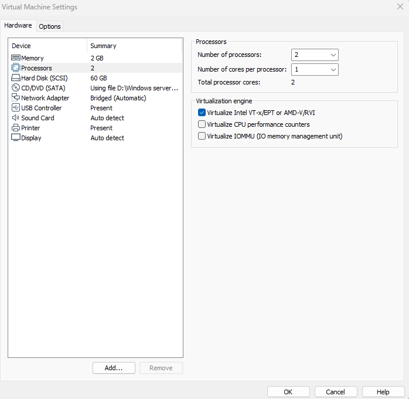


---

## Task 3 — Install Hyper-V on Desktop Experience Server

### Explanation

With nested virtualization enabled in VMware, the Hyper-V role can now be installed on the Windows Server Desktop Experience machine (`WIN-BUVE5IBKD29`). The screenshot shows the **Add Roles and Features Wizard** at the **Installation Progress** stage with all Hyper-V components being installed:

```
Hyper-V
  Remote Server Administration Tools
    Role Administration Tools
      Hyper-V Management Tools
        Hyper-V Module for Windows PowerShell
        Hyper-V GUI Management Tools
```

**Components being installed:**

| Component | Purpose |
|-----------|---------|
| **Hyper-V** | The core hypervisor role (type-1 hypervisor) |
| **Hyper-V Management Tools** | GUI and PowerShell management layer |
| **Hyper-V Module for Windows PowerShell** | `Hyper-V` PowerShell module for scripting |
| **Hyper-V GUI Management Tools** | `virtmgmt.msc` — the Hyper-V Manager snap-in |

> **Key concept:** The Hyper-V role installs a **Type-1 (bare-metal) hypervisor** — even inside Windows. After installation and reboot, the Hyper-V hypervisor sits between the hardware and all operating systems, including Windows itself. Windows becomes the "parent partition" or "management OS."

> **Important:** After Hyper-V installation, a **reboot is mandatory**. The hypervisor layer cannot be activated on a running system.

### Steps

1. Open **Server Manager** -> **Manage** -> **Add Roles and Features**.
2. Click **Next** through Before You Begin and Installation Type screens.
3. **Server Selection:** select the local server (`WIN-BUVE5IBKD29`) -> Next.
4. **Server Roles:** scroll down and check **Hyper-V** -> **Add Features** when prompted.
5. Proceed through **Virtual Switches**, **Migration**, and **Default Stores** pages (configure or accept defaults).
6. **Confirmation:** review the list and click **Install**.
7. Monitor **Installation Progress** until complete.
8. Click **Close** — then **restart the server** when prompted.

**Via PowerShell (alternative):**
```powershell
# Install Hyper-V with management tools (requires reboot)
Install-WindowsFeature -Name Hyper-V -IncludeManagementTools -Restart

# Verify after reboot
Get-WindowsFeature -Name Hyper-V
(Get-VMHost).VirtualMachinePath
```

### Screenshot

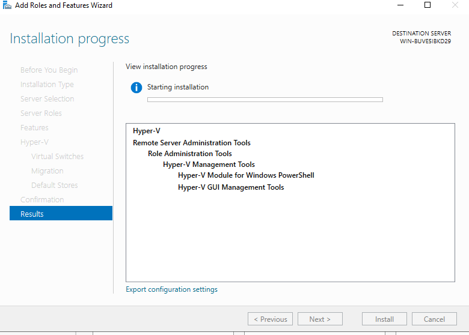


---

## Task 4 — Virtual NIC Created by Hyper-V

### Explanation

After Hyper-V is installed and the server reboots, the **Network Connections** panel shows a new virtual network adapter has been automatically created:

| Adapter | Name | Type |
|---------|------|------|
| **Ethernet0** | Intel(R) 82574L Gigabit Network C... | Physical NIC |
| **vEthernet** | Intel(R) 82574L Gigabit Network Connection - Virtual Swi... | Virtual NIC (Hyper-V) |

**What happened during reboot:**

When Hyper-V created an **External Virtual Switch** (configured during installation), it:
1. Bound a **virtual switch** to the physical NIC (`Intel 82574L`)
2. Created a **virtual NIC** (`vEthernet`) for the management OS (Windows itself) to use
3. The physical NIC now connects to the virtual switch, not directly to Windows

The management OS communicates through the `vEthernet` adapter, while VMs get their own virtual NICs connected to the same virtual switch — allowing all of them to share the physical network link.

> **Key concept:** An **External Virtual Switch** in Hyper-V connects VMs to the physical network. The host management OS gets a virtual NIC (`vEthernet`) to maintain its own network connectivity through that same switch. VMs and the host appear as separate hosts on the physical network.

### Screenshot

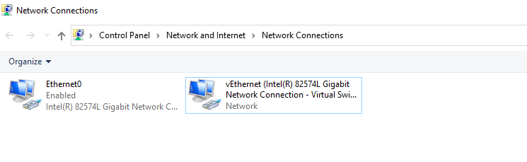


---

## Task 5 — Install Hyper-V on Server Core

### Explanation

Hyper-V can also be installed on the **Server Core** machine (`CORE`) using a single PowerShell command. Since Core has no GUI, the Add Roles and Features Wizard is unavailable — PowerShell is the only local installation method.

The screenshot shows the command being typed at the PowerShell prompt:

```powershell
Install-WindowsFeature -Name Hyper-V -IncludeManagementTools -Restart
```

**Parameter breakdown:**

| Parameter | Purpose |
|-----------|---------|
| `-Name Hyper-V` | Installs the Hyper-V server role |
| `-IncludeManagementTools` | Also installs the Hyper-V PowerShell module and management tools |
| `-Restart` | Automatically reboots the server after installation |

> **Key concept:** On Server Core, `Install-WindowsFeature` is the standard way to add roles and features. The `-Restart` flag is important — without it, the Hyper-V hypervisor layer is not activated until a manual reboot. The Core server can also be rebooted with `Restart-Computer -Force` after installation.

### Steps

1. On the Core server, exit SConfig to PowerShell (type `15` in SConfig).
2. Run the installation command:
   ```powershell
   Install-WindowsFeature -Name Hyper-V -IncludeManagementTools -Restart
   ```
3. The server installs the role and automatically reboots.
4. After reboot, verify Hyper-V is active:
   ```powershell
   Get-WindowsFeature -Name Hyper-V
   Get-VMHost
   ```

**Remote installation from PDC (alternative):**
```powershell
# Install Hyper-V on Core remotely from the management machine
Invoke-Command -ComputerName CORE -ScriptBlock {
    Install-WindowsFeature -Name Hyper-V -IncludeManagementTools -Restart
}
```

### Screenshot

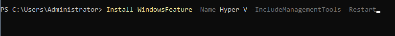


---

## Task 6 — Configure Virtual Switch Manager

### Explanation

The **Virtual Switch Manager** in Hyper-V Manager (`virtmgmt.msc`) is where you create and configure virtual network switches that connect VMs to the network. On `PDC16`, an **External Virtual Switch** has been created using the physical Intel 82574L NIC.

The screenshot shows the **Virtual Switch Properties**:

| Property | Value |
|----------|-------|
| **Name** | Intel(R) 82574L Gigabit Network Connection - Virtual Switch |
| **Connection type** | External network |
| **Physical NIC** | Intel(R) 82574L Gigabit Network Connection |
| **Allow management OS to share adapter** | Checked |

**Three virtual switch types:**

| Type | Connectivity | Use Case |
|------|-------------|----------|
| **External** | VMs + host -> physical network | Production workloads needing real network access |
| **Internal** | VMs <-> host only (no physical) | Test environments, host-to-VM communication |
| **Private** | VMs <-> VMs only (no host, no physical) | Isolated VM-to-VM lab networks |

**"Allow management operating system to share this network adapter"** — This creates the `vEthernet` adapter seen in Task 4, so the host OS retains network connectivity through the same physical NIC.

**Global Network Settings** in the left pane shows the **MAC Address Range** (`00-15-5D-01-72-00` to `00-15-5D-01-72-...`) — Hyper-V auto-assigns MAC addresses to VM virtual NICs from this range.

> **Key concept:** The External Virtual Switch binds to the physical NIC at a low level. Without "Allow management OS to share," the host would lose network access entirely after creating the switch. Always keep this checked in environments where the host needs network connectivity.

### Steps

1. Open **Hyper-V Manager** (Start -> Hyper-V Manager or `virtmgmt.msc`).
2. In the right **Actions** pane, click **Virtual Switch Manager**.
3. In the left panel under **Virtual Switches**, click **New virtual network switch**.
4. Select **External** -> click **Create Virtual Switch**.
5. **Name:** Enter a descriptive name (e.g., `External Switch`).
6. **Connection type:** Select **External network** and choose the physical NIC from the dropdown.
7. Ensure **"Allow management operating system to share this network adapter"** is checked.
8. Click **Apply** -> accept the network disruption warning -> **OK**.

**Via PowerShell:**
```powershell
# Create external virtual switch
New-VMSwitch -Name "ExternalSwitch" `
             -NetAdapterName "Ethernet" `
             -AllowManagementOS $true

# Verify
Get-VMSwitch
Get-NetAdapter | Where-Object { $_.InterfaceDescription -like "*Virtual*" }
```

### Screenshot

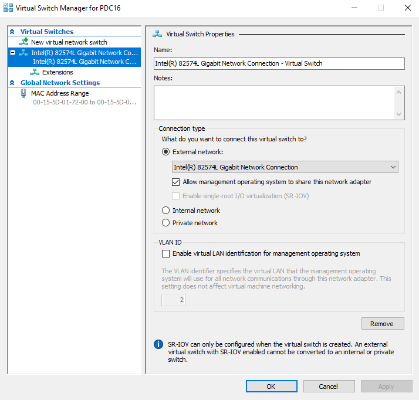


---

## Task 7 — Disable Windows Firewall on Core

### Explanation

Before connecting the Core server to Hyper-V Manager remotely, Windows Firewall on Core must allow the necessary management traffic. Rather than configuring individual rules, this lab disables the firewall entirely across all profiles using a single PowerShell command:

```powershell
Set-NetFirewallProfile -Profile Domain,Public,Private -Enabled False
```

The screenshot shows this command running in PowerShell on Core (after exiting SConfig with the warning: `WARNING: To launch Server Configuration tool again, run "SConfig"`).

**Profile breakdown:**

| Profile | Applied When |
|---------|-------------|
| **Domain** | Computer is connected to a domain network (DC detectable) |
| **Private** | User marks the network as private/trusted |
| **Public** | Default for unknown or public networks |

> **Important — Lab vs Production:** Disabling all firewall profiles is acceptable in an isolated lab environment for simplicity. In production, **never disable the firewall globally**. Instead, enable specific firewall rule groups:
> ```powershell
> Enable-NetFirewallRule -DisplayGroup "Hyper-V"
> Enable-NetFirewallRule -DisplayGroup "Hyper-V Management Clients"
> Enable-NetFirewallRule -DisplayGroup "Remote Administration"
> Enable-NetFirewallRule -DisplayGroup "Windows Management Instrumentation (WMI)"
> ```

> **Key concept:** Hyper-V Manager communicates with remote Hyper-V hosts using **WMI over DCOM** (TCP 135 + dynamic high ports) and **WinRM** (TCP 5985). These must be unblocked for remote Hyper-V management to work.

### Steps

1. On the Core server, exit SConfig to PowerShell (type `15`).
2. Run:
   ```powershell
   Set-NetFirewallProfile -Profile Domain,Public,Private -Enabled False
   ```
3. No output = success. Verify:
   ```powershell
   Get-NetFirewallProfile | Select-Object Name, Enabled
   # All three profiles should show Enabled: False
   ```

**Production alternative (targeted rules only):**
```powershell
# Enable only the Hyper-V management rules
Enable-NetFirewallRule -DisplayGroup "Hyper-V"
Enable-NetFirewallRule -DisplayGroup "Hyper-V Management Clients"
Enable-NetFirewallRule -DisplayGroup "Remote Administration"
Enable-NetFirewallRule -DisplayGroup "Windows Management Instrumentation (WMI)"
```

### Screenshot

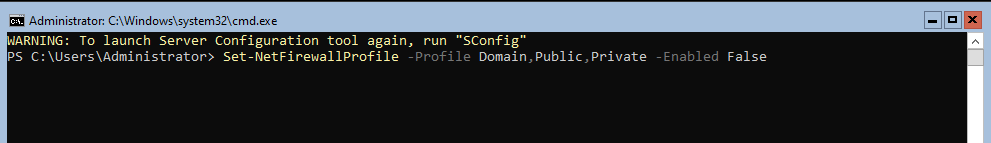


---

## Task 8 — Connect Core Server to Hyper-V Manager

### Explanation

**Hyper-V Manager** (`virtmgmt.msc`) can manage remote Hyper-V hosts — including Server Core — from a Desktop Experience machine. The screenshot shows Hyper-V Manager on the management machine with the **Select Computer** dialog open to add the Core Hyper-V host:

- **Another computer:** `CORE` typed in the field
- **Current host listed:** `PDC16` (already in the left pane)

Once connected, the Hyper-V Manager left pane will show both `PDC16` and `CORE` as separate Hyper-V hosts you can manage — creating and managing VMs on Core entirely from the PDC16 GUI.

> **Key concept:** Hyper-V Manager uses **WMI/DCOM** (port 135 + dynamic) and **CredSSP** or **Kerberos** for authentication. The machines must be in the same domain (or you must specify credentials explicitly). Task 7 disabled Core's firewall to allow this traffic.

### Steps

1. Open **Hyper-V Manager** on the management machine (PDC16).
2. In the left pane, right-click **Hyper-V Manager** -> **Connect to Server**.
3. The **Select Computer** dialog opens.
4. Select **Another computer** and type `CORE`.
5. Optionally check **"Connect as another user"** if credentials differ.
6. Click **OK**.
7. `CORE` now appears in the Hyper-V Manager left pane alongside `PDC16`.
8. Click `CORE` to manage its VMs, virtual switches, and settings.

**Via PowerShell (manage Core's Hyper-V remotely):**
```powershell
# Run Hyper-V commands targeting Core
Get-VM -ComputerName CORE
Get-VMSwitch -ComputerName CORE
New-VM -ComputerName CORE -Name "TestVM" -MemoryStartupBytes 1GB
```

### Screenshot

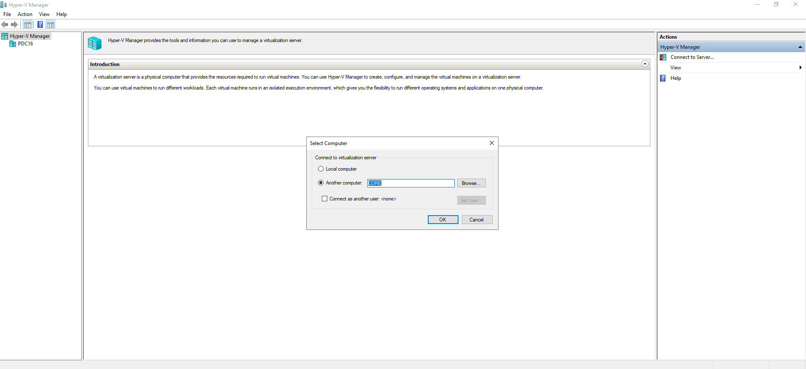


---

## Task 9 — New VM Wizard: Specify Name and Location

### Explanation

The **New Virtual Machine Wizard** in Hyper-V Manager guides you through creating a VM step by step. This wizard is running **targeting the Core Hyper-V host** remotely from the PDC16 Hyper-V Manager.

**Step: Specify Name and Location**

| Field | Value |
|-------|-------|
| **Name** | `SRV-CORE-VM` |
| **Location** | `C:\ProgramData\Microsoft\Windows\Hyper-V\` (default) |
| **Store in different location** | Unchecked (using default) |

The name `SRV-CORE-VM` follows a descriptive naming convention: **SRV** (server role) + **CORE** (Core OS) + **VM** (virtual machine).

The default storage path `C:\ProgramData\Microsoft\Windows\Hyper-V\` is where Hyper-V stores VM configuration files (`.vmcx`). Virtual hard disks (`.vhdx`) go to `C:\Users\Public\Documents\Hyper-V\Virtual Hard Disks\` by default.

> **Key concept:** The VM name is just a label in Hyper-V Manager — it is independent of the guest OS computer name. A VM named `SRV-CORE-VM` could run any OS with any hostname. Choose names that help you identify the VM's purpose at a glance.

### Steps

1. In Hyper-V Manager with `CORE` selected in the left pane, click **New** -> **Virtual Machine** in the Actions pane.
2. Click **Next** past the Before You Begin screen.
3. **Specify Name and Location:**
   - **Name:** `SRV-CORE-VM`
   - Leave **"Store the virtual machine in a different location"** unchecked to use the default path.
4. Click **Next**.

### Screenshot

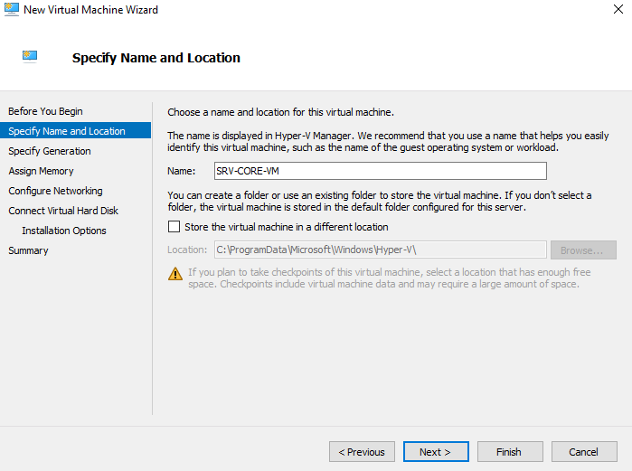


---

## Task 10 — New VM Wizard: Specify Generation

### Explanation

**Generation** determines the virtual hardware firmware the VM uses. The wizard shows two options:

| Generation | Firmware | Architecture | OS Support |
|------------|----------|-------------|------------|
| **Generation 1** | Legacy BIOS | 32-bit and 64-bit | All Windows versions + older Linux |
| **Generation 2** | UEFI (Secure Boot) | 64-bit only | Windows Server 2012+, modern Linux |

**Selected: Generation 2**

Generation 2 advantages:
- **UEFI firmware** — faster boot, Secure Boot support
- **PXE boot from virtual NIC** — network boot support
- **SCSI boot** — boots directly from SCSI virtual disk (no IDE emulation)
- **32-bit support removed** — fewer legacy components, smaller attack surface
- **Better performance** — no IDE controller overhead

> **Critical:** The warning at the bottom states: `Once a virtual machine has been created, you cannot change its generation.` This is permanent — choose carefully. For Windows Server 2022 Core (64-bit), Generation 2 is the correct choice. Use Generation 1 only for 32-bit guests or legacy OS compatibility.

### Steps

1. **Specify Generation** screen:
   - Select **Generation 2** (for Windows Server 2022 — 64-bit UEFI).
   - Select **Generation 1** only if the guest OS requires BIOS or is 32-bit.
2. Read the warning: generation cannot be changed after creation.
3. Click **Next**.

**Check generation of existing VM:**
```powershell
Get-VM -Name "SRV-CORE-VM" -ComputerName CORE | Select-Object Name, Generation
```

### Screenshot

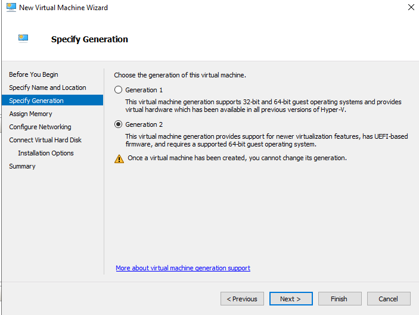


---

## Task 11 — New VM Wizard: Assign Memory

### Explanation

The **Assign Memory** step sets how much RAM the virtual machine gets at startup.

| Setting | Value | Notes |
|---------|-------|-------|
| **Startup memory** | `1024 MB` (1 GB) | Amount allocated when VM starts |
| **Dynamic Memory** | Unchecked | Static allocation — memory is fixed |

**Dynamic Memory vs Static:**

| Mode | Behaviour | Use Case |
|------|-----------|----------|
| **Static (unchecked)** | Fixed amount reserved at all times | Predictable performance, production workloads |
| **Dynamic Memory** | Hyper-V adjusts RAM between min/max based on demand | Consolidating many VMs on a single host |

**1024 MB minimum** is appropriate for Windows Server Core — Core's minimal footprint means it runs comfortably in 1 GB of RAM. The wizard notes the maximum is `251658240 MB` (approximately 245 TB — the theoretical Hyper-V limit).

> **Key concept:** With static memory, the 1024 MB is **reserved** from the host's RAM pool immediately when the VM starts — even if the guest isn't using it. With Dynamic Memory, only the minimum is reserved and Hyper-V can balloon/deflate the allocation based on demand across all running VMs.

### Steps

1. **Assign Memory** screen:
   - **Startup memory:** `1024` MB (sufficient for Server Core)
   - Leave **"Use Dynamic Memory for this virtual machine"** unchecked for predictable behavior.
2. Click **Next**.

**Modify memory after VM creation:**
```powershell
# Set static memory
Set-VMMemory -VMName "SRV-CORE-VM" -ComputerName CORE `
             -DynamicMemoryEnabled $false `
             -StartupBytes 2GB

# Enable dynamic memory with min/max
Set-VMMemory -VMName "SRV-CORE-VM" -ComputerName CORE `
             -DynamicMemoryEnabled $true `
             -MinimumBytes 512MB `
             -StartupBytes 1GB `
             -MaximumBytes 4GB
```

### Screenshot

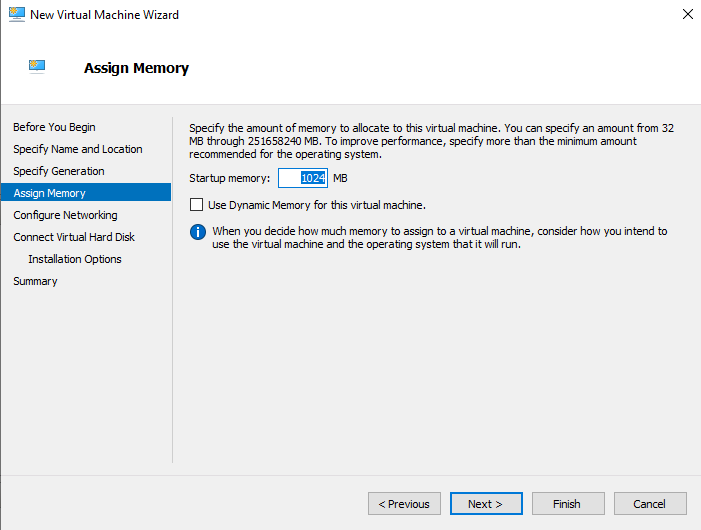


---

## Task 12 — New VM Wizard: Configure Networking

### Explanation

The **Configure Networking** step connects the VM's virtual NIC to a virtual switch. The screenshot shows:

| Setting | Value |
|---------|-------|
| **Connection** | Intel(R) 82574L Gigabit Network Connection - Virtual Switch |

This is the **External Virtual Switch** created in Task 6. By connecting the VM to this switch, the VM will:
- Get a MAC address from the Hyper-V MAC range
- Appear as a separate host on the physical network
- Be able to communicate with the host, other VMs, and external network devices

If you had selected **Not Connected**, the VM would have a NIC but no network access — useful for isolated testing.

**Connection options in the dropdown:**

| Option | Effect |
|--------|--------|
| **Not Connected** | NIC present but no network |
| External Virtual Switch | VM on physical network |
| Internal Virtual Switch | VM + host only |
| Private Virtual Switch | VM to VM only |

> **Key concept:** Each VM NIC is a separate **virtual NIC** with its own MAC address. Multiple VMs can connect to the same virtual switch and communicate with each other and the external network simultaneously — just like physical machines connected to a physical switch.

### Steps

1. **Configure Networking** screen:
   - **Connection:** select **Intel(R) 82574L Gigabit Network Connection - Virtual Switch** (or your external switch name).
2. Click **Next**.
3. **Connect Virtual Hard Disk:** create a new VHDX (default 127 GB), use existing, or attach later.
4. **Installation Options:** attach an ISO file or configure network boot for the OS installation.
5. **Summary:** review all settings -> click **Finish**.

**Add/change network adapter after creation:**
```powershell
# Connect existing NIC to a different switch
Connect-VMNetworkAdapter -VMName "SRV-CORE-VM" `
                         -ComputerName CORE `
                         -SwitchName "ExternalSwitch"

# Add a second NIC
Add-VMNetworkAdapter -VMName "SRV-CORE-VM" `
                     -ComputerName CORE `
                     -SwitchName "InternalSwitch"
```

### Screenshot

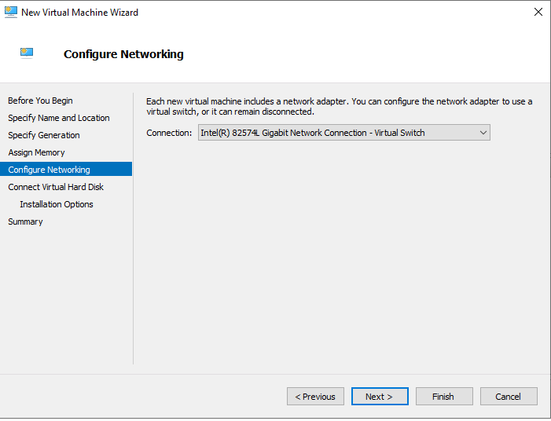


---

## Task 13 — VM Created: Boot from ISO

### Explanation

The VM `SRV-CORE-VM` has been successfully created on the Core Hyper-V host and is now booting for the first time. The screenshot shows the **Virtual Machine Connection** window (Hyper-V's built-in console) titled:

`SRV-CORE-VM on PDC16 — Virtual Machine Connection`

The VM is **running** (Status: Running shown in the bottom bar) and displaying the **Microsoft Server Operating System Setup** wizard — confirming:
1. The VM booted from the attached ISO
2. Generation 2 UEFI firmware successfully loaded the installer
3. The Windows Server 2022 installation wizard is live inside the VM

The setup screen shows: Language: English (United States), Time/Currency: English (United States), Keyboard: US.

The Hyper-V VM Connection toolbar at the top provides:
- **Power controls** — Start, Pause, Reset, Shutdown
- **Media** — Insert/eject virtual DVD ISO
- **Clipboard** — Type text into the VM
- **View** — Zoom, full screen

> **Key concept:** The **Virtual Machine Connection** window is Hyper-V's built-in console (similar to VMware's VM console). It provides direct keyboard/video/mouse access to the VM independent of the network — useful when the guest OS has no network or when troubleshooting boot issues. Unlike RDP, it works even before the OS has loaded network drivers.

### Steps

**After completing the New VM Wizard:**

1. In Hyper-V Manager with `CORE` selected, the new VM `SRV-CORE-VM` appears in the VM list.
2. Right-click `SRV-CORE-VM` -> **Settings** -> **SCSI Controller** -> **DVD Drive**.
3. Select **Image file** -> browse to the Windows Server 2022 ISO -> **Apply**.
4. Also check **Firmware** (in Generation 2 VMs): ensure the DVD drive is first in the boot order.
5. Right-click `SRV-CORE-VM` -> **Connect** — the Virtual Machine Connection window opens.
6. Click the **Start** button (play icon) or Action -> Start.
7. The VM boots from the ISO — the Windows Server Setup wizard appears.
8. Proceed with OS installation (language, edition, drive selection, etc.).

**Via PowerShell:**
```powershell
# Set ISO on DVD drive
$dvd = Get-VMDvdDrive -VMName "SRV-CORE-VM" -ComputerName CORE
Set-VMDvdDrive -VMName "SRV-CORE-VM" -ComputerName CORE `
               -ControllerNumber $dvd.ControllerNumber `
               -ControllerLocation $dvd.ControllerLocation `
               -Path "C:\ISOs\WinServer2022.iso"

# Set boot order (Generation 2 only)
$bootOrder = Get-VMFirmware -VMName "SRV-CORE-VM" -ComputerName CORE
Set-VMFirmware -VMName "SRV-CORE-VM" -ComputerName CORE `
               -FirstBootDevice $bootOrder.BootOrder[0]

# Start the VM
Start-VM -Name "SRV-CORE-VM" -ComputerName CORE

# Connect to console
vmconnect.exe CORE "SRV-CORE-VM"
```

### Screenshot

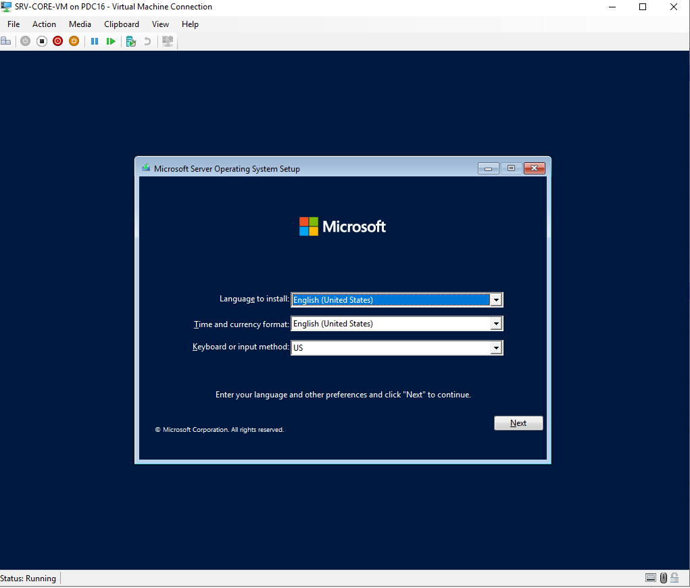


---

## Hyper-V Virtual Switch Types — Full Comparison

```
EXTERNAL VIRTUAL SWITCH
  ┌─────────────────────────────────────┐
  │  Physical Network (LAN/Internet)    │
  └────────────┬────────────────────────┘
               │ Physical NIC (Intel 82574L)
  ┌────────────▼────────────────────────┐
  │       Hyper-V Virtual Switch        │
  ├──────────────┬──────────────────────┤
  │   Host OS    │    VM1   │    VM2    │
  │  (vEthernet) │          │           │
  └──────────────┴──────────┴───────────┘
  Result: Host + all VMs on the physical network

INTERNAL VIRTUAL SWITCH
  Physical network: NOT accessible to VMs
  ┌────────────────────────────────────┐
  │       Internal Virtual Switch      │
  ├──────────────┬─────────────────────┤
  │   Host OS    │    VM1   │   VM2    │
  └──────────────┴──────────┴──────────┘
  Result: VMs can talk to host and each other only

PRIVATE VIRTUAL SWITCH
  Physical network: NOT accessible
  Host OS: NOT accessible
  ┌────────────────────────────────────┐
  │       Private Virtual Switch       │
  ├─────────────────────────────────────┤
  │    VM1          │        VM2        │
  └─────────────────┴───────────────────┘
  Result: VMs can only talk to each other
```

---

## Essential Hyper-V PowerShell Commands

```powershell
# ── Hyper-V Host Management ───────────────────────────────────
Get-VMHost                            # Host configuration
Get-VMHost -ComputerName CORE         # Remote host info
Set-VMHost -VirtualMachinePath "D:\VMs"  # Change default VM path

# ── Virtual Switch Management ─────────────────────────────────
Get-VMSwitch                          # List all virtual switches
New-VMSwitch -Name "ExtSwitch" -NetAdapterName "Ethernet" -AllowManagementOS $true
Remove-VMSwitch -Name "ExtSwitch"

# ── VM Lifecycle ──────────────────────────────────────────────
Get-VM                                # List all VMs
Get-VM -ComputerName CORE             # List VMs on Core
New-VM -Name "SRV-CORE-VM" -Generation 2 -MemoryStartupBytes 1GB
Start-VM -Name "SRV-CORE-VM"
Stop-VM -Name "SRV-CORE-VM" -Force
Restart-VM -Name "SRV-CORE-VM" -Force
Remove-VM -Name "SRV-CORE-VM" -Force

# ── VM Configuration ──────────────────────────────────────────
Set-VMMemory -VMName "SRV-CORE-VM" -StartupBytes 2GB
Set-VMProcessor -VMName "SRV-CORE-VM" -Count 2
Add-VMHardDiskDrive -VMName "SRV-CORE-VM" -SizeBytes 60GB
Add-VMNetworkAdapter -VMName "SRV-CORE-VM" -SwitchName "ExtSwitch"

# ── Checkpoints (Snapshots) ───────────────────────────────────
Checkpoint-VM -Name "SRV-CORE-VM" -SnapshotName "Before AD Install"
Get-VMSnapshot -VMName "SRV-CORE-VM"
Restore-VMSnapshot -VMName "SRV-CORE-VM" -Name "Before AD Install"
Remove-VMSnapshot -VMName "SRV-CORE-VM" -Name "Before AD Install"

# ── VM Console ────────────────────────────────────────────────
vmconnect.exe CORE "SRV-CORE-VM"      # Open VM console window
```

---

## Troubleshooting Guide

| Symptom | Likely Cause | Fix |
|---------|--------------|-----|
| "Processor does not have required virtualization capabilities" | VT-x/AMD-V not exposed to VM | Enable "Virtualize Intel VT-x/EPT or AMD-V/RVI" in VMware settings (Task 2) |
| VMware setting greyed out | VM is running or suspended | Fully power off the VM before changing processor settings |
| Hyper-V install fails on ESXi | Nested virt not enabled on host | Add `vhv.enable = TRUE` to .vmx or enable in ESXi VM settings |
| vEthernet adapter missing after install | No External Switch created | Create External Switch in Virtual Switch Manager (Task 6) |
| Host loses network after creating External Switch | Management OS sharing not enabled | Re-create switch with "Allow management OS to share" checked |
| Hyper-V Manager cannot connect to Core | Firewall blocking WMI/DCOM | Disable firewall (lab) or enable "Hyper-V" and "Remote Administration" rules |
| VM console shows no boot device | ISO not attached or wrong boot order | Attach ISO to DVD drive, set DVD first in Firmware boot order |
| Generation 2 VM won't boot from ISO | Secure Boot blocking unsigned media | Disable Secure Boot in VM Firmware settings temporarily |
| VM has no network after creation | NIC not connected to switch | Connect NIC via Settings or `Connect-VMNetworkAdapter` |
| Cannot create VM on Core remotely | WinRM not configured | Run `winrm quickconfig -quiet` on Core |

---

## Key Concepts Summary

> **Nested Virtualization** — Running a hypervisor (Hyper-V) inside a virtual machine. Requires the outer hypervisor (VMware) to expose CPU virtualization extensions (VT-x/AMD-V) to the guest. Enabled via "Virtualize Intel VT-x/EPT or AMD-V/RVI" in VMware settings.

> **Type-1 Hypervisor** — Hyper-V installs as a bare-metal hypervisor that sits between the hardware and all OSes, including Windows itself. After installation, Windows becomes the "parent partition" — a privileged guest with direct hardware management access.

> **External Virtual Switch** — Connects VMs to the physical network through the host's physical NIC. Creates a `vEthernet` adapter for the host OS so it retains connectivity. VMs and the host appear as separate machines on the LAN.

> **VM Generation** — Permanent hardware profile choice. Generation 1 uses legacy BIOS (compatible with older OSes). Generation 2 uses UEFI with Secure Boot (required for modern 64-bit Windows, better performance). Cannot be changed after VM creation.

> **Virtual Machine Connection** — Hyper-V's built-in VM console (KVM-style). Works independent of the guest OS network — available from first boot, during OS installation, and when the network is down. Accessed via `virtmgmt.msc` or `vmconnect.exe`.

> **Dynamic Memory** — Hyper-V feature that adjusts VM RAM dynamically between a minimum and maximum based on demand. Allows higher VM density on a host. Static memory reserves the full allocation at all times, providing more predictable performance.

---

*Lab environment: VMware (outer) -> Windows Server 2022 (PDC16 / WIN-BUVE5IBKD29) with Hyper-V (inner) -> Server Core (CORE) with Hyper-V -> SRV-CORE-VM guest*
