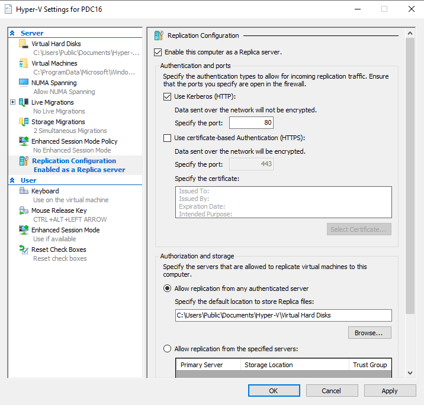
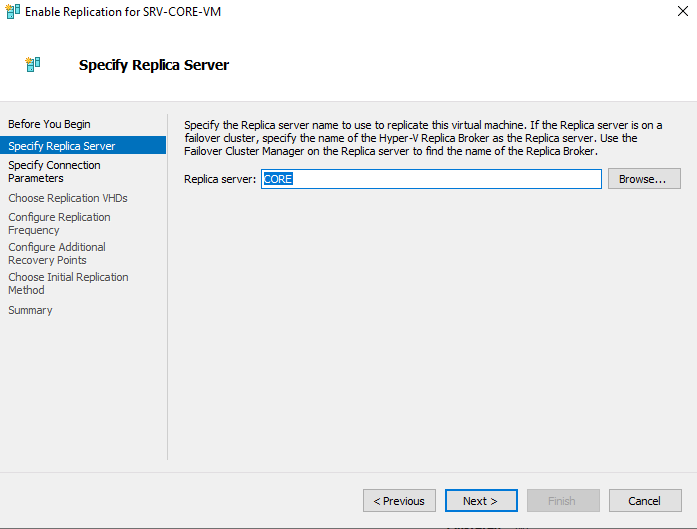
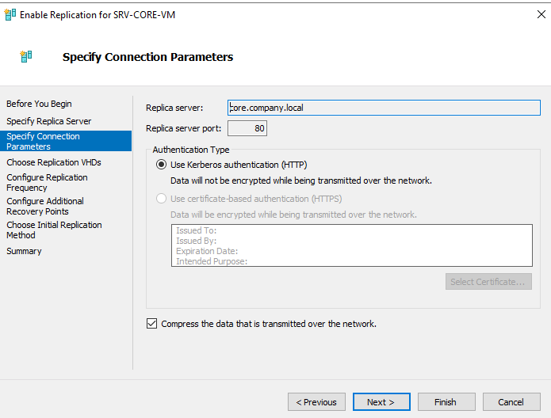
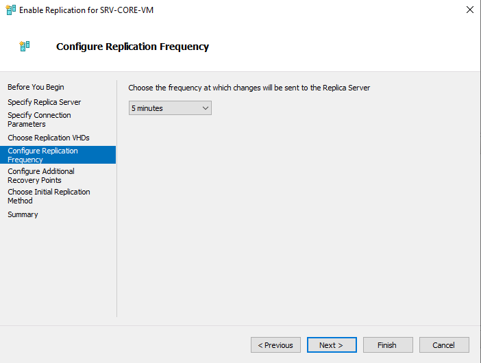
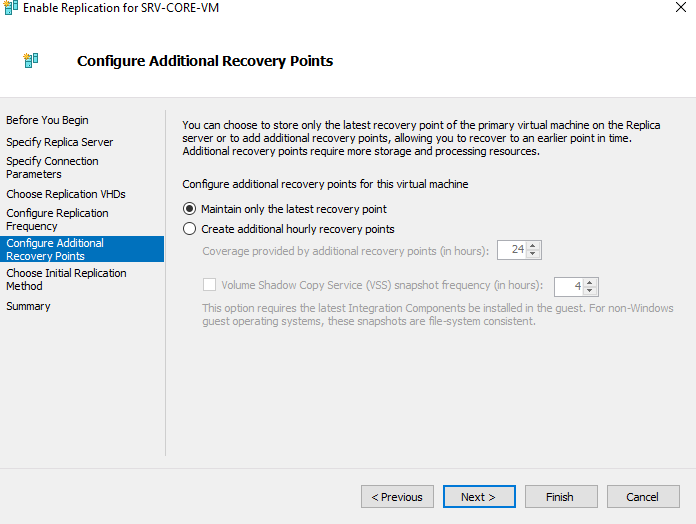
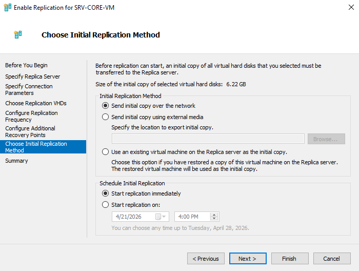
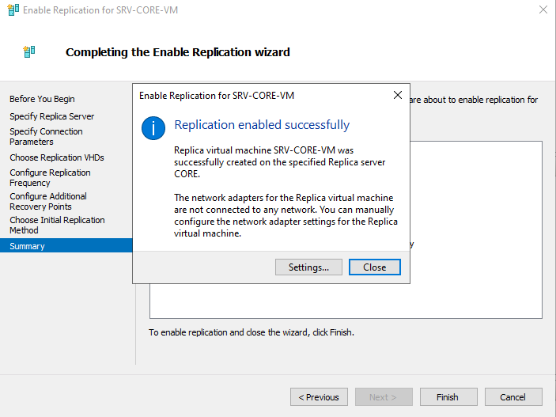
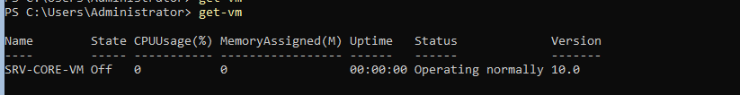

# Lab: Hyper-V Replica — VM Replication Between Hyper-V Hosts

## Overview

This lab documents how to configure **Hyper-V Replica** to asynchronously replicate a virtual machine from a primary Hyper-V host to a secondary ("Replica") host — providing a disaster-recovery copy of the VM that can be brought online if the primary host fails. The lab walks through enabling the Replica role on both hosts, configuring the replication wizard for a specific VM, performing the initial replication, and confirming the replicated VM exists on the destination host.

**Lab environment:**
- Primary Hyper-V host: `PDC16`
- Replica Hyper-V host: `CORE` (`core.company.local`)
- VM being replicated: `SRV-CORE-VM` (6.22 GB initial copy size)

**Goal:** Have `SRV-CORE-VM` continuously and automatically replicated from `PDC16` to `CORE` every few minutes, so a recent, restorable copy of the VM always exists on the secondary host.

---

## Table of Contents

1. [Task 1 – Enable Replication on Both Hyper-V Hosts](#task-1--enable-replication-on-both-hyper-v-hosts)
2. [Task 2 – Specify the Replica Server](#task-2--specify-the-replica-server)
3. [Task 3 – Specify Connection Parameters](#task-3--specify-connection-parameters)
4. [Task 4 – Configure Replication Frequency](#task-4--configure-replication-frequency)
5. [Task 5 – Configure Additional Recovery Points](#task-5--configure-additional-recovery-points)
6. [Task 6 – Choose the Initial Replication Method](#task-6--choose-the-initial-replication-method)
7. [Task 7 – Confirm Replication Was Enabled Successfully](#task-7--confirm-replication-was-enabled-successfully)
8. [Task 8 – Verify the Replica VM Exists on the Destination Host](#task-8--verify-the-replica-vm-exists-on-the-destination-host)
9. [Summary / Key Takeaways](#summary--key-takeaways)

---

## Task 1 – Enable Replication on Both Hyper-V Hosts

In **Hyper-V Settings → Replication Configuration** on the Replica host (`CORE`, and mirrored on `PDC16` if it will also ever receive replicas):

- ☑ **Enable this computer as a Replica server**
- **Authentication and ports:**
  - ☑ **Use Kerberos (HTTP)** — port `80` *(data sent over the network will not be encrypted)*
  - ☐ Use certificate-based Authentication (HTTPS) — port `443` *(not used in this lab)*
- **Authorization and storage:**
  - ● **Allow replication from any authenticated server**
  - Default location to store Replica files: `C:\Users\Public\Documents\Hyper-V\Virtual Hard Disks`



**Why:** A Hyper-V host must be explicitly configured to **accept** incoming replication traffic before any source host can send it VM replicas. **Kerberos (HTTP)** is the simpler option for a trusted, domain-joined lab environment — it authenticates the connection using the domain's Kerberos infrastructure, but does **not encrypt** the replicated data in transit (certificate-based HTTPS would be the choice for untrusted networks or when data-in-transit encryption is required).

---

## Task 2 – Specify the Replica Server

On the source host (`PDC16`), right-click the VM to replicate (`SRV-CORE-VM`) → **Enable Replication**, which launches the wizard. On the **Specify Replica Server** page:

- **Replica server:** `CORE`



**Why:** This tells the wizard which Hyper-V host will receive and host the replicated copy of this VM. (If the Replica server were part of a failover cluster, this field would instead point to the cluster's Hyper-V Replica Broker rather than an individual node.)

---

## Task 3 – Specify Connection Parameters

- **Replica server:** `core.company.local`
- **Replica server port:** `80`
- **Authentication Type:** ● **Use Kerberos authentication (HTTP)** *(data will not be encrypted while being transmitted over the network)*
- ☑ **Compress the data that is transmitted over the network**



**Why:** These settings must **match** what was enabled on the Replica server in Task 1 (same authentication type and port) or the connection will fail. Enabling **compression** reduces the bandwidth needed for both the initial copy and ongoing incremental replication — a worthwhile trade of a small amount of CPU overhead for meaningfully less network traffic, especially over slower WAN links between sites.

---

## Task 4 – Configure Replication Frequency

- **Choose the frequency at which changes will be sent to the Replica Server:** `5 minutes`



**Why:** This controls how often incremental changes (deltas) are sent to the Replica server after the initial copy completes. A shorter interval (like 30 seconds) gives a more up-to-date replica but generates more frequent network/storage I/O; a longer interval reduces overhead at the cost of a larger potential data-loss window (RPO) if the primary host fails right before the next sync.

---

## Task 5 – Configure Additional Recovery Points

- ● **Maintain only the latest recovery point** *(selected)*
- ○ Create additional hourly recovery points — *not enabled in this lab*
- ☐ Volume Shadow Copy Service (VSS) snapshot frequency — *not enabled*



**Why:** By default, Hyper-V Replica only keeps the **most recent** state of the VM on the Replica server. Enabling **additional hourly recovery points** would let you fail over to an *earlier* point in time (e.g., before a ransomware event or bad application update) rather than only the latest replicated state — at the cost of additional storage and processing overhead on the Replica server. This lab keeps it simple with just the latest recovery point.

---

## Task 6 – Choose the Initial Replication Method

- **Size of the initial copy of selected virtual hard disks:** `6.22 GB`
- **Initial Replication Method:** ● **Send initial copy over the network**
  - *(Alternatives not used here: sending via external media, or using an existing VM already restored on the Replica server as the baseline)*
- **Schedule Initial Replication:** ● **Start replication immediately**



**Why:** The **initial copy** has to fully transfer the VM's virtual hard disk(s) to the Replica server before incremental replication can begin — for a small 6.22 GB VM and a local/lab network, sending it directly over the network is simplest. For very large VMs or slow/constrained WAN links in production, exporting to external media and physically transporting it (or seeding from an existing restored VM) avoids saturating the network link with a huge one-time transfer.

---

## Task 7 – Confirm Replication Was Enabled Successfully

The wizard completes with:

> **Replication enabled successfully**
> Replica virtual machine `SRV-CORE-VM` was successfully created on the specified Replica server `CORE`.
>
> The network adapters for the Replica virtual machine are not connected to any network. You can manually configure the network adapter settings for the Replica virtual machine.



**Why:** This confirms the initial copy completed and the replica VM object now exists on `CORE`. The note about network adapters **not being connected** is expected and intentional default behavior — Hyper-V deliberately leaves the replica VM's virtual NICs disconnected so it doesn't accidentally come online and conflict with the live primary VM on the network (e.g., duplicate IP/identity) until a real failover is actually performed.

---

## Task 8 – Verify the Replica VM Exists on the Destination Host

On `CORE`, run:

```powershell
Get-VM
```

Output:
```
Name         State  CPUUsage(%)  MemoryAssigned(M)  Uptime    Status              Version
----         -----  -----------  ------------------  --------  ------------------  -------
SRV-CORE-VM  Off    0            0                   00:00:00  Operating normally  10.0
```



**Why:** This confirms, directly on the Replica host itself, that `SRV-CORE-VM` now exists as a genuine VM object (currently powered **Off**, as expected for a standby replica) with a healthy status — the replication pipeline is set up correctly and the VM is ready to receive ongoing incremental updates from `PDC16` every 5 minutes as configured in Task 4.

---

## Summary / Key Takeaways

| Step | Purpose |
|---|---|
| Enable Replica server (Hyper-V Settings) | Lets a host accept incoming VM replicas; choose Kerberos/HTTP or certificate/HTTPS |
| Specify Replica Server (per-VM wizard) | Tells the source VM which host will hold its replica |
| Connection Parameters | Must match the Replica server's accepted auth type/port; compression saves bandwidth |
| Replication Frequency | Controls how current the replica stays (RPO) vs. overhead |
| Additional Recovery Points | Optional multiple restore points vs. just the latest state |
| Initial Replication Method | How the (potentially large) baseline VHD copy gets to the Replica server |
| Verify on both ends | Wizard confirmation + `Get-VM` on the Replica host confirms the replica genuinely exists and is healthy |

**Key takeaway:** Hyper-V Replica gives you a continuously up-to-date, powered-off standby copy of a VM on a separate host — intentionally disconnected from the network until you deliberately fail over — providing a disaster-recovery safety net without needing shared storage or a full failover cluster. This lab shows the entire pipeline from enabling replication on both hosts through confirming the replica is genuinely present and healthy on the destination.
