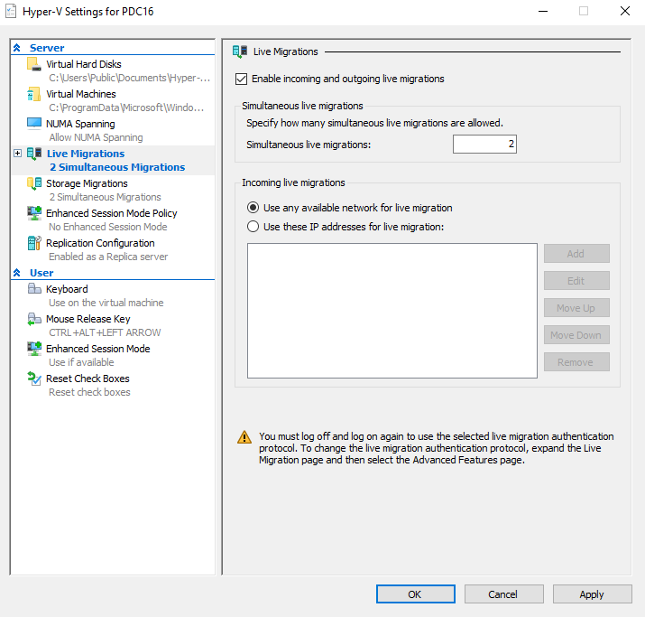
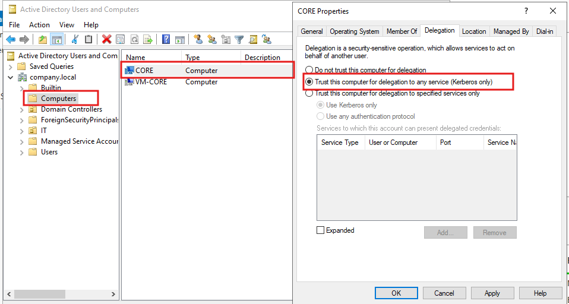
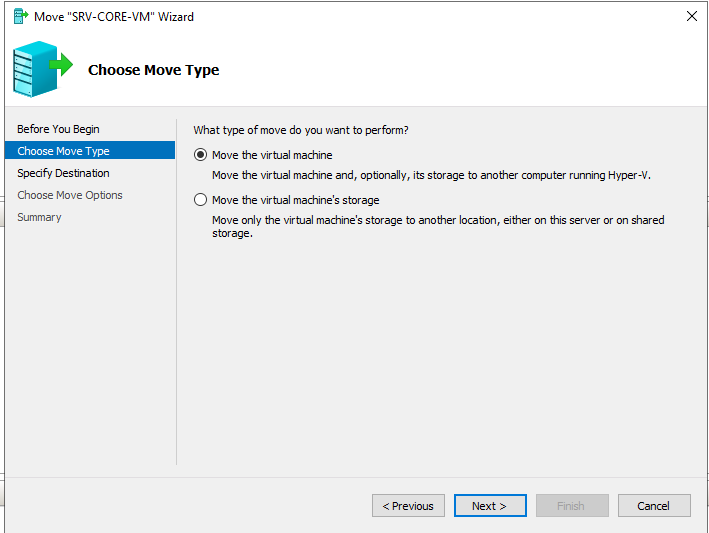
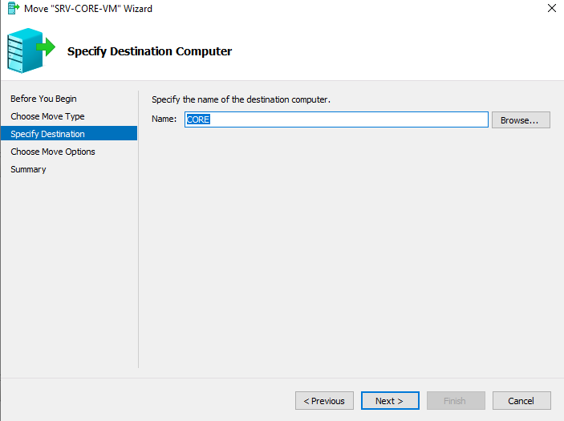
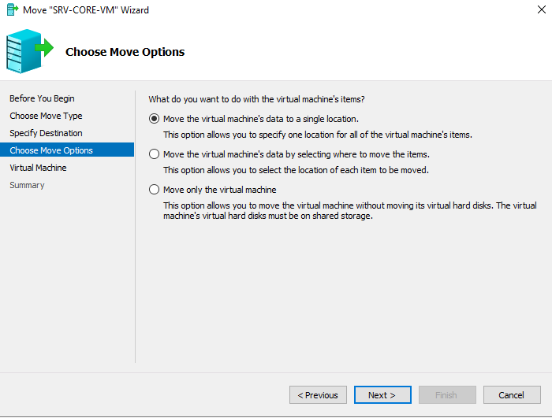
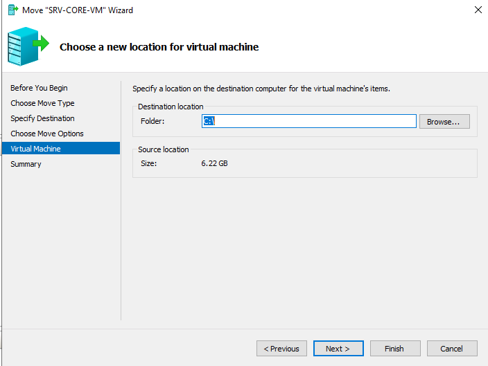
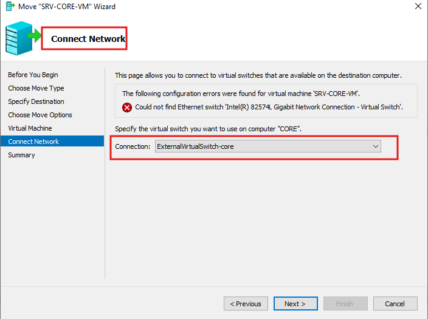
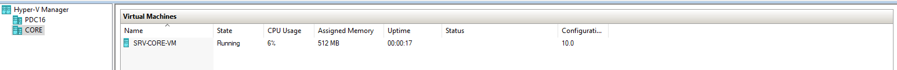

# Hyper-V Live Migration Lab — Moving VMs Between Hyper-V Hosts

> **Comprehensive step-by-step guide covering Hyper-V Live Migration: enabling live migration on both hosts, configuring Kerberos delegation in Active Directory, and migrating a running VM from PDC16 to CORE using the Move VM Wizard.**

---

## Table of Contents

| # | Task | Category |
|---|------|----------|
| [1](#task-1--enable-live-migration-on-both-hyper-v-hosts) | Enable Live Migration on Both Hyper-V Hosts | Prerequisites |
| [2](#task-2--configure-kerberos-constrained-delegation-in-active-directory) | Configure Kerberos Constrained Delegation in AD | Prerequisites |
| [3](#task-3--launch-move-vm-wizard--choose-move-type) | Launch Move VM Wizard — Choose Move Type | Migration Wizard |
| [4](#task-4--specify-destination-computer) | Specify Destination Computer | Migration Wizard |
| [5](#task-5--choose-move-options--single-location) | Choose Move Options — Single Location | Migration Wizard |
| [6](#task-6--specify-vm-destination-location-on-core) | Specify VM Destination Location on Core | Migration Wizard |
| [7](#task-7--connect-network--resolve-virtual-switch-mismatch) | Connect Network — Resolve Virtual Switch Mismatch | Migration Wizard |
| [8](#task-8--migration-complete--vm-running-on-core) | Migration Complete — VM Running on Core | Verification |

---

## What is Hyper-V Live Migration?

**Hyper-V Live Migration** moves a **running virtual machine** from one Hyper-V host to another with **zero downtime** — the VM keeps running throughout the entire move process and users experience no interruption.

### Live Migration vs Other Move Types

| Feature | Live Migration | Quick Migration | Storage Migration |
|---------|---------------|-----------------|-------------------|
| **VM state during move** | Running | Brief pause (~seconds) | Running |
| **What moves** | VM + storage (or VM only) | VM only | Storage only |
| **Shared storage required** | No (with storage migration) | Yes | No |
| **Network required** | Yes (fast LAN recommended) | Yes | No (local) |
| **Use case** | Zero-downtime workload balancing | Failover clustering | Disk consolidation |

### How Live Migration Works

```
BEFORE MIGRATION:
  PDC16                              CORE
  ┌────────────────┐                 ┌─────────────────┐
  │ SRV-CORE-VM    │                 │  (empty)        │
  │ State: Running │                 │                 │
  │ RAM: 512 MB    │                 │                 │
  └────────────────┘                 └─────────────────┘

DURING MIGRATION (simultaneous):
  PDC16                              CORE
  ┌────────────────┐  memory pages   ┌─────────────────┐
  │ SRV-CORE-VM    │ ─────────────>  │ SRV-CORE-VM     │
  │ State: Running │  VHDX blocks    │ State: Building  │
  │ (still serving)│ ─────────────>  │                 │
  └────────────────┘                 └─────────────────┘

AFTER MIGRATION:
  PDC16                              CORE
  ┌────────────────┐                 ┌─────────────────┐
  │  (empty)       │                 │ SRV-CORE-VM     │
  │                │                 │ State: Running  │
  │                │                 │ Uptime: 00:00:17│
  └────────────────┘                 └─────────────────┘
```

**Migration phases:**
1. **Setup** — Hyper-V creates a placeholder VM on CORE with matching configuration
2. **Memory copy** — RAM pages are copied over the network to CORE while PDC16's VM keeps running
3. **Dirty page tracking** — pages modified during the copy are tracked and re-sent
4. **Storage transfer** — VHDX files are transferred to CORE (if not using shared storage)
5. **Switchover** — control passes to CORE in milliseconds; TCP connections are maintained
6. **Cleanup** — PDC16 removes its copy of the VM

---

## Lab Environment

| Component | Value |
|-----------|-------|
| **Source Hyper-V Host** | `PDC16` |
| **Destination Hyper-V Host** | `CORE` |
| **VM Being Migrated** | `SRV-CORE-VM` (running) |
| **Domain** | `company.local` |
| **VM Size** | 6.22 GB |
| **VM RAM** | 512 MB |
| **Destination Path** | `C:\` on CORE |
| **Source Switch** | Intel(R) 82574L Gigabit Network Connection - Virtual Switch |
| **Destination Switch** | ExternalVirtualSwitch-core |
| **Authentication** | Kerberos (requires delegation in AD) |
| **Simultaneous Migrations** | 2 |

---

## Task 1 — Enable Live Migration on Both Hyper-V Hosts

### Explanation

Before any live migration can occur, **both the source and destination Hyper-V hosts** must have live migration enabled in their **Hyper-V Settings**. The screenshot shows **Hyper-V Settings for PDC16** with the **Live Migrations** section configured.

The left panel confirms: `Live Migrations — 2 Simultaneous Migrations`, and the right panel shows all settings:

| Setting | Value | Purpose |
|---------|-------|---------|
| **Enable incoming and outgoing live migrations** | Checked | Allows this host to both send and receive live migrations |
| **Simultaneous live migrations** | `2` | Maximum concurrent live migrations in progress at once |
| **Incoming live migrations** | Use any available network | Migration traffic uses whichever NIC has a route to the source |

**Simultaneous live migrations** controls how many migrations can run in parallel. Each live migration consumes significant CPU and network bandwidth — setting this too high can degrade both the migrations and running workloads. The default of 2 is appropriate for most environments.

**Incoming live migration network options:**

| Option | Description | Use Case |
|--------|-------------|----------|
| **Use any available network** | Migration uses the best available route | Simple lab/small office |
| **Use these IP addresses** | Pin migration traffic to specific NICs/IPs | Production — isolate migration traffic from VM traffic |

> **Key concept:** Live migration uses the **management network** by default. In production, it is strongly recommended to dedicate a separate high-speed NIC (10 GbE or faster) exclusively for live migration traffic to avoid impacting VM network performance during migrations.

> **Warning shown:** `You must log off and log on again to use the selected live migration authentication protocol.` After enabling live migration, the administrator must log off and back on for the Kerberos delegation settings to take effect.

### Steps

**On PDC16 (source host):**

1. Open **Hyper-V Manager** -> right-click `PDC16` -> **Hyper-V Settings**.
2. In the left panel, click **Live Migrations**.
3. Check **"Enable incoming and outgoing live migrations"**.
4. Set **Simultaneous live migrations** to `2`.
5. Under **Incoming live migrations**, select **"Use any available network for live migration"**.
6. Click **Apply** -> **OK**.
7. **Log off and log back on** (required for Kerberos delegation to activate).

**On CORE (destination host) — repeat the same steps:**

8. In Hyper-V Manager, right-click `CORE` -> **Hyper-V Settings** -> **Live Migrations**.
9. Enable and configure identically to PDC16.
10. Click **Apply** -> **OK**.

**Enable live migration firewall rules (if firewall is active):**
```powershell
# Run on BOTH hosts
Enable-NetFirewallRule -DisplayGroup "Hyper-V"
Enable-NetFirewallRule -DisplayGroup "Hyper-V Management Clients"

# For dedicated migration network (optional)
New-NetFirewallRule -DisplayName "Hyper-V Live Migration" `
    -Direction Inbound -Protocol TCP -LocalPort 6600 -Action Allow
```

**Via PowerShell:**
```powershell
# Enable live migration on both hosts
Set-VMHost -ComputerName PDC16 `
    -EnableEnhancedSessionMode $true `
    -VirtualMachineMigrationEnabled $true `
    -MaximumVirtualMachineMigrations 2 `
    -VirtualMachineMigrationPerformanceOption Default

Set-VMHost -ComputerName CORE `
    -VirtualMachineMigrationEnabled $true `
    -MaximumVirtualMachineMigrations 2

# Verify
Get-VMHost -ComputerName PDC16 | Select-Object VirtualMachineMigrationEnabled, MaximumVirtualMachineMigrations
Get-VMHost -ComputerName CORE  | Select-Object VirtualMachineMigrationEnabled, MaximumVirtualMachineMigrations
```

### Screenshot




---

## Task 2 — Configure Kerberos Constrained Delegation in Active Directory

### Explanation

Live Migration with **Kerberos authentication** requires that the computer accounts of both Hyper-V hosts are trusted for **Kerberos constrained delegation** in Active Directory. Without this, the migration fails with an authentication error even if both hosts are domain-joined.

The screenshot shows **Active Directory Users and Computers** with the **CORE Properties** dialog open on the **Delegation** tab:

- **Left panel:** `company.local` -> `Computers` container, with `CORE` selected (highlighted in red box)
- **Right panel:** CORE Properties -> Delegation tab with **"Trust this computer for delegation to any service (Kerberos only)"** selected (highlighted in red box)

**Three delegation options:**

| Option | Description | Security Level |
|--------|-------------|----------------|
| **Do not trust this computer for delegation** | No delegation allowed | Most restrictive |
| **Trust this computer for delegation to any service (Kerberos only)** | Can delegate to any service | Moderate — Kerberos only |
| **Trust this computer for delegation to specified services only** | Constrained to listed services | Most secure (production recommended) |

**Selected: "Trust this computer for delegation to any service (Kerberos only)"** — appropriate for a lab environment. In production, use constrained delegation specifying only the `cifs` and `Microsoft Virtual System Migration Service` SPNs.

**Why delegation is required:**
Live migration involves the source host authenticating to the destination host on behalf of the administrator initiating the move. This is a **double-hop** Kerberos scenario:
```
Admin workstation -> PDC16 (hop 1) -> CORE (hop 2)
```
Without delegation, Kerberos tickets cannot be forwarded past the first hop, causing authentication failures.

> **Key concept:** Both `PDC16` and `CORE` computer accounts need delegation configured — PDC16 delegates to CORE when sending a migration, and CORE delegates to PDC16 when the direction is reversed. The Delegation tab only appears for computer accounts in domains with Windows 2000 or later functional level.

### Steps

**On the Domain Controller — configure delegation for CORE:**

1. Open **Active Directory Users and Computers** (`dsa.msc`).
2. Expand `company.local` -> click the **Computers** container.
3. Right-click the `CORE` computer account -> **Properties**.
4. Click the **Delegation** tab.
   - If the Delegation tab is missing, ensure the DC is Windows 2008 or later functional level.
5. Select **"Trust this computer for delegation to any service (Kerberos only)"**.
6. Click **Apply** -> **OK**.

**Repeat for PDC16's computer account:**

7. Right-click `PDC16` computer account -> **Properties** -> **Delegation** tab.
8. Select **"Trust this computer for delegation to any service (Kerberos only)"**.
9. Click **Apply** -> **OK**.

**Via PowerShell (ADSI / AD module):**
```powershell
# Import AD module
Import-Module ActiveDirectory

# Enable unconstrained Kerberos delegation for CORE
Set-ADComputer -Identity "CORE" -TrustedForDelegation $true

# Enable for PDC16 as well
Set-ADComputer -Identity "PDC16" -TrustedForDelegation $true

# Verify delegation is set
Get-ADComputer -Identity "CORE" -Properties TrustedForDelegation |
    Select-Object Name, TrustedForDelegation

# Force group policy / Kerberos ticket refresh on both hosts
klist purge         # clear Kerberos ticket cache (run on PDC16)
gpupdate /force     # refresh group policy
```

> **Important:** After setting delegation, **log off and log back on** to both Hyper-V hosts so the Kerberos tickets are refreshed with the new delegation permissions. Without this, the migration will still fail with the old tickets.

### Screenshot




---

## Task 3 — Launch Move VM Wizard — Choose Move Type

### Explanation

With live migration enabled and delegation configured, the migration is initiated from **Hyper-V Manager on PDC16** by right-clicking the running VM and selecting **Move**. This opens the **Move "SRV-CORE-VM" Wizard**.

**Step: Choose Move Type** presents two options:

| Option | Description | When to Use |
|--------|-------------|-------------|
| **Move the virtual machine** | Moves the VM and optionally its storage to another Hyper-V host | Live migration — moving a running VM to a new host |
| **Move the virtual machine's storage** | Moves only the VHDX files to a different location on this same server or shared storage | Storage consolidation, moving to faster disks, shared storage migration |

**Selected: "Move the virtual machine"** — this is a full live migration including moving the VM's compute (running state, memory) and storage (VHDX) to the destination Hyper-V host (CORE).

The wizard breadcrumb shows the steps:
```
Before You Begin
Choose Move Type            <- current step
Specify Destination
Choose Move Options
Summary
```

> **Key concept:** "Move the virtual machine's storage" keeps the VM running on the same host — only the VHDX location changes (useful for moving from a slow HDD to an SSD on the same server). "Move the virtual machine" is the true live migration — the VM ends up running on a completely different physical host.

### Steps

1. In Hyper-V Manager on PDC16, confirm `SRV-CORE-VM` is **running**.
2. Right-click `SRV-CORE-VM` -> **Move**.
3. Click **Next** past the Before You Begin screen.
4. **Choose Move Type:**
   - Select **"Move the virtual machine"**.
5. Click **Next**.

**Via PowerShell (live migration without wizard):**
```powershell
# Live migrate VM to CORE (moves VM and storage together)
Move-VM -Name "SRV-CORE-VM" `
        -DestinationHost "CORE" `
        -DestinationStoragePath "C:\Hyper-V\SRV-CORE-VM" `
        -IncludeStorage
```

### Screenshot




---

## Task 4 — Specify Destination Computer

### Explanation

**Step 2** of the Move VM Wizard specifies the **destination Hyper-V host** — the server that will receive and run the VM after migration.

The screenshot shows:
- **Name field:** `CORE` entered as the destination computer

The wizard will use this name to:
1. Look up CORE in DNS to resolve its IP address
2. Authenticate to CORE's Hyper-V service using Kerberos
3. Verify CORE is configured as an eligible live migration host
4. Begin the migration handshake

Using the **NetBIOS name** (`CORE`) works for domain-joined machines. Using the **FQDN** (`core.company.local`) is more reliable in environments with multiple DNS suffixes.

The **Browse** button opens Active Directory to search for Hyper-V hosts without typing the name manually.

> **Key concept:** The destination host must have **sufficient resources** to accommodate the migrating VM:
> - Enough free RAM (at least 512 MB free for this VM)
> - Compatible processor generation (Intel/AMD compatible instruction sets)
> - Live migration enabled (Task 1)
> - Kerberos delegation configured (Task 2)
> - Network connectivity to the source host

### Steps

1. **Specify Destination Computer** screen:
   - In the **Name** field, type `CORE` (or the FQDN `core.company.local`).
   - Click **Browse** to find the host in Active Directory if needed.
2. Click **Next**.
   - Hyper-V verifies the destination is reachable and eligible.
   - If validation fails, check Task 1 and Task 2 are complete on CORE.

**Pre-migration resource check:**
```powershell
# Check available RAM on destination
Get-VM -ComputerName CORE | Measure-Object -Property MemoryAssigned -Sum
(Get-VMHost -ComputerName CORE).MemoryCapacity / 1GB

# Check processor compatibility
Get-VMProcessor -VMName "SRV-CORE-VM" | Select-Object CompatibilityForMigrationEnabled
```

### Screenshot




---

## Task 5 — Choose Move Options — Single Location

### Explanation

**Step 3** of the Move VM Wizard determines **what gets moved and where** the VM data goes on the destination host. Three options are presented:

| Option | What Moves | Shared Storage Required | Use Case |
|--------|-----------|------------------------|----------|
| **Move the VM's data to a single location** | VM config + all VHDXs -> one folder | No | Simplest — everything to one path |
| **Move the VM's data by selecting where to move the items** | VM config + VHDXs can go to different paths | No | Granular control over file placement |
| **Move only the virtual machine** | VM state/config only (VHDXs stay) | Yes | Failover clustering with SAN/SMB shared storage |

**Selected: "Move the virtual machine's data to a single location"** — the simplest option that moves both the VM configuration files and all attached VHDX disks to a single folder on CORE.

**"Move only the virtual machine"** is used in **Failover Cluster** environments where all cluster nodes share the same storage (SAN or SMB file share). In that case, the VHDX doesn't need to physically move since all nodes can already access it.

> **Key concept:** Without shared storage, you **must** move the storage along with the VM. The "Move only the virtual machine" option will fail unless the VHDX path is accessible from both the source and destination hosts (e.g., on an SMB 3.0 file server or SAN). This is why "Move the VM's data to a single location" is the correct choice for standalone Hyper-V hosts like in this lab.

### Steps

1. **Choose Move Options** screen:
   - Select **"Move the virtual machine's data to a single location"**.
2. Click **Next**.

**Understanding the other options:**
- **Select where to move items** — useful when you want the VHDX on a different drive than the config files (e.g., config on C: and VHDX on D: for I/O separation)
- **Move only the VM** — requires shared storage, typical in Hyper-V Failover Cluster configurations

### Screenshot




---

## Task 6 — Specify VM Destination Location on Core

### Explanation

**Step 4** specifies the exact **folder path on CORE** where all VM files will be stored after migration.

The screenshot shows:
- **Destination location Folder:** `C:\` — the root of the C drive on CORE
- **Source location Size:** `6.22 GB` — the total data that will be transferred

**Files that will be moved to `C:\` on CORE:**

| File Type | Extension | Purpose |
|-----------|-----------|---------|
| VM configuration | `.vmcx` | Stores VM hardware settings, checkpoints list |
| VM runtime state | `.vmrs` | Runtime state file (memory/CPU state) |
| Virtual hard disk | `.vhdx` | Primary disk containing the guest OS |
| Checkpoint delta disks | `.avhdx` | Checkpoint differential disks (if any exist) |

Using `C:\` as the destination puts all files directly in the root. In production, use a dedicated path like `C:\Hyper-V\VMs\SRV-CORE-VM\` to keep VM files organised and separate from system files.

> **Key concept:** The destination folder must have **sufficient free space** for the entire VM (6.22 GB in this case, plus overhead for the running VM's memory save file during migration). Hyper-V will verify free space before starting the transfer and abort with an error if space is insufficient.

### Steps

1. **Choose a new location for virtual machine** screen:
   - **Folder:** type `C:\` or click **Browse** to navigate to a folder on CORE.
   - Confirm **Source location Size** shows `6.22 GB` — verify CORE has at least this much free space.
2. Click **Next** to proceed to the network configuration step.

**Check free space on CORE before migration:**
```powershell
# Check C: drive free space on CORE
Invoke-Command -ComputerName CORE -ScriptBlock {
    Get-PSDrive C | Select-Object Name, Used, Free
}
# Free must be > 6.22 GB (6,370 MB minimum)
```

### Screenshot




---

## Task 7 — Connect Network — Resolve Virtual Switch Mismatch

### Explanation

**Step 5** is one of the most important — and most common point of failure — in live migration between standalone Hyper-V hosts. The wizard shows a **configuration error**:

```
The following configuration errors were found for virtual machine 'SRV-CORE-VM'.
Could not find Ethernet switch 'Intel(R) 82574L Gigabit Network Connection - Virtual Switch'.
```

**Why this error occurs:**

The VM `SRV-CORE-VM` is currently connected to a virtual switch on PDC16 named:
`Intel(R) 82574L Gigabit Network Connection - Virtual Switch`

But this **exact switch name does not exist on CORE**. CORE has a different virtual switch:
`ExternalVirtualSwitch-core`

Virtual switch names are **local to each Hyper-V host** — the same switch on different hosts will have different names unless you manually name them identically.

**The wizard resolves this** by letting you map the VM's NIC to the correct switch available on the destination:
- **Connection dropdown:** `ExternalVirtualSwitch-core` selected — this is the correct external switch on CORE

> **Key concept:** This network mapping step is **only needed for live migration** (without shared storage). If you are using Failover Clustering with identical switch names across all cluster nodes, this step is automated. The best practice for standalone live migration is to use **identical virtual switch names** on all Hyper-V hosts — then this step is automatic with no errors.

> **Best practice:** Name all external switches identically across all Hyper-V hosts in your environment (e.g., `ExternalSwitch` everywhere). This eliminates the switch mismatch error entirely and makes live migrations fully automatic.

### Steps

1. **Connect Network** screen:
   - The red error indicates the source switch name does not exist on CORE.
   - In the **Connection** dropdown, select `ExternalVirtualSwitch-core` (the available external switch on CORE).
2. Click **Next** -> review the **Summary** -> click **Finish**.
3. The live migration begins immediately.

**Avoid this issue in future migrations:**
```powershell
# Rename CORE's virtual switch to match PDC16's switch name
# (Run on CORE)
Rename-VMSwitch -Name "ExternalVirtualSwitch-core" `
                -NewName "Intel(R) 82574L Gigabit Network Connection - Virtual Switch"

# Or create a new switch with a standardised name on CORE
New-VMSwitch -Name "ExternalSwitch" `
             -NetAdapterName "Ethernet" `
             -AllowManagementOS $true `
             -ComputerName CORE
```

### Screenshot




---

## Task 8 — Migration Complete — VM Running on Core

### Explanation

The live migration has completed successfully. The screenshot shows **Hyper-V Manager** with both hosts visible in the left pane (`PDC16` and `CORE`), and `CORE` selected — the VM list shows:

```
Name          State    CPU Usage   Assigned Memory   Uptime     Status   Configuration...
SRV-CORE-VM   Running  6%          512 MB            00:00:17   (blank)  10.0
```

**Key observations:**

| Field | Value | Significance |
|-------|-------|--------------|
| **Name** | `SRV-CORE-VM` | Same VM name as on PDC16 |
| **State** | `Running` | VM is actively running — zero downtime achieved |
| **CPU Usage** | `6%` | VM is using resources on CORE |
| **Assigned Memory** | `512 MB` | Full RAM allocation transferred |
| **Uptime** | `00:00:17` | 17 seconds since the switchover completed |
| **Configuration** | `10.0` | Hyper-V config version unchanged |

The **PDC16** host now shows an empty VM list — `SRV-CORE-VM` has been fully transferred.

**What happened during those 17 seconds of uptime:**
- The VM's memory pages were iteratively copied to CORE
- At the final switchover moment, remaining dirty pages were transferred
- Network connections were re-established on CORE's virtual switch
- The VM continued running — users experienced no service interruption

> **Key concept:** The uptime of `00:00:17` reflects the time since the VM was running on CORE — the VM's internal uptime (how long it has been powered on total) continues to count from when it was originally started on PDC16. The guest OS does not reboot during live migration.

### Steps

**Verify migration success:**

1. In Hyper-V Manager, click **CORE** in the left pane.
2. Confirm `SRV-CORE-VM` appears with **State: Running**.
3. Click **PDC16** — confirm the VM no longer appears there.
4. Right-click `SRV-CORE-VM` on CORE -> **Connect** to open the VM console and verify the guest OS is responsive.

**Via PowerShell:**
```powershell
# Confirm VM is on CORE
Get-VM -ComputerName CORE -Name "SRV-CORE-VM"
# State should be "Running"

# Confirm VM is NOT on PDC16
Get-VM -ComputerName PDC16 -Name "SRV-CORE-VM"
# Should return nothing or "not found"

# Check VM network adapter is connected on CORE
Get-VMNetworkAdapter -VMName "SRV-CORE-VM" -ComputerName CORE
```

### Screenshot




---

## Live Migration Prerequisites — Checklist

```
BEFORE STARTING LIVE MIGRATION:

  Source Host (PDC16):
  [ ] Hyper-V role installed
  [ ] Live migrations ENABLED (Task 1)
  [ ] Simultaneous migrations >= 1
  [ ] Computer account trusted for Kerberos delegation (Task 2)
  [ ] Logged off and back on after enabling (refreshes Kerberos ticket)
  [ ] Firewall allows Hyper-V management and migration traffic

  Destination Host (CORE):
  [ ] Hyper-V role installed
  [ ] Live migrations ENABLED (Task 1)
  [ ] Computer account trusted for Kerberos delegation (Task 2)
  [ ] Sufficient free RAM for migrating VM (>= 512 MB)
  [ ] Sufficient free disk space (>= 6.22 GB)
  [ ] Virtual switch exists (name can differ - resolved in Task 7)
  [ ] Firewall allows Hyper-V management and migration traffic

  Both Hosts:
  [ ] Domain-joined to the same domain (company.local)
  [ ] DNS resolves each other's names
  [ ] Network connectivity between hosts (ping each other)
  [ ] Processor compatibility (Intel <-> Intel or AMD <-> AMD recommended)
```

---

## Live Migration vs Hyper-V Replica — Comparison

| Feature | Live Migration | Hyper-V Replica |
|---------|---------------|-----------------|
| **VM state** | Running throughout | Primary: Running, Replica: Off |
| **Purpose** | Load balancing, maintenance | Disaster recovery |
| **Data sync** | One-time move | Continuous async replication |
| **Failover** | Transparent (no failover needed) | Manual failover required |
| **Requires both hosts up** | Yes (both must be available) | No (replica works if primary fails) |
| **Network use** | High burst (during migration) | Low continuous (delta changes) |
| **Result** | VM runs on new host | VM available on backup host |

---

## Essential Live Migration PowerShell Commands

```powershell
# ── Configure Live Migration on Hosts ────────────────────────
# Enable live migration
Set-VMHost -ComputerName PDC16 -VirtualMachineMigrationEnabled $true
Set-VMHost -ComputerName CORE  -VirtualMachineMigrationEnabled $true

# Set max simultaneous migrations
Set-VMHost -ComputerName PDC16 -MaximumVirtualMachineMigrations 2

# Set dedicated migration network (production best practice)
Set-VMHost -ComputerName PDC16 `
    -VirtualMachineMigrationPerformanceOption SMBTransport `
    -UseAnyNetworkForMigration $false
Add-VMMigrationNetwork -ComputerName PDC16 -Subnet "10.0.10.0/24" -Priority 1

# ── Perform Live Migration ────────────────────────────────────
# Move VM only (shared storage)
Move-VM -Name "SRV-CORE-VM" -DestinationHost "CORE"

# Move VM and storage (no shared storage)
Move-VM -Name "SRV-CORE-VM" `
        -DestinationHost "CORE" `
        -DestinationStoragePath "C:\Hyper-V\SRV-CORE-VM" `
        -IncludeStorage

# Move storage only (same host, different path)
Move-VMStorage -VMName "SRV-CORE-VM" -DestinationStoragePath "D:\Hyper-V\SRV-CORE-VM"

# ── Monitor Migration Progress ────────────────────────────────
# Watch migration status
while ($true) {
    $vm = Get-VM -Name "SRV-CORE-VM" -ErrorAction SilentlyContinue
    if ($vm) { Write-Host "Host: PDC16 State: $($vm.State)" }
    $vm2 = Get-VM -ComputerName CORE -Name "SRV-CORE-VM" -ErrorAction SilentlyContinue
    if ($vm2) { Write-Host "Host: CORE  State: $($vm2.State)" }
    Start-Sleep -Seconds 2
}

# ── AD Delegation (must run on DC) ───────────────────────────
Set-ADComputer -Identity "PDC16" -TrustedForDelegation $true
Set-ADComputer -Identity "CORE"  -TrustedForDelegation $true

# ── Verify Migration Result ───────────────────────────────────
Get-VM -ComputerName CORE  | Where-Object { $_.Name -eq "SRV-CORE-VM" }
Get-VM -ComputerName PDC16 | Where-Object { $_.Name -eq "SRV-CORE-VM" }
```

---

## Troubleshooting Guide

| Symptom | Likely Cause | Fix |
|---------|--------------|-----|
| "Virtual machine migration operation failed at migration source" | Kerberos delegation not configured | Set TrustedForDelegation on both computer accounts in AD (Task 2) |
| "Failed to establish a connection with host CORE" | Firewall blocking Hyper-V management ports | Enable "Hyper-V" and "Remote Administration" firewall rule groups |
| "Not enough memory to start VM" on destination | Insufficient RAM on CORE | Free RAM on CORE or reduce VM memory |
| "Could not find Ethernet switch..." | Switch name mismatch | Map to correct switch in Connect Network step (Task 7) |
| Migration fails with "Access denied" | Kerberos ticket not refreshed | Log off and back on after setting delegation |
| Migration completes but VM has no network | Wrong switch selected in Task 7 | Change VM NIC switch: Connect-VMNetworkAdapter |
| "Processor is not compatible" | CPU instruction set mismatch | Enable processor compatibility: Set-VMProcessor -CompatibilityForMigrationEnabled $true |
| Migration is very slow | Insufficient network bandwidth | Use dedicated 10 GbE migration network; check for network congestion |
| "Not enough disk space" | VHDX larger than free space on CORE | Free up space on CORE or specify a path with more space |
| VM pauses briefly during migration | Normal — final dirty page sync | Expected; typically < 1 second interruption |

---

## Key Concepts Summary

> **Live Migration** — Moves a running VM from one Hyper-V host to another with zero downtime. The VM keeps running and network connections are maintained throughout. Requires compatible processors, live migration enabled on both hosts, and Kerberos delegation in AD.

> **Kerberos Constrained Delegation** — Required for live migration authentication. The source host's computer account must be "trusted for delegation" in Active Directory so it can pass Kerberos credentials to the destination host on behalf of the administrator. Without this, live migration fails with an access denied error.

> **Simultaneous Live Migrations** — Controls how many VMs can be migrated in parallel. Each migration consumes CPU (for VHDX compression) and network bandwidth. Setting this too high can degrade running workloads on busy hosts.

> **Move Type — Virtual Machine vs Storage** — Moving the virtual machine (with IncludeStorage) physically transfers VHDX files across the network. Moving only the virtual machine (without storage) requires the VHDX to be on shared storage accessible from both hosts — typical in Failover Cluster environments.

> **Virtual Switch Mismatch** — Each Hyper-V host has its own named virtual switches. When a VM migrates to a new host, the wizard maps the VM's NIC to the available switches on the destination. Best practice: use identical switch names across all Hyper-V hosts to make this step automatic.

> **Migration Performance Options** — By default, live migration uses compression to reduce bandwidth usage. For very fast networks (25 GbE+), SMB Direct (RDMA) migration can transfer memory at near line-rate speeds without CPU compression overhead.

---

*Lab environment: PDC16 (Source Hyper-V Host) -> CORE (Destination Hyper-V Host) | Domain: company.local | VM: SRV-CORE-VM | Authentication: Kerberos | Migration type: VM + Storage (no shared storage)*
