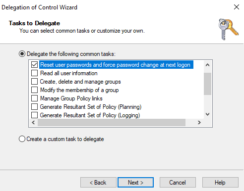
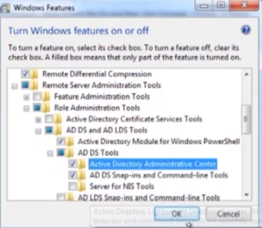
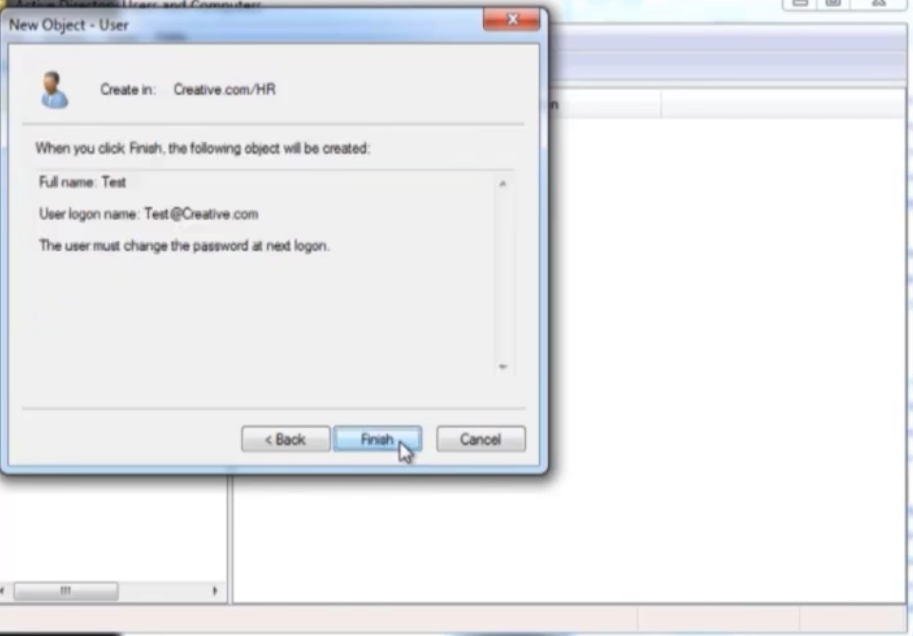

# 🖥️ Active Directory Administration Lab

A hands-on lab covering essential Active Directory (AD) user management, security, and delegation features in a Windows Server environment.

---

## 📋 Table of Contents

1. [Task 1 – Set Logon Hours for a User](#task-1--set-logon-hours-for-a-user)
2. [Task 2 – Verify Logon Hour Restriction](#task-2--verify-logon-hour-restriction)
3. [Task 3 – Restrict User to Specific Workstations (Log On To)](#task-3--restrict-user-to-specific-workstations-log-on-to)
4. [Task 4 – Verify Workstation Restriction](#task-4--verify-workstation-restriction)
5. [Task 5 – Protect an OU Container from Accidental Deletion](#task-5--protect-an-ou-container-from-accidental-deletion)
6. [Task 6 – Attempt to Delete a Protected OU](#task-6--attempt-to-delete-a-protected-ou)
7. [Task 7 – Remove Accidental Deletion Protection](#task-7--remove-accidental-deletion-protection)
8. [Task 8 – Enable Active Directory Recycle Bin](#task-8--enable-active-directory-recycle-bin)
9. [Task 9 – View Deleted Objects in Recycle Bin](#task-9--view-deleted-objects-in-recycle-bin)
10. [Task 10 – Delegate Control of an OU](#task-10--delegate-control-of-an-ou)
11. [Task 11 – Select Tasks to Delegate](#task-11--select-tasks-to-delegate)
12. [Task 12 – Install RSAT (AD Administrative Center)](#task-12--install-rsat-ad-administrative-center)
13. [Task 13 – Verify Delegated User Can Manage the OU](#task-13--verify-delegated-user-can-manage-the-ou)

---

## Lab Environment

| Component | Details |
|-----------|---------|
| **Domain** | DC.local / Creative.com |
| **Tool** | Active Directory Users and Computers (ADUC) |
| **Tool** | Active Directory Administrative Center (ADAC) |
| **OS** | Windows Server (Domain Controller) |

---

## Task 1 – Set Logon Hours for a User

**Objective:** Restrict when a domain user (Ahmed Abdo) can log on by configuring allowed logon hours.

**Steps:**
1. Open **Active Directory Users and Computers (ADUC)**
2. Navigate to the user's OU (e.g., HR)
3. Right-click the user → **Properties** → **Account** tab
4. Click **Logon Hours…**
5. Select the desired days/hours and set them to **Logon Permitted** (blue)
6. Click **OK** to apply

**Screenshot:**

> **Note:** In the example above, Ahmed Abdo is permitted to log on during specific hours on weekdays and the full day on Friday/Saturday. The status bar shows "Sunday from 6:00 PM to 7:00 PM" as a Logon Permitted block.

---

## Task 2 – Verify Logon Hour Restriction

**Objective:** Confirm that the user cannot sign in outside the configured logon hours.

**Steps:**
1. Attempt to log on to a domain-joined machine as the restricted user (Ahmed Abdo) outside the permitted hours
2. Observe the error message presented by Windows

**Screenshot:**

> **Result:** Windows displays: *"Your account has time restrictions that prevent you from signing in at this time. Please try again later."* — confirming the logon hours policy is enforced.

---

## Task 3 – Restrict User to Specific Workstations (Log On To)

**Objective:** Limit a user (Ahmed Ali) so they can only log on from specific computers.

**Steps:**
1. Open **ADUC** and navigate to the user's account
2. Right-click → **Properties** → **Account** tab
3. Click **Log On To…**
4. Select **The following computers**
5. Enter the **NetBIOS** or **DNS** name of the allowed computer (e.g., `hr`)
6. Click **Add**, then **OK**

**Screenshot:**

> **Note:** The user Ahmed Ali is restricted to log on only from the computer named `hr`.

---

## Task 4 – Verify Workstation Restriction

**Objective:** Confirm that the user is blocked from logging onto an unauthorized PC.

**Steps:**
1. Attempt to log on as Ahmed Ali from a computer **not** listed in the Logon Workstations setting
2. Observe the error message

**Screenshot:**

> **Result:** Windows displays: *"Your account is configured to prevent you from using this PC. Please try another PC."* — the workstation restriction is successfully enforced.

---

## Task 5 – Protect an OU Container from Accidental Deletion

**Objective:** Enable accidental deletion protection when creating a new Organizational Unit (OU).

**Steps:**
1. In **ADUC**, right-click the domain or parent OU → **New** → **Organizational Unit**
2. Enter a name (e.g., `tast`)
3. Ensure the checkbox **"Protect container from accidental deletion"** is checked ✅
4. Click **OK**

**Screenshot:**

> **Note:** This option is enabled by default when creating new OUs. It prevents accidental deletion via standard ADUC operations.

---

## Task 6 – Attempt to Delete a Protected OU

**Objective:** Demonstrate that a protected OU cannot be deleted without first removing the protection.

**Steps:**
1. In **ADUC**, right-click the protected OU (e.g., `tast`)
2. Select **Delete**
3. Observe the error from Active Directory Domain Services

**Screenshot:**

> **Result:** AD returns: *"You do not have sufficient privileges to delete tast, or this object is protected from accidental deletion."*

---

## Task 7 – Remove Accidental Deletion Protection

**Objective:** Unmark the protection flag on an OU so it can be managed or deleted.

**Steps:**
1. In **ADUC**, enable **View → Advanced Features**
2. Right-click the OU → **Properties** → **Object** tab
3. Uncheck **"Protect object from accidental deletion"**
4. Click **Apply** → **OK**

**Screenshot:**

> **Note:** The Object tab shows the canonical name (`DC.local/tast`), object class, creation/modification timestamps, and the protection checkbox.

---

## Task 8 – Enable Active Directory Recycle Bin

**Objective:** Enable the AD Recycle Bin feature to allow recovery of accidentally deleted AD objects.

**Steps:**
1. Open **Active Directory Administrative Center (ADAC)**
2. Click on the domain (DC local) in the left pane
3. In the **Tasks** pane on the right, click **Enable Recycle Bin…**
4. Confirm the action
5. Click **OK** on the confirmation dialog and refresh ADAC

**Screenshot:**

> **Note:** The dialog confirms: *"AD DS has begun enabling Recycle Bin for this forest. The Recycle Bin will not function reliably until all domain controllers in the forest have replicated the Recycle Bin configuration change."*

> ⚠️ **Important:** This operation is **irreversible**. The forest functional level must be at **Windows Server 2008 R2** or higher.

---

## Task 9 – View Deleted Objects in Recycle Bin

**Objective:** Locate and view a deleted user object in the AD Recycle Bin for potential restoration.

**Steps:**
1. In **ADAC**, navigate to the domain → **Deleted Objects** container
2. View the list of recently deleted objects
3. To restore: right-click the object → **Restore** (or **Restore To…** for a different OU)

**Screenshot:**

> **Result:** The user `Ahmed Ali` appears in the Deleted Objects container, deleted on `4/22/2026`, with last known parent `OU=HR,DC=D...` — ready to be restored if needed.

---

## Task 10 – Delegate Control of an OU

**Objective:** Use the Delegation of Control Wizard to grant a specific user administrative rights over an OU.

**Steps:**
1. In **ADUC**, right-click the target OU (e.g., HR) → **Delegate Control…**
2. The Delegation of Control Wizard opens
3. Click **Add…** and search for the user to delegate to (e.g., `Ahmed Abdo`)
4. Confirm the user resolves correctly (ahmed.abdo@DC.local)
5. Click **OK**, then **Next**

**Screenshot:**

---

## Task 11 – Select Tasks to Delegate

**Objective:** Choose which specific AD tasks the delegated user will be permitted to perform.

**Steps:**
1. On the **Tasks to Delegate** page of the wizard, select **"Delegate the following common tasks"**
2. Check the desired task(s), e.g., **"Reset user passwords and force password change at next logon"**
3. Click **Next** → review the summary → **Finish**

**Screenshot:**

> **Result:** Ahmed Abdo is now delegated the ability to reset passwords for users in the HR OU — without needing full Domain Admin privileges.

---

## Task 12 – Install RSAT (AD Administrative Center)

**Objective:** Install the Remote Server Administration Tools (RSAT) on a client machine to manage AD remotely.

**Steps:**
1. Open **Control Panel** → **Programs** → **Turn Windows features on or off**
2. Expand: `Remote Server Administration Tools` → `Role Administration Tools` → `AD DS and AD LDS Tools` → `AD DS Tools`
3. Check **Active Directory Administrative Center**
4. Click **OK** and wait for installation to complete

**Screenshot:**

> **Note:** On Windows 10/11, RSAT can also be installed via **Settings → Optional Features → Add a feature → RSAT: Active Directory Domain Services and Lightweight Directory Tools**.

---

## Task 13 – Verify Delegated User Can Manage the OU

**Objective:** Confirm that the delegated user can successfully create and manage objects within the assigned OU.

**Steps:**
1. Log on as the delegated user (e.g., the user from Creative.com with limited delegation)
2. Open **ADUC** and navigate to the HR OU
3. Create a new user object within that OU
4. Complete the wizard — the user object is created successfully

**Screenshot:**

> **Result:** The delegated user successfully creates `Test` (`Test@Creative.com`) in `Creative.com/HR` with the setting "The user must change the password at next logon" — confirming delegation is working correctly.

---

## 📝 Summary

| # | Task | Feature Used | Outcome |
|---|------|-------------|---------|
| 1 | Set logon hours | ADUC – Account Tab | User restricted to specific hours |
| 2 | Verify time restriction | Windows login screen | Login blocked outside permitted hours |
| 3 | Restrict logon workstations | ADUC – Log On To | User limited to specific PC |
| 4 | Verify workstation restriction | Windows login screen | Login blocked on unauthorized PC |
| 5 | Protect OU from deletion | ADUC – New OU dialog | Protection flag enabled |
| 6 | Attempt delete of protected OU | ADUC | Deletion blocked by AD |
| 7 | Remove deletion protection | ADUC – Object tab | Protection flag removed |
| 8 | Enable AD Recycle Bin | ADAC | Recycle Bin enabled for forest |
| 9 | View deleted objects | ADAC – Deleted Objects | Deleted user visible for restore |
| 10 | Delegate control | Delegation of Control Wizard | User selected for delegation |
| 11 | Choose delegated tasks | Delegation of Control Wizard | Password reset task delegated |
| 12 | Install RSAT | Windows Features | ADAC installed on client |
| 13 | Verify delegation | ADUC on client machine | Delegated user can create users in OU |

---

## 🔑 Key Concepts

- **Logon Hours** — Restricts the time window during which a user can authenticate to the domain
- **Logon Workstations** — Limits which computers a domain user account can be used on
- **Accidental Deletion Protection** — An ACL-based flag that prevents OU/object deletion unless explicitly removed
- **AD Recycle Bin** — Allows full attribute recovery of deleted AD objects without needing a backup restore
- **Delegation of Control** — Grants granular administrative permissions to non-admin users for specific OUs or tasks
- **RSAT** — Remote Server Administration Tools; allows managing AD from a non-DC Windows workstation

---

*Lab completed on Windows Server with Active Directory Domain Services (AD DS) — Domain: DC.local / Creative.com*
