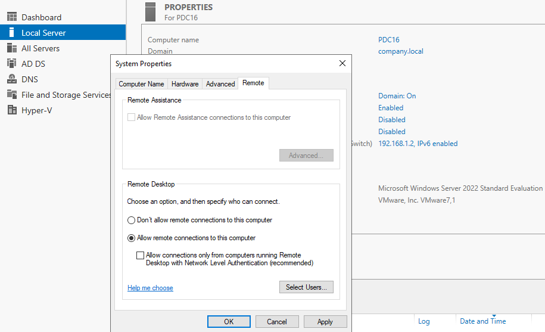
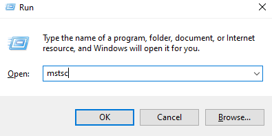
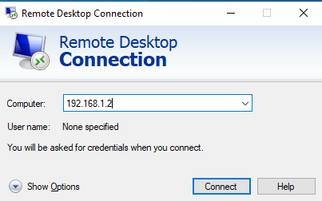
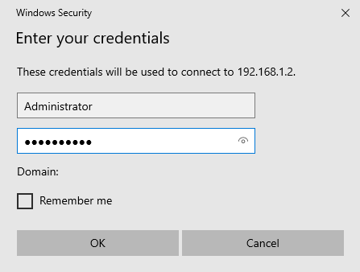
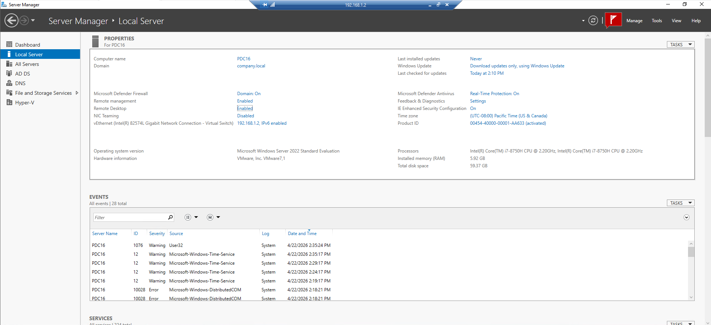
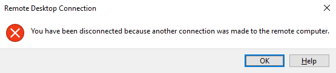
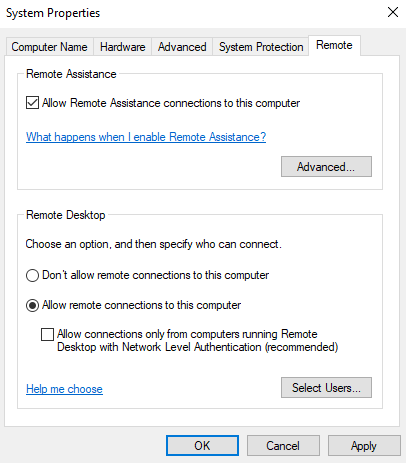
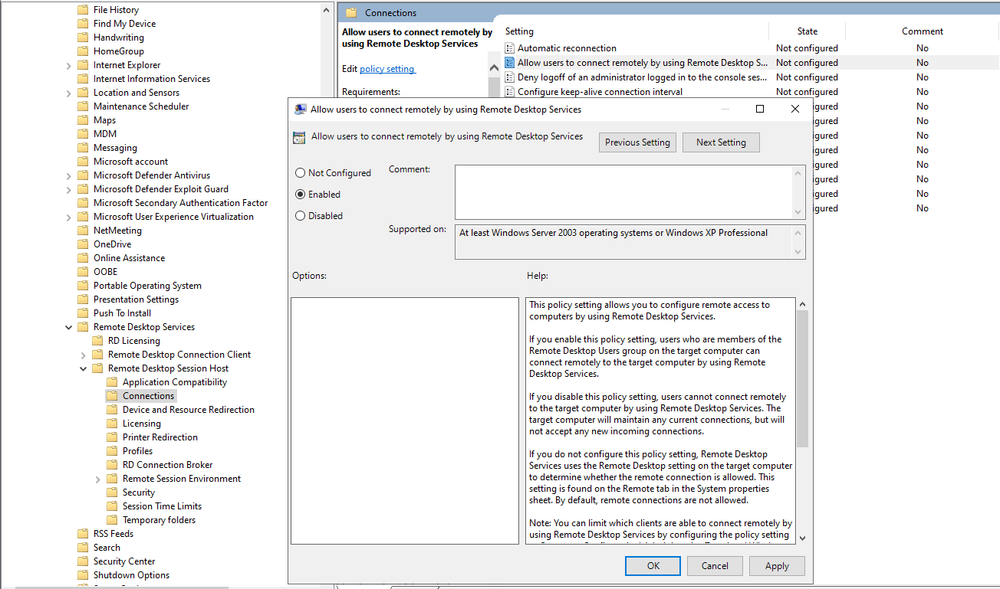
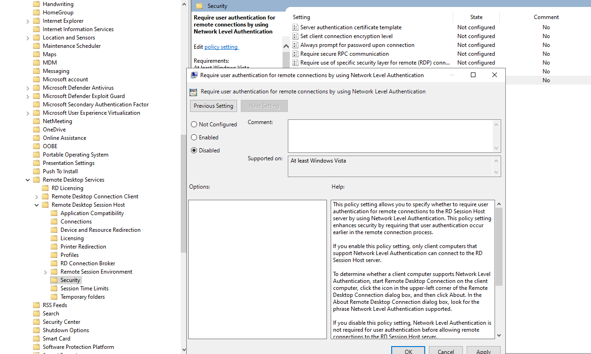
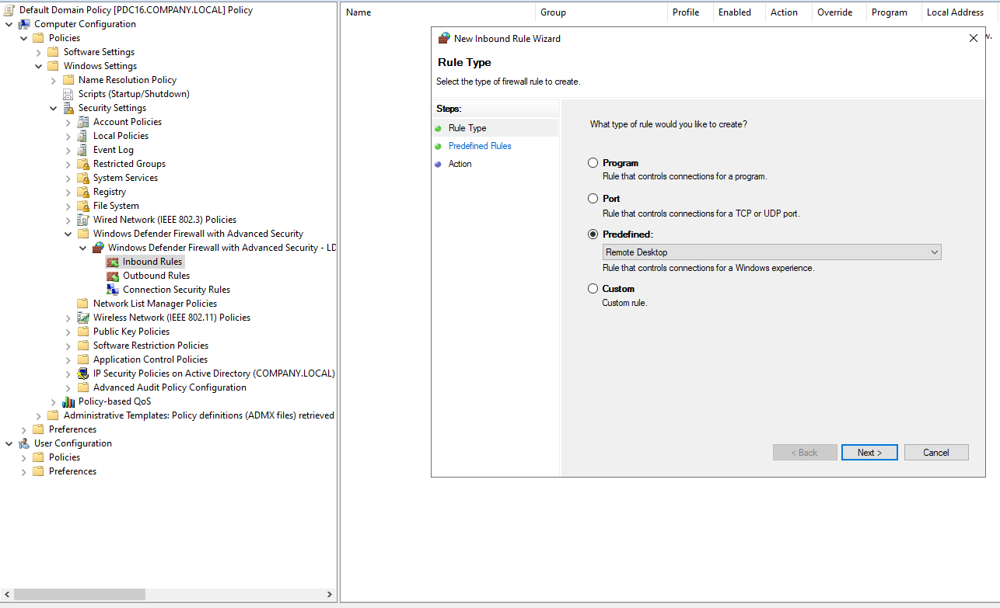

# 🖥️ Remote Desktop Protocol (RDP) Administration Lab

A hands-on lab covering how to configure, connect, restrict, and enforce Remote Desktop Protocol (RDP) access in a Windows Server / Active Directory environment using both GUI tools and Group Policy.

---

## 📋 Table of Contents

1. [Task 1 – Enable Remote Desktop on the Server](#task-1--enable-remote-desktop-on-the-server)
2. [Task 2 – Open RDP Client on the Client Machine](#task-2--open-rdp-client-on-the-client-machine)
3. [Task 3 – Enter the Remote Server's IP Address](#task-3--enter-the-remote-servers-ip-address)
4. [Task 4 – Enter Credentials to Authenticate](#task-4--enter-credentials-to-authenticate)
5. [Task 5 – Verify RDP Session is Active](#task-5--verify-rdp-session-is-active)
6. [Task 6 – Limitation: Only One RDP Session Allowed](#task-6--limitation-only-one-rdp-session-allowed)
7. [Task 7 – Enable Remote Desktop on a Client Machine](#task-7--enable-remote-desktop-on-a-client-machine)
8. [Task 8 – GPO Policy 1: Allow RDP via Group Policy](#task-8--gpo-policy-1-allow-rdp-via-group-policy)
9. [Task 9 – GPO Policy 2: Disable Network Level Authentication (NLA)](#task-9--gpo-policy-2-disable-network-level-authentication-nla)
10. [Task 10 – GPO Policy 3: Create Firewall Inbound Rule for RDP via GPO](#task-10--gpo-policy-3-create-firewall-inbound-rule-for-rdp-via-gpo)

---

## Lab Environment

| Component | Details |
|-----------|---------|
| **Server** | PDC16 — Windows Server 2022 Standard Evaluation |
| **Domain** | company.local |
| **Server IP** | 192.168.1.2 |
| **Tool** | Server Manager, Remote Desktop Connection (mstsc), Group Policy Editor |
| **Hypervisor** | VMware 7.1 |

---

## Task 1 – Enable Remote Desktop on the Server

### 📖 Explanation
By default, Windows Server does **not** allow incoming Remote Desktop connections for security reasons. Before any client can connect via RDP, you must explicitly enable it on the target server. This is done through **System Properties → Remote** tab. Without this step, all RDP connection attempts will be refused at the server level.

### 🔧 Steps
1. Open **Server Manager** on the server (PDC16)
2. Click **Local Server** in the left pane
3. Next to **Remote Desktop**, click the current status (likely "Disabled")
4. The **System Properties** dialog opens on the **Remote** tab
5. Under the **Remote Desktop** section, select:
   > ✅ **Allow remote connections to this computer**
6. Optionally, uncheck **"Allow connections only from computers running Remote Desktop with Network Level Authentication"** to allow older clients to connect
7. Click **Select Users…** if you want to grant RDP access to non-administrator accounts
8. Click **Apply** → **OK**

### ✅ Solution / Expected Result
Remote Desktop status in Server Manager changes from **Disabled** to **Enabled**. The server will now accept incoming RDP connections on TCP port **3389**.

**Screenshot:**



> **Note:** In the screenshot, "Allow remote connections to this computer" is selected on server PDC16 (company.local, IP: 192.168.1.2) running Windows Server 2022.

---

## Task 2 – Open RDP Client on the Client Machine

### 📖 Explanation
Windows includes a built-in Remote Desktop Connection client (`mstsc.exe` — Microsoft Terminal Services Client). To initiate an RDP session from any Windows machine, you launch this tool. The quickest way is via the **Run** dialog, which avoids having to navigate through the Start Menu.

### 🔧 Steps
1. On the **client machine**, press **Win + R** to open the Run dialog
2. Type: `mstsc`
3. Press **Enter** or click **OK**
4. The **Remote Desktop Connection** window will open

### ✅ Solution / Expected Result
The Remote Desktop Connection client application launches and is ready to accept a target computer address.

**Screenshot:**



> **Tip:** You can also search for "Remote Desktop Connection" in the Start Menu, or run `mstsc /v:192.168.1.2` directly to connect immediately without the GUI step.

---

## Task 3 – Enter the Remote Server's IP Address

### 📖 Explanation
Once the RDP client is open, you must specify **which computer to connect to**. You can use either the machine's **IP address** or its **DNS hostname** (e.g., `PDC16.company.local`). Using the IP address is reliable in environments where DNS resolution may not be configured on the client yet.

### 🔧 Steps
1. In the **Remote Desktop Connection** window, locate the **Computer:** field
2. Type the server's IP address: `192.168.1.2`
3. The **User name** field can be left as "None specified" — you will be prompted for credentials on the next screen
4. Click **Connect**

### ✅ Solution / Expected Result
The client initiates a TCP connection to the server on port 3389. A credentials prompt will appear next.

**Screenshot:**



> **Note:** You can click **Show Options** to pre-fill the username, configure display settings, redirect local resources (printers, drives, clipboard), and more before connecting.

---

## Task 4 – Enter Credentials to Authenticate

### 📖 Explanation
RDP requires authentication before granting access to the remote machine. Windows Security will prompt for a **username and password**. By default, only members of the **Administrators** group or the **Remote Desktop Users** group are permitted to connect. Providing the correct domain or local credentials allows the session to proceed.

### 🔧 Steps
1. When the **Windows Security – Enter your credentials** dialog appears:
   - **Username:** `Administrator` (or a domain user with RDP access, e.g., `company\username`)
   - **Password:** Enter the administrator password
   - **Domain:** Leave blank for local accounts, or it will be auto-filled for domain accounts
2. Optionally check **Remember me** to save the credentials for future sessions
3. Click **OK**

### ✅ Solution / Expected Result
If credentials are valid and the user has permission, the RDP session is established and the remote desktop is displayed.

**Screenshot:**



> **Security Note:** Avoid using **Remember me** on shared or untrusted machines, as saved credentials can be extracted from the Windows Credential Manager.

---

## Task 5 – Verify RDP Session is Active

### 📖 Explanation
After successfully authenticating, you are presented with the **remote server's desktop environment**. In this case, **Server Manager** is visible, confirming you are now operating inside the remote session on PDC16. The RDP title bar at the top of the screen shows the remote machine's IP (`192.168.1.2`), which is a clear indicator that the session is active and remote.

### 🔧 Steps
1. After credentials are accepted, the remote desktop loads
2. Verify the **title bar** at the top shows the remote IP address (`192.168.1.2`)
3. Confirm you can see and interact with the **Server Manager** or remote desktop
4. Check **Local Server** in Server Manager → **Remote Desktop** should show **Enabled**

### ✅ Solution / Expected Result
A full remote desktop session is active. You are now controlling PDC16 from the client machine. Server Manager shows Remote Desktop as **Enabled** and all server properties are accessible.

**Screenshot:**



> **Note:** The blue RDP toolbar at the top (showing `192.168.1.2`) is the RDP session bar — it confirms this is a remote session. You can minimize, restore, or disconnect from here.

---

## Task 6 – Limitation: Only One RDP Session Allowed

### 📖 Explanation
Windows Server (without the **Remote Desktop Services / Terminal Services** role installed and licensed) supports only **one concurrent RDP session** by default. This is a built-in OS limitation. If a second user (or even the same user from another machine) tries to connect via RDP while a session is already active, the first session is **forcibly disconnected**. This behavior is by design to enforce licensing — unlimited concurrent sessions require the **RD Session Host** role and **RD Licensing**.

### 🔧 Steps
1. While an RDP session is already active on PDC16, attempt to connect again from a **second client** using the same or different credentials
2. The second connection will succeed — but the **first session** will be terminated automatically

### ✅ Solution / Expected Result
The original RDP session receives the error:

> *"You have been disconnected because another connection was made to the remote computer."*

This confirms the single-session limitation of standard Windows Server RDP.

**Screenshot:**



> **Fix:** To support multiple concurrent RDP sessions, install the **Remote Desktop Session Host (RDSH)** role via Server Manager and configure **RD Licensing**. This requires appropriate Microsoft CALs (Client Access Licenses).

---

## Task 7 – Enable Remote Desktop on a Client Machine

### 📖 Explanation
RDP is not only for servers — you can also enable it on **Windows 10/11 client machines** so that administrators or support staff can remotely access them. The process is identical to enabling RDP on a server: through **System Properties → Remote** tab. This is useful for IT helpdesk scenarios and remote management of workstations.

### 🔧 Steps
1. On the **client machine**, right-click **This PC** → **Properties**, or go to **Control Panel → System → Remote Settings**
2. The **System Properties** dialog opens on the **Remote** tab
3. Under **Remote Assistance**: check **"Allow Remote Assistance connections to this computer"** (optional, for assisted sessions)
4. Under **Remote Desktop**: select **"Allow remote connections to this computer"**
5. Optionally uncheck NLA requirement for broader compatibility
6. Click **Apply** → **OK**

### ✅ Solution / Expected Result
The client machine is now accessible via RDP. Other users with the correct credentials and network access can remotely connect to this workstation.

**Screenshot:**



> **Note:** On Windows 10/11 Home edition, RDP hosting is **not available** — only Pro, Enterprise, and Education editions support incoming RDP connections.

---

## Task 8 – GPO Policy 1: Allow RDP via Group Policy

### 📖 Explanation
In enterprise environments, manually enabling RDP on each machine is impractical. **Group Policy Objects (GPOs)** allow administrators to enforce RDP settings across **all computers in a domain** from a central location. The policy **"Allow users to connect remotely by using Remote Desktop Services"** enables or disables RDP connectivity domain-wide and overrides local System Properties settings on domain-joined machines.

**Policy Path:**
```
Computer Configuration → Administrative Templates → Windows Components
→ Remote Desktop Services → Remote Desktop Session Host → Connections
→ Allow users to connect remotely by using Remote Desktop Services
```

### 🔧 Steps
1. Open **Group Policy Management** on the Domain Controller (`gpmc.msc`)
2. Edit the **Default Domain Policy** (or create a dedicated GPO)
3. Navigate to:
   `Computer Configuration → Policies → Administrative Templates → Windows Components → Remote Desktop Services → Remote Desktop Session Host → Connections`
4. Double-click **"Allow users to connect remotely by using Remote Desktop Services"**
5. Set to **Enabled**
6. Click **Apply** → **OK**
7. Run `gpupdate /force` on target machines or wait for Group Policy refresh

### ✅ Solution / Expected Result
RDP is enabled on all machines targeted by this GPO without needing to touch each machine individually. The policy state changes from "Not configured" to **Enabled**.

**Screenshot:**



> **Note:** The Help text in the policy editor explains: if Enabled, members of the Remote Desktop Users group can connect remotely. If Disabled, no new connections are accepted. If Not Configured, the local System Properties Remote setting governs behavior.

---

## Task 9 – GPO Policy 2: Disable Network Level Authentication (NLA)

### 📖 Explanation
**Network Level Authentication (NLA)** is a security feature that requires users to authenticate **before** a full RDP session is established (pre-session authentication). While NLA is more secure (it protects against denial-of-service attacks and unauthorized access to the login screen), it can cause compatibility issues with older clients or specific configurations. Disabling NLA via GPO allows a broader range of clients to connect, at the cost of reduced pre-authentication security.

**Policy Path:**
```
Computer Configuration → Administrative Templates → Windows Components
→ Remote Desktop Services → Remote Desktop Session Host → Security
→ Require user authentication for remote connections by using NLA
```

### 🔧 Steps
1. In the same GPO, navigate to:
   `Computer Configuration → Administrative Templates → Windows Components → Remote Desktop Services → Remote Desktop Session Host → Security`
2. Double-click **"Require user authentication for remote connections by using Network Level Authentication"**
3. Set to **Disabled**
4. Click **Apply** → **OK**
5. Run `gpupdate /force` or allow policy to propagate

### ✅ Solution / Expected Result
NLA is no longer required for incoming RDP connections. Older clients or systems that do not support NLA can now connect. The policy state is set to **Disabled**.

**Screenshot:**



> ⚠️ **Security Warning:** Disabling NLA exposes the Windows login screen to unauthenticated users before they provide credentials. Only disable NLA if there is a specific compatibility reason. In production environments, keep NLA **Enabled** unless required otherwise.

---

## Task 10 – GPO Policy 3: Create Firewall Inbound Rule for RDP via GPO

### 📖 Explanation
Even with RDP enabled in System Properties and via GPO, the **Windows Defender Firewall** may block incoming connections on TCP port 3389. Rather than disabling the firewall (which is dangerous), the correct approach is to create a specific **Inbound Firewall Rule** that allows RDP traffic. Doing this via GPO ensures the firewall rule is applied automatically to all domain-joined machines, eliminating the need to configure each machine's firewall individually.

**GPO Path:**
```
Computer Configuration → Policies → Windows Settings → Security Settings
→ Windows Defender Firewall with Advanced Security → Inbound Rules
```

### 🔧 Steps
1. In the GPO editor, navigate to:
   `Computer Configuration → Policies → Windows Settings → Security Settings → Windows Defender Firewall with Advanced Security → Windows Defender Firewall with Advanced Security – Local Group Policy Object → Inbound Rules`
2. Right-click **Inbound Rules** → **New Rule…**
3. In the **New Inbound Rule Wizard**:
   - **Rule Type:** Select **Predefined**
   - From the dropdown, choose **Remote Desktop**
   - Click **Next**
4. On the **Predefined Rules** page, ensure the relevant rules are checked
5. On the **Action** page, select **Allow the connection**
6. Click **Finish**
7. Run `gpupdate /force` on target machines

### ✅ Solution / Expected Result
A predefined firewall rule allowing RDP (TCP port 3389) traffic is created and applied via GPO. All domain-joined machines targeted by this policy will automatically permit RDP through the firewall without manual configuration.

**Screenshot:**



> **Note:** The **Predefined: Remote Desktop** option in the wizard automatically configures the correct port (TCP 3389), protocol, and scope — this is safer and more reliable than creating a custom port rule manually.

---

## 📝 Summary

| # | Task | Tool Used | Key Setting | Outcome |
|---|------|-----------|-------------|---------|
| 1 | Enable RDP on server | Server Manager / System Properties | Allow remote connections | Server accepts RDP on port 3389 |
| 2 | Open RDP client | Run dialog (`mstsc`) | Launch RDP client app | Remote Desktop Connection opens |
| 3 | Enter server IP | RDP Client | IP: 192.168.1.2 | Connection initiated to server |
| 4 | Authenticate | Windows Security dialog | Admin credentials | Session authenticated |
| 5 | Verify active session | RDP session / Server Manager | Remote Desktop = Enabled | Full remote desktop session active |
| 6 | Single session limit | RDP behavior | No RD Session Host role | First session disconnected by second |
| 7 | Enable RDP on client | System Properties – Remote tab | Allow remote connections | Client machine accepts RDP |
| 8 | GPO: Allow RDP | Group Policy Editor | Enable RDS connections policy | RDP enabled domain-wide via GPO |
| 9 | GPO: Disable NLA | Group Policy Editor | Disable NLA requirement | Older clients can connect |
| 10 | GPO: Firewall rule | Group Policy – Firewall | Predefined: Remote Desktop rule | Firewall allows RDP traffic via GPO |

---

## 🔑 Key Concepts

| Concept | Description |
|---------|-------------|
| **RDP (Remote Desktop Protocol)** | Microsoft's proprietary protocol for remote GUI access to Windows machines, operating on TCP port 3389 |
| **mstsc.exe** | The built-in Windows RDP client (Microsoft Terminal Services Client) |
| **NLA (Network Level Authentication)** | Pre-session authentication that verifies user credentials before a full desktop session is established — enhances security |
| **Single Session Limit** | Standard Windows Server allows only one concurrent RDP session without the Remote Desktop Session Host (RDSH) role |
| **RD Session Host** | A Windows Server role that enables multiple concurrent RDP sessions with proper RD CAL licensing |
| **Group Policy Object (GPO)** | A collection of settings applied to computers or users in a domain, used here to enforce RDP and firewall settings centrally |
| **Windows Defender Firewall Inbound Rule** | A rule that allows specific network traffic (e.g., TCP 3389) through the firewall to reach the target machine |
| **gpupdate /force** | Command to immediately apply Group Policy changes without waiting for the default refresh cycle |

---

## 🛠️ Troubleshooting

| Problem | Likely Cause | Solution |
|---------|-------------|----------|
| Connection refused | RDP not enabled on target | Enable via System Properties or GPO (Task 1/8) |
| Firewall blocking | No inbound rule for TCP 3389 | Add firewall rule manually or via GPO (Task 10) |
| Credentials rejected | Wrong username/password or no RDP permission | Verify credentials; add user to Remote Desktop Users group |
| Disconnected by another user | Single session limit | Install RD Session Host role; or use /admin flag |
| NLA error on old client | NLA enforced, client doesn't support it | Disable NLA via GPO (Task 9) or upgrade client |
| GPO not applying | Policy not propagated yet | Run `gpupdate /force` on target machine |

---

*Lab completed on Windows Server 2022 — Domain: company.local (PDC16, IP: 192.168.1.2)*
