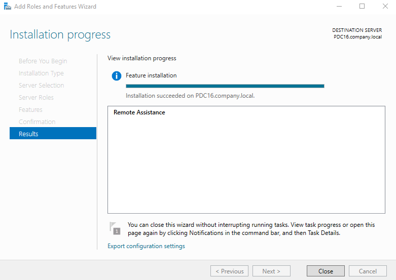
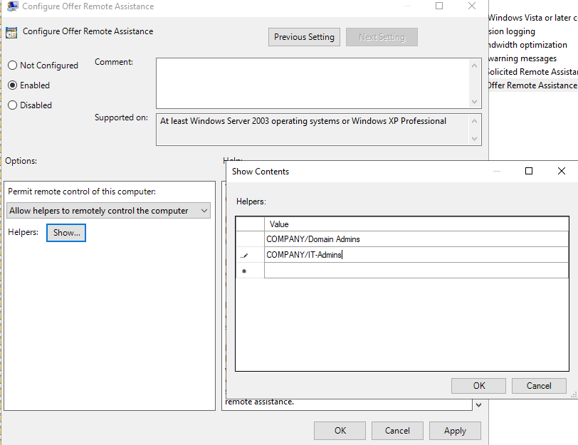
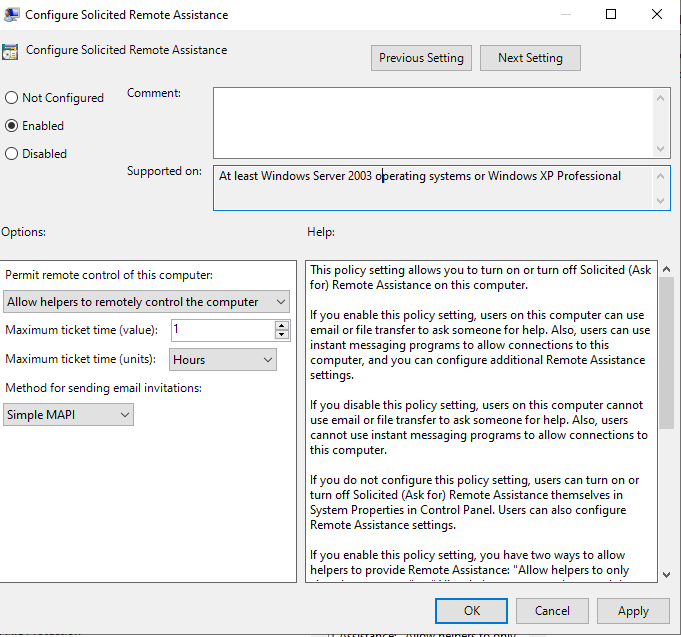
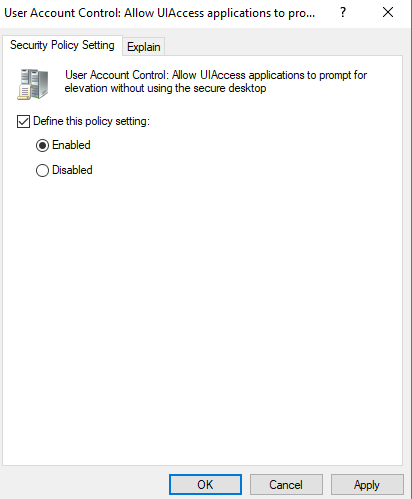
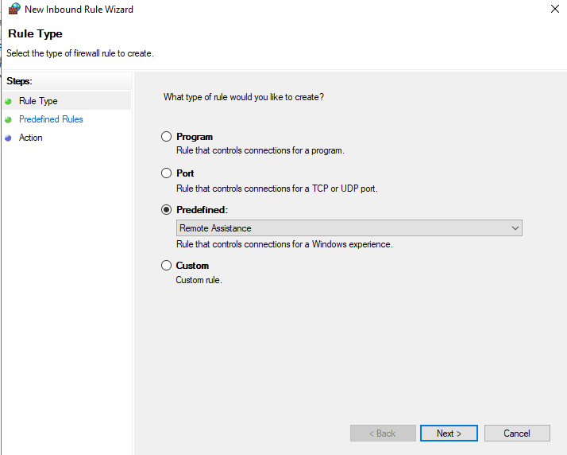
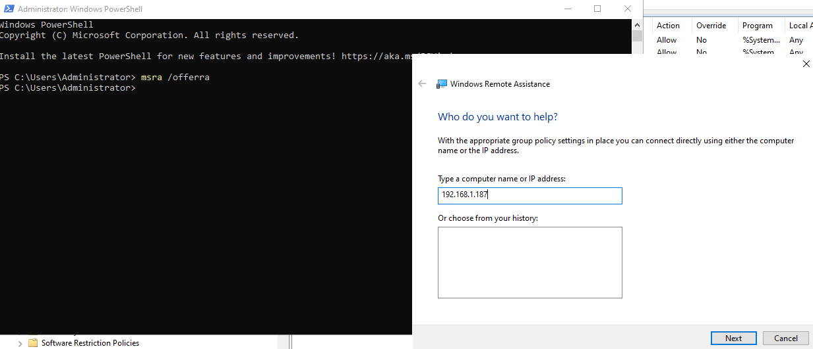
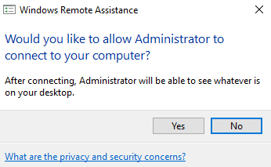
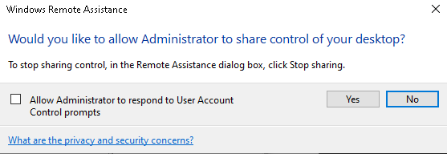
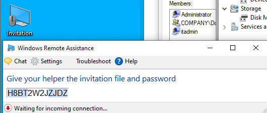

# 🤝 Windows Remote Assistance Administration Lab

A hands-on lab covering how to install, configure, and use **Windows Remote Assistance** in a Windows Server / Active Directory domain environment. This lab walks through both **Offer Remote Assistance** (admin-initiated, no invitation needed) and **Solicited Remote Assistance** (user-initiated via invitation), enforced through Group Policy Objects (GPOs).

---

## 📋 Table of Contents

1. [Task 1 – Install the Remote Assistance Feature](#task-1--install-the-remote-assistance-feature)
2. [Task 2 – Configure Offer Remote Assistance Policy (GPO)](#task-2--configure-offer-remote-assistance-policy-gpo)
3. [Task 3 – Configure Solicited Remote Assistance Policy (GPO)](#task-3--configure-solicited-remote-assistance-policy-gpo)
4. [Task 4 – Enable UAC UIAccess Policy](#task-4--enable-uac-uiaccess-policy)
5. [Task 5 – Create Firewall Inbound Rule for Remote Assistance](#task-5--create-firewall-inbound-rule-for-remote-assistance)
6. [Task 6 – Offer Remote Assistance to a Client](#task-6--offer-remote-assistance-to-a-client)
7. [Task 7 – Client Accepts the Remote Assistance Connection](#task-7--client-accepts-the-remote-assistance-connection)
8. [Task 8 – Admin Requests Desktop Control](#task-8--admin-requests-desktop-control)
9. [Task 9 – Solicited Remote Assistance via Invitation File](#task-9--solicited-remote-assistance-via-invitation-file)

---

## 🖥️ Lab Environment

| Component | Details |
|-----------|---------|
| **Server** | PDC16 — Windows Server 2022 |
| **Domain** | COMPANY.local |
| **Helper Groups** | COMPANY\Domain Admins, COMPANY\IT-Admins |
| **Client IP** | 192.168.1.187 |
| **Tool** | Server Manager, Group Policy Management, Windows Remote Assistance (`msra.exe`) |

---

## ⚙️ How Remote Assistance Works

Windows Remote Assistance has two distinct modes:

| Mode | Who Initiates | Requires Invitation? | Use Case |
|------|--------------|----------------------|----------|
| **Solicited (Ask for)** | The user in need | Yes — user sends invitation file or email | User asks helpdesk for help |
| **Offer (Unsolicited)** | The IT admin/helper | No — admin pushes connection | Admin proactively assists a user |

Both modes allow the helper to **view** the user's screen, and optionally **take control** (with user permission).

---

## Task 1 – Install the Remote Assistance Feature

### 📖 Explanation
**Windows Remote Assistance** is not installed by default on Windows Server — it is an optional **feature** that must be added through Server Manager. Without this feature installed on the helper machine (or the target if it's a server), the `msra.exe` tool and Remote Assistance functionality will not be available. This is the mandatory first step before any configuration or usage.

### 🔧 Steps
1. Open **Server Manager** on the server (PDC16.company.local)
2. Click **Manage** → **Add Roles and Features**
3. Click **Next** through: Before You Begin → Installation Type (Role-based) → Server Selection (PDC16)
4. On the **Features** page, scroll down and check **Remote Assistance**
5. Click **Next** → **Install**
6. Wait for installation to complete — the progress bar will fill and show **"Installation succeeded on PDC16.company.local"**
7. Click **Close**

### ✅ Solution / Expected Result
The Add Roles and Features Wizard displays **"Installation succeeded on PDC16.company.local"** with **Remote Assistance** listed as the installed feature. The `msra.exe` tool is now available on the server.

**Screenshot:**



> **Note:** Remote Assistance must be installed on the **helper's machine** (the admin machine initiating the connection). The client (user) side already has Remote Assistance built into Windows 10/11 by default.

---

## Task 2 – Configure Offer Remote Assistance Policy (GPO)

### 📖 Explanation
**Offer Remote Assistance** allows IT admins to connect to a user's machine **proactively** — without requiring the user to send an invitation first. This is the most efficient support model for enterprises. However, it requires a GPO to specify **which users or groups** are authorized to offer assistance. Without this policy, the offer feature is blocked for security reasons. The policy also defines whether helpers can only view the screen or can also take full control.

**GPO Policy Path:**
```
Computer Configuration → Administrative Templates → System → Remote Assistance
→ Configure Offer Remote Assistance
```

### 🔧 Steps
1. Open **Group Policy Management** (`gpmc.msc`) on the Domain Controller
2. Edit the **Default Domain Policy** (or a dedicated GPO linked to the target OU)
3. Navigate to:
   `Computer Configuration → Administrative Templates → System → Remote Assistance`
4. Double-click **"Configure Offer Remote Assistance"**
5. Set the state to **Enabled**
6. Under **"Permit remote control of this computer"**, select:
   > **Allow helpers to remotely control the computer**
7. Click **Show…** next to **Helpers** to define who can offer assistance
8. In the **Show Contents** dialog, add the authorized groups:
   - `COMPANY/Domain Admins`
   - `COMPANY/IT-Admins`
9. Click **OK** → **Apply** → **OK**
10. Run `gpupdate /force` on target machines or wait for policy refresh

### ✅ Solution / Expected Result
The policy is set to **Enabled** with both `COMPANY/Domain Admins` and `COMPANY/IT-Admins` listed as authorized helpers. Members of these groups can now proactively offer Remote Assistance to any domain-joined machine targeted by this GPO.

**Screenshot:**



> **Important:** The helper groups must be specified in the format `DOMAIN\GroupName` or `DOMAIN/GroupName`. If this list is left empty while the policy is enabled, **no one** will be able to offer assistance.

---

## Task 3 – Configure Solicited Remote Assistance Policy (GPO)

### 📖 Explanation
**Solicited Remote Assistance** is the user-initiated mode — the user experiencing a problem creates an **invitation** (a `.msrcincident` file or email) and sends it to the helper. The helper opens the invitation to connect. This GPO policy enables this mode and configures important parameters such as:

- Whether helpers can **view only** or **take control**
- How long an invitation remains **valid** (ticket expiry time)
- The **method** for sending invitations (Simple MAPI email or file)

This policy gives IT control over how solicited sessions operate, preventing users from creating long-lived or insecure invitations.

**GPO Policy Path:**
```
Computer Configuration → Administrative Templates → System → Remote Assistance
→ Configure Solicited Remote Assistance
```

### 🔧 Steps
1. In the same GPO, navigate to:
   `Computer Configuration → Administrative Templates → System → Remote Assistance`
2. Double-click **"Configure Solicited Remote Assistance"**
3. Set the state to **Enabled**
4. Configure the options:
   - **Permit remote control:** `Allow helpers to remotely control the computer`
   - **Maximum ticket time (value):** `1`
   - **Maximum ticket time (units):** `Hours`
   - **Method for sending email invitations:** `Simple MAPI`
5. Click **Apply** → **OK**
6. Run `gpupdate /force` on target machines

### ✅ Solution / Expected Result
Solicited Remote Assistance is **Enabled** with remote control permitted. Invitations expire after **1 hour**, limiting the risk of stale invitations being used. Users can now generate invitation files to send to IT support staff.

**Screenshot:**



> **Tip:** Setting a short ticket expiry time (e.g., 1 hour) is a security best practice. Longer values (e.g., 99 days) increase the window during which an invitation file could be intercepted and misused.

---

## Task 4 – Enable UAC UIAccess Policy

### 📖 Explanation
When a helper takes control via Remote Assistance, they may need to interact with **User Account Control (UAC) prompts** on the remote machine — for example, to approve administrative actions on behalf of the user. By default, UAC prompts appear on the **secure desktop**, which is isolated from Remote Assistance and cannot be interacted with remotely.

Enabling the **"Allow UIAccess applications to prompt for elevation without using the secure desktop"** policy allows Remote Assistance (`msra.exe`) — which is a UIAccess application — to interact with elevation prompts during a remote session, making the support session fully functional for admin tasks.

**Policy Path:**
```
Computer Configuration → Windows Settings → Security Settings → Local Policies
→ Security Options → User Account Control: Allow UIAccess applications to
  prompt for elevation without using the secure desktop
```

### 🔧 Steps
1. In the GPO editor, navigate to:
   `Computer Configuration → Windows Settings → Security Settings → Local Policies → Security Options`
2. Locate **"User Account Control: Allow UIAccess applications to prompt for elevation without using the secure desktop"**
3. Double-click it to open the **Security Policy Setting**
4. Check **"Define this policy setting"**
5. Select **Enabled**
6. Click **Apply** → **OK**

### ✅ Solution / Expected Result
The policy is **Enabled**, allowing Remote Assistance to display and interact with UAC prompts during remote sessions. The helper can now assist with tasks requiring administrative elevation without the session being blocked by the secure desktop.

**Screenshot:**



> **Note:** This policy applies only to applications signed with a valid UIAccess manifest (like `msra.exe`). It does not grant all applications elevated UAC bypass — it is scoped specifically to trusted UIAccess tools.

---

## Task 5 – Create Firewall Inbound Rule for Remote Assistance

### 📖 Explanation
Windows Defender Firewall will block incoming Remote Assistance connections by default unless a specific firewall rule is in place. Rather than disabling the firewall (which is a major security risk), the correct approach is to create a **predefined inbound firewall rule** for Remote Assistance via GPO. This ensures all domain machines automatically allow Remote Assistance traffic while keeping the firewall active for all other traffic.

Remote Assistance uses **TCP port 135** (RPC endpoint mapper) and dynamically assigned high ports, which is why using the predefined rule (rather than a manual port rule) is the recommended approach.

**GPO Path:**
```
Computer Configuration → Policies → Windows Settings → Security Settings
→ Windows Defender Firewall with Advanced Security → Inbound Rules
```

### 🔧 Steps
1. In the GPO editor, navigate to:
   `Computer Configuration → Policies → Windows Settings → Security Settings → Windows Defender Firewall with Advanced Security → Inbound Rules`
2. Right-click **Inbound Rules** → **New Rule…**
3. In the **New Inbound Rule Wizard**:
   - **Rule Type:** Select **Predefined**
   - From the dropdown, choose **Remote Assistance**
   - Click **Next**
4. On the **Predefined Rules** page, ensure all relevant Remote Assistance rules are checked
5. On the **Action** page, select **Allow the connection**
6. Click **Finish**
7. Apply the GPO and run `gpupdate /force`

### ✅ Solution / Expected Result
A predefined firewall inbound rule for **Remote Assistance** is created via GPO. All domain-joined machines targeted by this policy will automatically permit Remote Assistance traffic through Windows Defender Firewall.

**Screenshot:**



> **Why Predefined?** The predefined "Remote Assistance" rule automatically handles all the required ports and protocols (TCP 135, dynamic RPC ports, DCOM). Creating a simple "open port 135" rule manually would be incomplete and potentially insecure.

---

## Task 6 – Offer Remote Assistance to a Client

### 📖 Explanation
With all GPO policies and firewall rules in place, the administrator can now **proactively offer Remote Assistance** to a user's machine without any invitation. This is done using the `msra /offerra` command, which launches the **Offer Remote Assistance** dialog. The admin simply types the target machine's IP address or hostname and initiates the connection. This is the standard helpdesk workflow for unsolicited (admin-pushed) assistance.

### 🔧 Steps
1. On the **helper (admin) machine**, open **Windows PowerShell** or **Command Prompt** as Administrator
2. Type the following command and press Enter:
   ```
   msra /offerra
   ```
3. The **Windows Remote Assistance – "Who do you want to help?"** dialog opens
4. In the **"Type a computer name or IP address"** field, enter the client's IP:
   `192.168.1.187`
5. Click **Next**
6. Windows Remote Assistance initiates a connection request to the target machine

### ✅ Solution / Expected Result
The Windows Remote Assistance tool launches in Offer mode. After entering the client's IP (`192.168.1.187`) and clicking Next, a connection request is sent to the client machine. The client will receive a prompt to accept or decline the connection.

**Screenshot:**



> **Alternative:** You can also run `msra /offerra` from the Run dialog (`Win + R`). The `/offerra` flag stands for "offer remote assistance" and bypasses the invitation-based flow, allowing direct connection using the GPO-authorized helper credentials.

---

## Task 7 – Client Accepts the Remote Assistance Connection

### 📖 Explanation
When the admin initiates an Offer Remote Assistance connection, the **target user's machine displays a consent prompt**. This is a critical security feature — the user must explicitly **accept** the connection before the helper can see their screen. Windows Remote Assistance always requires user consent to begin a session, ensuring no silent, covert access is possible. The user can see who is requesting access (the administrator's name is shown) and can accept or decline.

### 🔧 Steps
1. On the **client machine** (192.168.1.187), a dialog box appears:
   > *"Would you like to allow Administrator to connect to your computer?"*
   > *"After connecting, Administrator will be able to see whatever is on your desktop."*
2. The user reviews the request and clicks **Yes** to accept
3. The Remote Assistance session is established — the helper can now **view** the client's desktop in real time

### ✅ Solution / Expected Result
The user clicks **Yes** and the Remote Assistance session begins. The admin's machine displays the client's desktop in a Remote Assistance window. At this stage the helper can **view only** — they cannot control the mouse or keyboard yet without a further request.

**Screenshot:**



> **Privacy Note:** The user can terminate the session at any time by pressing **Esc** or clicking **Stop sharing** in the Remote Assistance toolbar. The helper cannot prevent the user from disconnecting the session.

---

## Task 8 – Admin Requests Desktop Control

### 📖 Explanation
After establishing a view-only Remote Assistance session, the helper may need to **actively control** the client's mouse and keyboard to perform troubleshooting steps. To do this, the helper must explicitly **request control** from within the Remote Assistance window. The client receives another consent prompt and must approve the control request. This two-step consent model (first for viewing, then for control) ensures the user is always in charge of what the helper can do.

### 🔧 Steps
1. In the **Remote Assistance** window on the **helper's machine**, click **Request control** in the toolbar
2. On the **client machine**, a second dialog appears:
   > *"Would you like to allow Administrator to share control of your desktop?"*
   > *"To stop sharing control, in the Remote Assistance dialog box, click Stop sharing."*
3. The user can optionally check **"Allow Administrator to respond to User Account Control prompts"** (relates to Task 4 UAC policy)
4. The user clicks **Yes** to grant control
5. The helper can now move the mouse, type, and perform actions on the client's desktop

### ✅ Solution / Expected Result
After the user approves, the helper has **full interactive control** of the client's desktop. Both the helper and the user can see all actions being performed in real time. The user can revoke control at any time by clicking **Stop sharing** or pressing **Esc**.

**Screenshot:**



> **Best Practice:** Always communicate verbally (phone/chat) with the user while controlling their desktop. Explain what you are doing at each step so the user remains informed and comfortable. Unexplained mouse movements can be alarming to users.

---

## Task 9 – Solicited Remote Assistance via Invitation File

### 📖 Explanation
**Solicited Remote Assistance** is the user-initiated alternative to Offer mode. The user generates an **invitation file** containing a session password, and sends it to the helper (via email, shared drive, or chat). The helper opens the file, enters the password, and connects. This is useful when the admin does not have Offer permissions configured, or when the user initiates the support request themselves.

The **invitation file** (`.msrcincident`) is encrypted and contains a one-time session token. A **password** is automatically generated and displayed — the user must share this password with the helper separately (it is not embedded in the file, for security). The invitation expires based on the **ticket time** configured in the Solicited Remote Assistance GPO (Task 3 — 1 hour in this lab).

### 🔧 Steps

**On the Client (User) Machine — Generate the Invitation:**
1. Press **Win + R**, type `msra`, press Enter
2. Click **"Invite someone you trust to help you"**
3. Choose **"Save this invitation as a file"** (or email if MAPI is configured)
4. Save the `.msrcincident` file to a shared location or send via email/chat
5. The Windows Remote Assistance window displays a **one-time password** (e.g., `H8BT2W2JZJDZ`)
6. The dialog shows **"Waiting for incoming connection…"**
7. Share the password with the helper through a **separate secure channel** (phone, Teams, email)

**On the Helper (Admin) Machine — Connect via Invitation:**
1. Open the received `.msrcincident` invitation file
2. Enter the password provided by the user
3. The connection is established — proceed as in Tasks 7 and 8

### ✅ Solution / Expected Result
The client machine displays the invitation password and the status **"Waiting for incoming connection…"**. Once the helper opens the invitation file and enters the correct password within the ticket's validity period (1 hour), the Remote Assistance session is established successfully.

**Screenshot:**



> **Security Note:** Never share the invitation file and password through the **same channel**. If both are intercepted together (e.g., in a single email), an attacker could connect to the machine. Send the file via email and share the password verbally or via a separate chat message.

---

## 📝 Summary

| # | Task | Tool / Location | Key Action | Outcome |
|---|------|----------------|------------|---------|
| 1 | Install Remote Assistance | Server Manager → Add Features | Install Remote Assistance feature | `msra.exe` available on server |
| 2 | Configure Offer RA Policy | GPO → System → Remote Assistance | Enable + specify helper groups | Domain Admins & IT-Admins can offer RA |
| 3 | Configure Solicited RA Policy | GPO → System → Remote Assistance | Enable + set 1-hour ticket time | Users can generate invitations |
| 4 | Enable UAC UIAccess | GPO → Security Options | Enable UIAccess elevation policy | Helper can interact with UAC prompts |
| 5 | Firewall Rule for RA | GPO → Windows Defender Firewall | Predefined: Remote Assistance inbound rule | Firewall allows RA traffic domain-wide |
| 6 | Offer Remote Assistance | `msra /offerra` on helper machine | Enter client IP → initiate connection | Connection request sent to client |
| 7 | Client Accepts Connection | Client consent dialog | User clicks Yes | Helper can view client's desktop |
| 8 | Request Desktop Control | Remote Assistance toolbar | Helper requests control → user approves | Helper has full interactive control |
| 9 | Solicited RA via Invitation | `msra` on client → save invitation file | Client generates file + password | Helper connects using file + password |

---

## 🔑 Key Concepts

| Concept | Description |
|---------|-------------|
| **Windows Remote Assistance (WRA)** | A Windows feature allowing a helper to view and optionally control another user's desktop, always with user consent |
| **Offer Remote Assistance** | Admin-initiated mode using `msra /offerra` — no invitation needed; requires GPO authorization |
| **Solicited Remote Assistance** | User-initiated mode — user generates an invitation file and password; helper connects using both |
| **msra.exe** | The Windows Remote Assistance executable — the built-in tool for both helper and user roles |
| **Helpers (GPO)** | The groups authorized to offer unsolicited assistance — must be defined in the Offer RA GPO policy |
| **Ticket Expiry Time** | The duration an invitation file remains valid — configured in the Solicited RA GPO (1 hour in this lab) |
| **UIAccess** | A Windows security attribute allowing trusted apps (like msra.exe) to interact with secure desktop UAC prompts |
| **NLA vs Remote Assistance** | RDP uses NLA for pre-authentication; Remote Assistance uses invitation files/passwords and always requires user consent |
| **gpupdate /force** | Forces immediate Group Policy refresh on a machine without waiting for the default interval |

---

## 🆚 Remote Assistance vs Remote Desktop — Key Differences

| Feature | Remote Assistance | Remote Desktop (RDP) |
|---------|------------------|----------------------|
| **User present?** | Yes — user is at the machine | No — user is typically logged off |
| **Consent required?** | Always — user must accept | No — admin connects directly |
| **Session type** | Shared session (both can see/control) | Exclusive session (admin takes over) |
| **Invitation needed?** | Only for Solicited mode | Never |
| **Primary use** | Helpdesk / support | Server management / remote work |
| **Port** | TCP 135 + dynamic RPC | TCP 3389 |

---

## 🛠️ Troubleshooting

| Problem | Likely Cause | Solution |
|---------|-------------|----------|
| `msra /offerra` fails to connect | GPO not applied or firewall blocking | Run `gpupdate /force`; verify firewall rule (Task 5) |
| Client doesn't receive consent prompt | Offer RA policy not enabled or helper not in authorized group | Check Task 2 GPO; verify group membership |
| Invitation file won't connect | Wrong password or expired ticket | Generate a new invitation; check ticket expiry in Task 3 GPO |
| UAC prompts unresponsive during session | UIAccess policy not enabled | Enable Task 4 GPO policy and re-apply |
| Helper can view but not control | User hasn't approved control request | Helper must click "Request control" and user must click Yes (Task 8) |
| Feature not found on server | Remote Assistance not installed | Install via Server Manager → Add Features (Task 1) |

---

*Lab completed on Windows Server 2022 — Domain: COMPANY.local (PDC16) | Client IP: 192.168.1.187*
