# 🌐 IIS Web Server Administration Lab

A hands-on lab covering how to install, configure, and manage **Internet Information Services (IIS)** on Windows Server. This lab walks through hosting a custom website, creating additional sites on different ports and IP addresses, configuring site bindings, managing firewall rules for custom ports, adding virtual directories, and separating sites using multiple Network Interface Cards (NICs).

---

## 📋 Table of Contents

1. [Task 1 – Verify IIS is Running (Default Home Page)](#task-1--verify-iis-is-running-default-home-page)
2. [Task 2 – Create a Custom HTML Page](#task-2--create-a-custom-html-page)
3. [Task 3 – Deploy HTML File to wwwroot](#task-3--deploy-html-file-to-wwwroot)
4. [Task 4 – Verify Custom Home Page is Live](#task-4--verify-custom-home-page-is-live)
5. [Task 5 – Configure Site Binding (Port & IP)](#task-5--configure-site-binding-port--ip)
6. [Task 6 – Add a Second Website (HR Site on Custom Port)](#task-6--add-a-second-website-hr-site-on-custom-port)
7. [Task 6.1 – Set HR.html as the Default Document](#task-61--set-hrhtml-as-the-default-document)
8. [Task 7 – Allow Custom Port Through Windows Firewall](#task-7--allow-custom-port-through-windows-firewall)
9. [Task 8 – Verify HR Website is Accessible](#task-8--verify-hr-website-is-accessible)
10. [Task 9 – Add a Second NIC for Network Separation](#task-9--add-a-second-nic-for-network-separation)
11. [Task 10 – Add a Finance Website Bound to the New NIC](#task-10--add-a-finance-website-bound-to-the-new-nic)
12. [Task 11 – Verify Finance Website is Accessible](#task-11--verify-finance-website-is-accessible)
13. [Task 12 – Add a Virtual Directory for the IT Portal](#task-12--add-a-virtual-directory-for-the-it-portal)
14. [Task 13 – Verify the IT Portal Virtual Directory is Accessible](#task-13--verify-the-it-portal-virtual-directory-is-accessible)
15. [Summary](#-summary)
16. [Key Concepts](#-key-concepts)
17. [IIS Site Separation Methods](#-iis-site-separation-methods)
18. [Troubleshooting](#️-troubleshooting)

---

## 🖥️ Lab Environment

| Component | Details |
|-----------|---------|
| **Server** | Windows Server 2022 |
| **Web Server** | IIS (Internet Information Services) |
| **Primary IP** | 192.168.1.2 |
| **Secondary IP** | 192.168.56.2 (second NIC) |
| **Default Site Root** | `C:\inetpub\wwwroot` |
| **HR Site Root** | `C:\inetpub\HR` |
| **Finance Site Root** | `C:\inetpub\Finance` |
| **IT Virtual Directory** | `C:\inetpub\IT` (mapped as `/it` on Default Web Site) |
| **HR Site Port** | 777 |
| **Finance Site Port** | 80 (on 192.168.56.2) |
| **IT Portal URL** | `http://192.168.1.2/it/` |

---

## Task 1 – Verify IIS is Running (Default Home Page)

### 📖 Explanation
**Internet Information Services (IIS)** is Microsoft's web server built into Windows Server. After installing the IIS role via Server Manager, IIS automatically creates a **Default Web Site** that listens on port 80 on all IP addresses. Navigating to the server's IP address in a browser should display the IIS welcome page — a confirmation that the web server is operational and ready to serve content.

The default IIS home page (`iisstart.htm`) is located at `C:\inetpub\wwwroot` and is served when no specific file is requested. Verifying this page is the essential first step before any customization.

### 🔧 Steps
1. Open **Server Manager** → **Manage** → **Add Roles and Features**
2. Select **Web Server (IIS)** role and install with default features
3. After installation, open a browser on the server or a client on the same network
4. Navigate to: `http://192.168.1.2` (the server's IP address)
5. The IIS default welcome page should appear

### ✅ Solution / Expected Result
The browser displays the **Internet Information Services** welcome splash page in blue with multilingual "Welcome" greetings. This confirms IIS is installed, running, and listening on port 80.

**Screenshot:**

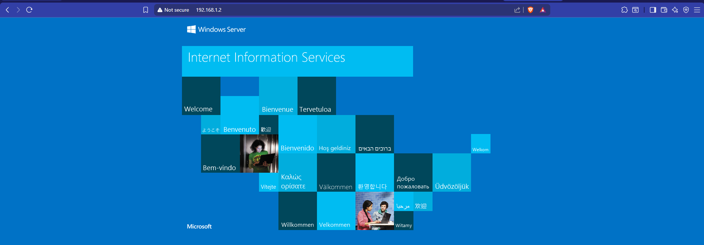

> **Note:** If the IIS page does not appear, check that the **World Wide Web Publishing Service** is running (`services.msc`) and that **Windows Firewall** is not blocking port 80.

---

## Task 2 – Create a Custom HTML Page

### 📖 Explanation
The IIS default page is a placeholder — in a real environment, you replace it with your own content. The simplest web content is a plain **HTML file**. Before deploying it to the web server, you create and edit it locally using a text editor like **Visual Studio Code** or Notepad. A valid HTML file has a defined structure: `<!DOCTYPE html>`, `<html>`, `<head>` (with a `<title>`), and `<body>` (with visible content).

Understanding the file structure is important because IIS serves these files directly to browsers. Any syntax errors or missing elements can cause pages to display incorrectly.

### 🔧 Steps
1. Open **Visual Studio Code** (or any text editor) on the server or a client machine
2. Create a new file and save it as `index.html` on the Desktop
3. Write the following HTML content:

```html
<!DOCTYPE html>
<html>
<head>
    <title>My Website</title>
</head>
<body>
    <h1>Welcome to My Home Page</h1>
    <p>This is the default index.html file.</p>
</body>
</html>
```

4. Save the file

### ✅ Solution / Expected Result
A valid `index.html` file is created. The file contains a heading and a paragraph of text. When deployed to IIS's `wwwroot` folder, this content will be served to browsers visiting the server's IP address.

**Screenshot:**

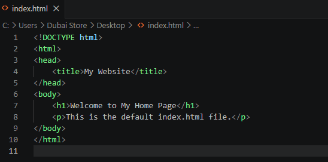

> **Tip:** You can also use Notepad by going to **File → Save As**, setting the file name to `index.html` (with quotes to prevent Notepad from appending `.txt`), and selecting **All Files** in the file type dropdown.

---

## Task 3 – Deploy HTML File to wwwroot

### 📖 Explanation
IIS's **Default Web Site** serves files from `C:\inetpub\wwwroot` — this is called the **web root** or **physical path** of the site. Any file placed in this directory becomes accessible via HTTP. To replace the default IIS page with your custom one, you copy your `index.html` file into this directory. IIS will serve `index.html` automatically when a browser navigates to the root URL, because `index.html` is listed in IIS's **Default Document** list (a prioritized list of files IIS looks for when no specific filename is requested in the URL).

### 🔧 Steps
1. Open **File Explorer** and navigate to: `C:\inetpub\wwwroot`
2. Copy your `index.html` file from the Desktop (or wherever you saved it) into this folder
3. You can optionally delete or rename the existing `iisstart.htm` file to ensure your custom page takes priority, or simply rely on the Default Document priority order
4. Verify the file appears in the `wwwroot` directory

### ✅ Solution / Expected Result
The `index.html` file appears in `C:\inetpub\wwwroot` with the current date/time as the modification date. IIS will now serve this file when browsers access the root URL.

**Screenshot:**

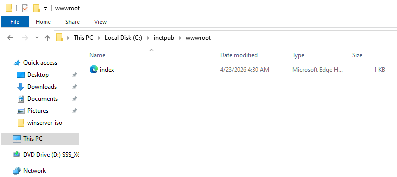

> **Permissions Note:** The IIS worker process account (`IIS_IUSRS` or `IUSR`) must have **read** permissions on files in `wwwroot`. These are set by default, but if you copy files from a restricted location, you may need to adjust permissions via right-click → Properties → Security tab.

---

## Task 4 – Verify Custom Home Page is Live

### 📖 Explanation
After deploying your HTML file to `wwwroot`, you must **verify** it is being served correctly by IIS. This is done by navigating to the server's IP address in a browser. If IIS serves the new `index.html` instead of the old IIS welcome page, the deployment was successful. No IIS restart is required — IIS detects file changes in `wwwroot` automatically and serves new or updated files immediately.

### 🔧 Steps
1. Open a browser on the server or any machine on the same network
2. Navigate to: `http://192.168.1.2`
3. Verify the page now shows your custom content instead of the IIS welcome page
4. You should see: **"Welcome to My Home Page"** and **"This is the default index.html file."**

### ✅ Solution / Expected Result
The browser displays your custom HTML page with the heading **"Welcome to My Home Page"** and the paragraph text. The IIS default splash page is gone — replaced by your content.

**Screenshot:**

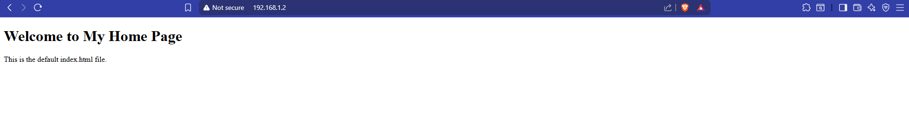

> **Cache Note:** If you still see the old IIS page, press **Ctrl + Shift + R** (hard refresh) or open a private/incognito browser window to bypass browser cache.

---

## Task 5 – Configure Site Binding (Port & IP)

### 📖 Explanation
A **site binding** in IIS defines how a website receives incoming HTTP/HTTPS requests. Each binding specifies three things:
- **Type** — HTTP or HTTPS
- **IP address** — which network interface to listen on (or "All Unassigned" for all)
- **Port** — which TCP port to listen on (default: 80 for HTTP, 443 for HTTPS)
- **Host name** — (optional) for name-based virtual hosting

By default, the Default Web Site is bound to `All Unassigned` IPs on port 80. If you want to run multiple websites on the same server, you differentiate them using different **IP addresses**, **ports**, or **host headers**. Understanding bindings is essential before adding additional sites.

### 🔧 Steps
1. Open **IIS Manager** (`inetmgr`)
2. In the left tree, expand the server → click **Default Web Site**
3. In the right **Actions** pane, click **Bindings…**
4. The **Site Bindings** dialog shows current bindings
5. To add a new binding, click **Add…**
6. Configure:
   - **Type:** `http`
   - **IP address:** `All Unassigned` (listens on all interfaces)
   - **Port:** `80`
   - **Host name:** leave blank (or enter a hostname for name-based hosting)
7. Click **OK**

### ✅ Solution / Expected Result
The **Add Site Binding** dialog shows the binding configuration. The Default Web Site listens on port 80 on all network interfaces, serving content to any client that connects to any of the server's IPs on port 80.

**Screenshot:**

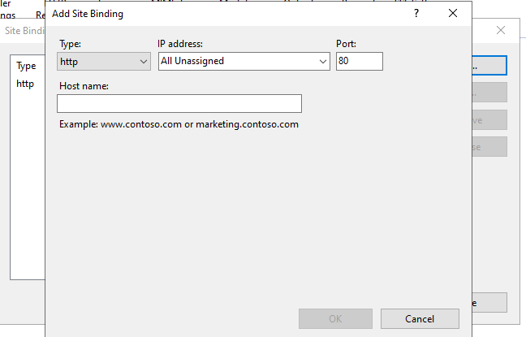

> **Multiple Sites on Port 80:** To run two sites both on port 80 using the same IP, you must use **Host Name** (host header) differentiation. Each site gets a different hostname (e.g., `hr.company.local` vs `finance.company.local`), and IIS routes requests based on the `Host:` header sent by the browser.

---

## Task 6 – Add a Second Website (HR Site on Custom Port)

### 📖 Explanation
IIS supports hosting **multiple websites on a single server** — this is called **multi-site hosting**. The most straightforward method (when you have only one IP address) is to assign each site a **different port number**. In this task, we create an **HR website** that listens on port **777** instead of the default port 80.

Each IIS website has:
- A unique **Site Name** (for management purposes)
- A dedicated **Application Pool** (an isolated worker process — improves security and stability)
- A **Physical Path** on disk where the site's files are stored
- A **Binding** defining how clients reach it

### 🔧 Steps
1. Create the HR site content directory: `C:\inetpub\HR`
2. Place your HR HTML file (`HR.html`) inside `C:\inetpub\HR`
3. Open **IIS Manager** → right-click **Sites** → **Add Website…**
4. Fill in the **Add Website** dialog:
   - **Site name:** `HR`
   - **Application pool:** `HR` (auto-created)
   - **Physical path:** `C:\inetpub\HR`
   - **Binding Type:** `http`
   - **IP address:** `All Unassigned`
   - **Port:** `777`
   - **Host name:** leave blank
5. Ensure **"Start Website immediately"** is checked
6. Click **OK**

### ✅ Solution / Expected Result
A new website named **HR** is created in IIS, serving content from `C:\inetpub\HR` on port **777**. The site appears in the IIS Manager sites list alongside the Default Web Site.

**Screenshot:**

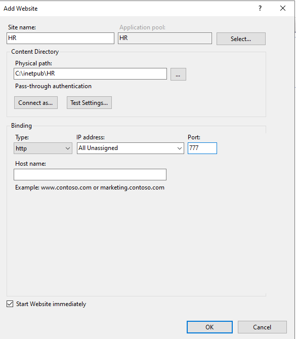

> **Why port 777?** Port 80 is already used by the Default Web Site. Since both sites share the same IP address, they must use different ports. Any port from 1–65535 can be used (avoid well-known ports already in use). Port 777 is arbitrary — in production, common alternatives include 8080, 8443, or custom ports per department policy.

---

## Task 6.1 – Set HR.html as the Default Document

### 📖 Explanation
When a browser navigates to a website without specifying a filename (e.g., `http://192.168.1.2:777/`), IIS looks through its **Default Document** list in priority order and serves the first file it finds in the site's physical directory. By default, IIS looks for: `Default.htm`, `Default.asp`, `index.htm`, `index.html`, `iisstart.htm`.

Since the HR site uses `HR.html` (not one of the default names), we must add it to the Default Document list for the HR site. Setting it at the top of the list with **Entry Type: Local** ensures it takes priority over the inherited defaults.

### 🔧 Steps
1. In **IIS Manager**, click the **HR** site in the left tree
2. In the center pane, double-click **Default Document**
3. In the **Actions** pane on the right, click **Add…**
4. Type `HR.html` as the new default document name
5. Click **OK**
6. In the Default Document list, select `HR.html` and click **Move Up** in the Actions pane until it is at the **top** of the list
7. Verify it shows **Entry Type: Local** (meaning it was added specifically for this site)

### ✅ Solution / Expected Result
`HR.html` appears at the top of the Default Document list with Entry Type **Local**. When clients navigate to `http://192.168.1.2:777/`, IIS serves `HR.html` automatically without requiring the filename in the URL.

**Screenshot:**


> **Local vs Inherited:** "Inherited" entries come from the server-level Default Document configuration. "Local" entries are specific to this site. Local entries always take priority over inherited ones.

---

## Task 7 – Allow Custom Port Through Windows Firewall

### 📖 Explanation
Windows Defender Firewall blocks all inbound traffic by default unless a rule explicitly allows it. Port 80 is commonly pre-allowed (especially after IIS installation), but **custom ports like 777 must be manually opened**. Without a firewall inbound rule for port 777, clients on other machines will be unable to reach the HR website — their connection attempts will be silently dropped by the firewall even though IIS is listening.

The firewall rule must specify the protocol (TCP for HTTP), the port number (777), and the action (Allow).

### 🔧 Steps
1. Open **Windows Defender Firewall with Advanced Security** (`wf.msc`)
2. Click **Inbound Rules** → **New Rule…** in the Actions pane
3. In the **New Inbound Rule Wizard**:
   - **Rule Type:** Select **Port** → click Next
   - **Protocol and Ports:**
     - Protocol: **TCP**
     - Specific local ports: `777`
     - Click **Next**
   - **Action:** Select **Allow the connection** → Next
   - **Profile:** Leave all three checked (Domain, Private, Public) → Next
   - **Name:** `IIS HR Website Port 777`
4. Click **Finish**

### ✅ Solution / Expected Result
A new inbound firewall rule allows **TCP port 777**. The rule wizard confirms "Specific local ports: 777" with TCP protocol. Clients on the network can now reach the HR site at `http://192.168.1.2:777/`.

**Screenshot:**

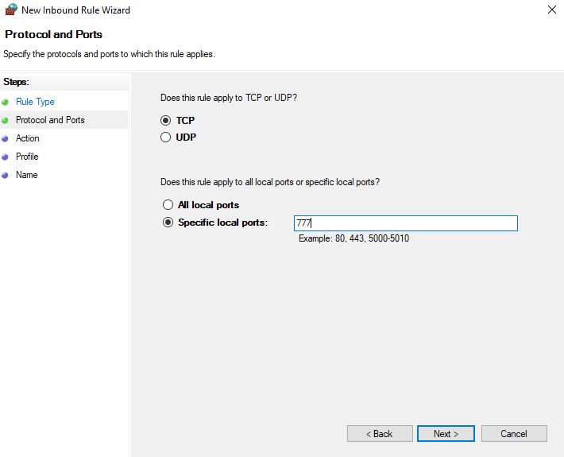

> **Security Note:** Only open ports that are actively needed. Do not open entire port ranges (e.g., 1–65535) unless there is a specific reason. For internet-facing servers, use HTTPS (port 443) with a valid SSL/TLS certificate instead of plain HTTP.

---

## Task 8 – Verify HR Website is Accessible

### 📖 Explanation
With the HR site created in IIS, `HR.html` set as the default document, and port 777 opened in the firewall, the site should now be fully accessible from client machines. Verification is done by browsing to the site from a client on the same network using the server IP and custom port. Successful access confirms the entire chain — IIS site, default document, firewall rule, and network connectivity — is working correctly.

### 🔧 Steps
1. On a **client machine** (or the server itself), open a browser
2. Navigate to: `http://192.168.1.2:777`
3. IIS receives the request on port 777, routes it to the HR site, looks up the Default Document list, finds `HR.html`, and serves it
4. Verify the HR website content is displayed correctly

### ✅ Solution / Expected Result
The browser displays the **HR Executive Dashboard** webpage at `http://192.168.1.2:777`. The page shows workforce stats (Total Staff: 124, On Leave: 5, Open Roles: 3) and an Employee Directory — confirming the HR site is live and serving content correctly.

**Screenshot:**

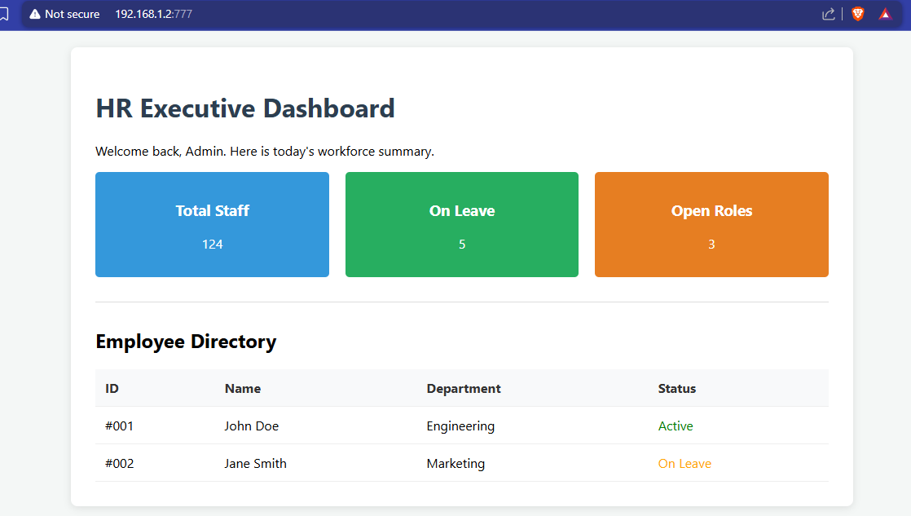

> **URL format reminder:** When using a non-standard port, it must be included in the URL: `http://IP:PORT`. Browsers default to port 80 for HTTP and port 443 for HTTPS if no port is specified.

---

## Task 9 – Add a Second NIC for Network Separation

### 📖 Explanation
So far, all IIS sites share the same IP address and are differentiated by port number. A more robust architecture for separating departmental or sensitive websites is to use **separate Network Interface Cards (NICs)** — each NIC has its own IP address, and each IIS website is bound exclusively to one NIC's IP. This provides:

- **Network-level isolation** — Finance traffic never touches the HR NIC
- **Firewall control at the NIC level** — you can apply different firewall rules per interface
- **Cleaner URL structure** — both sites can use port 80, distinguished by IP

In a VMware/Hyper-V environment, a second virtual NIC can be added through the VM settings without requiring physical hardware.

### 🔧 Steps
1. In **VMware** (or Hyper-V), power off or add a hot-plug NIC to the VM:
   - VMware: VM Settings → Add → Network Adapter → Connect to appropriate network
2. In Windows Server, open **Network Connections** (`ncpa.cpl`)
3. Verify the second NIC appears (e.g., **Ethernet1**)
4. Right-click **Ethernet1** → **Properties** → **Internet Protocol Version 4 (TCP/IPv4)** → **Properties**
5. Assign a static IP: `192.168.56.2`, subnet mask `255.255.255.0`
6. Click **OK** → **Close**
7. Verify both adapters are enabled and have their respective IPs

### ✅ Solution / Expected Result
Two network adapters are visible in Network Connections: **Ethernet0** (192.168.1.2, connected to the primary network) and **Ethernet1** (192.168.56.2, connected to the secondary/Finance network). Both are enabled and operational.

**Screenshot:**

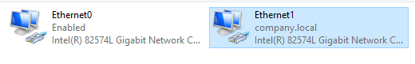

> **Network Design Note:** In a real enterprise, the Finance NIC would be connected to a **separate VLAN** with its own firewall rules, accessible only to Finance department machines — adding a layer of network security on top of IIS site separation.

---

## Task 10 – Add a Finance Website Bound to the New NIC

### 📖 Explanation
With the second NIC configured (IP: 192.168.56.2), we create a new IIS website for the **Finance department** and bind it **exclusively** to the second NIC's IP address. By specifying `192.168.56.2` in the binding (instead of "All Unassigned"), IIS will only serve this site to requests arriving on that specific interface. Requests to `192.168.1.2` will never reach the Finance site — providing clean IP-based separation.

Both the Finance site and the Default Web Site use port 80 — this is possible because they are bound to different IP addresses.

### 🔧 Steps
1. Create the Finance site content directory: `C:\inetpub\Finance`
2. Place your Finance HTML files inside `C:\inetpub\Finance`
3. Open **IIS Manager** → right-click **Sites** → **Add Website…**
4. Fill in the **Add Website** dialog:
   - **Site name:** `Finance`
   - **Application pool:** `Finance` (auto-created)
   - **Physical path:** `C:\inetpub\Finance`
   - **Binding Type:** `http`
   - **IP address:** `192.168.56.2` ← select the second NIC's IP specifically
   - **Port:** `80`
   - **Host name:** leave blank
5. Ensure **"Start Website immediately"** is checked
6. Click **OK**

### ✅ Solution / Expected Result
The Finance website is created in IIS, bound exclusively to `192.168.56.2:80`. The site is isolated to the second NIC — clients on the `192.168.56.x` network reach Finance, while clients on `192.168.1.x` reach the Default Web Site.

**Screenshot:**

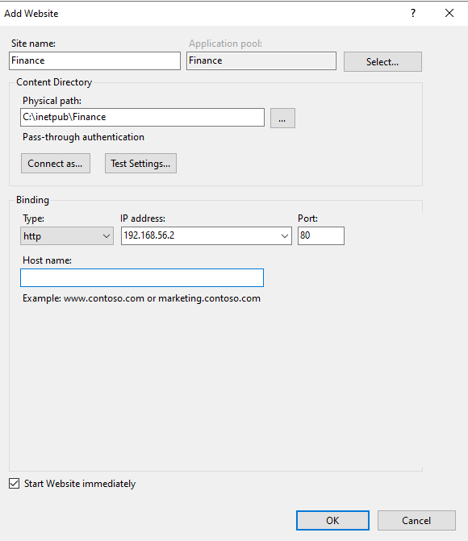

> **IP Binding vs "All Unassigned":** "All Unassigned" means IIS listens on all IPs for that port. A specific IP means IIS only accepts connections arriving on that IP. Using specific IPs is the recommended approach for multi-site servers to avoid accidental cross-site serving.

---

## Task 11 – Verify Finance Website is Accessible

### 📖 Explanation
After creating the Finance website bound to `192.168.56.2:80`, verification must be done from a machine that can reach the `192.168.56.x` network — either from a machine on that subnet, or from the server itself (since the server has both NICs). Navigating to `http://192.168.56.2` (or the server's second IP using IP `192.168.1.121` in the screenshot, which is the client reaching the Finance site) should display the Finance site content — not the Default Web Site.

### 🔧 Steps
1. On a client machine connected to the `192.168.56.x` or appropriate network segment, open a browser
2. Navigate to: `http://192.168.1.121` (client-side IP of Finance site) or `http://192.168.56.2`
3. Verify the Finance website content is displayed
4. To confirm isolation: navigate to `http://192.168.1.2` — this should show the Default Web Site, not Finance

### ✅ Solution / Expected Result
The browser displays the **FinPath** Finance website with services including Wealth Management, Tax Planning, and Asset Protection. The address bar shows the Finance site IP — confirming IIS is correctly routing requests based on IP address bindings.

**Screenshot:**

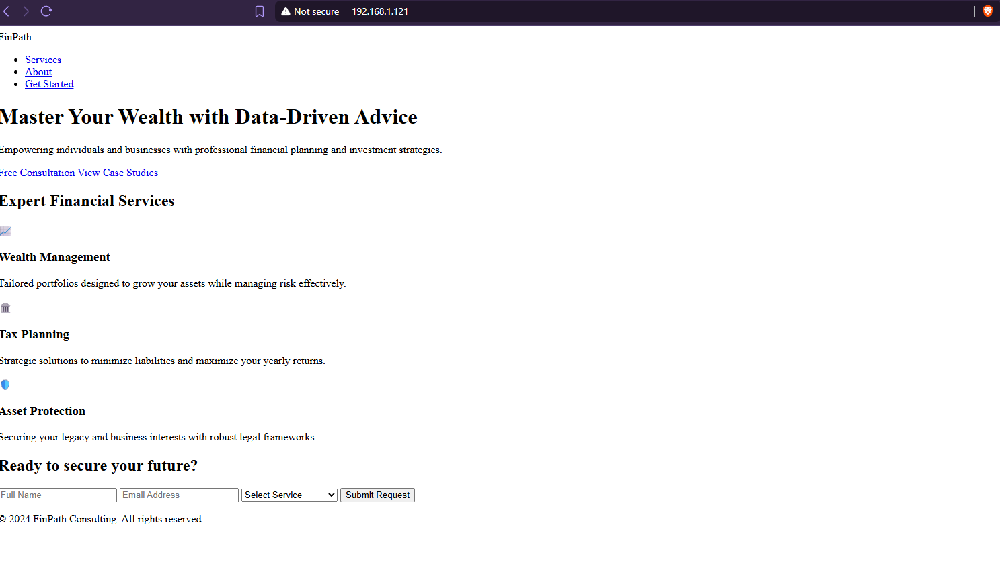

> **"Not secure" warning:** Browsers display this for plain HTTP sites. To resolve it, install an SSL/TLS certificate and configure an HTTPS (port 443) binding — covered in advanced IIS labs. For internal lab environments, this warning can be safely ignored.

---

## Task 12 – Add a Virtual Directory for the IT Portal

### 📖 Explanation
A **Virtual Directory** in IIS is a logical folder mapped to a physical directory on disk that is **different from the site's main root**. It allows you to serve content from a location outside the site's physical path by giving it a URL alias. For example, `C:\inetpub\IT` (which is not under `C:\inetpub\wwwroot`) can be accessed at `http://192.168.1.2/it/` by creating a virtual directory with the alias `it` on the Default Web Site.

Virtual directories are useful for:
- Organizing content across different disk locations or drives
- Sharing a content folder between multiple applications
- Adding department portals without creating entirely separate IIS sites
- Storing content on a UNC path (network share)

### 🔧 Steps
1. Create the IT portal content directory: `C:\inetpub\IT`
2. Place your IT Portal HTML files inside `C:\inetpub\IT`
3. Open **IIS Manager** → expand the server → expand **Sites** → click **Default Web Site**
4. Right-click **Default Web Site** → **Add Virtual Directory…**
5. Fill in the **Add Virtual Directory** dialog:
   - **Alias:** `it` ← this becomes the URL path segment
   - **Physical path:** `C:\inetpub\IT` ← the actual folder on disk
6. Click **Test Settings…** to verify IIS can access the physical path
7. Click **OK**

### ✅ Solution / Expected Result
A virtual directory named `it` is created under the Default Web Site. The alias `it` maps to `C:\inetpub\IT`. The IT portal is now accessible at `http://192.168.1.2/it/` without creating a separate IIS site.

**Screenshot:**

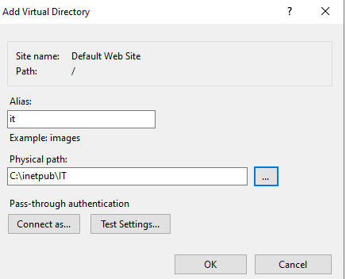

> **Virtual Directory vs Application:** A Virtual Directory serves static files (HTML, images, etc.) under the parent site's application pool. An **Application** is a step up — it has its own application pool, its own session state, and can run server-side code independently. For simple HTML portals, a virtual directory is sufficient.

---

## Task 13 – Verify the IT Portal Virtual Directory is Accessible

### 📖 Explanation
After creating the virtual directory with alias `it`, the IT portal content stored in `C:\inetpub\IT` should be accessible at `http://192.168.1.2/it/`. This verification confirms that:
1. The virtual directory was correctly created and mapped
2. IIS can read files from the physical path `C:\inetpub\IT`
3. The URL alias `/it/` resolves correctly under the Default Web Site
4. The IT portal HTML content is served as expected

### 🔧 Steps
1. Open a browser on the server or any client on the `192.168.1.x` network
2. Navigate to: `http://192.168.1.2/it/`
3. IIS resolves `/it/` → virtual directory → `C:\inetpub\IT` → serves the default document
4. Verify the IT portal content is displayed correctly

### ✅ Solution / Expected Result
The browser at `http://192.168.1.2/it/` displays the **HR Portal** (IT-managed internal portal) with an Executive Dashboard showing Total Employees: 124, In Office: 116, Pending Requests: 8, and a Recent Employee Status table. The virtual directory is serving content correctly.

**Screenshot:**

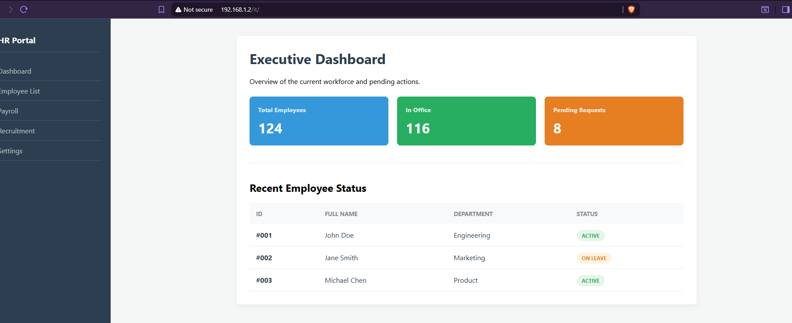

> **Note:** The IT portal uses the Default Web Site's port (80), so no additional firewall rules are needed. The `/it/` path is served alongside the root Default Web Site content — both are accessible from `192.168.1.2:80`.

---

## 📝 Summary

| # | Task | Method | Key Setting | Result |
|---|------|--------|-------------|--------|
| 1 | Verify IIS default page | Browser → server IP | Port 80, wwwroot | IIS welcome page confirms installation |
| 2 | Create custom HTML | VS Code / Notepad | index.html with h1 + p | HTML file ready for deployment |
| 3 | Deploy HTML to wwwroot | File Explorer copy | `C:\inetpub\wwwroot\index.html` | Custom page deployed |
| 4 | Verify custom page | Browser → server IP | Port 80 | Custom home page live |
| 5 | Configure site binding | IIS Manager → Bindings | HTTP, All Unassigned, Port 80 | Default site binding confirmed |
| 6 | Add HR website | IIS Manager → Add Website | Port 777, `C:\inetpub\HR` | HR site created on custom port |
| 6.1 | Set default document | IIS → Default Document | HR.html (Local, top priority) | HR.html served by default |
| 7 | Open firewall port 777 | Windows Firewall → Inbound Rule | TCP, Port 777, Allow | Port 777 open for HR site |
| 8 | Verify HR site | Browser → IP:777 | `http://192.168.1.2:777` | HR Dashboard live |
| 9 | Add second NIC | VMware + Network Settings | Ethernet1 → 192.168.56.2 | Two NICs active |
| 10 | Add Finance website | IIS Manager → Add Website | IP: 192.168.56.2, Port 80 | Finance site bound to second NIC |
| 11 | Verify Finance site | Browser → second NIC IP | `http://192.168.56.2` | FinPath Finance page live |
| 12 | Add Virtual Directory | IIS Manager → Add VDir | Alias: `it`, Path: `C:\inetpub\IT` | `/it/` mapped to IT folder |
| 13 | Verify IT portal | Browser → IP/it/ | `http://192.168.1.2/it/` | HR/IT portal dashboard live |

---

## 🔑 Key Concepts

| Concept | Description |
|---------|-------------|
| **IIS (Internet Information Services)** | Microsoft's web server built into Windows Server, used to host HTTP/HTTPS websites and applications |
| **wwwroot** | The default physical root directory for the Default Web Site (`C:\inetpub\wwwroot`) |
| **Site Binding** | Defines how IIS routes incoming requests to a site: Type + IP address + Port + (optional) Host Name |
| **Default Document** | The file IIS serves when no specific filename is requested in the URL (e.g., `index.html`) |
| **Application Pool** | An isolated worker process (w3wp.exe) that hosts one or more IIS sites/applications |
| **Virtual Directory** | A URL alias that maps to a physical path outside the site's main root directory |
| **Multi-site Hosting** | Running multiple websites on one IIS server, differentiated by port, IP, or host header |
| **Host Header (Host Name)** | An HTTP header value used to differentiate sites sharing the same IP and port |
| **NIC (Network Interface Card)** | A physical or virtual network adapter with its own IP address; multiple NICs enable IP-based site separation |
| **Inbound Firewall Rule** | A Windows Defender Firewall rule that allows specific incoming TCP/UDP traffic on designated ports |

---

## 🆚 IIS Site Separation Methods

| Method | How It Works | Pros | Cons | Used In This Lab |
|--------|-------------|------|------|-----------------|
| **Different Ports** | Each site uses a unique port (80, 777, 8080) | Simple, works with one IP | Clients must include port in URL | HR Site (port 777) ✅ |
| **Different IP Addresses** | Each site bound to a specific NIC/IP | Clean URLs (all on port 80), network-level isolation | Requires multiple NICs or IPs | Finance Site (192.168.56.2) ✅ |
| **Host Headers** | Each site has a unique hostname (e.g., hr.company.com) | Multiple sites on same IP:port, clean URLs | Requires DNS records | Not shown (advanced) |
| **Virtual Directories** | Sub-path of existing site (`/it/`) | No new site needed, simple setup | Shares app pool with parent site | IT Portal (`/it/`) ✅ |

---

## 🛠️ Troubleshooting

| Problem | Likely Cause | Solution |
|---------|-------------|----------|
| IIS default page shows instead of custom page | index.html not in wwwroot, or Default Document order wrong | Verify file is in `C:\inetpub\wwwroot`; check Default Document list |
| 403 Forbidden on new site | IIS can't read files — permissions issue | Grant `IIS_IUSRS` Read permission on the site's physical directory |
| 404 Not Found | File not found or Default Document not set | Verify the HTML file exists and the default document is configured (Task 6.1) |
| Port 777 connection refused | Firewall blocking the port | Add inbound firewall rule for TCP 777 (Task 7) |
| Finance site shows Default Web Site content | Finance site bound to wrong IP or "All Unassigned" | Rebind Finance site to specific IP `192.168.56.2` (Task 10) |
| Virtual directory returns 404 | Physical path doesn't exist or alias is wrong | Verify `C:\inetpub\IT` exists and alias matches URL path |
| Site won't start in IIS | Port conflict with another site | Check no other site is using the same IP:Port combination |
| Second NIC has no IP | NIC added but not configured | Assign static IP via Network Connections (Task 9) |

---

*Lab completed on Windows Server 2022 | IIS Version: 10 | Primary IP: 192.168.1.2 | Secondary IP: 192.168.56.2*
