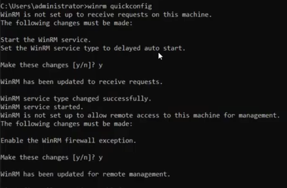
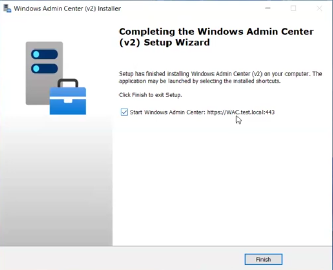
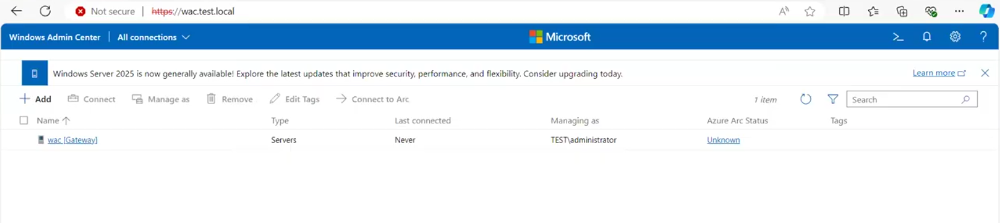
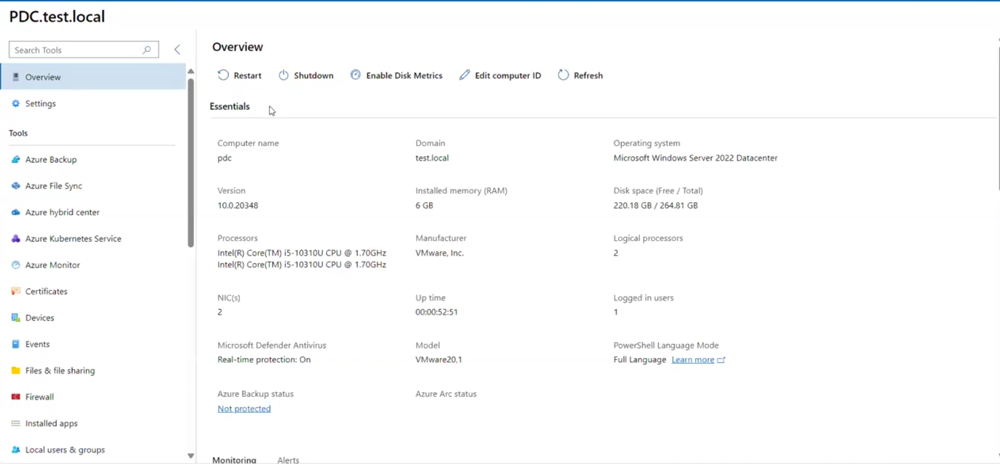
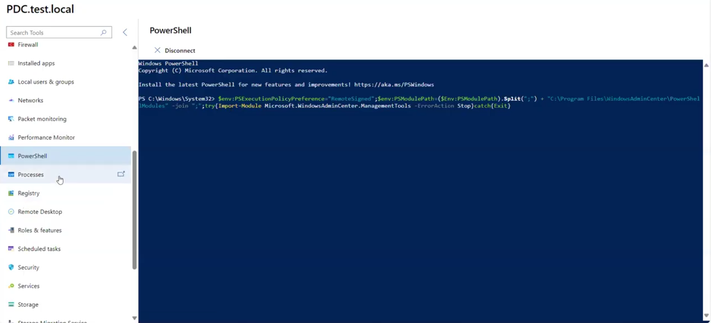
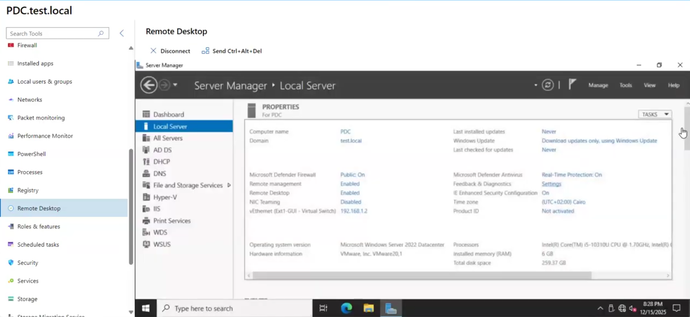
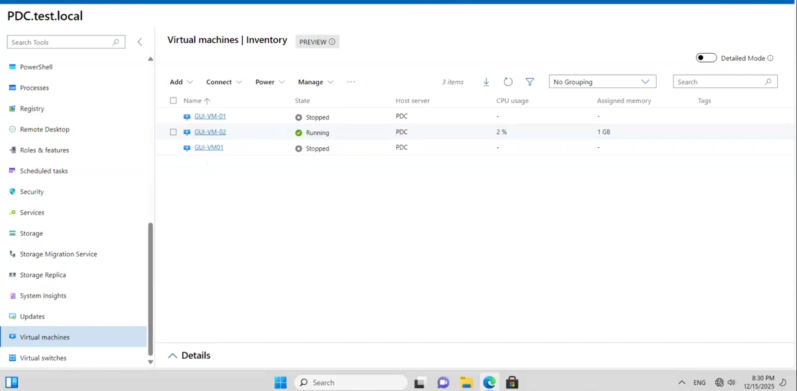

# 🖥️ Windows Admin Center (WAC) Administration Lab

A hands-on lab covering how to prepare a Windows Server for remote management using **WinRM**, install and configure **Windows Admin Center (WAC) v2**, connect and manage remote servers through the browser-based interface, and use WAC's built-in tools including **PowerShell**, **Remote Desktop**, and **Hyper-V Virtual Machine management**.

---

## 📋 Table of Contents

1. [Background & Architecture](#-background--architecture)
2. [Lab Environment](#-lab-environment)
3. [Task 1 – Enable WinRM for Remote Management](#task-1--enable-winrm-for-remote-management)
4. [Task 2 – Install Windows Admin Center (v2)](#task-2--install-windows-admin-center-v2)
5. [Task 3 – Access the WAC Portal and View Connections](#task-3--access-the-wac-portal-and-view-connections)
6. [Task 4 – Add a Remote Server to WAC](#task-4--add-a-remote-server-to-wac)
7. [Task 5 – View Server Overview and Essentials](#task-5--view-server-overview-and-essentials)
8. [Task 6 – Use the Built-in PowerShell Terminal](#task-6--use-the-built-in-powershell-terminal)
9. [Task 7 – Use the Built-in Remote Desktop Tool](#task-7--use-the-built-in-remote-desktop-tool)
10. [Task 8 – Manage Hyper-V Virtual Machines via WAC](#task-8--manage-hyper-v-virtual-machines-via-wac)
11. [Summary](#-summary)
12. [Key Concepts](#-key-concepts)
13. [WAC vs Traditional Admin Tools](#-wac-vs-traditional-admin-tools)
14. [Troubleshooting](#️-troubleshooting)

---

## 🏗️ Background & Architecture

**Windows Admin Center (WAC)** is Microsoft's free, browser-based server management platform — the modern replacement for traditional MMC snap-ins, Server Manager, and RSAT tools. It consolidates dozens of server administration tasks into a single web interface accessible from any modern browser, on any device, without installing management software on each administrator's workstation.

```
┌──────────────────────────────────────────────────────────────┐
│                    WAC Architecture                          │
│                                                              │
│  ┌──────────────┐    HTTPS:443     ┌─────────────────────┐  │
│  │   Admin      │ ───────────────► │   WAC Gateway       │  │
│  │   Browser    │                  │   WAC.test.local    │  │
│  └──────────────┘                  │                     │  │
│                                    │  WinRM over 5985/   │  │
│                                    │  5986 to servers    │  │
│                                    └──────────┬──────────┘  │
│                                               │              │
│                              ┌────────────────▼───────────┐  │
│                              │   Managed Server           │  │
│                              │   PDC.test.local           │  │
│                              │   192.168.1.2              │  │
│                              │   WinRM Enabled ✅          │  │
│                              └────────────────────────────┘  │
└──────────────────────────────────────────────────────────────┘
```

**Key Architecture Points:**
- The admin's browser only needs access to the **WAC Gateway** (port 443)
- The WAC Gateway communicates with managed servers over **WinRM** (ports 5985/5986)
- **No agent** is needed on managed servers — only WinRM must be enabled
- All management tools (PowerShell, RDP, Firewall, Events, etc.) run through the single WAC portal

---

## 🖥️ Lab Environment

| Component | Details |
|-----------|---------|
| **WAC Gateway Server** | WAC.test.local |
| **Managed Server** | PDC.test.local |
| **Domain** | test.local |
| **WAC Portal URL** | `https://WAC.test.local:443` |
| **PDC IP Address** | 192.168.1.2 |
| **PDC OS** | Windows Server 2022 Datacenter (Build 10.0.20348) |
| **PDC RAM** | 6 GB |
| **PDC Disk** | 264.81 GB total / 220.18 GB free |
| **PDC CPU** | Intel Core i5-10310U @ 1.70GHz (2 logical processors) |
| **Hypervisor** | VMware 20.1 |
| **Hyper-V VMs on PDC** | GUI-VM-01 (Stopped), GUI-VM-02 (Running — 2% CPU / 1 GB), GUI-VM01 (Stopped) |
| **Managed as** | TEST\administrator |

---

## Task 1 – Enable WinRM for Remote Management

### 📖 Explanation
**WinRM (Windows Remote Management)** is the Microsoft implementation of the **WS-Management protocol** — the communication layer that WAC (and PowerShell remoting) uses to send commands to and receive data from remote servers. By default, WinRM is **not configured** on freshly installed Windows Servers, meaning all remote management attempts will be refused.

The `winrm quickconfig` command automates the full WinRM setup in a single step by performing four actions:
1. **Starts the WinRM service** — the service that listens for remote management requests
2. **Sets the service startup type to Delayed Auto Start** — ensures WinRM starts automatically after every reboot, delayed to allow other critical services to start first
3. **Creates a Windows Firewall exception** — opens TCP port **5985** (HTTP) so remote management traffic can reach the server
4. **Configures a WinRM listener** — creates an HTTP listener on all IP addresses

This must be run on every server you want to manage via WAC. It is a one-time, non-destructive setup step.

### 🔧 Steps
1. On the **target server** (PDC.test.local), open **Command Prompt** or **PowerShell** as **Administrator**
2. Type the following command and press **Enter**:
   ```cmd
   winrm quickconfig
   ```
3. The tool detects that WinRM is not configured and lists required changes. When prompted:
   > `Make these changes [y/n]?` → type **`y`** and press Enter
4. WinRM starts the service and updates the service type. It then detects the firewall exception is needed. When prompted again:
   > `Make these changes [y/n]?` → type **`y`** and press Enter
5. Read the confirmation messages to verify all four changes were applied successfully

### ✅ Solution / Expected Result
The command output confirms the following messages in sequence:

```
WinRM has been updated to receive requests.
WinRM service type changed successfully.
WinRM service started.
WinRM is not set up to allow remote access to this machine for management.
Enable the WinRM firewall exception.
WinRM has been updated for remote management.
```

All four changes are applied. The server is now ready to receive WinRM-based management connections from the WAC gateway.

**Screenshot:**



> **PowerShell Alternative:** You can also run `Enable-PSRemoting -Force` in PowerShell, which performs the same steps and additionally configures PowerShell remoting trust settings.

> **GPO at Scale:** In enterprise environments with many servers, enable WinRM via Group Policy:
> `Computer Configuration → Windows Settings → Security Settings → System Services → Windows Remote Management`
> This avoids running `winrm quickconfig` manually on each server.

---

## Task 2 – Install Windows Admin Center (v2)

### 📖 Explanation
**Windows Admin Center v2** is installed as a **gateway service** on a dedicated management server (WAC.test.local). It runs as a Windows background service (`ServerManagementGateway`) and serves its web interface over **HTTPS port 443**. The installer:

- Deploys the WAC web application and all management tool modules
- Generates a **self-signed SSL certificate** (causes "Not secure" browser warning — normal in lab environments)
- Registers WAC to listen on the specified HTTPS port
- Creates a Windows Firewall rule to allow inbound connections on that port
- Does **not** require a reboot — WAC is immediately accessible after installation

WAC is installed in **Gateway mode** on Windows Server, meaning all administrators on the network can connect to the WAC portal via browser — unlike Desktop mode (Windows 10/11) which is local-access only.

### 🔧 Steps
1. On the **WAC gateway server** (WAC.test.local), download the WAC installer from:
   `https://aka.ms/windowsadmincenter`
2. Right-click the downloaded `.msi` file → **Run as administrator**
3. Accept the **End User License Agreement** → click **Next**
4. On the **Network access** page, configure:
   - **Port:** `443` (default HTTPS — recommended)
   - **Certificate:** Leave as default (auto-generated self-signed cert for lab)
   - Check **"Allow Windows Admin Center to modify this machine's trusted hosts settings"** if prompted
5. Click **Install**
6. Wait for installation to complete (typically 2–5 minutes)
7. On the final **Completing the Setup Wizard** screen, verify:
   - ✅ **"Start Windows Admin Center: https://WAC.test.local:443"** is checked
8. Click **Finish** — the WAC portal opens automatically in the default browser

### ✅ Solution / Expected Result
The installer displays **"Completing the Windows Admin Center (v2) Setup Wizard"** with the confirmation message that setup has finished. The checkbox confirms WAC will launch at `https://WAC.test.local:443`. Clicking Finish opens the browser to the WAC login/portal page.

**Screenshot:**



> **Port Conflict Note:** If port 443 is already in use by another service (e.g., IIS with HTTPS), choose an alternate port during installation such as `6516`. The WAC URL will then be `https://WAC.test.local:6516`.

> **Production Certificate:** The self-signed certificate is fine for labs. In production, replace it with a certificate from your internal **CA (Certificate Authority)** or a public CA to eliminate browser security warnings and enable proper TLS trust.

---

## Task 3 – Access the WAC Portal and View Connections

### 📖 Explanation
After installation, the WAC portal is immediately accessible via any modern browser. The **"All Connections"** page is the WAC home screen — it displays all managed servers, clusters, PCs, and Azure services registered in WAC. By default, only the **WAC gateway server itself** appears, automatically added as the first connection and labeled **[Gateway]**.

The All Connections view provides key metadata for each registered connection:

| Column | Description |
|--------|-------------|
| **Name** | Server hostname or FQDN |
| **Type** | Servers, Windows PCs, Clusters, Azure VMs, etc. |
| **Last connected** | Timestamp of the most recent successful WAC connection |
| **Managing as** | The credential context used for management |
| **Azure Arc Status** | Integration status with Azure Arc for hybrid management |
| **Tags** | Optional organizational labels |

The toolbar provides options to **Add**, **Connect**, **Manage as** (switch credentials), **Remove**, **Edit Tags**, and **Connect to Arc** for any selected connection.

### 🔧 Steps
1. On any machine that can reach the WAC gateway, open **Microsoft Edge** or **Google Chrome**
2. Navigate to: `https://wac.test.local` (port 443 is default HTTPS so no port needed in URL)
3. A browser security warning appears due to the self-signed certificate — click **Advanced** → **Proceed to wac.test.local (unsafe)** (expected in lab environments)
4. The WAC portal loads showing the **All connections** view in the blue header
5. Observe the default entry: `wac [Gateway]` — Type: Servers — Managing as: TEST\administrator
6. Review the toolbar options: Add, Connect, Manage as, Remove, Edit Tags, Connect to Arc

### ✅ Solution / Expected Result
The Windows Admin Center portal loads successfully at `https://wac.test.local`. The All connections page shows **1 item**: the WAC gateway server (`wac [Gateway]`) listed as type **Servers**, managed as **TEST\administrator**. The portal is operational and ready for adding additional servers.

**Screenshot:**



> **Browser Compatibility:** WAC works with Microsoft Edge, Google Chrome, and Firefox. Internet Explorer and legacy Edge (EdgeHTML) are **not supported**. For the best experience, use the latest version of Edge or Chrome.

> **"Not secure" Warning:** This is expected because WAC uses a self-signed SSL certificate by default. In production, install a proper SSL certificate from a trusted CA to eliminate this warning. The connection is still encrypted with TLS — only the certificate trust chain is incomplete.

---

## Task 4 – Add a Remote Server to WAC

### 📖 Explanation
To manage any server through WAC, you must first **register it as a connection**. WAC supports adding servers by **hostname**, **FQDN**, or **IP address**. Once registered, WAC uses the WinRM protocol (enabled in Task 1) to communicate with the server and display all its management tools.

Adding a server to WAC is **agentless** — nothing is installed on the remote server. WAC simply records the server's address and connects via WinRM on demand. Requirements for the remote server:

- WinRM enabled (`winrm quickconfig` — Task 1)
- Network reachability from the WAC gateway
- DNS resolution of the server name (if using hostname/FQDN)
- Appropriate credentials (domain admin or local admin on the target)

You can add servers individually or import a list from a text file or Active Directory for bulk management.

### 🔧 Steps
1. In the WAC portal, click **+ Add** in the top toolbar
2. The **Add or create resources** panel slides in from the right
3. Under **Servers**, click **Add**
4. In the **Add one** tab, type the server's FQDN in the server name field:
   `PDC.test.local`
5. WAC validates and resolves the server name
6. Under **Provide credentials**, select **Use another account for this connection** if the remote server requires different credentials, or leave as default (uses currently logged-in WAC user)
7. Click **Add** to confirm
8. PDC.test.local appears in the All Connections list

### ✅ Solution / Expected Result
**PDC.test.local** appears as a new entry in the All Connections list with Type: **Servers**, Last connected: **Never** (until first click), Managing as: **TEST\administrator**. The server is registered and ready to be managed.

**Screenshot:**


> **Bulk Import:** To add many servers at once, use the **Import servers** option (from a `.txt` file with one server per line) or the **Add from Active Directory** option to search and select domain-joined computers directly from AD.

> **Trusted Hosts:** If the WAC gateway and the managed server are in **different domains or workgroups**, add the managed server to the WAC gateway's TrustedHosts list:
> ```powershell
> Set-Item WSMan:\localhost\Client\TrustedHosts -Value "PDC.test.local" -Force
> ```

---

## Task 5 – View Server Overview and Essentials

### 📖 Explanation
Clicking on a registered server opens its **management dashboard** inside WAC. The **Overview** page is the first view shown and provides a live, real-time snapshot of the server's hardware specifications, operating system details, and current health status — all gathered remotely via WinRM/WMI without requiring an RDP session or local login.

The **Essentials** section displays:
- Computer name and domain membership
- Operating system version and build number
- Installed RAM and free/total disk space
- CPU model and logical processor count
- Number of NICs, system uptime, and active logged-in user count
- Microsoft Defender Antivirus real-time protection status
- Hardware manufacturer and model (useful for VM identification)
- PowerShell Language Mode
- Azure Backup and Azure Arc integration status

The **left sidebar** reveals the complete list of WAC management tools — covering virtually every aspect of Windows Server administration without needing separate MMC snap-ins or RSAT tools.

### 🔧 Steps
1. In the WAC All Connections page, click on **PDC.test.local**
2. WAC establishes a WinRM connection to the server (brief loading spinner)
3. The **Overview** page loads with the **Essentials** panel showing live server data
4. Review all hardware and OS information — verify it matches the expected server specs
5. Use the action buttons in the toolbar: **Restart**, **Shutdown**, **Enable Disk Metrics**, **Edit computer ID**, **Refresh**
6. Scroll down to see **Monitoring** graphs (CPU usage, memory usage, network throughput over time)
7. Browse the left sidebar to explore all available management tools
8. Use the **Search Tools** box at the top of the sidebar to quickly find any tool

### ✅ Solution / Expected Result
The Overview page for **PDC.test.local** loads successfully and displays the following confirmed data:

| Field | Value |
|-------|-------|
| Computer name | pdc |
| Domain | test.local |
| Operating system | Microsoft Windows Server 2022 Datacenter |
| Version | 10.0.20348 |
| Installed RAM | 6 GB |
| Disk space | 220.18 GB free / 264.81 GB total |
| Processors | Intel Core i5-10310U @ 1.70GHz × 2 |
| Logical processors | 2 |
| NICs | 2 |
| Uptime | 00:00:52:51 |
| Logged in users | 1 |
| Defender Antivirus | Real-time protection: On |
| Manufacturer / Model | VMware, Inc. / VMware20.1 |
| PowerShell Language Mode | Full Language |

**Screenshot:**



> **WAC Tools Available in Sidebar:** Azure Backup, Azure File Sync, Azure hybrid center, Azure Kubernetes Service, Azure Monitor, Certificates, Devices, Events, Files & file sharing, Firewall, Installed apps, Local users & groups, Networks, Packet monitoring, Performance Monitor, PowerShell, Processes, Registry, Remote Desktop, Roles & features, Scheduled tasks, Security, Services, Storage, Storage Migration Service, Storage Replica, System Insights, Updates, Virtual machines, Virtual switches — all accessible without installing separate tools.

---

## Task 6 – Use the Built-in PowerShell Terminal

### 📖 Explanation
WAC includes a fully functional **browser-embedded PowerShell terminal** that establishes a live **remote PowerShell session** directly to the managed server — entirely within the browser tab. This replaces the workflow of opening a separate PowerShell window, importing modules, and running `Enter-PSSession` to connect remotely.

WAC's PowerShell tool automatically:
- Sets the execution policy to `RemoteSigned`
- Adds WAC's PowerShell module path to `$env:PSModulePath`
- Imports the `Microsoft.WindowsAdminCenter.ManagementTools` module for enhanced functionality
- Opens an interactive `PS C:\Windows\System32>` prompt on the remote server

This tool is ideal for:
- Running diagnostic or administrative commands without a full RDP session
- Executing scripts directly on the remote server
- Managing servers that have RDP disabled (security hardening)
- Providing a consistent shell interface across all managed servers in one browser tab

### 🔧 Steps
1. In the WAC management view for **PDC.test.local**, scroll down the left sidebar
2. Click **PowerShell** (look for the terminal icon)
3. WAC opens the PowerShell pane on the right side and initializes the remote session
4. Wait for the initialization to complete — you will see WAC automatically importing modules
5. The prompt `PS C:\Windows\System32>` appears — you are now in a live PowerShell session on PDC.test.local
6. Run test commands to verify the session is working on the remote server:
   ```powershell
   # Verify you are on the remote server
   hostname

   # Check system info
   Get-ComputerInfo | Select-Object CsName, OsVersion, CsTotalPhysicalMemory

   # List running services
   Get-Service | Where-Object Status -eq "Running" | Select-Object Name, DisplayName

   # Check disk space
   Get-PSDrive C | Select-Object Used, Free
   ```
7. Click **Disconnect** in the toolbar when finished to cleanly close the remote session

### ✅ Solution / Expected Result
A live PowerShell terminal is active inside the browser, connected to PDC.test.local. The session header shows **"PowerShell"** as the active tool. The initialization output confirms WAC imported its management module. The prompt `PS C:\Windows\System32>` is ready to accept commands that execute on the remote server.

**Screenshot:**



> **WAC PowerShell vs mstsc PowerShell:** The WAC PowerShell tool uses remoting (equivalent to `Enter-PSSession`) — it is text-only and best for scripting and one-off commands. For interactive tasks requiring GUI dialogs, UAC prompts, or graphical applications, use the Remote Desktop tool (Task 7).

> **Session Persistence:** The PowerShell session remains alive as long as the WAC browser tab is open and connected. If you navigate away and come back, the session reconnects automatically. Long-running scripts continue executing even if you switch to another WAC tool.

---

## Task 7 – Use the Built-in Remote Desktop Tool

### 📖 Explanation
WAC's **Remote Desktop tool** embeds a full **RDP session** directly inside the WAC browser tab, providing complete graphical access to the managed server's desktop — without requiring the separate `mstsc.exe` client to be installed or configured on the administrator's machine.

This tool is architecturally significant: the **RDP connection is made from the WAC gateway to the managed server** — not from the administrator's browser. This means:
- Only **HTTPS port 443** needs to be open from the admin's machine to the WAC gateway
- **TCP port 3389 (RDP)** only needs to be open between the WAC gateway and the managed server (internal network)
- Administrators can access full server GUIs from any device with a browser, including tablets or machines without RSAT installed

Inside the RDP session, you have complete interactive control: all Server Manager tools, MMC snap-ins, AD tools, IIS Manager, Hyper-V Manager, and any GUI application installed on the server are fully accessible.

### 🔧 Steps
1. In the WAC management view for **PDC.test.local**, click **Remote Desktop** in the left sidebar
2. WAC initiates an RDP connection from the gateway to PDC.test.local on port 3389
3. The remote desktop of PDC loads inside the browser — the full Windows Server desktop with Server Manager is visible
4. Interact using your mouse and keyboard exactly as you would in a standard RDP session
5. To send **Ctrl+Alt+Del** (for Task Manager, lock screen, or UAC): click the **"Send Ctrl+Alt+Del"** button in the WAC toolbar
6. To end the session: click **Disconnect** in the WAC toolbar — this disconnects without logging off the remote session

### ✅ Solution / Expected Result
The full graphical desktop of **PDC.test.local** is rendered inside the WAC browser tab. **Server Manager → Local Server** is visible showing the server's properties:

| Property | Value |
|----------|-------|
| Computer name | PDC |
| Domain | test.local |
| Remote management | Enabled |
| Remote Desktop | Enabled |
| IP Address | 192.168.1.2 |
| OS | Windows Server 2022 Datacenter |

The WAC toolbar shows "Remote Desktop" as the active tool with **Disconnect** and **Send Ctrl+Alt+Del** buttons available.

**Screenshot:**



> **Requirement:** Remote Desktop must be enabled on the target server (System Properties → Remote tab → "Allow remote connections to this computer"). TCP port 3389 must be open in the firewall between the WAC gateway and the managed server.

> **Security Advantage:** Using WAC's RDP tool reduces your attack surface. Administrators only connect to WAC (port 443 with TLS). The WAC gateway handles the RDP connection internally. You never expose port 3389 directly to administrator workstations or the internet.

---

## Task 8 – Manage Hyper-V Virtual Machines via WAC

### 📖 Explanation
When WAC connects to a server with the **Hyper-V role** installed, it automatically detects the role and enables the **Virtual Machines** management tool. This provides a complete browser-based Hyper-V management interface — replacing the need for **Hyper-V Manager** (`virtmgmt.msc`) or remote Hyper-V management tools on the administrator's workstation.

The **Virtual Machines | Inventory** view (currently in PREVIEW) displays all VMs hosted on the Hyper-V host with real-time data:

| Column | Description |
|--------|-------------|
| **Name** | VM name (clickable for per-VM management) |
| **State** | Running (green ✅) or Stopped (grey ⭕) |
| **Host server** | Which Hyper-V host is running the VM |
| **CPU usage** | Live CPU utilization % (shown only for running VMs) |
| **Assigned memory** | RAM allocated to the VM (shown only for running VMs) |
| **Tags** | Optional labels for organization |

From the toolbar you can **Add** new VMs, **Connect** to VM consoles, control **Power** state (Start/Stop/Save/Pause/Reset), and **Manage** settings, checkpoints, and configuration — all through the browser.

### 🔧 Steps
1. In the WAC management view for **PDC.test.local**, scroll to the bottom of the left sidebar
2. Click **Virtual machines**
3. The **Virtual Machines | Inventory** view loads (note the PREVIEW badge — feature is stable but still being refined)
4. Review the inventory of VMs running on PDC (the Hyper-V host):
   - **GUI-VM-01** — State: Stopped | Host: PDC
   - **GUI-VM-02** — State: Running | Host: PDC | CPU: 2% | Memory: 1 GB
   - **GUI-VM01** — State: Stopped | Host: PDC
5. Click on **GUI-VM-02** (the running VM) to open its detail pane at the bottom
6. Test toolbar actions:
   - **Power → Shutdown** to gracefully shut down a running VM
   - **Power → Start** to start a stopped VM
   - **Connect** to open the VM's console in the browser
   - **Manage → Settings** to view/edit VM configuration (CPU, memory, disks, NICs)
7. Toggle **Detailed Mode** (top-right switch) to see extended VM information

### ✅ Solution / Expected Result
The Virtual Machines Inventory shows **3 VMs** on host PDC: GUI-VM-01 (Stopped), GUI-VM-02 (Running — 2% CPU / 1 GB RAM), GUI-VM01 (Stopped). All VMs are manageable from the browser. The toolbar confirms available actions: Add, Connect, Power, and Manage.

**Screenshot:**



> **Prerequisite:** Hyper-V role must be installed on the server for the Virtual Machines tool to appear in WAC. Install it with:
> ```powershell
> Install-WindowsFeature -Name Hyper-V -IncludeManagementTools -Restart
> ```

> **Detailed Mode:** Enabling the **Detailed Mode** toggle reveals additional columns including checkpoint count, integration services version, VM generation, and notes — useful for documentation and auditing.

---

## 📝 Summary

| # | Task | Tool / Command | Key Action | Outcome |
|---|------|---------------|------------|---------|
| 1 | Enable WinRM | `winrm quickconfig` | Start WinRM service + open TCP 5985 firewall | Server accepts remote management connections |
| 2 | Install WAC v2 | WAC `.msi` installer | Deploy WAC gateway on WAC.test.local:443 | WAC portal accessible at `https://WAC.test.local` |
| 3 | Access WAC portal | Browser → `https://wac.test.local` | View All Connections home page | WAC gateway (`wac [Gateway]`) visible as default connection |
| 4 | Add remote server | WAC → + Add → Servers | Register PDC.test.local in WAC | PDC appears in connections list, ready to manage |
| 5 | View server overview | WAC → PDC.test.local → Overview | Review live hardware/OS/health data | Full server specs confirmed: 6 GB RAM, 2022 Datacenter, 2 NICs |
| 6 | Use PowerShell | WAC → PowerShell tool | Open browser-embedded remote PS session | Live `PS C:\Windows\System32>` prompt on PDC in browser |
| 7 | Use Remote Desktop | WAC → Remote Desktop tool | Open browser-embedded RDP session | Full PDC desktop with Server Manager visible in browser tab |
| 8 | Manage Hyper-V VMs | WAC → Virtual machines | View/control VMs on the Hyper-V host | 3 VMs listed; GUI-VM-02 running at 2% CPU / 1 GB RAM |

---

## 🔑 Key Concepts

| Concept | Description |
|---------|-------------|
| **Windows Admin Center (WAC)** | Microsoft's free, browser-based, agentless Windows Server management gateway — modern replacement for MMC/RSAT |
| **WinRM** | Windows Remote Management — Microsoft's WS-Management protocol implementation; the transport WAC uses to talk to servers |
| **`winrm quickconfig`** | One-command WinRM setup: starts service, sets auto-start, creates TCP 5985 firewall exception |
| **WAC Gateway Mode** | WAC installed on Windows Server — accessible by all admins on the network via browser |
| **WAC Desktop Mode** | WAC installed on Windows 10/11 — local access only by default |
| **Agentless Management** | WAC requires no agent on managed servers — only WinRM enabled and network connectivity |
| **Self-signed Certificate** | Default SSL cert generated by WAC installer; causes "Not secure" browser warning — replace with CA cert in production |
| **WinRM Ports** | TCP **5985** (HTTP) and **5986** (HTTPS) — must be open on managed servers' firewalls |
| **WAC Port** | TCP **443** (HTTPS) — must be open between admin browsers and the WAC gateway |
| **PowerShell Remoting** | Technology underlying WAC's PowerShell tool — equivalent to `Enter-PSSession` to the managed server |
| **PREVIEW Features** | WAC tools marked PREVIEW are functional but still being refined — Virtual Machines tool is an example |
| **Hyper-V Integration** | WAC auto-detects the Hyper-V role and enables browser-based VM management when role is installed |

---

## 🆚 WAC vs Traditional Admin Tools

| Administrative Task | Traditional Tool | WAC Equivalent Tool |
|--------------------|-----------------|---------------------|
| Server health & properties | Server Manager | WAC Overview |
| Remote PowerShell | `Enter-PSSession` / PS window | WAC PowerShell tool |
| Remote Desktop access | `mstsc.exe` | WAC Remote Desktop tool |
| Windows Firewall | `wf.msc` | WAC Firewall tool |
| Local users & groups | `lusrmgr.msc` | WAC Local users & groups |
| Event viewer | `eventvwr.msc` | WAC Events tool |
| Services management | `services.msc` | WAC Services tool |
| Hyper-V management | Hyper-V Manager | WAC Virtual machines tool |
| Roles & features | Server Manager Add Roles | WAC Roles & features tool |
| Task Manager / Processes | Task Manager | WAC Processes tool |
| Disk management | Disk Management / `diskmgmt.msc` | WAC Storage tool |
| Registry editor | `regedit.exe` | WAC Registry tool |
| Performance monitoring | Performance Monitor | WAC Performance Monitor tool |
| Installed applications | Control Panel / Programs | WAC Installed apps tool |
| Network adapters | Network Connections | WAC Networks tool |
| Certificates | `certmgr.msc` | WAC Certificates tool |
| Scheduled tasks | Task Scheduler | WAC Scheduled tasks tool |

---

## 🛠️ Troubleshooting

| Problem | Likely Cause | Solution |
|---------|-------------|----------|
| WAC portal won't load | WAC service not running or wrong URL | Check `ServerManagementGateway` service is running in `services.msc`; verify the port number |
| "Not secure" browser warning | Self-signed certificate | Expected in labs — click Advanced → Proceed. Replace with CA-issued cert in production |
| Cannot add remote server to WAC | WinRM not configured on target | Run `winrm quickconfig` on the managed server (Task 1) |
| Connection to server fails | Firewall blocking WinRM | Open TCP 5985/5986 in Windows Firewall on the managed server |
| PowerShell tool shows error | PS remoting not enabled or access denied | Run `Enable-PSRemoting -Force` on the target; verify admin credentials |
| Remote Desktop tool fails | RDP not enabled or port 3389 blocked | Enable Remote Desktop in System Properties; open TCP 3389 on managed server firewall |
| Virtual Machines tool missing | Hyper-V role not installed | Install: `Install-WindowsFeature -Name Hyper-V -IncludeManagementTools -Restart` |
| "Never" in Last connected column | Name resolution failure or auth issue | Verify DNS resolves the server FQDN; try IP address instead; check credentials |
| WAC shows server as "Unknown" | Server just added, no connection yet | Click the server name to connect — status updates after first successful connection |
| TrustedHosts error | WAC gateway and managed server in different domains | Run: `Set-Item WSMan:\localhost\Client\TrustedHosts -Value "PDC.test.local" -Force` on WAC gateway |

---

*Lab completed on Windows Server 2022 Datacenter | WAC Version: v2 | WAC Gateway: WAC.test.local | Managed Server: PDC.test.local (192.168.1.2) | Domain: test.local*
