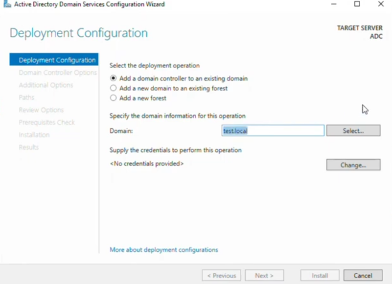
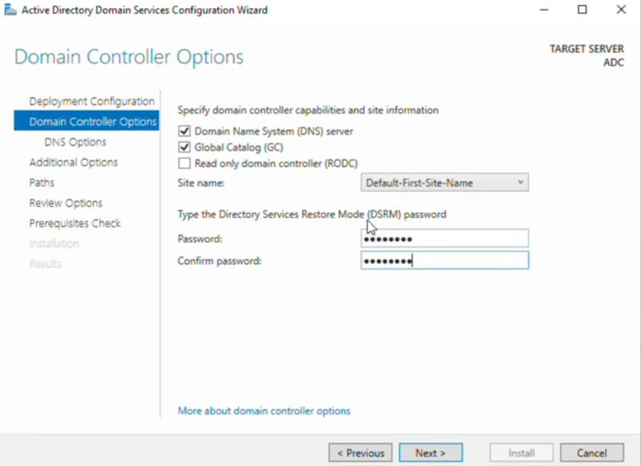
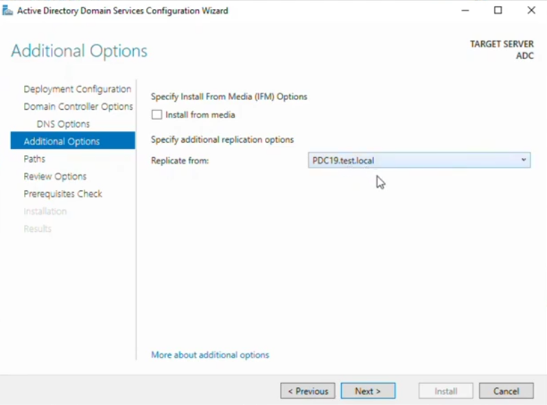
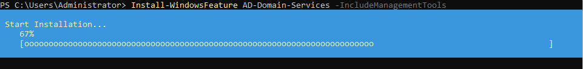
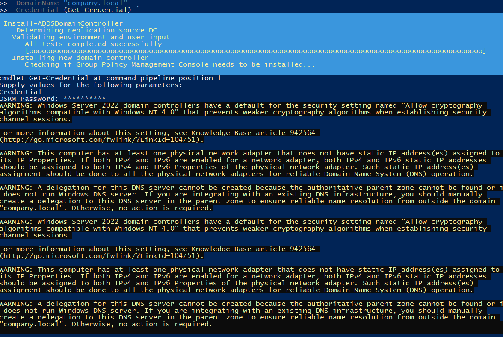
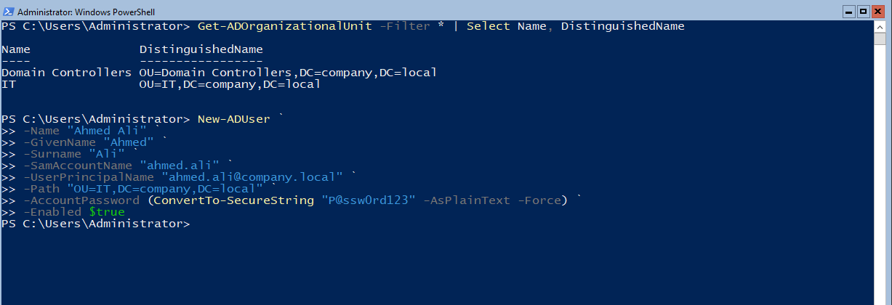
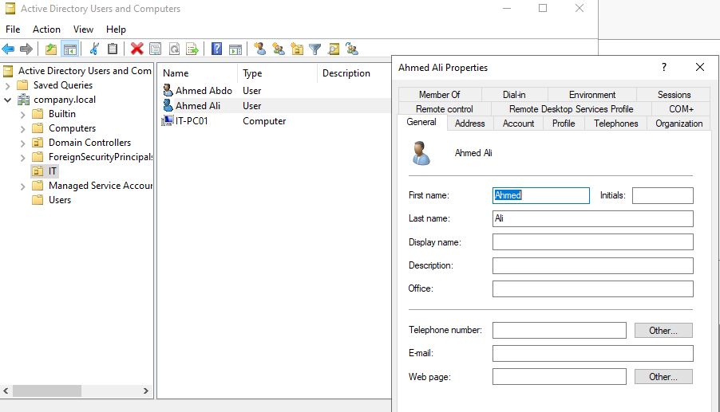

# 🏛️ Additional Domain Controller (ADC) Lab

A hands-on lab covering how to promote a **Windows Server (GUI)** and a **Windows Server Core** machine to **Additional Domain Controllers** in an existing Active Directory domain. This lab also covers AD DS installation via PowerShell on Server Core, replication configuration, and managing AD objects (OUs and users) through PowerShell — the essential skills for building a highly available, redundant Active Directory infrastructure.

---

## 📋 Table of Contents

1. [Background & Architecture](#-background--architecture)
2. [Lab Environment](#-lab-environment)
3. [Task 1 – Configure Deployment: Add DC to Existing Domain (GUI)](#task-1--configure-deployment-add-dc-to-existing-domain-gui)
4. [Task 2 – Configure DC Options: Site, DNS, GC, and DSRM Password (GUI)](#task-2--configure-dc-options-site-dns-gc-and-dsrm-password-gui)
5. [Task 3 – Configure Replication Source (Additional Options)](#task-3--configure-replication-source-additional-options)
6. [Task 4 – Install AD DS on Windows Server Core via PowerShell](#task-4--install-ad-ds-on-windows-server-core-via-powershell)
7. [Task 5 – Promote Server Core to Additional Domain Controller via PowerShell](#task-5--promote-server-core-to-additional-domain-controller-via-powershell)
8. [Task 6 – List OUs and Create a New AD User via PowerShell](#task-6--list-ous-and-create-a-new-ad-user-via-powershell)
9. [Task 7 – Verify User Creation in Active Directory Users and Computers](#task-7--verify-user-creation-in-active-directory-users-and-computers)
10. [Summary](#-summary)
11. [Key Concepts](#-key-concepts)
12. [GUI vs Server Core ADC Promotion](#-gui-vs-server-core-adc-promotion)
13. [Troubleshooting](#️-troubleshooting)

---

## 🏗️ Background & Architecture

### Why Additional Domain Controllers?

A single Domain Controller (DC) is a **Single Point of Failure (SPOF)**. If it goes down, the entire domain becomes unavailable — no logins, no Group Policy, no DNS, no Kerberos authentication. Recovery from backup can take hours, which is unacceptable in production environments.

An **Additional Domain Controller (ADC)** solves this by:
- Maintaining a **full, live replica** of the AD database
- Enabling **instant failover** — clients automatically authenticate against the ADC if the primary is down
- **Distributing authentication load** across multiple DCs
- Allowing **planned maintenance** on the primary without domain downtime

### Two Promotion Methods Covered in This Lab

```
┌─────────────────────────────────────────────────────────────────────┐
│              Active Directory Domain: test.local / company.local    │
│                                                                     │
│  ┌──────────────────┐   Replication   ┌────────────────────────┐   │
│  │  PDC19.test.local│ ◄────────────► │  ADC (GUI Server)      │   │
│  │  Primary DC      │                │  Windows Server 2022   │   │
│  │  All FSMO Roles  │                │  Promoted via Wizard   │   │
│  └──────────────────┘                └────────────────────────┘   │
│           │                                                         │
│           │              Replication                                │
│           ▼                                                         │
│  ┌──────────────────────────────────────┐                           │
│  │  Core ADC (Server Core)              │                           │
│  │  company.local                       │                           │
│  │  Promoted via PowerShell             │                           │
│  │  No GUI — PowerShell only            │                           │
│  └──────────────────────────────────────┘                           │
└─────────────────────────────────────────────────────────────────────┘
```

This lab covers **both promotion methods**:
- **Tasks 1–3**: GUI-based promotion using the AD DS Configuration Wizard (Server Manager)
- **Tasks 4–5**: PowerShell-based promotion on **Windows Server Core** (no GUI)
- **Tasks 6–7**: PowerShell AD management (listing OUs, creating users) verified in ADUC

---

## 🖥️ Lab Environment

| Component | Details |
|-----------|---------|
| **Primary DC** | PDC19.test.local |
| **Domain (GUI ADC)** | test.local |
| **Domain (Core ADC)** | company.local |
| **GUI ADC Target Server** | ADC (Windows Server 2022 with GUI) |
| **Core ADC Target Server** | Server Core (Windows Server 2022 — no GUI) |
| **AD Site** | Default-First-Site-Name |
| **Test User Created** | Ahmed Ali (ahmed.ali@company.local) |
| **Test User OU** | OU=IT,DC=company,DC=local |
| **Tools Used** | Server Manager, AD DS Config Wizard, PowerShell, ADUC |

---

## Task 1 – Configure Deployment: Add DC to Existing Domain (GUI)

### 📖 Explanation
The **AD DS Configuration Wizard** is launched from Server Manager after the AD DS role is installed (via Add Roles and Features). This wizard handles the actual **promotion** of the server to a Domain Controller. The first page — **Deployment Configuration** — defines the fundamental nature of the promotion:

There are three deployment operations:
- **Add a domain controller to an existing domain** ← used in this lab (ADC promotion)
- **Add a new domain to an existing forest** — creates a child domain (e.g., `us.company.local`)
- **Add a new forest** — creates a brand new AD forest from scratch (PDC setup)

For ADC promotion, you must:
1. Select the correct deployment operation
2. Specify the **existing domain** the new DC will join (e.g., `test.local`)
3. Provide **Domain Admin credentials** — required because promoting a DC is a privileged operation that modifies the domain

Without valid Domain Admin credentials, the wizard cannot read the existing domain's configuration, replicate the AD database, or register the new DC in the domain.

### 🔧 Steps
1. On the **target server** (ADC), open **Server Manager**
2. Install the AD DS role first:
   - Click **Manage** → **Add Roles and Features**
   - Select **Active Directory Domain Services** → **Add Features** → **Install**
3. After installation, click the **yellow notification flag** in Server Manager → **"Promote this server to a domain controller"**
4. The **AD DS Configuration Wizard** opens on the **Deployment Configuration** page
5. Select: **Add a domain controller to an existing domain**
6. In the **Domain** field, type or click **Select…** to browse for: `test.local`
7. Click **Change…** next to "No credentials provided"
8. Enter Domain Admin credentials:
   - Username: `TEST\Administrator` (or any Domain Admin account)
   - Password: the domain administrator password
9. Click **OK** to confirm credentials
10. Click **Next** to proceed to Domain Controller Options

### ✅ Solution / Expected Result
The Deployment Configuration page shows:
- Operation: **"Add a domain controller to an existing domain"** selected
- Domain field: `test.local`
- Credentials: showing the provided Domain Admin account (no longer says "No credentials provided")
- Target Server: **ADC** (shown in top-right corner of the wizard)

The wizard accepts the credentials and enables the **Next** button.

**Screenshot:**



> **Why "Add a domain controller" and not "Add a new domain"?** Selecting "Add a new domain" would create a separate child or tree domain within the forest — it would NOT add redundancy to your existing domain. Always select "Add a domain controller to an existing domain" when setting up an ADC for high availability.

> **Credential Requirement:** The account used must be a member of the **Domain Admins** group in the target domain. Enterprise Admins is required only when adding a domain to an existing forest or modifying forest-wide settings.

---

## Task 2 – Configure DC Options: Site, DNS, GC, and DSRM Password (GUI)

### 📖 Explanation
The **Domain Controller Options** page is one of the most important steps in ADC promotion. It configures four critical settings for the new Domain Controller:

**1. DNS Server**
Enabling this makes the new DC also a **DNS server** for the domain. This is strongly recommended for ADCs because:
- If the primary DC (which also runs DNS) goes down, clients still need DNS to find the ADC
- Both DCs having DNS ensures full redundancy of name resolution services
- DNS zones are automatically replicated between AD-integrated DNS servers

**2. Global Catalog (GC)**
The Global Catalog is a partial replica of **all objects across all domains** in the forest. It enables:
- Universal group membership lookups (required for user logon in multi-domain forests)
- Forest-wide object searches
- Exchange Server address lookups
Making the ADC a GC ensures these lookups work even if the primary GC server is down.

**3. Read Only Domain Controller (RODC)**
Leaving this unchecked creates a **full writable DC** (what we want). RODCs are used in branch offices or less-secure locations where a full writable DC would be a security risk.

**4. Site**
AD Sites define the physical/network topology of your domain. Placing the ADC in the correct site ensures clients in that network segment prefer to authenticate against the ADC in their site, reducing WAN traffic.

**5. DSRM Password (Directory Services Restore Mode)**
This is a **critical emergency recovery password** that allows you to boot the DC into a special recovery mode where you can repair or restore the AD database. It is completely separate from the domain admin password. If the AD database becomes corrupted and normal boot fails, DSRM is your only way into the server. **Store this password securely** — losing it can make DC recovery impossible.

### 🔧 Steps
1. On the **Domain Controller Options** page of the wizard:
   - ✅ Check **Domain Name System (DNS) server** — makes this DC a DNS server
   - ✅ Check **Global Catalog (GC)** — makes this DC a Global Catalog server
   - ☐ Leave **Read Only Domain Controller (RODC)** unchecked — we want a full writable DC
2. Under **Site name**, verify the correct AD site is selected:
   - Default: **Default-First-Site-Name** (for single-site lab environments)
   - In multi-site environments, select the appropriate site for this DC's location
3. Under **Type the Directory Services Restore Mode (DSRM) password**:
   - Enter a strong password (e.g., minimum 8 characters, uppercase, lowercase, number, symbol)
   - Confirm the password in the second field
   - **Record this password securely** — it cannot be recovered if lost
4. Click **Next** to proceed to DNS Options

### ✅ Solution / Expected Result
The Domain Controller Options page shows DNS Server ✅, Global Catalog ✅, RODC ☐ unchecked, correct site selected, and DSRM password entered and confirmed. The **Next** button becomes enabled. Note: The screenshot for this task appears fully black — this may be due to a screen capture issue during the lab (e.g., the DSRM password fields were masked by the OS security layer). The configuration described above is the expected and correct state.

**Screenshot:**



> **DSRM Password Security:** Store the DSRM password in a **privileged access workstation (PAW) password vault** or secure documentation system. It should be different from every other password in your environment. Without it, a corrupted AD database on this DC may require a complete reinstall.

> **DNS Delegation Warning:** On the next DNS Options page, you may see a warning about DNS delegation. In lab environments, this warning is safe to ignore — click Next. In production with a split DNS infrastructure, work with your DNS team to create the appropriate delegation records.

---

## Task 3 – Configure Replication Source (Additional Options)

### 📖 Explanation
The **Additional Options** page controls two important promotion settings:

**1. Install from Media (IFM)**
This option allows promoting a DC using a **pre-created backup** of the AD database instead of replicating over the network. This is useful when:
- Promoting a DC over a **slow WAN link** where full replication would take too long
- Setting up a **branch office DC** where bandwidth is limited
- The AD database is very large (millions of objects) and network replication would be time-consuming

IFM media is created using `ntdsutil` on an existing DC:
```cmd
ntdsutil
activate instance ntds
ifm
create sysvol full C:\IFMMedia
quit
quit
```

**2. Replicate From**
When not using IFM, this specifies **which existing DC** should be the source for initial AD replication. You can select:
- A **specific DC** — ensures you replicate from a known-good, up-to-date DC
- **Any domain controller** — AD automatically picks the best source based on site topology

Specifying the primary DC (PDC19.test.local) ensures the ADC gets its initial AD database from the most authoritative source, guaranteeing it starts with the most current data.

### 🔧 Steps
1. On the **Additional Options** page of the wizard:
   - **Install from media**: leave **unchecked** (we will replicate over the network — appropriate for LAN environments)
   - **Replicate from**: click the dropdown and select **PDC19.test.local** (the primary Domain Controller)
     - Alternatively, select **"Any domain controller"** to let AD choose automatically
2. Review the selection — the dropdown should show `PDC19.test.local`
3. Click **Next** to proceed to the **Paths** page
4. On **Paths**: leave all default locations:
   - Database folder: `C:\Windows\NTDS`
   - Log files folder: `C:\Windows\NTDS`
   - SYSVOL folder: `C:\Windows\SYSVOL`
5. Click **Next** → review the **Review Options** summary
6. Click **Next** → the wizard runs **Prerequisites Check** (all checks should pass with green)
7. Click **Install** — the server will automatically restart after promotion completes

### ✅ Solution / Expected Result
The Additional Options page shows:
- Install from media: **unchecked**
- Replicate from: **PDC19.test.local**

After clicking Install and the server restarts, the ADC (GUI) is successfully promoted. Logging in with Domain Admin credentials, you can verify in ADUC that both PDC19 and ADC appear in the **Domain Controllers** OU.

**Screenshot:**



> **IFM Use Case:** If your AD database contains over 10 million objects or you are promoting a DC at a remote site connected via a 10 Mbps link, IFM can reduce promotion time from hours to minutes. The IFM media is transported physically (USB drive) or pre-staged at the remote site.

> **Replication Verification:** After promotion, run `repadmin /replsummary` to confirm replication completed successfully with 0 errors. Run `repadmin /showrepl ADC` to see detailed replication partner information.

---

## Task 4 – Install AD DS on Windows Server Core via PowerShell

### 📖 Explanation
**Windows Server Core** is a minimal installation of Windows Server that has **no GUI** — no desktop, no Start Menu, no Server Manager, no mouse-driven interface. It offers significant advantages over the full GUI installation:
- **Smaller attack surface** — fewer components means fewer vulnerabilities
- **Lower memory and disk footprint** — typically 1–2 GB less RAM used, 4–6 GB less disk
- **Fewer updates and reboots** — fewer components means fewer patches needed
- **Microsoft's recommended installation** for Domain Controllers in production environments

However, because there is no GUI, all administration must be done via **PowerShell** or command-line tools. This includes installing roles, promoting to DC, and managing AD.

Installing the **AD-Domain-Services** feature on Server Core is done with a single PowerShell command. The `-IncludeManagementTools` parameter also installs the AD PowerShell module and command-line tools needed for DC promotion and AD management.

### 🔧 Steps
1. Log on to the **Server Core** machine — you will see only a command prompt window (no desktop or Start Menu)
2. Type `powershell` and press Enter to open a PowerShell session:
   ```cmd
   powershell
   ```
3. Run the following command to install the AD DS role with management tools:
   ```powershell
   Install-WindowsFeature AD-Domain-Services -IncludeManagementTools
   ```
4. The installation progress is displayed as a percentage bar:
   ```
   Start Installation...
   67%
   [ooooooooooooooooooooooooooooooooooooooooooooooooooooooooooooooooooooooo]
   ```
5. Wait for the installation to complete — the prompt returns when finished
6. Verify installation succeeded:
   ```powershell
   Get-WindowsFeature AD-Domain-Services
   ```
   The `Install State` should show **Installed**

### ✅ Solution / Expected Result
The PowerShell window shows the `Install-WindowsFeature` command executing with a progress bar reaching 100%. The command completes without errors, and the feature is installed. The server is now ready for AD DS promotion via PowerShell in Task 5.

**Screenshot:**



> **Why Server Core for DCs?** Microsoft's best practice guidance recommends Server Core for Domain Controllers because DCs are high-value targets. Server Core eliminates many attack surfaces (no IE, no Windows Explorer, no DirectX, no media player, no optional features) that would be unused on a DC anyway. In Windows Server 2022, Server Core receives ~68% fewer security patches per year than the GUI version.

> **No Reboot Required:** Unlike some role installations, AD-Domain-Services installation does **not** require a reboot. The reboot happens after promotion in Task 5.

---

## Task 5 – Promote Server Core to Additional Domain Controller via PowerShell

### 📖 Explanation
After installing the AD DS role on Server Core (Task 4), the **promotion** step transforms it into an actual Domain Controller using the `Install-ADDSDomainController` PowerShell cmdlet. This is the PowerShell equivalent of the GUI wizard used in Tasks 1–3.

The cmdlet parameters correspond directly to the GUI wizard pages:
- `-DomainName` → Deployment Configuration (which domain to join)
- `-Credential` → Domain Admin credentials (uses `Get-Credential` for secure input)
- `-InstallDns` → DC Options (whether to install DNS)
- `-NoGlobalCatalog` → DC Options (GC setting — `$false` means GC IS enabled)
- `-Force` → Skip confirmation prompts (required for non-interactive use)

The promotion process:
1. Validates environment and credentials
2. Contacts the existing DC to retrieve domain configuration
3. Replicates the AD database from the source DC
4. Installs and configures DNS
5. Configures SYSVOL
6. Prompts for the **DSRM password** (interactive input for security)
7. Displays warnings about best practices (static IP, DNS delegation)
8. Automatically **restarts** the server upon completion

### 🔧 Steps
1. In the PowerShell session on Server Core, run the promotion command:
   ```powershell
   Install-ADDSDomainController `
       -DomainName "company.local" `
       -Credential (Get-Credential) `
       -InstallDns:$true `
       -NoGlobalCatalog:$false `
       -Force:$true
   ```
2. When prompted by `Get-Credential`, enter:
   - **Username:** `COMPANY\Administrator`
   - **Password:** the Domain Admin password
3. When prompted for **DSRM Password**, type a strong password and press Enter
4. Confirm the DSRM password when prompted again
5. The promotion process begins — read the output messages:
   - `Determining replication source DC` — finding the best DC to replicate from
   - `Validating environment and user input` — checking prerequisites
   - `All tests completed successfully` — prerequisites passed
   - `Installing new domain controller` — promotion in progress
   - `Checking if Group Policy Management Console needs to be installed...`
6. Review any **WARNING** messages in the output (common warnings are expected — see notes below)
7. The server will **automatically restart** when promotion is complete
8. After restart, log in with **Domain Admin credentials** — the server is now a DC

### ✅ Solution / Expected Result
The PowerShell output shows the full promotion sequence completing successfully:
- `Determining replication source DC` ✅
- `Validating environment and user input` ✅
- `All tests completed successfully` ✅
- `Installing new domain controller` ✅
- DSRM password accepted ✅
- Server restarts automatically

After reboot, the Server Core machine is a full Domain Controller in `company.local`. You can verify from the primary DC: `Get-ADDomainController -Filter *` should list both DCs.

**Screenshot:**



> **Understanding the Warnings:**
>
> **"Allow cryptography algorithms compatible with Windows NT 4.0"** — This is an informational warning about a default security setting in Windows Server 2022. It is not an error and does not affect functionality. It means Windows Server 2022 DCs use stronger cryptography that is incompatible with Windows NT 4.0 clients (which are no longer supported or in use).
>
> **"Physical network adapter does not have static IP address(es)"** — This warning means the NIC has a DHCP-assigned address. Best practice is to assign a **static IP** to all Domain Controllers before promotion. Resolve this by setting a static IP in network settings.
>
> **"DNS delegation cannot be created"** — This is expected when the parent DNS zone is not accessible. If you control the parent DNS zone, manually create a delegation record. In isolated lab environments, this warning can be ignored.

---

## Task 6 – List OUs and Create a New AD User via PowerShell

### 📖 Explanation
One of the most powerful advantages of managing AD on Server Core is using **PowerShell AD cmdlets** — the same cmdlets that work on GUI servers but now used as the primary (and only) interface. This task demonstrates two essential AD management operations from a Server Core PowerShell session:

**1. Listing Organizational Units (OUs)**
The `Get-ADOrganizationalUnit` cmdlet retrieves all OUs in the domain. The `-Filter *` parameter returns all OUs, and `Select Name, DistinguishedName` shows both the friendly name and the full **LDAP Distinguished Name (DN)** — the DN is required when specifying where to create new AD objects.

**Distinguished Name format:** `OU=IT,DC=company,DC=local`
- `OU=IT` — the Organizational Unit named "IT"
- `DC=company` — the domain component "company"
- `DC=local` — the domain component "local"
- Read right to left: `local` → `company` → `IT` = the IT OU in company.local

**2. Creating a New AD User**
The `New-ADUser` cmdlet creates a domain user account with full attribute control:
- `-Name` — display name
- `-GivenName` / `-Surname` — first and last name
- `-SamAccountName` — the pre-Windows 2000 logon name (used for network authentication)
- `-UserPrincipalName` — the UPN (email-style logon: `user@domain`)
- `-Path` — the OU's Distinguished Name where the user will be created
- `-AccountPassword` — the initial password (converted to SecureString for security)
- `-Enabled $true` — activates the account immediately

### 🔧 Steps
1. In a PowerShell session (on the ADC Server Core or any DC), list all OUs:
   ```powershell
   Get-ADOrganizationalUnit -Filter * | Select Name, DistinguishedName
   ```
2. Review the output — note the DN of the IT OU: `OU=IT,DC=company,DC=local`
3. Create the new user **Ahmed Ali** in the IT OU:
   ```powershell
   New-ADUser `
       -Name "Ahmed Ali" `
       -GivenName "Ahmed" `
       -Surname "Ali" `
       -SamAccountName "ahmed.ali" `
       -UserPrincipalName "ahmed.ali@company.local" `
       -Path "OU=IT,DC=company,DC=local" `
       -AccountPassword (ConvertTo-SecureString "P@ssw0rd123" -AsPlainText -Force) `
       -Enabled $true
   ```
4. Press Enter — if successful, the prompt returns immediately with no output (PowerShell's "no news is good news" convention)
5. Verify the user was created:
   ```powershell
   Get-ADUser -Identity "ahmed.ali" | Select Name, SamAccountName, UserPrincipalName, Enabled
   ```

### ✅ Solution / Expected Result
**OU listing output:**
```
Name                DistinguishedName
----                -----------------
Domain Controllers  OU=Domain Controllers,DC=company,DC=local
IT                  OU=IT,DC=company,DC=local
```

**User creation:** No error output means success. The verification command confirms:
```
Name         : Ahmed Ali
SamAccountName : ahmed.ali
UserPrincipalName : ahmed.ali@company.local
Enabled      : True
```

**Screenshot:**



> **ConvertTo-SecureString:** Active Directory cmdlets require passwords as `SecureString` objects (encrypted in memory) rather than plain text strings. `ConvertTo-SecureString "P@ssw0rd123" -AsPlainText -Force` converts a plain text password to a SecureString. In production automation, use `Read-Host -AsSecureString` instead to avoid storing passwords in scripts.

> **Replication:** After creating the user on the ADC, it will replicate to all other DCs in the domain within seconds (for AD changes, replication is triggered immediately within a site). The user will be visible in ADUC on the primary DC shortly after.

---

## Task 7 – Verify User Creation in Active Directory Users and Computers

### 📖 Explanation
After creating the user via PowerShell on Server Core, it is important to **verify the creation** using the graphical **Active Directory Users and Computers (ADUC)** console on a GUI-based DC or management workstation. This verification step confirms:

1. The user was created in the **correct OU** (IT)
2. The user's **attributes** (First name, Last name, display name) are correct
3. The account was **replicated** from the Server Core ADC to the primary DC
4. The user can be **managed** through the GUI if needed for further attribute configuration

ADUC provides a visual confirmation that complements the PowerShell-based creation. In practice, administrators may use PowerShell for bulk user creation and ADUC for individual account management and verification.

The **Properties** dialog in ADUC shows all user attributes across multiple tabs:
- **General** — name, display name, description, office, phone, email, web page
- **Account** — logon name (UPN and pre-Windows 2000), account options, expiry
- **Profile** — profile path, logon script, home folder
- **Member Of** — group memberships
- **And more** — Environment, Sessions, Remote control, Remote Desktop Services Profile, COM+, Dial-in

### 🔧 Steps
1. On a **GUI-based Domain Controller** or RSAT-equipped workstation, open **Active Directory Users and Computers** (`dsa.msc`)
2. In the left tree, expand **company.local**
3. Click on the **IT** OU
4. In the right pane, verify:
   - **Ahmed Ali** appears as a **User** type
   - **Ahmed Abdo** is also listed (pre-existing user)
   - **IT-PC01** appears as a **Computer** (pre-existing computer account)
5. Double-click **Ahmed Ali** to open the Properties dialog
6. On the **General** tab, verify:
   - First name: `Ahmed`
   - Last name: `Ali`
   - Display name: `Ahmed Ali`
7. Click the **Account** tab and verify:
   - User logon name: `ahmed.ali@company.local`
   - Pre-Windows 2000 logon: `ahmed.ali`
8. Click **Cancel** to close without changes

### ✅ Solution / Expected Result
ADUC shows the IT OU containing three objects: **Ahmed Abdo** (User), **Ahmed Ali** (User — newly created), and **IT-PC01** (Computer). The **Ahmed Ali Properties** dialog confirms:
- First name: **Ahmed**
- Last name: **Ali**
- All attributes match what was specified in the `New-ADUser` command in Task 6

The user account has successfully replicated from the Server Core ADC to the primary DC and is visible in ADUC.

**Screenshot:**



> **Replication Confirmation:** The fact that Ahmed Ali is visible in ADUC on the primary DC (or GUI DC) confirms that AD replication between the ADC and the primary DC is working correctly. If replication had failed, the user would only exist on the DC where it was created.

> **Further Management:** From ADUC, you can now configure additional attributes for Ahmed Ali: add the user to security groups (Member Of tab), set a profile path, configure remote desktop access, set an expiry date, or add contact information — all through the GUI.

---

## 📝 Summary

| # | Task | Method | Key Action | Outcome |
|---|------|--------|------------|---------|
| 1 | Deployment Configuration | GUI Wizard | Select "Add DC to existing domain" for test.local | Wizard identifies existing domain; credentials provided |
| 2 | DC Options (Site, DNS, GC, DSRM) | GUI Wizard | Enable DNS ✅, GC ✅, set DSRM password | New DC configured as DNS server and Global Catalog |
| 3 | Replication Source | GUI Wizard | Set Replicate from: PDC19.test.local | AD database replicated from PDC19; promotion completes |
| 4 | Install AD DS on Core | PowerShell | `Install-WindowsFeature AD-Domain-Services` | AD DS role installed on Server Core (67% → 100%) |
| 5 | Promote Core to ADC | PowerShell | `Install-ADDSDomainController` | Server Core becomes ADC for company.local; auto-restarts |
| 6 | List OUs and Create User | PowerShell | `Get-ADOrganizationalUnit` + `New-ADUser` | Ahmed Ali created in OU=IT,DC=company,DC=local |
| 7 | Verify User in ADUC | GUI (ADUC) | Browse IT OU; open Ahmed Ali Properties | User confirmed in correct OU with correct attributes; replication verified |

---

## 🔑 Key Concepts

| Concept | Description |
|---------|-------------|
| **Additional Domain Controller (ADC)** | A second DC that replicates the AD database, providing redundancy and load distribution |
| **AD DS Configuration Wizard** | The GUI tool (launched from Server Manager) for promoting a server to a DC |
| **Deployment Configuration** | First wizard page — defines whether you are adding a DC, domain, or forest |
| **DSRM (Directory Services Restore Mode)** | Emergency boot mode for DC recovery; requires a separate password set during promotion |
| **Global Catalog (GC)** | A DC role that stores partial replicas of all objects across all domains in the forest |
| **DNS Server (DC role)** | Making the DC also run DNS — essential for fully redundant name resolution |
| **Install from Media (IFM)** | Promoting a DC using a pre-created AD database backup instead of network replication |
| **Server Core** | Minimal Windows Server installation with no GUI — lower attack surface and resource usage |
| **`Install-ADDSDomainController`** | PowerShell cmdlet for promoting a server to a DC — equivalent to the GUI wizard |
| **Distinguished Name (DN)** | LDAP format for specifying the full path of an AD object: `OU=IT,DC=company,DC=local` |
| **`New-ADUser`** | PowerShell cmdlet for creating AD user accounts with full attribute control |
| **ConvertTo-SecureString** | PowerShell cmdlet that converts plain text to an encrypted SecureString for use with AD cmdlets |
| **SamAccountName** | The pre-Windows 2000 logon name — used for network authentication (`ahmed.ali`) |
| **UserPrincipalName (UPN)** | The email-style logon name — used for modern authentication (`ahmed.ali@company.local`) |
| **AD Replication** | The automatic process of synchronizing AD changes between all DCs in the domain |

---

## 🆚 GUI vs Server Core ADC Promotion

| Aspect | GUI Promotion (Tasks 1–3) | Server Core Promotion (Tasks 4–5) |
|--------|--------------------------|-----------------------------------|
| **Interface** | Visual wizard with click-through pages | PowerShell cmdlets only |
| **Prerequisite** | AD DS role via Server Manager GUI | `Install-WindowsFeature` via PS |
| **Promotion command** | AD DS Configuration Wizard | `Install-ADDSDomainController` |
| **Credentials input** | GUI dialog box | `Get-Credential` secure popup |
| **DSRM password input** | GUI password field | Interactive PowerShell prompt |
| **Replication source** | Dropdown in wizard | `-Credential` and auto-selection |
| **Warnings visibility** | Shown on Prerequisites Check page | Shown as text output in PowerShell |
| **Attack surface** | Higher (full GUI) | Lower (no GUI = fewer vulnerabilities) |
| **Resource usage** | Higher RAM/disk | Lower RAM/disk |
| **Microsoft recommendation** | Acceptable | **Preferred for production DCs** |
| **Automation capability** | Manual only | Fully scriptable and automatable |
| **Remote management** | Full GUI tools available locally | PowerShell remoting / WAC required |

---

## 🛠️ Troubleshooting

| Problem | Likely Cause | Solution |
|---------|-------------|----------|
| Wizard cannot find domain | DNS not pointing to primary DC | Set the ADC's primary DNS to the PDC's IP address |
| "No credentials provided" error | Credentials not entered or wrong | Click Change… and enter valid Domain Admin credentials |
| Prerequisites check fails | DNS or network issue | Fix DNS; ensure ADC can reach PDC (`ping PDC19.test.local`) |
| Promotion fails with replication error | Network connectivity or firewall | Verify ports TCP/UDP 389, 636, 49152-65535 are open between DCs |
| Server Core: command not found | PowerShell not open | Type `powershell` first, then run the cmdlet |
| `Install-ADDSDomainController` fails | AD DS role not installed | Run `Install-WindowsFeature AD-Domain-Services -IncludeManagementTools` first |
| DSRM password rejected | Password too weak | Use minimum 8 chars with uppercase, lowercase, number, and symbol |
| User not visible in ADUC after creation | Replication not yet completed | Wait 15–60 seconds; run `repadmin /syncall /AdeP` to force replication |
| `New-ADUser` fails: "Path not found" | OU DN is wrong | Run `Get-ADOrganizationalUnit -Filter *` to confirm the exact DN |
| ADC not appearing in Domain Controllers OU | Promotion failed or DNS issue | Check event log on ADC: Event Viewer → Directory Services |

---

*Lab completed on Windows Server 2022 | Domains: test.local / company.local | Primary DC: PDC19.test.local | GUI ADC: ADC | Core ADC: Server Core | Test User: Ahmed Ali (ahmed.ali@company.local) in OU=IT*
