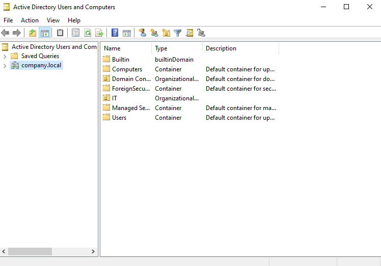
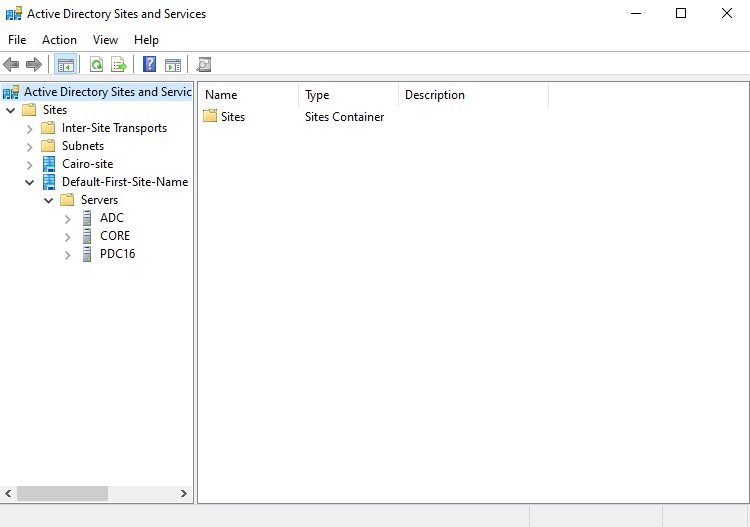
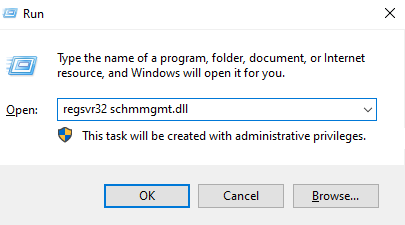
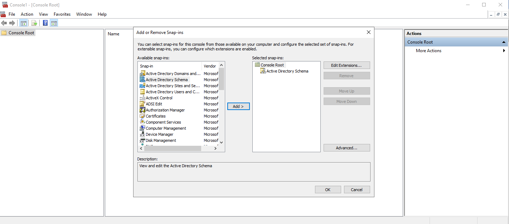
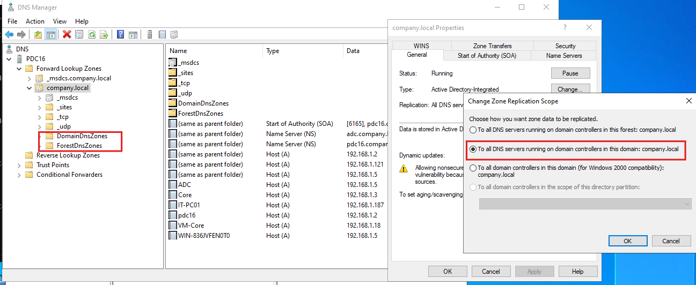
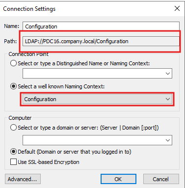
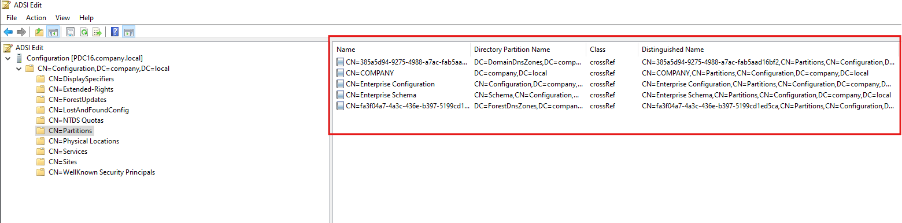
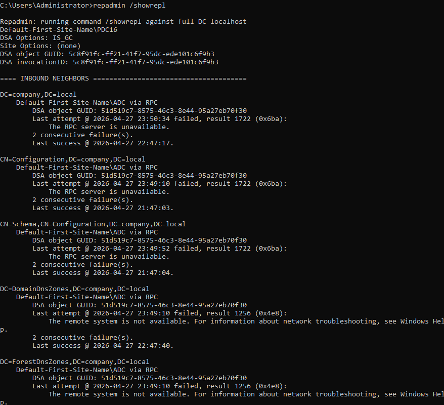

# Active Directory Partitions, Schema & Replication Lab

## Overview

This lab explores the core **Active Directory directory partitions**, how to view and manage them using built-in tools (ADUC, ADSS, ADSI Edit, DNS Manager, MMC), and how to monitor **replication status** between Domain Controllers using `repadmin`.

### Environment

| Server | Role |
|--------|------|
| `PDC16.company.local` | Primary Domain Controller (PDC Emulator, Schema Master) |
| `ADC.company.local` | Additional Domain Controller |
| `CORE.company.local` | Additional Domain Controller |

### Active Directory Partition Types

| Partition | Distinguished Name | Scope | Tool to View |
|-----------|--------------------|-------|--------------|
| Domain | `DC=company,DC=local` | Domain-wide | ADUC |
| Configuration | `CN=Configuration,DC=company,DC=local` | Forest-wide | ADSS / ADSI Edit |
| Schema | `CN=Schema,CN=Configuration,DC=company,DC=local` | Forest-wide | MMC Schema Snap-in |
| Application (DomainDnsZones) | `DC=DomainDnsZones,DC=company,DC=local` | Domain DNS DCs | DNS Manager |
| Application (ForestDnsZones) | `DC=ForestDnsZones,DC=company,DC=local` | Forest DNS DCs | DNS Manager |

---

## Prerequisites

- Windows Server with Active Directory Domain Services installed
- Domain: `company.local`
- At least two Domain Controllers (PDC16, ADC, CORE)
- Administrative credentials (Domain Admin / Schema Admin)
- RSAT tools available

---

## Task 1 — Explore the Domain Partition

The **Domain Partition** stores all domain objects: users, computers, groups, OUs, and containers. It replicates to all Domain Controllers within the same domain.

**Steps:**
1. Open **Active Directory Users and Computers** (`dsa.msc`)
2. Expand `company.local` in the left pane
3. Observe the default containers and OUs in the right pane

**Screenshot:**



**Default objects visible in the Domain Partition:**

| Name | Type | Purpose |
|------|------|---------|
| Builtin | builtinDomain | Built-in security groups (Administrators, Users, etc.) |
| Computers | Container | Default location for joined computers |
| Domain Controllers | Organizational Unit | Stores all DC computer accounts |
| ForeignSecurityPrincipals | Container | SIDs from external trusted domains |
| IT | Organizational Unit | Custom OU |
| Managed Service Accounts | Container | Managed/Group Managed Service Accounts |
| Users | Container | Default location for new user accounts |

> ℹ️ **Key Concept:** The Domain Partition DN is `DC=company,DC=local`. This partition replicates **only within the domain** — not to DCs in other domains of the same forest.

---

## Task 2 — Explore the Configuration Partition

The **Configuration Partition** stores forest-wide infrastructure data: sites, subnets, site links, services, and replication topology. It replicates to **all DCs in the entire forest**.

**Steps:**
1. Open **Active Directory Sites and Services** (`dssite.msc`)
2. Expand the **Sites** container
3. Observe the site topology and server objects

**Screenshot:**



**Objects visible in the Configuration Partition (via ADSS):**

| Object | Type | Description |
|--------|------|-------------|
| Sites | Container | Top-level container for all site objects |
| Inter-Site Transports | Container | IP and SMTP site link objects |
| Subnets | Container | IP subnet-to-site mappings |
| Cairo-site | Site | Custom AD site |
| Default-First-Site-Name | Site | Default site created during domain promotion |
| ADC | Server | DC server object in Default-First-Site-Name |
| CORE | Server | DC server object in Default-First-Site-Name |
| PDC16 | Server | DC server object in Default-First-Site-Name |

> ℹ️ **Key Concept:** The Configuration Partition DN is `CN=Configuration,DC=company,DC=local`. It stores the replication topology managed by the KCC (Knowledge Consistency Checker) and replicates to every DC in the forest.

---

## Task 3 — Register the Schema Management DLL

The **Schema Partition** is not accessible through a standard tool by default. The Active Directory Schema MMC snap-in must be registered first.

**Steps:**
1. Press **Win + R** to open the Run dialog
2. Type: `regsvr32 schmmgmt.dll`
3. Click **OK** — confirm any UAC prompt
4. A success message confirms the DLL is registered

**Screenshot:**



> ⚠️ The Schema snap-in is not registered by default for security — unauthorized schema modifications can break the entire forest. This step is required once per machine.

> ℹ️ To register silently: `regsvr32 /s schmmgmt.dll`

---

## Task 4 — Add Active Directory Schema Snap-in to MMC

After registering the DLL, add the Schema snap-in to MMC to view and manage the **Schema Partition**.

**Steps:**
1. Press **Win + R**, type `mmc`, press **Enter**
2. Go to **File → Add/Remove Snap-ins…**
3. In *Available snap-ins*, locate **Active Directory Schema**
4. Click **Add >** to move it to the *Selected snap-ins* panel
5. Click **OK**

**Screenshot:**



**What you can see in the Schema Snap-in:**

| Node | Contents |
|------|----------|
| Classes | All object class definitions (User, Computer, Group, OU, etc.) |
| Attributes | All attribute definitions (sAMAccountName, mail, cn, etc.) |

> ℹ️ **Key Concept:** The Schema Partition (`CN=Schema,CN=Configuration,DC=company,DC=local`) defines **what can exist** in Active Directory. Modifying it requires Schema Admin membership and changes replicate forest-wide.

> 💡 Save the console via **File → Save As** (e.g., `schema.msc`) to avoid re-adding the snap-in each session.

---

## Task 5 — Explore Application Partitions (DNS Zones)

**Application Partitions** store data that replicates to a specific subset of DCs. The two created automatically by AD-integrated DNS are:

| Partition | Replication Scope |
|-----------|------------------|
| `DomainDnsZones` | All DCs running DNS in this **domain** |
| `ForestDnsZones` | All DCs running DNS in the entire **forest** |

**Steps:**
1. Open **DNS Manager** (`dnsmgmt.msc`)
2. Expand **Forward Lookup Zones → company.local**
3. Observe `DomainDnsZones` and `ForestDnsZones` subfolders (highlighted in the screenshot)
4. Right-click `company.local` → **Properties → General tab → Change…** next to Replication
5. Observe the *Change Zone Replication Scope* options

**Screenshot:**



**Zone Replication Scope Options:**

| Option | Partition Used | Scope |
|--------|---------------|-------|
| To all DNS servers in this forest | `ForestDnsZones` | All DNS-enabled DCs in forest |
| **To all DNS servers in this domain** ✅ | `DomainDnsZones` | All DNS-enabled DCs in domain |
| To all domain controllers in this domain | Domain Partition | All DCs (Windows 2000 compat) |
| To all DCs in this directory partition scope | Custom partition | Custom |

> ℹ️ The currently selected scope is **"To all DNS servers running on domain controllers in this domain: company.local"** — zone data is stored in the `DomainDnsZones` application partition.

---

## Task 6 — Connect to the Configuration Partition via ADSI Edit

**ADSI Edit** (`adsiedit.msc`) is a low-level editor for all AD partitions, allowing direct LDAP-level viewing and editing of any object and attribute.

**Steps:**
1. Press **Win + R**, type `adsiedit.msc`, press **Enter**
2. Right-click **ADSI Edit** → **Connect to…**
3. In the *Connection Settings* dialog:
   - **Name:** `Configuration`
   - **Path:** `LDAP://PDC16.company.local/Configuration`
   - Select **"Select a well known Naming Context"**
   - Choose **Configuration** from the dropdown
4. Click **OK**

**Screenshot:**



**Connection Settings explained:**

| Field | Value | Purpose |
|-------|-------|---------|
| Name | `Configuration` | Display label in ADSI Edit tree |
| Path | `LDAP://PDC16.company.local/Configuration` | Full LDAP path to the partition |
| Naming Context | Configuration | Targets `CN=Configuration,DC=company,DC=local` |
| Computer | Default | Uses currently logged-on user's credentials |

> ℹ️ Other Naming Contexts you can connect to:
> - `Default naming context` → Domain Partition
> - `Schema` → Schema Partition
> - Custom LDAP path → Application Partitions

> ⚠️ **Caution:** ADSI Edit modifies AD objects directly with no undo. Incorrect changes can break the domain or forest.

---

## Task 7 — View All Directory Partitions via ADSI Edit (CN=Partitions)

The `CN=Partitions` container inside the Configuration partition holds **crossRef objects** — one for each directory partition in the forest. This is AD's internal registry of all partitions.

**Steps:**
1. In **ADSI Edit**, expand **Configuration [PDC16.company.local]**
2. Expand **CN=Configuration,DC=company,DC=local**
3. Click **CN=Partitions**
4. The right pane shows all crossRef objects (highlighted in the screenshot)

**Screenshot:**



**CrossRef Objects visible:**

| CN | Directory Partition Name | Class | Description |
|----|--------------------------|-------|-------------|
| CN=385a5d94-… | `DC=DomainDnsZones,DC=company,DC=local` | crossRef | DomainDnsZones application partition |
| CN=COMPANY | `DC=company,DC=local` | crossRef | **Domain Partition** |
| CN=Enterprise Configuration | `CN=Configuration,DC=company,DC=local` | crossRef | **Configuration Partition** |
| CN=Enterprise Schema | `CN=Schema,CN=Configuration,DC=company,DC=local` | crossRef | **Schema Partition** |
| CN=fa3f04a7-… | `DC=ForestDnsZones,DC=company,DC=local` | crossRef | ForestDnsZones application partition |

> ℹ️ This confirms all **5 directory partitions** present in this forest: Domain, Configuration, Schema, DomainDnsZones, and ForestDnsZones.

> 💡 Each `crossRef` object stores partition metadata including which DCs host it (`msDS-NC-Replica-Locations`) and the replication scope.

---

## Task 8 — Monitor Replication Status with repadmin /showrepl

`repadmin` is the primary command-line tool for monitoring and troubleshooting AD replication between Domain Controllers.

**Command:**
```cmd
repadmin /showrepl
```

**Screenshot:**



**Output Header:**

| Field | Value | Meaning |
|-------|-------|---------|
| DC Name | `Default-First-Site-Name\PDC16` | PDC16 is in the Default-First-Site-Name site |
| DSA Options | `IS_GC` | PDC16 is a Global Catalog server |
| DSA object GUID | `5c8f91fc-ff21-41f7-95dc-ede101c6f9b3` | Unique identifier for this DC's DSA object |

**Inbound Replication Status (from ADC via RPC):**

| Partition | Last Success | Last Failed Attempt | Error |
|-----------|-------------|---------------------|-------|
| `DC=company,DC=local` | 2026-04-27 22:47:17 | 2026-04-27 23:50:34 | 1722 — RPC unavailable |
| `CN=Configuration,…` | 2026-04-27 21:47:03 | 2026-04-27 23:49:10 | 1722 — RPC unavailable |
| `CN=Schema,CN=Configuration,…` | 2026-04-27 21:47:04 | 2026-04-27 23:49:52 | 1722 — RPC unavailable |
| `DC=DomainDnsZones,…` | 2026-04-27 22:47:40 | 2026-04-27 23:49:10 | 1256 — Remote system not available |
| `DC=ForestDnsZones,…` | (recent) | 2026-04-27 23:49:10 | 1256 — Remote system not available |

**Error Codes:**

| Code | Hex | Meaning | Likely Cause |
|------|-----|---------|-------------|
| 1722 | 0x6ba | RPC Server Unavailable | ADC is offline or firewall blocking RPC |
| 1256 | 0x4e8 | Remote system not available | Network connectivity issue to ADC |

> ⚠️ **Diagnosis:** All 5 partitions show **2 consecutive failures** from `ADC.company.local`. Last successful replications were ~1 hour before the failures, indicating ADC went offline or became unreachable around 23:49 on 2026-04-27.

---

## Additional repadmin Commands

```cmd
# Quick summary of all DCs and replication health
repadmin /replsummary

# Show only failed replications across all DCs
repadmin /showrepl * /errorsonly

# Force replication of all partitions from all partners
repadmin /syncall /AdeP

# Force replication of a specific partition from a specific partner
repadmin /replicate PDC16 ADC DC=company,DC=local

# View replication queue (pending changes)
repadmin /queue

# Show replication metadata for a specific object
repadmin /showmeta "CN=Administrator,CN=Users,DC=company,DC=local"

# Test full replication health
dcdiag /test:replications /v
```

---

## Summary: All 5 Active Directory Partitions

| # | Partition | DN | Scope | Tool |
|---|-----------|-----|-------|------|
| 1 | **Domain** | `DC=company,DC=local` | Domain | ADUC (`dsa.msc`) |
| 2 | **Configuration** | `CN=Configuration,DC=company,DC=local` | Forest | ADSS (`dssite.msc`) / ADSI Edit |
| 3 | **Schema** | `CN=Schema,CN=Configuration,DC=company,DC=local` | Forest | MMC + `schmmgmt.dll` |
| 4 | **DomainDnsZones** | `DC=DomainDnsZones,DC=company,DC=local` | Domain DNS DCs | DNS Manager |
| 5 | **ForestDnsZones** | `DC=ForestDnsZones,DC=company,DC=local` | Forest DNS DCs | DNS Manager |

---

## Replication Error Reference

| Error | Code | Description | Resolution |
|-------|------|-------------|-----------|
| RPC Server Unavailable | 1722 / 0x6ba | Target DC unreachable via RPC | Check firewall (TCP 135, 49152–65535), verify DC is running |
| Remote system not available | 1256 / 0x4e8 | Network-level failure | Check network path, DNS resolution, ping target DC |
| Access Denied | 5 / 0x5 | Credential/permission issue | Verify replication permissions in AD |
| Replication Access Denied | 8453 | Insufficient replication rights | Grant "Replicating Directory Changes" right |
| Object Not Found | 8439 | DN missing on source | Run `repadmin /showmeta`, check metadata cleanup |

---

## References

- [Microsoft Docs: AD DS Replication](https://learn.microsoft.com/en-us/windows-server/identity/ad-ds/plan/understanding-active-directory-replication)
- [repadmin command reference](https://learn.microsoft.com/en-us/previous-versions/windows/it-pro/windows-server-2012-r2-and-2012/cc770963(v=ws.11))
- [ADSI Edit overview](https://learn.microsoft.com/en-us/previous-versions/windows/it-pro/windows-server-2003/cc773354(v=ws.10))
- [Troubleshoot replication error 1722](https://learn.microsoft.com/en-us/troubleshoot/windows-server/active-directory/replication-error-1722-rpc-server-unavailable)
- [DNS Application Partitions](https://learn.microsoft.com/en-us/windows-server/networking/dns/deploy/dns-app-partitions)
