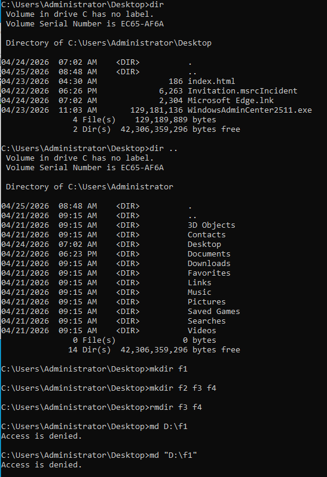
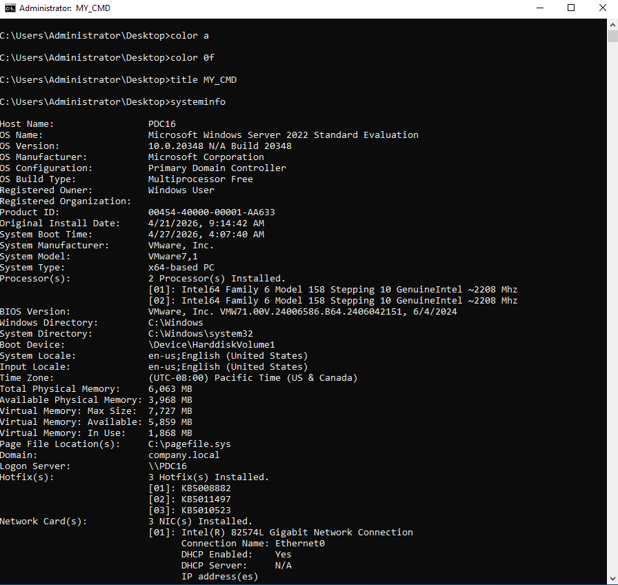
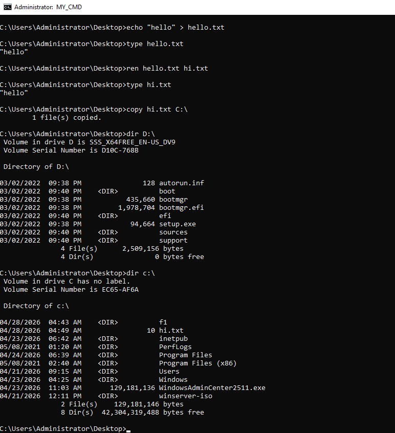

# Windows Command Prompt (CMD) Basics Lab

## Overview

This lab covers fundamental Windows Command Prompt operations including customizing the console appearance, gathering system information, managing files and directories, and navigating the file system. All tasks are performed on a Windows Server 2022 machine (`PDC16`) as Administrator.

### Environment

| Field | Value |
|-------|-------|
| Host Name | PDC16 |
| OS | Microsoft Windows Server 2022 Standard Evaluation |
| OS Version | 10.0.20348 Build 20348 |
| OS Configuration | Primary Domain Controller |
| Domain | company.local |
| System Type | x64-based PC |

---

## Task 1 — Customize the CMD Console & Display System Info

This task demonstrates how to personalize the CMD window and retrieve detailed system information.

### Step 1.1 — Change Console Text Color

**Command:**
```cmd
color a
```
Sets the text color to **bright green** on a black background.

Color codes follow the format `color [background][foreground]`. A single digit/letter sets only the foreground color.

**Then:**
```cmd
color 0f
```
Resets to default: **white text on black background** (`0` = black background, `f` = bright white text).

**Color Code Reference:**

| Code | Color | Code | Color |
|------|-------|------|-------|
| 0 | Black | 8 | Dark Gray |
| 1 | Dark Blue | 9 | Blue |
| 2 | Dark Green | A | Green |
| 3 | Dark Cyan | B | Cyan |
| 4 | Dark Red | C | Red |
| 5 | Dark Magenta | D | Magenta |
| 6 | Dark Yellow | E | Yellow |
| 7 | Gray | F | White |

> ℹ️ `color` with no arguments resets to the default color scheme.

---

### Step 1.2 — Set the Window Title

**Command:**
```cmd
title MY_CMD
```

Changes the CMD window title bar to `MY_CMD`. Useful when managing multiple open CMD windows simultaneously.

---

### Step 1.3 — Display System Information

**Command:**
```cmd
systeminfo
```

Displays detailed configuration information about the computer and its operating system.

**Screenshot:**



**Key fields from the output:**

| Field | Value | Meaning |
|-------|-------|---------|
| Host Name | PDC16 | Computer name |
| OS Name | Windows Server 2022 Standard Evaluation | Installed OS edition |
| OS Version | 10.0.20348 Build 20348 | Build number |
| OS Configuration | Primary Domain Controller | This machine's AD role |
| System Manufacturer | VMware, Inc. | Running as a virtual machine |
| System Model | VMware7,1 | VMware Workstation/ESXi VM |
| Processor(s) | 2 × Intel64 Family 6 Model 158 ~2208 MHz | Two vCPUs |
| Total Physical Memory | 6,063 MB | ~6 GB RAM |
| Available Physical Memory | 3,968 MB | Currently free RAM |
| Domain | company.local | Joined domain |
| Logon Server | \\PDC16 | Authenticating DC |
| Hotfix(s) | 3 installed (KB5008882, KB5011497, KB5010523) | Applied patches |
| Network Card(s) | 3 NICs (Intel 82574L Gigabit) | Three network adapters |

> 💡 To export `systeminfo` output to a file: `systeminfo > sysinfo.txt`

---

## Task 2 — File Operations: Create, Read, Rename, Copy, and List

This task demonstrates core file management commands.

**Screenshot:**



---

### Step 2.1 — Create a Text File with echo

**Command:**
```cmd
echo "hello" > hello.txt
```

Creates `hello.txt` in the current directory containing the text `"hello"`.

| Part | Meaning |
|------|---------|
| `echo "hello"` | Prints the text to standard output |
| `>` | Redirects output to a file (creates or overwrites) |
| `hello.txt` | The target filename |

> ℹ️ Use `>>` to **append** to an existing file instead of overwriting it.

---

### Step 2.2 — Read/Display a File

**Command:**
```cmd
type hello.txt
```

Displays the contents of `hello.txt`. Output: `"hello"`

> ℹ️ `type` is the CMD equivalent of Linux's `cat` command.

---

### Step 2.3 — Rename a File

**Command:**
```cmd
ren hello.txt hi.txt
```

Renames `hello.txt` to `hi.txt`. File content is unchanged — verified by running `type hi.txt` which still outputs `"hello"`.

> ℹ️ Wildcards are supported: `ren *.txt *.bak` renames all `.txt` files to `.bak`.

---

### Step 2.4 — Copy a File to Another Location

**Command:**
```cmd
copy hi.txt C:\
```

Copies `hi.txt` from `C:\Users\Administrator\Desktop` to the root of `C:\`. Output: `1 file(s) copied.`

> ℹ️ To copy and rename simultaneously: `copy hi.txt C:\newname.txt`
> For full directory trees, use `xcopy` or `robocopy`.

---

### Step 2.5 — List Drive Contents with dir

**Command:**
```cmd
dir D:\
```

Lists the contents of `D:\` — a mounted Windows Server installation ISO in this lab.

| Entry | Type | Size | Description |
|-------|------|------|-------------|
| autorun.inf | File | 128 bytes | Autorun configuration |
| boot | `<DIR>` | — | Boot files |
| bootmgr | File | 435,660 bytes | Windows Boot Manager |
| bootmgr.efi | File | 1,978,704 bytes | EFI boot loader |
| efi | `<DIR>` | — | EFI boot directory |
| setup.exe | File | 94,664 bytes | Windows Setup launcher |
| sources | `<DIR>` | — | Installation source files |
| support | `<DIR>` | — | Support tools |

Volume Label: `SSS_X64FREE_EN-US_DV9` | Serial: `D10C-768B` | Free space: **0 bytes** (read-only ISO)

---

**Command:**
```cmd
dir c:\
```

Lists root of `C:\`:

| Entry | Type | Notes |
|-------|------|-------|
| f1 | `<DIR>` | Created by mkdir in Task 3 |
| hi.txt | File (10 bytes) | Copied from Desktop in Step 2.4 |
| inetpub | `<DIR>` | IIS default web root |
| Program Files | `<DIR>` | 64-bit applications |
| Program Files (x86) | `<DIR>` | 32-bit applications |
| Users | `<DIR>` | User profiles |
| Windows | `<DIR>` | OS files |
| WindowsAdminCenter2511.exe | File (129 MB) | Windows Admin Center installer |

> ℹ️ Useful `dir` flags: `/w` (wide), `/p` (pause per page), `/a` (show hidden), `/s` (recurse), `/o:d` (sort by date)

---

## Task 3 — Directory Navigation and Management

This task covers navigating the file system and creating/removing directories.

**Screenshot:**



---

### Step 3.1 — List Current Directory

**Command:**
```cmd
dir
```

Lists contents of `C:\Users\Administrator\Desktop`:

| Entry | Size | Notes |
|-------|------|-------|
| index.html | 186 bytes | Web page file |
| Invitation.msrcIncident | 6,263 bytes | Remote assistance invitation |
| Microsoft Edge.lnk | 2,304 bytes | Desktop shortcut |
| WindowsAdminCenter2511.exe | 129 MB | Admin Center installer |

---

### Step 3.2 — List the Parent Directory

**Command:**
```cmd
dir ..
```

Lists the contents of the **parent directory** (`C:\Users\Administrator`) without changing the working directory. Shows all standard user profile folders: 3D Objects, Contacts, Desktop, Documents, Downloads, Favorites, Links, Music, Pictures, Saved Games, Searches, Videos.

> ℹ️ `..` refers to the parent directory. Use `cd ..` to actually navigate into it.

---

### Step 3.3 — Create a Single Directory

**Command:**
```cmd
mkdir f1
```

Creates folder `f1` inside `C:\Users\Administrator\Desktop`.

> ℹ️ `mkdir` and `md` are identical commands.

---

### Step 3.4 — Create Multiple Directories at Once

**Command:**
```cmd
mkdir f2 f3 f4
```

Creates three directories (`f2`, `f3`, `f4`) simultaneously in the current directory with a single command.

> 💡 Multiple space-separated names are all created at once — a CMD-specific feature.

---

### Step 3.5 — Remove Multiple Directories

**Command:**
```cmd
rmdir f3 f4
```

Removes directories `f3` and `f4`. Both must be **empty** for this to succeed without additional flags.

> ⚠️ To remove a non-empty directory: `rmdir /s /q foldername`
> - `/s` — removes all subdirectories and files recursively
> - `/q` — quiet mode, no confirmation prompt

---

### Step 3.6 — Attempt to Create Directory on Read-Only Drive

**Commands:**
```cmd
md D:\f1
md "D:\f1"
```

Both result in: **`Access is denied.`**

**Why?** Drive `D:\` is a mounted **DVD/ISO** — a read-only medium. You cannot create or modify files/directories on it. Quoting the path makes no difference.

> ℹ️ Access denied on a drive can mean: the drive is read-only (optical/ISO media), insufficient NTFS permissions, or the volume is write-protected.

---

## Command Reference Summary

| Command | Syntax | Purpose |
|---------|--------|---------|
| `color` | `color [bg][fg]` | Set console text and background color |
| `title` | `title <text>` | Set CMD window title |
| `systeminfo` | `systeminfo` | Display full system configuration |
| `echo` | `echo <text> > file` | Write text to a file |
| `type` | `type <file>` | Display file contents |
| `ren` | `ren <old> <new>` | Rename a file or directory |
| `copy` | `copy <src> <dest>` | Copy a file |
| `dir` | `dir [path] [flags]` | List directory contents |
| `mkdir` / `md` | `mkdir <name> [name2…]` | Create one or more directories |
| `rmdir` / `rd` | `rmdir [/s] [/q] <name>` | Remove a directory |
| `cd` | `cd <path>` | Change current directory |
| `cd ..` | `cd ..` | Go up one directory level |
| `cd \` | `cd \` | Go to root of current drive |

---

## Useful CMD Tips

```cmd
# Redirect command output to a file
systeminfo > output.txt

# Append output to an existing file
echo more info >> output.txt

# Pipe output page by page
dir /s | more

# Clear the screen
cls

# Show command history
doskey /history

# Open CMD in a specific directory
cd /d D:\MyFolder

# Copy entire directory tree
xcopy C:\Source D:\Dest /e /i /h

# Robust file copy with logging
robocopy C:\Source D:\Dest /e /log:copy.log
```

---

## Troubleshooting

| Issue | Cause | Solution |
|-------|-------|----------|
| `Access is denied` on D: | D: is a read-only ISO/DVD | Use a writable drive or folder |
| `rmdir` fails — "directory is not empty" | Folder contains files or subfolders | Use `rmdir /s /q foldername` |
| `echo` adds literal quotes to file | CMD includes the `"` characters | Use `echo hello > file.txt` without quotes |
| `type` shows garbled output | File is binary, not plain text | Use an appropriate viewer for the file type |
| `color` has no visible effect | Terminal emulator doesn't support it | Use the native CMD (`cmd.exe`) window |
