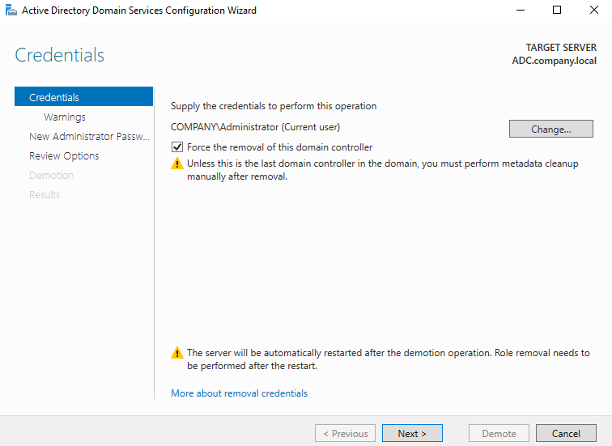
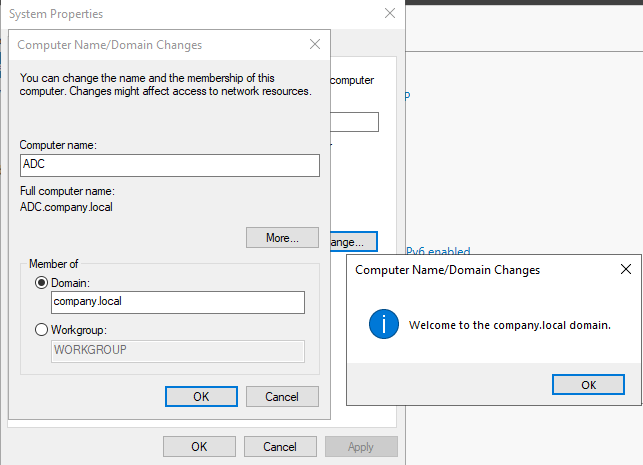
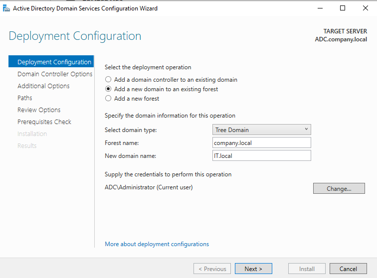
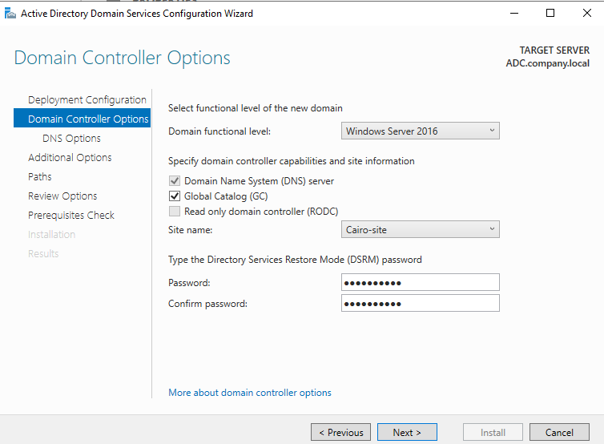
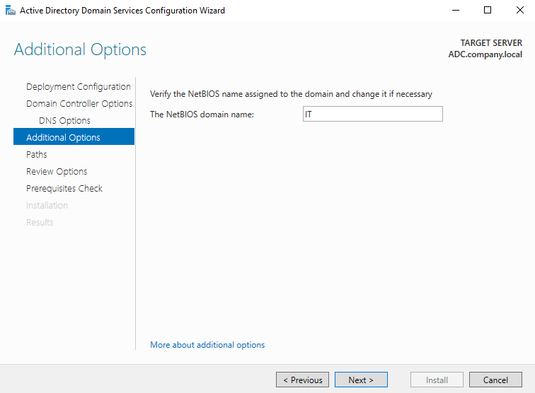
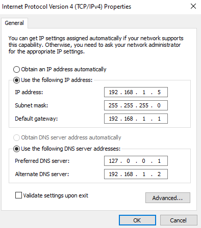
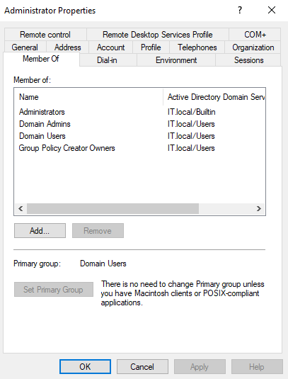
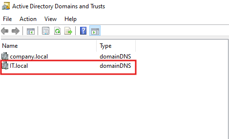
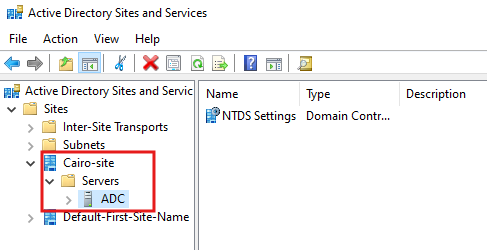

# Active Directory — Create a New Tree Domain (IT.local) in an Existing Forest Lab

## Overview

This lab walks through the complete process of **creating a new Tree Domain (`IT.local`)** inside an existing Active Directory forest (`company.local`). The workflow covers demoting an existing Additional Domain Controller (ADC), re-joining it to the root domain as a member server, reconfiguring its DNS, and promoting it to become the first Domain Controller of a brand-new tree domain.

---

## Lab Architecture

```
Forest: company.local
│
├── company.local  (Root Domain — PDC16 is DC)
│         └── ADC was previously a DC here → demoted
│
└── IT.local       (New Tree Domain — ADC promoted as first DC)
```

### Servers

| Server | Initial Role | Final Role |
|--------|-------------|-----------|
| `PDC16.company.local` | PDC / FSMO holder | Unchanged — Root DC |
| `ADC.company.local` | Additional DC in company.local | First DC of new tree domain `IT.local` |

---

## Prerequisites

- Windows Server (2016 or later) for ADC
- `company.local` forest already exists with PDC16 as the root DC
- Enterprise Admin credentials (from `company.local`) to authorize adding a new tree domain
- Static IP already configured on ADC
- AD DS role installed on ADC

---

## Task 1 — Demote ADC and Uninstall AD DS Role

Before ADC can be promoted into a new tree domain, it must first be **demoted** from its current role as a DC in `company.local`.

**Steps:**
1. On `ADC`, open **Server Manager → Manage → Remove Roles and Features**
2. Deselect **Active Directory Domain Services**
3. The **AD DS Configuration Wizard** launches automatically
4. On the **Credentials** page:
   - Current user: `COMPANY\Administrator`
   - Check **"Force the removal of this domain controller"**
   - Note the warning: *"Unless this is the last domain controller in the domain, you must perform metadata cleanup manually after removal."*
5. Click **Next >** through the wizard and complete the demotion
6. The server **restarts automatically** after demotion
7. After reboot, return to Server Manager and **remove the AD DS role** completely

**Screenshot:**



**Key warnings on this screen:**

| Warning | Meaning |
|---------|---------|
| Force the removal checkbox | Bypasses normal graceful demotion — use when normal demotion fails |
| Metadata cleanup warning | After force removal, orphaned DC objects remain in AD and must be cleaned with `ntdsutil` |
| Automatic restart notice | Server reboots once demotion completes; AD DS role removal requires a second restart |

> ⚠️ Always transfer all FSMO roles away from a DC **before** demoting it. If ADC held any FSMO roles, transfer them to PDC16 first using `Move-ADDirectoryServerOperationMasterRole` or the GUI.

---

## Task 2 — Re-join ADC to the company.local Domain as a Member Server

After demotion and AD DS removal, ADC is now a standalone server. Re-join it to `company.local` so it can later be promoted into the new tree domain with proper forest credentials.

**Steps:**
1. On ADC, open **System Properties** → **Computer Name** tab → **Change…**
2. Set:
   - **Computer name:** `ADC`
   - **Member of Domain:** `company.local`
3. Click **OK** — provide `COMPANY\Administrator` credentials when prompted
4. A success dialog appears: *"Welcome to the company.local domain."*
5. Click **OK** and **restart** the server

**Screenshot:**



> ℹ️ After joining, the full computer name becomes `ADC.company.local`. The server is now a regular domain member — not a DC — in `company.local`.

> 💡 This step is required so that when you later run the AD DS promotion wizard, it can authenticate against the existing forest using Enterprise Admin credentials to authorize the new tree domain.

---

## Task 3 — Promote ADC as First DC of the New Tree Domain (IT.local)

This is the core task. Use the AD DS Configuration Wizard to create `IT.local` as a new **Tree Domain** in the `company.local` forest.

**Steps:**
1. In **Server Manager**, click the notification flag → **Promote this server to a domain controller**
2. On the **Deployment Configuration** page:
   - Select **"Add a new domain to an existing forest"**
   - **Select domain type:** `Tree Domain`
   - **Forest name:** `company.local`
   - **New domain name:** `IT.local`
   - **Credentials:** `ADC\Administrator` (Click **Change…** and supply `COMPANY\Administrator` — Enterprise Admin required)
3. Click **Next >**

**Screenshot:**



**Deployment Configuration options explained:**

| Option | Use Case |
|--------|----------|
| Add a DC to an existing domain | Add redundancy to an existing domain |
| **Add a new domain to an existing forest** ✅ | Create a child domain or a new tree domain |
| Add a new forest | Create a completely separate, independent forest |

**Domain Type options:**

| Type | Result | Example |
|------|--------|---------|
| Child Domain | Subdomain under a parent (shares namespace) | `sales.company.local` |
| **Tree Domain** ✅ | Separate DNS namespace, same forest | `IT.local` |

> ℹ️ A **Tree Domain** creates a **two-way transitive trust** automatically with the forest root (`company.local`). Users in either domain can access resources in the other domain based on permissions.

> ⚠️ **Enterprise Admin credentials from the forest root** (`company.local`) are mandatory to authorize the creation of a new tree domain. The current `ADC\Administrator` account alone is insufficient — this is what Task 7 illustrates.

---

## Task 4 — Configure Domain Controller Options (Site, DNS, GC, DSRM)

After specifying the new domain name, configure the DC capabilities and DSRM password.

**Steps:**
1. On the **Domain Controller Options** page, configure:
   - **Domain functional level:** `Windows Server 2016`
   - ✅ **Domain Name System (DNS) server** — ADC will host DNS for `IT.local`
   - ✅ **Global Catalog (GC)** — First DC of a domain must be a GC
   - ☐ Read Only Domain Controller (RODC) — not selected (full writable DC)
   - **Site name:** `Cairo-site` ← places this DC in the existing Cairo-site
   - **DSRM Password:** Set and confirm a strong password
2. Click **Next >**

**Screenshot:**



**Settings explained:**

| Setting | Value | Why |
|---------|-------|-----|
| Domain functional level | Windows Server 2016 | Minimum required feature set for the new domain |
| DNS server | Enabled | ADC will be authoritative DNS for `IT.local` |
| Global Catalog | Enabled | First DC in any domain **must** be a GC |
| RODC | Disabled | Full writable DC needed as the first DC |
| Site name | Cairo-site | Assigns DC to the existing Cairo-site AD site |
| DSRM password | ••••••••• | Used to log in to Directory Services Restore Mode for AD recovery |

> ℹ️ **DSRM (Directory Services Restore Mode)** is a special boot mode for repairing or restoring Active Directory. This password is separate from the domain Administrator password and must be documented securely.

---

## Task 5 — Verify NetBIOS Domain Name

The wizard auto-derives a **NetBIOS name** from the new domain's DNS name. Verify or change it on the Additional Options page.

**Steps:**
1. On the **Additional Options** page, verify the NetBIOS name
2. Auto-assigned: `IT` (derived from `IT.local`)
3. Change only if it conflicts with an existing NetBIOS name in the forest
4. Click **Next >**

**Screenshot:**



**NetBIOS name rules:**

| Rule | Detail |
|------|--------|
| Maximum length | 15 characters |
| Auto-derived from | First label of the DNS domain name |
| Used for | Pre-Windows 2000 compatibility, UNC paths (`\\IT\share`) |
| Must be unique | Across all domains in the forest |

> ℹ️ For `IT.local` → NetBIOS name is `IT`. Users will log in as `IT\username` or `username@IT.local`.

> ⚠️ If your domain name is long (e.g., `northamerica.company.local`), the NetBIOS name would be truncated to `NORTHAMERICA` — verify it is unique before proceeding.

---

## Task 6 — Update DNS Settings on ADC

After promotion, ADC is now the DNS server for `IT.local`. Update the DNS settings on the NIC to point to itself (`127.0.0.1`) as the primary DNS, with the forest root DNS (`PDC16`) as alternate.

**Steps:**
1. Open **Network and Sharing Center → Change adapter settings**
2. Right-click the NIC → **Properties → Internet Protocol Version 4 (TCP/IPv4) → Properties**
3. Configure:
   - **IP address:** `192.168.1.5` (static)
   - **Subnet mask:** `255.255.255.0`
   - **Default gateway:** `192.168.1.1`
   - **Preferred DNS:** `127.0.0.1` ← points to itself (local DNS for IT.local)
   - **Alternate DNS:** `192.168.1.2` ← PDC16 (root domain DNS)
4. Click **OK**

**Screenshot:**



**DNS configuration rationale:**

| DNS Entry | IP | Reason |
|-----------|-----|--------|
| Preferred DNS | `127.0.0.1` | ADC resolves `IT.local` queries locally — fastest and most reliable |
| Alternate DNS | `192.168.1.2` | PDC16 handles `company.local` queries and forest-wide lookups |

> ⚠️ A Domain Controller should **always** point to itself as primary DNS. Pointing to another DC's IP as primary can cause AD failures if the other DC is unreachable.

> ℹ️ The two DNS servers form a **delegation chain**: PDC16's DNS has a delegation for `IT.local` pointing to ADC's IP (`192.168.1.5`), so forest-wide name resolution works seamlessly.

---

## Task 7 — Understanding the Enterprise Admin Requirement

When attempting to promote ADC into a new tree domain using only local or domain-level admin credentials, the wizard blocks the operation.

**Screenshot:**



**What the screenshot shows:**

The `Administrator` account in `IT.local` is a member of:

| Group | Domain | Scope |
|-------|--------|-------|
| Administrators | IT.local/Builtin | Local admin on IT.local DCs |
| Domain Admins | IT.local/Users | Full admin within IT.local only |
| Domain Users | IT.local/Users | Standard user in IT.local |
| Group Policy Creator Owners | IT.local/Users | Can create/edit GPOs in IT.local |

**What is missing:**

| Missing Group | Domain | Why It's Needed |
|---------------|--------|----------------|
| Enterprise Admins | company.local/Users | Required to create/modify tree domains in the forest |
| Schema Admins | company.local/Users | Required for schema modifications |

> ⚠️ **Enterprise Admins** is a forest-level group that only exists in the **forest root domain** (`company.local`). It grants authority to perform forest-wide operations — including adding new tree domains.

**Solution:** When running the promotion wizard (Task 3), click **Change…** next to the credentials field and supply `COMPANY\Administrator` (a member of Enterprise Admins) instead of `ADC\Administrator`.

---

## Task 8 — Verify the Two-Way Trust Between company.local and IT.local

After successful promotion, a **two-way transitive trust** is automatically established between the forest root and the new tree domain.

**Steps to verify:**
1. On PDC16, open **Active Directory Domains and Trusts** (`domain.msc`)
2. Both domains are visible in the left pane

**Screenshot:**



**What is visible:**

| Name | Type | Meaning |
|------|------|---------|
| `company.local` | domainDNS | Forest root domain |
| `IT.local` | domainDNS | New tree domain (highlighted) |

**Trust relationship details:**

| Property | Value |
|----------|-------|
| Trust type | Tree-root trust |
| Direction | Two-way (bidirectional) |
| Transitivity | Transitive (applies to all child domains too) |
| Created by | Automatically during promotion |
| Authentication | Kerberos (with NTLM fallback) |

> ℹ️ The two-way transitive trust means:
> - Users in `company.local` can be granted access to resources in `IT.local`
> - Users in `IT.local` can be granted access to resources in `company.local`
> - Trust extends automatically to any future child domains of either tree

---

## Task 9 — Verify ADC Placement in Cairo-site

Confirm that ADC (now the DC for `IT.local`) is correctly placed in the **Cairo-site** AD site as selected during promotion (Task 4).

**Steps:**
1. On PDC16, open **Active Directory Sites and Services** (`dssite.msc`)
2. Expand **Sites → Cairo-site → Servers**
3. Verify `ADC` appears under Cairo-site's Servers container

**Screenshot:**



**Site topology after lab:**

| Site | Servers |
|------|---------|
| Cairo-site | ADC (IT.local DC) |
| Default-First-Site-Name | PDC16, CORE (company.local DCs) |

> ℹ️ AD Sites control **replication scheduling** and **client logon optimization**. Placing ADC in Cairo-site means clients in Cairo-site's subnets will authenticate against ADC rather than DCs in another site — reducing WAN traffic.

> 💡 To verify site assignment via PowerShell:
> ```powershell
> nltest /dsgetsite
> ```

---

## Complete Lab Workflow Summary

```
Step 1: Demote ADC from company.local (Force removal + metadata cleanup warning)
         ↓
Step 2: Re-join ADC to company.local as a member server
         ↓
Step 3: Run AD DS Configuration Wizard
         → Add new domain to existing forest
         → Domain type: Tree Domain
         → Forest: company.local
         → New domain: IT.local
         → Credentials: COMPANY\Administrator (Enterprise Admin)
         ↓
Step 4: Set DC Options
         → DNS: ✅  GC: ✅  RODC: ☐
         → Site: Cairo-site
         → DSRM password: set
         ↓
Step 5: Verify NetBIOS name = IT
         ↓
Step 6: Update NIC DNS → Preferred: 127.0.0.1 | Alternate: 192.168.1.2
         ↓
Step 7: Confirm Enterprise Admin requirement understood
         ↓
Step 8: Verify two-way trust in AD Domains and Trusts
         ↓
Step 9: Confirm ADC placed in Cairo-site (AD Sites and Services)
```

---

## Key Concepts Reference

| Concept | Detail |
|---------|--------|
| Tree Domain | A new domain with a different DNS namespace in the same forest |
| Forest | The security boundary containing all domains |
| Two-way Transitive Trust | Automatic trust created between tree root and forest root |
| Enterprise Admins | Forest-level group required to add tree/child domains |
| DSRM Password | Emergency recovery password for AD restore mode |
| Global Catalog | Index of all objects in the forest; first DC must be GC |
| Site | Logical grouping of subnets for replication and logon optimization |
| NetBIOS name | Pre-Windows 2000 short domain name (max 15 chars) |
| Metadata cleanup | Manual removal of orphaned DC objects after force demotion |

---

## Verification Commands

```powershell
# Verify domain and forest info
Get-ADDomain -Identity IT.local
Get-ADForest -Identity company.local

# Verify trust relationships
Get-ADTrust -Filter * -Server IT.local

# Verify FSMO roles in new domain
Get-ADDomain IT.local | Select PDCEmulator, RIDMaster, InfrastructureMaster

# Verify site assignment
nltest /dsgetsite

# Test trust authentication
nltest /sc_verify:company.local

# Check replication between domains
repadmin /replsummary
```

---

## Troubleshooting

| Issue | Cause | Solution |
|-------|-------|----------|
| Promotion fails: "Access denied" | Missing Enterprise Admin credentials | Click **Change…** in the wizard and supply `COMPANY\Administrator` |
| DNS delegation not created | PDC16's DNS not updated | Manually add a delegation zone for `IT.local` on PDC16's DNS pointing to `192.168.1.5` |
| ADC can't reach PDC16 after promotion | DNS misconfiguration | Set Alternate DNS to `192.168.1.2` (PDC16); verify DNS conditional forwarders |
| Metadata cleanup warning | ADC's old DC object remains in company.local | Run `ntdsutil → metadata cleanup` on PDC16 |
| Trust not visible | Replication delay | Wait for replication or force with `repadmin /syncall /AdeP` |
| Site assignment wrong | Wrong site selected during promotion | Use `Move-ADDirectoryServer` or re-assign in ADSS |

---

## References

- [Microsoft Docs: Install a New Windows Server AD DS Child or Tree Domain](https://learn.microsoft.com/en-us/windows-server/identity/ad-ds/deploy/install-a-new-windows-server-2012-active-directory-child-or-tree-domain)
- [Forest Design Models](https://learn.microsoft.com/en-us/windows-server/identity/ad-ds/plan/forest-design-models)
- [Understanding Trust Relationships](https://learn.microsoft.com/en-us/windows-server/identity/ad-ds/plan/understanding-active-directory-replication#trust-relationships)
- [AD DS Sites and Replication](https://learn.microsoft.com/en-us/windows-server/identity/ad-ds/get-started/replication/active-directory-replication-concepts)
