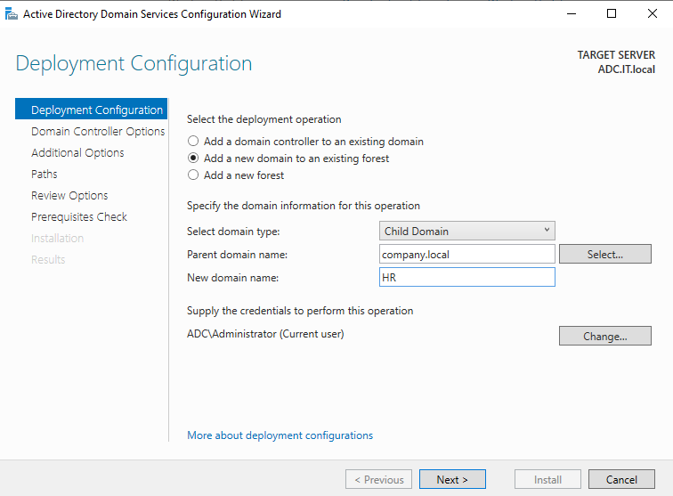
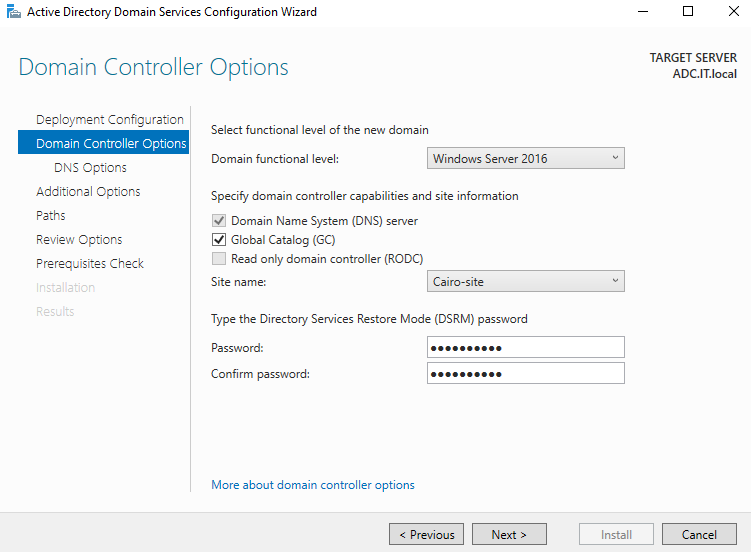
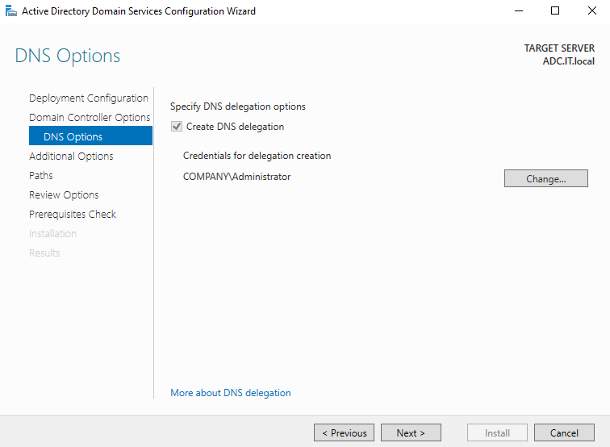
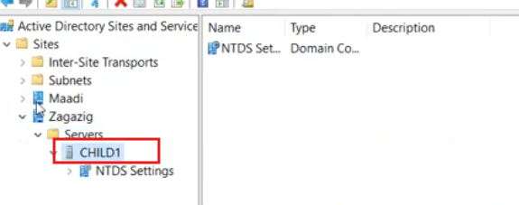
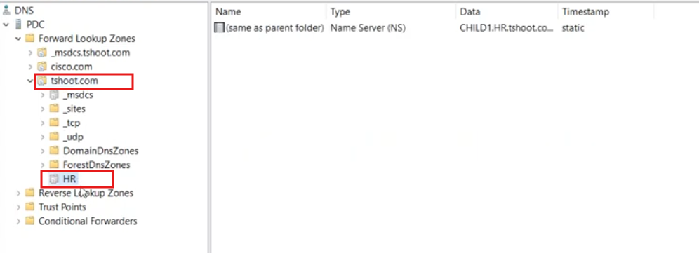
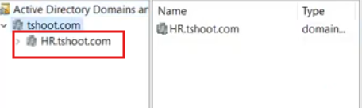
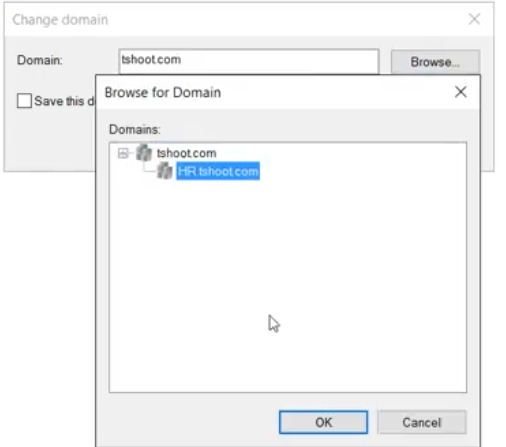

# Active Directory — Create a Child Domain (HR.company.local) Lab

## Overview

This lab demonstrates how to create a **Child Domain** (`HR.tshoot.com`) inside an existing Active Directory forest (`tshoot.com`). A child domain shares the parent's DNS namespace, automatically inherits a two-way transitive trust, and is managed as a separate administrative boundary within the same forest.

The lab covers the full promotion wizard, DNS delegation, site placement, trust verification, and cross-domain management from the parent DC.

---

## Lab Architecture

```
Forest: tshoot.com  (in screenshots) / company.local (in wizard)
│
├── tshoot.com / company.local    ← Root/Parent Domain
│         └── PDC  (parent DC, hosts DNS)
│
└── HR.tshoot.com / HR.company.local   ← New Child Domain
          └── CHILD1 / ADC.IT.local    ← First DC of child domain
```

> 📝 **Note on naming:** The promotion wizard screenshots show `company.local` / `ADC.IT.local` as the target server, while DNS Manager and Sites & Services screenshots show the fully deployed result using `tshoot.com` / `HR.tshoot.com` / `CHILD1`. Both represent the same lab steps — child domain creation inside an existing forest.

### Servers

| Server | Role |
|--------|------|
| `PDC` | Parent domain DC, DNS server for `tshoot.com` |
| `ADC.IT.local` / `CHILD1` | Target server being promoted as first DC of `HR` child domain |

---

## Prerequisites

- Parent domain (`company.local` or `tshoot.com`) already operational
- AD DS role installed on the target server (child DC)
- Target server joined to the parent domain as a member server
- **Enterprise Admin** credentials from the parent/root domain
- Network connectivity between parent DC and child DC
- Static IP and correct DNS settings on the child DC (pointing to parent DC's IP for DNS)

---

## Child Domain vs Tree Domain — Key Differences

| Feature | Child Domain | Tree Domain |
|---------|-------------|-------------|
| DNS Namespace | Subdomain of parent (`HR.company.local`) | Separate namespace (`IT.local`) |
| Example | `HR.company.local` | `IT.local` |
| Trust | Automatic two-way transitive | Automatic two-way transitive |
| Forest membership | Same forest | Same forest |
| Admin boundary | Separate | Separate |
| Credentials to create | Enterprise Admins | Enterprise Admins |

---

## Task 1 — Deployment Configuration: Create the Child Domain

This is the first and most critical step — configuring the AD DS Promotion Wizard to create a new **Child Domain** under the existing parent domain.

**Steps:**
1. On the target server (`ADC.IT.local`), open **Server Manager**
2. Click the notification flag → **Promote this server to a domain controller**
3. On the **Deployment Configuration** page, configure:

| Field | Value |
|-------|-------|
| Deployment operation | **Add a new domain to an existing forest** |
| Select domain type | **Child Domain** |
| Parent domain name | `company.local` |
| New domain name | `HR` |
| Credentials | `ADC\Administrator` → click **Change…** and supply `COMPANY\Administrator` |

4. The resulting **fully qualified domain name** will be: `HR.company.local`
5. Click **Next >**

**Screenshot:**



**Deployment options explained:**

| Option | Description |
|--------|-------------|
| Add a DC to an existing domain | Adds redundancy — same domain, new DC |
| **Add a new domain to an existing forest** ✅ | Creates a child or tree domain |
| Add a new forest | Completely new, independent forest |

**Domain type options:**

| Type | DNS Result | Use Case |
|------|-----------|----------|
| **Child Domain** ✅ | `HR.company.local` | Sub-department or regional division under parent |
| Tree Domain | `IT.local` | Separate organization with different DNS namespace |

> ⚠️ **Credentials requirement:** The current user `ADC\Administrator` is a local admin only. You **must** click **Change…** and supply `COMPANY\Administrator` (a member of **Enterprise Admins** in the parent domain). Without Enterprise Admin rights, the wizard cannot authorize the creation of a new domain in the forest.

> ℹ️ The **Parent domain name** field accepts the direct parent. For a deeply nested child like `west.hr.company.local`, the parent would be `hr.company.local`.

---

## Task 2 — Domain Controller Options: DNS, GC, Site, and DSRM Password

Configure the DC capabilities, site placement, and the critical DSRM recovery password for the new child domain's first DC.

**Steps:**
1. On the **Domain Controller Options** page, configure:

| Setting | Value | Reason |
|---------|-------|--------|
| Domain functional level | Windows Server 2016 | Minimum feature set for the new domain |
| DNS server | ✅ Enabled | Child DC will be authoritative DNS for `HR.company.local` |
| Global Catalog (GC) | ✅ Enabled | First DC in any domain must be a Global Catalog |
| Read Only DC (RODC) | ☐ Disabled | First DC must be writable |
| Site name | `Cairo-site` | Assigns this DC to the Cairo-site AD site |
| DSRM Password | Set strong password | Emergency recovery password for Directory Services Restore Mode |

2. Click **Next >**

**Screenshot:**



**DSRM Password — Critical Notes:**

> ⚠️ The **Directory Services Restore Mode (DSRM)** password is completely separate from the domain Administrator password. It is used to log in locally to the DC when Active Directory is stopped — for example, to restore AD from backup or repair the database. **Document this password securely** — it cannot be recovered if lost (though it can be reset using `ntdsutil`).

**Global Catalog requirement:**
> ℹ️ The first DC in any domain **must** be configured as a Global Catalog server. The GC stores a partial, read-only replica of all objects from every domain in the forest, enabling forest-wide searches and universal group membership resolution.

---

## Task 3 — DNS Options: Create DNS Delegation

The **DNS delegation** step ensures that the parent DNS server (`PDC`) knows to forward queries for `HR.company.local` to the new child DC's DNS server.

**Steps:**
1. On the **DNS Options** page:
   - ✅ Check **"Create DNS delegation"**
   - **Credentials for delegation creation:** `COMPANY\Administrator`
   - If the current credentials are insufficient, click **Change…** to supply `COMPANY\Administrator`
2. Click **Next >**

**Screenshot:**



**What does DNS delegation do?**

When a DNS client on the parent domain queries `HR.company.local`, the parent DNS server (`PDC`) needs to know which DNS server is authoritative for the `HR` subdomain. The delegation creates:

```
HR zone delegation in tshoot.com / company.local DNS:
  └── NS record: HR → CHILD1.HR.tshoot.com (child DC's IP)
  └── Glue A record: CHILD1.HR.tshoot.com → [child DC IP]
```

This allows seamless name resolution across the parent and child domains.

> ⚠️ If you skip DNS delegation, clients in the parent domain cannot resolve names in `HR.company.local` without additional manual DNS configuration (conditional forwarders or stub zones).

> ℹ️ The credentials used here must have permission to **write** to the parent DNS zone — `COMPANY\Administrator` (DNS Admin or Domain Admin in the parent) satisfies this requirement.

---

## Task 4 — Verify Site Placement in Active Directory Sites and Services

After promotion completes, verify that the new child DC (`CHILD1`) is correctly placed in the intended AD site.

**Steps:**
1. On the parent DC (`PDC`), open **Active Directory Sites and Services** (`dssite.msc`)
2. Expand **Sites → Zagazig → Servers**
3. Verify `CHILD1` appears under the **Zagazig** site's Servers container

**Screenshot:**



**Site topology visible:**

| Site | Servers |
|------|---------|
| Maadi | (other DCs) |
| **Zagazig** | **CHILD1** ← child domain DC |

> ℹ️ AD Sites map to physical network locations (office buildings, data centers, etc.). Placing CHILD1 in Zagazig means clients in subnets associated with Zagazig will preferentially authenticate to CHILD1 — optimizing login performance and reducing WAN traffic.

**NTDS Settings:**
The right pane shows `NTDS Settings` of type `Domain Controller`, confirming CHILD1 is a fully operational DC with replication connections established.

> 💡 If the DC lands in the wrong site (e.g., `Default-First-Site-Name`), move it via: right-click the server object in ADSS → **Move…** → select the correct site.

---

## Task 5 — Verify DNS Delegation in DNS Manager

Confirm that the DNS delegation record for `HR` was automatically created in the parent domain's DNS zone during promotion.

**Steps:**
1. On the parent DC (`PDC`), open **DNS Manager** (`dnsmgmt.msc`)
2. Expand **Forward Lookup Zones → tshoot.com**
3. Locate the **`HR`** delegation zone (highlighted in red)
4. Click on `HR` — the right pane shows the **NS (Name Server)** record

**Screenshot:**



**DNS delegation record details:**

| Field | Value | Meaning |
|-------|-------|---------|
| Name | (same as parent folder) | Delegation is in the `HR` subdomain |
| Type | Name Server (NS) | Points to the authoritative DNS server for `HR` |
| Data | `CHILD1.HR.tshoot.com` | The child DC's FQDN as the NS record |
| Timestamp | static | Manually/wizard-created (not dynamically registered) |

**DNS resolution flow after delegation:**

```
Client queries: server1.HR.tshoot.com
        ↓
Parent DNS (PDC, tshoot.com zone)
        ↓ Finds delegation: HR → CHILD1.HR.tshoot.com
        ↓
Child DNS (CHILD1, HR.tshoot.com zone)
        ↓ Returns: server1.HR.tshoot.com = [IP address]
        ↓
Client receives the answer ✅
```

> ℹ️ The `HR` entry in DNS Manager is a **delegation zone** (shown with a different icon than a standard zone). It does not contain records itself — it only points to the authoritative server for the subdomain.

---

## Task 6 — Verify Two-Way Trust in Active Directory Domains and Trusts

Confirm the automatic parent-child trust relationship is established and both domains are visible in the forest.

**Steps:**
1. On the parent DC, open **Active Directory Domains and Trusts** (`domain.msc`)
2. In the left pane, observe both domains listed under the forest

**Screenshot:**



**Domains visible:**

| Domain | Type | Role |
|--------|------|------|
| `tshoot.com` | domainDNS | Forest root / Parent domain |
| `HR.tshoot.com` | domain | **Child domain** (highlighted) |

**Trust relationship properties:**

| Property | Value |
|----------|-------|
| Trust type | Parent-Child |
| Direction | Two-way (bidirectional) |
| Transitivity | Transitive |
| Created by | Automatically during promotion |
| Authentication protocol | Kerberos v5 (NTLM fallback) |

**What two-way transitive trust means:**

```
tshoot.com  ←──────── two-way trust ────────→  HR.tshoot.com
     │                                                │
     │  Users from HR.tshoot.com can be              │
     │  granted access to tshoot.com resources       │
     │                                                │
     │  Users from tshoot.com can be granted         │
     └─ access to HR.tshoot.com resources ───────────┘
```

> ℹ️ Because the trust is **transitive**, if `tshoot.com` trusts another domain (e.g., `IT.tshoot.com`), then `HR.tshoot.com` also implicitly trusts `IT.tshoot.com` through the chain.

---

## Task 7 — Manage the Child Domain from the Parent DC

Demonstrate how an administrator on the parent DC can manage the child domain by switching the ADUC console context.

**Steps:**
1. On the parent DC (`PDC`), open **Active Directory Users and Computers** (`dsa.msc`)
2. Right-click **Active Directory Users and Computers** → **Change Domain…**
3. In the **Change Domain** dialog, click **Browse…**
4. In the **Browse for Domain** dialog, expand the forest tree:
   - `tshoot.com` (parent)
   - `HR.tshoot.com` (child) ← select this
5. Click **OK** twice
6. ADUC now displays the `HR.tshoot.com` domain objects

**Screenshot:**



**Browse for Domain tree visible:**

```
tshoot.com
└── HR.tshoot.com  ← selected (highlighted in blue)
```

> ℹ️ The **Browse for Domain** dialog shows the complete forest domain tree, making it easy to switch context between any domain in the forest without separate credentials (assuming you are logged in as an Enterprise Admin or have appropriate cross-domain permissions).

> 💡 **Alternatively**, connect directly by typing the domain name: in **Change Domain**, type `HR.tshoot.com` in the **Domain** field and click **OK**.

> 💡 For PowerShell management across domains:
> ```powershell
> # List all OUs in the child domain
> Get-ADOrganizationalUnit -Filter * -Server HR.tshoot.com
>
> # Create a user in the child domain
> New-ADUser -Name "John Doe" -SamAccountName "jdoe" -Server HR.tshoot.com
> ```

---

## Complete Lab Workflow Summary

```
Step 1: Run AD DS Promotion Wizard on child server
         → Add new domain to existing forest
         → Domain type: Child Domain
         → Parent: company.local  |  New domain name: HR
         → Result: HR.company.local
         → Credentials: COMPANY\Administrator (Enterprise Admin)
         ↓
Step 2: Domain Controller Options
         → DNS: ✅  GC: ✅  RODC: ☐
         → Site: Cairo-site / Zagazig
         → Set DSRM password
         ↓
Step 3: DNS Options
         → ✅ Create DNS delegation
         → Credentials: COMPANY\Administrator
         ↓
[Wizard completes — server restarts]
         ↓
Step 4: Verify in ADSS → Sites → Zagazig → Servers → CHILD1 ✅
         ↓
Step 5: Verify in DNS Manager → tshoot.com zone → HR delegation → NS = CHILD1 ✅
         ↓
Step 6: Verify in AD Domains and Trusts → HR.tshoot.com visible ✅
         ↓
Step 7: Manage child from parent → ADUC → Change Domain → Browse → HR.tshoot.com ✅
```

---

## Key Concepts Reference

| Concept | Explanation |
|---------|-------------|
| Child Domain | A domain whose DNS name is a subdomain of the parent (`HR.company.local`) |
| Parent-Child Trust | Automatic, two-way, transitive trust between parent and child domain |
| DNS Delegation | Record in parent DNS that points child subdomain queries to the child DNS server |
| Global Catalog | Forest-wide object index; first DC in any domain must be a GC |
| DSRM Password | Emergency local password for AD recovery mode — separate from domain admin |
| Enterprise Admins | Forest root group required to create child/tree domains |
| NetBIOS domain name | Short name (e.g., `HR`) used for pre-Windows 2000 authentication |
| Site | Physical network location grouping; controls replication scheduling and DC affinity |

---

## Verification Commands

```powershell
# Verify child domain info
Get-ADDomain -Identity HR.company.local

# Verify trust from parent
Get-ADTrust -Filter * -Server company.local

# Verify trust from child
Get-ADTrust -Filter * -Server HR.company.local

# List all domains in the forest
(Get-ADForest).Domains

# Verify DNS delegation on parent DNS
Resolve-DnsName -Name _ldap._tcp.HR.company.local -Type SRV -Server PDC

# Test trust authentication
nltest /sc_verify:company.local /server:CHILD1

# Force replication between parent and child
repadmin /syncall CHILD1 /AdeP

# Verify site assignment on child DC
nltest /dsgetsite
```

---

## Troubleshooting

| Issue | Cause | Solution |
|-------|-------|----------|
| Wizard fails: "Access denied" | Missing Enterprise Admin credentials | Click **Change…** → supply `COMPANY\Administrator` |
| DNS delegation not created | Credentials lacked DNS write permission | Manually create delegation in DNS Manager on parent DC |
| Child DC in wrong site | No subnet-to-site mapping for child DC's IP | Add subnet in ADSS or manually move DC to correct site |
| Can't resolve `HR.company.local` from parent | Delegation missing or NS record wrong | Check DNS Manager delegation; verify NS record points to child DC IP |
| Trust not visible | Replication delay or promotion incomplete | Wait or force replication: `repadmin /syncall /AdeP` |
| "The domain already exists" | Previous failed attempt left AD metadata | Run `ntdsutil` metadata cleanup on parent DC to remove orphaned child domain object |
| CHILD1 not visible in Browse for Domain | Replication not yet complete | Wait ~15 min or force replication; ensure GC is available |

---

## References

- [Microsoft Docs: Install a New Active Directory Child Domain](https://learn.microsoft.com/en-us/windows-server/identity/ad-ds/deploy/install-a-new-windows-server-2012-active-directory-child-or-tree-domain)
- [DNS Delegation overview](https://learn.microsoft.com/en-us/windows-server/networking/dns/deploy/dns-app-partitions)
- [Understanding Active Directory Trusts](https://learn.microsoft.com/en-us/windows-server/identity/ad-ds/plan/understanding-active-directory-replication)
- [Active Directory Sites and Services](https://learn.microsoft.com/en-us/windows-server/identity/ad-ds/get-started/replication/active-directory-replication-concepts)
