# Active Directory — DNS Stub Zone & External Trust Lab

## Overview

This lab covers two related but distinct topics that work together to enable cross-domain name resolution and authentication between **separate, unrelated forests**:

1. **DNS Stub Zone** — A lightweight DNS zone type that allows one domain's DNS server to locate the authoritative DNS servers for another domain, enabling name resolution between `tshoot.com` and `cisco.com`.

2. **External Trust** — A manually created, non-transitive trust between two domains in different forests, allowing users from one domain to authenticate in the other.

---

## Lab Architecture

```
Forest A:  tshoot.com          Forest B:  cisco.com
    │                               │
    └── PDC (DNS server)            └── newtree (DNS server)
        IP: 192.168.1.100               IP: 192.168.1.150

Goal:
  tshoot.com ←── External Trust (one-way incoming) ──→ cisco.com
  tshoot.com ←── Stub Zone ──────────────────────────→ cisco.com
```

### Servers

| Server | Domain | IP | Role |
|--------|--------|----|------|
| PDC | `tshoot.com` | 192.168.1.100 | DNS server, DC for tshoot.com |
| newtree | `cisco.com` | 192.168.1.150 | DNS server, DC for cisco.com |

---

## Part 1 — DNS Stub Zone

A **Stub Zone** contains only the minimum DNS records needed to locate the authoritative name servers for another zone — specifically: SOA, NS, and glue A records. It is not a full copy of the zone, and the server hosting it is **not authoritative** for that zone.

### Why Use a Stub Zone?

| Method | Pros | Cons |
|--------|------|------|
| **Stub Zone** | Lightweight, auto-updates NS records | Not authoritative, depends on master |
| Secondary Zone | Full copy, authoritative backup | Heavy, large zones = high overhead |
| Conditional Forwarder | Simple, easy to configure | Static IPs, doesn't auto-update |
| Root Hints | Default for internet resolution | Doesn't work for private internal zones |

> ℹ️ Stub zones are ideal for **cross-forest name resolution** in trusted environments where you want the local DNS to always know the current NS records for the remote zone, without maintaining a full copy.

---

### Task 1 — Create a Stub Zone (Zone Type Selection)

**Steps:**
1. On `PDC` (`tshoot.com` DNS server), open **DNS Manager** (`dnsmgmt.msc`)
2. Right-click **Forward Lookup Zones** → **New Zone…**
3. On the **Zone Type** page, select **Stub zone**
4. Ensure **"Store the zone in Active Directory"** is checked (AD-integrated stub zone)
5. Click **Next >**

**Screenshot:**

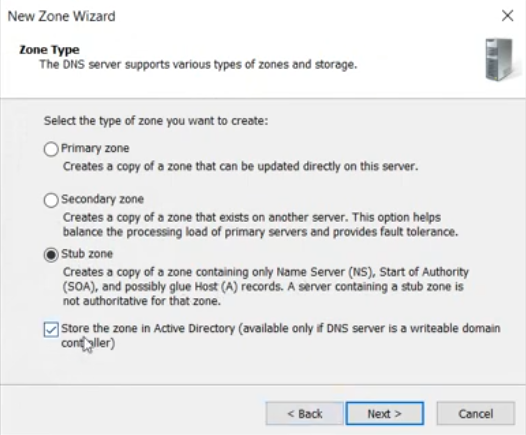

**Zone type comparison:**

| Zone Type | Description | Authoritative? |
|-----------|-------------|---------------|
| Primary zone | Writable master copy | ✅ Yes |
| Secondary zone | Read-only copy from primary | ✅ Yes |
| **Stub zone** ✅ | SOA + NS + glue A records only | ❌ No |

**AD-integrated stub zone benefits:**
- Zone data stored in Active Directory (replicated automatically to all DCs)
- No need for manual zone transfers
- Replication scope controls which DCs receive the zone

> ℹ️ If the DNS server is **not** a domain controller, the AD-integrated option is greyed out and you must use a file-backed stub zone.

---

### Task 2 — Set the Zone Replication Scope

**Steps:**
1. On the **Active Directory Zone Replication Scope** page, select the replication scope
2. Selected: **"To all DNS servers running on domain controllers in this domain: tshoot.com"**
3. Click **Next >**

**Screenshot:**

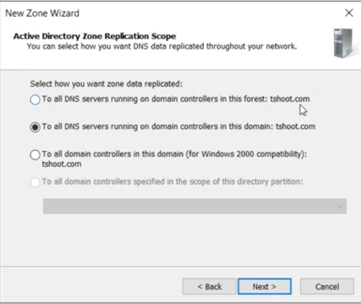

**Replication scope options:**

| Option | Partition Used | Scope |
|--------|---------------|-------|
| To all DNS servers in this forest | ForestDnsZones | All DNS-enabled DCs in forest |
| **To all DNS servers in this domain** ✅ | DomainDnsZones | All DNS-enabled DCs in `tshoot.com` |
| To all DCs in this domain (Win2000 compat) | Domain partition | All DCs regardless of DNS role |
| Custom directory partition | Custom | Specific subset of DCs |

> ℹ️ Choosing domain-wide scope means the stub zone replicates to all DNS-enabled DCs in `tshoot.com` — ensuring every DC can resolve `cisco.com` names.

---

### Task 3 — Set the Zone Name (tshoot.com Stub)

**Steps:**
1. On the **Zone Name** page, enter the name of the zone this stub will represent
2. Zone name: `tshoot.com`
3. Click **Next >**

**Screenshot:**

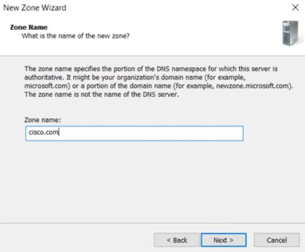

> ℹ️ **Important:** The zone name is the **remote domain's DNS name** — the domain whose NS records you want to locate. In this step, we are creating the stub for `tshoot.com` on the **other side's DNS server**. The zone name tells DNS which namespace this stub represents.

---

### Task 4 — Specify the Master DNS Server IP

**Steps:**
1. On the **Master DNS Servers** page, add the IP address of the **authoritative DNS server** for the stub zone
2. Enter: `192.168.1.150` (newtree — cisco.com's DNS server)
3. Click **Next >** then **Finish**

**Screenshot:**

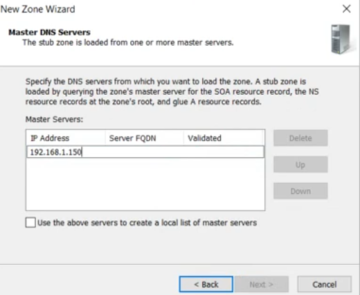

**How the stub zone loads:**

```
PDC (stub zone for cisco.com)
    ↓  Queries master server: 192.168.1.150
    ↓  Downloads: SOA record
    ↓  Downloads: NS record(s) for cisco.com
    ↓  Downloads: Glue A record(s) for NS servers
    ✅  Stub zone populated — PDC now knows where to direct cisco.com queries
```

> ⚠️ The master server IP must be reachable from PDC on **UDP/TCP port 53**. If the master is behind a firewall, open DNS ports before creating the stub zone. If validation fails (Server FQDN column blank), the zone still saves but won't load until connectivity is established.

---

### Task 5 — Verify tshoot.com Stub Zone Records

After the stub zone is created and loaded, verify the records that were pulled from the master server.

**Screenshot:**

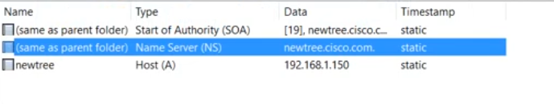

**Records in the stub zone:**

| Name | Type | Data | Timestamp |
|------|------|------|-----------|
| (same as parent folder) | Start of Authority (SOA) | [34], pdc.tshoot.com | static |
| (same as parent folder) | Name Server (NS) | pdc.tshoot.com | static |
| pdc | Host (A) | 192.168.1.100 | static |

**What each record means:**

| Record | Purpose |
|--------|---------|
| SOA | Identifies the primary authoritative server for the zone (`pdc.tshoot.com`) and zone serial number [34] |
| NS | Lists the name server(s) responsible for `tshoot.com` — `pdc.tshoot.com` |
| A (glue) | Provides the IP address of the NS server — `192.168.1.100` — so DNS can actually reach it |

> ✅ These three record types are all a stub zone ever contains. When a DNS client queries the stub zone's host for a `tshoot.com` name, the server returns a **referral** pointing the client to `pdc.tshoot.com` at `192.168.1.100`.

---

### Task 6 — Repeat Stub Zone Creation for cisco.com (Other Side)

Create a **reciprocal stub zone** for `cisco.com` on PDC (`tshoot.com` side), so PDC can resolve names in `cisco.com` by referring queries to `newtree` at `192.168.1.150`.

**Steps:**
1. On PDC's DNS Manager, repeat Tasks 1–4 with:
   - Zone type: Stub zone (AD-integrated)
   - Zone name: `cisco.com`
   - Master server IP: `192.168.1.150`

**Screenshot — Zone Name (cisco.com):**

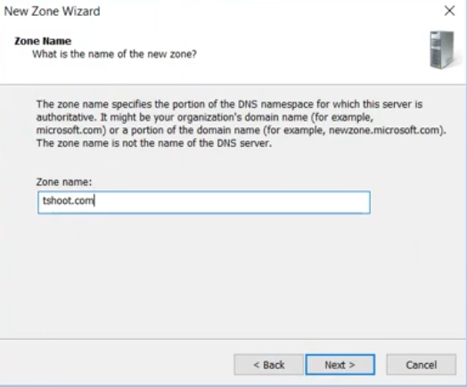

**Screenshot — cisco.com Stub Zone Records:**

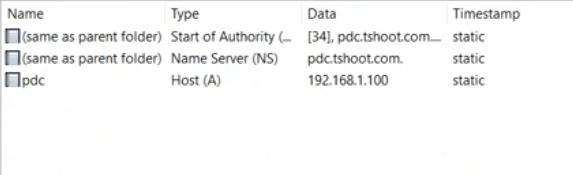

**Records in the cisco.com stub zone:**

| Name | Type | Data | Timestamp |
|------|------|------|-----------|
| (same as parent folder) | Start of Authority (SOA) | [19], newtree.cisco.com | static |
| (same as parent folder) | Name Server (NS) | newtree.cisco.com | static |
| newtree | Host (A) | 192.168.1.150 | static |

> ✅ After both stub zones are in place, DNS resolution works in **both directions**:
> - PDC can resolve `*.cisco.com` by referring queries to `newtree` (192.168.1.150)
> - newtree can resolve `*.tshoot.com` by referring queries to PDC (192.168.1.100)

---

## Part 2 — External Trust

With DNS resolution working between the two forests, the next step is to create an **External Trust** so that users from `cisco.com` can authenticate to resources in `tshoot.com` (or vice versa).

### Trust Types Overview

| Trust Type | Scope | Transitivity | Use Case |
|------------|-------|-------------|----------|
| **External** ✅ | Two specific domains | Non-transitive | Between domains in different forests |
| Forest | Two entire forests | Transitive | All domains in both forests |
| Shortcut | Two domains in same forest | Transitive | Speed up auth in large forests |
| Realm | AD ↔ non-Windows Kerberos | Configurable | Unix/Linux Kerberos integration |

---

### Task 7 — Enter the Trust Name (Target Domain)

**Steps:**
1. On PDC, open **Active Directory Domains and Trusts** (`domain.msc`)
2. Right-click `tshoot.com` → **Properties → Trusts tab → New Trust…**
3. On the **Trust Name** page, enter the DNS name of the domain to trust
4. Name: `cisco.com`
5. Click **Next >**

**Screenshot:**

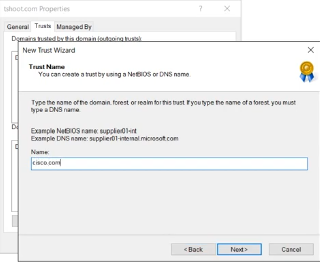

> ℹ️ For an **External trust**, use the **DNS name** of the target domain (`cisco.com`). For a Forest trust, you must also use a DNS name. NetBIOS names (like `CISCO`) work for External trusts with older domains but DNS names are preferred.

---

### Task 8 — Select Trust Type: External Trust

**Steps:**
1. On the **Trust Type** page, select **External trust**
2. Read the descriptions:
   - **External trust** = Non-transitive, between two specific domains
   - **Forest trust** = Transitive, covers all domains in both forests
3. Click **Next >**

**Screenshot:**

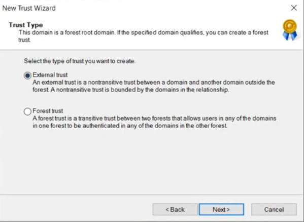

**External trust selected because:**
- `cisco.com` is a **separate forest** — only specific domains need to trust each other
- Non-transitive = trust does NOT extend to child domains of `cisco.com`
- More secure for inter-company scenarios — limits blast radius

> ℹ️ **Forest trust** would be appropriate if you want ALL domains in both forests to trust each other (e.g., a company merger). External trust is the right choice here since only specific domains need the relationship.

---

### Task 9 — Direction of Trust: One-Way Incoming

**Steps:**
1. On the **Direction of Trust** page, select **One-way: incoming**
2. Click **Next >**

**Screenshot:**

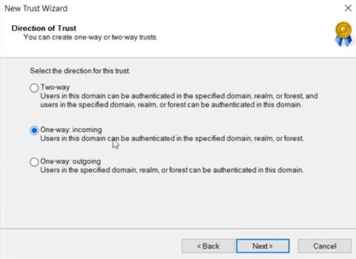

**Trust direction options:**

| Option | Meaning | Who authenticates where |
|--------|---------|------------------------|
| Two-way | Both domains trust each other | Users from either domain can access resources in the other |
| **One-way: incoming** ✅ | Remote domain trusts this domain | Users in **tshoot.com** can authenticate in **cisco.com** |
| One-way: outgoing | This domain trusts the remote domain | Users in **cisco.com** can authenticate in **tshoot.com** |

**Terminology clarification:**

```
"Incoming" trust = tshoot.com is the TRUSTED domain
                   cisco.com is the TRUSTING domain
                   → cisco.com trusts users from tshoot.com
                   → tshoot.com users can log in to cisco.com resources
```

> ⚠️ Trust direction is one of the most commonly confused concepts. Remember: **incoming** = authentication traffic flows **into** this domain from the other. The "incoming" side is the **trusted** domain (user accounts live here).

---

### Task 10 — Sides of Trust: This Domain Only

**Steps:**
1. On the **Sides of Trust** page, select **"This domain only"**
2. Click **Next >**

**Screenshot:**

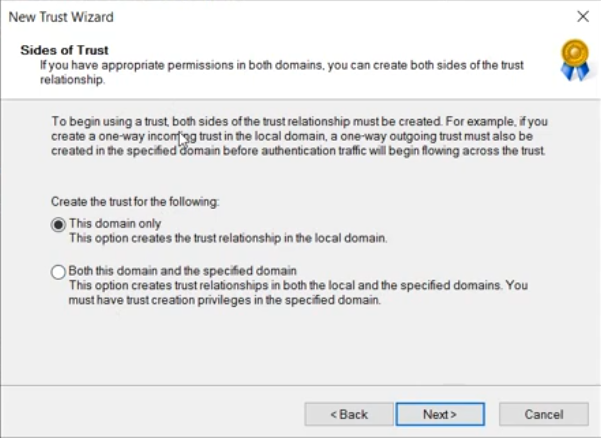

**Options explained:**

| Option | Requirement | Effect |
|--------|-------------|--------|
| **This domain only** ✅ | Admin credentials for local domain only | Creates trust object in `tshoot.com` only. Must manually create the matching outgoing trust in `cisco.com`. |
| Both this domain and the specified domain | Admin credentials for **both** domains | Creates trust objects in both domains simultaneously in one wizard run |

> ℹ️ Selecting "This domain only" is used when:
> - You don't have admin credentials for the other domain during this session
> - The other domain admin will create the matching trust on their side separately
> - You want to audit/review before the trust becomes fully operational

> 💡 For a **one-way incoming** trust to work, the other domain (`cisco.com`) must create a matching **one-way outgoing** trust pointing back to `tshoot.com`. Without both sides, authentication will fail.

---

### Task 11 — Authentication Credentials for cisco.com

**Steps:**
1. On the **User Name and Password** page, provide admin credentials for `cisco.com`
2. User name: `administrator`
3. Password: (cisco.com admin password)
4. Click **Next >**

**Screenshot:**

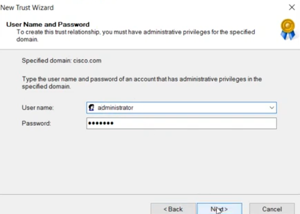

> ℹ️ These credentials authenticate against `cisco.com` to verify the target domain exists and to optionally create the trust on that side. The account must be a **Domain Admin** (or Enterprise Admin) in `cisco.com`.

> ⚠️ If you selected "This domain only" in Task 10, this page may be skipped or used only to validate the remote domain's existence. If you selected "Both domains", these credentials are used to create the trust object in `cisco.com`.

---

### Task 12 — Authentication Level: Domain-Wide vs Selective

**Steps:**
1. On the **Outgoing Trust Authentication Level — Local Domain** page, choose authentication scope
2. Selected: **Domain-wide authentication**
3. Click **Next >**

**Screenshot:**

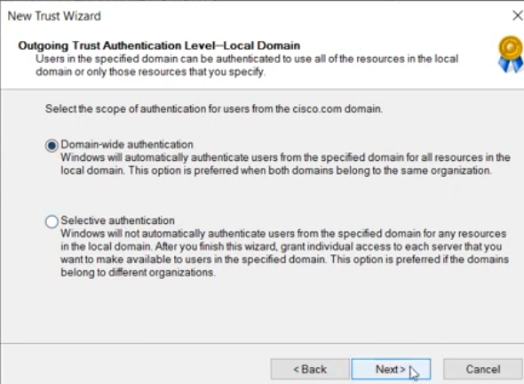

**Authentication scope options:**

| Option | Behavior | Best For |
|--------|----------|----------|
| **Domain-wide authentication** ✅ | Windows automatically authenticates users from `cisco.com` for **all** resources in `tshoot.com` | Same organization, highly trusted partner |
| Selective authentication | Users from `cisco.com` are NOT automatically authenticated. You must manually grant "Allowed to Authenticate" permission on each server/resource | Different organizations, limited access |

> ℹ️ **Domain-wide authentication** is easier to manage but grants broad access. **Selective authentication** is more secure for cross-company scenarios — it requires you to explicitly grant `Allowed to Authenticate` on the computer object of each server you want `cisco.com` users to access.

---

### Task 13 — Verify Completed Trust

After completing the wizard, verify the trust relationship is created correctly.

**Steps:**
1. In **Active Directory Domains and Trusts**, right-click `tshoot.com` → **Properties → Trusts tab**
2. Verify the trust appears in both sections

**Screenshot:**

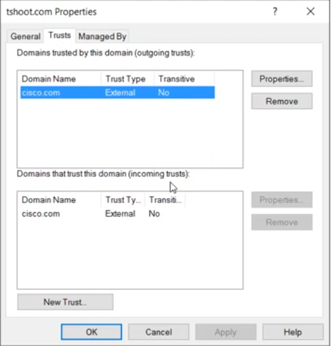

**Trust properties visible:**

**Outgoing Trusts (Domains trusted by tshoot.com):**

| Domain Name | Trust Type | Transitive |
|-------------|-----------|-----------|
| cisco.com | External | No |

**Incoming Trusts (Domains that trust tshoot.com):**

| Domain Name | Trust Type | Transitive |
|-------------|-----------|-----------|
| cisco.com | External | No |

> ✅ Both outgoing and incoming entries for `cisco.com` appear, confirming a **two-sided** trust is in place. The trust type is **External** and **non-transitive** (No) — as expected.

> 💡 To verify the trust is actually functional (not just created), click **Properties** on the trust entry and click **Validate** — this performs a live authentication test across the trust.

---

## Complete Lab Workflow Summary

```
PART 1 — DNS Stub Zones
════════════════════════
Step 1: DNS Manager → New Zone → Zone Type: Stub Zone (AD-integrated)
         ↓
Step 2: Replication Scope: To all DNS servers in this domain (tshoot.com)
         ↓
Step 3: Zone Name: tshoot.com
         ↓
Step 4: Master DNS Server IP: 192.168.1.150 (newtree/cisco.com DNS)
         ↓
Step 5: Verify SOA + NS + glue A records loaded from master ✅
         ↓
Step 6: Repeat for cisco.com stub zone:
         Zone name: cisco.com | Master: 192.168.1.150
         Verify records: newtree.cisco.com NS + 192.168.1.150 A ✅

PART 2 — External Trust
════════════════════════
Step 7:  AD Domains and Trusts → tshoot.com Properties
          → New Trust → Name: cisco.com
         ↓
Step 8:  Trust Type: External trust (non-transitive)
         ↓
Step 9:  Direction: One-way: incoming
         ↓
Step 10: Sides: This domain only
         ↓
Step 11: Credentials for cisco.com: administrator / password
         ↓
Step 12: Auth level: Domain-wide authentication
         ↓
Step 13: Verify: cisco.com appears in both Outgoing and Incoming trust lists ✅
```

---

## Key Concepts Reference

| Concept | Detail |
|---------|--------|
| Stub Zone | DNS zone containing only SOA, NS, and glue A records; not authoritative |
| Master Server | The authoritative DNS server the stub zone pulls records from |
| External Trust | Non-transitive trust between two domains in different forests |
| Forest Trust | Transitive trust covering all domains in both forests |
| One-way incoming | This domain is trusted; remote domain's users can access local resources |
| Non-transitive | Trust does not extend to child domains of either domain |
| Domain-wide auth | All resources in local domain auto-authenticate remote users |
| Selective auth | Only explicitly permitted servers authenticate remote users |
| Glue record | A record for an NS server — needed when NS is inside the same zone |

---

## Verification Commands

```powershell
# Verify trust from tshoot.com side
Get-ADTrust -Filter * -Server tshoot.com

# Test trust authentication (nltest)
nltest /sc_verify:cisco.com

# Query stub zone NS records
Resolve-DnsName -Name cisco.com -Type NS -Server 192.168.1.100

# Test cross-domain name resolution
nslookup newtree.cisco.com 192.168.1.100

# Verify stub zone loaded on PDC
Get-DnsServerZone -Name cisco.com -ComputerName PDC

# Check trust via netdom
netdom trust tshoot.com /domain:cisco.com /verify
```

---

## Troubleshooting

| Issue | Cause | Solution |
|-------|-------|----------|
| Stub zone shows no records | Master server unreachable (port 53) | Open UDP/TCP 53 between PDC and master server; check firewall |
| Name resolution fails across domains | Stub zone exists but master IP wrong | Verify master server IP; check NS record data points to correct IP |
| Trust creation fails — "Domain not found" | DNS can't resolve `cisco.com` | Create stub zone for `cisco.com` BEFORE creating the trust |
| Trust shows as broken/invalid | Matching trust not created on cisco.com side | Create outgoing trust on cisco.com pointing to tshoot.com |
| Authentication fails despite trust | Selective auth blocking access | Switch to Domain-wide auth, or grant "Allowed to Authenticate" on target servers |
| Non-transitive trust not extending to child | Expected behavior — External trust is non-transitive | Create separate External trust with each child domain needed, or use Forest trust |
| Stub zone not replicating to other DCs | Wrong replication scope | Recreate with correct scope (domain or forest) |

---

## References

- [Microsoft Docs: Understanding Stub Zones](https://learn.microsoft.com/en-us/windows-server/networking/dns/dns-stub-zones)
- [Microsoft Docs: Forest and External Trusts](https://learn.microsoft.com/en-us/windows-server/identity/ad-ds/plan/understanding-active-directory-replication#trust-relationships)
- [Trust Technical Reference](https://learn.microsoft.com/en-us/previous-versions/windows/it-pro/windows-server-2003/cc736874(v=ws.10))
- [Selective Authentication](https://learn.microsoft.com/en-us/previous-versions/windows/it-pro/windows-server-2003/cc755844(v=ws.10))
