# Windows Server — Storage Spaces, Storage Pools & Virtual Disks Lab

## Overview

This lab covers **Windows Server Storage Spaces** — a software-defined storage technology built into Windows Server that allows you to group physical disks into a **Storage Pool**, then carve out **Virtual Disks** with resiliency layouts (Simple, Mirror, Parity), and finally create **Volumes** on top. The lab also demonstrates hot spare configuration, disk failure simulation, and automatic rebuild.

---

## Key Concepts

| Term | Definition |
|------|-----------|
| **Storage Pool** | A group of physical disks combined into a single manageable unit |
| **Virtual Disk** | A logical disk created from pool capacity, with a chosen resiliency layout |
| **Volume** | A formatted partition created on a virtual disk, assigned a drive letter |
| **Simple** | Striping across disks — no resiliency, maximum performance/capacity |
| **Mirror** | Data written to 2+ disks simultaneously — survives 1 disk failure (2-way) or 2 failures (3-way) |
| **Parity** | Like RAID 5 — uses parity data to survive 1 disk failure with less overhead than Mirror |
| **Thin provisioning** | Virtual disk reports a larger size than actually allocated — space used on demand |
| **Fixed provisioning** | All space reserved upfront at creation time |
| **Hot Spare** | A standby disk in the pool that automatically replaces a failed disk |
| **Enclosure Awareness** | Distributes mirror copies across separate physical enclosures (JBODs) |

---

## Lab Environment

| Component | Detail |
|-----------|--------|
| Server | PDC16 (Windows Server 2022) |
| Physical Disks | 3 × 60 GB VMware Virtual Disks (NVMe + SAS) |
| Bus Types | NVMe (Disk 0), SAS (Disk 1), SAS (Disk 2) |
| Total Pool Capacity | 180 GB |
| Tool | Server Manager → File and Storage Services |

---

## Task 1 — View Physical Disks in Server Manager

Before creating a storage pool, review the available physical disks on the server.

**Steps:**
1. Open **Server Manager**
2. Click **File and Storage Services** in the left pane
3. Click **Volumes → Disks**
4. Observe all disks attached to PDC16

**Screenshot:**

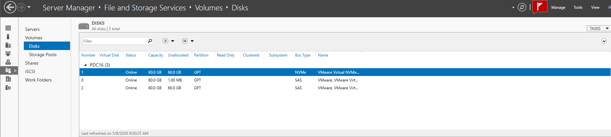

**Disks visible on PDC16:**

| Disk # | Virtual Disk | Status | Capacity | Unallocated | Partition | Bus Type | Name |
|--------|-------------|--------|----------|-------------|-----------|----------|------|
| 1 | — | Online | 60.0 GB | 60.0 GB | GPT | NVMe | VMware Virtual NVMe |
| 0 | — | Online | 60.0 GB | 1.00 MB | GPT | SAS | VMware Virtual S |
| 2 | — | Online | 60.0 GB | 60.0 GB | GPT | SAS | VMware Virtual S |

> ℹ️ **Disk 0** has only 1 MB unallocated — it is the OS disk (C: drive). **Disks 1 and 2** are completely free and will be used for the storage pool. The NVMe disk is faster than SAS — useful for storage tiers.

> ℹ️ All disks show **GPT** partition style — required for disks larger than 2 TB and for UEFI boot. Storage Spaces works with both MBR and GPT disks, but GPT is recommended.

---

## Task 2 — View Existing Volumes

Review the current volumes on the server before any changes.

**Steps:**
1. In **Server Manager → File and Storage Services**
2. Click **Volumes**
3. Observe the volumes listed for PDC16

**Screenshot:**

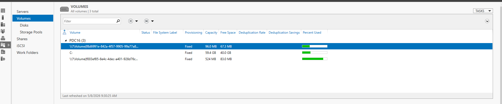

**Volumes on PDC16:**

| Volume | Provisioning | Capacity | Free Space | % Used |
|--------|-------------|----------|-----------|--------|
| System (EFI) | Fixed | 96.0 MB | 67.3 MB | Low |
| C: (OS) | Fixed | 59.4 GB | 40.0 GB | ~33% |
| Recovery | Fixed | 524 MB | 83.0 MB | ~84% |

> ℹ️ These are the three standard volumes created during Windows Server installation: the EFI System Partition, the OS volume (C:), and the Windows Recovery Environment (WinRE) partition. The storage pool and new virtual disk volumes will appear here after creation.

---

## Task 3 — Create a New Storage Pool with a Hot Spare

Create a storage pool from the available physical disks, designating one disk as a **Hot Spare** for automatic failover.

**Steps:**
1. In **Server Manager → File and Storage Services → Storage Pools**
2. Click **TASKS → New Storage Pool…**
3. **Storage Pool Name:** `Pool1` (or any descriptive name)
4. **Physical Disks page** — select the disks and configure allocation:

| Disk | Capacity | Bus | Allocation |
|------|----------|-----|-----------|
| VMware Virtual NVMe | 60.0 GB | NV | **Automatic** |
| VMware, VMware Virtual S | 60.0 GB | SAS | **Automatic** |
| VMware, VMware Virtual S | 60.0 GB | SAS | **Hot Spare** ← |

5. Total selected capacity: **180 GB**
6. Click **Next → Create**

**Screenshot:**

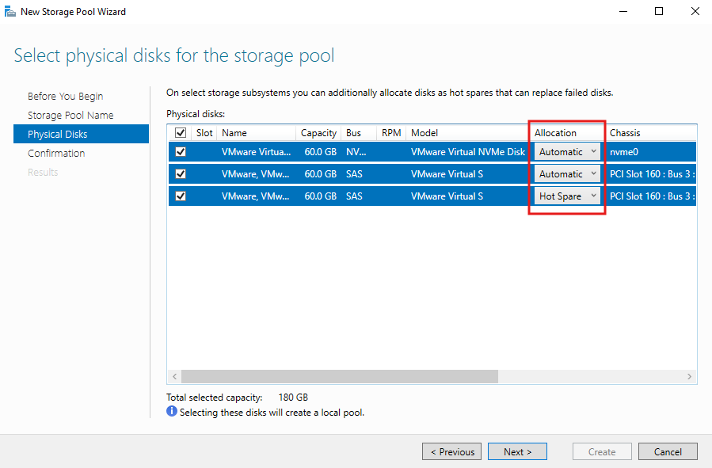

**Allocation types explained:**

| Allocation | Meaning |
|-----------|---------|
| **Automatic** | Disk participates normally in the pool for data storage |
| **Hot Spare** | Disk is reserved and idle; automatically replaces a failed Automatic disk |
| Manual | Disk is in the pool but only used when explicitly assigned |

> ℹ️ **Hot Spare requirements:** The hot spare disk must be at least as large as the largest disk in the pool. When an Automatic disk fails, Windows Storage Spaces automatically starts rebuilding onto the hot spare — no administrator intervention needed.

> ⚠️ After creating the pool, only **120 GB** is usable for virtual disks (2 × 60 GB Automatic). The third 60 GB disk is reserved as a hot spare.

---

## Task 4 — Create a New Virtual Disk (Name)

Create a Virtual Disk inside the storage pool. This is the logical disk that will carry the resiliency layout.

**Steps:**
1. After the storage pool is created, the wizard offers to create a virtual disk — click **Yes**, or:
2. In **Storage Pools**, select `Pool1` → **TASKS → New Virtual Disk…**
3. On the **Virtual Disk Name** page:
   - **Name:** `Disk0`
   - Description: (optional)
   - ☐ Create storage tiers on this virtual disk (leave unchecked for this lab)

**Screenshot:**

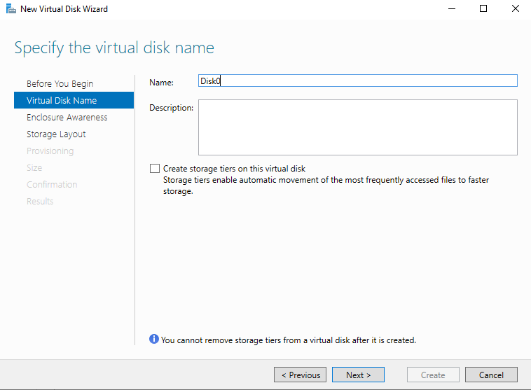

> ℹ️ **Storage Tiers** (unchecked here) would automatically move hot data to faster disks (NVMe) and cold data to slower disks (SAS). Once a virtual disk is created with/without tiers, this setting **cannot be changed** — plan carefully.

> 💡 Use a descriptive name like `Mirror-Data` or `Parity-Archive` to identify the disk's purpose and layout at a glance.

---

## Task 5 — Enclosure Awareness

Configure whether data copies are distributed across separate physical enclosures.

**Steps:**
1. On the **Enclosure Awareness** page:
   - ☐ **Enable enclosure awareness** — leave **unchecked** for this lab (only one enclosure/chassis)
2. Click **Next >**

**Screenshot:**

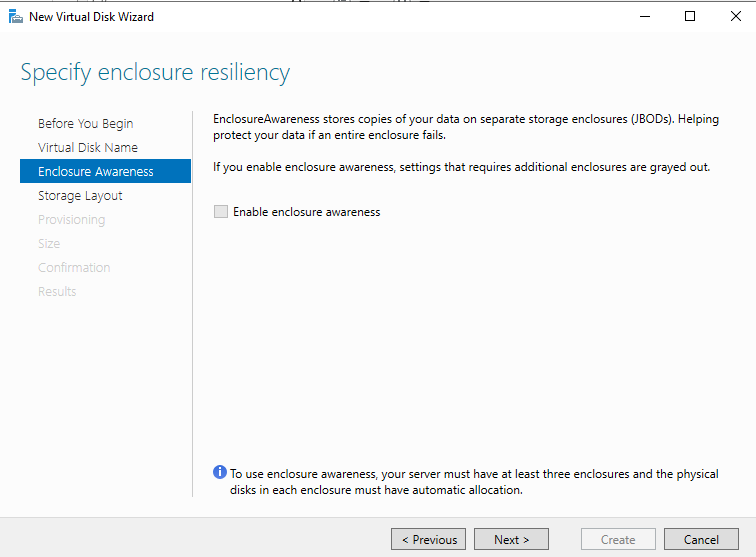

**Enclosure Awareness explained:**

| Setting | Requirement | Effect |
|---------|-------------|--------|
| Disabled (default) | No requirement | Mirror copies may land on disks in the same physical enclosure |
| **Enabled** | ≥ 3 separate JBODs/enclosures with auto-allocated disks | Each mirror copy stored on a disk in a **different** enclosure — survives entire enclosure failure |

> ⚠️ The note at the bottom states: *"To use enclosure awareness, your server must have at least three enclosures and the physical disks in each enclosure must have automatic allocation."* Since our lab uses a single VMware host, this is greyed out/skipped.

---

## Task 6 — Select Storage Layout (Mirror)

Choose the resiliency layout for the virtual disk.

**Steps:**
1. On the **Storage Layout** page, select **Mirror**
2. Read the description and click **Next >**

**Screenshot:**

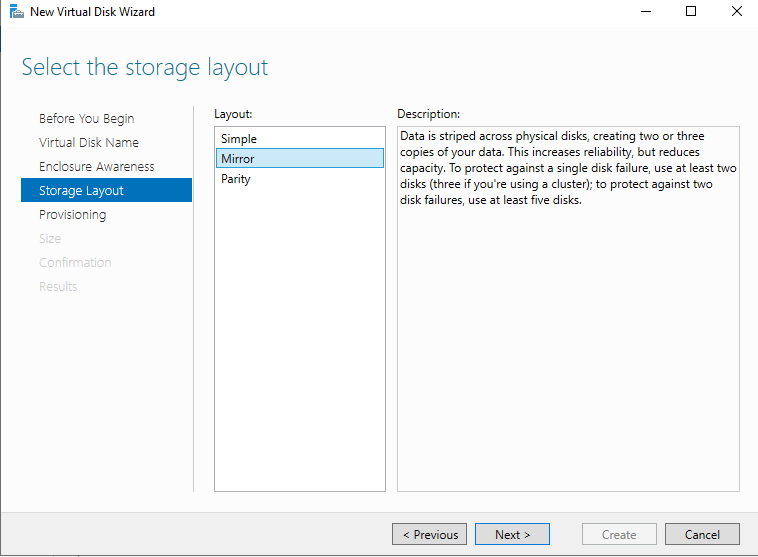

**Storage Layout comparison:**

| Layout | Min Disks | Resiliency | Capacity Efficiency | Use Case |
|--------|-----------|-----------|-------------------|----------|
| **Simple** | 1 | None (like RAID 0) | 100% | Temp data, scratch space |
| **Mirror** ✅ | 2 (2-way) / 5 (3-way) | 1 or 2 disk failures | ~50% (2-way) / ~33% (3-way) | Critical data, OS disks |
| **Parity** | 3 | 1 disk failure | ~67% | Archive, large sequential data |

> ℹ️ **Mirror selected** here: Data is striped AND mirrored — written to at least 2 disks simultaneously. If one disk fails, all data is available from the other. The pool has 2 automatic disks (120 GB total), so usable Mirror capacity is ~58 GB.

> ℹ️ Mirror also provides better **read performance** because data can be read from either copy simultaneously — effectively doubling read throughput.

---

## Task 7 — Provisioning Type (Thin vs Fixed/Thick)

Choose how storage space is allocated to the virtual disk.

**Steps:**
1. On the **Provisioning** page, choose the type:
   - **Thin** — Space allocated on demand as data is written
   - **Fixed (Thick)** — All space reserved immediately at creation

**Screenshot:**

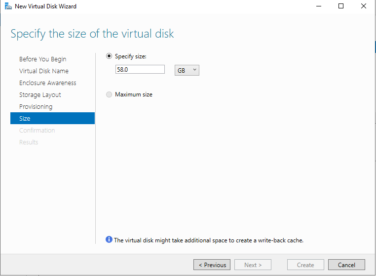

**Provisioning type comparison:**

| Type | Space Reserved | Flexibility | Risk |
|------|---------------|-------------|------|
| **Thin** | On demand | Can over-provision (create VDs larger than pool) | Pool can run out of space unexpectedly |
| **Fixed (Thick)** | Immediately | Predictable — no surprises | Less flexible, wastes space if VD not fully used |

> ⚠️ **Thin provisioning risk:** You can create a 200 GB thin virtual disk in a 120 GB pool. The disk will work fine until 120 GB of actual data is written — at which point the pool runs out of space. Always monitor pool utilization with thin provisioning.

> 💡 For production environments with predictable storage needs, **Fixed** provisioning is safer. For lab or dev environments, **Thin** is more flexible.

---

## Task 8 — Specify Virtual Disk Size

Set the size of the virtual disk being created.

**Steps:**
1. On the **Size** page, select **Specify size**
2. Enter: `58.0 GB`
3. Click **Next → Create**

**Screenshot:**


> ℹ️ The maximum usable Mirror capacity from 2 × 60 GB automatic disks is ~58–59 GB (accounting for pool overhead and write-back cache). Selecting **Maximum size** would use all remaining pool capacity.

> ℹ️ *"The virtual disk might take additional space to create a write-back cache."* Windows Storage Spaces reserves a small amount of space (typically 1 GB) as a write-back cache to improve write performance. This is why the actual usable space is slightly less than half the raw pool capacity.

---

## Task 9 — Create a New Volume (Select Server and Disk)

After the virtual disk is created, create a volume on it using the New Volume Wizard.

**Steps:**
1. The New Volume Wizard launches automatically after virtual disk creation, or:
   Right-click the virtual disk → **New Volume…**
2. On the **Server and Disk** page:
   - **Server:** PDC16 (Online, Not Clustered)
   - **Disk:** Select **Disk 4** — Virtual Disk: `Disk0`, Capacity: 58.0 GB, Subsystem: Windows Storage
3. Click **Next >**

**Screenshot:**

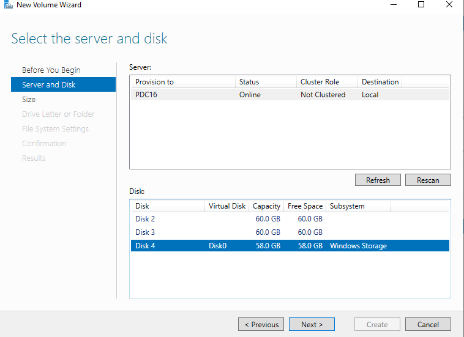

**Disks visible:**

| Disk | Virtual Disk | Capacity | Subsystem | Select? |
|------|-------------|----------|-----------|---------|
| Disk 2 | — | 60.0 GB | — | Physical disk |
| Disk 3 | — | 60.0 GB | — | Physical disk |
| **Disk 4** | **Disk0** | **58.0 GB** | **Windows Storage** | ✅ **Selected** |

> ℹ️ Disks 2 and 3 are the raw physical disks in the pool. **Disk 4** is the virtual disk (`Disk0`) created from the pool — this is what we format as a volume.

---

## Task 10 — Specify Volume Size

Define how much of the virtual disk to use for this volume.

**Steps:**
1. On the **Size** page:
   - Available capacity: **58.0 GB**
   - Minimum size: 8.00 MB
   - Volume size: **10 GB**
2. Click **Next >**

**Screenshot:**

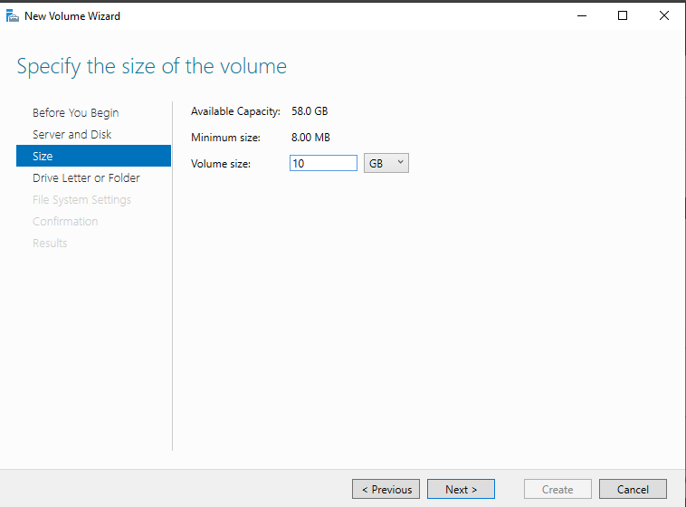

> ℹ️ You don't have to use the entire virtual disk for one volume. Here, 10 GB is carved out, leaving 47.98 GB as unallocated space on the virtual disk for future volumes. This is visible in the Disk Management screenshot (Task 13).

---

## Task 11 — Assign Drive Letter

Assign a drive letter to the new volume so it appears in Windows Explorer.

**Steps:**
1. On the **Drive Letter or Folder** page:
   - ● **Drive letter:** `E:`
   - ○ The following folder: (mount as a folder path instead)
   - ○ Don't assign (access via volume GUID path only)
2. Click **Next >**

**Screenshot:**

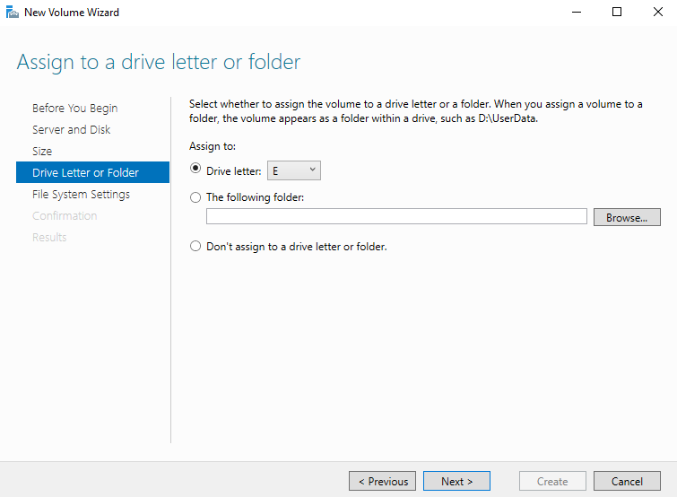

**Assignment options:**

| Option | Use Case |
|--------|---------|
| **Drive letter (E:)** ✅ | Standard — appears in This PC as a named drive |
| Folder path (e.g., `D:\Data\Archive`) | Mount as a subfolder inside another volume — useful when running out of drive letters |
| Don't assign | Access via `\\?\Volume{GUID}\` — for automated/special use only |

---

## Task 12 — Select File System Settings

Format the volume with a file system and assign a label.

**Steps:**
1. On the **File System Settings** page:
   - **File system:** `NTFS`
   - **Allocation unit size:** `Default`
   - **Volume label:** `New Volume` (rename to something descriptive like `Data` or `Storage`)
   - ☐ Generate short file names (not recommended — leave unchecked)
2. Click **Next → Create**

**Screenshot:**

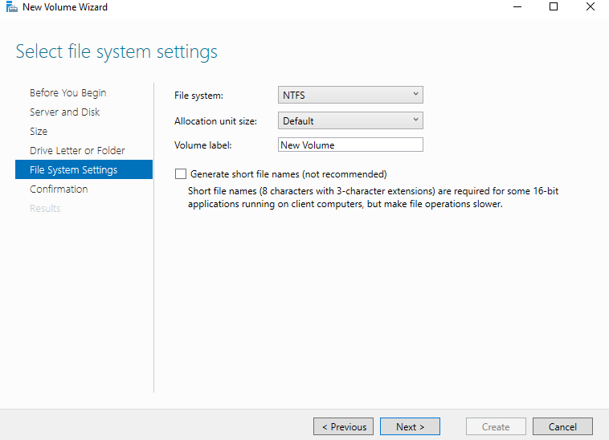

**File system options:**

| File System | Max File Size | Max Volume Size | Use Case |
|-------------|--------------|----------------|---------|
| **NTFS** ✅ | 16 TB | 256 TB | Windows servers, all workloads |
| ReFS | 16 EB | 1 YB | Large file repositories, Hyper-V VHDs |
| FAT32 | 4 GB | 8 TB | USB drives, compatibility |

**Allocation unit size:**

| Size | Best For |
|------|---------|
| Default (4 KB) | General purpose — balanced fragmentation vs overhead |
| 64 KB | Large sequential files (video, VHDs, databases) |
| 512 B | Many small files (source code, logs) |

> ℹ️ **Short file names** (8.3 format) are a legacy feature for 16-bit DOS/Windows 3.x compatibility. Enabling it slows file operations — leave disabled on modern servers.

---

## Task 13 — Verify Volume in Disk Management

Confirm the new volume appears correctly in Windows Disk Management.

**Steps:**
1. Open **Disk Management** (`diskmgmt.msc`)
2. Locate **Disk 4** (the virtual disk from the storage pool)
3. Observe the partition layout

**Screenshot:**

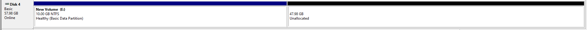

**Disk 4 layout:**

| Partition | Drive Letter | File System | Size | Status |
|-----------|-------------|-------------|------|--------|
| New Volume | E: | NTFS | 10.00 GB | Healthy (Basic Data Partition) |
| Unallocated | — | — | 47.98 GB | Available for more volumes |

> ✅ The 10 GB volume (E:) is healthy and formatted. The remaining 47.98 GB is unallocated — you can create additional volumes from this space at any time by right-clicking the unallocated region → **New Simple Volume**.

---

## Task 14 — Simulate Disk Failure: Damaged Disk with Warning

Observe what happens when one of the physical disks in the pool fails or shows a fault.

**Steps:**
1. In **Server Manager → Storage Pools → Physical Disks**
2. Observe the disk status warning (yellow triangle ⚠️)

**Screenshot:**

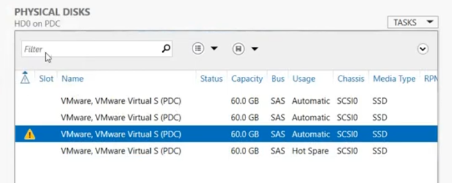

**Physical disk status visible:**

| Disk | Status | Capacity | Bus | Usage | Chassis | Media Type |
|------|--------|----------|-----|-------|---------|-----------|
| VMware Virtual S (PDC) | ✅ OK | 60.0 GB | SAS | Automatic | SCSI0 | SSD |
| VMware Virtual S (PDC) | ✅ OK | 60.0 GB | SAS | Automatic | SCSI0 | SSD |
| **VMware Virtual S (PDC)** | **⚠️ Warning** | **60.0 GB** | **SAS** | **Automatic** | **SCSI0** | **SSD** |
| VMware Virtual S (PDC) | ✅ OK | 60.0 GB | SAS | **Hot Spare** | SCSI0 | SSD |

> ⚠️ The warning triangle on the third disk indicates a detected fault (physical errors, predictive failure, or communication issues). The **Hot Spare** disk (bottom row) is standing by, ready to take over.

**What happens next (automatic):**
```
1. Storage Spaces detects the fault/failure on the Automatic disk
2. Storage Spaces begins automatic rebuild onto the Hot Spare disk
3. Hot Spare disk changes from "Hot Spare" → "Automatic" usage
4. Rebuild completes — Mirror is restored to healthy state
5. Failed disk can be replaced; new disk becomes the new Hot Spare
```

> ℹ️ During rebuild, the virtual disk status shows **"Degraded"** but remains accessible — data is still available from the surviving mirror copy. Rebuild speed depends on the amount of data written.

---

## Task 15 — Hot Spare Activates After Disk Repair/Replacement

After the damaged disk is repaired or replaced, the hot spare automatically integrates and the pool returns to a healthy state.

**Steps:**
1. After replacing the failed disk (or removing the fault):
2. In **Server Manager → Storage Pools → Physical Disks**
3. The repaired/new disk can be set back to **Automatic**; the former hot spare remains as a hot spare or is set back

**Screenshot:**

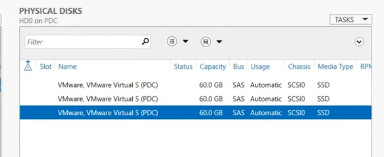

**Physical disk status after recovery:**

| Disk | Status | Usage |
|------|--------|-------|
| VMware Virtual S (PDC) | ✅ OK | Automatic |
| VMware Virtual S (PDC) | ✅ OK | Automatic |
| VMware Virtual S (PDC) | ✅ OK | **Automatic** ← was Hot Spare, now active |

> ✅ The pool is now healthy with 3 Automatic disks. To re-establish hot spare protection after replacing the failed disk, add the new disk to the pool and set its allocation to **Hot Spare**.

```powershell
# Add new physical disk to pool as Hot Spare
Add-PhysicalDisk -StoragePoolFriendlyName "Pool1" `
    -PhysicalDisks (Get-PhysicalDisk -FriendlyName "VMware*" | Where-Object CanPool -eq $true) `
    -Usage HotSpare
```

---

## Complete Lab Workflow Summary

```
Step 1:  View physical disks → 3 × 60 GB (NVMe + 2× SAS) on PDC16
          ↓
Step 2:  View existing volumes → System EFI, C: (59 GB), Recovery
          ↓
Step 3:  New Storage Pool
          → Pool1: 2× Automatic + 1× Hot Spare = 180 GB total
          ↓
Step 4:  New Virtual Disk Wizard
          → Name: Disk0
          → No storage tiers
          ↓
Step 5:  Enclosure Awareness → Disabled (single chassis)
          ↓
Step 6:  Storage Layout → Mirror (2-way, survives 1 disk failure)
          ↓
Step 7:  Provisioning → Thin or Fixed
          ↓
Step 8:  Size → 58.0 GB
          ↓
Step 9:  New Volume → Select Disk 4 (Disk0 virtual disk)
          ↓
Step 10: Volume size → 10 GB (47.98 GB unallocated remains)
          ↓
Step 11: Drive letter → E:
          ↓
Step 12: File system → NTFS, Default allocation, label "New Volume"
          ↓
Step 13: Verify in Disk Management → E: 10 GB Healthy ✅
          ↓
Step 14: Disk failure simulation → ⚠️ Warning on Automatic disk
          → Hot Spare stands by for automatic rebuild
          ↓
Step 15: After repair → Hot Spare activates, pool returns to healthy ✅
```

---

## Storage Spaces Capacity Planning

| Pool Config | Layout | Usable Capacity |
|-------------|--------|-----------------|
| 2 × 60 GB | Mirror (2-way) | ~58 GB |
| 3 × 60 GB | Mirror (3-way) | ~56 GB |
| 3 × 60 GB | Parity | ~116 GB |
| 3 × 60 GB | Simple (no resiliency) | ~180 GB |
| 2 × 60 GB Automatic + 1 × 60 GB Hot Spare | Mirror | ~58 GB usable + 1 spare |

---

## PowerShell Reference

```powershell
# View available physical disks for pooling
Get-PhysicalDisk | Where-Object CanPool -eq $True

# Create storage pool
New-StoragePool -FriendlyName "Pool1" -StorageSubsystemFriendlyName "Windows Storage*" `
    -PhysicalDisks (Get-PhysicalDisk -CanPool $True)

# Set one disk as hot spare
Set-PhysicalDisk -FriendlyName "VMware Virtual S" -Usage HotSpare

# Create virtual disk (Mirror, Fixed)
New-VirtualDisk -StoragePoolFriendlyName "Pool1" -FriendlyName "Disk0" `
    -ResiliencySettingName Mirror -Size 58GB -ProvisioningType Fixed

# Initialize and create volume
Initialize-Disk -Number 4 -PartitionStyle GPT
New-Partition -DiskNumber 4 -Size 10GB -DriveLetter E
Format-Volume -DriveLetter E -FileSystem NTFS -NewFileSystemLabel "Data" -Confirm:$false

# Check pool health
Get-StoragePool -FriendlyName "Pool1" | Select FriendlyName, HealthStatus, OperationalStatus

# Check virtual disk health
Get-VirtualDisk | Select FriendlyName, HealthStatus, OperationalStatus, ResiliencySettingName

# Check physical disk status
Get-PhysicalDisk | Select FriendlyName, HealthStatus, OperationalStatus, Usage

# Repair a degraded virtual disk
Repair-VirtualDisk -FriendlyName "Disk0"
```

---

## Troubleshooting

| Issue | Cause | Solution |
|-------|-------|----------|
| Pool creation fails | Disks already have partitions | Clean disks first: `Clear-Disk -Number X -RemoveData -Confirm:$false` |
| Virtual disk shows Degraded | One physical disk failed/removed | Check physical disk health; replace failed disk; `Repair-VirtualDisk` |
| Volume not visible after creation | Disk not initialized or offline | Check Disk Management; bring disk Online; Initialize if needed |
| Hot spare not activating | Spare too small | Hot spare must be ≥ size of largest disk in pool |
| Enclosure awareness grayed out | Only one JBOD/chassis | Need ≥ 3 separate enclosures with auto-allocated disks |
| Mirror has less capacity than expected | Write-back cache overhead | Normal — ~1 GB reserved for cache; use Maximum size if needed |
| Pool degraded after reboot | Disk not reconnecting | Check physical connections; rescan disks in Server Manager |
| Storage Spaces not available | Role not installed | `Install-WindowsFeature File-Services` |

---

## References

- [Microsoft Docs: Storage Spaces Overview](https://learn.microsoft.com/en-us/windows-server/storage/storage-spaces/overview)
- [Storage Spaces Design Guide](https://learn.microsoft.com/en-us/windows-server/storage/storage-spaces/storage-spaces-design-guide)
- [New-VirtualDisk PowerShell](https://learn.microsoft.com/en-us/powershell/module/storage/new-virtualdisk)
- [Storage Pool and Virtual Disk Cmdlets](https://learn.microsoft.com/en-us/powershell/module/storage)
- [Repair-VirtualDisk](https://learn.microsoft.com/en-us/powershell/module/storage/repair-virtualdisk)
