# Windows Server — Storage Tiers, Virtual Memory & Mixed-Media Storage Pools Lab

## Overview

This lab covers **Windows Server Storage Tiers** — an advanced Storage Spaces feature that automatically moves the most frequently accessed (hot) data to faster SSD storage and less-accessed (cold) data to slower HDD storage. The lab also covers **Virtual Memory (Page File)** management and the PowerShell-based workflow for building and managing mixed-media storage pools.

---

## Key Concepts

| Term | Definition |
|------|-----------|
| **Storage Tiers** | Automatic data placement: hot data → SSD (Faster Tier), cold data → HDD (Standard Tier) |
| **Faster Tier** | SSD-backed tier within the virtual disk — handles frequently accessed data |
| **Standard Tier** | HDD-backed tier within the virtual disk — handles infrequently accessed data |
| **Tier Optimization** | Scheduled defrag process (`defrag -c -h -g`) that moves data between tiers |
| **Page File (pagefile.sys)** | Windows virtual memory file on disk — extends RAM when physical memory is full |
| **Mixed-media pool** | A storage pool containing both SSD and HDD disks — required for Storage Tiers |
| **MediaType** | The disk type property (SSD/HDD) Storage Spaces uses to assign disks to tiers |
| **Primordial pool** | The unallocated pool that holds all available but unassigned physical disks |

---

## Lab Environment

| Component | Detail |
|-----------|--------|
| Server | PDC16 (Windows Server 2022) |
| Physical Disks | 1 × NVMe SSD (60 GB) + 3 × SAS HDD (60 GB each) |
| Total Raw Capacity | 240 GB |
| Pool Name | HD-Pool |
| Tool | Server Manager + PowerShell |

---

## Task 1 — View C: Drive Contents and Unhide System Files

Before working with storage, explore the system drive and make hidden/system files visible.

**Steps:**
1. Open **File Explorer** → navigate to `C:\`
2. Click **View → Options → Change folder and search options**
3. On the **View** tab:
   - Select **"Show hidden files, folders, and drives"**
   - **Uncheck** `"Hide protected operating system files (Recommended)"`
   - Click **Apply to Folders → OK**

**Screenshot:**

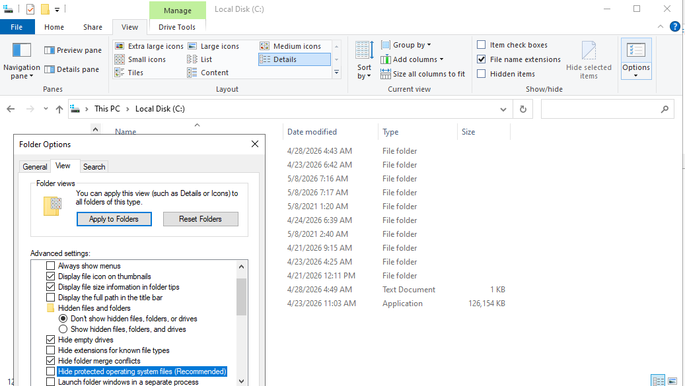

**Why unhide system files?**
You can now see files like `pagefile.sys`, `hiberfil.sys`, `$Recycle.Bin`, `System Volume Information`, and `Documents and Settings` — all critical OS files normally hidden from users.

> ⚠️ These files are hidden by default to prevent accidental deletion. Do not delete or modify `pagefile.sys`, `hiberfil.sys`, or `$Recycle.Bin`.

---

## Task 2 — View the Page File (pagefile.sys)

With system files visible, locate and examine `pagefile.sys` — Windows virtual memory.

**Steps:**
1. In File Explorer, navigate to `C:\`
2. Locate `pagefile.sys` (highlighted in red box in the screenshot)

**Screenshot:**

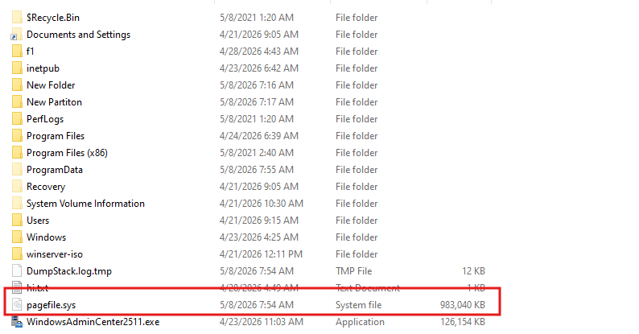

**pagefile.sys details:**

| Property | Value |
|----------|-------|
| File name | `pagefile.sys` |
| Size | **983,040 KB** (~960 MB) |
| Type | System file |
| Location | `C:\` |
| Date modified | 5/8/2026 7:54 AM |

**Other hidden system files visible on C:\:**

| File/Folder | Purpose |
|------------|---------|
| `$Recycle.Bin` | Recycle Bin storage |
| `Documents and Settings` | Legacy junction point (compatibility) |
| `ProgramData` | Application data for all users |
| `System Volume Information` | System restore points, VSS metadata |
| `Recovery` | WinRE recovery environment files |

> ℹ️ **pagefile.sys** is Windows' virtual memory paging file. When physical RAM is exhausted, Windows swaps the least-used memory pages to this file on disk. Reading/writing to the page file is slower than RAM — reducing page file usage by adding more RAM improves performance.

---

## Task 3 — View and Configure Virtual Memory Settings

Examine the current virtual memory configuration and understand how to change it.

**Steps:**
1. Right-click **This PC → Properties → Advanced system settings**
2. On the **Advanced** tab → **Performance → Settings…**
3. Click the **Advanced** tab in Performance Options
4. Under **Virtual memory**, click **Change…**

**Screenshot:**

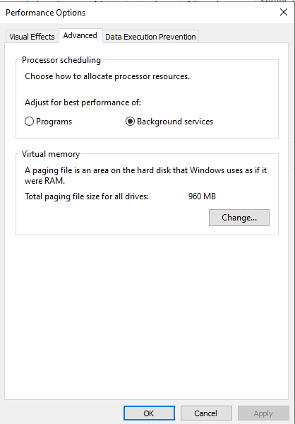

**Current virtual memory configuration:**

| Setting | Value |
|---------|-------|
| Processor scheduling | Background services (optimized for server workloads) |
| Total paging file size | **960 MB** (across all drives) |

**Virtual Memory settings in the Change dialog:**

| Option | Description |
|--------|-------------|
| Automatically manage paging file size for all drives | Windows manages size dynamically (default) |
| Custom size | Set Initial and Maximum size manually |
| System managed size | Windows controls it per-drive |
| No paging file | Disables virtual memory on that drive (not recommended) |

**Best practices for virtual memory on servers:**

| Scenario | Recommendation |
|----------|---------------|
| Plenty of RAM (>= 16 GB) | Let Windows manage automatically |
| Memory dumps needed | Set minimum = RAM size on system drive |
| High I/O server | Move page file to a separate fast disk/SSD |
| Storage Spaces with tiers | Page file benefits from Faster Tier SSD placement |

> ℹ️ **Processor scheduling set to "Background services"** is the correct setting for Windows Server — it allocates CPU time equally to all processes rather than prioritizing the foreground application (which would be the "Programs" setting used on desktops).

---

## Task 4 — View Physical Disks in Primordial Pool (Server Manager)

Before creating the storage pool, review all available physical disks from the Server Manager GUI.

**Steps:**
1. Open **Server Manager → File and Storage Services → Storage Pools**
2. Under **Physical Disks**, look at the **Primordial** pool (all unassigned disks)

**Screenshot:**

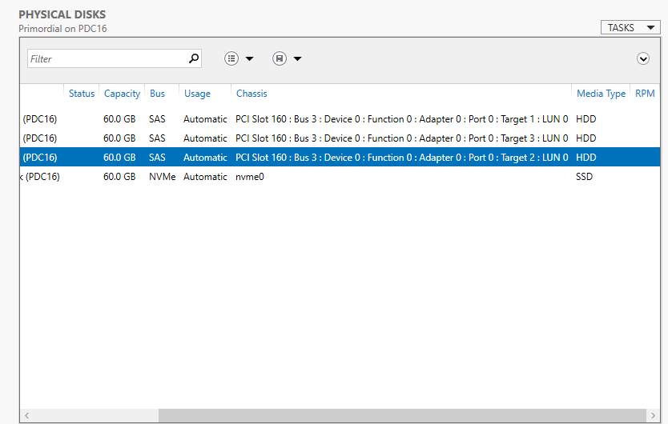

**Physical disks visible in Primordial pool on PDC16:**

| Disk | Status | Capacity | Bus | Usage | Chassis | Media Type |
|------|--------|----------|-----|-------|---------|-----------|
| VMware Virtual S | — | 60.0 GB | SAS | Automatic | PCI Slot 160 | HDD |
| VMware Virtual S | — | 60.0 GB | SAS | Automatic | PCI Slot 160 | HDD |
| VMware Virtual S | — | 60.0 GB | SAS | Automatic | PCI Slot 160 | HDD |
| VMware Virtual NVMe | — | 60.0 GB | NVMe | Automatic | nvme0 | **SSD** |

> ℹ️ The **NVMe disk** shows `Media Type: SSD` — this is critical for Storage Tiers. Windows uses the MediaType property to assign disks to the Faster Tier (SSD) or Standard Tier (HDD) automatically.

> ℹ️ All disks show **CanPool: True** (when viewed via PowerShell) — they are unformatted and available to be added to a storage pool.

---

## Task 5 — Create the Storage Pool (GUI)

Create a new storage pool named `HD-Pool` using all four available physical disks.

**Steps:**
1. In **Server Manager → Storage Pools**, click **TASKS → New Storage Pool…**
2. **Storage Pool Name:** `HD-Pool`
3. **Physical Disks page** — select all 4 disks:

| Disk | Allocation | Media Type |
|------|-----------|-----------|
| NVMe Disk | **Automatic** | SSD |
| VMware Virtual S (Target 3) | **Automatic** | HDD |
| VMware Virtual S (Target 1) | **Automatic** | HDD |
| VMware Virtual S (Target 2) | **Automatic** | HDD |

4. Total selected capacity: **240 GB**
5. Click **Next → Create**

**Screenshot:**


> ℹ️ All 4 disks are set to **Automatic** allocation — they all participate in storing data. The NVMe SSD will become the **Faster Tier** and the 3 SAS HDDs will form the **Standard Tier** when Storage Tiers are enabled.

> 💡 To designate a disk as a Hot Spare instead of Automatic, change its Allocation dropdown to `Hot Spare`. A hot spare does not contribute to storage tiers but provides automatic failover.

---

## Task 6 — Manage the Pool via PowerShell

Use PowerShell cmdlets to inspect and manage the storage pool and its physical disks.

**Screenshot:**

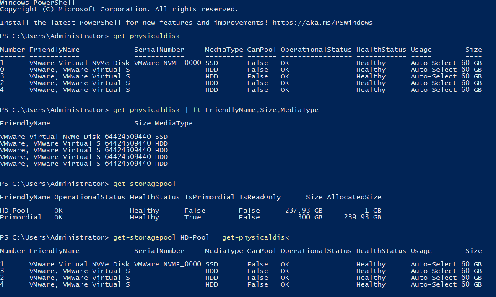

**Commands demonstrated:**

### List all physical disks

```powershell
Get-PhysicalDisk
```

Output shows all 5 disks (disk 0 = OS disk):

| # | Friendly Name | Media Type | CanPool | Status | Size |
|---|--------------|-----------|---------|--------|------|
| 1 | VMware Virtual NVMe Disk | SSD | False | OK | 60 GB |
| 0 | VMware, VMware Virtual S | HDD | False | OK | 60 GB |
| 3 | VMware, VMware Virtual S | HDD | False | OK | 60 GB |
| 2 | VMware, VMware Virtual S | HDD | False | OK | 60 GB |
| 4 | VMware, VMware Virtual S | HDD | False | OK | 60 GB |

> ℹ️ `CanPool: False` after pool creation means the disks are already in a pool.

### Format disk output (FriendlyName, Size, MediaType)

```powershell
Get-PhysicalDisk | ft FriendlyName, Size, MediaType
```

### List all storage pools

```powershell
Get-StoragePool
```

| FriendlyName | Status | Health | IsPrimordial | Size | AllocatedSize |
|-------------|--------|--------|-------------|------|--------------|
| HD-Pool | OK | Healthy | False | 237.93 GB | 1 GB |
| Primordial | OK | Healthy | True | 300 GB | 239.93 GB |

> ℹ️ **HD-Pool** is 237.93 GB (slightly less than 240 GB raw due to pool metadata overhead). The **Primordial pool** at 300 GB represents ALL raw disk capacity (including the OS disk).

### List physical disks in a specific pool

```powershell
Get-StoragePool HD-Pool | Get-PhysicalDisk
```

Shows the 4 disks assigned to HD-Pool.

---

## Task 7 — Change HDD MediaType to SSD via PowerShell

For Storage Tiers to work, Windows must correctly identify which disks are SSD and which are HDD. In virtual environments (VMware), SAS virtual disks may report as `HDD` even if backed by SSD storage. This command corrects the MediaType.

**Screenshot:**

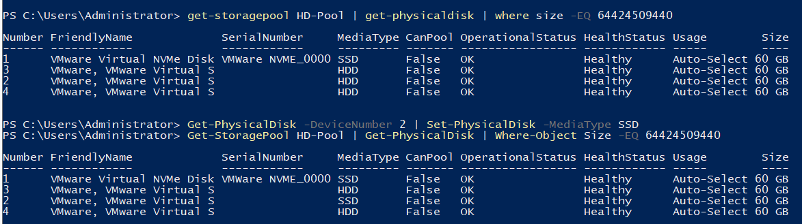

**Steps:**

### Step 1 — Find disks needing MediaType correction

```powershell
Get-StoragePool HD-Pool | Get-PhysicalDisk | Where-Object Size -EQ 64424509440
```

Shows all 4 disks in the pool with their current MediaType.

### Step 2 — Change specific disk from HDD to SSD

```powershell
Get-PhysicalDisk -DeviceNumber 2 | Set-PhysicalDisk -MediaType SSD
```

Changes device number 2 from **HDD → SSD**.

### Step 3 — Verify the change

```powershell
Get-StoragePool HD-Pool | Get-PhysicalDisk | Where-Object Size -EQ 64424509440
```

**Before:**
- Disk 1 (NVMe): SSD
- Disks 0, 3, 2, 4: HDD

**After (Disk 2 changed):**
- Disk 1 (NVMe): SSD
- Disk 2: **SSD** ← changed
- Disks 0, 3, 4: HDD

> ⚠️ Only change MediaType if you **know** the physical backing is SSD. Changing HDD to SSD when the disk is physically spinning causes Storage Spaces to route data incorrectly — hot data will still land on slow spinning storage.

> 💡 In a production environment with real SSDs, the MediaType is detected automatically. This override is primarily needed in virtual environments (VMware, Hyper-V) where guest OS cannot distinguish SSD from HDD backing.

```powershell
# Check all disk MediaTypes in the pool
Get-StoragePool "HD-Pool" | Get-PhysicalDisk | Select FriendlyName, MediaType, Size
```

---

## Task 8 — Create Virtual Disk with Storage Tiers Enabled

Create a new virtual disk with the **"Create storage tiers"** option checked to enable automatic hot/cold data tiering.

**Steps:**
1. In **Storage Pools**, select `HD-Pool` → **TASKS → New Virtual Disk…**
2. On the **Virtual Disk Name** page:
   - **Name:** `DISK0`
   - ✅ **Check "Create storage tiers on this virtual disk"**
   - Note: *"You cannot remove storage tiers from a virtual disk after it is created"*
3. Click **Next >**

**Screenshot:**

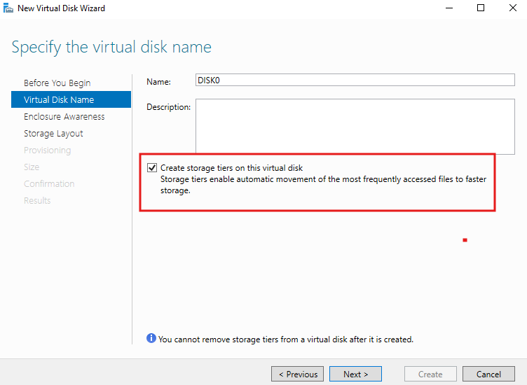

> ⚠️ **Storage tiers are permanent.** Once created with tiers, you cannot remove them without deleting and recreating the virtual disk. Make this decision carefully.

**Requirements for Storage Tiers:**
- Pool must contain **at least one SSD** and **at least one HDD** with correctly set MediaType
- Provisioning type must be **Fixed** (not Thin)
- Layout must be **Simple** or **Mirror** (not Parity)

---

## Task 9 — Storage Layout for Tiered Disks (Simple or Mirror Only)

With Storage Tiers enabled, only **Simple** and **Mirror** layouts are available. **Parity is not supported** for tiered virtual disks.

**Steps:**
1. On the **Storage Layout** page, select the desired layout
2. Only `Simple` and `Mirror` are shown — Parity is absent

**Screenshot:**

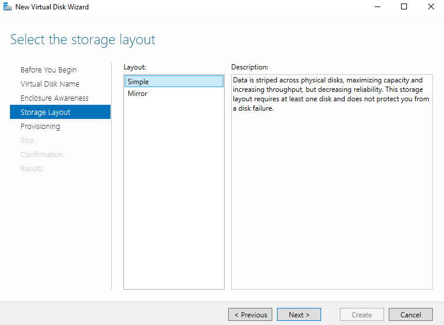

**Layout options with Storage Tiers:**

| Layout | Available with Tiers? | Min Disks | Resiliency |
|--------|--------------------|-----------|-----------|
| **Simple** ✅ | Yes | 1 | None (RAID 0-like) |
| **Mirror** ✅ | Yes | 2 | 1 disk failure |
| Parity | ❌ No | 3 | 1 disk failure |

> ℹ️ Parity is excluded from tiered virtual disks because the tier optimization process (moving data between tiers) is incompatible with parity calculation overhead. Microsoft explicitly unsupported this combination.

> 💡 For most tiered deployments: use **Mirror** for resiliency, **Simple** only for dev/test or where data loss from a single disk failure is acceptable.

---

## Task 10 — Provisioning: Fixed Required for Storage Tiers

With Storage Tiers enabled, only **Fixed provisioning** is available. Thin provisioning is grayed out.

**Steps:**
1. On the **Provisioning** page:
   - **Thin** — greyed out / unavailable
   - ✅ **Fixed** — selected automatically
   - Note: *"Storage tiers require fixed provisioning."*
2. Click **Next >**

**Screenshot:**

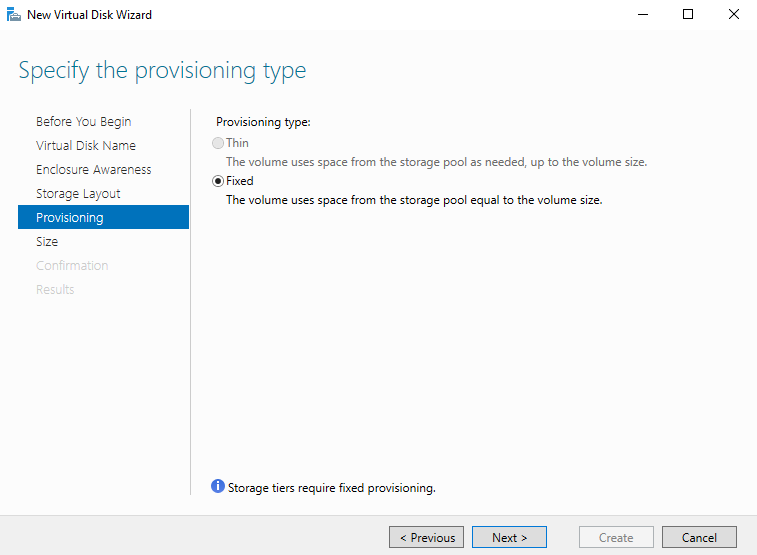

**Why tiers require Fixed provisioning:**

| Reason | Explanation |
|--------|-------------|
| Tier size calculation | Both the Faster Tier and Standard Tier must have definite sizes reserved upfront |
| Write-back cache | A write-back cache (1 GB) is reserved — requires known allocation |
| Tier optimization | The optimization engine needs fixed boundaries to move data between tiers |

> ℹ️ This is an important constraint: **if you need thin provisioning, you cannot use Storage Tiers.** Choose one or the other based on your storage strategy.

---

## Task 11 — Specify Size for Both Storage Tiers

Allocate specific sizes for the **Faster Tier (SSD)** and **Standard Tier (HDD)** independently.

**Steps:**
1. On the **Size** page, configure both tiers:

| Tier | Free Space Available | Specified Size |
|------|---------------------|---------------|
| **Faster Tier** (SSD) | 57.8 GB | **30 GB** |
| **Standard Tier** (HDD) | 59.0 GB | **40 GB** |

2. **Virtual disk size:** 70.0 GB (30 GB SSD + 40 GB HDD)
3. Free space in pool: 117 GB total
4. Click **Next >**

**Screenshot:**

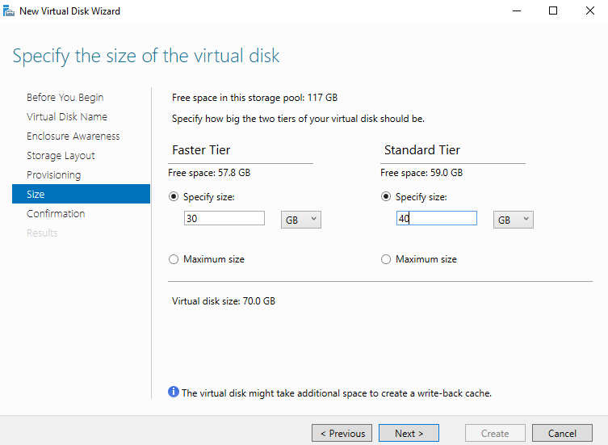

**Tier size strategy:**

| Strategy | Guidance |
|----------|---------|
| Hot data estimation | Set Faster Tier to ~10–20% of total data set (frequently accessed portion) |
| Larger Standard Tier | Most data is accessed infrequently — Standard Tier holds the bulk |
| Monitor and adjust | Use `defrag -c -h -g` report to see how much data is in each tier |

> ℹ️ The **write-back cache** note: *"The virtual disk might take additional space to create a write-back cache."* Storage Tiers use a write-back cache (typically 1 GB on the SSD tier) to buffer writes before committing to the appropriate tier. This is deducted from the Faster Tier's free space.

---

## Task 12 — Create Volume on the Tiered Virtual Disk (Confirmation)

After the tiered virtual disk is created, the New Volume Wizard creates a volume on it.

**Steps:**
1. On the **Confirmation** page, verify all settings before clicking **Create**

**Screenshot:**

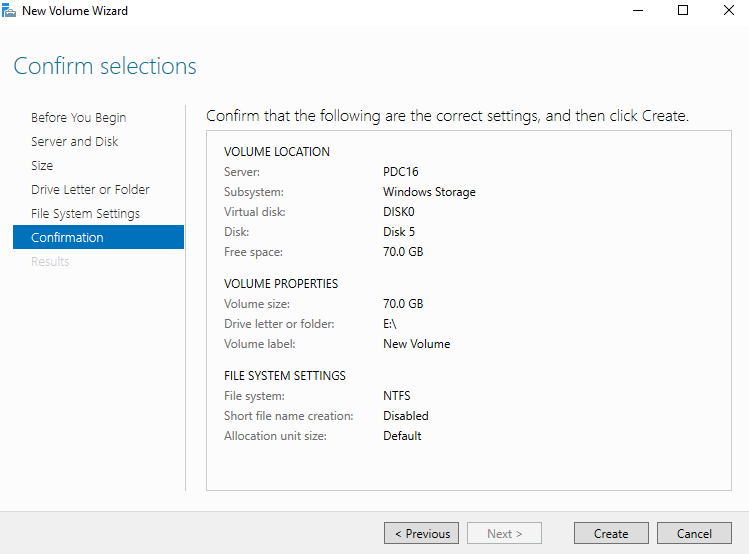

**Volume summary:**

| Property | Value |
|----------|-------|
| Server | PDC16 |
| Subsystem | Windows Storage |
| Virtual disk | DISK0 |
| Disk | Disk 5 |
| Free space | 70.0 GB |
| Volume size | **70.0 GB** |
| Drive letter or folder | `E:\` |
| Volume label | New Volume |
| File system | NTFS |
| Short file name creation | Disabled |
| Allocation unit size | Default (4 KB) |

> ✅ Click **Create** to format and mount the tiered volume as `E:\`. The volume presents as a single 70 GB NTFS drive to applications — the tier management is transparent to users and applications.

---

## Task 13 — Storage Tiers Optimization Task Schedule

Windows automatically schedules a **Storage Tiers Optimization** task via Task Scheduler to run the tier reorganization process.

**Steps:**
1. Open **Task Scheduler** (`taskschd.msc`)
2. Navigate to: `Task Scheduler Library → Microsoft → Windows → Storage Tiers Management`
3. Two tasks are visible

**Screenshot:**

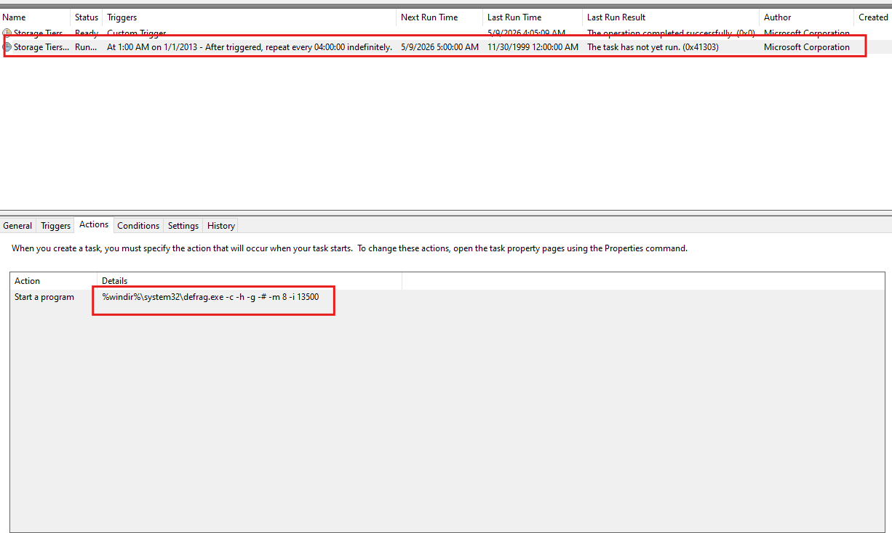

**Scheduled tasks:**

| Task | Status | Schedule | Last Run Result |
|------|--------|----------|----------------|
| Storage Tiers (custom trigger) | Ready | Custom Trigger | Completed successfully (0x0) |
| **Storage Tiers...** | **Running** | At 1:00 AM on 1/1/2013 — repeat every **04:00:00 indefinitely** | The task has not yet run (0x41303) |

**Action (Actions tab):**

```
Start a program:
%windir%\system32\defrag.exe -c -h -g -# 8 -i 13500
```

**defrag.exe parameters for tier optimization:**

| Flag | Meaning |
|------|---------|
| `-c` | Optimize all volumes |
| `-h` | Run at normal priority |
| `-g` | Optimize storage tiers (key flag for tier management) |
| `-# 8` | Maximum 8 passes |
| `-i 13500` | Idle timeout: 13500 seconds (~3.75 hours) |

> ℹ️ The tier optimization task runs every **4 hours** automatically. It analyzes I/O patterns and moves hot data up to the SSD tier and cold data down to the HDD tier. This happens transparently without impacting running applications.

> 💡 You can manually trigger tier optimization at any time with:
> ```powershell
> defrag -c -h -g
> # or
> Optimize-Volume -DriveLetter E -TierOptimize -Verbose
> ```

---

## Task 14 — Run and Analyze Storage Tier Optimization Report

Manually run the tier optimization command and examine the detailed report.

**Command:**
```powershell
defrag -c -h -g
```

**Screenshot:**

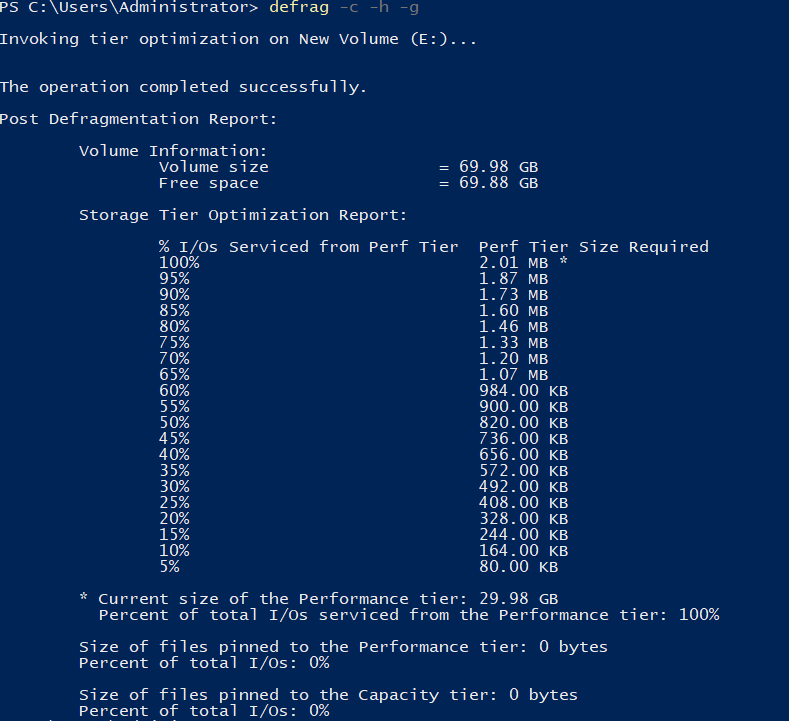

**Report output breakdown:**

```
Invoking tier optimization on New Volume (E:)...
The operation completed successfully.
```

**Volume Information:**
| Property | Value |
|----------|-------|
| Volume size | 69.98 GB |
| Free space | 69.88 GB |

**Storage Tier Optimization Report:**

| % I/Os from Perf Tier | Perf Tier Size Required |
|-----------------------|------------------------|
| 100% | 2.01 MB |
| 95% | 1.87 MB |
| 90% | 1.73 MB |
| 85% | 1.60 MB |
| ... | ... |
| 5% | 80.00 KB |

**Summary statistics:**
```
* Current size of Performance tier: 29.98 GB
  Percent of total I/Os serviced from the Performance tier: 100%

  Size of files pinned to the Performance tier: 0 bytes
  Size of files pinned to the Capacity tier: 0 bytes
```

**Reading the report:**

| Metric | Value | Meaning |
|--------|-------|---------|
| Current Performance tier size | 29.98 GB | The Faster Tier (SSD) is ~30 GB |
| I/Os from Performance tier | 100% | All I/Os are currently going to SSD |
| Files pinned to Performance | 0 bytes | No files manually pinned to SSD |
| Files pinned to Capacity | 0 bytes | No files manually pinned to HDD |
| Perf Tier needed for 100% I/Os | 2.01 MB | Only 2 MB of data has been accessed — very fresh volume |

> ℹ️ Since this is a newly created empty volume, only ~2 MB of metadata has been accessed — all served from the Performance (SSD) tier. In a real workload, the report shows how much data needs to be in the SSD tier to achieve a given I/O service percentage.

**Pinning files to specific tiers:**
```powershell
# Pin a file/folder permanently to the Faster Tier (SSD)
Set-FileStorageTier -FilePath "E:\HotData\database.mdf" `
    -DesiredStorageTierFriendlyName "HD-Pool - Faster"

# Pin to Standard Tier (HDD)
Set-FileStorageTier -FilePath "E:\Archive\olddata.zip" `
    -DesiredStorageTierFriendlyName "HD-Pool - Standard"
```

---

## Complete Lab Workflow Summary

```
PART 1 — System Files & Virtual Memory
═══════════════════════════════════════
Step 1: File Explorer → Show hidden/system files → see pagefile.sys
Step 2: pagefile.sys = 960 MB on C:\ → virtual memory backing file
Step 3: Performance Options → Virtual Memory → 960 MB total → Change if needed

PART 2 — Mixed-Media Storage Pool
═══════════════════════════════════════
Step 4: Server Manager → Primordial pool shows:
         1× NVMe SSD (60 GB) + 3× SAS HDD (60 GB each)
Step 5: New Storage Pool → HD-Pool → 4 disks, all Automatic, 240 GB
Step 6: PowerShell verification:
         Get-PhysicalDisk | Get-StoragePool | Get-StoragePool HD-Pool | Get-PhysicalDisk
Step 7: Fix MediaType → Get-PhysicalDisk -DeviceNumber 2 | Set-PhysicalDisk -MediaType SSD
         (Corrects VMware virtual disk reported as HDD to SSD for tier detection)

PART 3 — Tiered Virtual Disk & Volume
═══════════════════════════════════════
Step 8:  New Virtual Disk → DISK0 → ✅ Create storage tiers
Step 9:  Storage Layout → Simple or Mirror (Parity not available)
Step 10: Provisioning → Fixed only (Thin greyed out — tiers require fixed)
Step 11: Tier sizes → Faster (SSD): 30 GB | Standard (HDD): 40 GB → Total: 70 GB
Step 12: New Volume → E:\ → 70 GB NTFS → confirmed and created ✅

PART 4 — Tier Optimization
═══════════════════════════════════════
Step 13: Task Scheduler → Storage Tiers Management → runs every 4 hours
          defrag.exe -c -h -g -# 8 -i 13500
Step 14: Manual run → defrag -c -h -g → optimization report
          100% I/Os from SSD tier | 2.01 MB needed | 29.98 GB SSD tier active ✅
```

---

## PowerShell Complete Reference

```powershell
# ── Discovery ──────────────────────────────────────────────
# List all physical disks with media type
Get-PhysicalDisk | Select Number, FriendlyName, MediaType, CanPool, HealthStatus, Size

# Format output compactly
Get-PhysicalDisk | ft FriendlyName, Size, MediaType

# List all storage pools
Get-StoragePool

# List disks in a specific pool
Get-StoragePool "HD-Pool" | Get-PhysicalDisk

# Filter by size (bytes)
Get-StoragePool "HD-Pool" | Get-PhysicalDisk | Where-Object Size -EQ 64424509440

# ── MediaType Override ──────────────────────────────────────
# Change disk MediaType to SSD (by device number)
Get-PhysicalDisk -DeviceNumber 2 | Set-PhysicalDisk -MediaType SSD

# Change back to HDD
Get-PhysicalDisk -DeviceNumber 2 | Set-PhysicalDisk -MediaType HDD

# ── Pool & Virtual Disk Management ─────────────────────────
# Create pool
New-StoragePool -FriendlyName "HD-Pool" `
    -StorageSubsystemFriendlyName "Windows Storage*" `
    -PhysicalDisks (Get-PhysicalDisk -CanPool $True)

# Create tiered virtual disk
$SSDTier = New-StorageTier -StoragePoolFriendlyName "HD-Pool" -FriendlyName "SSD-Tier" -MediaType SSD
$HDDTier = New-StorageTier -StoragePoolFriendlyName "HD-Pool" -FriendlyName "HDD-Tier" -MediaType HDD

New-VirtualDisk -StoragePoolFriendlyName "HD-Pool" -FriendlyName "DISK0" `
    -StorageTiers $SSDTier, $HDDTier `
    -StorageTierSizes 30GB, 40GB `
    -ResiliencySettingName Simple `
    -ProvisioningType Fixed

# Check virtual disk health and tier info
Get-VirtualDisk | Select FriendlyName, HealthStatus, Size, ResiliencySettingName
Get-StorageTier | Select FriendlyName, MediaType, Size, AllocatedSize

# ── Tier Optimization ───────────────────────────────────────
# Run tier optimization manually
Optimize-Volume -DriveLetter E -TierOptimize -Verbose

# Analyze tiers without moving data
defrag E: -a -h

# Full tier optimization
defrag -c -h -g

# Pin a file to SSD tier
Set-FileStorageTier -FilePath "E:\data\hot.db" `
    -DesiredStorageTierFriendlyName "HD-Pool - Faster"

# Check pinned files
Get-FileStorageTier -VolumePath E:\
```

---

## Troubleshooting

| Issue | Cause | Solution |
|-------|-------|----------|
| "Create storage tiers" checkbox greyed out | Pool has only one media type | Add SSD disk to pool, or change MediaType with `Set-PhysicalDisk` |
| Parity layout missing when tiers enabled | Expected — Parity is not supported with tiers | Use Simple or Mirror layout |
| "Thin" provisioning greyed out | Storage tiers require Fixed | This is by design — use Fixed provisioning |
| Tier optimization task not running | Task Scheduler disabled | Enable in Task Scheduler; run `Optimize-Volume -TierOptimize` manually |
| All I/Os from SSD tier (100%) | Volume is empty/new | Normal — as data grows, the report becomes more meaningful |
| MediaType shows HDD for NVMe/SSD | VMware virtual disk type mismatch | Run `Set-PhysicalDisk -MediaType SSD` on affected disks |
| Pool degraded after SSD failure | No hot spare for SSD tier | Add SSD hot spare: `Set-PhysicalDisk -Usage HotSpare` |
| pagefile.sys not visible | System files hidden | Enable "Show hidden files" and uncheck "Hide protected OS files" |
| Virtual memory warnings | Page file too small | Increase page file size in Performance Options → Virtual Memory |

---

## References

- [Microsoft Docs: Storage Spaces Overview](https://learn.microsoft.com/en-us/windows-server/storage/storage-spaces/overview)
- [Storage Tiers (Tiered Storage)](https://learn.microsoft.com/en-us/windows-server/storage/storage-spaces/storage-spaces-tiering)
- [Optimize-Volume (PowerShell)](https://learn.microsoft.com/en-us/powershell/module/storage/optimize-volume)
- [Set-PhysicalDisk (MediaType)](https://learn.microsoft.com/en-us/powershell/module/storage/set-physicaldisk)
- [Virtual Memory Configuration](https://learn.microsoft.com/en-us/windows/client-management/change-default-remove-pagefile)
- [defrag.exe command reference](https://learn.microsoft.com/en-us/windows-server/administration/windows-commands/defrag)
