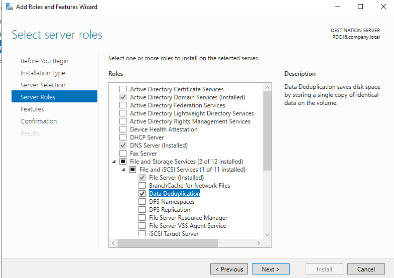
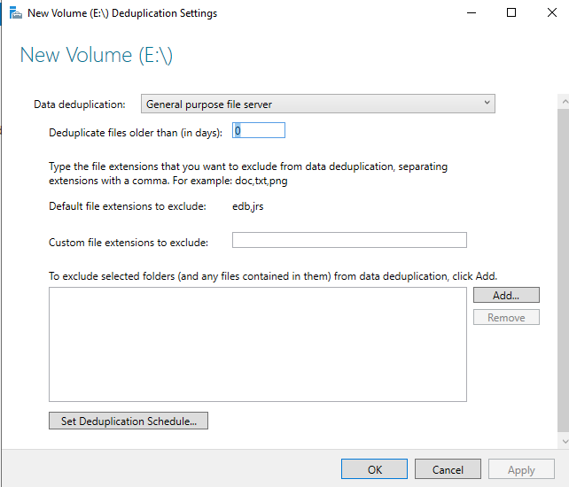
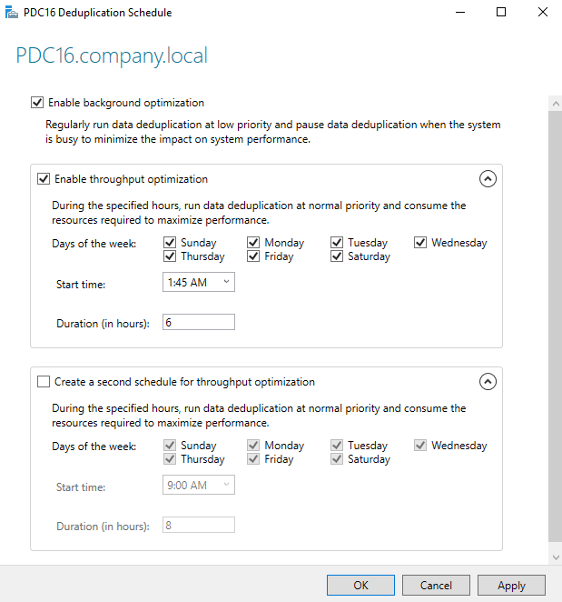
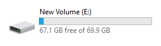
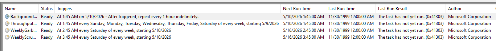
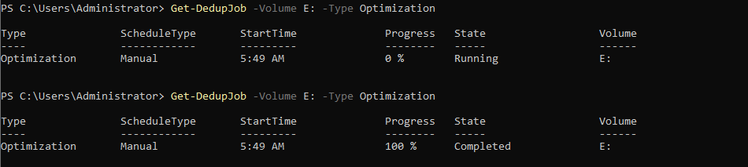
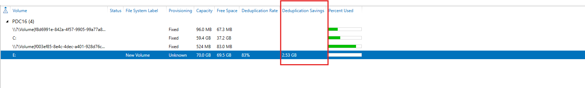

# Windows Server — Data Deduplication Lab

## Overview

This lab covers **Windows Server Data Deduplication** — a role service within File and Storage Services that reduces disk space consumption by finding and eliminating duplicate data chunks across files on a volume. Instead of storing duplicate copies, it stores a single copy and uses pointer references (reparse points) to the shared data. This is entirely transparent to users and applications.

---

## Key Concepts

| Term | Definition |
|------|-----------|
| **Data Deduplication** | Process of identifying identical data chunks and storing only one copy |
| **Chunk Store** | Hidden folder (`System Volume Information\Dedup`) storing unique data chunks |
| **Reparse Points** | Stub files that replace originals and point to the Chunk Store |
| **Deduplication Rate** | Percentage of data eliminated by deduplication (e.g., 83% = 83% of data was duplicate) |
| **Deduplication Savings** | Amount of disk space saved in GB (e.g., 2.53 GB saved) |
| **Optimization Job** | The deduplication process that scans, chunks, and deduplicates files |
| **GarbageCollection Job** | Removes orphaned chunks no longer referenced by any file |
| **Scrubbing Job** | Verifies chunk store integrity and repairs corrupted chunks |
| **Background optimization** | Runs at low priority continuously to minimize performance impact |
| **Throughput optimization** | Runs at full priority during scheduled off-peak hours |

---

## Lab Environment

| Component | Detail |
|-----------|--------|
| Server | PDC16.company.local (Windows Server 2022) |
| Target Volume | E:\ (New Volume — 70.0 GB, NTFS) |
| Deduplication Mode | General purpose file server |
| Dedup min file age | 0 days (immediate deduplication) |

---

## Task 1 — Install the Data Deduplication Role

Data Deduplication is not installed by default. It must be added through the Add Roles and Features Wizard.

**Steps:**
1. Open **Server Manager → Manage → Add Roles and Features**
2. Click **Next** through Installation Type and Server Selection
3. On **Server Roles**, expand the role tree:
   - Expand **File and Storage Services**
   - Expand **File and iSCSI Services**
   - ✅ Check **Data Deduplication**
4. Click **Next → Install**
5. Wait for installation to complete — no restart required

**Screenshot:**



**Role location in the hierarchy:**

```
File and Storage Services
└── File and iSCSI Services
    ├── File Server (Installed)
    ├── BranchCache for Network Files
    ├── ✅ Data Deduplication  ← Install this
    ├── DFS Namespaces
    ├── DFS Replication
    ├── File Server Resource Manager
    ├── File Server VSS Agent Service
    └── iSCSI Target Server
```

> ℹ️ **Data Deduplication** description: *"Data Deduplication saves disk space by storing a single copy of identical data on the volume."*

**PowerShell installation alternative:**
```powershell
Install-WindowsFeature -Name FS-Data-Deduplication -IncludeManagementTools
```

---

## Task 2 — Enable and Configure Deduplication on Volume E:\

After installation, configure the deduplication settings for the target volume.

**Steps:**
1. Open **Server Manager → File and Storage Services → Volumes**
2. Right-click **E:** → **Configure Data Deduplication…**
3. In the **New Volume (E:\) Deduplication Settings** dialog, configure:

| Setting | Value | Explanation |
|---------|-------|-------------|
| Data deduplication | **General purpose file server** | Optimized for standard file server workloads |
| Deduplicate files older than (in days) | **0** | Deduplicate all files regardless of age |
| Default file extensions to exclude | `edb,jrs` | Exchange database files — excluded by default |
| Custom file extensions to exclude | (empty) | Add any additional extensions to skip |
| Excluded folders | (none) | Add folders to exclude from deduplication |

4. Click **Set Deduplication Schedule…** (leads to Task 3)
5. Click **OK**

**Screenshot:**



**Deduplication usage types:**

| Mode | Best For | Notes |
|------|---------|-------|
| **General purpose file server** ✅ | User shares, documents, mixed files | Balanced — files ≥ 32 KB, no special optimization |
| Hyper-V | VHD/VHDX files for running VMs | Optimized for virtual disk access patterns |
| Backup | Backup target volumes (e.g., Windows Server Backup) | More aggressive — even recently modified files |

**File age setting (0 days):**
> ℹ️ Setting **"Deduplicate files older than: 0 days"** means all files are eligible for deduplication immediately. In production environments, a value of **3–5 days** is common to avoid deduplicating files that are actively being written. Files smaller than 32 KB are never deduplicated regardless of this setting.

**Default excluded extensions:**
- `edb` — Exchange mailbox database
- `jrs` — Exchange transaction log reserve file

These are excluded because Exchange accesses them with direct I/O that bypasses the chunk store.

---

## Task 3 — Configure the Deduplication Schedule

Set when and how aggressively the deduplication jobs run.

**Steps:**
1. In the deduplication settings dialog, click **"Set Deduplication Schedule…"**
2. In the **PDC16 Deduplication Schedule** dialog, configure:

**Screenshot:**



**Schedule settings:**

### Background Optimization
| Setting | Value |
|---------|-------|
| Enable background optimization | ✅ Enabled |
| Behavior | Runs continuously at **low priority**, pauses when system is busy |

### Throughput Optimization (Primary Schedule)
| Setting | Value |
|---------|-------|
| Enable throughput optimization | ✅ Enabled |
| Days of the week | All 7 days (Sun, Mon, Tue, Wed, Thu, Fri, Sat) |
| Start time | **1:45 AM** |
| Duration (in hours) | **6 hours** (runs until 7:45 AM) |

### Second Throughput Schedule (Optional)
| Setting | Value |
|---------|-------|
| Create a second schedule | ☐ Disabled |
| (If enabled) Start time | 9:00 AM |
| (If enabled) Duration | 8 hours |

**Schedule strategy explained:**

| Mode | Priority | Best For |
|------|----------|---------|
| Background optimization | Low — yields to other workloads | Always-on passive deduplication |
| Throughput optimization | High — uses max resources | Off-hours aggressive deduplication for best savings |

> ℹ️ **Background optimization** is sufficient for most workloads but may take longer to deduplicate large data sets. **Throughput optimization** (starting at 1:45 AM for 6 hours) runs when users are not active and achieves much higher deduplication throughput.

> 💡 For volumes with large amounts of data to deduplicate initially, run a **manual optimization** first (see Task 6), then rely on the schedule for ongoing maintenance.

---

## Task 4 — Verify Volume Space Before/After Deduplication

Monitor the volume space utilization to see the effect of deduplication.

**Screenshot:**



**Volume E: status:**

| Property | Value |
|----------|-------|
| Total capacity | 69.9 GB |
| Free space | **67.1 GB** |
| Used space | ~2.8 GB |
| Status | Deduplication active |

> ℹ️ This view shows the **logical free space** after deduplication has run. The volume appears to have 67.1 GB free even if more data was written, because deduplication has reduced the physical storage consumed.

---

## Task 5 — View Deduplication Scheduled Tasks

Windows automatically creates Task Scheduler entries for each deduplication job type.

**Steps:**
1. Open **Task Scheduler** (`taskschd.msc`)
2. Navigate to: `Task Scheduler Library → Microsoft → Windows → Deduplication`

**Screenshot:**



**Scheduled tasks created automatically:**

| Task | Status | Schedule | Next Run | Last Run Result |
|------|--------|----------|----------|----------------|
| **Background...** | Ready | At 1:45 AM on 5/10/2026 — repeat every **1 hour** indefinitely | 5/10/2026 1:45 AM | Not yet run (0x41303) |
| **Throughput...** | Ready | At 1:45 AM every **Sun-Sat** of every week, starting 5/9/2026 | 5/10/2026 1:45 AM | Not yet run (0x41303) |
| **WeeklyGarb...** | Ready | At **2:45 AM every Saturday** of every week, starting 5/10/2026 | 5/16/2026 2:45 AM | Not yet run (0x41303) |
| **WeeklyScru...** | Ready | At **3:45 AM every Saturday** of every week, starting 5/10/2026 | 5/16/2026 3:45 AM | Not yet run (0x41303) |

**Job types explained:**

| Job | Frequency | Purpose |
|-----|-----------|---------|
| **BackgroundOptimization** | Every 1 hour | Low-priority continuous deduplication |
| **ThroughputOptimization** | Daily at 1:45 AM (6 hrs) | High-priority scheduled deduplication |
| **WeeklyGarbageCollection** | Every Saturday 2:45 AM | Removes orphaned chunks, reclaims space |
| **WeeklyScrubbing** | Every Saturday 3:45 AM | Verifies chunk store integrity, repairs corruption |

> ⚠️ **GarbageCollection is critical** — without it, deleted or modified files may not free up disk space because their chunks remain in the Chunk Store. The weekly garbage collection job identifies and removes unreferenced chunks.

> ℹ️ Tasks run Saturday in sequence: Garbage Collection at 2:45 AM → Scrubbing at 3:45 AM, ensuring cleanup happens before integrity verification.

---

## Task 6 — Manage Deduplication via PowerShell

Use PowerShell cmdlets to monitor and manually trigger deduplication jobs.

**Screenshot:**



### Check Running Deduplication Jobs

```powershell
Get-DedupJob -Volume E: -Type Optimization
```

**First run output (job in progress):**

| Type | ScheduleType | StartTime | Progress | State | Volume |
|------|-------------|-----------|----------|-------|--------|
| Optimization | Manual | 5:49 AM | **0 %** | **Running** | E: |

**Second run output (job completed):**

| Type | ScheduleType | StartTime | Progress | State | Volume |
|------|-------------|-----------|----------|-------|--------|
| Optimization | Manual | 5:49 AM | **100 %** | **Completed** | E: |

> ℹ️ `ScheduleType: Manual` confirms this was triggered manually (not by the automatic schedule). The job ran from 5:49 AM and completed at 100%.

### Key Deduplication PowerShell Commands

```powershell
# Start a manual optimization job immediately
Start-DedupJob -Volume E: -Type Optimization

# Start garbage collection immediately
Start-DedupJob -Volume E: -Type GarbageCollection

# Start scrubbing job
Start-DedupJob -Volume E: -Type Scrubbing

# Check all running/recent dedup jobs
Get-DedupJob -Volume E:

# Get deduplication statistics for a volume
Get-DedupStatus -Volume E:

# Get deduplication configuration
Get-DedupVolume -Volume E:

# Enable deduplication via PowerShell
Enable-DedupVolume -Volume E: -UsageType Default

# Disable deduplication on a volume
Disable-DedupVolume -Volume E:

# Change minimum file age to 0 days
Set-DedupVolume -Volume E: -MinimumFileAgeDays 0

# Get detailed savings report
Get-DedupStatus | Select Volume, SavedSpace, SavingsRate, LastOptimizationTime

# Measure potential savings without running
Measure-DedupFileMetadata -Path E:\
```

---

## Task 7 — View Deduplication Savings Results

After the optimization job completes, view the deduplication savings in Server Manager.

**Steps:**
1. Open **Server Manager → File and Storage Services → Volumes**
2. Observe the **Deduplication Rate** and **Deduplication Savings** columns for E:

**Screenshot:**



**Volume E: deduplication results:**

| Property | Value | Meaning |
|----------|-------|---------|
| Volume | E: | Target volume |
| File System Label | New Volume | Volume label |
| Provisioning | Unknown | Storage pool virtual disk |
| Capacity | **70.0 GB** | Total volume size |
| Free Space | **69.5 GB** | Space currently free |
| **Deduplication Rate** | **83%** | 83% of data on the volume was duplicate — eliminated |
| **Deduplication Savings** | **2.53 GB** | Physical disk space saved by deduplication |
| Percent Used | (progress bar) | Volume utilization indicator |

**Understanding the 83% deduplication rate:**

```
Original data on volume:   ~14.9 GB (before dedup)
Duplicate data eliminated: ~12.4 GB (83%)
Unique data stored:         ~2.5 GB  (17%)
Physical space saved:        2.53 GB
```

**Comparison with other volumes (no deduplication):**

| Volume | Capacity | Free Space | Dedup Rate | Savings |
|--------|----------|-----------|-----------|---------|
| EFI System | 96.0 MB | 67.3 MB | — | — |
| C: (OS) | 59.4 GB | 37.2 GB | — | — |
| Recovery | 524 MB | 83.0 MB | — | — |
| **E: (Dedup)** | **70.0 GB** | **69.5 GB** | **83%** | **2.53 GB** |

> ✅ An **83% deduplication rate** is excellent and typical for environments with many similar files (e.g., software installers, VM templates, documents with common content). Real-world enterprise file servers typically see 40–70% savings.

---

## Complete Lab Workflow Summary

```
Step 1: Install Data Deduplication role
         Server Manager → Add Roles and Features
         → File and Storage Services → File and iSCSI Services → Data Deduplication ✅
         ↓
Step 2: Enable deduplication on E:\
         Right-click E: → Configure Data Deduplication
         → Mode: General purpose file server
         → Min file age: 0 days
         → Exclude: edb, jrs (default)
         ↓
Step 3: Configure deduplication schedule
         → Background optimization: ✅ (every 1 hour, low priority)
         → Throughput optimization: ✅ (1:45 AM, all days, 6 hours)
         ↓
Step 4: Verify volume space (67.1 GB free of 69.9 GB)
         ↓
Step 5: Confirm Task Scheduler jobs created:
         → BackgroundOptimization (hourly)
         → ThroughputOptimization (daily 1:45 AM)
         → WeeklyGarbageCollection (Saturday 2:45 AM)
         → WeeklyScrubbing (Saturday 3:45 AM)
         ↓
Step 6: Run manual optimization:
         Start-DedupJob -Volume E: -Type Optimization
         Get-DedupJob -Volume E: -Type Optimization
         → Progress: 0% Running → 100% Completed ✅
         ↓
Step 7: View results in Server Manager → Volumes:
         → Deduplication Rate: 83% ✅
         → Deduplication Savings: 2.53 GB ✅
```

---

## Deduplication Job Types Reference

| Job Type | PowerShell | Schedule | Purpose |
|----------|-----------|----------|---------|
| Optimization | `Start-DedupJob -Type Optimization` | Hourly (background) + Daily (throughput) | Main dedup process — chunks and eliminates duplicates |
| GarbageCollection | `Start-DedupJob -Type GarbageCollection` | Weekly (Saturday 2:45 AM) | Removes orphaned chunks, reclaims physical space |
| Scrubbing | `Start-DedupJob -Type Scrubbing` | Weekly (Saturday 3:45 AM) | Verifies chunk integrity, repairs data corruption |
| Unoptimization | `Start-DedupJob -Type Unoptimization` | Manual only | Reverses deduplication — restores all original files |

---

## Deduplication Decision Matrix

| Workload | Use Dedup? | Mode | Expected Savings |
|----------|-----------|------|-----------------|
| General file server (documents, installers) | ✅ Yes | General purpose | 40–80% |
| Hyper-V VMs (running) | ✅ Yes (with care) | Hyper-V | 30–60% |
| Backup target | ✅ Yes | Backup | 50–90% |
| Database files (SQL, Exchange) | ❌ No | — | Not supported |
| Frequently changing files (<32 KB) | Partial | General purpose | Low — skipped by size |
| OS volume (C:) | ❌ Not recommended | — | Risk of instability |

---

## Troubleshooting

| Issue | Cause | Solution |
|-------|-------|----------|
| Deduplication not running | Schedule not enabled or disabled | Check Task Scheduler; enable background optimization |
| No savings after optimization | Files too small (<32 KB) or too new | Set min age to 0; check file sizes; run `Measure-DedupFileMetadata` |
| Free space not increasing after file deletion | Orphaned chunks remain | Run `Start-DedupJob -Type GarbageCollection` |
| Dedup job fails | Volume full or chunk store corruption | Run scrubbing job; check event logs (Event ID 2000–2100 in Dedup log) |
| "Access denied" on dedup enable | Not running as Administrator | Run PowerShell as Administrator |
| Volume shows "Unknown" provisioning | Virtual disk from Storage Pool | Expected — provisioning type may not be reported for storage pool volumes |
| Cannot enable dedup on C: | OS volume restriction | Deduplication on boot/system volumes requires special configuration — not recommended |

---

## Monitoring Deduplication Health

```powershell
# Full deduplication status report
Get-DedupStatus -Volume E: | Format-List *

# Key metrics output:
# SavedSpace            : 2715422720  (~2.53 GB)
# SavingsRate           : 83
# LastOptimizationTime  : 5/9/2026 5:49:00 AM
# LastGarbageCollectionTime : (pending first run)
# LastScrubbingTime     : (pending first run)

# Check deduplication volume config
Get-DedupVolume -Volume E: | Format-List *

# View deduplication events in Event Log
Get-WinEvent -LogName "Microsoft-Windows-Deduplication/Operational" -MaxEvents 20

# Check chunk store size
Get-Item "E:\System Volume Information\Dedup\" -Force | Measure-Object -Sum
```

---

## References

- [Microsoft Docs: Data Deduplication Overview](https://learn.microsoft.com/en-us/windows-server/storage/data-deduplication/overview)
- [Data Deduplication Interoperability](https://learn.microsoft.com/en-us/windows-server/storage/data-deduplication/interop)
- [Install and Enable Data Deduplication](https://learn.microsoft.com/en-us/windows-server/storage/data-deduplication/install-enable)
- [Data Deduplication PowerShell Reference](https://learn.microsoft.com/en-us/powershell/module/deduplication)
- [Run Deduplication Jobs](https://learn.microsoft.com/en-us/windows-server/storage/data-deduplication/run)
