# 🖧 iSCSI Target & Initiator Lab — Windows Server

> **Lab Overview:** This lab walks through configuring an iSCSI Target on a Windows Server (PDC16) and connecting to it from an iSCSI Initiator. By the end of this lab, a virtual disk provisioned on the target server will appear as a physical disk on the initiator machine.

---

## 📋 Table of Contents

1. [Prerequisites](#prerequisites)
2. [Lab Topology](#lab-topology)
3. [Task 2 — Select iSCSI Virtual Disk Location](#task-2--select-iscsi-virtual-disk-location)
4. [Task 3 — Install iSCSI Target Server Role](#task-3--install-iscsi-target-server-role)
5. [Task 4 — Specify iSCSI Virtual Disk Size](#task-4--specify-iscsi-virtual-disk-size)
6. [Task 5 — Specify iSCSI Target Name](#task-5--specify-iscsi-target-name)
7. [Task 6 — Discover Target from Initiator](#task-6--discover-target-from-initiator)
8. [Task 7 — Add Initiator IQN on Target (Access Servers)](#task-7--add-initiator-iqn-on-target-access-servers)
9. [Task 8 — Configure Authentication (CHAP)](#task-8--configure-authentication-chap)
10. [Task 9 — Connect to Target from Initiator](#task-9--connect-to-target-from-initiator)
11. [Task 10 — Volume & Auto Configure](#task-10--volume--auto-configure)
12. [Task 11 — Disk Appeared on Initiator](#task-11--disk-appeared-on-initiator)
13. [Troubleshooting](#troubleshooting)
14. [Key Concepts Summary](#key-concepts-summary)

---

## Prerequisites

| Requirement | Details |
|---|---|
| Target Server OS | Windows Server 2016 / 2019 / 2022 |
| Initiator OS | Windows Server or Windows 10/11 |
| Target Server Name | PDC16 (PDC16.company.local) |
| Network | Both machines on the same network (e.g., 192.168.1.x) |
| Target IP | 192.168.1.2 |
| iSCSI Port | 3260 (default) |
| Storage Volume | E: drive (70 GB NTFS) on target |

---

## Lab Topology

```
┌─────────────────────────┐          ┌─────────────────────────┐
│     iSCSI TARGET        │          │    iSCSI INITIATOR      │
│  PDC16.company.local    │◄────────►│   (Client Machine)      │
│  IP: 192.168.1.2        │  TCP     │   IQN: iqn.1991-05.com  │
│  Port: 3260             │  :3260   │       .microsoft:adc     │
│  VHD: E:\iSCSIVirtual   │          │                         │
│        Disks\disk0.vhdx │          │                         │
└─────────────────────────┘          └─────────────────────────┘
```

---

## Task 2 — Select iSCSI Virtual Disk Location

**Goal:** Choose the server and volume where the iSCSI virtual disk file (.vhdx) will be stored.

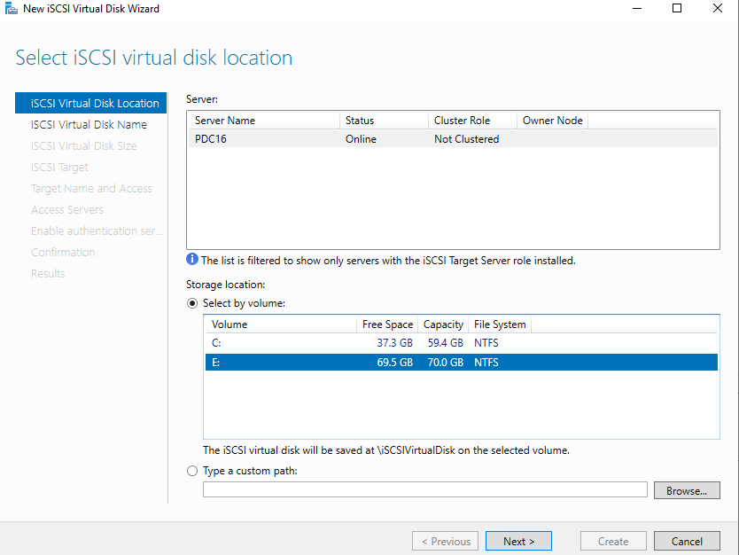

### Steps:
1. Open **Server Manager** on the target machine (PDC16).
2. Navigate to **File and Storage Services → iSCSI**.
3. Click **Tasks → New iSCSI Virtual Disk** to launch the wizard.
4. In the **"Select iSCSI virtual disk location"** step:
   - Confirm the server is **PDC16** (Status: Online).
   - Under **Storage location**, select **"Select by volume"**.
   - Choose the **E:** volume (70 GB NTFS, 69.5 GB free) — this gives maximum space for the virtual disk.
5. The disk will be saved at `E:\iSCSIVirtualDisk`.
6. Click **Next**.

> **💡 Tip:** Always choose a volume with sufficient free space. The E: drive is preferred over C: to avoid storing large VHDs on the OS partition.

---

## Task 3 — Install iSCSI Target Server Role

**Goal:** Install the **iSCSI Target Server** role service on the Windows Server.

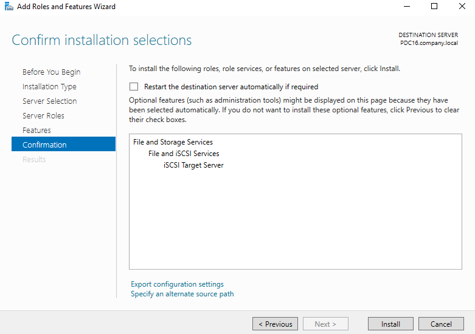

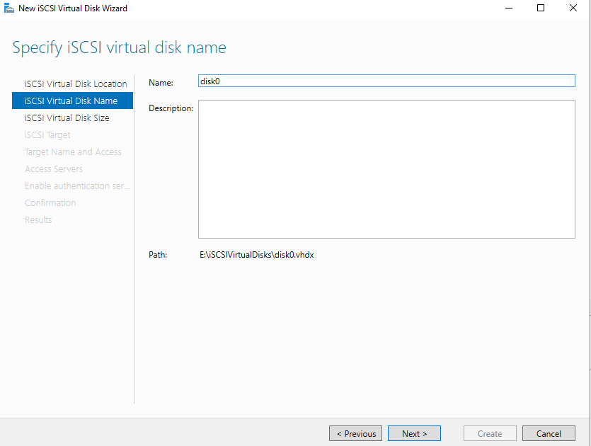

### Steps:
1. Open **Server Manager** → click **Manage → Add Roles and Features**.
2. Proceed through the wizard:
   - **Installation Type:** Role-based or feature-based installation.
   - **Server Selection:** Select **PDC16.company.local**.
   - **Server Roles:** Expand **File and Storage Services → File and iSCSI Services**.
   - Check **iSCSI Target Server**.
3. On the **Confirmation** page, verify the following will be installed:
   ```
   File and Storage Services
     └── File and iSCSI Services
           └── iSCSI Target Server
   ```
4. Click **Install** and wait for the installation to complete.

> **💡 Tip:** You do not need to restart the server after installing the iSCSI Target Server role. The service starts automatically.

---

## Task 4 — Specify iSCSI Virtual Disk Size

**Goal:** Set the name and size of the virtual disk (.vhdx) that will be exposed to the initiator.

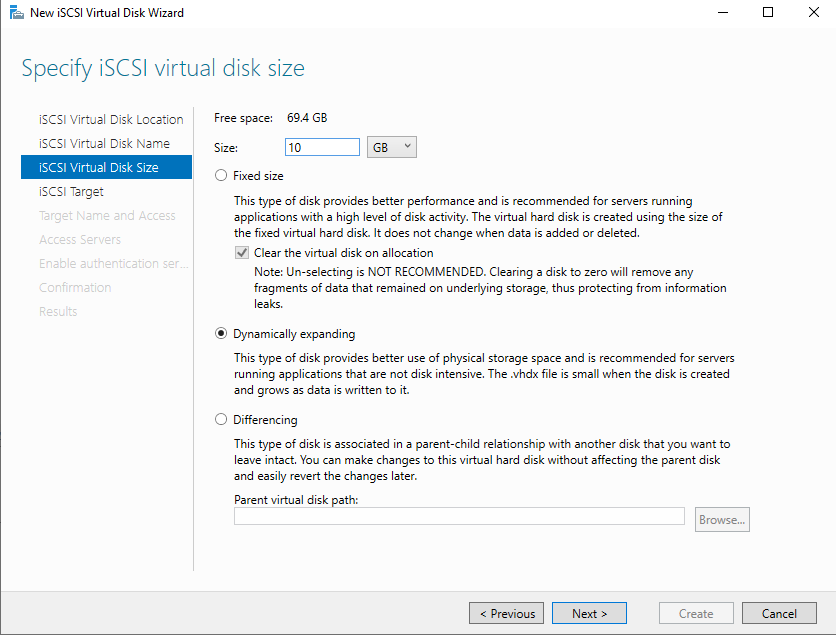

### Steps:

**Virtual Disk Name (previous step):**
- Name: `disk0`
- Path: `E:\iSCSIVirtualDisks\disk0.vhdx`

**Virtual Disk Size:**
1. Free space available: **69.4 GB**
2. Set **Size** to **10 GB**.
3. Choose the disk type:

| Type | Description | Use Case |
|---|---|---|
| **Fixed size** | Pre-allocates full size; best performance | High I/O workloads |
| **Dynamically expanding** ✅ | Starts small, grows as data is written | General/dev use |
| **Differencing** | Child disk linked to a parent | Snapshots/testing |

4. Select **Dynamically expanding** (recommended for this lab).
5. *(Optional)* For fixed size, check **"Clear the virtual disk on allocation"** to zero out data — increases security.
6. Click **Next**.

> **⚠️ Note:** "Clear the virtual disk on allocation" is NOT RECOMMENDED to uncheck. Keeping it checked ensures no data fragments from previous use remain on the disk.

---

## Task 5 — Specify iSCSI Target Name

**Goal:** Create a new iSCSI target and give it a human-readable name. The target name will be included in the IQN that initiators use to connect.

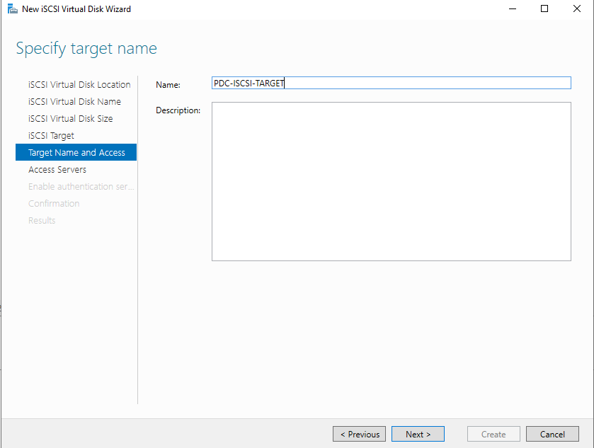

### Steps:
1. In the wizard, navigate to the **iSCSI Target** step — select **New iSCSI target**.
2. Proceed to **Target Name and Access**.
3. Enter the target name: `PDC-ISCSI-TARGET`
4. Optionally add a description.
5. Click **Next**.

### Result:
The full IQN (iSCSI Qualified Name) for this target will be generated as:
```
iqn.1991-05.com.microsoft:pdc16-pdc-iscsi-target-target
```

> **💡 IQN Format Explained:**
> ```
> iqn.YYYY-MM.reverse-domain:unique-name
> iqn.1991-05.com.microsoft:pdc16-pdc-iscsi-target-target
>  │        │        │              │
>  │        │        │              └─ Unique identifier (server + target name)
>  │        │        └─ Reversed domain (microsoft.com → com.microsoft)
>  │        └─ Year-Month the domain was registered
>  └─ iSCSI Qualified Name prefix
> ```

---

## Task 6 — Discover Target from Initiator

**Goal:** From the initiator machine, discover the iSCSI target by entering the target server's IP address.

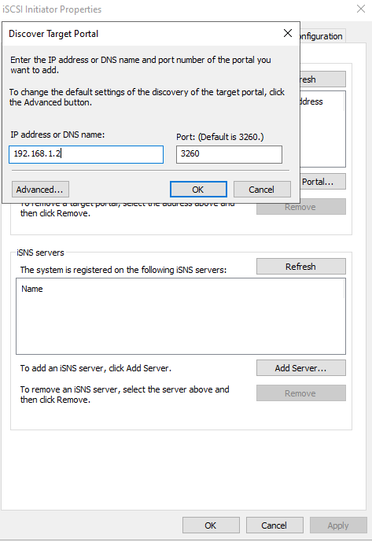

### Steps:
1. On the **initiator** machine, open **iSCSI Initiator**:
   - Search for "iSCSI Initiator" in Start Menu, or run `iscsicpl` from Run/PowerShell.
   - If prompted to start the service, click **Yes**.
2. Go to the **Discovery** tab.
3. Click **Discover Portal...** button.
4. In the **"Discover Target Portal"** dialog:
   - **IP address or DNS name:** `192.168.1.2` (the target server's IP)
   - **Port:** `3260` (default iSCSI port — leave as is)
5. Click **OK**.
6. Switch to the **Targets** tab — the target IQN should now appear as **Inactive**.

> **💡 Tip:** If the target does not appear, verify:
> - Both machines can ping each other.
> - Windows Firewall on the target allows TCP port 3260.
> - The iSCSI Target Server service is running on PDC16.

---

## Task 7 — Add Initiator IQN on Target (Access Servers)

**Goal:** On the target server, authorize the initiator by adding its IQN to the list of allowed access servers.

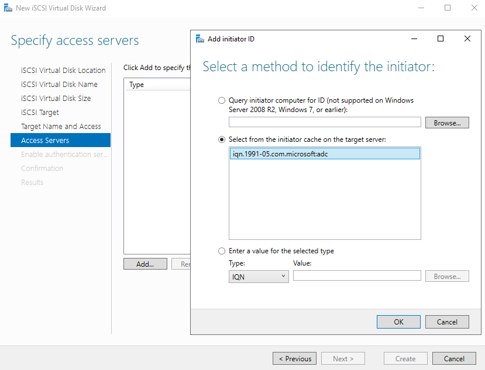

### Steps:
1. Return to the **target server** (PDC16).
2. In the iSCSI Virtual Disk Wizard, navigate to the **Access Servers** step.
3. Click **Add...** to open the **"Add initiator ID"** dialog.
4. Choose the identification method:

| Method | When to Use |
|---|---|
| Query initiator computer for ID | When the initiator is reachable (not supported on Server 2008 R2 or older) |
| **Select from initiator cache** ✅ | The initiator already connected/discovered the target — its IQN is cached |
| Enter a value manually | When you know the IQN but the initiator hasn't connected yet |

5. Select **"Select from the initiator cache on the target server"**.
6. The initiator's IQN appears: `iqn.1991-05.com.microsoft:adc`
7. Select it and click **OK**.
8. Click **Next** in the wizard.

> **💡 Why this matters:** Only initiators whose IQN is listed under Access Servers can connect to this virtual disk. This is a basic access control mechanism.

---

## Task 8 — Configure Authentication (CHAP)

**Goal:** Optionally enable CHAP authentication to secure the iSCSI connection between initiator and target.

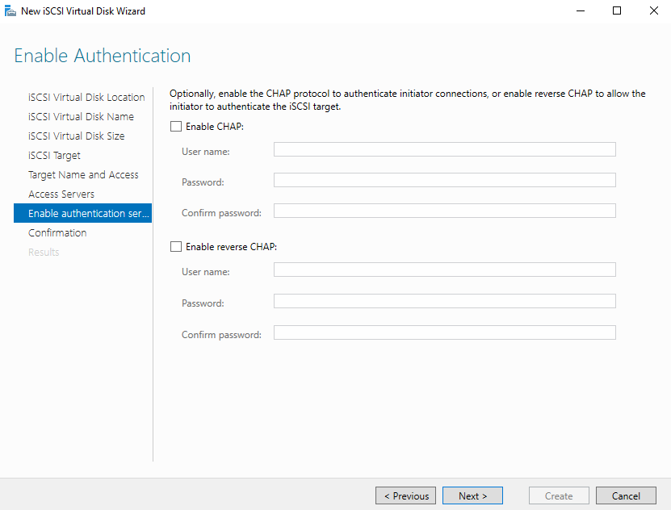

### Steps:
1. In the wizard, navigate to **Enable Authentication** step.
2. Two authentication options are available:

| Option | Description |
|---|---|
| **Enable CHAP** | Target authenticates the initiator. Initiator must provide username + password. |
| **Enable Reverse CHAP** | Initiator also authenticates the target (mutual authentication). |

3. For this lab, **leave both unchecked** (no authentication) to keep configuration simple.
4. If enabling CHAP in production:
   - Enter a **Username** and **Password** (password must be 12–16 characters for CHAP).
   - The same credentials must be configured on the initiator side.
5. Click **Next** to proceed to Confirmation.

> **⚠️ Security Note:** In production environments, always enable CHAP to prevent unauthorized initiators from connecting to your iSCSI targets. Reverse CHAP (mutual authentication) provides the strongest security.

---

## Task 9 — Connect to Target from Initiator

**Goal:** From the initiator, connect to the discovered (but Inactive) iSCSI target.

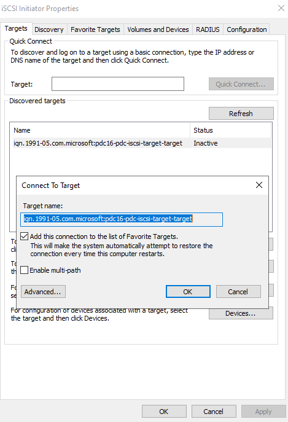

### Steps:
1. On the **initiator** machine, open **iSCSI Initiator Properties**.
2. Go to the **Targets** tab.
3. In the **Discovered targets** list, find:
   ```
   iqn.1991-05.com.microsoft:pdc16-pdc-iscsi-target-target    Inactive
   ```
4. Select the target and click **Connect**.
5. The **"Connect To Target"** dialog appears:
   - **Target name:** `iqn.1991-05.com.microsoft:pdc16-pdc-iscsi-target-target`
   - ✅ Check **"Add this connection to the list of Favorite Targets"** — ensures the connection is automatically restored on system restart.
   - ☐ **Enable multi-path** — leave unchecked unless you have multiple network paths to the target (MPIO).
6. Click **OK**.
7. The target status changes from **Inactive** to **Connected**.

> **💡 Tip:** Enabling "Add this connection to the list of Favorite Targets" is critical for persistent connections. Without it, you must manually reconnect after every reboot.

---

## Task 10 — Volume & Auto Configure

**Goal:** Bind the connected iSCSI volume/device to the initiator so it is automatically available on restart.

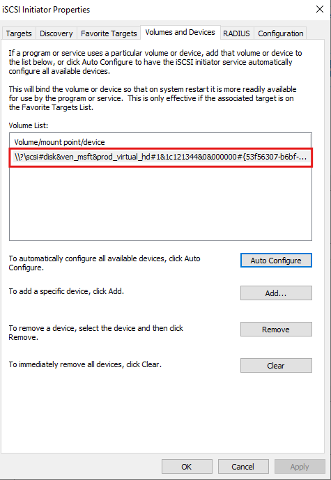

### Steps:
1. In **iSCSI Initiator Properties**, go to the **Volumes and Devices** tab.
2. Click **Auto Configure** button.
3. The system discovers and populates the **Volume List** with the iSCSI-attached virtual disk:
   ```
   \\?\scsi#disk&ven_msft&prod_virtual_hd#1&1c121344&0&000000#{53f56307-b6bf-...
   ```
4. Click **OK** to close the iSCSI Initiator Properties.

> **💡 What Auto Configure does:** It scans for all iSCSI volumes associated with targets in the Favorite Targets list and adds them to the Volume List. This ensures the OS registers the device automatically each time the iSCSI connection is established at startup.

---

## Task 11 — Disk Appeared on Initiator

**Goal:** Verify the iSCSI virtual disk is visible in Disk Management and initialize it for use.

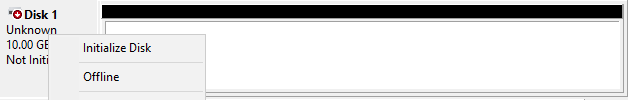

### Steps:
1. Open **Disk Management**:
   - Right-click **Start → Disk Management**, or run `diskmgmt.msc`.
2. A new disk appears: **Disk 1** — `Unknown`, `10.00 GB`, `Not Initialized`.
3. Right-click **Disk 1** and select **Initialize Disk**.
4. Choose partition style:
   - **MBR** — for disks under 2TB, compatible with older systems.
   - **GPT** — recommended for modern systems and disks over 2TB.
5. Click **OK**.
6. Right-click the unallocated space on Disk 1 → **New Simple Volume**.
7. Follow the wizard to format the volume (NTFS recommended) and assign a drive letter.

> **🎉 Success!** The iSCSI virtual disk is now initialized, formatted, and available as a local drive on the initiator machine. Files written to this drive are actually stored in `E:\iSCSIVirtualDisks\disk0.vhdx` on PDC16.

---

## Troubleshooting

| Problem | Possible Cause | Solution |
|---|---|---|
| Target not discovered | Firewall blocking port 3260 | Allow TCP 3260 inbound on target server |
| Target shows "Inactive" after discovery | IQN not added to Access Servers | Go to target wizard, add initiator IQN in Access Servers step |
| Connection fails with auth error | CHAP mismatch | Ensure CHAP credentials match on both target and initiator |
| Disk not appearing in Disk Management | Auto Configure not run | Run Auto Configure in Volumes and Devices tab |
| Connection drops after reboot | Not added to Favorite Targets | Reconnect and check "Add to Favorite Targets" |
| Disk is Offline | SAN policy | Right-click disk → Online, or set SAN policy with `diskpart` |

### Useful Commands

```powershell
# Check iSCSI Initiator Service status
Get-Service MSiSCSI

# Start iSCSI Initiator Service
Start-Service MSiSCSI

# Set iSCSI service to start automatically
Set-Service MSiSCSI -StartupType Automatic

# List iSCSI targets (PowerShell)
Get-IscsiTarget

# List iSCSI sessions
Get-IscsiSession

# Open iSCSI Initiator GUI
iscsicpl

# Open Disk Management
diskmgmt.msc

# Allow iSCSI through Windows Firewall (on target)
netsh advfirewall firewall add rule name="iSCSI Target" protocol=TCP dir=in localport=3260 action=allow
```

---

## Key Concepts Summary

| Term | Definition |
|---|---|
| **iSCSI** | Internet Small Computer Systems Interface — protocol to send SCSI commands over TCP/IP |
| **Target** | The server that hosts the storage and exposes it over the network (PDC16) |
| **Initiator** | The client that connects to the target and uses its storage |
| **IQN** | iSCSI Qualified Name — unique identifier for targets and initiators |
| **VHD/VHDX** | Virtual Hard Disk — the file on the target that acts as the virtual disk |
| **CHAP** | Challenge-Handshake Authentication Protocol — used to authenticate iSCSI connections |
| **LUN** | Logical Unit Number — a logical reference to the virtual disk on the target |
| **Portal** | An IP address + port combination used for iSCSI discovery |
| **Favorite Targets** | Persistent list of targets the initiator reconnects to on reboot |
| **Auto Configure** | Automatically maps iSCSI volumes to the initiator's device list |

---

## Lab Flow Diagram

```
TARGET SIDE (PDC16)                    INITIATOR SIDE
─────────────────                      ──────────────
[Task 3] Install iSCSI Target Role
         │
[Task 2] Select VHD Location (E:)
         │
[Task 4] Set VHD Size (10 GB)
         │                              [Task 6] Discover Target Portal
[Task 5] Name the Target               │         (192.168.1.2:3260)
         │                             │
[Task 7] Add Initiator IQN ◄──────────┘ (IQN cached from discovery)
         │
[Task 8] Configure Auth (CHAP)
         │                              [Task 9] Connect to Target
         └──────────────────────────────►         (Set as Favorite)
                                        │
                                        [Task 10] Auto Configure Volume
                                        │
                                        [Task 11] Initialize Disk in
                                                  Disk Management ✅
```

---

*Lab Environment: Windows Server 2016 | iSCSI Target Server Role | Server Manager*
