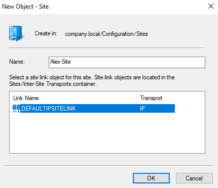
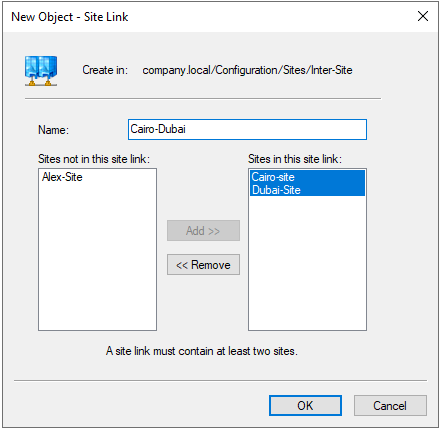
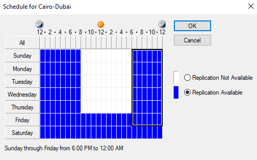
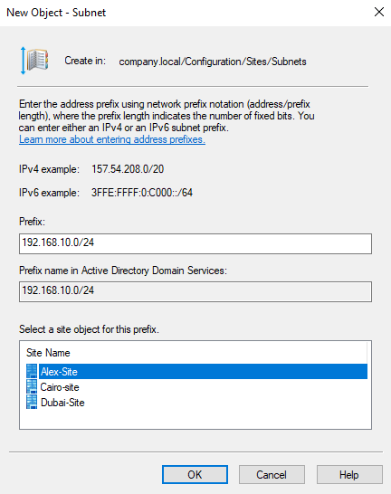
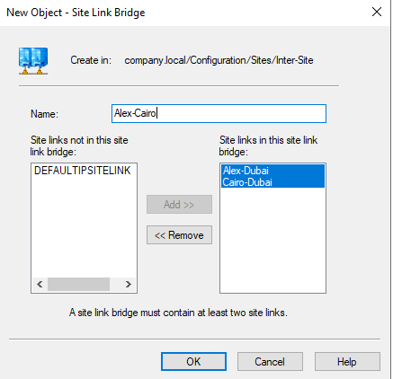

# 🏢 Active Directory Inter Site Replication Lab

> **Lab Overview:** This lab covers the configuration of Active Directory Sites and Services in a multi-site Windows Server environment. You will create AD sites, site links, subnets, replication schedules, and site link bridges to model a real-world three-location corporate network (Alexandria, Cairo, and Dubai).

---

## 📋 Table of Contents

1. [Prerequisites](#prerequisites)
2. [Lab Topology](#lab-topology)
3. [Task 1 — Create a New Site](#task-1--create-a-new-site)
4. [Task 2 — Create a New Site Link](#task-2--create-a-new-site-link)
5. [Task 3 — Configure Site Link Properties](#task-3--configure-site-link-properties)
6. [Task 4 — Set Replication Schedule](#task-4--set-replication-schedule)
7. [Task 5 — Associate a Subnet with a Site](#task-5--associate-a-subnet-with-a-site)
8. [Task 6 — Create a Site Link Bridge](#task-6--create-a-site-link-bridge)
9. [Troubleshooting](#troubleshooting)
10. [Key Concepts Summary](#key-concepts-summary)

---

## Prerequisites

| Requirement | Details |
|---|---|
| Domain | `company.local` |
| Domain Controller | Windows Server 2016 / 2019 / 2022 |
| Tool Used | **Active Directory Sites and Services** (`dssite.msc`) |
| Existing Default Site | `Default-First-Site-Name` |
| Sites to Create | Alex-Site, Cairo-site, Dubai-Site |
| Subnets | 192.168.10.0/24 (Alex-Site), others as needed |
| Admin Rights | Domain Administrator or equivalent |

---

## Lab Topology

```
                        company.local
                             │
          ┌──────────────────┼──────────────────┐
          │                  │                  │
      Alex-Site          Cairo-site         Dubai-Site
   192.168.10.0/24    192.168.20.0/24    192.168.30.0/24
          │                  │                  │
          └──────── Alex-Dubai ─────────────────┘
                    Site Link
                         │
                    Cairo-Dubai
                    Site Link
                         │
                  ┌──────────────┐
                  │ Alex-Cairo   │
                  │ Site Link    │
                  │   Bridge     │
                  └──────────────┘
```

### Site Link Map

| Site Link | Sites Connected | Cost | Replication Interval |
|---|---|---|---|
| Alex-Dubai | Alex-Site ↔ Dubai-Site | 100 (default) | 180 min (default) |
| Cairo-Dubai | Cairo-site ↔ Dubai-Site | 100 | 15 minutes |
| DEFAULTIPSITELINK | (default fallback) | 100 | 180 min |

---

## Task 1 — Create a New Site

**Goal:** Create a new Active Directory site named **Alex-Site** to represent the Alexandria office.



### Steps:

1. Open **Active Directory Sites and Services**:
   - Run → `dssite.msc`, or
   - Server Manager → Tools → Active Directory Sites and Services.

2. In the left pane, right-click **Sites** → select **New Site**.

3. In the **"New Object – Site"** dialog:
   - **Name:** `Alex-Site`
   - **Site Link:** Select `DEFAULTIPSITELINK` (Transport: IP) — every new site must be associated with at least one site link object.

4. Click **OK**.

5. A confirmation dialog appears listing post-creation tasks. Dismiss it.

> **💡 Tip:** Repeat this process to create `Cairo-site` and `Dubai-Site` if they don't already exist. The naming convention (capitalization, hyphens) should be consistent across all sites.

### What Happens Internally:
When a site is created, AD creates a container object at:
```
company.local/Configuration/Sites/Alex-Site
```
Domain controllers are later moved into sites based on their IP addresses matching associated subnets.

---

## Task 2 — Create a New Site Link

**Goal:** Create a site link named **Cairo-Dubai** to define the network path between the Cairo and Dubai sites, enabling controlled AD replication between them.



### Steps:

1. In **Active Directory Sites and Services**, expand:
   `Sites → Inter-Site Transports → IP`

2. Right-click **IP** → select **New Site Link**.

3. In the **"New Object – Site Link"** dialog:
   - **Name:** `Cairo-Dubai`
   - **Sites not in this site link:** `Alex-Site` (left pane)
   - **Sites in this site link:** `Cairo-site`, `Dubai-Site` (right pane)
   - Use **Add >>** to move Cairo-site and Dubai-Site to the right pane.

4. Verify at least **two sites** are in the right pane (required).

5. Click **OK**.

> **⚠️ Important:** A site link must contain at least two sites. The site link represents the WAN connection between those locations. You would create a separate site link (e.g., `Alex-Dubai`) for the Alexandria–Dubai path.

### Site Link vs. Site Link Bridge

| Object | Purpose |
|---|---|
| **Site Link** | Defines a direct WAN path between two or more sites |
| **Site Link Bridge** | Chains multiple site links together for transitive routing when automatic bridging is disabled |

---

## Task 3 — Configure Site Link Properties

**Goal:** Adjust the **cost** and **replication interval** of the Cairo-Dubai site link to control how often and with what priority AD replicates between these two sites.


### Steps:

1. In **Active Directory Sites and Services**, expand:
   `Sites → Inter-Site Transports → IP`

2. Right-click **Cairo-Dubai** → select **Properties**.

3. In the **Cairo-Dubai Properties** dialog (General tab):

   | Setting | Value | Description |
   |---|---|---|
   | **Sites in this site link** | Cairo-site, Dubai-Site | The two endpoints of this link |
   | **Cost** | `100` | Lower cost = preferred path; used when multiple routes exist |
   | **Replicate every** | `15` minutes | How frequently the KCC schedules replication over this link |

4. Set **Cost** to `100` (default; adjust lower to prefer this link over others).

5. Set **Replicate every** to `15` minutes (minimum is 15 minutes).

6. Click **Apply**, then **OK**.

### Understanding Cost:

```
Alex-Site ──── Cost 50 ────► Dubai-Site    ← Preferred path (lower cost)
Alex-Site ──── Cost 100 ───► Cairo-Site ──► Dubai-Site  ← Less preferred
```

> **💡 Tip:** Use cost to model WAN bandwidth. A faster, more reliable link (e.g., fiber) should get a lower cost than a slower backup link (e.g., DSL). The KCC (Knowledge Consistency Checker) uses cost to determine the optimal replication topology.

---

## Task 4 — Set Replication Schedule

**Goal:** Define a custom replication **schedule** for the Cairo-Dubai site link, restricting replication to off-peak hours (Sunday–Friday, 6:00 PM to 12:00 AM).



### Steps:

1. In the **Cairo-Dubai Properties** dialog, click **Change Schedule...**.

2. The **"Schedule for Cairo-Dubai"** grid appears with days (rows) and hours (columns).

3. Configure the schedule:
   - **Blue cells** = Replication Available
   - **White cells** = Replication Not Available

4. Set replication to be available:
   - **Sunday through Friday: 6:00 PM → 12:00 AM** (midnight)
   - Block out daytime hours (8:00 AM – 6:00 PM) to avoid consuming WAN bandwidth during business hours.
   - **Saturday:** No replication (leave white/unavailable).

5. The summary at the bottom confirms: *"Sunday through Friday from 6:00 PM to 12:00 AM"*

6. Click **OK** to save the schedule.

### Schedule Strategy Guide:

| Business Scenario | Recommended Schedule |
|---|---|
| Low-bandwidth WAN link | Off-hours only (nights/weekends) |
| High-bandwidth dedicated link | Always available (24/7 blue) |
| Critical replication needs | Shorter interval (15 min) + always available |
| Large AD with many objects | Stagger schedules across site links to reduce peak load |

> **⚠️ Note:** If the schedule blocks replication entirely, urgent changes (like password resets) will not replicate until the next available window. Always ensure at least some replication window exists each day.

---

## Task 5 — Associate a Subnet with a Site

**Goal:** Create a subnet object (`192.168.10.0/24`) in AD and associate it with **Alex-Site**, so that domain controllers and clients on that network are correctly mapped to the Alexandria site.



### Steps:

1. In **Active Directory Sites and Services**, expand **Sites** and right-click **Subnets** → select **New Subnet**.

2. In the **"New Object – Subnet"** dialog:

   | Field | Value |
   |---|---|
   | **Prefix** | `192.168.10.0/24` |
   | **Prefix name in AD DS** | `192.168.10.0/24` (auto-filled) |
   | **Site object** | `Alex-Site` |

3. From the **Site Name** list at the bottom, select **Alex-Site** (highlighted in blue).

4. Click **OK**.

5. Repeat for other sites:
   - `192.168.20.0/24` → Cairo-site
   - `192.168.30.0/24` → Dubai-Site

### Why Subnets Matter:

```
Client boots with IP 192.168.10.45
         │
         ▼
AD looks up subnet: 192.168.10.0/24
         │
         ▼
Subnet maps to: Alex-Site
         │
         ▼
Client finds nearest DC in Alex-Site → Faster logon & replication
```

> **💡 Tip:** Without subnet-to-site mappings, all clients default to the site of the DC they contact, which may not be the nearest one. This can cause slow logons and unnecessary WAN traffic. Always define subnets for every office network.

### CIDR Notation Reference:

| Prefix | Subnet Mask | Hosts per Subnet |
|---|---|---|
| /24 | 255.255.255.0 | 254 |
| /23 | 255.255.254.0 | 510 |
| /22 | 255.255.252.0 | 1,022 |
| /16 | 255.255.0.0 | 65,534 |

---

## Task 6 — Create a Site Link Bridge

**Goal:** Create a **site link bridge** named **Alex-Cairo** that chains the `Alex-Dubai` and `Cairo-Dubai` site links together, enabling transitive replication routing between Alex-Site and Cairo-site through Dubai-Site.



### Steps:

1. In **Active Directory Sites and Services**, expand:
   `Sites → Inter-Site Transports → IP`

2. Right-click **IP** → select **New Site Link Bridge**.

3. In the **"New Object – Site Link Bridge"** dialog:
   - **Name:** `Alex-Cairo`
   - **Site links not in this bridge:** `DEFAULTIPSITELINK` (left pane)
   - **Site links in this site link bridge:** `Alex-Dubai`, `Cairo-Dubai` (right pane)
   - Use **Add >>** to move both site links to the right pane.

4. Verify at least **two site links** are in the right pane (required).

5. Click **OK**.

### How the Bridge Works:

```
Without Bridge (automatic bridging ON by default):
Alex-Site ──Alex-Dubai──► Dubai-Site ──Cairo-Dubai──► Cairo-site  ✅ (transitive)

With Manual Bridge (automatic bridging DISABLED):
Alex-Site ──Alex-Dubai──► Dubai-Site ──Cairo-Dubai──► Cairo-site
         └─────── Alex-Cairo Bridge explicitly ties these two paths ──────┘
```

> **💡 When to Use Site Link Bridges:**
> By default, Windows assumes **all site links are bridged** (fully routed IP network). You only need to manually create site link bridges when:
> - You have **disabled automatic site link bridging** (via IP container properties)
> - Your network is **not fully routed** (some sites can't reach each other directly)
> - You want **explicit control** over the replication topology

### Enable/Disable Automatic Bridging:

To disable automatic site link bridging (making manual bridges necessary):
1. Right-click **IP** under Inter-Site Transports → **Properties**
2. Uncheck **"Bridge all site links"**
3. Click **OK** — now only explicitly defined bridges allow transitive replication

---

## Troubleshooting

| Problem | Possible Cause | Solution |
|---|---|---|
| Clients logging on slowly | Subnet not mapped to correct site | Create/fix subnet object in Subnets container |
| Replication not occurring | Schedule blocking all hours | Open site link properties → Change Schedule, ensure blue cells exist |
| "Access Denied" on replication | Firewall blocking RPC ports | Allow TCP 135 (RPC) and dynamic RPC ports between DCs |
| Site link bridge has no effect | Auto-bridging is still enabled | Disable "Bridge all site links" on IP transport properties |
| New DC not in correct site | DC's IP not covered by any subnet | Add subnet for the DC's network and associate with correct site |
| Replication taking too long | Replication interval too high | Lower "Replicate every" in site link properties (min: 15 min) |

### Useful Commands

```powershell
# Check replication status between DCs
repadmin /replsummary

# Force replication immediately
repadmin /syncall /AdeP

# Show replication topology (KCC connections)
repadmin /showrepl

# View all sites and their DCs
repadmin /viewlist *

# Check which site a DC belongs to
nltest /server:PDC16 /dsgetsite

# List all subnets in AD
Get-ADReplicationSubnet -Filter * | Select-Object Name, Site

# List all sites
Get-ADReplicationSite -Filter * | Select-Object Name

# List all site links
Get-ADReplicationSiteLink -Filter * | Select-Object Name, Cost, ReplicationFrequencyInMinutes

# Force KCC to recalculate topology
repadmin /kcc
```

---

## Key Concepts Summary

| Term | Definition |
|---|---|
| **AD Site** | A logical grouping of well-connected IP subnets, typically representing a physical office location |
| **Site Link** | An object defining the network path between two or more sites, with cost and schedule |
| **Site Link Bridge** | Chains multiple site links for transitive routing when automatic bridging is off |
| **Subnet** | A network prefix mapped to a site; tells AD which site a computer belongs to |
| **KCC** | Knowledge Consistency Checker — the AD service that automatically builds replication connections |
| **Cost** | A numeric value on a site link; lower cost = preferred replication path |
| **Replication Interval** | How frequently AD checks for changes to replicate over a site link (min: 15 min) |
| **ISTG** | Inter-Site Topology Generator — the DC responsible for creating inter-site connection objects |
| **Connection Object** | Auto-generated or manual object representing a one-way replication path between two DCs |
| **DEFAULTIPSITELINK** | The default site link created with the domain; all new sites are initially associated with it |

---

## Full Lab Flow Summary

```
Step 1: Create Sites
  └── Alex-Site (linked to DEFAULTIPSITELINK)
  └── Cairo-site
  └── Dubai-Site

Step 2: Create Site Links (Inter-Site Transports → IP)
  └── Alex-Dubai  → connects Alex-Site + Dubai-Site
  └── Cairo-Dubai → connects Cairo-site + Dubai-Site

Step 3: Configure Site Link Properties
  └── Cairo-Dubai: Cost=100, Replicate every=15 min

Step 4: Set Replication Schedule
  └── Cairo-Dubai: Available Sun–Fri, 6PM–12AM only

Step 5: Create Subnets (Sites → Subnets)
  └── 192.168.10.0/24 → Alex-Site
  └── 192.168.20.0/24 → Cairo-site
  └── 192.168.30.0/24 → Dubai-Site

Step 6: Create Site Link Bridge (if auto-bridging disabled)
  └── Alex-Cairo → bridges Alex-Dubai + Cairo-Dubai
```

---

*Lab Environment: Windows Server 2016 | Active Directory Domain Services | company.local*
