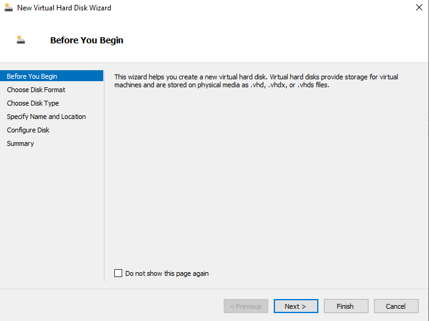
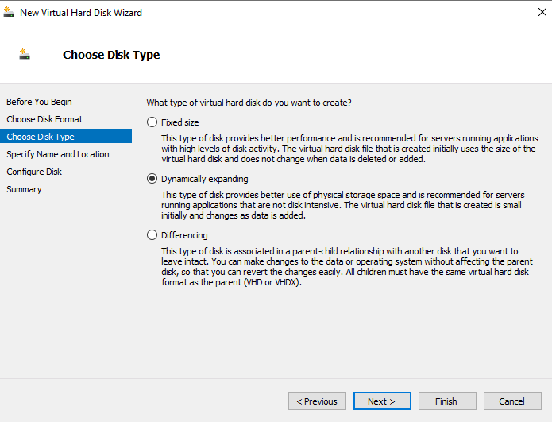
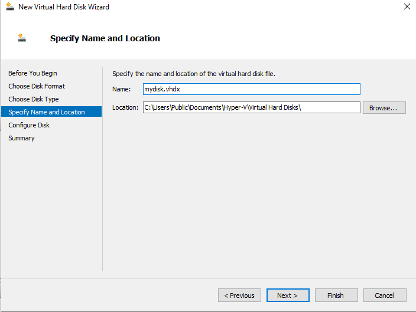
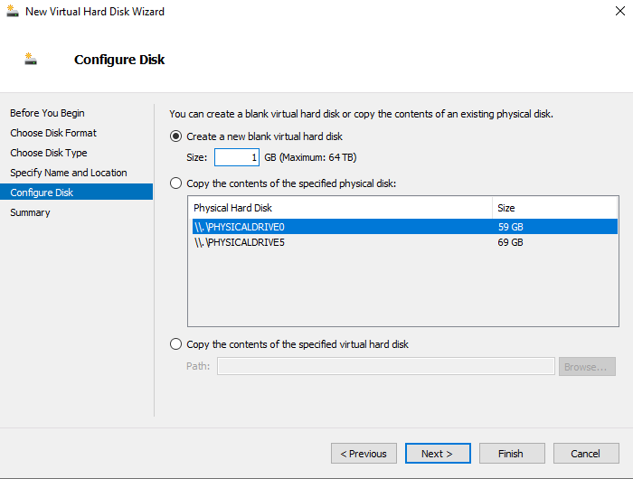
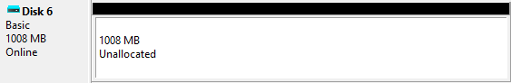
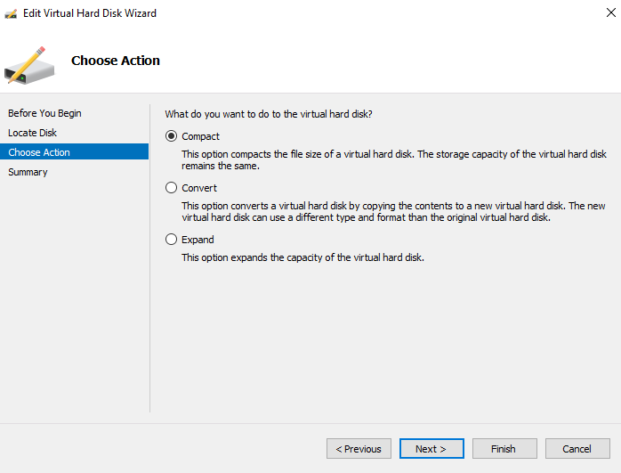
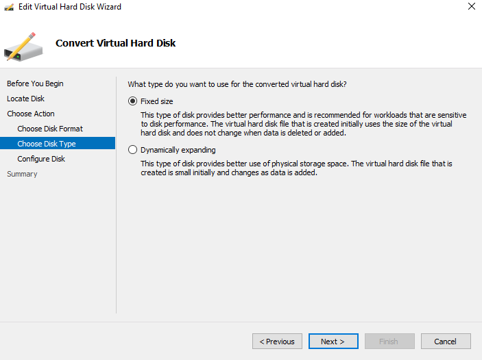

# 💾 Hyper-V Virtual Hard Disk (VHD/VHDX) Lab

> **Lab Overview:** This lab covers creating, configuring, and editing Virtual Hard Disks (VHDs) using the Hyper-V Manager on Windows Server. You will create a new VHDX using the New Virtual Hard Disk Wizard, verify its appearance in Disk Management, and then use the Edit Virtual Hard Disk Wizard to compact and convert the disk type from Dynamically Expanding to Fixed Size.

---

## 📋 Table of Contents

1. [Prerequisites](#prerequisites)
2. [Lab Topology & File Formats](#lab-topology--file-formats)
3. [Task 1 — Launch the New Virtual Hard Disk Wizard](#task-1--launch-the-new-virtual-hard-disk-wizard)
4. [Task 2 — Choose Disk Type (Dynamically Expanding)](#task-2--choose-disk-type-dynamically-expanding)
5. [Task 3 — Specify Name and Location](#task-3--specify-name-and-location)
6. [Task 4 — Configure Disk Size](#task-4--configure-disk-size)
7. [Task 5 — VHD Created and Visible in Disk Management](#task-5--vhd-created-and-visible-in-disk-management)
8. [Task 6 — Edit Virtual Hard Disk (Choose Action)](#task-6--edit-virtual-hard-disk-choose-action)
9. [Task 7 — Convert to Fixed Size](#task-7--convert-to-fixed-size)
10. [Troubleshooting](#troubleshooting)
11. [Key Concepts Summary](#key-concepts-summary)

---

## Prerequisites

| Requirement | Details |
|---|---|
| Host OS | Windows Server 2016 / 2019 / 2022 with Hyper-V role installed |
| Tool | Hyper-V Manager (`virtmgmt.msc`) |
| Storage | Sufficient free space on C: or target volume |
| Permissions | Local Administrator or Hyper-V Administrator |
| Default VHD Path | `C:\Users\Public\Documents\Hyper-V\Virtual Hard Disks\` |

---

## Lab Topology & File Formats

```
Hyper-V Host (Windows Server)
│
├── Virtual Machine
│     └── Virtual Hard Disk attached as storage
│           ├── mydisk.vhdx   ← Created in this lab (VHDX format)
│           └── (other .vhd / .vhds files)
│
└── Physical Storage
      ├── \\.\PHYSICALDRIVE0  (59 GB) — Host OS disk
      └── \\.\PHYSICALDRIVE5  (69 GB) — Available for copy/clone
```

### VHD Format Comparison

| Format | Extension | Max Size | Supports 4K Sectors | Best For |
|---|---|---|---|---|
| **VHD** | `.vhd` | 2 TB | No | Legacy VMs, older hypervisors |
| **VHDX** | `.vhdx` | 64 TB | Yes ✅ | Modern VMs (recommended) |
| **VHDS** | `.vhds` | 64 TB | Yes ✅ | Shared storage (clusters) |

---

## Task 1 — Launch the New Virtual Hard Disk Wizard

**Goal:** Open the New Virtual Hard Disk Wizard from Hyper-V Manager to begin creating a new virtual storage disk.



### Steps:

1. Open **Hyper-V Manager**:
   - Start Menu → search `Hyper-V Manager`, or
   - Run → `virtmgmt.msc`

2. In the **Actions** pane (right side), click **New → Hard Disk...**, or right-click the host server name and select **New → Hard Disk**.

3. The **New Virtual Hard Disk Wizard** opens on the **"Before You Begin"** page.

4. Review the introductory information:
   > *"This wizard helps you create a new virtual hard disk. Virtual hard disks provide storage for virtual machines and are stored on physical media as .vhd, .vhdx, or .vhds files."*

5. Optionally check **"Do not show this page again"** to skip this screen in future sessions.

6. Click **Next >** to proceed.

### Wizard Steps Overview:

```
Before You Begin
      ↓
Choose Disk Format   (VHD / VHDX / VHDS)
      ↓
Choose Disk Type     (Fixed / Dynamically Expanding / Differencing)
      ↓
Specify Name and Location
      ↓
Configure Disk       (Size or copy from physical/virtual)
      ↓
Summary → Finish
```

---

## Task 2 — Choose Disk Type (Dynamically Expanding)

**Goal:** Select **Dynamically Expanding** as the disk type to create a space-efficient virtual hard disk that grows as data is written to it.



### Steps:

> **Note:** Before this screen, you will have chosen the **Disk Format** (select **VHDX** on the previous step for modern compatibility).

1. On the **"Choose Disk Type"** page, review the three options:

| Disk Type | Description | Recommended For |
|---|---|---|
| **Fixed size** | Pre-allocates full disk size on the host immediately. Best performance; does not change when data is added/deleted. | High I/O workloads, databases, production servers |
| **Dynamically expanding** ✅ | Starts small, grows as data is added. Efficient use of storage space. | Dev/test VMs, general purpose, this lab |
| **Differencing** | Parent-child relationship with another disk. Changes written to child only; parent stays intact. Easy rollback. | Snapshots, test environments, OS templates |

2. Select **Dynamically expanding**.

3. Click **Next >**.

### Storage Usage Comparison:

```
Fixed Size (10 GB configured):
  Host file size: ████████████████████ 10 GB (immediately)

Dynamically Expanding (10 GB configured):
  Day 1:  ██ 500 MB (only what's written)
  Day 30: ████████ 4 GB (grows with usage)
  Max:    ████████████████████ 10 GB (ceiling)

Differencing (child of 10 GB parent):
  Parent: ████████████████████ 10 GB (read-only, untouched)
  Child:  ██ Only delta/changes stored
```

> **⚠️ Performance Note:** Dynamically expanding disks have slightly higher I/O overhead compared to fixed-size disks due to the expansion mechanism. For production workloads, fixed-size is preferred.

---

## Task 3 — Specify Name and Location

**Goal:** Name the virtual hard disk file and choose where it will be stored on the host.



### Steps:

1. On the **"Specify Name and Location"** page:

   | Field | Value |
   |---|---|
   | **Name** | `mydisk.vhdx` |
   | **Location** | `C:\Users\Public\Documents\Hyper-V\Virtual Hard Disks\` |

2. The **Name** field sets the filename — the `.vhdx` extension should match the format chosen earlier.

3. The **Location** defaults to the Hyper-V Virtual Hard Disks folder. Click **Browse...** to choose a custom path (e.g., a dedicated storage volume).

4. Click **Next >**.

### Best Practices for VHD Storage Location:

| Scenario | Recommendation |
|---|---|
| Development / lab | Default path is fine |
| Production VM | Dedicated storage volume (separate from OS drive) |
| High I/O workloads | SSD or NVMe-backed volume |
| Multiple VMs | Separate VHDX files per VM on different spindles |
| Backup strategy | Store on a volume included in your backup schedule |

> **💡 Tip:** Avoid storing large VHDX files on the same drive as the Windows OS (C:). This can cause performance issues and risks filling the system volume.

---

## Task 4 — Configure Disk Size

**Goal:** Set the size of the new virtual hard disk and choose how to initialize it — blank, or copied from an existing physical or virtual disk.



### Steps:

1. On the **"Configure Disk"** page, three initialization options appear:

   | Option | Description |
   |---|---|
   | **Create a new blank virtual hard disk** ✅ | Creates an empty VHDX of the specified size |
   | **Copy the contents of a specified physical disk** | Clones an entire physical drive into the VHDX |
   | **Copy the contents of a specified virtual hard disk** | Clones an existing .vhd/.vhdx file |

2. Select **"Create a new blank virtual hard disk"**.

3. Set **Size** to `1` GB (Maximum: 64 TB for VHDX).

4. Physical disks visible for copy/clone (for reference):
   - `\\.\PHYSICALDRIVE0` — 59 GB
   - `\\.\PHYSICALDRIVE5` — 69 GB

5. Click **Next >**, review the **Summary**, then click **Finish**.

### Size Planning Guide:

| VM Purpose | Recommended VHD Size |
|---|---|
| Windows Server (OS only) | 40–80 GB |
| Windows Server + roles | 80–150 GB |
| Linux server | 20–40 GB |
| Lab / test VM | 1–20 GB |
| SQL Server data disk | 50–500+ GB |

> **💡 Tip:** For dynamically expanding disks, the size you enter is the **maximum ceiling** — the file on disk only consumes space equal to what is actually written, up to this limit.

---

## Task 5 — VHD Created and Visible in Disk Management

**Goal:** Verify the newly created VHDX appears as a disk in Windows Disk Management after being attached to a VM or mounted on the host.



### Steps:

1. After the wizard completes, the VHDX file `mydisk.vhdx` is created at:
   ```
   C:\Users\Public\Documents\Hyper-V\Virtual Hard Disks\mydisk.vhdx
   ```

2. To attach the disk to the host (for inspection without a VM):
   - In **Disk Management** (`diskmgmt.msc`): Action → **Attach VHD** → browse to `mydisk.vhdx`.
   - Or in Hyper-V: assign the VHDX to a VM's SCSI/IDE controller.

3. In **Disk Management**, the disk appears as:
   ```
   Disk 6
   Basic
   1008 MB
   Online
   └── 1008 MB — Unallocated
   ```

4. The disk shows as **Basic**, **Online**, and **Unallocated** — ready to be initialized and formatted.

5. To use the disk:
   - Right-click the disk label → **Initialize Disk** (choose MBR or GPT).
   - Right-click the unallocated space → **New Simple Volume** → format as NTFS.

### Disk Status Reference:

| Status | Meaning | Action Required |
|---|---|---|
| **Online / Unallocated** | Disk attached, not yet partitioned | Initialize → Create volume |
| **Not Initialized** | New disk, no partition table | Right-click → Initialize Disk |
| **Offline** | Disk is present but not active | Right-click → Online |
| **Foreign** | Disk from another system (dynamic disk) | Right-click → Import Foreign Disk |

---

## Task 6 — Edit Virtual Hard Disk (Choose Action)

**Goal:** Use the **Edit Virtual Hard Disk Wizard** to modify an existing VHDX — choosing from Compact, Convert, or Expand operations.



### Steps:

1. In **Hyper-V Manager**, in the **Actions** pane, click **Edit Disk...**.
   - Or right-click the host → **Edit Disk...**

2. The **Edit Virtual Hard Disk Wizard** opens. Click **Next** past "Before You Begin".

3. On **Locate Disk**, browse to your VHDX file (`mydisk.vhdx`) and click **Next**.

4. On the **"Choose Action"** page, three operations are available:

| Action | Description | Use Case |
|---|---|---|
| **Compact** ✅ | Reduces the file size of a dynamically expanding VHD by removing unused zero blocks. Storage capacity stays the same. | Reclaim host disk space after deleting files inside a VM |
| **Convert** | Copies disk contents to a new VHDX of a different type or format. Source disk is not modified. | Change Dynamic → Fixed, VHD → VHDX, etc. |
| **Expand** | Increases the maximum capacity of the virtual hard disk. | Growing a disk when a VM is running low on space |

5. Select **Compact** (shown selected) to reduce the file size.

6. Click **Next >** → **Finish** to execute.

> **⚠️ Important:** The disk must be **detached from any running VM** before editing. Shut down or power off the VM first, or use the Hyper-V checkpoint/snapshot workflow.

### When to Use Each Action:

```
COMPACT  → VM had 8 GB of data, user deleted 5 GB → host file still shows 8 GB
           Compact shrinks the .vhdx file back closer to 3 GB on host

CONVERT  → You created a Dynamic disk for testing, now going to production
           Convert Dynamic → Fixed for better I/O performance

EXPAND   → VM's C: drive is 90% full and running out of space
           Expand the VHDX from 40 GB → 80 GB, then extend the partition inside the VM
```

---

## Task 7 — Convert to Fixed Size

**Goal:** Convert the `mydisk.vhdx` from **Dynamically Expanding** to **Fixed Size** for improved performance on production or high-I/O workloads.



### Steps:

1. In the **Edit Virtual Hard Disk Wizard**, on the **"Choose Action"** page, select **Convert**.

2. Click **Next >** to reach **Choose Disk Format** — keep **VHDX** (or change to VHD if needed for legacy compatibility).

3. Click **Next >** to reach **"Convert Virtual Hard Disk" — Choose Disk Type**:
   - Select **Fixed size** ✅
   - *(Alternative: Dynamically expanding — to go the other direction)*

4. Click **Next >** to reach **Configure Disk** — specify the output file path and name for the converted copy.

5. Click **Next >** → review the **Summary**:
   ```
   Operation:  Convert
   Format:     VHDX
   Type:       Fixed size
   Source:     C:\...\mydisk.vhdx  (Dynamic)
   Target:     C:\...\mydisk-fixed.vhdx  (Fixed)
   ```

6. Click **Finish** — Hyper-V copies the contents to the new fixed-size file.

### Dynamic vs Fixed — Head-to-Head:

| Attribute | Dynamically Expanding | Fixed Size |
|---|---|---|
| **Initial file size** | Small (grows over time) | Full allocated size immediately |
| **Max storage efficiency** | ✅ Better | Lower (always full size on disk) |
| **I/O Performance** | Slightly lower (overhead to expand) | ✅ Better (no expansion overhead) |
| **Predictable host storage** | No (grows unexpectedly) | ✅ Yes (always known size) |
| **Best for** | Dev/test, low-activity VMs | Production, databases, high-I/O |
| **Can compact** | ✅ Yes | No (always full size) |
| **Convert to other type** | ✅ Yes (this task) | ✅ Yes |

> **💡 Production Recommendation:** For SQL Server, Exchange, or any I/O-intensive workload, always use **Fixed size VHDX**. The upfront storage cost is worth the consistent performance.

---

## Troubleshooting

| Problem | Possible Cause | Solution |
|---|---|---|
| Wizard won't let you edit the disk | VM is running and disk is attached | Shut down the VM first, then edit |
| VHDX not visible in Disk Management | Disk not attached/mounted | Disk Management → Action → Attach VHD |
| Compact does not reduce file size | VM still has data filling the space, or disk is fixed | Delete files inside VM first, run `sdelete -z` inside VM to zero free space, then compact |
| Convert fails midway | Not enough host disk space for the target file | Ensure 2× the VHDX size is free on the target volume |
| Disk shows "Offline" after attach | SAN policy or drive letter conflict | Right-click disk → Online |
| Cannot expand a disk | Disk has snapshots/checkpoints | Remove all checkpoints before expanding |
| VHD vs VHDX confusion | Legacy VM using old format | Convert VHD → VHDX via Edit Disk wizard (Convert action) |

### Useful PowerShell Commands

```powershell
# Create a new VHDX (Dynamically Expanding, 10 GB)
New-VHD -Path "C:\VHDs\mydisk.vhdx" -SizeBytes 10GB -Dynamic

# Create a new VHDX (Fixed size, 10 GB)
New-VHD -Path "C:\VHDs\mydisk-fixed.vhdx" -SizeBytes 10GB -Fixed

# Attach a VHDX to the host (without a VM)
Mount-VHD -Path "C:\VHDs\mydisk.vhdx"

# Detach/dismount a VHDX
Dismount-VHD -Path "C:\VHDs\mydisk.vhdx"

# Compact a VHDX (must be dismounted first)
Optimize-VHD -Path "C:\VHDs\mydisk.vhdx" -Mode Full

# Convert Dynamic → Fixed
Convert-VHD -Path "C:\VHDs\mydisk.vhdx" -DestinationPath "C:\VHDs\mydisk-fixed.vhdx" -VHDType Fixed

# Expand a VHDX to 20 GB
Resize-VHD -Path "C:\VHDs\mydisk.vhdx" -SizeBytes 20GB

# Check VHDX properties
Get-VHD -Path "C:\VHDs\mydisk.vhdx" | Select-Object VhdType, FileSize, Size, MinimumSize

# Get all VHDs attached to a VM
Get-VMHardDiskDrive -VMName "MyVM"
```

---

## Key Concepts Summary

| Term | Definition |
|---|---|
| **VHD** | Virtual Hard Disk — legacy format, max 2 TB, `.vhd` extension |
| **VHDX** | Enhanced Virtual Hard Disk — modern format, max 64 TB, `.vhdx` extension |
| **VHDS** | Shared VHDX — for cluster shared storage, `.vhds` extension |
| **Fixed Size** | VHD pre-allocates full disk size on host immediately; best performance |
| **Dynamically Expanding** | VHD starts small, grows as data is written; efficient storage use |
| **Differencing** | Child VHD linked to a parent; only writes delta changes |
| **Compact** | Reduces the physical file size of a dynamic VHD by removing zero blocks |
| **Convert** | Creates a new VHD copy in a different type or format |
| **Expand** | Increases the maximum storage capacity of a VHD |
| **Optimize-VHD** | PowerShell equivalent of Compact action |
| **Mount-VHD** | Attaches a VHD to the host OS without a VM |
| **Checkpoint** | Hyper-V snapshot; creates a differencing VHD for the VM state |

---

## Full Lab Flow Diagram

```
[Task 1] Launch New VHD Wizard
         │
         ▼
[Task 2] Choose Disk Type → Dynamically Expanding
         │
         ▼
[Task 3] Name: mydisk.vhdx
         Location: C:\Users\Public\Documents\Hyper-V\Virtual Hard Disks\
         │
         ▼
[Task 4] Configure Disk → Blank, Size: 1 GB
         │
         ▼
[Task 5] VHD Created → Disk 6 (1008 MB, Unallocated) visible in Disk Management
         │
         ▼
[Task 6] Edit VHD Wizard → Choose Action: Compact / Convert / Expand
         │
         ▼
[Task 7] Convert → Fixed Size VHDX (better performance for production use)
                   └── New fixed-size copy created at specified location ✅
```

---

*Lab Environment: Windows Server 2016/2019 | Hyper-V Manager | Virtual Hard Disk Wizard*
