# 🖥️ Hyper-V Virtual Machine & Differencing Disk Lab

> **Lab Overview:** This lab covers the end-to-end process of building and managing virtual machines in Hyper-V on Windows Server. You will create a virtual switch, provision a new VM (WinServ-Core) that acts as a **parent/template**, run Sysprep to generalize it, then create **differencing child VMs** that inherit from the parent — enabling rapid VM deployment from a single base image. Finally, you will merge child changes back into the parent and manage VMs remotely via PowerShell Direct.

---

## 📋 Table of Contents

1. [Prerequisites](#prerequisites)
2. [Lab Architecture](#lab-architecture)
3. [Task 1 — Create a Virtual Switch](#task-1--create-a-virtual-switch)
4. [Task 2 — Create a New Virtual Machine (WinServ-Core)](#task-2--create-a-new-virtual-machine-winserv-core)
5. [Task 3 — Select VM Generation](#task-3--select-vm-generation)
6. [Task 4 — Assign Memory with Dynamic Memory](#task-4--assign-memory-with-dynamic-memory)
7. [Task 5 — Configure Networking](#task-5--configure-networking)
8. [Task 6 — Connect Parent Virtual Hard Disk](#task-6--connect-parent-virtual-hard-disk)
9. [Task 7 — Installation Options](#task-7--installation-options)
10. [Task 8 — Sysprep the Parent VM & Create Differencing Disk Type](#task-8--sysprep-the-parent-vm--create-differencing-disk-type)
11. [Task 9 — Differencing VHD Name and Location](#task-9--differencing-vhd-name-and-location)
12. [Task 10 — Specify Parent Disk for Differencing VHD](#task-10--specify-parent-disk-for-differencing-vhd)
13. [Task 11 — Create Child VM with Differencing VHD](#task-11--create-child-vm-with-differencing-vhd)
14. [Task 12 — Merge Child Changes Back to Parent](#task-12--merge-child-changes-back-to-parent)
15. [Task 13 — Enter Nano Server via Host PowerShell Direct](#task-13--enter-nano-server-via-host-powershell-direct)
16. [Troubleshooting](#troubleshooting)
17. [Key Concepts Summary](#key-concepts-summary)

---

## Prerequisites

| Requirement | Details |
|---|---|
| Host Server | Windows Server 2016/2019/2022 with Hyper-V role |
| Host Name | PDC16 |
| Tool | Hyper-V Manager (`virtmgmt.msc`) |
| Parent VM Name | `WinServ-Core` |
| Child VM Name | `child1` |
| Parent VHD Path | `C:\Users\Public\Documents\Hyper-V\Virtual hard disks\Parent\` |
| Child VHD Path | `C:\Users\Public\Documents\Hyper-V\Virtual hard disks\Child\` |
| OS Media | Windows Server ISO or physical DVD on drive D: |
| Admin Rights | Local Administrator or Hyper-V Administrator |

---

## Lab Architecture

```
                        PDC16 (Hyper-V Host)
                               │
                    ┌──────────┴──────────┐
                    │     EXT-SWITCH       │
                    │  (External, Gigabit) │
                    └──────────┬──────────┘
                               │ (all VMs share this NIC)
          ┌────────────────────┼────────────────────┐
          │                    │                    │
   ┌──────────────┐    ┌───────────────┐    ┌───────────────┐
   │  WinServ-Core │    │    child1     │    │   child2...   │
   │  (Parent VM)  │    │  (Child VM)  │    │  (Child VM)  │
   │  Generation 1 │    │  Gen 1       │    │  Gen 1       │
   │  1024 MB RAM  │    │  Inherits    │    │  Inherits    │
   │  127 GB VHDX  │    │  from Parent │    │  from Parent │
   └──────┬────────┘    └──────┬───────┘    └──────┬───────┘
          │                    │                    │
          ▼                    ▼                    ▼
  WinServ-Core.vhdx      child1.vhdx           child2.vhdx
  (Parent — Read Only    (Differencing —        (Differencing —
   after Sysprep)         stores only delta)     stores only delta)
          │                    │
          └────────────────────┘
            Parent-Child Relationship
```

### Differencing Disk Concept

```
Parent VHDX (Read-only base image — Sysprepped OS):
  ████████████████████  127 GB ceiling
  [OS files + drivers + roles]  ← shared by ALL child VMs

Child VHDX (Differencing — stores only changes):
  ██  Small file initially
  Grows only with writes specific to this child VM
  Reads not found in child → fetched transparently from parent
```

---

## Task 1 — Create a Virtual Switch

**Goal:** Create an **External** virtual switch named `EXT-SWITCH` to give virtual machines access to the physical network and internet through the host's NIC.

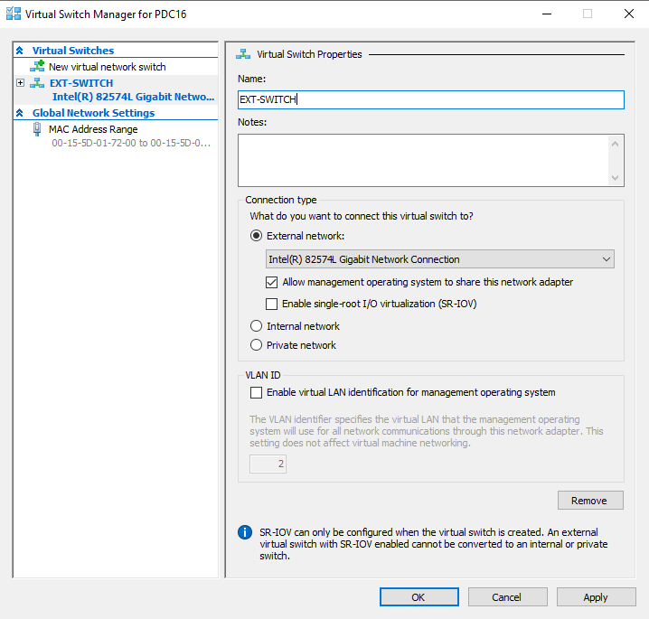

### Steps:

1. Open **Hyper-V Manager** → in the **Actions** pane, click **Virtual Switch Manager**.

2. In the left pane, click **New virtual network switch**.

3. Select **External** as the connection type → click **Create Virtual Switch**.

4. Configure the switch properties:

   | Setting | Value |
   |---|---|
   | **Name** | `EXT-SWITCH` |
   | **Connection type** | External network |
   | **Physical NIC** | Intel(R) 82574L Gigabit Network Connection |
   | **Allow management OS to share** | ✅ Checked |
   | **SR-IOV** | ☐ Unchecked (requires compatible hardware) |
   | **VLAN ID** | ☐ Unchecked (no VLAN tagging needed) |

5. Click **Apply** → accept the warning about network disruption → click **Yes**.

6. Click **OK**.

### Virtual Switch Types Compared:

| Type | VMs Can Reach | Host Can Reach VMs | Use Case |
|---|---|---|---|
| **External** ✅ | Physical network + internet | ✅ Yes | Production VMs needing internet access |
| **Internal** | Host only | ✅ Yes | Lab VMs needing host communication only |
| **Private** | Other VMs on same host | ❌ No | Isolated test networks, no host access |

> **💡 Tip:** Checking "Allow management operating system to share this network adapter" lets the Hyper-V host itself continue using the same physical NIC. Without it, the host loses network access on that interface.

---

## Task 2 — Create a New Virtual Machine (WinServ-Core)

**Goal:** Create the parent virtual machine named `WinServ-Core` using the New Virtual Machine Wizard.

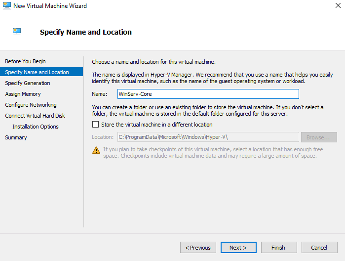

### Steps:

1. In **Hyper-V Manager**, right-click the host **PDC16** → **New → Virtual Machine**.

2. Click **Next** past "Before You Begin".

3. On **"Specify Name and Location"**:

   | Field | Value |
   |---|---|
   | **Name** | `WinServ-Core` |
   | **Store VM in different location** | ☐ Unchecked (use default) |
   | **Default location** | `C:\ProgramData\Microsoft\Windows\Hyper-V\` |

4. Click **Next**.

> **💡 Naming Convention:** Name the VM to reflect its role or OS. `WinServ-Core` clearly indicates this is a Windows Server Core installation. This name is displayed in Hyper-V Manager and used for PowerShell Direct (`-VMName`).

> **⚠️ Storage Warning:** If you plan to take checkpoints (snapshots), ensure the VM storage location has abundant free space — checkpoint files can grow very large.

---

## Task 3 — Select VM Generation

**Goal:** Choose **Generation 1** for broad OS compatibility, including 32-bit support and legacy BIOS firmware.

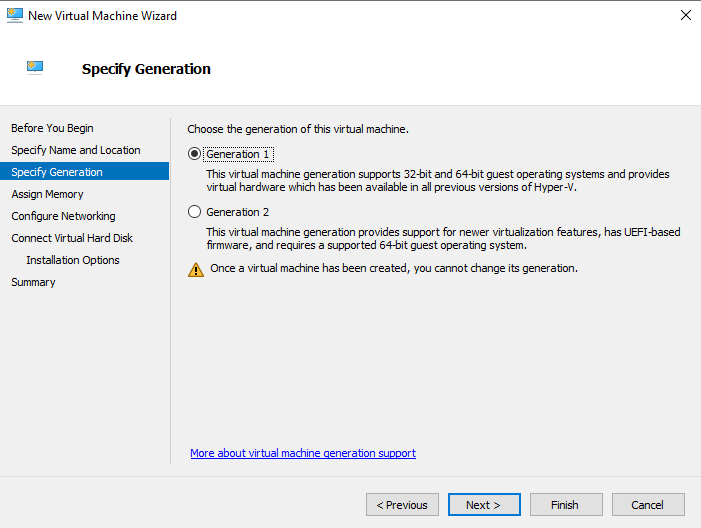

### Steps:

1. On the **"Specify Generation"** page, choose the VM generation:

| Feature | Generation 1 ✅ | Generation 2 |
|---|---|---|
| **Firmware** | Legacy BIOS | UEFI (Secure Boot capable) |
| **32-bit OS support** | ✅ Yes | ❌ No (64-bit only) |
| **Boot from** | IDE, Legacy network, Floppy | SCSI, UEFI network |
| **Disk format** | VHD or VHDX | VHDX only |
| **Secure Boot** | ❌ No | ✅ Optional |
| **Best for** | Legacy OS, Windows Server Core | Modern 64-bit Windows/Linux |

2. Select **Generation 1**.

3. Click **Next**.

> **⚠️ Critical:** Once a VM is created, **you cannot change its generation**. Choose carefully based on the OS you intend to install.

---

## Task 4 — Assign Memory with Dynamic Memory

**Goal:** Allocate startup RAM and enable **Dynamic Memory** so Hyper-V can automatically adjust RAM allocation based on the VM's actual needs.

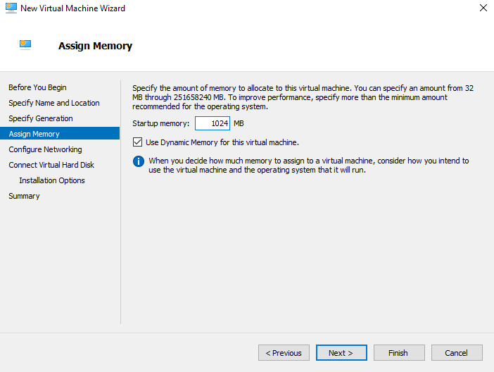

### Steps:

1. On the **"Assign Memory"** page:

   | Setting | Value |
   |---|---|
   | **Startup memory** | `1024` MB (1 GB) |
   | **Use Dynamic Memory** | ✅ Checked |

2. Click **Next**.

### Dynamic Memory Explained:

```
Without Dynamic Memory (Static):
  Host always reserves 1024 MB for this VM — even when idle
  10 VMs × 1024 MB = 10 GB RAM reserved (even if VMs use only 200 MB each)

With Dynamic Memory:
  VM starts with 1024 MB (startup memory)
  Hyper-V adjusts between Minimum RAM and Maximum RAM
  Idle VM → Hyper-V reclaims unused RAM → gives to other VMs
  Busy VM → Hyper-V adds more RAM up to the configured maximum
```

### Dynamic Memory Settings (configure via VM Settings after creation):

| Setting | Recommended Value | Description |
|---|---|---|
| **Startup Memory** | 1024 MB | RAM at boot |
| **Minimum RAM** | 512 MB | Floor — Hyper-V won't go below this |
| **Maximum RAM** | 4096 MB+ | Ceiling — VM never exceeds this |
| **Memory Buffer** | 20% | Extra RAM kept available for spikes |

> **💡 Best Practice:** Enable Dynamic Memory for all non-production and lab VMs to maximize VM density on the host. For SQL Server or Exchange, use static memory for predictability.

---

## Task 5 — Configure Networking

**Goal:** Connect the new VM's virtual NIC to the `EXT-SWITCH` virtual switch created in Task 1.

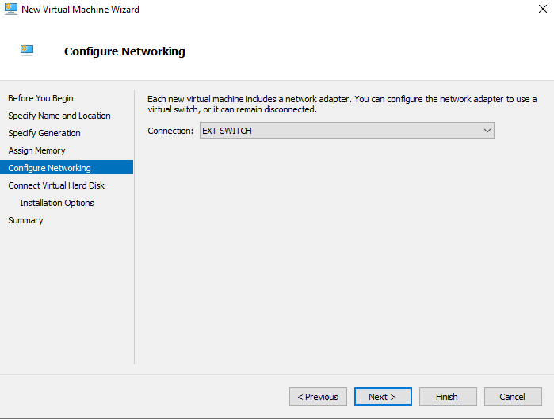

### Steps:

1. On the **"Configure Networking"** page:

   | Setting | Value |
   |---|---|
   | **Connection** | `EXT-SWITCH` |

2. Select `EXT-SWITCH` from the dropdown.

3. Click **Next**.

> **💡 Tip:** If you select "Not Connected" here, the VM will have no network access until you modify its settings later. You can always change the network connection after VM creation via VM Settings → Network Adapter.

---

## Task 6 — Connect Parent Virtual Hard Disk

**Goal:** Create a new VHDX named `WinServ-Core.vhdx` stored in the `Parent\` subfolder — this will become the **read-only base image** shared by all child differencing VMs.

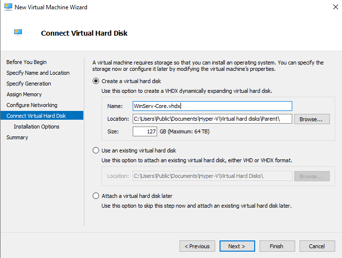

### Steps:

1. On the **"Connect Virtual Hard Disk"** page, select **Create a virtual hard disk**:

   | Field | Value |
   |---|---|
   | **Name** | `WinServ-Core.vhdx` |
   | **Location** | `C:\Users\Public\Documents\Hyper-V\Virtual hard disks\Parent\` |
   | **Size** | `127` GB (Maximum: 64 TB) |

2. Click **Browse...** to navigate to or create the `Parent\` subfolder.

3. Click **Next**.

> **💡 Why a dedicated `Parent\` folder?**
> Keeping the parent VHDX in its own folder (`Parent\`) and child VHDs in a separate `Child\` folder makes management cleaner and prevents accidental modification of the parent. It also makes backup policies easier to apply — back up `Parent\` separately.

---

## Task 7 — Installation Options

**Goal:** Specify the OS installation media source for the parent VM — in this case, a physical DVD drive.

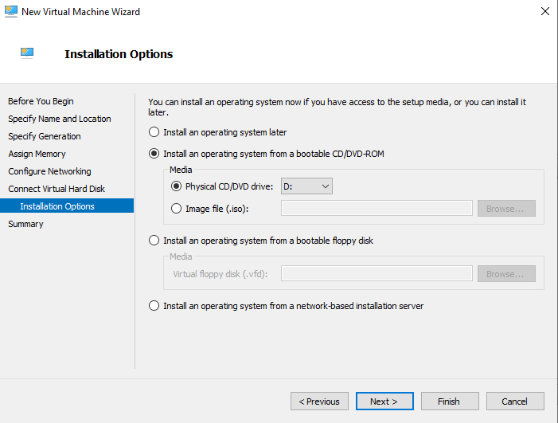

### Steps:

1. On the **"Installation Options"** page, choose the installation method:

| Option | Description | Use Case |
|---|---|---|
| Install an OS later | Skip — configure media after VM creation | When ISO isn't ready yet |
| **Install from bootable CD/DVD-ROM** ✅ | Use physical drive or ISO file | Physical DVD or mounted ISO |
| Install from bootable floppy disk | Legacy `.vfd` floppy image | Very old OS (rare) |
| Install from network-based server | PXE/WDS network boot | Enterprise mass deployment |

2. Select **"Install an operating system from a bootable CD/DVD-ROM"**.

3. Select **Physical CD/DVD drive: D:** (the host's physical DVD drive).

4. Alternatively, select **Image file (.iso)** and browse to a Windows Server ISO file.

5. Click **Next** → Review the **Summary** → click **Finish** to create the VM.

6. **Start the VM** and install Windows Server Core on `WinServ-Core.vhdx`.

---

## Task 8 — Sysprep the Parent VM & Choose Differencing Disk Type

**Goal (Part A):** After installing and configuring the Windows Server Core OS on the parent VM, run **Sysprep** to generalize it — removing machine-specific identifiers (SID, computer name, activation state) so that child VMs derived from it each get unique identities.

**Goal (Part B):** In the New Virtual Hard Disk Wizard, select **Differencing** as the disk type for child VMs.

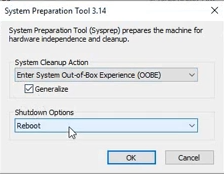
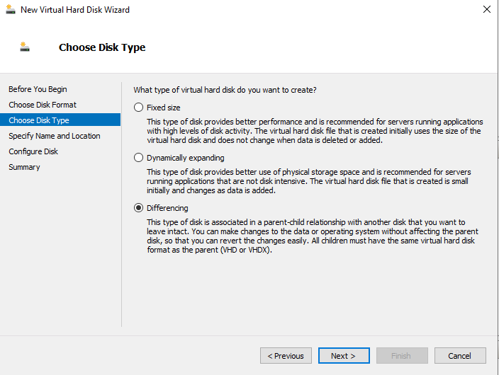

### Part A — Running Sysprep on the Parent VM:

1. Boot and log in to the **WinServ-Core** VM.

2. Open a command prompt or PowerShell and run:
   ```cmd
   C:\Windows\System32\Sysprep\sysprep.exe
   ```

3. In the **System Preparation Tool 3.14** dialog:

   | Setting | Value |
   |---|---|
   | **System Cleanup Action** | Enter System Out-of-Box Experience (OOBE) |
   | **Generalize** | ✅ Checked |
   | **Shutdown Options** | Reboot |

4. Click **OK** — the system runs Sysprep and reboots (or shuts down).

5. After Sysprep completes, **shut down the parent VM** — do not boot it again. It is now a sealed, read-only template.

> **⚠️ Critical:** Never boot the parent VM after Sysprep. Doing so will consume one of the limited Sysprep generalization cycles (Windows allows up to ~8) and may corrupt the template for child VM use. Instead, mark the VHDX as **Read-Only** via file properties.

### Part B — Select Differencing Disk Type:

When creating the child VHD via **New Virtual Hard Disk Wizard → Choose Disk Type**:

1. Select **Differencing** ✅

| Disk Type | Description |
|---|---|
| Fixed size | Pre-allocates full size; best performance |
| Dynamically expanding | Grows with data; space efficient |
| **Differencing** ✅ | Stores only changes vs. parent; multiple VMs share one base image |

2. Click **Next**.

---

## Task 9 — Differencing VHD Name and Location

**Goal:** Name the child differencing disk `child1.vhdx` and store it in the dedicated `Child\` subfolder.

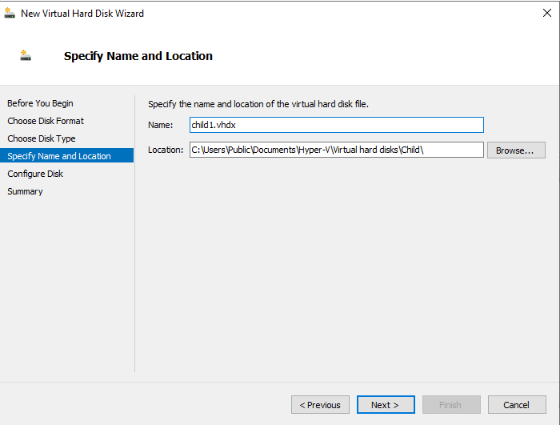

### Steps:

1. On the **"Specify Name and Location"** page of the New Virtual Hard Disk Wizard:

   | Field | Value |
   |---|---|
   | **Name** | `child1.vhdx` |
   | **Location** | `C:\Users\Public\Documents\Hyper-V\Virtual hard disks\Child\` |

2. Click **Browse...** to navigate to or create the `Child\` subfolder.

3. Click **Next**.

### Folder Structure Summary:

```
C:\Users\Public\Documents\Hyper-V\Virtual hard disks\
│
├── Parent\
│     └── WinServ-Core.vhdx   ← Read-only parent/template (Sysprepped)
│
└── Child\
      ├── child1.vhdx          ← Differencing disk for VM: child1
      ├── child2.vhdx          ← Differencing disk for VM: child2
      └── child3.vhdx          ← Differencing disk for VM: child3
```

---

## Task 10 — Specify Parent Disk for Differencing VHD

**Goal:** Link the new differencing disk (`child1.vhdx`) to its parent (`WinServ-Core.vhdx`) so reads not found in the child are fetched from the parent.


### Steps:

1. On the **"Configure Disk"** page of the Differencing Disk Wizard:

   | Field | Value |
   |---|---|
   | **Location (Parent)** | `C:\Users\Public\Documents\Hyper-V\Virtual hard disks\Parent\WinServ-Core.vhdx` |

2. Click **Browse...** to navigate to `WinServ-Core.vhdx` in the `Parent\` folder.

3. Click **Next** → review **Summary** → click **Finish**.

### How Parent-Child Reads Work:

```
child1 VM reads a file:
         │
         ▼
   Is it in child1.vhdx?
     YES → return data from child1.vhdx ✅
     NO  → transparently read from WinServ-Core.vhdx (parent) ✅

child1 VM writes a file:
         │
         ▼
   Write goes to child1.vhdx ONLY
   Parent (WinServ-Core.vhdx) is NEVER modified
```

> **⚠️ Important:** The parent VHDX path is stored **inside** the child VHDX file. If you move or rename the parent, the child disk will break. Always keep the parent in a stable location.

---

## Task 11 — Create Child VM with Differencing VHD

**Goal:** Create a new VM named `child1` using the **existing** `child1.vhdx` differencing disk (not a new blank disk).

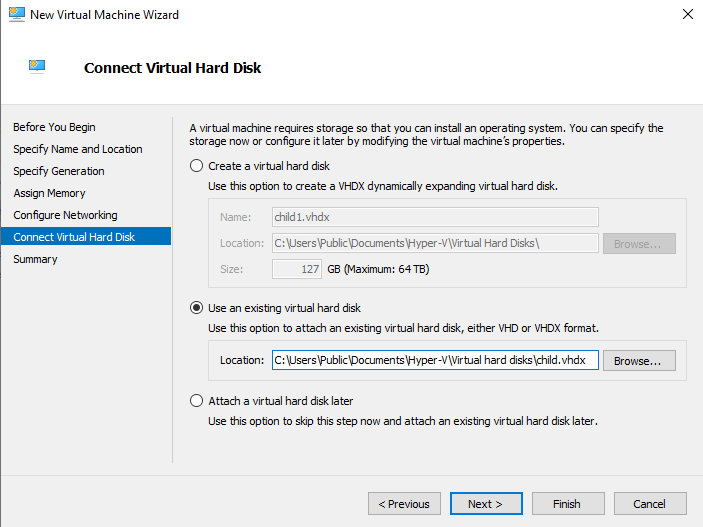

### Steps:

1. In Hyper-V Manager, create a new VM (right-click host → **New → Virtual Machine**).

2. Name: `child1`, Generation 1, Memory: 1024 MB.

3. Connect networking to `EXT-SWITCH`.

4. On the **"Connect Virtual Hard Disk"** page:
   - Select **"Use an existing virtual hard disk"** ✅
   - **Location:** `C:\Users\Public\Documents\Hyper-V\Virtual hard disks\child.vhdx`

   > **Note:** Do NOT select "Create a virtual hard disk" — you already created `child1.vhdx` with the parent link in Tasks 9–10.

5. Skip **Installation Options** (OS is inherited from parent through the differencing disk).

6. Click **Finish**.

7. **Start child1** — Windows will run through OOBE/specialization (from Sysprep) and configure a unique SID, hostname, and activation for this VM.

### Multiple Child VMs from One Parent:

```
Repeat Tasks 9–11 for each new child:
  child2.vhdx → points to WinServ-Core.vhdx → create VM: child2
  child3.vhdx → points to WinServ-Core.vhdx → create VM: child3
  ...

Host disk usage:
  WinServ-Core.vhdx: 15 GB (shared by all)
  child1.vhdx:        2 GB (only child1's changes)
  child2.vhdx:        2 GB (only child2's changes)
  child3.vhdx:        2 GB (only child3's changes)
  Total: 21 GB instead of 45 GB (3 × 15 GB) — saves ~57%
```

---

## Task 12 — Merge Child Changes Back to Parent

**Goal:** After working in a child VM, use the **Edit Virtual Hard Disk Wizard → Merge** action to write the child's changes permanently into the parent (or a new disk), consolidating the differencing chain.

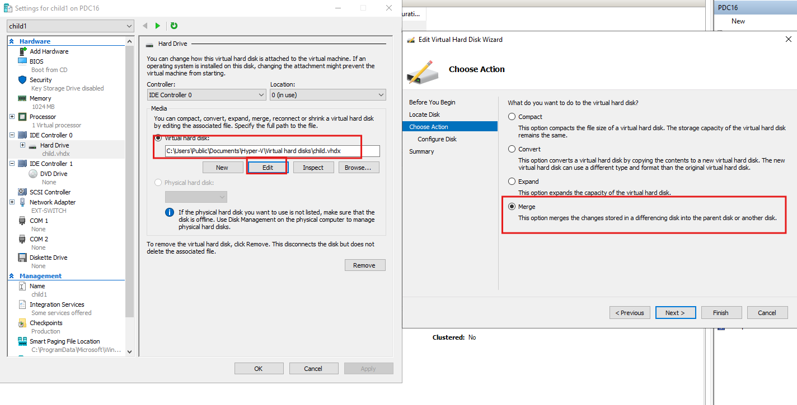
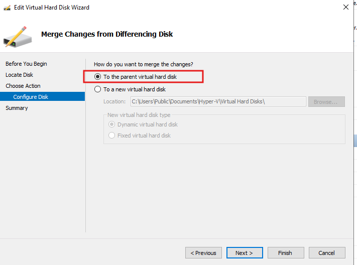

### Steps:

1. **Shut down** the child VM (`child1`) before editing its disk.

2. Open child1's **Settings** → select **Hard Drive** → click **Edit**.

   *(Or in Hyper-V Manager → Actions → Edit Disk and browse to `child1.vhdx`)*

3. In the **Edit Virtual Hard Disk Wizard**, on **"Choose Action"**:
   - Select **Merge** ✅
   - *"This option merges the changes stored in a differencing disk into the parent disk or another disk."*

4. Click **Next** to reach **"Merge Changes from Differencing Disk"**:

   | Option | Description |
   |---|---|
   | **To the parent virtual hard disk** ✅ | Writes child's delta directly into `WinServ-Core.vhdx` |
   | **To a new virtual hard disk** | Creates a standalone merged VHDX (parent + child combined) |

5. Select **"To the parent virtual hard disk"** → Click **Next** → **Finish**.

> **⚠️ Warning:** Merging to the parent **permanently modifies** `WinServ-Core.vhdx`. All other child VMs that depend on this parent will now see the merged changes. If you want to preserve the clean parent template, choose **"To a new virtual hard disk"** instead.

### Merge Strategy Guide:

| Scenario | Merge Target |
|---|---|
| Promoting child changes to all future VMs | To the parent |
| Making a standalone independent VM copy | To a new virtual hard disk |
| Preserving clean parent for future children | To a new virtual hard disk |
| Collapsing a checkpoint chain | To the parent |

---

## Task 13 — Enter Nano Server VM via Host PowerShell Direct

**Goal:** Use **PowerShell Direct** from the Hyper-V host to connect to a headless VM (e.g., Nano Server) without needing network connectivity — using only the VM bus.

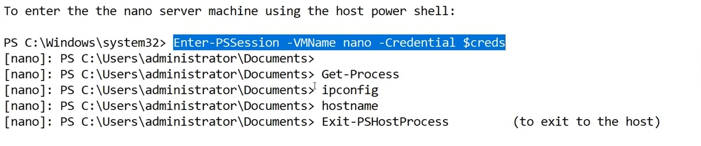

### Steps:

1. On the **Hyper-V host** (PDC16), open **PowerShell as Administrator**.

2. Store credentials for the target VM:
   ```powershell
   $creds = Get-Credential
   # Enter the VM's local administrator username and password
   ```

3. Enter a PowerShell Direct session into the VM named `nano`:
   ```powershell
   Enter-PSSession -VMName nano -Credential $creds
   ```

4. Your prompt changes to show you are inside the VM:
   ```
   [nano]: PS C:\Users\administrator\Documents>
   ```

5. Run commands inside the VM:
   ```powershell
   [nano]: PS C:\Users\administrator\Documents> Get-Process
   [nano]: PS C:\Users\administrator\Documents> ipconfig
   [nano]: PS C:\Users\administrator\Documents> hostname
   ```

6. Exit the session and return to the host:
   ```powershell
   [nano]: PS C:\Users\administrator\Documents> Exit-PSHostProcess
   # Returns to: PS C:\Windows\system32>
   ```

### PowerShell Direct vs Traditional Remoting:

| Feature | PowerShell Direct | WinRM / PS Remoting |
|---|---|---|
| **Requires network** | ❌ No — uses VM bus | ✅ Yes |
| **Requires VM IP** | ❌ No | ✅ Yes |
| **Firewall rules needed** | ❌ No | ✅ Yes (port 5985/5986) |
| **Works on Nano Server** | ✅ Yes | ✅ Yes (if configured) |
| **Works before IP is assigned** | ✅ Yes | ❌ No |
| **Host requirement** | Must run on the Hyper-V host | Any machine with network access |

### Useful PowerShell Direct Commands:

```powershell
# One-off command (no interactive session)
Invoke-Command -VMName nano -Credential $creds -ScriptBlock { ipconfig }

# Copy a file TO the VM
Copy-VMFile -Name nano -SourcePath "C:\setup.exe" -DestinationPath "C:\setup.exe" -CreateFullPath -FileSource Host

# Check VM power state
Get-VM -Name nano | Select-Object Name, State

# Start / Stop a VM
Start-VM -Name nano
Stop-VM -Name nano -Force
```

---

## Troubleshooting

| Problem | Possible Cause | Solution |
|---|---|---|
| Child VM won't boot | Parent VHDX path has changed or is missing | Inspect child VHDX with `Get-VHD`; verify parent path |
| "File in use" error when editing disk | VM is still running | Shut down the VM completely before editing its disk |
| Sysprep fails with error | VM has been generalized too many times (>8) | Rebuild the parent from scratch; use `slmgr /dlv` to check |
| Child VM shows same hostname as parent | Forgot to Sysprep before creating child | Sysprep can't recover; rebuild parent and redo |
| PowerShell Direct "access denied" | Wrong credentials | Use `Get-Credential` interactively; ensure VM is fully booted |
| Merge corrupts parent | Merged while another child VM was running | Always shut down ALL child VMs before merging to parent |
| VM won't connect to network | Wrong virtual switch selected | VM Settings → Network Adapter → change to EXT-SWITCH |
| Dynamic Memory causes instability | Min RAM too low for the workload | Raise Minimum RAM in VM Settings → Memory |

### Useful PowerShell Commands

```powershell
# List all VMs and their state
Get-VM

# Get VHD info including parent path
Get-VHD -Path "C:\...\child1.vhdx"

# Create a differencing disk via PowerShell
New-VHD -Path "C:\...\child2.vhdx" -ParentPath "C:\...\WinServ-Core.vhdx" -Differencing

# Merge child into parent
Merge-VHD -Path "C:\...\child1.vhdx" -DestinationPath "C:\...\WinServ-Core.vhdx"

# Create a new VM from an existing VHDX
New-VM -Name "child2" -Generation 1 -MemoryStartupBytes 1GB -VHDPath "C:\...\child2.vhdx" -SwitchName "EXT-SWITCH"

# Enable Dynamic Memory on a VM
Set-VMMemory -VMName "child1" -DynamicMemoryEnabled $true -MinimumBytes 512MB -MaximumBytes 4GB

# Take a checkpoint (snapshot)
Checkpoint-VM -Name "child1" -SnapshotName "Before Changes"

# PowerShell Direct - run command without interactive session
Invoke-Command -VMName "child1" -Credential (Get-Credential) -ScriptBlock { hostname; ipconfig }
```

---

## Key Concepts Summary

| Term | Definition |
|---|---|
| **Virtual Switch** | Software-defined network switch inside Hyper-V connecting VMs to each other and/or external networks |
| **External Switch** | Virtual switch bound to a physical NIC; VMs can reach the LAN and internet |
| **Generation 1 VM** | Legacy BIOS-based VM; supports 32-bit and 64-bit OS; uses IDE boot |
| **Generation 2 VM** | UEFI-based VM; 64-bit only; Secure Boot capable; SCSI boot |
| **Dynamic Memory** | Hyper-V feature that automatically adjusts RAM allocated to a VM between min and max bounds |
| **Parent VHDX** | The base/template virtual disk; read-only after Sysprep; shared by child VMs |
| **Child VHDX** | A differencing disk linked to a parent; stores only the delta (changes) |
| **Differencing Disk** | A VHD type that stores only changes relative to a parent disk |
| **Sysprep** | Windows System Preparation Tool; generalizes OS by removing unique identifiers for cloning |
| **OOBE** | Out-of-Box Experience; the first-boot setup that runs after Sysprep on a child VM |
| **Merge** | Collapses a differencing disk's changes into the parent or a new standalone disk |
| **PowerShell Direct** | Feature allowing PS remoting into a Hyper-V VM over the VM bus without network |
| **Checkpoint** | A point-in-time snapshot of a VM's state; implemented as a differencing disk chain |
| **SID** | Security Identifier — unique Windows identity; Sysprep regenerates this for each child |

---

## Full Lab Flow Diagram

```
[Task 1]  Create EXT-SWITCH (External, bound to physical NIC)
          │
          ▼
[Task 2]  New VM Wizard → Name: WinServ-Core
          │
[Task 3]  → Generation 1
          │
[Task 4]  → Memory: 1024 MB + Dynamic Memory ON
          │
[Task 5]  → Network: EXT-SWITCH
          │
[Task 6]  → Create VHDX: WinServ-Core.vhdx in Parent\ folder (127 GB)
          │
[Task 7]  → Install OS from DVD Drive D:
          │
          ▼
          Install Windows Server Core on WinServ-Core VM
          Configure roles/features as needed
          │
[Task 8]  → Run Sysprep (Generalize + OOBE + Reboot)
          → SHUT DOWN parent VM — never boot again
          │
          ▼
[Task 8]  New VHD Wizard → Disk Type: Differencing
          │
[Task 9]  → Name: child1.vhdx, Location: Child\ folder
          │
[Task 10] → Parent: WinServ-Core.vhdx in Parent\ folder
          │
[Task 11] → New VM "child1" → Use existing disk: child1.vhdx
          → Start child1 → OOBE runs → unique SID/hostname assigned ✅
          │
          [Repeat Tasks 8–11 for child2, child3, ...]
          │
[Task 12] → Edit child1.vhdx → Merge → To the parent VHD
          │
[Task 13] → PowerShell Direct: Enter-PSSession -VMName nano ✅
```

---

*Lab Environment: Windows Server 2016/2019 | Hyper-V Manager | PDC16 Host | company.local*
