# ⚖️ Network Load Balancing (NLB) Lab — Windows Server

> **Lab Overview:** This lab covers the end-to-end configuration of a **Windows Network Load Balancing (NLB) cluster** across two web servers — a GUI-based server (PDC16) and a Server Core machine (Core). NLB distributes incoming HTTP traffic across both nodes using a shared virtual **Cluster IP** (192.168.1.150), ensuring high availability and scalability for the IIS web site `web.company.local`. You will install NLB, create the cluster from the first node, join the second node, configure port rules, update IIS bindings, and register a DNS record for the cluster.

---

## 📋 Table of Contents

1. [Prerequisites](#prerequisites)
2. [Lab Topology](#lab-topology)
3. [Task 1 — Install NLB Feature on PDC16 (GUI)](#task-1--install-nlb-feature-on-pdc16-gui)
4. [Task 2 — Install NLB on Server Core via PowerShell](#task-2--install-nlb-on-server-core-via-powershell)
5. [Task 3 — Connect IIS Manager to Core Web Server (Server Name)](#task-3--connect-iis-manager-to-core-web-server-server-name)
6. [Task 4 — Connect IIS Manager to Core Web Server (Credentials)](#task-4--connect-iis-manager-to-core-web-server-credentials)
7. [Task 5 — Create New NLB Cluster (Connect to First Host)](#task-5--create-new-nlb-cluster-connect-to-first-host)
8. [Task 6 — Cluster Host Parameters (First Node)](#task-6--cluster-host-parameters-first-node)
9. [Task 7 — Add Cluster IP Address](#task-7--add-cluster-ip-address)
10. [Task 8 — Cluster Parameters (Unicast Mode)](#task-8--cluster-parameters-unicast-mode)
11. [Task 9 — Add/Edit Port Rule](#task-9--addedit-port-rule)
12. [Task 10 — Cluster Converged (First Node)](#task-10--cluster-converged-first-node)
13. [Task 11 — Add Second Host to Cluster](#task-11--add-second-host-to-cluster)
14. [Task 12 — Second Host Parameters](#task-12--second-host-parameters)
15. [Task 13 — Second Host Port Rule and Load Weight](#task-13--second-host-port-rule-and-load-weight)
16. [Task 14 — Verify Cluster IP and MAC Added to NIC](#task-14--verify-cluster-ip-and-mac-added-to-nic)
17. [Task 15 — Edit IIS Site Binding on Both Servers](#task-15--edit-iis-site-binding-on-both-servers)
18. [Task 16 — Create/Edit DNS Record for Cluster](#task-16--createedit-dns-record-for-cluster)
19. [Troubleshooting](#troubleshooting)
20. [Key Concepts Summary](#key-concepts-summary)

---

## Prerequisites

| Requirement | Details |
|---|---|
| Server 1 (GUI) | PDC16.company.local — IP: 192.168.1.2 / 192.168.1.120 |
| Server 2 (Core) | Core — IP: 192.168.1.3 |
| Cluster VIP | 192.168.1.150 (Virtual/Cluster IP — shared) |
| Cluster MAC | 02-BF-C0-A8-01-96 (auto-generated) |
| DNS Record | `web` → 192.168.1.150 (web.company.local) |
| IIS Site | Web site on both servers listening on port 80 |
| Domain | company.local |
| NLB Port | TCP/UDP 80 (HTTP) |
| Cluster Mode | Unicast |
| Affinity | None |

---

## Lab Topology

```
                        Clients
                           │
                    DNS: web.company.local
                    Resolves to 192.168.1.150
                           │
                           ▼
               ┌───────────────────────┐
               │   NLB Cluster VIP     │
               │   192.168.1.150       │
               │   MAC: 02-BF-C0-A8-.. │
               │   Port 80 (HTTP)      │
               └──────────┬────────────┘
                          │ Load balanced (50/50)
              ┌───────────┴───────────┐
              │                       │
    ┌─────────────────┐     ┌─────────────────┐
    │   Node 1: CORE  │     │   Node 2: PDC16  │
    │   Priority: 1   │     │   Priority: 2    │
    │   IP: 192.168.1.3│    │   IP: 192.168.1.2│
    │   IIS Web Server│     │   IP: 192.168.1.120│
    │   Status: Converged   │   IIS Web Server │
    └─────────────────┘     │   Status: Converged
                            └─────────────────┘

Both servers:
  - Share Cluster IP 192.168.1.150
  - Run IIS site bound to 192.168.1.150, port 80
  - Registered in DNS as web.company.local
```

### NLB Traffic Flow (Unicast Mode):

```
Client request → web.company.local → DNS → 192.168.1.150
       │
       ▼
NLB cluster receives packet at Cluster MAC 02-BF-C0-A8-01-96
       │
       ▼
NLB algorithm selects a node based on:
  - Affinity: None → pure round-robin by connection
  - Load weight: 50/50 → equal distribution
       │
       ┌──────────────┐
       │              │
    CORE (50%)    PDC16 (50%)
    processes      processes
    request        request
```

---

## Task 1 — Install NLB Feature on PDC16 (GUI)

**Goal:** Install the **Network Load Balancing** Windows feature on PDC16 using the Add Roles and Features Wizard, including the NLB management tools.

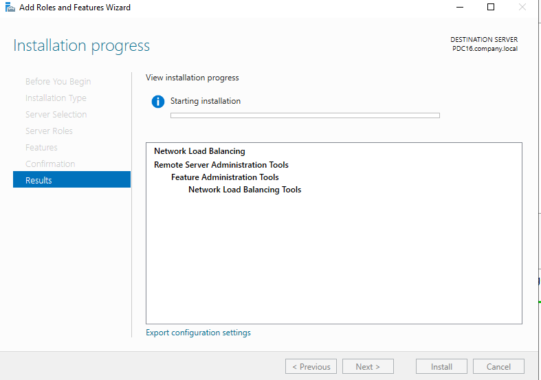

### Steps:

1. Open **Server Manager** on PDC16 → **Manage → Add Roles and Features**.

2. Proceed through the wizard:
   - **Installation Type:** Role-based or feature-based
   - **Server:** PDC16.company.local
   - **Features:** Check **Network Load Balancing**

3. On **Confirmation**, verify the features to install:
   ```
   Network Load Balancing
   Remote Server Administration Tools
     └── Feature Administration Tools
           └── Network Load Balancing Tools
   ```

4. Click **Install** and wait for completion.

5. After installation, open **NLB Manager** from:
   - Server Manager → Tools → **Network Load Balancing Manager**, or
   - Run → `nlbmgr`

### Features Installed Breakdown:

| Component | Purpose |
|---|---|
| **Network Load Balancing** | Core NLB driver — manages cluster traffic distribution |
| **NLB Tools (RSAT)** | GUI management console (`nlbmgr`) for creating and managing clusters |

> **💡 Note:** NLB must be installed on **every node** that will participate in the cluster. PDC16 uses the GUI wizard; the Core server uses PowerShell (Task 2).

---

## Task 2 — Install NLB on Server Core via PowerShell

**Goal:** Install the NLB feature on the **Server Core** node (`Core`) remotely using PowerShell, since Core has no GUI.

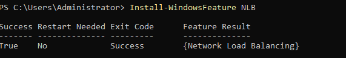

### Steps:

1. On **PDC16** (or directly on Core via console), open **PowerShell as Administrator**.

2. To install NLB locally on Core (run on Core's console):
   ```powershell
   Install-WindowsFeature NLB
   ```

3. Output confirms success:
   ```
   Success  Restart Needed  Exit Code  Feature Result
   -------  --------------  ---------  --------------
   True     No              Success    {Network Load Balancing}
   ```

4. To install remotely from PDC16 targeting Core:
   ```powershell
   Install-WindowsFeature -ComputerName Core -Name NLB
   ```

5. To also include management tools:
   ```powershell
   Install-WindowsFeature NLB, RSAT-NLB
   ```

### PowerShell vs GUI Installation:

| Method | Use Case | Requires GUI |
|---|---|---|
| `Install-WindowsFeature` | Server Core, automation, remote install | ❌ No |
| Server Manager Wizard | GUI servers, visual confirmation | ✅ Yes |
| Remote via Server Manager | Managing Core from a GUI server | ✅ On management machine |

> **💡 Tip:** `Restart Needed: No` means the NLB feature does not require a reboot — the cluster can be configured immediately after installation.

---

## Task 3 — Connect IIS Manager to Core Web Server (Server Name)

**Goal:** Use **IIS Manager** on PDC16 to remotely connect to and manage the IIS installation on the Core server, so you can configure the web site on both nodes from one interface.

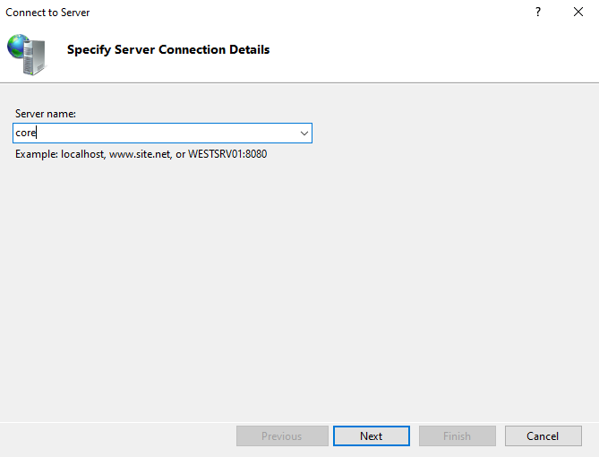

### Steps:

1. Open **IIS Manager** (`inetmgr`) on PDC16.

2. In the **Connections** pane (left side), right-click the root → **Connect to a Server...** (or click the "Connect to a server" link).

3. In the **"Specify Server Connection Details"** dialog:
   - **Server name:** `core`

4. Click **Next** to proceed to credentials.

> **💡 Tip:** You can use the server's hostname (`core`), FQDN (`core.company.local`), or IP address (`192.168.1.3`). The hostname is simplest if DNS resolution is working.

> **⚠️ Prerequisite:** The **Web Management Service** (`WMSvc`) must be running on the Core server for remote IIS management. Enable it on Core with:
> ```powershell
> Install-WindowsFeature Web-Mgmt-Service
> Set-ItemProperty -Path HKLM:\SOFTWARE\Microsoft\WebManagement\Server -Name EnableRemoteManagement -Value 1
> Start-Service WMSvc
> Set-Service WMSvc -StartupType Automatic
> ```

---

## Task 4 — Connect IIS Manager to Core Web Server (Credentials)

**Goal:** Provide administrator credentials for the Core server to authenticate the remote IIS Manager connection.

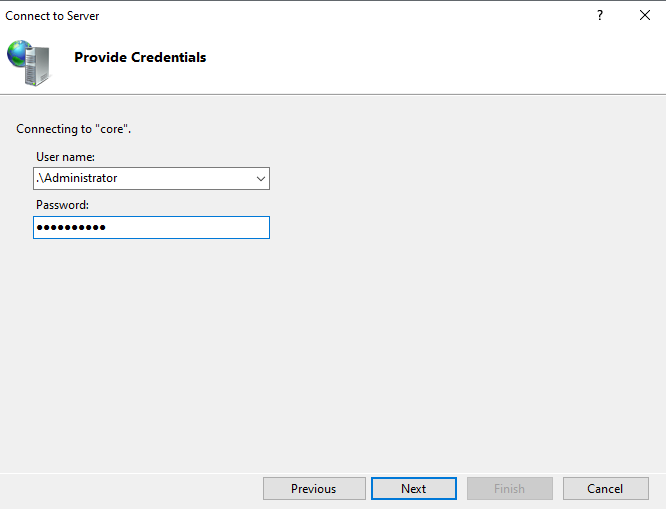

### Steps:

1. On the **"Provide Credentials"** page:

   | Field | Value |
   |---|---|
   | **User name** | `.\Administrator` |
   | **Password** | (Core's local Administrator password) |

2. The `.\` prefix means the **local** Administrator account on Core (not a domain account).

3. Click **Next** → confirm the server certificate if prompted → click **Finish**.

4. Core's IIS instance now appears in the IIS Manager **Connections** tree, allowing you to manage its sites, app pools, and bindings remotely.

> **💡 Credential Format Options:**
> - `.\Administrator` — local admin on Core
> - `COMPANY\Administrator` — domain admin (requires Core to be domain-joined)
> - `core\Administrator` — explicit local account reference

---

## Task 5 — Create New NLB Cluster (Connect to First Host)

**Goal:** Launch the **New Cluster Wizard** in NLB Manager and connect to the **Core** server (192.168.1.3) as the first host of the new cluster, selecting its network interface.

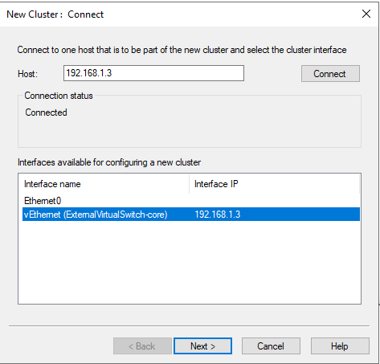

### Steps:

1. Open **NLB Manager** (`nlbmgr`) on PDC16.

2. In the menu, click **Cluster → New** (or right-click the NLB Manager node → **New Cluster**).

3. In the **"New Cluster: Connect"** dialog:
   - **Host:** `192.168.1.3` (Core server's IP)
   - Click **Connect**
   - Connection status: **Connected** ✅

4. Under **Interfaces available for configuring a new cluster**, select:
   - `vEthernet (ExternalVirtualSwitch-core)` — Interface IP: `192.168.1.3`

5. Click **Next >**.

> **💡 Why connect to Core first?** The first host you connect to becomes the **primary host** (Priority 1) and is used to define the initial cluster configuration. You then add additional hosts in later steps.

> **⚠️ Important:** Select the correct NIC. If the server has multiple network adapters, choose the one connected to the network that clients will use to reach the cluster VIP. Do **not** use a management-only or heartbeat NIC for the NLB interface.

---

## Task 6 — Cluster Host Parameters (First Node)

**Goal:** Configure the **host-specific parameters** for the first node (Core) — primarily its priority in the cluster.


### Steps:

> *(Host parameters are shown in the NLB host configuration table after the cluster converges — see Task 10 for the visual confirmation.)*

The key parameters set for the first host are:

| Parameter | Value | Description |
|---|---|---|
| **Host (Interface)** | CORE (vEthernet ExternalVirt...) | The NIC used for cluster traffic |
| **Dedicated IP address** | 192.168.1.3 | Core's own (non-cluster) IP |
| **Dedicated IP subnet mask** | 255.255.255.0 | /24 subnet |
| **Host priority** | `1` | Lowest number = highest priority; this host handles traffic when it's the sole active node |
| **Initial host state** | Started | Automatically joins cluster on boot |

> **💡 Host Priority vs Load Weight:**
> - **Priority** is the tiebreaker — if two hosts are equally loaded, the lower-priority number handles the traffic for single-host rules.
> - **Load weight** (set in port rules) determines the percentage of traffic distributed to each host.

---

## Task 7 — Add Cluster IP Address

**Goal:** Define the **Virtual IP (VIP)** — the shared cluster IP address that all clients use to reach the NLB cluster, regardless of which physical server handles the request.

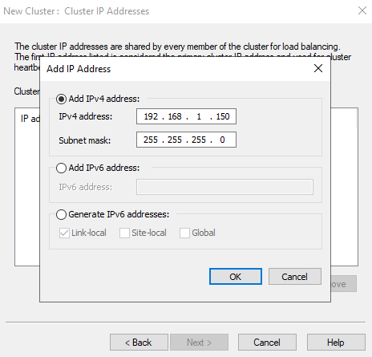

### Steps:

1. On the **"New Cluster: Cluster IP Addresses"** page, click **Add**.

2. In the **"Add IP Address"** dialog:

   | Field | Value |
   |---|---|
   | **Add IPv4 address** | ⦿ Selected |
   | **IPv4 address** | `192.168.1.150` |
   | **Subnet mask** | `255.255.255.0` |

3. Click **OK** → the VIP appears in the cluster IP list.

4. Click **Next >**.

### Cluster IP vs Dedicated IP:

```
                   192.168.1.150  ← Cluster VIP (shared by ALL nodes)
                        │
          ┌─────────────┴─────────────┐
          │                           │
   192.168.1.3                 192.168.1.2 / .120
   (Core's Dedicated IP)       (PDC16's Dedicated IPs)
   ← Only Core uses this       ← Only PDC16 uses these
```

> **💡 Important:** The cluster VIP (192.168.1.150) is added as an **additional IP** to each node's NIC — it does not replace the existing dedicated IP. Both IPs coexist on the same NIC (visible in Task 14).

---

## Task 8 — Cluster Parameters (Unicast Mode)

**Goal:** Set the cluster-wide parameters including the **Full Internet Name** and **operation mode** (Unicast vs Multicast).

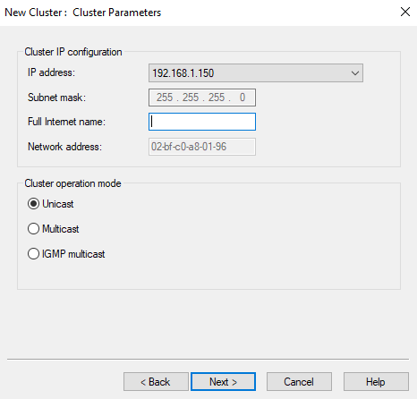

### Steps:

1. On the **"New Cluster: Cluster Parameters"** page:

   | Setting | Value |
   |---|---|
   | **IP address** | `192.168.1.150` |
   | **Subnet mask** | `255.255.255.0` |
   | **Full Internet name** | *(leave blank or enter `web.company.local`)* |
   | **Network address (MAC)** | `02-bf-c0-a8-01-96` (auto-generated) |
   | **Cluster operation mode** | ⦿ Unicast |

2. Click **Next >**.

### Cluster Operation Modes Compared:

| Mode | Description | MAC Behavior | Limitation |
|---|---|---|---|
| **Unicast** ✅ | All nodes share the same cluster MAC. Host NICs lose their original MAC for intra-cluster communication. | All use cluster MAC | Nodes can't communicate with each other over NLB NIC — need 2nd NIC for management |
| **Multicast** | Cluster uses a multicast MAC; nodes keep their original MACs | Nodes keep own MAC + cluster MAC | Requires router to support multicast ARP |
| **IGMP Multicast** | Like multicast but uses IGMP; switches learn which ports to forward cluster traffic to | Same as multicast | Requires IGMP-capable switches |

> **⚠️ Unicast limitation:** In Unicast mode, NLB nodes **cannot communicate with each other** through the cluster NIC (they'd send traffic to themselves). For this lab, a second NIC or the same switched network is used for inter-node communication (e.g., PDC16 managing Core).

---

## Task 9 — Add/Edit Port Rule

**Goal:** Define a **port rule** that tells NLB how to distribute traffic on port 80 (HTTP) to cluster members.

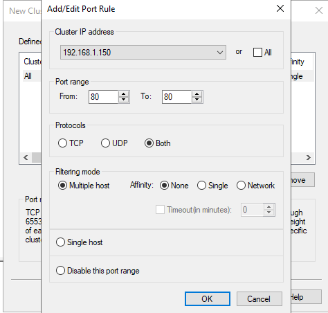

### Steps:

1. On the **"New Cluster: Port Rules"** page, click **Edit** (or **Add** to create a new rule).

2. In the **"Add/Edit Port Rule"** dialog:

   | Setting | Value | Description |
   |---|---|---|
   | **Cluster IP address** | `192.168.1.150` | Apply this rule to the VIP |
   | **Port range: From** | `80` | Start of port range |
   | **Port range: To** | `80` | End of port range (single port) |
   | **Protocols** | Both (TCP + UDP) | Handle both protocol types |
   | **Filtering mode** | ⦿ Multiple host | Distribute across all cluster nodes |
   | **Affinity** | ⦿ None | No session stickiness — true round-robin |
   | **Load weight** | `50` (Equal) | Each node handles 50% of traffic |

3. Click **OK** → **Finish** to create the cluster.

### Affinity Options Explained:

| Affinity | Behavior | Use Case |
|---|---|---|
| **None** ✅ | Each request can go to any node — no session tracking | Stateless apps, static websites |
| **Single** | All requests from a single client IP go to the same node | Apps requiring session persistence |
| **Network** | Requests from the same /24 subnet go to the same node | Multi-tier apps with NAT/proxy |

### Filtering Mode Options:

| Mode | Description |
|---|---|
| **Multiple host** ✅ | Traffic distributed across all cluster nodes (load balancing) |
| **Single host** | All traffic for this port goes to the highest-priority available node (failover only) |
| **Disable this port range** | Block this port range for the cluster |

---

## Task 10 — Cluster Converged (First Node)

**Goal:** Verify the NLB cluster has successfully initialized with Core as the first node, showing status **Converged**.

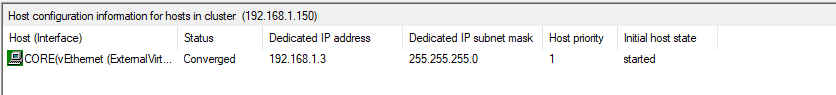

### Steps:

1. After the cluster is created, NLB Manager shows the **host configuration** table for cluster `192.168.1.150`:

   | Host (Interface) | Status | Dedicated IP | Subnet Mask | Host Priority | Initial State |
   |---|---|---|---|---|---|
   | CORE (vEthernet ExternalVirt...) | **Converged** | 192.168.1.3 | 255.255.255.0 | 1 | Started |

2. **Converged** = the cluster is fully operational and this node is actively handling traffic.

### NLB Node Status Reference:

| Status | Meaning |
|---|---|
| **Converged** ✅ | Node is active and participating in the cluster |
| **Converging** | Node is in the process of joining or rejoining the cluster |
| **Stopped** | Node is not participating (manually stopped or service not started) |
| **Drainstop** | Node is gracefully finishing existing connections before stopping |
| **Unknown** | NLB Manager cannot reach the node |

> **💡 Converged vs Converging:** "Converging" is a transient state — NLB nodes exchange heartbeat messages to agree on cluster membership. Once all nodes agree, status becomes "Converged." This typically takes 5–10 seconds.

---

## Task 11 — Add Second Host to Cluster

**Goal:** Add **PDC16** (192.168.1.2) as the second node to the existing NLB cluster.

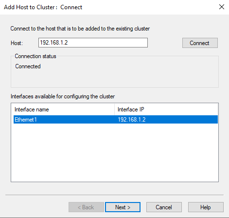

### Steps:

1. In **NLB Manager**, right-click the cluster (`192.168.1.150`) → **Add Host to Cluster**.

2. In the **"Add Host to Cluster: Connect"** dialog:
   - **Host:** `192.168.1.2`
   - Click **Connect**
   - Connection status: **Connected** ✅

3. Under **Interfaces available for configuring the cluster**, select:
   - `Ethernet1` — Interface IP: `192.168.1.2`

4. Click **Next >**.

> **⚠️ NLB must already be installed on PDC16** (done in Task 1) before it can join the cluster. If NLB is not installed, the connection will succeed but cluster configuration will fail.

---

## Task 12 — Second Host Parameters

**Goal:** Configure PDC16's host-specific parameters when joining the cluster — particularly its **priority** (2) and **dedicated IP addresses**.

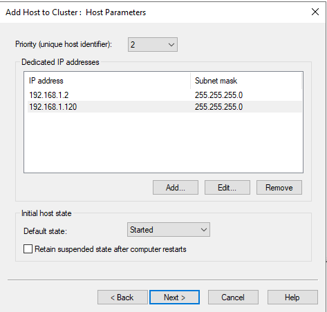

### Steps:

1. On the **"Add Host to Cluster: Host Parameters"** page:

   | Setting | Value |
   |---|---|
   | **Priority (unique host identifier)** | `2` |
   | **Dedicated IP addresses** | 192.168.1.2 / 255.255.255.0 |
   |  | 192.168.1.120 / 255.255.255.0 |
   | **Initial host state** | Started |
   | **Retain suspended state after restart** | ☐ Unchecked |

2. Click **Next >**.

### Host Priority Rules:

```
Priority 1 = CORE      → Handles all traffic if it's the only active node
Priority 2 = PDC16     → Handles all traffic if CORE goes offline
            (higher number = lower priority)

With BOTH nodes converged:
  Traffic is distributed by LOAD WEIGHT in the port rule (50/50)
  Priority only matters for "Single host" port rules or failover scenarios
```

> **💡 Dedicated IPs:** PDC16 has two dedicated IPs (192.168.1.2 and 192.168.1.120) because it may have multiple NICs or multiple IP addresses assigned. Both are listed in the NLB host parameters. The cluster VIP (192.168.1.150) is added separately and shared.

---

## Task 13 — Second Host Port Rule and Load Weight

**Goal:** Configure the **port rule** for PDC16 — setting its load weight to **50** so it handles an equal share (50%) of the cluster's HTTP traffic.

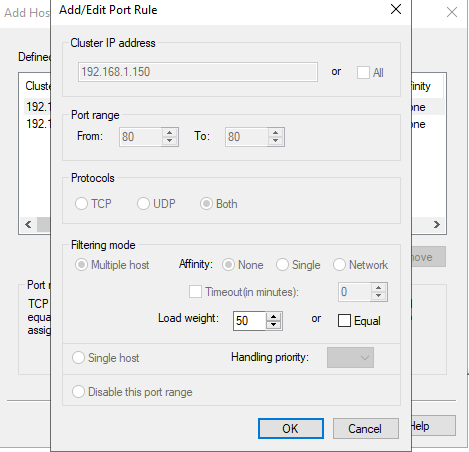

### Steps:

1. On the **"Add Host to Cluster: Port Rules"** page, click **Edit**.

2. In the **"Add/Edit Port Rule"** dialog:

   | Setting | Value |
   |---|---|
   | **Cluster IP** | 192.168.1.150 |
   | **Port range** | 80 → 80 |
   | **Protocols** | Both |
   | **Filtering mode** | Multiple host |
   | **Affinity** | None |
   | **Load weight** | `50` |

3. Click **OK** → **Finish**.

4. NLB Manager triggers re-convergence — both nodes rejoin the cluster with the updated configuration.

### Load Weight Distribution Examples:

| Node | Load Weight | Traffic Share |
|---|---|---|
| CORE | 50 | 50% |
| PDC16 | 50 | 50% ← Equal distribution |
| **Total** | **100** | **100%** |

| Node | Load Weight | Traffic Share |
|---|---|---|
| CORE | 70 | 70% |
| PDC16 | 30 | 30% ← Weighted (e.g., Core is more powerful) |

> **💡 Equal checkbox:** You can check the **"Equal"** checkbox instead of manually entering 50/50 — NLB automatically distributes load equally among all nodes in the cluster.

---

## Task 14 — Verify Cluster IP and MAC Added to NIC

**Goal:** Confirm that the NLB cluster VIP (192.168.1.150) and the cluster MAC address have been automatically added to the server's network adapter properties.

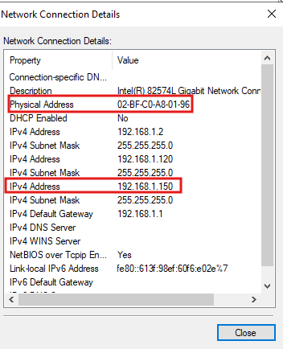

### Steps:

1. On **PDC16**, open **Network Connections** (`ncpa.cpl`).

2. Right-click the NIC used for NLB → **Status → Details**.

3. In the **Network Connection Details** dialog, verify:

   | Property | Value |
   |---|---|
   | **Physical Address (MAC)** | `02-BF-C0-A8-01-96` ← Cluster MAC (replaced original) |
   | **IPv4 Address** | `192.168.1.2` (dedicated) |
   | **IPv4 Address** | `192.168.1.120` (secondary dedicated) |
   | **IPv4 Address** | `192.168.1.150` ← **Cluster VIP added automatically** |

4. The **cluster MAC** replaces the NIC's physical MAC in Unicast mode — this is expected and normal.

### What NLB Does to the NIC:

```
Before NLB:
  Physical MAC: 00-15-5D-01-72-00
  IP: 192.168.1.2

After NLB (Unicast):
  Physical MAC: 02-BF-C0-A8-01-96  ← Replaced by cluster MAC
  IP1: 192.168.1.2                  ← Dedicated IP (unchanged)
  IP2: 192.168.1.120                ← Secondary dedicated (unchanged)
  IP3: 192.168.1.150                ← Cluster VIP (added by NLB)
```

> **⚠️ Important:** In Unicast mode, the NIC MAC is replaced by the cluster MAC. This means the node **cannot directly communicate with other cluster nodes** through this NIC (since all nodes share the same MAC, the switch can't differentiate them). Use a secondary NIC for management traffic between nodes if needed.

---

## Task 15 — Edit IIS Site Binding on Both Servers

**Goal:** Update the IIS website binding on **both servers** (Core and PDC16) to use the **Cluster VIP** (192.168.1.150) and hostname `web.company.local` — so only NLB-destined traffic reaches the site.

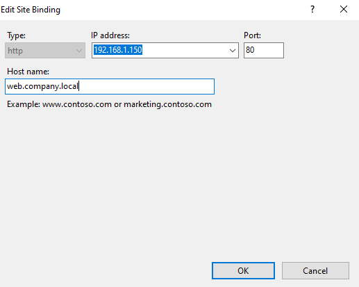

### Steps (repeat on both servers):

1. Open **IIS Manager** → expand the server → **Sites** → select the web site.

2. In the **Actions** pane → click **Bindings** → select the existing HTTP binding → click **Edit**.

3. In the **"Edit Site Binding"** dialog:

   | Field | Value |
   |---|---|
   | **Type** | `http` |
   | **IP address** | `192.168.1.150` (Cluster VIP) |
   | **Port** | `80` |
   | **Host name** | `web.company.local` |

4. Click **OK** → **Close**.

5. Repeat **identically** on the second server (via remote IIS Manager connection from Task 3–4).

### Why Bind to the Cluster IP?

```
Before binding change:
  Site listens on: All Unassigned (0.0.0.0:80)
  Problem: Any request to any IP on port 80 hits this site

After binding change:
  Site listens on: 192.168.1.150:80 (host: web.company.local)
  Result: Only traffic via the NLB cluster VIP reaches this site ✅
  Direct requests to 192.168.1.3 or 192.168.1.2 are NOT served (security ✅)
```

> **⚠️ Critical:** Both servers must have **identical** bindings (same cluster IP, same port, same hostname). If they differ, clients may get inconsistent responses depending on which node handles their request.

---

## Task 16 — Create/Edit DNS Record for Cluster

**Goal:** Create a DNS **Host (A) record** named `web` pointing to the **Cluster VIP** (192.168.1.150) in the `company.local` forward lookup zone, so clients can resolve `web.company.local` to the NLB cluster.

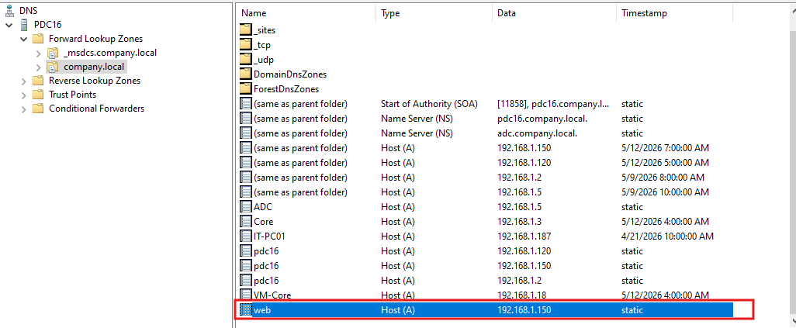

### Steps:

1. Open **DNS Manager** (`dnsmgmt.msc`) on PDC16.

2. Expand **PDC16 → Forward Lookup Zones → company.local**.

3. Right-click the zone → **New Host (A or AAAA)**.

4. Enter:
   | Field | Value |
   |---|---|
   | **Name** | `web` |
   | **IP address** | `192.168.1.150` |
   | **Create associated PTR record** | ☐ Optional |

5. Click **Add Host** → **Done**.

6. Verify the record appears in DNS Manager:
   ```
   web    Host (A)    192.168.1.150    static
   ```

### DNS Records Visible in company.local Zone:

| Name | Type | Data | Notes |
|---|---|---|---|
| (same as parent) | SOA | pdc16.company.local | Domain authority |
| (same as parent) | NS | pdc16.company.local | Primary DNS |
| (same as parent) | NS | adc.company.local | Secondary DNS |
| (same as parent) | A | 192.168.1.150 | Root zone → Cluster VIP |
| ADC | A | 192.168.1.5 | ADC server |
| Core | A | 192.168.1.3 | Core server |
| pdc16 | A | 192.168.1.120 | PDC16 primary IP |
| pdc16 | A | 192.168.1.150 | PDC16 → Cluster VIP |
| pdc16 | A | 192.168.1.2 | PDC16 secondary |
| **web** | **A** | **192.168.1.150** | **← NLB Cluster VIP** |

### Test Resolution from Client:

```powershell
# Test DNS resolution
Resolve-DnsName web.company.local

# Test HTTP connectivity to cluster
Invoke-WebRequest -Uri "http://web.company.local" -UseBasicParsing

# Test from command line
nslookup web.company.local
curl http://web.company.local
```

---

## Troubleshooting

| Problem | Possible Cause | Solution |
|---|---|---|
| Nodes stuck in "Converging" | Firewall blocking NLB heartbeat (UDP 1717) | Allow UDP port 1717 between nodes; or disable Windows Firewall temporarily to test |
| Node shows "Unknown" in NLB Manager | NLB service not running on that node | Run `net start NLB` or `Start-Service nlb` on the node |
| Cluster MAC conflict on switch | Unicast mode causing MAC table issues | Switch to Multicast mode, or add a static ARP entry on the switch |
| IIS site not responding on cluster IP | Binding not updated on one node | Verify binding on BOTH nodes matches Cluster VIP + hostname |
| DNS not resolving web.company.local | Record missing or wrong IP | Check DNS A record for `web`; verify it points to 192.168.1.150 |
| One node handling all traffic | Affinity set to Single, or load weights unequal | Check port rule: set Affinity=None and Load weight=Equal/50 |
| Cluster VIP not added to NIC | NLB installation incomplete | Reinstall NLB on the affected node; check Event Viewer |
| Remote IIS Manager can't connect to Core | WMSvc not running | `Start-Service WMSvc` on Core; verify firewall allows TCP 8172 |

### Useful PowerShell & Commands

```powershell
# Install NLB feature
Install-WindowsFeature NLB

# Install NLB remotely on Core
Install-WindowsFeature -ComputerName Core -Name NLB

# View NLB cluster status via PowerShell
Get-NlbCluster
Get-NlbClusterNode

# Start NLB cluster node
Start-NlbClusterNode -HostName Core

# Stop NLB cluster node (graceful drain)
Stop-NlbClusterNode -HostName PDC16 -Drain

# Suspend a node
Suspend-NlbClusterNode -HostName PDC16

# Resume a node
Resume-NlbClusterNode -HostName PDC16

# View NLB port rules
Get-NlbClusterPortRule

# Add a port rule
Add-NlbClusterPortRule -IP 192.168.1.150 -StartPort 80 -EndPort 80 -Protocol Both -Mode Multiple -Affinity None

# Check NLB service
Get-Service nlb
net start nlb

# Test site from client
Invoke-WebRequest http://web.company.local -UseBasicParsing

# Check which node handled request (if pages differ)
# Add server name to each site's default page for testing
```

---

## Key Concepts Summary

| Term | Definition |
|---|---|
| **NLB** | Network Load Balancing — Windows Server feature distributing network traffic across multiple servers |
| **Cluster VIP** | Virtual IP address shared by all NLB nodes; clients connect to this IP |
| **Dedicated IP** | Each node's own unique IP address (not shared); used for direct node management |
| **Cluster MAC** | Shared MAC address assigned to all nodes in Unicast mode (auto-generated) |
| **Converged** | NLB status indicating all nodes agree on cluster membership and are actively load balancing |
| **Unicast mode** | All nodes share one cluster MAC; nodes cannot communicate with each other over the NLB NIC |
| **Multicast mode** | Nodes keep their own MAC plus receive cluster MAC as multicast; nodes can communicate |
| **Host Priority** | Unique number per node; lower = higher priority for single-host port rules and failover |
| **Load Weight** | Percentage of traffic assigned to a specific node in a multiple-host port rule |
| **Affinity** | Session persistence setting: None (round-robin), Single (client IP), Network (/24 subnet) |
| **Port Rule** | Defines which ports/protocols are load-balanced and how (Multiple host, Single host, etc.) |
| **Heartbeat** | UDP traffic exchanged between NLB nodes to detect membership changes |
| **WMSvc** | Web Management Service — enables remote IIS Manager connections to Server Core |

---

## Full Lab Flow Diagram

```
[Task 1]  Install NLB feature on PDC16 (GUI wizard)
          │
[Task 2]  Install NLB on Core (PowerShell: Install-WindowsFeature NLB)
          │
[Task 3]  IIS Manager → Connect to Server → "core"
[Task 4]  Credentials: .\Administrator + password → remote IIS access to Core ✅
          │
[Task 5]  NLB Manager → New Cluster → Connect to 192.168.1.3 (Core)
          │             Select interface: vEthernet (ExternalVirtualSwitch-core)
[Task 6]  Host Parameters: Priority=1, Dedicated IP=192.168.1.3
          │
[Task 7]  Cluster IP: Add 192.168.1.150 / 255.255.255.0
          │
[Task 8]  Cluster Parameters: Unicast, MAC=02-BF-C0-A8-01-96
          │
[Task 9]  Port Rule: Port 80, Both protocols, Multiple host, Affinity=None, Weight=50
          │
[Task 10] Core node → Status: Converged ✅ (single-node cluster running)
          │
[Task 11] NLB Manager → Add Host to Cluster → Connect to 192.168.1.2 (PDC16)
[Task 12] Host Parameters: Priority=2, Dedicated IPs: 192.168.1.2 + .120
[Task 13] Port Rule: Port 80, Load weight=50 → Finish → Both nodes converge
          │
[Task 14] Verify on PDC16 NIC: Cluster MAC + 192.168.1.150 added ✅
          │
[Task 15] IIS on CORE: Binding → 192.168.1.150:80, host: web.company.local
          IIS on PDC16: Binding → 192.168.1.150:80, host: web.company.local ✅
          │
[Task 16] DNS Manager → company.local → New Host (A): web → 192.168.1.150
          Client: http://web.company.local → NLB → CORE or PDC16 (50/50) ✅
```

---

*Lab Environment: Windows Server 2016/2019 | Network Load Balancing | PDC16 + Core | company.local*
